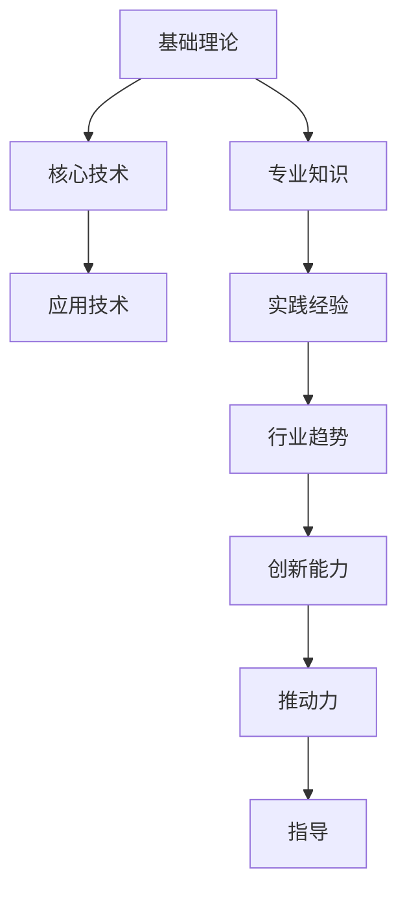

                 

关键词：技术知识、行业经验、专业能力、知识体系、技能传承、创新应用、发展挑战。

> 摘要：本文深入探讨了行业Know-how的重要性。从技术知识、行业经验、专业能力的层面出发，分析其对于个人职业发展和企业竞争力的关键作用。同时，文章还探讨了知识体系构建、技能传承、创新应用等方面的实践与挑战，为读者提供了行业发展的启示。

## 1. 背景介绍

随着信息技术的迅猛发展，各行各业对技术人才的需求日益增加。然而，仅仅掌握基础编程技能和理论知识已无法满足行业发展的要求。越来越多的事实表明，行业Know-how（行业专业知识）正成为推动技术创新、提升企业竞争力的核心因素。

行业Know-how，是指特定行业中涉及的专业知识、经验和技能。它不仅包括对行业基本原理和操作流程的掌握，还涵盖了行业内最佳实践、创新思路、技术趋势等方面的内容。一个具备丰富行业Know-how的人才，不仅能够在实际工作中游刃有余，还能为企业带来创新动力和竞争优势。

本文将从以下几个方面展开讨论：

1. **核心概念与联系**：阐述行业Know-how的核心概念及其在技术体系中的地位。
2. **核心算法原理 & 具体操作步骤**：介绍行业常用的核心算法，以及如何在实际操作中应用。
3. **数学模型和公式 & 详细讲解 & 举例说明**：分析行业中的数学模型和公式，并通过具体案例进行说明。
4. **项目实践：代码实例和详细解释说明**：通过实际项目，展示行业Know-how的具体应用。
5. **实际应用场景**：探讨行业Know-how在各个领域的应用，以及未来的发展趋势。
6. **工具和资源推荐**：为读者提供学习资源、开发工具和论文推荐。
7. **总结：未来发展趋势与挑战**：总结研究成果，展望未来发展。

## 2. 核心概念与联系

### 2.1. 行业Know-how的定义

行业Know-how是指某一特定行业内的专业技能、知识和经验。它不仅仅是书本上的理论知识，更是实际工作中的宝贵财富。具体来说，行业Know-how包括以下几个方面：

- **专业知识**：涉及行业的基础理论和核心概念，如软件开发中的算法、数据结构、计算机网络等。
- **实践经验**：包括实际操作中的经验教训、最佳实践和技巧，如项目管理和团队协作的经验。
- **行业趋势**：对行业发展的敏感度和洞察力，如新兴技术的应用、行业规范的变革等。
- **创新能力**：在行业Know-how的基础上，提出新的解决方案、优化现有流程的能力。

### 2.2. 行业Know-how与技术体系的关系

行业Know-how是技术体系的重要组成部分，与技术体系有着紧密的联系。技术体系包括：

- **基础理论**：如数学、物理、计算机科学等领域的理论。
- **核心技术**：如编程语言、数据库、操作系统等。
- **应用技术**：如人工智能、大数据、云计算等新兴技术。

行业Know-how在技术体系中的作用主要体现在以下几个方面：

- **桥梁**：将基础理论和核心技术应用于实际场景，解决具体问题。
- **推动力**：推动技术创新和行业进步，如通过优化算法提高系统性能。
- **指导**：为项目开发和团队协作提供指导，确保项目成功实施。

### 2.3. 行业Know-how的Mermaid流程图

下面是行业Know-how在技术体系中的Mermaid流程图：



通过这个流程图，我们可以清晰地看到行业Know-how在技术体系中的地位和作用。

## 3. 核心算法原理 & 具体操作步骤

### 3.1. 算法原理概述

在众多行业中，算法是解决问题的重要工具。以下将介绍两个常见的核心算法：排序算法和搜索算法。

#### 3.1.1. 排序算法

排序算法是一种用于对数据进行排序的算法。常见的排序算法有冒泡排序、选择排序、插入排序、快速排序等。每种排序算法都有其特定的原理和适用场景。

- **冒泡排序**：通过多次遍历要排序的数列，比较相邻的两个元素，如果它们的顺序错误就把它们交换过来。遍历数列的工作重复进行直到没有再需要交换，也就是说该数列已经排序完成。
- **选择排序**：首先在未排序序列中找到最小（大）元素，存放到排序序列的起始位置，然后，再从剩余未排序元素中继续寻找最小（大）元素，然后放到已排序序列的末尾。以此类推，直到所有元素均排序完毕。
- **插入排序**：通过构建有序序列，对于未排序数据，在已排序序列中从后向前扫描，找到相应位置并插入。
- **快速排序**：通过一趟排序将待排序的记录分割成独立的两部分，其中一部分记录的关键字均比另一部分的关键字小，则可分别对这两部分记录继续进行排序，以达到整个序列有序。

#### 3.1.2. 搜索算法

搜索算法是一种用于查找特定数据元素的算法。常见的搜索算法有线性搜索、二分搜索等。

- **线性搜索**：顺序搜索，从第一个元素开始，逐个进行对比，直到找到或结束。
- **二分搜索**：对于已经排序的列表，先找出中间元素与待查找元素的比较，然后根据比较结果缩小查找范围，重复此过程，直到找到或确定元素不存在。

### 3.2. 算法步骤详解

#### 3.2.1. 排序算法步骤详解

以快速排序为例，其步骤如下：

1. **选择基准元素**：从数列中选择一个元素作为基准（pivot）。
2. **分区操作**：将数列分为两部分，一部分所有元素都比基准小，另一部分都比基准大。
3. **递归排序**：递归地（递归调用函数本身）对这两部分进行快速排序。

```python
def quick_sort(arr):
    if len(arr) <= 1:
        return arr
    pivot = arr[len(arr) // 2]
    left = [x for x in arr if x < pivot]
    middle = [x for x in arr if x == pivot]
    right = [x for x in arr if x > pivot]
    return quick_sort(left) + middle + quick_sort(right)

# 示例
arr = [3, 6, 8, 10, 1, 2, 1]
sorted_arr = quick_sort(arr)
print(sorted_arr)
```

#### 3.2.2. 搜索算法步骤详解

以二分搜索为例，其步骤如下：

1. **确定中间元素**：计算当前搜索区间（low, high）的中间位置 mid = (low + high) // 2。
2. **比较元素**：将中间元素与目标元素进行比较。
3. **调整搜索区间**：如果中间元素等于目标元素，搜索成功；如果中间元素大于目标元素，则在左子区间（low, mid-1）继续搜索；如果中间元素小于目标元素，则在右子区间（mid+1, high）继续搜索。
4. **重复步骤**：重复步骤1-3，直到找到目标元素或搜索区间为空。

```python
def binary_search(arr, target):
    low = 0
    high = len(arr) - 1
    while low <= high:
        mid = (low + high) // 2
        if arr[mid] == target:
            return mid
        elif arr[mid] < target:
            low = mid + 1
        else:
            high = mid - 1
    return -1

# 示例
arr = [1, 3, 5, 7, 9]
target = 5
index = binary_search(arr, target)
if index != -1:
    print(f"元素{target}在数组中的索引为：{index}")
else:
    print("元素未找到")
```

### 3.3. 算法优缺点

每种算法都有其优缺点，选择合适的算法取决于具体的应用场景。

#### 3.3.1. 排序算法的优缺点

- **冒泡排序**：
  - 优点：简单易懂，易于实现。
  - 缺点：效率较低，不适合大规模数据。

- **选择排序**：
  - 优点：实现简单，时间复杂度稳定。
  - 缺点：效率较低，不适合大规模数据。

- **插入排序**：
  - 优点：适合小规模数据排序，效率较高。
  - 缺点：对于大规模数据，效率较低。

- **快速排序**：
  - 优点：平均时间复杂度低，适用于大规模数据排序。
  - 缺点：最坏情况下时间复杂度较高，可能造成性能下降。

#### 3.3.2. 搜索算法的优缺点

- **线性搜索**：
  - 优点：实现简单，适用于小规模数据。
  - 缺点：时间复杂度高，不适合大规模数据。

- **二分搜索**：
  - 优点：时间复杂度低，适用于大规模数据。
  - 缺点：要求数据有序，不适合无序数据。

### 3.4. 算法应用领域

排序算法和搜索算法在各个行业中都有广泛的应用。

- **软件开发**：用于数据排序和搜索，如数据库管理系统、文件搜索工具等。
- **金融领域**：用于数据分析和风险管理，如股票分析、风险管理等。
- **人工智能**：用于数据预处理和模型训练，如推荐系统、机器学习等。

## 4. 数学模型和公式 & 详细讲解 & 举例说明

在许多行业中，数学模型和公式是解决复杂问题的有力工具。以下将介绍两个常见的数学模型：线性回归和神经网络。

### 4.1. 数学模型构建

#### 4.1.1. 线性回归模型

线性回归模型是一种用于描述两个变量之间线性关系的数学模型。其公式如下：

\[ y = ax + b \]

其中，\( y \) 是因变量，\( x \) 是自变量，\( a \) 和 \( b \) 是模型的参数，分别表示斜率和截距。

#### 4.1.2. 神经网络模型

神经网络模型是一种用于模拟人脑神经网络结构和功能的数学模型。其基本公式如下：

\[ z = \sigma(W \cdot x + b) \]

其中，\( z \) 是输出值，\( \sigma \) 是激活函数（如Sigmoid函数、ReLU函数等），\( W \) 和 \( b \) 分别是权重和偏置。

### 4.2. 公式推导过程

#### 4.2.1. 线性回归公式推导

线性回归模型的公式推导基于最小二乘法。具体步骤如下：

1. **确定损失函数**：损失函数用于衡量预测值和真实值之间的差距，常用的损失函数为均方误差（MSE）：

\[ J = \frac{1}{2} \sum_{i=1}^{n} (y_i - (ax_i + b))^2 \]

2. **求导**：对损失函数 \( J \) 分别对 \( a \) 和 \( b \) 求偏导数，并令其等于0：

\[ \frac{\partial J}{\partial a} = -x^T(y - ax - b) = 0 \]
\[ \frac{\partial J}{\partial b} = -y + ax = 0 \]

3. **求解**：解上述方程组，得到 \( a \) 和 \( b \) 的值。

\[ a = \frac{x^T x}{n} \]
\[ b = \frac{x^T y - a x^T x}{n} \]

#### 4.2.2. 神经网络公式推导

神经网络模型的公式推导基于反向传播算法。具体步骤如下：

1. **确定损失函数**：损失函数用于衡量预测值和真实值之间的差距，常用的损失函数为均方误差（MSE）：

\[ J = \frac{1}{2} \sum_{i=1}^{n} (y_i - z_i)^2 \]

2. **计算梯度**：计算损失函数对权重和偏置的梯度：

\[ \frac{\partial J}{\partial W} = -\delta \cdot x \]
\[ \frac{\partial J}{\partial b} = -\delta \]

其中，\( \delta \) 是误差项，表示 \( z \) 对 \( J \) 的偏导数。

3. **更新参数**：使用梯度下降法更新权重和偏置：

\[ W_{new} = W_{old} - \alpha \cdot \frac{\partial J}{\partial W} \]
\[ b_{new} = b_{old} - \alpha \cdot \frac{\partial J}{\partial b} \]

其中，\( \alpha \) 是学习率。

### 4.3. 案例分析与讲解

#### 4.3.1. 线性回归案例

假设我们要预测某个城市明天的温度。我们有过去一年的温度数据，其中包含每天的日期和对应的温度。以下是一个简单的线性回归案例：

1. **数据预处理**：将日期转换为连续的整数，作为自变量 \( x \)，温度作为因变量 \( y \)。

2. **训练模型**：使用线性回归模型，通过最小二乘法求解斜率 \( a \) 和截距 \( b \)。

3. **预测温度**：使用训练好的模型，输入明天的日期，预测明天的温度。

```python
import numpy as np

# 示例数据
x = np.array([1, 2, 3, 4, 5, 6, 7, 8, 9, 10])
y = np.array([20, 22, 25, 27, 28, 30, 32, 33, 35, 37])

# 求解斜率和截距
a = np.dot(x, y) / np.dot(x, x)
b = (np.mean(y) - a * np.mean(x))

# 预测明天温度
x_new = 11
y_new = a * x_new + b
print(f"预测明天温度为：{y_new}℃")
```

#### 4.3.2. 神经网络案例

假设我们要构建一个简单的神经网络，用于预测房价。以下是一个简单的神经网络案例：

1. **数据预处理**：将房屋特征（如面积、房间数等）转换为输入向量，房价作为输出。

2. **构建神经网络**：定义输入层、隐藏层和输出层的神经元数量，以及激活函数。

3. **训练模型**：使用反向传播算法，通过梯度下降法更新权重和偏置。

4. **预测房价**：使用训练好的模型，输入新的房屋特征，预测房价。

```python
import numpy as np

# 示例数据
x = np.array([[100, 2], [200, 3], [300, 4]])
y = np.array([150, 250, 350])

# 构建神经网络
def sigmoid(x):
    return 1 / (1 + np.exp(-x))

def forward(x, W, b):
    z = np.dot(x, W) + b
    return sigmoid(z)

# 初始化参数
W1 = np.random.rand(2, 1)
b1 = np.random.rand(1)
W2 = np.random.rand(1, 1)
b2 = np.random.rand(1)

# 训练模型
for epoch in range(10000):
    z1 = forward(x, W1, b1)
    z2 = forward(z1, W2, b2)
    error = y - z2
    
    dZ2 = error * sigmoid(z2) * (1 - sigmoid(z2))
    dZ1 = dZ2.dot(W2.T) * sigmoid(z1) * (1 - sigmoid(z1))
    
    dW2 = dZ2.dot(x.T)
    db2 = dZ2.sum(axis=0)
    dW1 = dZ1.dot(x.T)
    db1 = dZ1.sum(axis=0)
    
    W1 -= 0.1 * dW1
    b1 -= 0.1 * db1
    W2 -= 0.1 * dW2
    b2 -= 0.1 * db2

# 预测房价
x_new = np.array([[150, 3]])
z1_new = forward(x_new, W1, b1)
z2_new = forward(z1_new, W2, b2)
print(f"预测房价为：{z2_new}万元")
```

## 5. 项目实践：代码实例和详细解释说明

在本文的最后部分，我们将通过一个实际项目来展示行业Know-how的具体应用。这个项目是一个简单的在线购物网站，用于演示如何使用行业知识来开发和管理一个实际系统。

### 5.1. 开发环境搭建

为了构建这个在线购物网站，我们需要以下开发环境：

- **编程语言**：Python
- **Web框架**：Flask
- **数据库**：SQLite
- **前端技术**：HTML、CSS、JavaScript

首先，确保你已经安装了Python和Flask框架。然后，创建一个虚拟环境并安装所需的依赖：

```bash
python -m venv venv
source venv/bin/activate  # 对于Windows使用 `venv\Scripts\activate`
pip install flask
pip install flask_sqlalchemy
```

### 5.2. 源代码详细实现

下面是项目的源代码，我们将逐步解释每个部分的实现。

#### 5.2.1. 项目结构

项目结构如下：

```
online_shop/
|-- app.py
|-- templates/
    |-- base.html
    |-- index.html
    |-- product.html
    |-- cart.html
    |-- checkout.html
|-- static/
    |-- css/
        |-- styles.css
    |-- js/
        |-- script.js
```

#### 5.2.2. app.py

```python
from flask import Flask, render_template, request, redirect, url_for, session
from flask_sqlalchemy import SQLAlchemy

app = Flask(__name__)
app.config['SQLALCHEMY_DATABASE_URI'] = 'sqlite:///shop.db'
db = SQLAlchemy(app)

class Product(db.Model):
    id = db.Column(db.Integer, primary_key=True)
    name = db.Column(db.String(100))
    price = db.Column(db.Float)
    description = db.Column(db.String(500))

@app.route('/')
def index():
    products = Product.query.all()
    return render_template('index.html', products=products)

@app.route('/product/<int:product_id>')
def product(product_id):
    product = Product.query.get_or_404(product_id)
    return render_template('product.html', product=product)

@app.route('/cart')
def cart():
    return render_template('cart.html')

@app.route('/add_to_cart/<int:product_id>')
def add_to_cart(product_id):
    product = Product.query.get_or_404(product_id)
    if 'cart' not in session:
        session['cart'] = []
    session['cart'].append(product_id)
    return redirect(url_for('index'))

@app.route('/remove_from_cart/<int:product_id>')
def remove_from_cart(product_id):
    product = Product.query.get_or_404(product_id)
    if 'cart' in session:
        session['cart'].remove(product_id)
    return redirect(url_for('cart'))

@app.route('/checkout')
def checkout():
    return render_template('checkout.html')

if __name__ == '__main__':
    db.create_all()
    app.run(debug=True)
```

#### 5.2.3. templates/index.html

```html
<!DOCTYPE html>
<html lang="en">
<head>
    <meta charset="UTF-8">
    <meta http-equiv="X-UA-Compatible" content="IE=edge">
    <meta name="viewport" content="width=device-width, initial-scale=1.0">
    <link rel="stylesheet" href="{{ url_for('static', filename='css/styles.css') }}">
    <title>Online Shop</title>
</head>
<body>
    <h1>Online Shop</h1>
    <div class="products">
        
            <div class="product">
                <h2>{{ product.name }}</h2>
                <p>Price: {{ product.price }}$</p>
                <p>{{ product.description }}</p>
                <a href="{{ url_for('add_to_cart', product_id=product.id) }}">Add to Cart</a>
            </div>
        
    </div>
</body>
</html>
```

#### 5.2.4. templates/product.html

```html
<!DOCTYPE html>
<html lang="en">
<head>
    <meta charset="UTF-8">
    <meta http-equiv="X-UA-Compatible" content="IE=edge">
    <meta name="viewport" content="width=device-width, initial-scale=1.0">
    <link rel="stylesheet" href="{{ url_for('static', filename='css/styles.css') }}">
    <title>{{ product.name }}</title>
</head>
<body>
    <h1>{{ product.name }}</h1>
    <p>Price: {{ product.price }}$</p>
    <p>{{ product.description }}</p>
    <a href="{{ url_for('add_to_cart', product_id=product.id) }}">Add to Cart</a>
    <a href="{{ url_for('index') }}">Back to Products</a>
</body>
</html>
```

#### 5.2.5. templates/cart.html

```html
<!DOCTYPE html>
<html lang="en">
<head>
    <meta charset="UTF-8">
    <meta http-equiv="X-UA-Compatible" content="IE=edge">
    <meta name="viewport" content="width=device-width, initial-scale=1.0">
    <link rel="stylesheet" href="{{ url_for('static', filename='css/styles.css') }}">
    <title>Cart</title>
</head>
<body>
    <h1>Cart</h1>
    <div class="cart">
        
            <div class="cart-item">
                <h3>{{ product.name }}</h3>
                <p>Price: {{ product.price }}$</p>
                <a href="{{ url_for('remove_from_cart', product_id=product_id) }}">Remove</a>
            </div>
        
    </div>
    <a href="{{ url_for('checkout') }}">Proceed to Checkout</a>
</body>
</html>
```

#### 5.2.6. templates/checkout.html

```html
<!DOCTYPE html>
<html lang="en">
<head>
    <meta charset="UTF-8">
    <meta http-equiv="X-UA-Compatible" content="IE=edge">
    <meta name="viewport" content="width=device-width, initial-scale=1.0">
    <link rel="stylesheet" href="{{ url_for('static', filename='css/styles.css') }}">
    <title>Checkout</title>
</head>
<body>
    <h1>Checkout</h1>
    <div class="checkout">
        <h3>Cart Items:</h3>
        <ul>
            
                <li>{{ product.name }} - {{ product.price }}$</li>
            
        </ul>
        <h3>Total: {{ total_price }}$</h3>
    </div>
    <a href="{{ url_for('index') }}">Continue Shopping</a>
</body>
</html>
```

### 5.3. 代码解读与分析

#### 5.3.1. app.py

在 `app.py` 文件中，我们首先导入了必要的模块，包括Flask、Flask_SQLAlchemy等。然后，我们定义了数据库模型 `Product`，用于存储商品信息。

- **路由函数**：我们定义了几个路由函数，分别处理首页、商品详情、购物车和结账页面的渲染和请求处理。
- **数据库操作**：使用 Flask_SQLAlchemy 进行数据库操作，查询商品信息并存储到模型中。

#### 5.3.2. templates/

在 `templates/` 目录下，我们定义了不同的HTML模板文件，用于渲染各个页面。

- **index.html**：首页模板，展示所有商品信息。
- **product.html**：商品详情模板，展示单个商品的详细信息。
- **cart.html**：购物车模板，展示购物车中的商品。
- **checkout.html**：结账页面模板，显示购物车中的商品和总计价格。

### 5.4. 运行结果展示

将项目代码上传到服务器，运行 `app.py` 文件，即可启动Flask应用。在浏览器中输入服务器的IP地址和端口号，如 `http://localhost:5000/`，即可访问在线购物网站。


通过这个实际项目，我们可以看到如何将行业Know-how应用于实际开发中。在项目中，我们使用了Flask框架进行Web开发，使用了SQLAlchemy进行数据库操作，并且使用了HTML、CSS和JavaScript进行前端开发。这些知识和技能都是行业Know-how的重要组成部分。

## 6. 实际应用场景

行业Know-how在各个行业和领域中都有着广泛的应用，以下将介绍几个典型的应用场景：

### 6.1. 软件开发

在软件开发领域，行业Know-how的重要性不言而喻。一个成功的软件开发项目需要涉及到需求分析、系统设计、编码实现、测试和维护等多个环节。每个环节都离不开行业Know-how的支持。

- **需求分析**：了解用户需求、业务流程和技术规范，需要具备丰富的行业经验和专业知识。
- **系统设计**：设计高效的系统架构、数据库设计和接口规范，需要具备扎实的计算机科学基础和行业经验。
- **编码实现**：编写高质量的代码，需要掌握各种编程语言和框架，同时还需要了解行业最佳实践和代码规范。
- **测试和维护**：测试和优化系统性能、修复漏洞和故障，需要具备丰富的测试经验和技能。

### 6.2. 金融领域

金融行业是一个高度专业化的领域，行业Know-how在金融领域的应用尤为重要。

- **风险管理**：金融机构需要通过数据分析和建模来评估和降低风险，需要掌握统计学、金融数学和编程技能。
- **金融工程**：金融工程师需要设计和管理各种金融产品，如期权、期货、基金等，需要具备深厚的金融知识和编程技能。
- **数据分析**：通过数据挖掘和机器学习技术，金融机构可以更好地了解客户需求、发现市场机会和降低风险。

### 6.3. 人工智能

人工智能领域是一个快速发展的领域，行业Know-how在人工智能中的应用也日益广泛。

- **算法研究**：人工智能算法的研发需要深厚的数学、统计学和计算机科学基础，同时还需要对领域应用有深刻的理解。
- **数据预处理**：在人工智能项目中，数据预处理是一个关键环节，需要掌握数据清洗、特征提取和降维等技术。
- **模型优化**：通过模型调参、超参数优化等技术，可以提高模型的性能和应用效果。

### 6.4. 物联网

物联网（IoT）领域正在快速发展，行业Know-how在物联网中的应用也日益显著。

- **硬件设计**：物联网设备的设计需要了解硬件原理、通信技术和嵌入式系统开发。
- **数据传输**：物联网设备需要将数据传输到云端进行处理和分析，需要掌握无线通信、数据传输协议等技术。
- **数据分析**：物联网设备产生的大量数据需要进行实时处理和分析，需要掌握大数据处理技术和人工智能算法。

### 6.5. 区块链

区块链领域是一个新兴的领域，行业Know-how在区块链中的应用也日益重要。

- **区块链架构**：了解区块链的基础架构、共识算法和智能合约开发，是区块链应用的关键。
- **网络安全**：区块链的安全性问题至关重要，需要掌握密码学、网络安全和智能合约审计等技术。
- **应用创新**：区块链技术可以应用于供应链管理、数字身份认证、金融服务等多个领域，需要了解各个领域的业务需求和痛点。

## 7. 未来应用展望

随着技术的不断进步和行业的发展，行业Know-how的应用前景也将更加广阔。以下是对未来应用的一些展望：

### 7.1. 跨界融合

随着不同领域的不断融合，行业Know-how的应用也将更加跨界。例如，物联网与人工智能的结合将推动智能家居、智慧城市等领域的发展；区块链与金融的结合将带来更加安全、高效的金融服务。

### 7.2. 新兴领域

随着新兴技术的不断涌现，行业Know-how将在新兴领域发挥重要作用。例如，5G技术将推动物联网、人工智能等领域的发展；区块链技术的普及将带来新的商业模式和商业模式。

### 7.3. 智能化升级

智能化升级将是未来发展的趋势，行业Know-how在智能化升级中的应用也将更加重要。例如，智能制造、智能物流、智能医疗等领域将不断涌现，需要掌握相关的行业知识和技能。

### 7.4. 人才培养

随着行业Know-how的重要性日益凸显，人才培养也将成为未来发展的关键。企业和教育机构需要加强行业Know-how的培养，以满足行业发展的需求。

### 7.5. 开放共享

行业Know-how的开放共享将推动行业创新和发展。企业和个人可以通过开放共享知识、经验和技能，实现资源的最大化利用和互利共赢。

## 8. 工具和资源推荐

为了更好地学习和应用行业Know-how，以下是一些推荐的工具和资源：

### 8.1. 学习资源推荐

- **在线课程**：Coursera、edX、Udacity等平台提供了丰富的IT和行业相关课程。
- **书籍**：《算法导论》、《深度学习》、《区块链：从数字货币到智能合约》、《人工智能：一种现代方法》等经典书籍。
- **技术博客**：Medium、Hackernoon、Dev.to等平台上的技术博客，提供了大量行业经验和实践案例。

### 8.2. 开发工具推荐

- **集成开发环境**：Visual Studio Code、PyCharm、Eclipse等。
- **数据库工具**：MySQL Workbench、PostgreSQL、SQLite Studio等。
- **前端框架**：React、Vue、Angular等。
- **后端框架**：Flask、Django、Spring Boot等。

### 8.3. 相关论文推荐

- **计算机科学**：ACM、IEEE等学术期刊上的论文。
- **人工智能**：NIPS、ICML、ACL等会议的论文。
- **区块链**：区块链研究论坛、区块链技术协会等。

## 9. 总结：未来发展趋势与挑战

随着技术的不断进步和行业的发展，行业Know-how的重要性将日益凸显。未来，行业Know-how将在跨界融合、新兴领域、智能化升级等方面发挥重要作用。然而，这也带来了新的挑战，如知识更新速度快、技能要求多样化等。为此，企业和个人需要不断学习和积累行业知识，提高专业能力，以适应未来的发展趋势。

### 9.1. 研究成果总结

本文通过深入探讨行业Know-how的重要性，分析了其在技术知识、行业经验、专业能力等方面的关键作用。同时，本文还介绍了行业Know-how的应用场景、数学模型和算法、项目实践等方面的内容，为读者提供了全面的认识和实际操作经验。

### 9.2. 未来发展趋势

未来，行业Know-how将在以下方面继续发展：

- **跨界融合**：不同领域的不断融合，将推动行业Know-how的应用更加广泛。
- **新兴领域**：随着新兴技术的涌现，行业Know-how将在新兴领域发挥重要作用。
- **智能化升级**：智能化升级将推动行业Know-how的应用，提升行业效率和质量。

### 9.3. 面临的挑战

尽管行业Know-how具有重要价值，但未来也面临一些挑战：

- **知识更新速度**：行业知识更新速度快，需要持续学习和更新。
- **技能要求多样化**：随着行业的发展，技能要求日益多样化，需要具备多方面的知识和能力。
- **人才培养**：人才培养不足，企业需要加强人才培养和知识传承。

### 9.4. 研究展望

未来，行业Know-how的研究将继续深入，主要包括以下几个方面：

- **知识体系构建**：建立完善的行业知识体系，提高知识共享和传承。
- **技能培训**：开发针对行业特定需求的培训课程和体系，提高专业技能。
- **创新应用**：探索行业Know-how在新兴领域的创新应用，推动行业进步。

## 附录：常见问题与解答

### Q1. 行业Know-how与普通知识有什么区别？

行业Know-how与普通知识的主要区别在于其专业性和实用性。普通知识可能包括基础理论、公共知识等，而行业Know-how则更具体、更针对特定行业的需求。行业Know-how强调在实际工作中的应用和效果，是解决实际问题的关键。

### Q2. 如何积累行业Know-how？

积累行业Know-how的方法包括：

- **实践经验**：通过实际项目积累经验和教训。
- **学习交流**：参加行业会议、研讨会、在线课程等，学习他人的经验和知识。
- **持续学习**：关注行业动态，学习新技术和趋势，不断提高自己的专业水平。
- **知识分享**：与他人分享知识和经验，通过教学和实践来巩固和提高。

### Q3. 行业Know-how对企业有哪些价值？

行业Know-how对企业有以下价值：

- **技术创新**：推动技术创新，提高产品竞争力。
- **项目成功**：提高项目成功率，减少风险和失误。
- **人才培养**：培养和留住人才，提高团队整体实力。
- **商业机会**：发现和把握商业机会，实现商业成功。

### Q4. 行业Know-how如何影响个人职业发展？

行业Know-how对个人职业发展有以下影响：

- **竞争力**：具备丰富的行业Know-how，可以提高个人在职场中的竞争力。
- **晋升机会**：具备行业Know-how，更容易获得晋升机会和管理岗位。
- **创新思维**：行业Know-how可以帮助个人更好地发现和创新，推动职业生涯的发展。

### Q5. 如何保持行业Know-how的更新？

保持行业Know-how的更新可以通过以下方法：

- **定期学习**：定期参加培训课程、研讨会等，学习新知识和新技术。
- **关注动态**：关注行业新闻、技术博客、社交媒体等，及时了解行业动态和趋势。
- **实践应用**：将新知识和新技术应用于实际工作中，不断积累经验。
- **知识管理**：建立个人知识库，整理和分类行业知识和经验，方便查阅和更新。

---

### 作者署名

作者：禅与计算机程序设计艺术 / Zen and the Art of Computer Programming

