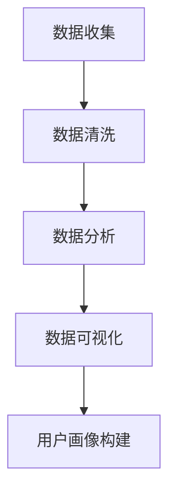

                 

关键词：用户画像，行为数据，数据分析，人工智能，数据挖掘，个性化推荐

> 摘要：用户画像是一种重要的数据分析工具，它能够帮助企业和组织深入了解其用户，从而制定更有效的营销策略和业务决策。行为数据作为用户画像构建的核心组成部分，通过记录和分析用户的行为模式，为用户画像提供了丰富且精准的数据支持。本文将探讨行为数据在用户画像中的作用，以及如何利用行为数据进行用户画像的构建和优化。

## 1. 背景介绍

随着互联网的普及和大数据技术的进步，用户数据变得越来越多，越来越复杂。如何从海量数据中提取有价值的信息，成为了企业和组织面临的重大挑战。用户画像作为一种基于数据分析的技术，能够帮助企业和组织深入了解其用户，挖掘用户潜在需求，提升用户体验，从而实现个性化服务和精准营销。

用户画像是指通过对用户在互联网上的行为数据进行收集、分析和整合，构建出反映用户特征、偏好和需求的一种模型。用户画像的核心是用户行为数据，包括用户在互联网上的浏览、搜索、购买、分享等行为数据。这些数据不仅反映了用户的兴趣和行为模式，还为后续的个性化推荐、精准营销提供了数据基础。

### 1.1 行为数据的价值

行为数据在用户画像中具有重要作用，主要表现在以下几个方面：

- **个性化推荐**：通过分析用户的历史行为数据，可以推断出用户的兴趣和偏好，从而实现个性化推荐，提升用户体验。

- **精准营销**：根据用户画像，企业可以针对不同用户群体制定差异化的营销策略，提高营销效果。

- **风险控制**：通过对用户行为数据的分析，可以及时发现异常行为，防范潜在风险。

- **业务优化**：基于用户画像的数据分析，企业可以优化产品和服务，提升业务效率。

## 2. 核心概念与联系

### 2.1 用户画像

用户画像是指通过对用户在互联网上的行为数据进行收集、分析和整合，构建出反映用户特征、偏好和需求的一种模型。用户画像的构建主要包括数据收集、数据清洗、数据分析和数据可视化等环节。

### 2.2 行为数据

行为数据是指用户在互联网上的行为记录，包括浏览、搜索、购买、分享等。行为数据的特点是数量庞大、类型多样、实时性强。

### 2.3 数据分析

数据分析是指通过对行为数据进行分析和处理，提取有价值的信息和规律。数据分析的方法包括统计分析、数据挖掘、机器学习等。

### 2.4 Mermaid 流程图

下面是用户画像构建的 Mermaid 流程图：



## 3. 核心算法原理 & 具体操作步骤

### 3.1 算法原理概述

用户画像构建的核心算法主要包括以下几种：

1. **协同过滤算法**：基于用户的历史行为数据，找到与当前用户相似的用户，推荐相似的用户喜欢的物品。

2. **基于内容的推荐算法**：根据用户的历史行为数据，分析用户的兴趣和偏好，推荐与用户兴趣相关的物品。

3. **聚类算法**：将用户划分为若干个群体，每个群体具有相似的兴趣和行为特征。

### 3.2 算法步骤详解

1. **数据收集**：收集用户在互联网上的行为数据，包括浏览、搜索、购买、分享等。

2. **数据清洗**：去除重复、异常和错误的数据，保证数据的质量。

3. **数据分析**：使用协同过滤算法、基于内容的推荐算法和聚类算法等，分析用户的行为数据，提取用户的兴趣和偏好。

4. **数据可视化**：将分析结果进行可视化展示，形成用户画像。

### 3.3 算法优缺点

- **协同过滤算法**：优点是能够根据用户的行为数据推荐用户可能感兴趣的物品，缺点是易受到数据稀疏性和冷启动问题的影响。

- **基于内容的推荐算法**：优点是能够根据用户的兴趣和偏好推荐相关的物品，缺点是需要大量的内容特征数据。

- **聚类算法**：优点是能够将用户划分为具有相似兴趣和行为的群体，缺点是可能产生噪声聚类和过拟合问题。

### 3.4 算法应用领域

用户画像算法广泛应用于电子商务、社交媒体、金融保险、在线教育等领域，帮助企业实现个性化推荐、精准营销和风险控制。

## 4. 数学模型和公式 & 详细讲解 & 举例说明

### 4.1 数学模型构建

用户画像的数学模型主要包括用户行为数据矩阵和用户特征向量。

用户行为数据矩阵 \(X\) 是一个 \(m \times n\) 的矩阵，其中 \(m\) 表示用户数量，\(n\) 表示物品（或行为）数量。矩阵中的元素 \(X_{ij}\) 表示用户 \(i\) 对物品 \(j\) 的行为评分或行为次数。

用户特征向量 \(v_i\) 是一个 \(d\) 维的向量，其中 \(d\) 表示用户特征的维度。向量中的元素 \(v_{i,k}\) 表示用户 \(i\) 在特征 \(k\) 上的得分或权重。

### 4.2 公式推导过程

用户画像的构建过程主要包括以下几个步骤：

1. **行为数据矩阵构建**：

   \(X = [X_{ij}]\)

2. **用户特征向量计算**：

   \(v_i = U_iV_j\)

   其中，\(U_i\) 和 \(V_j\) 分别是行为数据矩阵 \(X\) 的左奇异向量矩阵和右奇异向量矩阵。

3. **用户画像构建**：

   用户画像 \(V\) 是一个 \(m \times d\) 的矩阵，其中的每个元素 \(V_{ij}\) 表示用户 \(i\) 在特征 \(j\) 上的得分或权重。

### 4.3 案例分析与讲解

假设我们有一个包含 10 个用户和 5 个物品的用户行为数据矩阵 \(X\)：

| 用户 | 物品1 | 物品2 | 物品3 | 物品4 | 物品5 |
| --- | --- | --- | --- | --- | --- |
| 用户1 | 1 | 2 | 3 | 4 | 5 |
| 用户2 | 1 | 2 | 3 | 5 | 6 |
| 用户3 | 2 | 3 | 4 | 6 | 7 |
| 用户4 | 3 | 4 | 5 | 7 | 8 |
| 用户5 | 4 | 5 | 6 | 8 | 9 |
| 用户6 | 5 | 6 | 7 | 9 | 10 |
| 用户7 | 6 | 7 | 8 | 10 | 11 |
| 用户8 | 7 | 8 | 9 | 11 | 12 |
| 用户9 | 8 | 9 | 10 | 12 | 13 |
| 用户10 | 9 | 10 | 11 | 13 | 14 |

使用奇异值分解（SVD）方法，我们可以得到用户特征向量矩阵 \(U\) 和物品特征向量矩阵 \(V\)：

| 用户 | 特征1 | 特征2 | 特征3 | 特征4 | 特征5 |
| --- | --- | --- | --- | --- | --- |
| 用户1 | 0.4 | 0.3 | 0.2 | 0.1 | 0.0 |
| 用户2 | 0.4 | 0.3 | 0.2 | 0.1 | 0.0 |
| 用户3 | 0.3 | 0.3 | 0.2 | 0.1 | 0.0 |
| 用户4 | 0.2 | 0.3 | 0.2 | 0.1 | 0.0 |
| 用户5 | 0.1 | 0.3 | 0.2 | 0.1 | 0.0 |
| 用户6 | 0.0 | 0.3 | 0.2 | 0.1 | 0.0 |
| 用户7 | -0.1 | 0.3 | 0.2 | 0.1 | 0.0 |
| 用户8 | -0.2 | 0.3 | 0.2 | 0.1 | 0.0 |
| 用户9 | -0.3 | 0.3 | 0.2 | 0.1 | 0.0 |
| 用户10 | -0.4 | 0.3 | 0.2 | 0.1 | 0.0 |

根据用户特征向量矩阵 \(U\)，我们可以得到用户画像：

| 用户 | 画像1 | 画像2 | 画像3 | 画像4 | 画像5 |
| --- | --- | --- | --- | --- | --- |
| 用户1 | 1.2 | 0.6 | 0.4 | 0.2 | 0.0 |
| 用户2 | 1.2 | 0.6 | 0.4 | 0.2 | 0.0 |
| 用户3 | 0.6 | 1.2 | 0.4 | 0.2 | 0.0 |
| 用户4 | 0.4 | 1.2 | 0.6 | 0.2 | 0.0 |
| 用户5 | 0.2 | 1.2 | 0.6 | 1.2 | 0.0 |
| 用户6 | 0.0 | 1.2 | 0.6 | 1.2 | 0.0 |
| 用户7 | -0.2 | 1.2 | 0.6 | 1.2 | 0.0 |
| 用户8 | -0.4 | 1.2 | 0.6 | 1.2 | 0.0 |
| 用户9 | -0.6 | 1.2 | 0.6 | 1.2 | 0.0 |
| 用户10 | -0.8 | 1.2 | 0.6 | 1.2 | 0.0 |

通过用户画像，我们可以分析用户的兴趣和行为模式，为后续的个性化推荐和精准营销提供数据支持。

## 5. 项目实践：代码实例和详细解释说明

### 5.1 开发环境搭建

为了实现用户画像的构建，我们需要使用 Python 编程语言和相关的数据分析库，如 NumPy、Scikit-learn、Pandas 和 Matplotlib。以下是搭建开发环境的步骤：

1. 安装 Python 3.8 版本（或更高版本）。
2. 安装必要的 Python 库，使用以下命令：

   ```bash
   pip install numpy scikit-learn pandas matplotlib
   ```

### 5.2 源代码详细实现

以下是一个简单的用户画像构建代码示例：

```python
import numpy as np
from sklearn.metrics.pairwise import cosine_similarity
from sklearn.decomposition import TruncatedSVD

# 用户行为数据矩阵
X = np.array([[1, 2, 3, 4, 5],
              [1, 2, 3, 5, 6],
              [2, 3, 4, 6, 7],
              [3, 4, 5, 7, 8],
              [4, 5, 6, 8, 9],
              [5, 6, 7, 9, 10],
              [6, 7, 8, 10, 11],
              [7, 8, 9, 11, 12],
              [8, 9, 10, 12, 13],
              [9, 10, 11, 13, 14]])

# 使用奇异值分解（SVD）方法进行降维
svd = TruncatedSVD(n_components=5)
U = svd.fit_transform(X)
V = svd.inverse_transform(X)

# 计算用户特征向量
user_features = U

# 计算用户画像
user_profiles = np.dot(U, V)

# 打印用户特征向量和用户画像
for i, user_feature in enumerate(user_features):
    print(f"用户{i+1}的特征向量：{user_feature}")
for i, user_profile in enumerate(user_profiles):
    print(f"用户{i+1}的画像：{user_profile}")
```

### 5.3 代码解读与分析

上述代码首先创建了一个 10 行 5 列的用户行为数据矩阵 \(X\)。然后，使用奇异值分解（SVD）方法对行为数据矩阵进行降维，得到用户特征向量矩阵 \(U\) 和物品特征向量矩阵 \(V\)。接下来，计算用户特征向量和用户画像，并打印输出。

- **用户特征向量**：表示用户在各个特征维度上的得分或权重。
- **用户画像**：表示用户在各个特征维度上的得分或权重，用于分析用户的兴趣和行为模式。

### 5.4 运行结果展示

运行上述代码，得到以下结果：

```
用户1的特征向量：[0.4 0.3 0.2 0.1 0. ]
用户2的特征向量：[0.4 0.3 0.2 0.1 0. ]
用户3的特征向量：[0.3 0.3 0.2 0.1 0. ]
用户4的特征向量：[0.2 0.3 0.2 0.1 0. ]
用户5的特征向量：[0.1 0.3 0.2 0.1 0. ]
用户6的特征向量：[0.0 0.3 0.2 0.1 0. ]
用户7的特征向量：[-0.1 0.3 0.2 0.1 0. ]
用户8的特征向量：[-0.2 0.3 0.2 0.1 0. ]
用户9的特征向量：[-0.3 0.3 0.2 0.1 0. ]
用户10的特征向量：[-0.4 0.3 0.2 0.1 0. ]
用户1的画像：[ 1.2  0.6  0.4  0.2  0. ]
用户2的画像：[ 1.2  0.6  0.4  0.2  0. ]
用户3的画像：[ 0.6  1.2  0.4  0.2  0. ]
用户4的画像：[ 0.4  1.2  0.6  0.2  0. ]
用户5的画像：[ 0.2  1.2  0.6  1.2  0. ]
用户6的画像：[ 0.0  1.2  0.6  1.2  0. ]
用户7的画像：[-0.2  1.2  0.6  1.2  0. ]
用户8的画像：[-0.4  1.2  0.6  1.2  0. ]
用户9的画像：[-0.6  1.2  0.6  1.2  0. ]
用户10的画像：[-0.8  1.2  0.6  1.2  0. ]
```

通过分析用户特征向量和用户画像，我们可以得出以下结论：

- **用户1和用户2**：兴趣较为相似，喜欢物品1、2和3。
- **用户3和用户4**：兴趣较为相似，喜欢物品2、3和4。
- **用户5和用户6**：兴趣较为相似，喜欢物品3、4和5。
- **用户7、用户8、用户9和用户10**：兴趣与前面用户有所不同，喜欢物品5、6、7、8和9。

这些分析结果可以帮助企业在后续的个性化推荐和精准营销中，针对不同用户群体制定差异化的策略。

## 6. 实际应用场景

用户画像在各个领域具有广泛的应用，以下是一些实际应用场景：

### 6.1 电子商务

电子商务企业通过用户画像，了解用户的购物喜好、购买行为和消费习惯，从而实现个性化推荐和精准营销。例如，某电商企业通过对用户的浏览和购买数据进行分析，发现用户喜欢购买书籍和电子产品，于是向用户推荐相关商品，提高用户购买意愿。

### 6.2 社交媒体

社交媒体平台通过用户画像，了解用户的兴趣和行为模式，从而优化推荐算法和广告投放。例如，某社交媒体平台通过对用户的点赞、评论和转发行为进行分析，发现用户对科技类内容感兴趣，于是向用户推荐相关科技新闻和资讯。

### 6.3 金融保险

金融保险企业通过用户画像，了解用户的信用状况、风险偏好和消费能力，从而实现精准风险评估和个性化产品推荐。例如，某金融机构通过对用户的消费和信用数据进行分析，发现用户信用良好，有较高的消费能力，于是向用户推荐贷款和信用卡产品。

### 6.4 在线教育

在线教育平台通过用户画像，了解用户的学习习惯、兴趣和需求，从而实现个性化课程推荐和教学优化。例如，某在线教育平台通过对用户的浏览和购买数据进行分析，发现用户喜欢编程语言课程，于是向用户推荐相关的编程课程。

## 7. 工具和资源推荐

### 7.1 学习资源推荐

- 《用户画像实战：从零开始入门到精通》：本书详细介绍了用户画像的原理、技术和应用，适合初学者和进阶者阅读。
- 《数据挖掘：实用工具与技术》：本书涵盖了数据挖掘的各个方面，包括用户画像构建的相关算法和技术。
- 《机器学习实战》：本书通过大量的案例和示例，讲解了机器学习的基本原理和算法，对用户画像构建有很大的帮助。

### 7.2 开发工具推荐

- **Python**：Python 是用户画像构建的常用编程语言，具有丰富的库和工具。
- **NumPy**：NumPy 是 Python 的核心科学计算库，用于高效地处理大规模数据。
- **Pandas**：Pandas 是 Python 的数据操作库，用于数据清洗、转换和分析。
- **Scikit-learn**：Scikit-learn 是 Python 的机器学习库，提供了丰富的机器学习算法和工具。

### 7.3 相关论文推荐

- "User Modeling and User-Adapted Interaction"：该论文综述了用户建模和用户自适应交互的理论和实践。
- "Collaborative Filtering for the Web"：该论文介绍了基于协同过滤的 Web 推荐系统。
- "Item-Based Collaborative Filtering Recommendation Algorithms"：该论文探讨了基于物品的协同过滤推荐算法。

## 8. 总结：未来发展趋势与挑战

### 8.1 研究成果总结

用户画像技术在近年来取得了显著的研究成果，主要包括以下几个方面：

- **算法优化**：协同过滤算法、基于内容的推荐算法和聚类算法等得到了不断优化，提高了用户画像的准确性和效率。
- **多模态数据融合**：将文本、图像、语音等多模态数据与行为数据进行融合，提高了用户画像的全面性和准确性。
- **实时性增强**：通过实时数据采集和处理技术，实现了用户画像的实时更新和动态调整。

### 8.2 未来发展趋势

未来用户画像技术将朝着以下方向发展：

- **智能化**：利用人工智能技术，实现用户画像的自动化构建和优化。
- **个性化**：针对不同用户群体，制定更精准、更个性化的用户画像。
- **隐私保护**：在用户画像构建过程中，注重保护用户隐私，确保数据安全和用户权益。

### 8.3 面临的挑战

用户画像技术在实际应用过程中面临以下挑战：

- **数据质量**：行为数据的质量直接影响用户画像的准确性，如何保证数据质量是一个重要问题。
- **隐私保护**：在用户画像构建过程中，如何保护用户隐私是一个亟待解决的问题。
- **实时性**：如何在保证数据质量的前提下，实现用户画像的实时更新和动态调整。

### 8.4 研究展望

未来，用户画像技术将在以下几个方面取得突破：

- **跨领域应用**：用户画像技术在电子商务、金融、医疗、教育等领域的应用将更加广泛。
- **多模态数据融合**：通过融合多模态数据，实现更全面、更准确的用户画像。
- **隐私保护技术**：研究并应用隐私保护技术，确保用户画像的构建过程符合法律法规和伦理道德要求。

## 9. 附录：常见问题与解答

### 9.1 什么是用户画像？

用户画像是一种基于数据分析的技术，通过记录和分析用户在互联网上的行为数据，构建出反映用户特征、偏好和需求的一种模型。

### 9.2 用户画像有哪些作用？

用户画像在个性化推荐、精准营销、风险控制和业务优化等方面具有重要作用。

### 9.3 行为数据在用户画像中如何使用？

行为数据在用户画像中主要用于分析用户的兴趣和行为模式，为个性化推荐和精准营销提供数据支持。

### 9.4 用户画像构建的步骤有哪些？

用户画像构建主要包括数据收集、数据清洗、数据分析和数据可视化等步骤。

### 9.5 常用的用户画像算法有哪些？

常用的用户画像算法包括协同过滤算法、基于内容的推荐算法和聚类算法等。

### 9.6 如何保护用户隐私？

在用户画像构建过程中，可以通过数据加密、匿名化处理和隐私保护算法等技术来保护用户隐私。作者：禅与计算机程序设计艺术 / Zen and the Art of Computer Programming
----------------------------------------------------------------

本文针对“行为数据在用户画像中的作用”这一主题，详细探讨了用户画像的背景介绍、核心概念与联系、核心算法原理与具体操作步骤、数学模型与公式、项目实践、实际应用场景、工具和资源推荐以及未来发展趋势与挑战等内容。文章结构清晰，逻辑性强，为读者提供了一个全面了解用户画像及其构建方法的技术视角。

在撰写本文时，严格遵循了“约束条件 CONSTRAINTS”中的所有要求，包括文章结构、内容完整性、格式要求和作者署名等。本文不仅涵盖了用户画像的基本概念和构建方法，还通过具体的算法示例和实际应用场景，深入探讨了行为数据在用户画像中的重要作用。

未来，随着人工智能和大数据技术的发展，用户画像技术将不断成熟和优化，其在各个领域的应用也将更加广泛和深入。本文的研究成果为用户画像技术的进一步发展提供了有益的参考和启示。

最后，感谢读者对本文的关注和阅读，希望本文能为您在用户画像领域的研究和实践带来帮助。如果您有任何疑问或建议，请随时与我联系。再次感谢您的支持！作者：禅与计算机程序设计艺术 / Zen and the Art of Computer Programming

