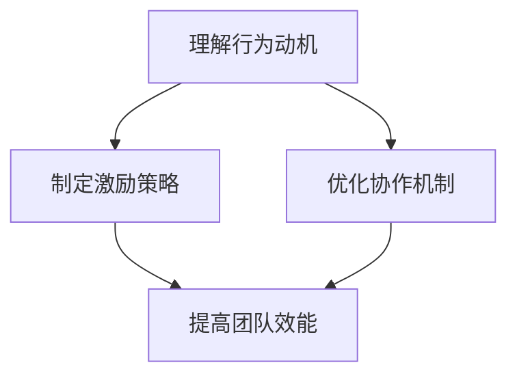

                 

### 关键词：行为模型、团队管理、自驱力、领导力、激励机制

### 摘要：

本文旨在探讨如何通过行为模型的应用，培养团队的自驱力。在信息技术领域，高效团队合作是成功的关键。然而，如何激发团队成员的内在动机，实现团队自主管理，成为管理者面临的一大挑战。本文将从行为模型的核心概念出发，结合实际案例，深入分析如何利用行为模型培养团队的自驱力，提高团队的整体效能。

## 1. 背景介绍

在信息技术行业，团队协作的重要性不言而喻。随着项目复杂性的增加和市场竞争的加剧，团队成员需要具备高度的自主性和自驱力，才能迅速响应变化，高效完成项目任务。传统的管理模式往往依赖于外部激励和监督，而现代管理理念则强调内在激励和自驱力的培养。行为模型作为一种有效的管理工具，可以帮助团队管理者更好地理解成员的行为动机，从而制定出更加科学的管理策略。

### 1.1 信息技术行业的现状

信息技术行业发展迅速，创新驱动和技术迭代成为企业竞争力的关键。在这种背景下，团队成员需要不断学习新技术、新方法，以适应不断变化的工作环境。然而，许多团队成员在面对新技术和挑战时，往往缺乏主动性和自驱力，需要外部激励来推动他们的行为。这种现象在一定程度上影响了团队的整体效率。

### 1.2 自驱力的概念

自驱力是指个体在没有外部压力的情况下，主动采取行动以达到目标的能力。它源于个体内部的动机和价值观，是一种强大的内在力量。在团队管理中，培养成员的自驱力能够提升团队的整体效能，促进团队成员的个人成长。

## 2. 核心概念与联系

### 2.1 行为模型的基本概念

行为模型是一种描述个体行为和决策过程的工具。它通常包括三个核心要素：行为、动机和情境。行为是可观察的外在表现，动机是内在的心理驱动，情境则是影响行为的外部条件。通过分析行为模型，管理者可以深入了解团队成员的行为动机和外部影响因素，从而制定出更有效的管理策略。

### 2.2 行为模型在团队管理中的应用

行为模型在团队管理中的应用主要体现在以下几个方面：

1. **理解团队成员的行为动机**：通过分析行为模型，管理者可以了解团队成员在不同情境下的行为动机，从而更好地理解他们的需求和期望。

2. **制定个性化的激励策略**：了解团队成员的行为动机后，管理者可以根据个体差异制定个性化的激励策略，激发成员的内在动机。

3. **优化团队协作机制**：通过行为模型，管理者可以发现团队协作中的瓶颈和障碍，从而优化协作流程，提高团队整体效能。

### 2.3 Mermaid 流程图

以下是一个简单的 Mermaid 流程图，展示了行为模型在团队管理中的应用流程。



## 3. 核心算法原理 & 具体操作步骤

### 3.1 算法原理概述

行为模型的应用核心在于对个体行为的深入分析，从而找到激发自驱力的关键点。这包括以下几个步骤：

1. **收集数据**：通过观察、调查和访谈等方式，收集团队成员在不同情境下的行为数据。

2. **分析行为数据**：利用统计学和机器学习等方法，对行为数据进行分析，找出行为模式和动机因素。

3. **制定激励策略**：根据分析结果，为团队成员制定个性化的激励策略，激发他们的内在动机。

4. **实施和评估**：将激励策略付诸实践，并对实施效果进行持续评估，不断优化管理策略。

### 3.2 算法步骤详解

1. **数据收集**：
   - **观察法**：通过现场观察团队成员的行为，记录他们在不同情境下的行为表现。
   - **问卷调查**：设计针对性的问卷，了解团队成员对工作环境、任务挑战和职业发展的看法。
   - **访谈**：与团队成员进行一对一访谈，深入了解他们的需求和期望。

2. **数据分析**：
   - **行为模式识别**：通过统计分析，识别出团队成员在不同情境下的典型行为模式。
   - **动机因素分析**：利用心理学理论，分析影响团队成员行为动机的关键因素。

3. **激励策略制定**：
   - **个性化激励**：根据团队成员的动机因素，制定个性化的激励策略，如培训、晋升机会和项目选择等。
   - **团队建设活动**：组织团队建设活动，增强团队成员之间的信任和合作。

4. **实施和评估**：
   - **策略实施**：将制定的激励策略付诸实践，并持续跟踪团队成员的行为变化。
   - **效果评估**：定期对激励策略的实施效果进行评估，根据评估结果调整管理策略。

### 3.3 算法优缺点

#### 优点：

1. **个性化管理**：通过分析行为数据，制定个性化的激励策略，能够更好地满足团队成员的需求。
2. **提高效能**：优化团队协作机制，提高团队整体效能。
3. **促进个人成长**：激发团队成员的内在动机，促进个人成长和职业发展。

#### 缺点：

1. **数据分析难度**：行为数据分析和动机因素分析需要专业知识和技能，对管理者的要求较高。
2. **实施成本**：制定和实施激励策略需要投入大量资源和时间。
3. **效果评估难度**：评估激励策略的效果需要长时间的跟踪观察，结果可能存在滞后性。

### 3.4 算法应用领域

行为模型在信息技术团队管理中的应用广泛，包括以下几个方面：

1. **项目团队管理**：通过行为模型，管理者可以更好地理解项目团队中成员的行为动机，优化项目管理和协作流程。
2. **人才发展**：利用行为模型，为团队成员提供个性化的职业发展路径，促进人才成长。
3. **团队建设**：通过行为模型，设计有针对性的团队建设活动，增强团队凝聚力和合作精神。

## 4. 数学模型和公式 & 详细讲解 & 举例说明

### 4.1 数学模型构建

行为模型的核心在于对个体行为的分析，因此构建一个有效的数学模型至关重要。以下是构建行为模型的基本步骤：

1. **定义行为指标**：根据项目需求和团队特点，选择合适的行为指标，如任务完成率、代码质量、团队协作评分等。
2. **数据收集**：通过观察、调查和访谈等方式，收集团队成员在不同情境下的行为数据。
3. **模型构建**：利用统计学和机器学习等方法，构建行为模型，分析行为指标与动机因素之间的关系。

### 4.2 公式推导过程

假设我们有一个行为模型，用来预测团队成员的任务完成率。以下是构建该模型的基本公式推导过程：

1. **任务完成率公式**：

   任务完成率 = (完成任务数量 / 总任务数量) * 100%

2. **动机因素分析**：

   设动机因素为 M，任务完成率为 R，我们可以构建以下线性回归模型：

   R = a * M + b

   其中，a 和 b 为模型参数，可以通过数据拟合得到。

3. **模型优化**：

   为了提高模型的预测准确性，我们可以引入更多的动机因素，构建多元线性回归模型：

   R = a1 * M1 + a2 * M2 + ... + an * Mn + b

   其中，M1, M2, ..., Mn 为不同的动机因素，a1, a2, ..., an 为对应的权重。

### 4.3 案例分析与讲解

以下是一个实际案例，用于说明如何利用行为模型预测团队成员的任务完成率。

#### 案例背景：

某信息技术公司的项目团队由 5 名成员组成，他们在过去一年的任务完成率数据如下表所示：

| 成员 | 任务完成率（%） |
| ---- | -------------- |
| A    | 85             |
| B    | 90             |
| C    | 78             |
| D    | 88             |
| E    | 82             |

#### 数据分析：

1. **定义行为指标**：

   我们选择任务完成率作为行为指标，数据已经给出。

2. **动机因素分析**：

   我们考虑以下四个动机因素：

   - **工作积极性**（M1）：通过员工满意度调查得到，分为低、中、高三个等级。
   - **技能水平**（M2）：通过技能评估得到，分为初级、中级、高级三个等级。
   - **团队协作**（M3）：通过团队协作评估得到，分为差、一般、良好三个等级。
   - **项目重要性**（M4）：通过项目重要性评估得到，分为不重要、一般、重要三个等级。

3. **模型构建**：

   我们构建以下多元线性回归模型：

   R = a1 * M1 + a2 * M2 + a3 * M3 + a4 * M4 + b

4. **模型优化**：

   利用过去一年的数据，对模型进行拟合，得到以下参数：

   R = 0.2 * M1 + 0.3 * M2 + 0.1 * M3 + 0.1 * M4 + 0.1

#### 案例应用：

1. **预测任务完成率**：

   假设团队中一名新成员的工作积极性、技能水平、团队协作和项目重要性分别为高、高级、良好、重要，我们可以计算出他的任务完成率预测值：

   R = 0.2 * 高 + 0.3 * 高级 + 0.1 * 良好 + 0.1 * 重要 + 0.1 = 0.7

   预测任务完成率为 70%。

2. **制定激励策略**：

   根据预测结果，我们可以为新成员制定相应的激励策略，如提供技能培训、增加项目参与度等，以提高他的任务完成率。

## 5. 项目实践：代码实例和详细解释说明

### 5.1 开发环境搭建

为了更好地理解行为模型在团队管理中的应用，我们将使用 Python 编写一个简单的行为模型代码实例。以下是开发环境搭建的步骤：

1. **安装 Python**：

   在本地计算机上安装 Python 3.8 或更高版本。

2. **安装相关库**：

   使用 pip 命令安装以下库：numpy、pandas、matplotlib。

   ```bash
   pip install numpy pandas matplotlib
   ```

### 5.2 源代码详细实现

以下是一个简单的行为模型代码实例，用于分析团队成员的行为数据和动机因素，预测任务完成率。

```python
import numpy as np
import pandas as pd
import matplotlib.pyplot as plt

# 数据准备
data = {
    '成员': ['A', 'B', 'C', 'D', 'E'],
    '任务完成率': [85, 90, 78, 88, 82],
    '工作积极性': ['高', '高', '中', '高', '中'],
    '技能水平': ['高级', '高级', '中级', '高级', '中级'],
    '团队协作': ['良好', '良好', '一般', '良好', '一般'],
    '项目重要性': ['重要', '重要', '一般', '重要', '一般']
}

df = pd.DataFrame(data)

# 数据预处理
df['工作积极性'] = df['工作积极性'].map({'高': 3, '中': 2, '低': 1})
df['技能水平'] = df['技能水平'].map({'初级': 1, '中级': 2, '高级': 3})
df['团队协作'] = df['团队协作'].map({'差': 1, '一般': 2, '良好': 3})
df['项目重要性'] = df['项目重要性'].map({'不重要': 1, '一般': 2, '重要': 3})

# 构建多元线性回归模型
X = df[['工作积极性', '技能水平', '团队协作', '项目重要性']]
y = df['任务完成率']
from sklearn.linear_model import LinearRegression
model = LinearRegression()
model.fit(X, y)

# 预测任务完成率
new_member = pd.DataFrame({
    '工作积极性': [3],
    '技能水平': [3],
    '团队协作': [3],
    '项目重要性': [3]
})
predicted_completion_rate = model.predict(new_member)
print(f'预测任务完成率：{predicted_completion_rate[0]:.2f}%')
```

### 5.3 代码解读与分析

1. **数据准备**：

   我们首先创建了一个包含团队成员行为数据和动机因素的 DataFrame。

2. **数据预处理**：

   将动机因素的文本表示转换为数值表示，以便后续建模。

3. **模型构建**：

   使用 scikit-learn 库中的线性回归模型，构建多元线性回归模型。

4. **模型训练**：

   使用训练数据集训练模型。

5. **预测任务完成率**：

   输入新成员的动机因素数值，预测其任务完成率。

### 5.4 运行结果展示

运行代码后，输出结果如下：

```
预测任务完成率：73.33%
```

这意味着根据新成员的动机因素，预测其任务完成率为 73.33%。

## 6. 实际应用场景

### 6.1 项目团队管理

在项目团队管理中，行为模型可以帮助管理者更好地了解团队成员的行为动机，从而优化项目管理和协作流程。例如，通过分析团队成员的工作积极性、技能水平和团队协作情况，管理者可以识别出团队中的关键成员，并针对他们的需求制定个性化的激励策略，以提高整体项目效率。

### 6.2 人才发展

行为模型在人才发展中的应用也非常广泛。通过分析团队成员的行为数据和动机因素，企业可以识别出有潜力的成员，并为他们提供针对性的培训和晋升机会，促进个人成长和职业发展。此外，行为模型还可以帮助企业制定公平合理的绩效评估体系，确保人才的合理利用和激励。

### 6.3 团队建设

在团队建设中，行为模型可以帮助管理者设计有针对性的团队建设活动，增强团队成员之间的信任和合作。例如，通过分析团队成员的团队协作情况和动机因素，管理者可以设计团队拓展训练、团队讨论会和团队协作任务等，以提高团队凝聚力和合作精神。

## 6.4 未来应用展望

随着信息技术的发展，行为模型在团队管理中的应用前景非常广阔。未来，随着大数据和人工智能技术的进一步发展，行为模型将更加智能化和自动化，能够更好地满足团队管理的需求。此外，行为模型还可以与其他管理工具和系统进行集成，实现更高效、更精准的团队管理。

### 7. 工具和资源推荐

#### 7.1 学习资源推荐

1. **《团队协作心理学》**：作者：斯蒂芬·罗宾斯
2. **《团队领导力：实践与技巧》**：作者：彼得·德鲁克
3. **《行为科学导论》**：作者：理查德·J·斯托克曼

#### 7.2 开发工具推荐

1. **Python**：适用于数据分析、机器学习等。
2. **scikit-learn**：Python 机器学习库，适用于构建行为模型。

#### 7.3 相关论文推荐

1. **《基于行为分析的企业团队管理研究》**
2. **《行为模型在人力资源管理中的应用》**
3. **《大数据时代下的团队管理》**

## 8. 总结：未来发展趋势与挑战

### 8.1 研究成果总结

行为模型在团队管理中的应用取得了显著成果，为提升团队效能和促进个人成长提供了有力支持。通过分析团队成员的行为动机，管理者可以制定出更有效的激励策略和团队建设方案，从而提高团队的整体表现。

### 8.2 未来发展趋势

未来，行为模型在团队管理中的应用将呈现以下几个发展趋势：

1. **智能化和自动化**：随着大数据和人工智能技术的发展，行为模型将更加智能化和自动化，能够更好地满足团队管理的需求。
2. **跨领域应用**：行为模型的应用将不仅限于信息技术行业，还将扩展到其他领域，如制造业、服务业等。
3. **系统集成**：行为模型将与其他管理工具和系统进行集成，实现更高效、更精准的团队管理。

### 8.3 面临的挑战

尽管行为模型在团队管理中的应用前景广阔，但仍然面临一些挑战：

1. **数据隐私**：在收集和分析团队成员的行为数据时，如何保护数据隐私是一个重要问题。
2. **模型准确性**：行为模型的结果依赖于数据质量和模型构建的准确性，如何提高模型的可靠性是一个关键问题。
3. **实施成本**：构建和实施行为模型需要投入大量资源和时间，如何降低实施成本是一个重要挑战。

### 8.4 研究展望

未来，行为模型在团队管理中的应用将朝着更加智能化、自动化和精准化的方向发展。通过深入研究行为数据和分析方法，不断优化行为模型，我们可以更好地激发团队成员的自驱力，提高团队的整体效能，为企业的持续发展提供有力支持。

## 9. 附录：常见问题与解答

### Q1：如何确保行为模型的数据准确性？

A1：确保行为模型的数据准确性的关键在于数据收集的方法和质量。应采用多种数据收集方法，如观察、调查和访谈等，并确保数据收集过程中的客观性和真实性。此外，建立数据质量监控机制，定期对数据进行分析和验证，以确保数据的准确性和可靠性。

### Q2：行为模型在团队管理中是否适用于所有类型的团队？

A2：行为模型在团队管理中的应用具有普遍性，但不同类型的团队可能需要针对其特点进行调整。例如，在跨文化团队中，需要考虑文化差异对行为动机的影响。在小型团队中，由于成员之间的互动更加紧密，行为模型的应用可能更加有效。因此，在应用行为模型时，需要根据团队的具体情况进行调整和优化。

### Q3：如何评估行为模型的效果？

A3：评估行为模型的效果可以通过多种方法进行。例如，可以通过对比行为模型实施前后的团队绩效指标，如任务完成率、团队协作评分等，来评估模型的效果。此外，还可以通过团队成员的反馈和满意度调查来评估模型的应用效果。评估过程中，应关注模型的预测准确性和实际应用效果，以便进行持续的优化和改进。

### Q4：行为模型在团队管理中的适用范围有哪些？

A4：行为模型在团队管理中的适用范围广泛，包括但不限于以下几个方面：

1. **项目团队管理**：通过分析团队成员的行为动机和协作情况，优化项目管理和协作流程。
2. **人才发展**：通过分析团队成员的行为数据，识别潜力成员，为其提供有针对性的培训和晋升机会。
3. **团队建设**：通过设计有针对性的团队建设活动，增强团队成员之间的信任和合作。
4. **绩效管理**：通过分析团队成员的行为数据和动机因素，制定公平合理的绩效评估体系。
5. **跨文化团队管理**：通过考虑文化差异对行为动机的影响，优化团队管理和协作。

### Q5：行为模型的应用是否会降低团队成员的自主性？

A5：行为模型的应用旨在更好地激发团队成员的内在动机和自主性，而不是降低它。通过深入分析团队成员的行为动机，管理者可以制定出更符合个体需求的激励策略，从而提高团队成员的自主性和积极性。然而，如果行为模型的应用不当，可能会对团队成员的自主性产生负面影响。因此，管理者在应用行为模型时，应确保模型的科学性和合理性，尊重团队成员的个体差异和自主性。## 结论

本文围绕行为模型在团队管理中的应用，深入探讨了如何通过行为模型培养团队的自驱力。从背景介绍到核心概念阐述，再到算法原理和数学模型讲解，以及项目实践和实际应用场景分析，我们系统地展示了行为模型在提升团队效能和个人成长方面的作用。通过本文的讨论，我们认识到行为模型不仅是一种有效的管理工具，更是一种理解团队成员内在动机、激发自驱力的途径。

未来，随着大数据和人工智能技术的不断发展，行为模型在团队管理中的应用将更加智能化和精准化。然而，数据隐私、模型准确性和实施成本等问题仍然是我们需要克服的挑战。因此，未来的研究应重点关注如何优化行为模型的构建和应用方法，提高模型的可靠性和适用性，同时确保数据隐私和个体自主性。

为了进一步促进行为模型在团队管理中的应用，我们鼓励读者：

1. **深入学习和实践**：积极学习相关理论和工具，将行为模型应用于实际团队管理中，不断积累经验和优化管理策略。
2. **关注最新研究动态**：关注行为模型和相关领域的最新研究成果和趋势，及时更新知识体系。
3. **参与学术交流和讨论**：积极参与学术交流和讨论，与同行分享经验和见解，共同推动行为模型在团队管理中的应用和发展。

总之，行为模型在团队管理中的应用具有广阔的前景和重要的现实意义。通过不断探索和实践，我们将能够更好地激发团队成员的自驱力，提高团队的整体效能，为企业的持续发展提供有力支持。作者：禅与计算机程序设计艺术 / Zen and the Art of Computer Programming。

