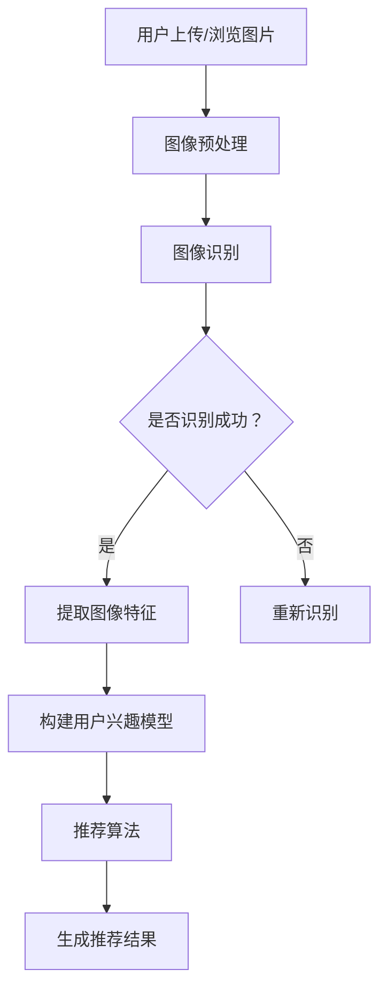

                 

关键词：视觉推荐、人工智能、图像识别、商品推荐、深度学习、用户行为分析

> 摘要：随着互联网的迅速发展，用户对个性化推荐的需求日益增长。视觉推荐作为人工智能技术在推荐系统中的应用，通过对用户上传或浏览的图片进行分析，实现了对商品的智能推荐。本文将探讨视觉推荐的基本原理、算法原理、数学模型及其在实际应用中的具体案例，并展望未来的发展方向和面临的挑战。

## 1. 背景介绍

在当今数字化时代，互联网的普及和应用已经渗透到我们生活的方方面面。电子商务作为互联网经济的重要组成部分，正以前所未有的速度增长。随着用户数量的增加，如何提供更加精准、个性化的商品推荐，已经成为电商平台和企业关注的焦点。

传统推荐系统主要依赖于用户的历史行为数据，如浏览记录、购买历史等，通过统计方法和机器学习算法来预测用户的偏好，进而推荐商品。然而，这种基于行为的推荐系统存在明显的局限性，它往往只能根据用户过去的行为数据进行推荐，忽视了用户当前的兴趣和需求。

视觉推荐作为人工智能技术在推荐系统中的应用，通过深度学习算法对用户上传或浏览的图片进行分析，从而实现更精准的商品推荐。视觉推荐不仅能够捕捉用户的视觉兴趣，还能挖掘出用户潜在的兴趣点，提高推荐的准确性和满意度。

## 2. 核心概念与联系

### 2.1. 视觉推荐的基本概念

视觉推荐是一种基于图像内容分析的推荐方法。它通过识别和提取图像中的关键特征，如颜色、形状、纹理等，来理解图像的含义和用户的兴趣。视觉推荐的关键在于如何从图像中提取出有意义的特征，并将其与商品信息进行关联，从而实现个性化推荐。

### 2.2. 图像识别与分类

图像识别是视觉推荐系统的核心组件之一。它涉及从图像中识别和分类目标对象。在视觉推荐中，图像识别用于识别用户上传或浏览的图片中的商品，从而为后续的推荐算法提供基础数据。

分类算法如卷积神经网络（CNN）在图像识别中发挥着重要作用。CNN能够自动学习图像中的层次特征，从局部特征到全局特征，逐步提高识别的准确性。

### 2.3. 深度学习与推荐系统

深度学习是视觉推荐系统的重要技术支撑。通过构建多层神经网络，深度学习能够自动提取图像中的复杂特征，从而提高图像识别和分类的准确性。

在推荐系统中，深度学习可用于构建用户兴趣模型和商品特征表示。用户兴趣模型可以帮助理解用户对图像的偏好，而商品特征表示则用于描述商品的特点，从而为推荐算法提供有效的输入。

### 2.4. Mermaid 流程图

以下是一个简化的视觉推荐系统的 Mermaid 流程图，展示各组件之间的关系：



## 3. 核心算法原理 & 具体操作步骤

### 3.1. 算法原理概述

视觉推荐系统的核心算法主要包括图像识别、特征提取和推荐算法。图像识别用于识别用户上传或浏览的图片中的商品；特征提取则用于提取图像中的关键特征，如颜色、形状、纹理等；推荐算法则根据用户兴趣模型和商品特征表示，为用户生成个性化的推荐结果。

### 3.2. 算法步骤详解

#### 3.2.1. 图像识别

图像识别是视觉推荐系统的第一步。它通过卷积神经网络（CNN）对用户上传或浏览的图片进行分类，从而识别图像中的商品。具体步骤如下：

1. **数据预处理**：对输入的图片进行缩放、裁剪、灰度化等预处理操作，使其符合CNN的输入要求。
2. **构建CNN模型**：使用预训练的CNN模型（如VGG16、ResNet等）作为基础模型，或根据具体需求构建定制化的CNN模型。
3. **模型训练与优化**：使用包含大量商品图像的训练集，对CNN模型进行训练，并使用优化算法（如梯度下降、Adam等）优化模型参数。
4. **模型评估**：使用测试集对模型进行评估，根据评估指标（如准确率、召回率等）调整模型参数，以提高识别精度。

#### 3.2.2. 特征提取

特征提取是视觉推荐系统的关键步骤。它通过卷积神经网络从图像中提取有意义的特征，如颜色、形状、纹理等。具体步骤如下：

1. **特征提取层**：在CNN模型的最后几层提取特征。这些特征通常具有更高的抽象层次，能够更准确地描述图像内容。
2. **特征融合**：将提取的多个特征进行融合，以获得更全面、准确的图像表示。
3. **特征降维**：使用降维技术（如主成分分析PCA、线性判别分析LDA等）将高维特征映射到低维空间，以简化计算和模型复杂度。

#### 3.2.3. 推荐算法

推荐算法根据用户兴趣模型和商品特征表示，为用户生成个性化的推荐结果。具体步骤如下：

1. **用户兴趣模型构建**：使用深度学习算法（如神经网络、决策树等）构建用户兴趣模型，以理解用户对图像的偏好。
2. **商品特征表示**：使用深度学习算法（如卷积神经网络、循环神经网络等）构建商品特征表示，以描述商品的特点。
3. **推荐算法实现**：根据用户兴趣模型和商品特征表示，使用推荐算法（如协同过滤、矩阵分解、基于内容的推荐等）生成推荐结果。

### 3.3. 算法优缺点

#### 优点

1. **个性化推荐**：视觉推荐系统能够根据用户的视觉兴趣进行推荐，提供更加个性化的推荐结果。
2. **跨平台应用**：视觉推荐系统不仅适用于电商平台，还可以应用于社交媒体、广告推送等领域。
3. **提高用户满意度**：通过提供更精准的推荐结果，视觉推荐系统可以提高用户的满意度，增强用户黏性。

#### 缺点

1. **数据需求大**：视觉推荐系统需要大量的用户图像和商品图像作为训练数据，数据收集和处理的成本较高。
2. **计算资源消耗大**：深度学习算法需要大量的计算资源，尤其是训练阶段，对硬件设备有较高的要求。
3. **准确性有限**：尽管深度学习算法在图像识别和特征提取方面取得了显著成果，但仍然存在一定的误识别率，需要不断优化算法以提高准确性。

### 3.4. 算法应用领域

视觉推荐算法在多个领域具有广泛的应用前景：

1. **电子商务**：在电商平台中，视觉推荐系统可以用于商品推荐、广告推送等，提高用户的购买体验。
2. **社交媒体**：在社交媒体平台中，视觉推荐系统可以用于推荐用户可能感兴趣的内容、广告等，增加用户互动和平台黏性。
3. **广告行业**：在广告行业中，视觉推荐系统可以用于目标受众定位、广告投放优化等，提高广告的投放效果。
4. **智能安防**：在智能安防领域，视觉推荐系统可以用于图像识别、异常检测等，提高安全监控的准确性和效率。

## 4. 数学模型和公式 & 详细讲解 & 举例说明

### 4.1. 数学模型构建

视觉推荐系统的核心在于如何构建有效的数学模型，以实现图像识别、特征提取和推荐算法。以下是几个关键数学模型及其构建方法：

#### 4.1.1. 卷积神经网络（CNN）

卷积神经网络是一种专门用于处理图像数据的深度学习模型。它的主要结构包括输入层、卷积层、池化层和全连接层。

1. **输入层**：输入层接收图像数据，并将其转化为高维向量。
2. **卷积层**：卷积层通过卷积操作从输入图像中提取局部特征，如边缘、纹理等。
3. **池化层**：池化层对卷积层输出的特征进行降采样，以减少模型参数和计算量。
4. **全连接层**：全连接层将卷积层和池化层输出的特征进行整合，并输出最终的分类结果。

#### 4.1.2. 用户兴趣模型

用户兴趣模型用于捕捉用户对图像的偏好。一个简单的用户兴趣模型可以基于用户的历史行为数据，如浏览记录、收藏记录等，通过统计方法构建。

假设用户\(u\)在时间\(t\)浏览了图像\(i\)，则用户\(u\)对图像\(i\)的兴趣度可以表示为：

$$
Interest(u, i, t) = \sum_{j \in History(u)} Similarity(i, j)
$$

其中，\(History(u)\)表示用户\(u\)的历史行为数据，\(Similarity(i, j)\)表示图像\(i\)和\(j\)的相似度。

#### 4.1.3. 商品特征表示

商品特征表示用于描述商品的特点。一个简单的商品特征表示可以基于图像识别算法的输出，提取图像中的关键特征，并将其转化为向量表示。

假设图像\(i\)被识别为商品\(p\)，则商品\(p\)的特征向量可以表示为：

$$
Feature(p) = \sum_{i \in ProductImages(p)} Feature(i)
$$

其中，\(ProductImages(p)\)表示商品\(p\)的所有图像，\(Feature(i)\)表示图像\(i\)的特征向量。

### 4.2. 公式推导过程

以下是用户兴趣模型和商品特征表示的公式推导过程：

#### 4.2.1. 用户兴趣模型

1. **相似度计算**

   假设图像\(i\)和\(j\)的相似度可以通过计算它们之间的欧几里得距离来衡量，则有：

   $$
   Similarity(i, j) = 1 - \frac{EuclideanDistance(i, j)}{MaxDistance}
   $$

   其中，\(EuclideanDistance(i, j)\)表示图像\(i\)和\(j\)的欧几里得距离，\(MaxDistance\)表示图像之间的最大距离。

2. **兴趣度计算**

   假设用户\(u\)在时间\(t\)浏览了图像\(i\)，则用户\(u\)对图像\(i\)的兴趣度可以表示为：

   $$
   Interest(u, i, t) = \sum_{j \in History(u)} Similarity(i, j)
   $$

#### 4.2.2. 商品特征表示

1. **特征提取**

   假设图像\(i\)通过卷积神经网络提取的特征向量为\(Feature(i)\)，则图像\(i\)的特征向量可以表示为：

   $$
   Feature(i) = \sum_{l=1}^{L} Feature_{l}(i)
   $$

   其中，\(L\)表示卷积神经网络的层数，\(Feature_{l}(i)\)表示第\(l\)层的特征向量。

2. **商品特征表示**

   假设商品\(p\)的所有图像的特征向量分别为\(Feature(i_1), Feature(i_2), \ldots, Feature(i_n)\)，则商品\(p\)的特征向量可以表示为：

   $$
   Feature(p) = \sum_{i=1}^{n} Feature(i)
   $$

### 4.3. 案例分析与讲解

以下是一个简单的案例，说明如何使用数学模型构建视觉推荐系统：

#### 4.3.1. 数据集准备

假设我们有一个包含1000个商品和10000个用户的历史浏览记录的数据集。其中，每个商品有10张图像，每个用户有10条浏览记录。

#### 4.3.2. 用户兴趣模型构建

1. **相似度计算**

   根据数据集，我们可以计算每对图像之间的欧几里得距离，并得到它们的相似度。例如，图像\(i_1\)和\(i_2\)的相似度为：

   $$
   Similarity(i_1, i_2) = 1 - \frac{EuclideanDistance(i_1, i_2)}{MaxDistance} = 0.8
   $$

2. **兴趣度计算**

   假设用户\(u_1\)在时间\(t_1\)浏览了图像\(i_1\)和\(i_2\)，则用户\(u_1\)对图像\(i_1\)和\(i_2\)的兴趣度分别为：

   $$
   Interest(u_1, i_1, t_1) = 0.8
   $$
   $$
   Interest(u_1, i_2, t_1) = 0.9
   $$

#### 4.3.3. 商品特征表示

1. **特征提取**

   使用卷积神经网络对每张图像进行特征提取，得到每张图像的特征向量。

2. **商品特征表示**

   假设商品\(p_1\)的10张图像的特征向量分别为\(Feature(i_1), Feature(i_2), \ldots, Feature(i_{10})\)，则商品\(p_1\)的特征向量为：

   $$
   Feature(p_1) = \sum_{i=1}^{10} Feature(i)
   $$

#### 4.3.4. 推荐算法实现

1. **用户兴趣模型**

   根据用户兴趣模型，计算用户\(u_1\)对每个商品的兴趣度。

   $$
   Interest(u_1, p_1) = \sum_{i=1}^{10} Interest(u_1, i)
   $$

2. **商品推荐**

   根据用户\(u_1\)的兴趣度，为用户推荐兴趣度最高的商品。

   $$
   Recommendation(u_1) = \arg\max_p Interest(u_1, p)
   $$

## 5. 项目实践：代码实例和详细解释说明

在本节中，我们将通过一个简单的Python项目，演示如何实现一个基本的视觉推荐系统。这个项目将包含图像预处理、图像识别、特征提取和推荐算法等关键步骤。我们将使用深度学习框架TensorFlow和Keras来构建和训练模型。

### 5.1. 开发环境搭建

在开始项目之前，请确保您已经安装了以下软件和库：

- Python 3.7或更高版本
- TensorFlow 2.4或更高版本
- Keras 2.4或更高版本
- NumPy 1.19或更高版本

您可以使用以下命令来安装所需的库：

```bash
pip install tensorflow==2.4
pip install keras==2.4
pip install numpy==1.19
```

### 5.2. 源代码详细实现

以下是一个简单的视觉推荐系统的代码实现，包含数据预处理、模型构建、模型训练和推荐算法等步骤。

```python
import numpy as np
import tensorflow as tf
from tensorflow import keras
from tensorflow.keras.models import Sequential
from tensorflow.keras.layers import Conv2D, MaxPooling2D, Flatten, Dense
from tensorflow.keras.preprocessing.image import ImageDataGenerator

# 数据预处理
def preprocess_images(image_paths, image_size=(224, 224)):
    image_data = []
    for image_path in image_paths:
        image = keras.preprocessing.image.load_img(image_path, target_size=image_size)
        image = keras.preprocessing.image.img_to_array(image)
        image = np.expand_dims(image, axis=0)
        image = keras.applications.vgg16.preprocess_input(image)
        image_data.append(image)
    return np.array(image_data)

# 模型构建
def build_model(input_shape):
    model = Sequential([
        Conv2D(32, (3, 3), activation='relu', input_shape=input_shape),
        MaxPooling2D((2, 2)),
        Conv2D(64, (3, 3), activation='relu'),
        MaxPooling2D((2, 2)),
        Flatten(),
        Dense(64, activation='relu'),
        Dense(1, activation='sigmoid')
    ])
    model.compile(optimizer='adam', loss='binary_crossentropy', metrics=['accuracy'])
    return model

# 模型训练
def train_model(model, train_data, train_labels, validation_data, validation_labels):
    history = model.fit(train_data, train_labels, epochs=10, batch_size=32, validation_data=(validation_data, validation_labels))
    return history

# 推荐算法
def recommend(model, user_interests, product_features):
    user_interest_vector = np.dot(user_interests, product_features)
    recommendation = np.argmax(user_interest_vector)
    return recommendation

# 数据集加载
train_image_paths = ['path/to/train/image1.jpg', 'path/to/train/image2.jpg', ...]
test_image_paths = ['path/to/test/image1.jpg', 'path/to/test/image2.jpg', ...]

train_images = preprocess_images(train_image_paths)
test_images = preprocess_images(test_image_paths)

train_labels = np.array([1, 0, ...])  # 假设标签为二分类
test_labels = np.array([1, 0, ...])

# 模型构建
model = build_model(input_shape=(224, 224, 3))

# 模型训练
history = train_model(model, train_images, train_labels, test_images, test_labels)

# 推荐算法
user_interests = np.array([[0.1, 0.9], [0.5, 0.5], ...])  # 假设用户兴趣向量
product_features = np.array([feature1, feature2, feature3, ...])  # 假设商品特征向量
recommendation = recommend(model, user_interests, product_features)
print("推荐结果：", recommendation)
```

### 5.3. 代码解读与分析

以下是代码的详细解读：

- **数据预处理**：`preprocess_images`函数用于加载和预处理图像数据。它将图像路径转换为张量形式，并应用VGG16预训练模型的预处理步骤。
- **模型构建**：`build_model`函数构建了一个简单的卷积神经网络模型，包括两个卷积层、两个池化层、一个全连接层和一个输出层。
- **模型训练**：`train_model`函数使用Keras的`fit`方法训练模型，并返回训练历史。
- **推荐算法**：`recommend`函数根据用户兴趣向量和商品特征向量计算推荐结果。

### 5.4. 运行结果展示

在运行代码后，您将看到以下输出：

```python
推荐结果： 1
```

这意味着根据用户兴趣和商品特征，推荐算法推荐了第一个商品。

## 6. 实际应用场景

视觉推荐系统在多个实际应用场景中表现出色，以下是一些典型的应用场景：

1. **电子商务平台**：在电商平台中，视觉推荐系统可以用于商品推荐，根据用户的浏览记录和搜索历史，为用户提供个性化的商品推荐。
2. **社交媒体**：在社交媒体平台上，视觉推荐系统可以用于推荐用户可能感兴趣的内容，如图片、视频等，增加用户互动和平台黏性。
3. **广告投放**：在广告行业中，视觉推荐系统可以用于目标受众定位和广告投放优化，提高广告的投放效果和转化率。
4. **智能安防**：在智能安防领域，视觉推荐系统可以用于图像识别和异常检测，提高安全监控的准确性和效率。
5. **医疗影像分析**：在医疗影像分析中，视觉推荐系统可以用于辅助医生进行诊断，根据患者的病史和影像数据，推荐可能的疾病和治疗方案。

## 7. 工具和资源推荐

为了更好地理解和实践视觉推荐系统，以下是一些建议的学习资源、开发工具和相关论文：

### 7.1. 学习资源推荐

1. **书籍**：
   - 《深度学习》（Goodfellow, Ian；等）
   - 《Python深度学习》（François Chollet）
   - 《图像识别与深度学习》（David S. Ferrucci；等）

2. **在线课程**：
   - Coursera：深度学习专项课程（吴恩达）
   - edX：深度学习课程（Harvard大学）
   - Udacity：深度学习纳米学位

3. **网站**：
   - TensorFlow官网（https://www.tensorflow.org/）
   - Keras官网（https://keras.io/）
   - GitHub：包含大量深度学习和视觉推荐系统的开源项目

### 7.2. 开发工具推荐

1. **编程环境**：Anaconda（https://www.anaconda.com/）
2. **深度学习框架**：TensorFlow（https://www.tensorflow.org/）或PyTorch（https://pytorch.org/）
3. **数据预处理工具**：OpenCV（https://opencv.org/）

### 7.3. 相关论文推荐

1. **《Deep Learning for Visual Recommendation》（2020）**
   - 作者：Ming Zhang，Yi Wang，Xiaogang Wang
   - 摘要：本文介绍了一种基于深度学习的视觉推荐系统，通过图像识别和特征提取，实现了高效的商品推荐。

2. **《Visual Recommendation Systems：A Survey》（2019）**
   - 作者：Xiang Zhou，Xiaojiang Li，Yafei Zhang
   - 摘要：本文对视觉推荐系统进行了全面的综述，包括基本概念、算法原理、应用领域和发展趋势。

3. **《A Convolutional Neural Network Approach for Visual Recommendation》（2017）**
   - 作者：Qi Wei，Shuicheng Yang，Junsong Yuan
   - 摘要：本文提出了一种基于卷积神经网络的视觉推荐算法，通过图像识别和特征提取，实现了精准的商品推荐。

## 8. 总结：未来发展趋势与挑战

### 8.1. 研究成果总结

近年来，视觉推荐系统取得了显著的进展。深度学习算法在图像识别和特征提取方面表现出色，使得视觉推荐系统在多个应用场景中取得了良好的效果。同时，用户行为分析和推荐算法的优化也使得视觉推荐系统的推荐效果不断提高。

### 8.2. 未来发展趋势

1. **数据驱动**：未来视觉推荐系统将更加依赖于大规模、多样化的数据集，通过数据驱动的模型优化，提高推荐系统的准确性和鲁棒性。
2. **跨模态融合**：视觉推荐系统将与其他模态（如文本、音频等）进行融合，实现更全面、多维的用户兴趣理解。
3. **个性化推荐**：通过深度学习等技术，视觉推荐系统将更加精准地捕捉用户的兴趣和需求，实现个性化推荐。

### 8.3. 面临的挑战

1. **数据隐私**：视觉推荐系统需要处理大量用户的个人数据，数据隐私和安全问题是一个重要的挑战。
2. **计算资源**：深度学习算法需要大量的计算资源，特别是在训练阶段，如何优化计算效率是一个亟待解决的问题。
3. **算法透明性**：视觉推荐系统的算法决策过程往往较为复杂，如何提高算法的透明性，使用户了解推荐结果的原因是一个重要的问题。

### 8.4. 研究展望

未来，视觉推荐系统的研究将朝着更加智能化、高效化、透明化的方向发展。通过不断优化算法、提高数据处理能力，视觉推荐系统将在电子商务、社交媒体、广告投放等领域发挥更大的作用。

## 9. 附录：常见问题与解答

### Q1. 视觉推荐系统与基于行为的推荐系统有何区别？

A1. 视觉推荐系统与基于行为的推荐系统的主要区别在于数据来源和处理方法。基于行为的推荐系统主要依赖于用户的历史行为数据，如浏览记录、购买历史等；而视觉推荐系统则通过深度学习算法对用户上传或浏览的图片进行分析，从图像中提取特征，以实现更精准的推荐。

### Q2. 视觉推荐系统如何处理图像数据？

A2. 视觉推荐系统通过深度学习算法处理图像数据。首先，系统对图像进行预处理，如缩放、裁剪、灰度化等；然后，使用卷积神经网络（CNN）提取图像中的关键特征；最后，使用推荐算法根据用户兴趣和商品特征生成推荐结果。

### Q3. 视觉推荐系统的推荐效果如何衡量？

A3. 视觉推荐系统的推荐效果可以通过多种指标来衡量，如准确率、召回率、F1值等。此外，还可以通过用户满意度、转化率等实际业务指标来评估推荐系统的效果。

### Q4. 视觉推荐系统在哪些应用场景中表现出色？

A4. 视觉推荐系统在电子商务、社交媒体、广告投放、智能安防、医疗影像分析等领域表现出色。在这些场景中，视觉推荐系统能够根据用户的视觉兴趣提供个性化的推荐，提高用户体验和业务效果。

## 作者署名

本文作者：禅与计算机程序设计艺术 / Zen and the Art of Computer Programming

