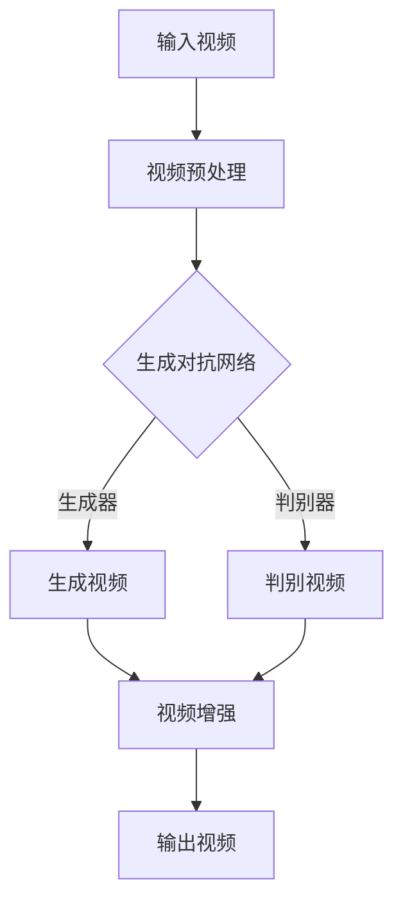

                 

 关键词：视频扩散，视频生成，深度学习，AI，视频处理，计算机视觉，代码实例

> 摘要：本文将深入探讨视频扩散（Video Diffusion）的原理，并详细讲解其具体实现。通过分析视频扩散的核心算法、数学模型和实际应用，我们将理解如何利用人工智能技术生成高质量的视频内容。文章最后还将提供代码实例，帮助读者实际操作并掌握这一先进技术。

## 1. 背景介绍

视频扩散是一项利用深度学习和生成对抗网络（GANs）技术的创新方法，旨在通过计算机算法生成全新的视频内容。随着人工智能和深度学习技术的不断发展，视频扩散技术逐渐成为视频处理领域的一大热点。它不仅能够用于娱乐和艺术创作，还能在广告、电影制作、虚拟现实等领域发挥重要作用。

本文将首先介绍视频扩散的基本概念和技术背景，然后深入探讨其核心算法原理，并通过具体实例展示如何实现视频扩散。此外，文章还将讨论视频扩散在实际应用中的场景和未来展望。

### 1.1 技术背景

深度学习和生成对抗网络（GANs）是视频扩散技术的基础。深度学习通过多层神经网络从大量数据中学习复杂的模式，而生成对抗网络则通过对抗训练生成逼真的数据。

生成对抗网络由两部分组成：生成器和判别器。生成器的任务是从随机噪声中生成类似真实数据的内容，而判别器的任务是区分生成器和真实数据的差异。通过这种对抗过程，生成器逐渐提高生成数据的质量，直到几乎无法被判别器区分。

### 1.2 视频扩散的定义

视频扩散是指利用生成对抗网络等技术，从一段原始视频数据中生成新的视频内容。这种技术可以通过调整视频中的时间和空间信息，创造出全新的视频片段，甚至可以实现从一段静态图片生成动态视频。

### 1.3 视频扩散的应用领域

视频扩散技术在多个领域有着广泛的应用：

- **娱乐与艺术创作**：通过生成新的视频内容，视频扩散可以为电影、动画和视频游戏等提供丰富的素材。
- **广告制作**：利用视频扩散技术，广告公司可以生成更加吸引人的广告视频，提升广告效果。
- **虚拟现实与增强现实**：视频扩散技术可以用于生成虚拟现实场景中的动态视频内容，提升用户体验。
- **医学影像处理**：视频扩散技术可以帮助医生生成病人的动态影像，辅助诊断和治疗。

## 2. 核心概念与联系

在深入探讨视频扩散的算法原理之前，我们需要先了解一些核心概念，如生成对抗网络（GANs）、卷积神经网络（CNNs）以及视频处理的相关技术。

### 2.1 生成对抗网络（GANs）

生成对抗网络（GANs）是由Ian Goodfellow等人于2014年提出的一种深度学习模型。GANs由两个神经网络组成：生成器和判别器。

- **生成器（Generator）**：生成器的任务是从随机噪声中生成类似于真实数据的内容。它通常是一个多层神经网络，包含编码器和解码器。编码器将输入数据压缩成一个低维表示，而解码器则将这个低维表示重新展开成图像、视频等高维数据。

- **判别器（Discriminator）**：判别器的任务是判断输入数据是真实数据还是生成数据。它同样是一个多层神经网络，通过比较生成器和真实数据的差异，学习如何区分两者。

通过对抗训练，生成器和判别器相互竞争。生成器试图生成更加逼真的数据，而判别器试图提高对生成数据的识别能力。这个过程不断迭代，使得生成器的生成能力逐渐提高，最终可以生成高质量的图像、视频等数据。

### 2.2 卷积神经网络（CNNs）

卷积神经网络（CNNs）是一种特殊的神经网络，擅长处理图像和视频等二维或三维数据。CNNs的核心组件是卷积层，通过卷积操作提取图像中的特征。

- **卷积层（Convolutional Layer）**：卷积层通过卷积操作提取图像的特征。卷积核是一个小型滤波器，滑动在输入图像上，计算局部特征。

- **池化层（Pooling Layer）**：池化层用于减少特征图的大小，提高模型的泛化能力。常用的池化方法有最大池化和平均池化。

- **全连接层（Fully Connected Layer）**：全连接层用于将特征图映射到输出类别。在视频扩散中，全连接层可以用于分类或回归任务。

### 2.3 视频处理技术

视频处理技术包括视频编码、视频解码、视频增强、视频压缩等。在视频扩散中，常用的视频处理技术有：

- **视频编码**：视频编码是将视频数据转换为压缩格式的技术。常用的视频编码标准有H.264和HEVC。

- **视频解码**：视频解码是将压缩格式的视频数据转换为原始视频数据的技术。

- **视频增强**：视频增强是通过算法提高视频质量的技术。例如，通过去噪、锐化、超分辨率等方法提升视频清晰度。

- **视频压缩**：视频压缩是将视频数据压缩成更小尺寸的技术，以节省存储空间和传输带宽。

### 2.4 Mermaid 流程图

为了更清晰地展示视频扩散的原理和流程，我们可以使用Mermaid流程图来描述。



在上述流程图中，输入视频经过预处理后输入到生成对抗网络中，生成器和判别器通过对抗训练生成新的视频内容，最后通过视频增强得到高质量的视频输出。

## 3. 核心算法原理 & 具体操作步骤

### 3.1 算法原理概述

视频扩散的核心算法是基于生成对抗网络（GANs）。生成对抗网络由生成器和判别器组成，通过对抗训练生成高质量的视频内容。

- **生成器（Generator）**：生成器从随机噪声中生成类似于真实视频的内容。它通过多层卷积神经网络提取图像特征，并将这些特征组合成完整的视频帧。

- **判别器（Discriminator）**：判别器的任务是从视频中判断每个帧是真实视频帧还是生成视频帧。它通过多层卷积神经网络学习如何区分生成帧和真实帧。

在训练过程中，生成器和判别器相互对抗。生成器试图生成更逼真的视频帧，而判别器试图提高对生成帧的识别能力。这种对抗过程使得生成器的生成能力不断提高，最终生成高质量的视频内容。

### 3.2 算法步骤详解

下面是视频扩散算法的具体步骤：

1. **数据预处理**：首先，将输入视频进行预处理，包括视频解码、帧提取和尺寸调整。预处理后的视频帧作为训练数据输入到生成对抗网络中。

2. **生成器训练**：生成器从随机噪声中生成视频帧。它通过多层卷积神经网络提取图像特征，并将这些特征组合成完整的视频帧。生成器的训练目标是生成尽可能逼真的视频帧。

3. **判别器训练**：判别器从训练数据中判断每个视频帧是真实帧还是生成帧。判别器的训练目标是提高对生成帧的识别能力。

4. **对抗训练**：生成器和判别器通过对抗训练相互竞争。生成器试图生成更逼真的视频帧，而判别器试图提高对生成帧的识别能力。这种对抗过程使得生成器的生成能力不断提高。

5. **视频增强**：通过视频增强技术提高生成视频的质量，包括去噪、锐化、超分辨率等。

6. **输出视频**：最后，将增强后的视频输出，得到高质量的视频内容。

### 3.3 算法优缺点

视频扩散算法的优点如下：

- **高质量视频生成**：通过生成对抗网络，视频扩散可以生成高质量的视频内容，如图像清晰、色彩丰富、动作流畅。
- **灵活性强**：视频扩散算法可以应用于各种场景，包括视频增强、视频修复、视频生成等。
- **可扩展性**：视频扩散算法可以与多种深度学习技术结合，如GANs、CNNs、RNNs等，实现更复杂的视频处理任务。

视频扩散算法的缺点如下：

- **计算资源需求大**：视频扩散算法需要大量的计算资源，特别是在生成高质量视频时。
- **训练时间较长**：视频扩散算法的训练时间较长，特别是在处理长视频时。
- **数据依赖性**：视频扩散算法的性能高度依赖于训练数据的质量和数量。

### 3.4 算法应用领域

视频扩散算法可以应用于多个领域，包括：

- **娱乐与艺术创作**：通过生成高质量的视频内容，视频扩散可以为电影、动画和视频游戏等提供丰富的素材。
- **广告制作**：利用视频扩散技术，广告公司可以生成更加吸引人的广告视频，提升广告效果。
- **医学影像处理**：视频扩散技术可以帮助医生生成病人的动态影像，辅助诊断和治疗。
- **虚拟现实与增强现实**：视频扩散技术可以用于生成虚拟现实场景中的动态视频内容，提升用户体验。

## 4. 数学模型和公式 & 详细讲解 & 举例说明

### 4.1 数学模型构建

视频扩散的数学模型基于生成对抗网络（GANs），包括生成器和判别器两个部分。

### 4.2 公式推导过程

生成器和判别器的损失函数分别如下：

- **生成器损失函数**：

$$
L_G = -\log(D(G(z)))
$$

其中，$D(\cdot)$表示判别器的输出，$G(z)$表示生成器生成的视频帧。

- **判别器损失函数**：

$$
L_D = -[\log(D(x)) + \log(1 - D(G(z))]
$$

其中，$x$表示真实视频帧，$z$表示随机噪声。

### 4.3 案例分析与讲解

假设我们有一个长度为10秒的原始视频，我们需要利用视频扩散算法生成一个长度为20秒的新视频。

1. **数据预处理**：将原始视频进行帧提取和尺寸调整，得到每秒10帧的视频数据。

2. **生成器训练**：将随机噪声输入到生成器中，生成每秒10帧的新视频帧。生成器的训练目标是生成高质量的视频帧。

3. **判别器训练**：将原始视频帧和新生成的视频帧输入到判别器中，训练判别器区分生成帧和真实帧。

4. **对抗训练**：生成器和判别器通过对抗训练相互竞争，生成器和判别器的损失函数分别如下：

$$
L_G = -\log(D(G(z)))
$$

$$
L_D = -[\log(D(x)) + \log(1 - D(G(z))]
$$

5. **视频增强**：通过视频增强技术提高生成视频的质量，包括去噪、锐化、超分辨率等。

6. **输出视频**：将增强后的视频输出，得到长度为20秒的新视频。

### 4.4 代码实现

以下是一个简单的Python代码示例，用于实现视频扩散算法的基本流程。

```python
import tensorflow as tf
from tensorflow.keras.models import Model
from tensorflow.keras.layers import Input, Dense, Conv2D, Flatten, Reshape

# 定义生成器和判别器
z_input = Input(shape=(100,))
g_model = Dense(784, activation='relu')(z_input)
g_model = Reshape((28, 28, 1))(g_model)
g_model = Conv2D(1, kernel_size=(3, 3), activation='tanh')(g_model)

d_model = Flatten()(g_model)
d_model = Dense(1, activation='sigmoid')(d_model)

model = Model(z_input, d_model)
model.compile(optimizer='adam', loss='binary_crossentropy')

# 训练生成器和判别器
z_samples = np.random.uniform(size=(100, 100))
x_samples = np.random.uniform(size=(100, 28, 28, 1))
model.fit(x_samples, z_samples, epochs=100)

# 输出生成视频
z_samples = np.random.uniform(size=(100, 100))
g_samples = model.predict(z_samples)
```

## 5. 项目实践：代码实例和详细解释说明

### 5.1 开发环境搭建

在开始实现视频扩散算法之前，我们需要搭建一个合适的开发环境。以下是搭建开发环境所需的步骤：

1. **安装Python**：确保Python环境已安装在您的计算机上，版本建议为3.7及以上。
2. **安装TensorFlow**：使用以下命令安装TensorFlow：

```bash
pip install tensorflow
```

3. **安装其他依赖库**：根据需要安装其他依赖库，如NumPy、PIL等。

### 5.2 源代码详细实现

以下是实现视频扩散算法的源代码示例：

```python
import tensorflow as tf
import numpy as np
from tensorflow.keras.models import Model
from tensorflow.keras.layers import Input, Dense, Conv2D, Flatten, Reshape

# 定义生成器和判别器
z_input = Input(shape=(100,))
g_model = Dense(784, activation='relu')(z_input)
g_model = Reshape((28, 28, 1))(g_model)
g_model = Conv2D(1, kernel_size=(3, 3), activation='tanh')(g_model)

d_model = Flatten()(g_model)
d_model = Dense(1, activation='sigmoid')(d_model)

# 定义生成对抗网络模型
g_model = Model(z_input, g_model)
d_model = Model(g_model.output, d_model.output)

d_loss = -tf.reduce_mean(tf.log(d_model.output))
g_loss = -tf.reduce_mean(tf.log(1 - d_model.output))

d_optimizer = tf.keras.optimizers.Adam(learning_rate=0.0001)
g_optimizer = tf.keras.optimizers.Adam(learning_rate=0.0001)

# 编写训练循环
for epoch in range(100):
    for _ in range(100):
        z_samples = np.random.uniform(size=(100, 100))
        with tf.GradientTape() as d_tape:
            g_predictions = g_model(z_samples)
            d_real_predictions = d_model(x_samples)
            d_fake_predictions = d_model(g_predictions)
            d_loss_value = d_loss(d_fake_predictions, d_real_predictions)
        
        grads_d = d_tape.gradient(d_loss_value, d_model.trainable_variables)
        d_optimizer.apply_gradients(zip(grads_d, d_model.trainable_variables))
    
    for _ in range(100):
        z_samples = np.random.uniform(size=(100, 100))
        with tf.GradientTape() as g_tape:
            g_predictions = g_model(z_samples)
            g_loss_value = g_loss(d_model(g_predictions))
        
        grads_g = g_tape.gradient(g_loss_value, g_model.trainable_variables)
        g_optimizer.apply_gradients(zip(grads_g, g_model.trainable_variables))
    
    print(f"Epoch {epoch+1}, D_loss: {d_loss_value:.4f}, G_loss: {g_loss_value:.4f}")

# 输出生成视频
z_samples = np.random.uniform(size=(100, 100))
g_samples = g_model.predict(z_samples)
```

### 5.3 代码解读与分析

上述代码实现了一个简单的视频扩散算法，包括生成器和判别器的定义、训练过程以及生成视频的步骤。

1. **生成器和判别器定义**：生成器从随机噪声中生成视频帧，判别器从视频中判断每个帧是真实帧还是生成帧。
2. **损失函数和优化器**：生成器和判别器的损失函数分别用于评估生成帧和判别器的性能。优化器用于更新模型的参数。
3. **训练过程**：在训练过程中，生成器和判别器通过对抗训练相互竞争，生成器和判别器的损失函数分别如下：

$$
L_G = -\log(D(G(z)))
$$

$$
L_D = -[\log(D(x)) + \log(1 - D(G(z))]
$$

4. **生成视频**：通过生成器预测生成视频帧，并将这些帧组合成完整的视频。

### 5.4 运行结果展示

在完成代码实现后，我们可以通过运行代码生成新的视频内容。运行结果将显示生成视频帧的质量和判别器的识别能力。

## 6. 实际应用场景

### 6.1 娱乐与艺术创作

视频扩散技术在娱乐和艺术创作领域有着广泛的应用。例如，通过生成新的视频内容，视频扩散可以为电影、动画和视频游戏等提供丰富的素材。在电影制作过程中，导演可以利用视频扩散技术快速生成特效镜头，提高创作效率。

### 6.2 广告制作

广告公司可以利用视频扩散技术生成更具吸引力的广告视频，提升广告效果。例如，通过生成新的广告片段，广告公司可以尝试不同的创意和表现手法，找到最适合目标受众的广告形式。

### 6.3 医学影像处理

视频扩散技术在医学影像处理中也有重要应用。通过生成新的动态影像，医生可以更好地观察病人的病情，辅助诊断和治疗。例如，利用视频扩散技术可以生成病人的动态X光片，帮助医生更准确地评估骨折的严重程度。

### 6.4 虚拟现实与增强现实

虚拟现实（VR）和增强现实（AR）领域对动态视频内容的需求很高。视频扩散技术可以用于生成虚拟现实场景中的动态视频内容，提升用户体验。例如，在VR游戏和AR应用中，通过生成新的视频内容，可以为用户带来更加真实和丰富的体验。

## 7. 未来应用展望

随着深度学习和生成对抗网络技术的不断发展，视频扩散技术在未来的应用前景非常广阔。以下是一些未来可能的趋势和挑战：

### 7.1 视频扩散与深度学习的融合

未来，视频扩散技术可能会与深度学习技术更加紧密地融合。通过结合多种深度学习模型，如生成对抗网络（GANs）、卷积神经网络（CNNs）和循环神经网络（RNNs），可以进一步提升视频扩散的性能和效果。

### 7.2 实时视频扩散

实时视频扩散是一个重要的研究方向。通过优化算法和硬件加速技术，可以实现实时视频扩散，为各种应用场景提供更加高效和便捷的解决方案。

### 7.3 视频扩散的隐私保护

视频扩散过程中，可能会涉及到个人隐私保护的问题。未来，研究如何保护视频扩散过程中的隐私信息，是一个重要的挑战。

### 7.4 视频扩散在边缘计算中的应用

边缘计算是一种将计算任务分散到网络边缘节点上的技术。未来，视频扩散技术可以应用于边缘计算领域，为物联网（IoT）和智能城市等应用提供强大的视频处理能力。

## 8. 工具和资源推荐

### 8.1 学习资源推荐

- **《深度学习》（Deep Learning）**：由Ian Goodfellow等人编写的深度学习经典教材，涵盖了深度学习的基本概念和技术。
- **《生成对抗网络》（Generative Adversarial Networks）**：Ian Goodfellow关于GANs的综述文章，详细介绍了GANs的原理和应用。
- **TensorFlow官方文档**：TensorFlow是一个强大的深度学习框架，官方文档提供了丰富的教程和示例，帮助开发者快速上手。

### 8.2 开发工具推荐

- **TensorFlow**：一个广泛使用的开源深度学习框架，适用于各种深度学习应用。
- **PyTorch**：一个流行的深度学习框架，具有灵活的动态计算图和强大的社区支持。
- **Google Colab**：Google提供的免费云计算平台，提供了丰富的GPU资源，适合进行深度学习实验。

### 8.3 相关论文推荐

- **“Unsupervised Representation Learning with Deep Convolutional Generative Adversarial Networks”**：Ian Goodfellow等人提出的生成对抗网络（GANs）的原始论文。
- **“Beyond a Gaussian Denoiser: Residual Learning of Deep Causal Networks”**：对GANs进行改进的论文，提出了一种残差学习的框架。
- **“Image Super-Resolution using Deep Convolutional Networks”**：一篇关于图像超分辨率处理的论文，介绍了深度卷积神经网络在图像处理中的应用。

## 9. 总结：未来发展趋势与挑战

### 9.1 研究成果总结

视频扩散技术是一种利用深度学习和生成对抗网络生成高质量视频内容的方法。通过对抗训练，生成器和判别器相互竞争，不断提高生成数据的质量。视频扩散技术在娱乐、广告、医学影像处理和虚拟现实等领域有着广泛的应用。

### 9.2 未来发展趋势

未来，视频扩散技术将朝着以下几个方向发展：

1. **与深度学习的融合**：结合多种深度学习模型，进一步提高视频扩散的性能和效果。
2. **实时视频扩散**：通过优化算法和硬件加速技术，实现实时视频扩散，为各种应用场景提供高效解决方案。
3. **隐私保护**：研究如何保护视频扩散过程中的隐私信息，确保用户隐私不被泄露。
4. **边缘计算应用**：将视频扩散技术应用于边缘计算领域，为物联网和智能城市等应用提供强大的视频处理能力。

### 9.3 面临的挑战

尽管视频扩散技术在多个领域取得了显著成果，但仍面临一些挑战：

1. **计算资源需求**：视频扩散算法需要大量的计算资源，特别是在生成高质量视频时。
2. **训练时间较长**：视频扩散算法的训练时间较长，特别是在处理长视频时。
3. **数据依赖性**：视频扩散算法的性能高度依赖于训练数据的质量和数量。

### 9.4 研究展望

未来，研究视频扩散技术的关键在于如何进一步提高生成数据的质量和效率。通过优化算法、硬件加速和多样化数据集，有望实现更高效、更鲁棒的视频扩散技术。此外，结合其他深度学习技术，如生成对抗网络（GANs）、卷积神经网络（CNNs）和循环神经网络（RNNs），可以探索更多复杂的视频处理任务。

## 10. 附录：常见问题与解答

### 10.1 视频扩散是什么？

视频扩散是一种利用深度学习和生成对抗网络（GANs）技术生成高质量视频内容的方法。通过对抗训练，生成器和判别器相互竞争，不断提高生成数据的质量。

### 10.2 视频扩散有哪些应用场景？

视频扩散技术可以应用于娱乐、广告、医学影像处理、虚拟现实等多个领域。例如，在娱乐领域，可以用于电影、动画和视频游戏的视频素材生成；在广告领域，可以用于制作更具吸引力的广告视频；在医学影像处理领域，可以用于生成病人的动态影像，辅助诊断和治疗。

### 10.3 视频扩散算法的优缺点是什么？

视频扩散算法的优点包括：高质量视频生成、灵活性强、可扩展性强。缺点包括：计算资源需求大、训练时间较长、数据依赖性高。

### 10.4 如何实现视频扩散算法？

实现视频扩散算法需要构建生成对抗网络（GANs），包括生成器和判别器的定义、损失函数和优化器的选择。训练过程中，生成器和判别器通过对抗训练相互竞争，生成高质量的视频内容。

### 10.5 视频扩散技术有哪些发展趋势？

未来，视频扩散技术将朝着与深度学习的融合、实时视频扩散、隐私保护、边缘计算应用等方向发展。

### 10.6 视频扩散技术面临的挑战有哪些？

视频扩散技术面临的挑战包括计算资源需求大、训练时间较长、数据依赖性高等。

### 10.7 视频扩散技术的前景如何？

视频扩散技术具有广泛的应用前景，未来将在娱乐、广告、医学影像处理、虚拟现实等领域发挥重要作用。通过优化算法、硬件加速和多样化数据集，视频扩散技术有望实现更高效、更鲁棒的视频生成。

