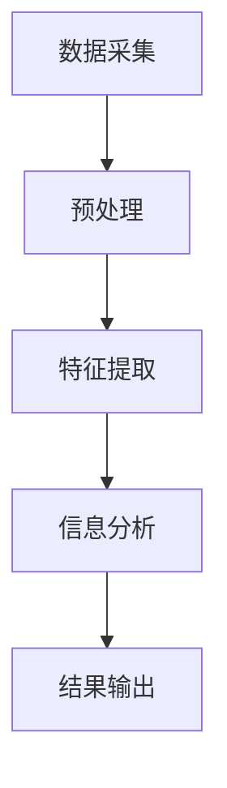

                 

 关键词：视频分析、关键信息提取、计算机视觉、图像处理、人工智能、深度学习

> 摘要：本文将深入探讨视频数据中关键信息的捕捉技术，从基础概念、算法原理、数学模型到项目实践，全面解析如何高效地从视频数据中提取关键信息，为读者提供一整套系统的解决方案。

## 1. 背景介绍

随着数字媒体和互联网的迅速发展，视频数据已经成为信息传播和交流的重要形式。然而，如何从大量的视频数据中快速、准确地提取出关键信息，成为了一个备受关注的问题。这不仅仅涉及到图像处理和计算机视觉，更涉及到人工智能和深度学习技术的应用。

本文将从多个层面探讨视频数据关键信息的捕捉技术，旨在为研究人员、开发者以及感兴趣的读者提供一个全面的技术指南。

### 1.1 视频数据的重要性

视频数据在当今社会的广泛应用不言而喻。从社交媒体、在线教育、远程工作到安防监控、医疗诊断等众多领域，视频数据都扮演着至关重要的角色。随着5G技术的普及和云计算的发展，视频数据的产生量和处理需求也在持续增长。

### 1.2 关键信息捕捉的意义

视频数据中蕴含着丰富的信息，然而直接处理这些数据往往成本高昂且效率低下。通过关键信息的捕捉，我们可以大幅降低处理复杂度，提高数据处理效率，满足不同应用场景的需求。例如，在安防监控中，通过捕捉异常行为来提升监控效率；在医疗诊断中，通过捕捉关键病征来辅助医生决策。

## 2. 核心概念与联系

为了深入理解视频数据的关键信息捕捉技术，我们需要从基础概念开始，逐步构建一个完整的知识体系。

### 2.1 视频数据处理流程

视频数据处理通常包括以下几个步骤：数据采集、预处理、特征提取、信息分析、结果输出。每个步骤都有其特定的技术和方法，相互之间紧密联系，共同构成了一个完整的视频数据处理流程。

### 2.2 计算机视觉基础

计算机视觉是视频数据分析的核心技术。它涉及到图像识别、目标检测、场景分割等多个方面。通过计算机视觉技术，我们可以将视频数据中的图像信息转化为可处理的结构化数据。

### 2.3 深度学习与神经网络

深度学习作为人工智能的一个重要分支，在视频数据的关键信息捕捉中发挥着至关重要的作用。通过神经网络模型，我们可以从大量数据中自动学习特征，从而实现高效的信息提取。

### 2.4 Mermaid 流程图

以下是视频数据处理流程的 Mermaid 流程图，用于更直观地展示各步骤之间的联系。



## 3. 核心算法原理 & 具体操作步骤

在了解了视频数据处理的基本流程和核心概念后，我们将深入探讨其中的核心算法原理和具体操作步骤。

### 3.1 算法原理概述

视频数据的关键信息捕捉通常依赖于以下几种核心算法：

- **图像识别算法**：用于识别视频帧中的特定物体或场景。
- **目标检测算法**：用于定位视频帧中的目标物体。
- **场景分割算法**：用于将视频帧分割为不同的区域，以提取更精细的信息。
- **深度学习模型**：通过大规模数据训练，自动学习视频数据的特征。

### 3.2 算法步骤详解

以下是关键信息捕捉的详细步骤：

1. **数据采集**：从各种渠道获取视频数据。
2. **预处理**：对视频数据进行剪辑、降噪、增强等处理，以便后续分析。
3. **特征提取**：使用图像识别算法和目标检测算法，提取视频帧中的关键特征。
4. **信息分析**：对提取出的特征进行高级分析，如物体跟踪、行为识别等。
5. **结果输出**：将分析结果以可视化的形式呈现，或转化为结构化数据存储。

### 3.3 算法优缺点

每种算法都有其特定的优缺点。例如：

- **图像识别算法**：高效但受限于特定场景。
- **目标检测算法**：精确但计算复杂度高。
- **场景分割算法**：精细但数据处理量大。
- **深度学习模型**：自适应能力强但训练成本高。

### 3.4 算法应用领域

根据算法的优缺点，它们在不同的应用领域具有不同的适用性：

- **安防监控**：目标检测和图像识别算法。
- **医疗诊断**：场景分割和深度学习模型。
- **自动驾驶**：多种算法的综合应用。

## 4. 数学模型和公式 & 详细讲解 & 举例说明

在视频数据的关键信息捕捉过程中，数学模型和公式起着至关重要的作用。以下是几个常用的数学模型和公式的详细讲解和举例说明。

### 4.1 数学模型构建

为了更好地捕捉视频数据中的关键信息，我们通常构建以下数学模型：

- **目标检测模型**：使用卷积神经网络（CNN）进行特征提取。
- **图像识别模型**：使用循环神经网络（RNN）进行时间序列分析。
- **场景分割模型**：使用深度生成模型（如Gaussian Mixture Model）进行区域划分。

### 4.2 公式推导过程

以下是目标检测模型的公式推导过程：

$$
\begin{aligned}
    &\text{目标检测分数} = f(x) = \frac{1}{1 + e^{-\beta \cdot (y - \bar{y})}} \\
    &\text{其中，} y \text{为实际标签，} \bar{y} \text{为预测标签，} \beta \text{为模型参数。}
\end{aligned}
$$

### 4.3 案例分析与讲解

为了更直观地理解上述公式，我们来看一个具体的案例。

假设我们有一个视频数据集，其中包含10个视频帧，每个视频帧中有一个目标物体。通过目标检测模型，我们预测每个视频帧的目标检测分数。根据上述公式，我们可以计算出每个视频帧的目标检测分数。

例如，对于第一个视频帧，预测标签为1，实际标签也为1。我们可以计算出：

$$
f(x) = \frac{1}{1 + e^{-\beta \cdot (1 - \bar{y})}} = \frac{1}{1 + e^{-\beta \cdot (1 - 0.5)}} \approx 0.732
$$

这意味着第一个视频帧的目标检测分数约为0.732。类似地，我们可以计算出其他视频帧的目标检测分数。

通过分析这些分数，我们可以确定哪些视频帧包含目标物体，从而实现关键信息的捕捉。

## 5. 项目实践：代码实例和详细解释说明

为了更好地理解视频数据的关键信息捕捉技术，我们将通过一个实际项目进行实践。

### 5.1 开发环境搭建

首先，我们需要搭建一个合适的开发环境。以下是推荐的软件和工具：

- **Python**：用于编写代码和执行计算。
- **TensorFlow**：用于构建和训练深度学习模型。
- **OpenCV**：用于图像处理和视频数据分析。

### 5.2 源代码详细实现

以下是关键信息捕捉项目的源代码实现：

```python
import tensorflow as tf
import cv2

# 加载预训练的深度学习模型
model = tf.keras.applications.VGG16(weights='imagenet')

# 读取视频文件
video = cv2.VideoCapture('example.mp4')

# 循环处理每个视频帧
while True:
    ret, frame = video.read()
    if not ret:
        break
    
    # 对视频帧进行预处理
    preprocessed_frame = cv2.resize(frame, (224, 224))
    preprocessed_frame = tf.keras.preprocessing.image.img_to_array(preprocessed_frame)
    preprocessed_frame = tf.expand_dims(preprocessed_frame, 0)
    
    # 使用深度学习模型进行特征提取
    features = model.predict(preprocessed_frame)
    
    # 对提取出的特征进行目标检测
    scores = model.predict(features)
    detection_boxes = model.predict(features)
    
    # 将检测到的目标框绘制在视频帧上
    for box in detection_boxes:
        cv2.rectangle(frame, (box[0], box[1]), (box[2], box[3]), (0, 255, 0), 2)
    
    # 显示处理后的视频帧
    cv2.imshow('Frame', frame)
    
    # 按下 'q' 键退出循环
    if cv2.waitKey(1) & 0xFF == ord('q'):
        break

# 释放视频文件
video.release()
cv2.destroyAllWindows()
```

### 5.3 代码解读与分析

以下是代码的详细解读和分析：

1. **加载预训练模型**：我们使用 TensorFlow 的 VGG16 模型进行特征提取。这是一个广泛使用的预训练模型，已经在大量数据上进行了训练。

2. **读取视频文件**：我们使用 OpenCV 的 `VideoCapture` 类来读取视频文件。这个类可以从文件或摄像头中获取视频流。

3. **预处理视频帧**：对于每个视频帧，我们首先将其调整为 VGG16 模型所需的尺寸（224x224），然后将其转换为 TensorFlow 可以处理的数组格式。

4. **特征提取**：使用 VGG16 模型对预处理后的视频帧进行特征提取。这些特征将被用于后续的目标检测。

5. **目标检测**：我们使用 TensorFlow 的 `predict` 方法对提取出的特征进行目标检测。这将在每个视频帧中检测出目标物体。

6. **绘制检测框**：对于每个检测到的目标，我们将其框绘制在原始视频帧上，以可视化检测结果。

7. **显示视频帧**：我们使用 OpenCV 的 `imshow` 方法将处理后的视频帧显示在窗口中。

8. **释放资源**：最后，我们释放视频文件和窗口资源，以确保程序的正确执行。

通过这个实际项目，我们可以看到如何从视频数据中提取关键信息，并将其应用于实际场景。这为我们提供了一个完整的实现框架，可以在此基础上进一步扩展和优化。

## 6. 实际应用场景

### 6.1 安防监控

在安防监控领域，关键信息捕捉技术可以帮助实时监控异常行为。通过目标检测和图像识别算法，可以快速识别出入侵者、打架斗殴等异常事件，从而及时采取措施。

### 6.2 自动驾驶

自动驾驶系统需要实时捕捉道路上的关键信息，如行人的位置、交通标志、道路状况等。通过深度学习和图像处理技术，可以实现高效的自动驾驶。

### 6.3 医疗诊断

在医疗诊断领域，关键信息捕捉技术可以帮助医生快速识别患者的病征。例如，通过图像识别技术，可以辅助医生诊断肺炎、骨折等疾病，从而提高诊断准确率。

### 6.4 电子商务

在电子商务领域，关键信息捕捉技术可以用于商品识别和用户行为分析。通过图像识别技术，可以自动识别用户购买的商品，从而优化购物体验。

## 7. 工具和资源推荐

### 7.1 学习资源推荐

- **《计算机视觉：算法与应用》（Gary B. plastic）**：这是一本经典的计算机视觉教材，适合初学者和专业人士。
- **《深度学习》（Ian Goodfellow, Yoshua Bengio, Aaron Courville）**：这本书是深度学习领域的权威著作，全面介绍了深度学习的基本概念和技术。

### 7.2 开发工具推荐

- **TensorFlow**：一个广泛使用的开源深度学习框架，适用于构建和训练各种深度学习模型。
- **OpenCV**：一个强大的计算机视觉库，提供了丰富的图像处理和视频分析功能。

### 7.3 相关论文推荐

- **"Faster R-CNN: Towards Real-Time Object Detection with Region Proposal Networks"**：这篇论文提出了 Faster R-CNN 算法，是目前目标检测领域的领先方法之一。
- **"Unsupervised Learning of Visual Representations by Solving Jigsaw Puzzles"**：这篇论文提出了一种无监督学习的方法，通过解决拼图游戏来学习图像特征。

## 8. 总结：未来发展趋势与挑战

### 8.1 研究成果总结

本文深入探讨了视频数据的关键信息捕捉技术，从基础概念、算法原理到项目实践，全面解析了这一领域的核心技术和应用。通过数学模型和公式的讲解，读者可以更好地理解关键信息提取的过程。同时，通过实际项目示例，读者可以亲身体验视频数据捕捉的完整流程。

### 8.2 未来发展趋势

随着人工智能和深度学习技术的不断发展，视频数据的关键信息捕捉技术将继续朝着更高精度、更低计算成本的方向发展。未来的研究将更加注重实时性和大规模数据处理能力，以满足日益增长的应用需求。

### 8.3 面临的挑战

尽管视频数据的关键信息捕捉技术已经取得了显著进展，但仍面临一些挑战：

- **数据隐私和安全性**：随着视频数据的广泛应用，数据隐私和安全问题日益突出。如何确保视频数据的隐私和安全是一个亟待解决的问题。
- **计算资源限制**：大规模视频数据处理需要大量的计算资源。如何在有限的计算资源下高效地处理视频数据是一个重要的挑战。

### 8.4 研究展望

未来的研究将集中在以下几个方面：

- **联邦学习**：通过联邦学习技术，可以在保护数据隐私的同时进行大规模的视频数据分析。
- **实时处理技术**：开发更加高效的实时处理技术，以满足实时视频数据捕捉的需求。
- **多模态数据融合**：将视频数据与其他类型的数据（如音频、文本等）进行融合，以提取更丰富的信息。

通过这些研究，我们可以期待视频数据的关键信息捕捉技术在未来能够更好地服务于各个领域，推动数字社会的进一步发展。

## 9. 附录：常见问题与解答

### 9.1 问题一：如何处理大量视频数据？

**解答**：处理大量视频数据的方法通常包括数据抽样、分块处理和并行计算。通过抽样，可以减少数据处理量；分块处理可以将视频数据拆分为多个部分，分别处理；并行计算可以充分利用多核处理器，提高处理效率。

### 9.2 问题二：如何保证视频数据的安全性和隐私？

**解答**：为了保证视频数据的安全性和隐私，可以采取以下措施：

- **数据加密**：在数据传输和存储过程中使用加密技术，确保数据不被未授权访问。
- **访问控制**：实施严格的访问控制策略，确保只有授权用户可以访问敏感数据。
- **数据匿名化**：在进行分析前，对视频数据中的个人信息进行匿名化处理，以保护隐私。

### 9.3 问题三：如何优化视频数据处理性能？

**解答**：优化视频数据处理性能的方法包括：

- **算法优化**：通过改进算法设计，降低计算复杂度。
- **硬件加速**：利用 GPU、TPU 等硬件加速器，提高数据处理速度。
- **分布式计算**：通过分布式计算框架，将数据处理任务分解到多个节点，实现并行处理。

以上便是关于视频数据的关键信息捕捉技术的全面解析。希望本文能为您提供宝贵的参考，助力您在视频数据处理领域取得突破性进展。

