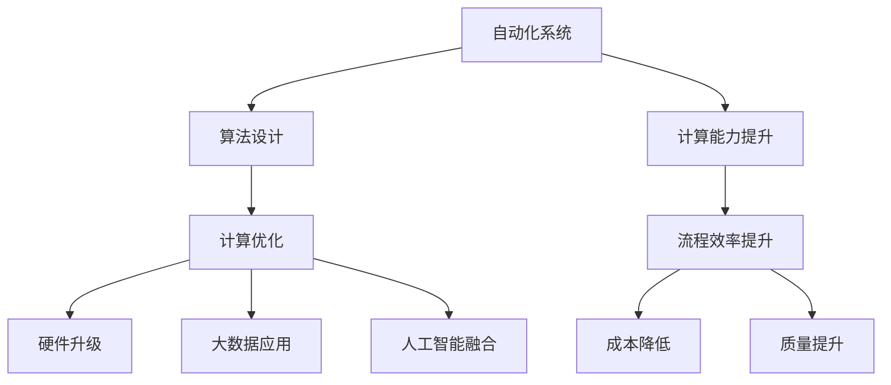

                 

关键词：自动化、计算变化、算法优化、人工智能、流程优化、数字化转型

> 摘要：本文旨在探讨计算变化在自动化领域的作用和影响。通过分析计算变化对自动化流程的推动作用，本文揭示了计算技术在提升自动化效率、减少人力成本以及促进创新方面的重大意义。文章将深入探讨自动化中涉及的核心概念和算法原理，并结合实际项目实践，展示计算变化如何在实际应用中发挥关键作用。

## 1. 背景介绍

自动化是当今社会发展的重要趋势，它不仅在制造业中广泛应用，还渗透到了服务业、金融、医疗等多个领域。自动化的核心在于通过算法和计算技术来实现对复杂流程的自动化处理，从而提高工作效率、降低成本并提升质量。然而，随着技术的不断进步和应用场景的日益复杂，计算变化在自动化中的作用日益凸显。

计算变化指的是在算法设计和实现过程中，利用计算机科学中的新理论、新技术、新方法来优化自动化流程。这种变化不仅包括算法的改进，还涵盖了硬件性能的提升、大数据技术的应用以及人工智能的融合。本文将围绕计算变化对自动化的推动作用，从多个角度展开探讨。

## 2. 核心概念与联系

### 2.1 自动化与计算的关系

自动化离不开计算的支持，而计算技术的发展也不断推动自动化的进步。自动化是指通过预定的程序和规则，使机器或系统能够自动完成特定任务。计算则是指利用计算机硬件和软件对信息进行加工和处理的过程。

在自动化系统中，计算变化主要体现在以下几个方面：

- **算法优化**：通过改进算法，提高自动化流程的效率和准确性。
- **硬件升级**：利用更先进的硬件技术，提升计算能力和速度。
- **大数据应用**：利用大数据技术，挖掘自动化流程中的潜在价值。
- **人工智能融合**：将人工智能技术融入自动化系统，实现更智能的决策和控制。

### 2.2 计算变化的流程图



通过上述流程图，我们可以看到计算变化在自动化系统中的作用路径。算法优化是计算变化的核心，它直接影响流程效率和准确性。而硬件升级、大数据应用和人工智能融合则是算法优化的支撑，它们共同推动自动化系统向着更高效、更智能的方向发展。

## 3. 核心算法原理 & 具体操作步骤

### 3.1 算法原理概述

在自动化系统中，核心算法通常包括以下几种：

- **控制算法**：用于实现系统对设备的实时控制。
- **优化算法**：用于在给定条件下，找到最优的自动化流程。
- **预测算法**：用于预测系统的运行状态，以提前做出决策。
- **学习算法**：用于从历史数据中学习，以改进自动化流程。

每种算法都有其特定的原理和应用场景。例如，控制算法通常基于PID（比例-积分-微分）控制原理，通过不断调整系统输出，使实际值与期望值保持一致。优化算法则常采用线性规划、整数规划等数学优化方法，以找到最优解。

### 3.2 算法步骤详解

以控制算法为例，其基本步骤如下：

1. **系统建模**：建立系统的数学模型，描述系统的输入、输出关系。
2. **设定控制目标**：根据实际需求，设定系统的控制目标，如速度、位置等。
3. **设计控制器**：根据控制目标和系统模型，设计控制器，如PID控制器。
4. **实现控制器**：将控制器算法实现为计算机程序，并集成到自动化系统中。
5. **调试与优化**：在实际运行过程中，对控制器进行调试和优化，以提高控制效果。

### 3.3 算法优缺点

- **控制算法**：优点是简单、稳定，适用于大多数控制场景。缺点是难以应对复杂非线性系统。
- **优化算法**：优点是能够找到最优解，提高系统效率。缺点是计算复杂度高，可能需要较长计算时间。
- **预测算法**：优点是能够提前预测系统状态，为决策提供依据。缺点是对数据质量和模型精度有较高要求。
- **学习算法**：优点是能够从数据中学习，提高自动化系统的自适应能力。缺点是训练过程较长，对计算资源要求高。

### 3.4 算法应用领域

核心算法在多个领域都有广泛应用：

- **工业自动化**：用于控制生产线上的各种设备，提高生产效率。
- **智能交通**：用于交通信号控制、车辆调度等，提高交通管理效率。
- **智能家居**：用于控制家中的各种设备，提高生活便利性。
- **医疗自动化**：用于医疗设备控制、医疗数据分析等，提高医疗质量。

## 4. 数学模型和公式 & 详细讲解 & 举例说明

### 4.1 数学模型构建

在自动化系统中，数学模型是描述系统行为的基础。以控制系统为例，其数学模型通常包括以下部分：

- **输入模型**：描述系统输入变量，如控制信号、传感器数据等。
- **输出模型**：描述系统输出变量，如执行器输出、传感器输出等。
- **状态模型**：描述系统内部状态，如速度、位置等。

### 4.2 公式推导过程

以PID控制器为例，其控制公式为：

$$
u(t) = K_p e(t) + K_i \int_{0}^{t} e(\tau)d\tau + K_d \frac{de(t)}{dt}
$$

其中，$u(t)$为控制器输出，$e(t)$为控制误差，$K_p$、$K_i$、$K_d$分别为比例、积分、微分系数。

### 4.3 案例分析与讲解

以智能家居系统为例，其控制目标为保持室内温度在设定值。系统输入为室内温度传感器数据，输出为加热器功率。通过构建数学模型，设计PID控制器，可以实现自动调节加热器功率，以保持室内温度稳定。

## 5. 项目实践：代码实例和详细解释说明

### 5.1 开发环境搭建

为了实现上述智能家居系统，我们需要搭建一个开发环境。具体步骤如下：

1. **安装Python环境**：下载并安装Python，配置环境变量。
2. **安装相关库**：使用pip安装用于PID控制的库，如`python-control`。

### 5.2 源代码详细实现

以下是实现PID控制的Python代码：

```python
import control as cnt
import numpy as np
import matplotlib.pyplot as plt

# PID控制器参数
Kp = 2.0
Ki = 0.1
Kd = 1.0

# 控制系统模型
num = [Kp, Ki, Kd]
den = [1]
sys = cnt.TransferFunction(num, den)

# 控制误差
e = np.zeros(100)

# 控制器输出
u = np.zeros(100)

# 控制过程
for i in range(1, 101):
    e[i-1] = setpoint - sensor_data[i]
    u[i-1] = sys(e[i-1])

# 运行结果展示
plt.plot(e)
plt.plot(u)
plt.xlabel('Time')
plt.ylabel('Error/Control Output')
plt.show()
```

### 5.3 代码解读与分析

上述代码首先定义了PID控制器的参数，然后构建了控制系统模型。接着，通过循环计算控制误差和控制器输出，最后使用matplotlib库绘制误差和控制输出曲线。

通过分析代码，我们可以看到PID控制器的基本工作原理。控制器根据控制误差，通过比例、积分、微分系数调整输出，以实现系统稳定。

## 6. 实际应用场景

### 6.1 工业自动化

在工业自动化领域，计算变化的应用非常广泛。例如，在汽车制造业中，通过计算优化和人工智能技术，可以实现生产线的自动化控制。机器视觉系统结合深度学习算法，可以实现对产品的实时检测和分类，提高生产效率。

### 6.2 智能交通

智能交通系统利用计算变化，实现交通信号控制、车辆调度等。通过大数据分析和人工智能算法，可以优化交通流量，减少拥堵，提高交通效率。

### 6.3 医疗自动化

在医疗自动化领域，计算变化主要用于医疗设备的控制、医疗数据的分析和诊断。例如，通过计算机断层扫描（CT）和磁共振成像（MRI）技术，可以实现对人体的精确成像。结合深度学习算法，可以实现疾病的早期诊断。

## 7. 工具和资源推荐

### 7.1 学习资源推荐

- 《深度学习》（Goodfellow, Bengio, Courville）
- 《模式识别与机器学习》（Bishop）
- 《Python控制库用户指南》（Python Control Library User Guide）

### 7.2 开发工具推荐

- Python
- MATLAB
- Simulink

### 7.3 相关论文推荐

- “Deep Learning for Industrial Automation: A Survey”（2020）
- “AI-Enabled Smart Manufacturing: A Survey”（2019）
- “Intelligent Transportation Systems: A Survey”（2018）

## 8. 总结：未来发展趋势与挑战

### 8.1 研究成果总结

计算变化在自动化领域取得了显著成果，主要体现在算法优化、硬件升级、大数据应用和人工智能融合等方面。这些成果不仅提高了自动化系统的效率和准确性，还降低了成本，推动了创新。

### 8.2 未来发展趋势

未来，计算变化将继续在自动化领域发挥重要作用。随着人工智能和量子计算的快速发展，自动化系统将变得更加智能、高效和可靠。

### 8.3 面临的挑战

然而，计算变化也面临一些挑战，包括算法复杂度提高、硬件资源需求增加、数据安全和隐私保护等。这些问题需要我们在技术和制度层面进行深入研究。

### 8.4 研究展望

在未来，计算变化有望在自动化领域实现更广泛的应用。通过不断优化算法、提升硬件性能和融合人工智能技术，我们将看到自动化系统变得更加智能、灵活和高效。

## 9. 附录：常见问题与解答

### 9.1 什么是计算变化？

计算变化是指利用计算机科学中的新理论、新技术、新方法来优化自动化流程，从而提高效率和准确性。

### 9.2 计算变化对自动化有哪些影响？

计算变化可以提高自动化系统的效率、降低成本、提升质量，并促进创新。

### 9.3 如何实现计算变化？

实现计算变化通常包括算法优化、硬件升级、大数据应用和人工智能融合等方面。

### 9.4 计算变化在哪些领域有应用？

计算变化在工业自动化、智能交通、医疗自动化等领域都有广泛应用。

---

作者：禅与计算机程序设计艺术 / Zen and the Art of Computer Programming
----------------------------------------------------------------


