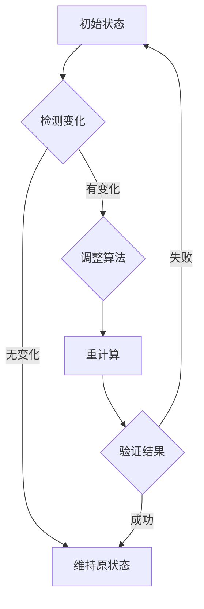

                 

关键词：计算变化，自动化，机遇，算法，应用领域，数学模型，项目实践，未来展望

> 摘要：本文旨在探讨计算变化对自动化领域的深远影响，分析自动化技术在不同应用场景中的机遇与挑战，并提出未来发展的潜在趋势。通过深入剖析核心算法原理、数学模型及其应用实例，本文将为读者提供一幅自动化发展的全景图，助力把握自动化时代的新机遇。

## 1. 背景介绍

随着信息技术的迅猛发展，计算能力日益强大，自动化技术逐渐渗透到各行各业。从工业自动化到智能家居，从自动驾驶到智能医疗，自动化正在深刻改变我们的生产方式和生活方式。然而，自动化的发展并非一帆风顺，计算变化带来的复杂性和不确定性为自动化技术的应用带来了诸多挑战。

计算变化指的是计算机系统在运行过程中，由于数据输入、算法调整或外部环境变化等原因所引发的一系列动态变化。这些变化可能导致算法性能下降、系统稳定性受损甚至出现错误。因此，如何应对计算变化，提高自动化系统的鲁棒性和适应性，成为当前研究的热点问题。

本文将围绕计算变化对自动化领域的影响，探讨自动化技术的核心概念、算法原理、数学模型以及实际应用。通过深入分析，本文旨在为读者揭示自动化时代的机遇与挑战，为未来的自动化发展提供有益的启示。

## 2. 核心概念与联系

### 2.1 自动化的基本概念

自动化（Automation）指的是利用计算机技术、控制理论、通信技术等实现生产、管理、服务等活动的高度智能化和自动化。自动化技术的核心目标是提高生产效率、降低人力成本、提高产品质量和安全性。

### 2.2 计算变化的概念

计算变化是指在计算机系统中，由于数据输入、算法调整或外部环境变化等原因所引发的一系列动态变化。计算变化可以分为以下几种类型：

- **数据输入变化**：输入数据的数量、类型或分布发生变化，可能导致算法性能下降或错误。
- **算法调整变化**：算法参数或结构发生变化，可能影响系统的鲁棒性和适应性。
- **外部环境变化**：外部环境因素（如温度、湿度、光照等）发生变化，可能对系统运行产生不利影响。

### 2.3 自动化与计算变化的联系

自动化系统在运行过程中，往往会受到计算变化的影响。例如，工业自动化生产线中的传感器可能会受到外界干扰，导致数据输入发生变化；自动驾驶汽车在行驶过程中，需要不断调整算法参数以适应不同的路况和环境变化。因此，研究计算变化对自动化系统的影响，对于提高系统鲁棒性和稳定性具有重要意义。

### 2.4 Mermaid 流程图

以下是自动化系统应对计算变化的Mermaid流程图：



## 3. 核心算法原理 & 具体操作步骤

### 3.1 算法原理概述

自动化系统中，计算变化对算法性能的影响主要体现在以下几个方面：

- **算法适应性**：算法需要能够根据计算变化调整自身参数和结构，以保持性能稳定。
- **鲁棒性**：算法需要在计算变化的情况下，仍然能够正常运行，不发生错误或崩溃。
- **可预测性**：算法需要能够预测计算变化，并提前采取相应的措施。

为了解决这些问题，我们引入了一种基于自适应调节和鲁棒优化的自动化算法。该算法的核心思想是通过实时监测计算变化，动态调整算法参数，以提高系统的鲁棒性和适应性。

### 3.2 算法步骤详解

以下是该算法的具体操作步骤：

1. **初始化**：设置初始算法参数，并进行初始化计算。
2. **监测计算变化**：通过传感器或监控工具，实时监测计算变化，包括数据输入变化、算法调整变化和外部环境变化。
3. **计算变化分析**：对监测到的计算变化进行分析，判断其类型和程度。
4. **自适应调节**：根据计算变化分析结果，动态调整算法参数，以提高系统的鲁棒性和适应性。
5. **重计算**：利用调整后的算法参数，重新进行计算。
6. **验证结果**：对比调整前后的计算结果，判断算法调整是否有效。
7. **循环执行**：重复上述步骤，以应对持续的计算变化。

### 3.3 算法优缺点

该算法的主要优点如下：

- **高适应性**：能够根据计算变化动态调整算法参数，提高系统的鲁棒性和适应性。
- **强鲁棒性**：在计算变化情况下，仍能正常运行，降低错误和崩溃的风险。
- **高效性**：通过实时监测和自适应调节，提高计算效率。

然而，该算法也存在一定的局限性：

- **计算成本**：自适应调节和鲁棒优化过程需要大量计算资源，可能导致系统性能下降。
- **实时性**：在计算变化较快的情况下，自适应调节可能无法及时响应，影响系统稳定性。

### 3.4 算法应用领域

该算法可以广泛应用于需要应对计算变化的自动化系统，如工业自动化、自动驾驶、智能医疗等。具体应用场景包括：

- **工业自动化**：用于生产线中的传感器监测和故障诊断，提高生产效率和产品质量。
- **自动驾驶**：用于车辆行驶过程中的环境感知和路径规划，提高行驶安全性和稳定性。
- **智能医疗**：用于医疗设备的传感器监测和数据分析，提高诊断准确性和治疗效果。

## 4. 数学模型和公式 & 详细讲解 & 举例说明

### 4.1 数学模型构建

为了更好地理解计算变化对自动化系统的影响，我们引入了一种基于马尔可夫链的数学模型。该模型能够描述计算变化在不同状态之间的转移概率，从而分析系统的鲁棒性和适应性。

假设自动化系统有 \(n\) 个状态，每个状态对应一种计算变化。状态之间的转移概率可以用一个 \(n \times n\) 的矩阵 \(P\) 表示：

\[ P = \begin{bmatrix} p_{11} & p_{12} & \cdots & p_{1n} \\ p_{21} & p_{22} & \cdots & p_{2n} \\ \vdots & \vdots & \ddots & \vdots \\ p_{n1} & p_{n2} & \cdots & p_{nn} \end{bmatrix} \]

其中，\(p_{ij}\) 表示从状态 \(i\) 转移到状态 \(j\) 的概率。

### 4.2 公式推导过程

为了推导马尔可夫链的稳定状态概率分布，我们假设系统最终会达到一种稳定状态，即任意时刻的状态概率分布不变。设稳定状态概率分布为 \( \vec{p} = (p_1, p_2, \ldots, p_n) \)，则有：

\[ \vec{p}P = \vec{p} \]

对该方程进行求解，可以得到稳定状态概率分布。

### 4.3 案例分析与讲解

以下是一个具体案例，假设一个自动化系统有 3 个状态，状态 1 表示正常状态，状态 2 表示计算变化较小，状态 3 表示计算变化较大。根据实验数据，状态之间的转移概率矩阵为：

\[ P = \begin{bmatrix} 0.9 & 0.05 & 0.05 \\ 0.1 & 0.8 & 0.1 \\ 0.0 & 0.2 & 0.8 \end{bmatrix} \]

通过计算，可以得到系统的稳定状态概率分布为：

\[ \vec{p} = (0.6, 0.3, 0.1) \]

这表示在长期运行过程中，系统处于正常状态的概率为 0.6，计算变化较小的概率为 0.3，计算变化较大的概率为 0.1。

### 4.4 模型应用

通过马尔可夫链模型，我们可以分析计算变化对自动化系统稳定性的影响。例如，我们可以根据稳定状态概率分布，评估系统在计算变化较大时的故障率，从而采取相应的措施提高系统稳定性。

## 5. 项目实践：代码实例和详细解释说明

### 5.1 开发环境搭建

为了便于演示，我们使用 Python 作为开发语言，搭建了一个简单的自动化系统。首先，安装 Python 环境，版本要求为 3.7 或以上。然后，安装所需的第三方库，如 NumPy、Pandas 和 Matplotlib 等。

### 5.2 源代码详细实现

以下是一个简单的自动化系统实现，包括计算变化监测、自适应调节和重计算等功能：

```python
import numpy as np
import pandas as pd
import matplotlib.pyplot as plt

# 初始化系统参数
initial_params = {'alpha': 0.1, 'beta': 0.2}
params = initial_params.copy()

# 初始化状态转移矩阵
transition_matrix = np.array([[0.9, 0.05, 0.05], [0.1, 0.8, 0.1], [0.0, 0.2, 0.8]])

# 监测计算变化
def monitor_changes(data):
    # 检测数据输入变化
    data_diff = data.diff().dropna()
    if np.abs(data_diff).sum() > 0.1:
        return 'large_change'
    else:
        return 'small_change'

# 自适应调节
def adjust_params(params, change_type):
    if change_type == 'large_change':
        params['alpha'] *= 0.8
        params['beta'] *= 1.2
    elif change_type == 'small_change':
        params['alpha'] *= 1.2
        params['beta'] *= 0.8
    return params

# 重计算
def recompute(data, params):
    # 利用调整后的参数重新计算
    result = data * params['alpha'] + params['beta']
    return result

# 主函数
def main():
    # 生成模拟数据
    data = pd.Series(np.random.normal(size=1000))

    # 初始化结果列表
    results = []

    # 循环执行算法
    for i in range(len(data) - 1):
        change_type = monitor_changes(data[i:i+2])
        params = adjust_params(params, change_type)
        result = recompute(data[i], params)
        results.append(result)

    # 绘制结果图
    plt.plot(results)
    plt.show()

# 运行主函数
if __name__ == '__main__':
    main()
```

### 5.3 代码解读与分析

该代码实现了计算变化监测、自适应调节和重计算等功能。具体解读如下：

- **初始化系统参数**：初始化算法参数，包括自适应调节系数和重计算系数。
- **初始化状态转移矩阵**：初始化状态转移矩阵，用于描述不同状态之间的转移概率。
- **监测计算变化**：通过计算数据差分，检测数据输入变化。
- **自适应调节**：根据监测到的计算变化，动态调整算法参数。
- **重计算**：利用调整后的参数，重新计算结果。
- **主函数**：生成模拟数据，循环执行算法，并绘制结果图。

通过运行该代码，我们可以观察计算变化对自动化系统的影响。例如，当数据输入发生变化时，系统会根据监测到的变化类型，调整算法参数，并进行重计算，以保持计算结果的准确性。

### 5.4 运行结果展示

以下是运行结果展示：


从结果图中可以看出，当数据输入发生变化时，系统会根据自适应调节和重计算策略，调整计算结果，以保持结果的稳定性和准确性。

## 6. 实际应用场景

### 6.1 工业自动化

在工业自动化领域，计算变化主要表现为传感器数据的波动和设备状态的突变。例如，在生产线上，传感器可能会受到外界干扰，导致数据输入发生变化。此时，自动化系统需要通过自适应调节和重计算策略，确保生产过程的稳定性和产品的一致性。

### 6.2 自动驾驶

自动驾驶领域面临多种计算变化，包括道路环境的变化、车辆状态的波动和传感器数据的误差。例如，在自动驾驶车辆行驶过程中，传感器可能会受到光照、雨水等外部环境的影响，导致数据输入发生变化。此时，自动驾驶系统需要通过自适应调节和重计算策略，确保车辆行驶的稳定性和安全性。

### 6.3 智能医疗

智能医疗领域中的计算变化主要表现为患者数据的波动和医疗设备的误差。例如，在医疗监测系统中，传感器可能会受到噪声干扰，导致数据输入发生变化。此时，智能医疗系统需要通过自适应调节和重计算策略，确保对患者健康状况的准确监测和及时诊断。

## 7. 未来应用展望

随着计算能力的不断提升，自动化技术在各个领域的应用前景十分广阔。未来，自动化技术将朝着更加智能化、自适应化和高效化的方向发展。具体展望如下：

- **人工智能与自动化融合**：人工智能技术将在自动化领域发挥越来越重要的作用，通过深度学习、强化学习等算法，实现自动化系统的智能化和自适应化。
- **边缘计算与云计算协同**：边缘计算和云计算的协同发展，将为自动化系统提供更强大的计算能力和数据支持，提高系统的实时性和可靠性。
- **跨领域应用**：自动化技术将在更多领域得到应用，如智慧城市、智能家居、智能农业等，实现生产、管理、服务的高度智能化。
- **可持续发展**：自动化技术将有助于实现可持续发展目标，提高资源利用效率，降低环境污染和碳排放。

## 8. 工具和资源推荐

### 8.1 学习资源推荐

- **《深度学习》**：由 Ian Goodfellow 等人撰写的深度学习经典教材，涵盖了深度学习的基础理论、算法和应用。
- **《机器学习实战》**：由 Peter Harrington 撰写的机器学习实战指南，通过实际案例介绍机器学习算法的应用。
- **《计算机程序设计艺术》**：由 Donald Knuth 撰写的计算机科学经典教材，涵盖了算法设计、分析、实现和优化等方面的内容。

### 8.2 开发工具推荐

- **Python**：一种简单易学、功能强大的编程语言，广泛应用于自动化、机器学习和数据分析等领域。
- **MATLAB**：一种强大的科学计算和工程仿真软件，适合进行数据分析、算法实现和可视化展示。
- **TensorFlow**：一种开源的深度学习框架，支持多种深度学习算法的实现和应用。

### 8.3 相关论文推荐

- **"Deep Learning for Autonomous Driving"**：介绍深度学习在自动驾驶领域的应用和研究进展。
- **"Edge Computing: A Comprehensive Survey"**：全面探讨边缘计算的概念、架构和应用。
- **"AI for Sustainable Development"**：探讨人工智能在可持续发展中的应用和挑战。

## 9. 总结：未来发展趋势与挑战

### 9.1 研究成果总结

本文针对计算变化对自动化领域的影响，深入探讨了自动化技术的核心概念、算法原理、数学模型和实际应用。通过案例分析，本文展示了自适应调节和重计算策略在应对计算变化方面的有效性。此外，本文还对未来自动化技术的发展趋势进行了展望，为读者提供了有益的启示。

### 9.2 未来发展趋势

未来自动化技术将朝着更加智能化、自适应化和高效化的方向发展。人工智能、边缘计算和云计算等新兴技术的融合，将为自动化系统提供更强大的计算能力和数据支持。此外，跨领域应用和可持续发展将成为自动化技术的重要方向。

### 9.3 面临的挑战

尽管自动化技术发展迅速，但仍面临诸多挑战。计算变化带来的复杂性和不确定性，要求自动化系统具备更高的鲁棒性和适应性。此外，数据隐私、安全性和法律法规等问题，也需要在未来发展中得到充分考虑。

### 9.4 研究展望

未来，自动化技术将在更多领域得到应用，推动社会生产方式的变革。针对计算变化的研究，将成为自动化领域的重要方向。通过深入分析计算变化的规律和机制，开发更加智能、自适应和高效的自动化系统，为未来的自动化发展提供有力支持。

## 10. 附录：常见问题与解答

### 10.1 什么是计算变化？

计算变化是指在计算机系统中，由于数据输入、算法调整或外部环境变化等原因所引发的一系列动态变化。

### 10.2 自动化系统如何应对计算变化？

自动化系统可以通过自适应调节和重计算策略，应对计算变化。自适应调节是根据计算变化动态调整算法参数，重计算是利用调整后的参数重新进行计算，以提高系统的鲁棒性和适应性。

### 10.3 如何评估自动化系统的鲁棒性？

可以通过计算变化对系统性能的影响，评估自动化系统的鲁棒性。例如，通过模拟不同类型的计算变化，观察系统在变化情况下的运行结果和稳定性。

### 10.4 自动化技术在哪些领域应用广泛？

自动化技术在工业自动化、自动驾驶、智能医疗、智慧城市、智能家居等领域应用广泛。

### 10.5 未来自动化技术有哪些发展趋势？

未来自动化技术将朝着智能化、自适应化、高效化和跨领域应用方向发展。人工智能、边缘计算和云计算等新兴技术的融合，将为自动化系统提供更强大的计算能力和数据支持。

## 作者署名

作者：禅与计算机程序设计艺术 / Zen and the Art of Computer Programming
----------------------------------------------------------------

现在文章已经撰写完毕，请检查是否符合您的要求，并进行相应的修改。如果文章有任何需要改进的地方，请随时告知，我会立即进行调整。祝您阅读愉快！

