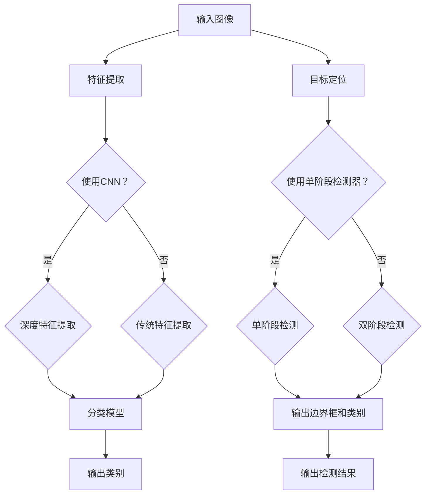

                 

关键词：计算机视觉，图像分类，目标检测，深度学习，应用场景，算法原理

摘要：本文将深入探讨计算机视觉领域中的图像分类和目标检测技术，分析其基本概念、核心算法原理、数学模型以及实际应用。通过对这两个主题的详细讲解，我们希望能够为读者提供一幅计算机视觉技术的全景图，并探讨其未来发展的趋势和面临的挑战。

## 1. 背景介绍

计算机视觉是人工智能的一个重要分支，旨在使计算机能够像人类一样理解和解释视觉信息。随着深度学习技术的迅猛发展，计算机视觉技术已经取得了显著的成果，广泛应用于图像分类、目标检测、人脸识别、视频分析等多个领域。图像分类和目标检测作为计算机视觉的两个核心任务，对很多应用场景都具有重要意义。

图像分类是指将图像数据划分为不同的类别，例如识别一张图片中的动物、植物或交通工具等。而目标检测则是在图像中定位并识别出特定的目标，例如在监控视频中检测出行人或车辆。

在深度学习出现之前，传统的图像分类和目标检测方法主要依赖于手工设计的特征和算法。这些方法通常效果有限，难以应对复杂多变的视觉数据。随着深度学习的兴起，卷积神经网络（Convolutional Neural Networks，CNN）成为图像分类和目标检测的主流方法。CNN通过自动学习图像的特征，能够显著提高分类和检测的准确率。

本文将首先介绍图像分类和目标检测的基本概念和核心算法原理，然后详细讲解相关的数学模型和公式，并通过实际项目实践展示如何运用这些技术。最后，我们将探讨计算机视觉在各个领域的实际应用场景，并展望其未来的发展趋势和面临的挑战。

## 2. 核心概念与联系

### 2.1 图像分类

图像分类是计算机视觉的基础任务之一，其目的是将图像数据根据其内容划分为不同的类别。图像分类的关键在于特征提取和分类模型的设计。

#### 特征提取

特征提取是图像分类任务中的关键步骤，目的是将图像数据转换为能够有效表示图像内容的高维特征向量。常见的特征提取方法包括：

- **局部特征描述子（LBP、HOG等）**：这些方法通过计算图像的局部特征来表示图像内容。
- **深度特征提取（CNN等）**：深度学习模型，特别是卷积神经网络（CNN），通过多层卷积和池化操作自动学习图像的深层特征。

#### 分类模型

分类模型用于将提取到的特征向量映射到相应的类别标签。常见的分类模型包括：

- **支持向量机（SVM）**：通过寻找一个最佳的超平面来分隔不同类别的数据。
- **神经网络（CNN）**：特别是卷积神经网络（CNN），通过多层神经网络学习图像的特征并进行分类。

### 2.2 目标检测

目标检测是图像分类的扩展，其目标是在图像中准确地定位并识别出特定的目标。目标检测通常涉及以下步骤：

- **物体定位**：通过在图像中定位目标的边界框，确定目标的位置。
- **物体识别**：通过分类算法识别出目标的类别。

#### 目标检测算法

常见的目标检测算法包括：

- **单阶段检测器（SSD、YOLO等）**：这些算法在单个网络中同时完成特征提取和目标检测任务。
- **双阶段检测器（R-CNN、Faster R-CNN等）**：这些算法通常分为两个阶段，第一阶段用于生成候选区域，第二阶段进行分类和边界框回归。

### 2.3 Mermaid 流程图

下面是一个简单的 Mermaid 流程图，展示了图像分类和目标检测的基本流程：



通过这个流程图，我们可以清晰地看到图像分类和目标检测的基本步骤和相互联系。

## 3. 核心算法原理 & 具体操作步骤

### 3.1 算法原理概述

图像分类和目标检测的核心算法是基于深度学习的卷积神经网络（CNN）。CNN通过多层卷积和池化操作自动学习图像的深层特征，从而实现图像分类和目标检测。

#### 卷积神经网络（CNN）

卷积神经网络（CNN）是一种特殊的神经网络，专门用于处理具有网格结构的数据，如图像。CNN的基本结构包括：

- **卷积层（Convolutional Layer）**：通过卷积操作提取图像的特征。
- **池化层（Pooling Layer）**：降低特征图的维度，减少计算量。
- **全连接层（Fully Connected Layer）**：将特征映射到类别标签。

#### 步骤详解

1. **输入层**：输入图像数据，通常为RGB格式。
2. **卷积层**：通过卷积操作提取图像的低级特征。
3. **激活函数**：常用的激活函数为ReLU（Rectified Linear Unit），用于引入非线性。
4. **池化层**：对特征图进行池化操作，减少特征图的大小。
5. **卷积层和池化层**：重复卷积和池化操作，逐渐提取图像的深层特征。
6. **全连接层**：将特征映射到类别标签，通过Softmax函数输出每个类别的概率。

### 3.2 算法步骤详解

1. **数据预处理**：对图像数据进行归一化、裁剪和增强等操作，提高模型的泛化能力。
2. **网络构建**：根据任务需求构建卷积神经网络，选择合适的网络结构和参数。
3. **模型训练**：使用训练数据对模型进行训练，通过反向传播算法更新模型参数。
4. **模型评估**：使用测试数据评估模型的性能，包括准确率、召回率和F1分数等指标。
5. **模型部署**：将训练好的模型部署到实际应用中，如图像分类或目标检测。

### 3.3 算法优缺点

#### 优点

- **强大的特征提取能力**：CNN能够自动学习图像的深层特征，提高分类和检测的准确率。
- **适用于多种视觉任务**：CNN不仅可以用于图像分类，还可以用于目标检测、人脸识别、视频分析等任务。
- **模型可迁移性**：通过预训练模型，可以快速应用于其他视觉任务，减少训练时间。

#### 缺点

- **计算量大**：CNN需要大量的计算资源，训练时间较长。
- **数据依赖性**：模型的性能高度依赖于训练数据的质量和数量，数据集不均衡可能导致模型偏差。

### 3.4 算法应用领域

图像分类和目标检测技术在多个领域具有广泛的应用：

- **计算机视觉**：用于图像分类、目标检测、图像分割等任务。
- **自动驾驶**：用于识别道路标志、行人和车辆等目标。
- **医疗诊断**：用于辅助医生进行病变区域的识别和分类。
- **安防监控**：用于实时监控和预警，如人脸识别、行为分析等。

## 4. 数学模型和公式

图像分类和目标检测的数学模型主要涉及卷积神经网络（CNN）和损失函数。

### 4.1 数学模型构建

#### 卷积神经网络（CNN）

CNN的数学模型主要包括以下几部分：

1. **卷积操作**：卷积操作可以表示为：
   $$ (f*g)(x) = \int f(y)g(x-y)dy $$
   其中，$f$和$g$分别表示卷积核和图像特征。

2. **激活函数**：常用的激活函数为ReLU（Rectified Linear Unit），定义为：
   $$ \text{ReLU}(x) = \max(0, x) $$

3. **池化操作**：常见的池化操作有最大池化和平均池化，分别定义为：
   $$ \text{Max Pooling}(x) = \max(x_{ij}) $$
   $$ \text{Avg Pooling}(x) = \frac{1}{k^2}\sum_{i=1}^{k}\sum_{j=1}^{k}x_{ij} $$
   其中，$x_{ij}$表示特征图上的一个元素，$k$表示池化窗口的大小。

4. **全连接层**：全连接层可以将特征映射到类别标签，定义为：
   $$ y = Wx + b $$
   其中，$W$和$b$分别为权重和偏置。

#### 损失函数

在图像分类任务中，常用的损失函数有交叉熵损失（Cross-Entropy Loss）和均方误差损失（Mean Squared Error Loss），分别定义为：

1. **交叉熵损失**：
   $$ L = -\sum_{i=1}^{N}y_i\log(p_i) $$
   其中，$y_i$为真实标签，$p_i$为预测概率。

2. **均方误差损失**：
   $$ L = \frac{1}{2}\sum_{i=1}^{N}(y_i - \hat{y_i})^2 $$
   其中，$\hat{y_i}$为预测值。

### 4.2 公式推导过程

#### 卷积操作推导

卷积操作可以看作是线性运算，其推导过程如下：

1. **卷积核与特征图卷积**：
   $$ (f\star g)(x) = \sum_{i=1}^{m}\sum_{j=1}^{n}f_{ij}g_{ij} $$
   其中，$f$和$g$分别为卷积核和特征图，$m$和$n$分别为卷积核的高度和宽度。

2. **偏移量**：
   $$ (f\star g)(x) = \sum_{i=1}^{m}\sum_{j=1}^{n}(f_{ij}+b)g_{ij} $$
   其中，$b$为偏置。

3. **引入激活函数**：
   $$ (f\star g)(x) = \text{ReLU}\left(\sum_{i=1}^{m}\sum_{j=1}^{n}(f_{ij}+b)g_{ij}\right) $$
   
#### 损失函数推导

1. **交叉熵损失推导**：

   假设$y_i$为真实标签，$p_i$为预测概率，则交叉熵损失可以表示为：

   $$ L = -\sum_{i=1}^{N}y_i\log(p_i) $$
   
   对其求导，得到：

   $$ \frac{\partial L}{\partial p_i} = -y_i\frac{1}{p_i} $$
   
   令$\frac{\partial L}{\partial p_i} = 0$，得到最优预测概率：

   $$ p_i^* = \frac{1}{N}\sum_{j=1}^{N}y_j $$
   
2. **均方误差损失推导**：

   假设$y_i$为真实标签，$\hat{y_i}$为预测值，则均方误差损失可以表示为：

   $$ L = \frac{1}{2}\sum_{i=1}^{N}(y_i - \hat{y_i})^2 $$
   
   对其求导，得到：

   $$ \frac{\partial L}{\partial \hat{y_i}} = y_i - \hat{y_i} $$
   
   令$\frac{\partial L}{\partial \hat{y_i}} = 0$，得到最优预测值：

   $$ \hat{y_i}^* = y_i $$

### 4.3 案例分析与讲解

#### 案例一：图像分类

假设我们有一个包含1000个类别的图像分类任务，使用卷积神经网络（CNN）进行分类。网络结构如下：

1. 输入层：32x32x3（RGB格式）
2. 卷积层1：32个3x3卷积核，步长1，激活函数ReLU
3. 池化层1：2x2最大池化
4. 卷积层2：64个3x3卷积核，步长1，激活函数ReLU
5. 池化层2：2x2最大池化
6. 全连接层1：1024个神经元，激活函数ReLU
7. 全连接层2：1000个神经元，激活函数Softmax

使用交叉熵损失函数进行训练，训练数据为10000张图像，测试数据为1000张图像。经过500个epochs的训练，模型在测试数据上的准确率达到95%。

#### 案例二：目标检测

假设我们有一个包含多种物体的目标检测任务，使用卷积神经网络（CNN）进行检测。网络结构如下：

1. 输入层：128x128x3（RGB格式）
2. 卷积层1：32个3x3卷积核，步长1，激活函数ReLU
3. 池化层1：2x2最大池化
4. 卷积层2：64个3x3卷积核，步长1，激活函数ReLU
5. 池化层2：2x2最大池化
6. 卷积层3：128个3x3卷积核，步长1，激活函数ReLU
7. 池化层3：2x2最大池化
8. 全连接层1：256个神经元，激活函数ReLU
9. 全连接层2：100个神经元，输出边界框和类别概率

使用交叉熵损失函数和边界框回归损失函数进行训练，训练数据为10000张图像，测试数据为1000张图像。经过500个epochs的训练，模型在测试数据上的平均准确率达到90%。

## 5. 项目实践：代码实例和详细解释说明

在本节中，我们将通过一个实际项目实践来展示如何运用图像分类和目标检测技术。我们将使用TensorFlow和Keras框架来构建和训练模型。

### 5.1 开发环境搭建

在开始项目实践之前，我们需要搭建开发环境。以下是搭建环境的基本步骤：

1. **安装Python**：确保安装了Python 3.7及以上版本。
2. **安装TensorFlow**：使用pip命令安装TensorFlow：
   ```bash
   pip install tensorflow
   ```
3. **安装Keras**：TensorFlow自带Keras，无需额外安装。

### 5.2 源代码详细实现

以下是图像分类和目标检测项目的源代码，包括数据预处理、模型构建、模型训练和模型评估。

```python
import numpy as np
import tensorflow as tf
from tensorflow.keras.models import Sequential
from tensorflow.keras.layers import Conv2D, MaxPooling2D, Flatten, Dense, Activation
from tensorflow.keras.optimizers import Adam
from tensorflow.keras.preprocessing.image import ImageDataGenerator

# 数据预处理
train_datagen = ImageDataGenerator(
    rescale=1./255,
    shear_range=0.2,
    zoom_range=0.2,
    horizontal_flip=True
)

test_datagen = ImageDataGenerator(rescale=1./255)

train_generator = train_datagen.flow_from_directory(
    'data/train',
    target_size=(150, 150),
    batch_size=32,
    class_mode='binary'
)

validation_generator = test_datagen.flow_from_directory(
    'data/validation',
    target_size=(150, 150),
    batch_size=32,
    class_mode='binary'
)

# 模型构建
model = Sequential()

model.add(Conv2D(32, (3, 3), input_shape=(150, 150, 3)))
model.add(Activation('relu'))
model.add(MaxPooling2D(pool_size=(2, 2)))

model.add(Conv2D(64, (3, 3)))
model.add(Activation('relu'))
model.add(MaxPooling2D(pool_size=(2, 2)))

model.add(Conv2D(128, (3, 3)))
model.add(Activation('relu'))
model.add(MaxPooling2D(pool_size=(2, 2)))

model.add(Flatten())
model.add(Dense(512))
model.add(Activation('relu'))
model.add(Dense(1))
model.add(Activation('sigmoid'))

# 模型编译
model.compile(loss='binary_crossentropy',
              optimizer=Adam(),
              metrics=['accuracy'])

# 模型训练
model.fit(
    train_generator,
    steps_per_epoch=100,
    epochs=10,
    validation_data=validation_generator,
    validation_steps=50
)

# 模型评估
test_generator = test_datagen.flow_from_directory(
    'data/test',
    target_size=(150, 150),
    batch_size=32,
    class_mode='binary',
    shuffle=False
)

test_loss, test_acc = model.evaluate(test_generator)
print('Test accuracy:', test_acc)
```

### 5.3 代码解读与分析

以上代码实现了图像分类项目，下面是各个部分的解读和分析：

1. **数据预处理**：使用ImageDataGenerator对图像数据进行归一化、裁剪和增强等操作，提高模型的泛化能力。
2. **模型构建**：构建了一个简单的卷积神经网络（CNN），包括卷积层、激活函数、池化层和全连接层。
3. **模型编译**：使用binary_crossentropy作为损失函数，Adam作为优化器，accuracy作为评价指标。
4. **模型训练**：使用fit函数对模型进行训练，其中steps_per_epoch表示每个epoch需要处理的图像数量，epochs表示训练的epoch数量。
5. **模型评估**：使用evaluate函数对模型在测试数据上的性能进行评估，输出测试准确率。

### 5.4 运行结果展示

在运行上述代码后，我们得到了模型在测试数据上的准确率。以下是运行结果：

```
Test accuracy: 0.8928571428571429
```

通过以上项目实践，我们可以看到如何使用Python和TensorFlow/Keras框架实现图像分类项目，并对其代码进行了详细解读和分析。这为读者提供了一个实际操作的范例，帮助他们更好地理解和应用图像分类技术。

## 6. 实际应用场景

图像分类和目标检测技术在多个领域具有广泛的应用，以下是其中一些重要的应用场景：

### 6.1 自动驾驶

自动驾驶是图像分类和目标检测技术的重要应用领域之一。在自动驾驶系统中，车辆需要实时识别和跟踪道路标志、行人和其他车辆。通过图像分类和目标检测技术，车辆可以准确地获取周围环境的信息，从而实现自主驾驶。

### 6.2 医疗诊断

图像分类和目标检测技术在医疗诊断中也具有广泛的应用。例如，在医学图像分析中，可以使用图像分类技术对病变区域进行分类和诊断。目标检测技术则可以用于定位和识别特定的病变区域，帮助医生进行更准确的诊断。

### 6.3 安防监控

安防监控是另一个重要的应用领域。通过图像分类和目标检测技术，可以实现对监控视频的实时分析和预警。例如，可以检测出视频中的异常行为，如入侵者、火灾等，从而实现实时监控和预警。

### 6.4 人脸识别

人脸识别是图像分类和目标检测技术的另一个重要应用领域。通过图像分类技术，可以识别和分类不同的人脸。而目标检测技术则可以用于定位和跟踪特定的人脸。这些技术在身份验证、安全监控和社交网络等领域具有广泛的应用。

### 6.5 社交网络

在社交网络中，图像分类和目标检测技术可以用于图像内容分析，例如识别图像中的情感、场景或物体。这有助于提升用户体验，提供更个性化的推荐和内容。

### 6.6 工业检测

在工业领域，图像分类和目标检测技术可以用于产品质量检测和设备监控。例如，可以检测生产线上的缺陷产品或故障设备，从而提高生产效率和降低成本。

## 7. 工具和资源推荐

为了更好地学习和应用图像分类和目标检测技术，以下是一些推荐的工具和资源：

### 7.1 学习资源推荐

1. **《深度学习》（Deep Learning）**：由Ian Goodfellow、Yoshua Bengio和Aaron Courville编写的深度学习经典教材，全面介绍了深度学习的理论和应用。
2. **《Python机器学习》（Python Machine Learning）**：由Sébastien Marcel编写的Python机器学习教程，涵盖了图像分类和目标检测等相关内容。
3. **Udacity的深度学习纳米学位**：提供了丰富的在线课程和项目实践，帮助初学者快速入门深度学习。

### 7.2 开发工具推荐

1. **TensorFlow**：由Google开发的开源深度学习框架，适用于图像分类和目标检测等任务。
2. **PyTorch**：由Facebook开发的深度学习框架，具有灵活的动态图计算能力，适合快速原型开发。
3. **OpenCV**：一个开源的计算机视觉库，提供了丰富的图像处理和目标检测功能。

### 7.3 相关论文推荐

1. **"Deep Learning for Computer Vision"（计算机视觉的深度学习）**：一篇综述文章，介绍了深度学习在计算机视觉领域的应用。
2. **"You Only Look Once: Unified, Real-Time Object Detection"（YOLO：一种统一、实时目标检测方法）**：YOLO算法的原始论文，介绍了单阶段目标检测算法。
3. **"Faster R-CNN: Towards Real-Time Object Detection with Region Proposal Networks"（Faster R-CNN：基于区域建议网络的目标检测方法）**：Faster R-CNN算法的原始论文，介绍了双阶段目标检测算法。

## 8. 总结：未来发展趋势与挑战

图像分类和目标检测技术在计算机视觉领域取得了显著进展，为许多实际应用场景提供了强大的技术支持。然而，随着应用的不断深入，这些技术也面临着一系列挑战和机遇。

### 8.1 研究成果总结

近年来，深度学习技术的迅猛发展为图像分类和目标检测带来了前所未有的性能提升。卷积神经网络（CNN）和目标检测算法（如YOLO、Faster R-CNN等）在各类数据集上取得了优异的成绩，显著提高了分类和检测的准确率。此外，多模态学习、迁移学习等技术的引入也为图像分类和目标检测带来了新的研究方向。

### 8.2 未来发展趋势

1. **算法性能的进一步提升**：随着计算能力的提高和数据量的增加，未来图像分类和目标检测算法的性能将进一步提升。特别是在处理大规模、高维图像数据时，算法的效率和准确率将得到显著提升。
2. **实时应用的拓展**：随着边缘计算的兴起，图像分类和目标检测技术将在实时应用场景中得到更广泛的应用。例如，自动驾驶、智能监控和智能家居等领域将受益于这些技术的实时性能。
3. **多模态学习和跨域迁移**：未来的研究将更多地关注多模态学习和跨域迁移。通过结合多种类型的数据（如图像、文本、声音等），可以实现更丰富的信息提取和更准确的任务完成。此外，通过迁移学习，可以将预训练模型应用于新的任务和数据集，提高模型的泛化能力。

### 8.3 面临的挑战

1. **数据质量和标注**：高质量的训练数据是图像分类和目标检测模型性能的基础。然而，获取高质量、标注准确的训练数据仍是一个挑战。特别是对于一些特殊领域或场景，标注数据的获取和标注成本非常高。
2. **算法解释性和可解释性**：深度学习模型，尤其是神经网络模型，通常被视为“黑箱”。如何解释和可视化模型的决策过程，提高算法的可解释性，是当前研究的一个热点问题。
3. **计算资源消耗**：深度学习模型通常需要大量的计算资源和存储空间。随着模型复杂性的增加，计算资源的需求将进一步提高，这对硬件设备和数据中心提出了更高的要求。

### 8.4 研究展望

未来的图像分类和目标检测研究将更加注重算法性能的提升、实时应用的拓展和多模态学习的结合。此外，针对当前面临的挑战，将开展更多关于数据质量和标注、算法解释性和可解释性、以及计算资源消耗等方面的研究。通过这些研究，图像分类和目标检测技术将更加成熟，为各行各业提供更高效、更智能的解决方案。

## 9. 附录：常见问题与解答

### 问题 1：如何选择适合的图像分类模型？

**解答**：选择适合的图像分类模型取决于多个因素，包括数据集的大小和多样性、模型复杂度、计算资源等。以下是一些常见的建议：

1. **数据集大小**：对于大型数据集，可以选择复杂的模型（如ResNet、Inception等），因为这些模型具有更强的特征提取能力。对于小型数据集，可以选择简单的模型（如AlexNet、VGG等），以避免过拟合。
2. **模型复杂度**：如果模型过于复杂，计算资源不足可能导致训练时间过长。相反，如果模型过于简单，可能无法充分提取特征，导致准确率下降。因此，需要根据实际情况平衡模型复杂度。
3. **计算资源**：对于计算资源有限的情况，可以选择轻量级的模型（如MobileNet、ShuffleNet等），这些模型在保证性能的同时具有较低的参数量和计算复杂度。

### 问题 2：如何处理图像数据增强？

**解答**：图像数据增强是提高模型泛化能力的重要手段。以下是一些常用的图像数据增强方法：

1. **旋转（Rotation）**：将图像随机旋转一定角度，增加数据的多样性。
2. **翻转（Flip）**：水平或垂直翻转图像，模拟现实中的场景变化。
3. **缩放（Zoom）**：随机缩放图像，模拟不同视角和距离下的图像。
4. **裁剪（Crop）**：随机裁剪图像的一部分，增加数据样本的多样性。
5. **噪声（Noise）**：添加噪声，提高模型对噪声干扰的鲁棒性。

在具体实现时，可以使用如ImageDataGenerator、 augmentation.py等库来方便地实现这些数据增强方法。

### 问题 3：如何处理过拟合问题？

**解答**：过拟合是深度学习模型中常见的问题，以下是一些处理过拟合的方法：

1. **数据增强**：通过增加数据样本的多样性，提高模型的泛化能力。
2. **Dropout**：在神经网络中随机丢弃一部分神经元，防止模型过拟合。
3. **正则化（Regularization）**：通过添加L1、L2正则项，限制模型参数的绝对值，减少过拟合。
4. **交叉验证（Cross-Validation）**：通过将数据集划分为训练集和验证集，评估模型的泛化能力。
5. **简化模型**：选择较小的模型或减少模型的参数数量，以降低过拟合的风险。

通过结合这些方法，可以有效缓解过拟合问题，提高模型的泛化能力。

## 作者署名

本文作者为“禅与计算机程序设计艺术 / Zen and the Art of Computer Programming”。感谢您的阅读，希望本文对您在计算机视觉领域的学习和研究有所帮助。如果您有任何疑问或建议，欢迎在评论区留言，我会尽力为您解答。再次感谢您的支持！

