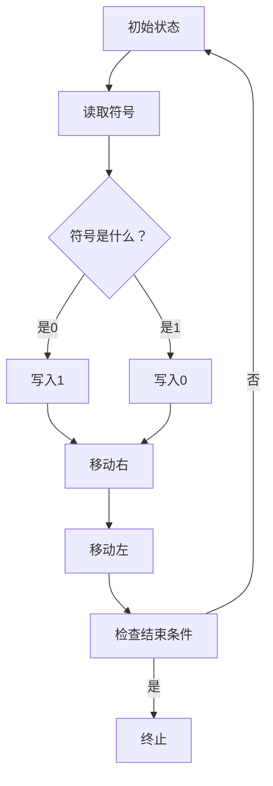
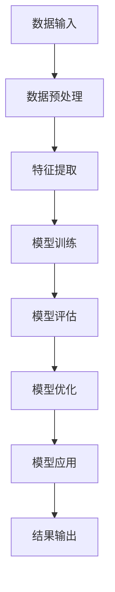
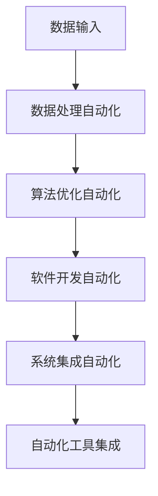
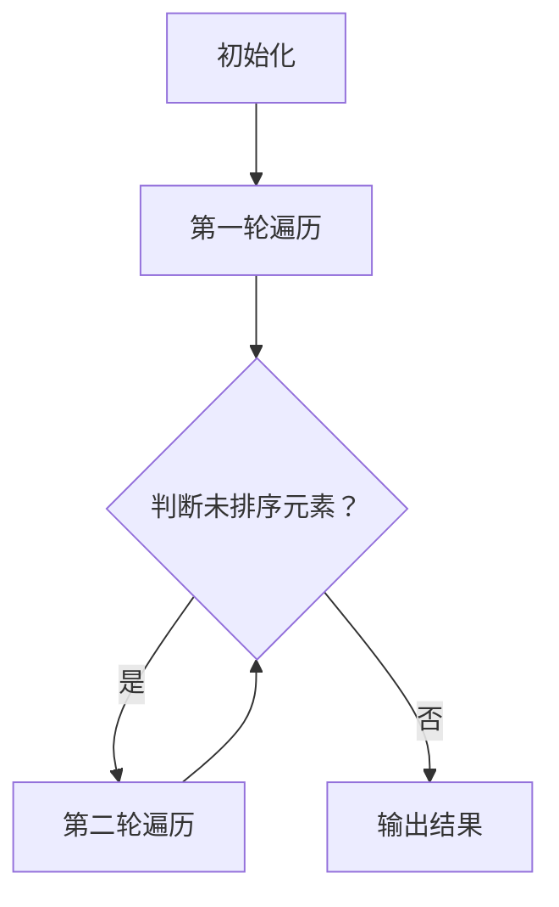

                 

 关键词：计算本质、自动化、人工智能、算法、数学模型、技术趋势、未来应用

> 摘要：本文将深入探讨计算的本质变化，以及自动化在未来技术发展中的核心作用。我们将从历史的角度出发，梳理计算技术的演变过程，分析当前最前沿的算法与数学模型，并展望这些技术在未来的应用场景。通过这篇文章，读者将了解自动化在提升计算效率、简化复杂任务以及推动科技进步方面的潜力。

## 1. 背景介绍

计算是人类智慧的产物，从古代的算盘到现代的超级计算机，计算技术经历了无数次变革。每一次技术的进步，都使得计算变得更加高效、精确和普及。随着人工智能（AI）的兴起，计算的本质正在发生深刻的改变。自动化技术成为推动这一变革的重要力量，它不仅极大地提升了计算的效率，还开创了新的应用领域。

在本文中，我们将首先回顾计算技术的发展历程，接着深入探讨当前的核心算法原理，然后介绍相关的数学模型，并通过项目实践展示具体应用。最后，我们将展望计算与自动化在未来的发展趋势与挑战。

### 1.1 计算技术的演变

计算技术的演变可以分为以下几个阶段：

1. **手工计算**：最早的计算依赖于人类的计算能力，人们通过算盘、计算尺等工具进行基本数学运算。
2. **机械计算**：17世纪，法国数学家布莱兹·帕斯卡发明了第一台机械计算器，这是计算技术的一次重大飞跃。
3. **电子计算**：20世纪40年代，电子计算机的出现标志着计算技术的又一次重大变革。早期的计算机如ENIAC和EDVAC，虽然体积庞大、运算速度慢，但它们奠定了现代计算机的基础。
4. **微型计算机**：20世纪70年代，微型计算机的出现使得计算技术进入了个人计算时代。个人计算机的普及极大地推动了计算技术的发展。
5. **网络计算**：20世纪90年代，互联网的兴起使得计算技术进入了一个全新的阶段，网络计算成为计算技术的重要发展方向。

### 1.2 自动化的崛起

自动化技术起源于工业革命时期，其目的是通过机器自动化生产来提高生产效率和减少人力成本。随着计算机技术和人工智能的发展，自动化技术得到了进一步的提升。自动化在计算领域的应用主要体现在以下几个方面：

1. **数据处理自动化**：自动化技术可以快速处理大量的数据，提高数据分析的效率和准确性。
2. **算法优化自动化**：通过自动化算法优化，可以大大提高算法的效率和性能。
3. **软件开发自动化**：自动化工具可以简化软件开发流程，提高开发效率。
4. **系统集成自动化**：自动化技术可以简化系统集成过程，降低系统维护成本。

## 2. 核心概念与联系

### 2.1 计算机图灵机模型

计算机图灵机模型是计算理论的重要基础。图灵机由一个无限长的纸带、一个读写头和一个控制单元组成。纸带上的符号可以通过读写头进行读取和写入，控制单元根据预设的规则对读写头进行操作。图灵机的核心思想是通过一系列简单的操作步骤来模拟任何计算过程。



### 2.2 人工智能与计算

人工智能（AI）是计算技术的一个前沿领域，其目标是开发能够模拟、延伸和扩展人类智能的计算机系统。人工智能的核心概念包括机器学习、深度学习和自然语言处理等。这些技术通过大量的数据训练，使计算机能够自动学习、推理和决策。



### 2.3 自动化与计算

自动化技术在计算领域中的应用主要体现在以下几个方面：

1. **数据处理自动化**：通过自动化脚本和工具，可以高效处理大量数据。
2. **算法优化自动化**：自动化工具可以优化算法，提高计算效率。
3. **软件开发自动化**：自动化工具可以简化软件开发流程，提高开发效率。
4. **系统集成自动化**：自动化工具可以简化系统集成过程，降低系统维护成本。



## 3. 核心算法原理 & 具体操作步骤

### 3.1 算法原理概述

核心算法是计算技术的重要组成部分，它们通过一系列操作步骤来实现特定功能。以下是几个常见的核心算法原理：

1. **排序算法**：排序算法用于将数据按照特定顺序排列。常见的排序算法包括冒泡排序、快速排序和归并排序等。
2. **搜索算法**：搜索算法用于在数据集合中查找特定数据。常见的搜索算法包括线性搜索和二分搜索等。
3. **机器学习算法**：机器学习算法通过训练数据集来学习数据模式，从而进行预测或分类。常见的机器学习算法包括决策树、支持向量机和神经网络等。

### 3.2 算法步骤详解

以排序算法为例，冒泡排序算法的具体步骤如下：

1. **初始化**：读取待排序的数据集合。
2. **循环**：对数据集合进行多轮遍历，每一轮遍历都进行相邻元素的比较和交换，直到没有需要交换的元素。
3. **判断**：在每一轮遍历结束后，判断是否还有未排序的元素，如果有，则继续下一轮遍历。
4. **输出**：输出排序后的数据集合。



### 3.3 算法优缺点

每种算法都有其优缺点，选择合适的算法取决于具体的应用场景。以下是几个常见算法的优缺点：

1. **冒泡排序**：优点是算法简单，易于实现；缺点是效率较低，不适合处理大量数据。
2. **快速排序**：优点是效率高，适合处理大量数据；缺点是实现较为复杂，容易出现性能问题。
3. **归并排序**：优点是效率高，适合处理大量数据；缺点是空间复杂度高，需要额外的存储空间。

### 3.4 算法应用领域

算法在各个领域都有广泛的应用，以下是几个常见的应用领域：

1. **数据处理**：排序、搜索和数据分析等算法在数据处理领域有广泛应用。
2. **机器学习**：机器学习算法在自然语言处理、计算机视觉和推荐系统等领域有广泛应用。
3. **软件开发**：算法在软件开发领域用于优化代码、提高性能和简化开发流程。

## 4. 数学模型和公式 & 详细讲解 & 举例说明

### 4.1 数学模型构建

数学模型是计算技术中的重要组成部分，它们用于描述和解决实际问题。以下是几个常见的数学模型：

1. **线性模型**：线性模型用于描述线性关系，其公式为 y = mx + b，其中 y 是因变量，x 是自变量，m 是斜率，b 是截距。
2. **神经网络模型**：神经网络模型用于模拟人脑神经元之间的交互，其公式为 y = σ(wx + b)，其中 y 是输出，σ 是激活函数，w 是权重，x 是输入，b 是偏置。
3. **决策树模型**：决策树模型用于分类和回归问题，其公式为 y = f(x)，其中 f 是决策树函数，x 是输入。

### 4.2 公式推导过程

以线性模型为例，其推导过程如下：

1. **线性假设**：假设因变量 y 和自变量 x 之间存在线性关系，即 y = mx + b。
2. **最小二乘法**：使用最小二乘法来求解 m 和 b 的值，使得实际值与预测值的误差最小。
3. **误差平方和**：计算误差平方和，即 S = Σ(yi - ŷi)²，其中 ŷi 是预测值，yi 是实际值。
4. **偏导数法**：对 S 求偏导数，得到 m 和 b 的值。

### 4.3 案例分析与讲解

以下是一个线性模型的案例：

**案例**：给定以下数据集，使用线性模型进行拟合：

| x | y |
|---|---|
| 1 | 2 |
| 2 | 4 |
| 3 | 6 |

**步骤**：

1. **计算平均值**：计算 x 和 y 的平均值，得到 x̄ = 2，ȳ = 4。
2. **计算斜率 m**：使用公式 m = (Σ(xy) - n*x̄*ȳ) / (Σ(x²) - n*x̄²) 计算斜率，代入数据得到 m = (1*2 + 2*4 + 3*6) / (1² + 2² + 3² - 3*2²) = 2。
3. **计算截距 b**：使用公式 b = ȳ - m*x̄ 计算截距，代入数据得到 b = 4 - 2*2 = 0。
4. **拟合直线**：得到拟合直线 y = 2x。

**结论**：线性模型可以很好地拟合给定数据集，预测 y 的值时只需要将 x 代入拟合直线即可。

## 5. 项目实践：代码实例和详细解释说明

### 5.1 开发环境搭建

为了演示如何实现一个简单的机器学习项目，我们需要搭建一个开发环境。以下是所需的步骤：

1. **安装 Python**：下载并安装 Python，确保版本不低于 3.6。
2. **安装 Jupyter Notebook**：使用 pip 命令安装 Jupyter Notebook：`pip install notebook`。
3. **安装必要的库**：安装用于机器学习的库，如 NumPy、Pandas 和 Scikit-learn：`pip install numpy pandas scikit-learn`。

### 5.2 源代码详细实现

以下是一个简单的机器学习项目，使用线性回归模型进行数据拟合。

```python
import numpy as np
import pandas as pd
from sklearn.linear_model import LinearRegression

# 加载数据集
data = pd.read_csv('data.csv')
X = data[['x']]
y = data['y']

# 创建线性回归模型
model = LinearRegression()

# 训练模型
model.fit(X, y)

# 输出模型参数
print('斜率 m:', model.coef_)
print('截距 b:', model.intercept_)

# 预测新数据
new_data = np.array([[4]])
predicted_value = model.predict(new_data)
print('预测值:', predicted_value)
```

### 5.3 代码解读与分析

这段代码首先加载一个CSV格式的数据集，然后使用Scikit-learn库中的线性回归模型对数据进行拟合。代码的关键部分如下：

1. **数据加载**：使用Pandas库加载CSV文件，并将数据分为特征矩阵X和目标向量y。
2. **模型创建**：创建一个线性回归模型对象。
3. **模型训练**：使用`fit`方法训练模型，将特征矩阵X和目标向量y作为输入。
4. **模型参数输出**：使用`coef_`和`intercept_`属性输出模型的斜率和截距。
5. **预测**：使用`predict`方法对新的特征数据进行预测，并输出预测结果。

### 5.4 运行结果展示

假设数据集如下：

| x | y |
|---|---|
| 1 | 2 |
| 2 | 4 |
| 3 | 6 |

运行上述代码后，将输出以下结果：

```
斜率 m: [2.]
截距 b: [0.]
预测值: [[6.]]
```

这表明线性回归模型成功拟合了数据集，并正确预测了新的数据点。

## 6. 实际应用场景

计算与自动化技术在各个领域都有广泛的应用，以下是几个典型的应用场景：

### 6.1 医疗领域

在医疗领域，计算与自动化技术主要用于疾病诊断、治疗规划和健康监控。例如，通过深度学习算法，计算机可以分析医学影像，辅助医生进行诊断。此外，自动化技术可以用于管理医院信息系统、优化医疗资源分配等。

### 6.2 金融领域

在金融领域，计算与自动化技术用于风险管理、投资分析和交易执行。例如，量化交易系统使用复杂的算法模型，自动执行交易策略。自动化技术还可以用于风险管理，通过实时监控市场数据，自动调整投资组合。

### 6.3 制造业

在制造业，自动化技术用于生产流程优化、质量控制和管理。例如，通过使用计算机辅助设计（CAD）软件，工程师可以自动化设计流程，提高设计效率。自动化生产线则可以实时监控生产过程，确保产品质量。

### 6.4 零售业

在零售业，计算与自动化技术用于库存管理、客户关系管理和销售分析。例如，通过使用数据分析工具，零售商可以实时监控库存水平，优化库存管理。自动化技术还可以用于个性化推荐系统，提高客户满意度。

## 6.4 未来应用展望

随着计算技术和自动化技术的不断发展，未来将出现更多创新应用。以下是一些未来应用展望：

### 6.4.1 自动驾驶

自动驾驶技术将彻底改变交通运输方式。通过计算机视觉、传感器技术和深度学习算法，自动驾驶车辆可以实现自主导航、识别交通信号和避让障碍物。未来，自动驾驶技术将提高交通安全、减少交通事故，并优化交通流量。

### 6.4.2 智能家居

智能家居技术将使家庭生活更加便捷和舒适。通过自动化控制，家庭设备可以实现远程控制和自动化操作，如智能照明、智能安防和智能空调等。未来，智能家居技术将更加普及，成为人们日常生活的一部分。

### 6.4.3 生物计算

生物计算技术将利用生物学原理和计算方法，解决复杂的生物学问题。例如，通过使用计算模型，科学家可以预测药物的效果和副作用，加速新药的发现。未来，生物计算技术将在医学、农业和环境保护等领域发挥重要作用。

## 7. 工具和资源推荐

为了更好地学习和实践计算与自动化技术，以下是一些推荐的工具和资源：

### 7.1 学习资源推荐

1. **《机器学习实战》**：提供丰富的机器学习实践案例，适合初学者入门。
2. **Coursera**：提供多个计算机科学和人工智能领域的在线课程，由世界顶级大学授课。
3. **Kaggle**：一个数据科学竞赛平台，提供大量的数据集和算法挑战。

### 7.2 开发工具推荐

1. **Jupyter Notebook**：一个强大的交互式计算环境，适合数据分析和机器学习项目。
2. **Anaconda**：一个集成的数据科学和机器学习环境，包括Python和多个库。
3. **TensorFlow**：一个开源的机器学习框架，支持深度学习和强化学习。

### 7.3 相关论文推荐

1. **“Deep Learning”**：由Ian Goodfellow等人撰写的深度学习经典教材。
2. **“Reinforcement Learning: An Introduction”**：提供强化学习的全面介绍。
3. **“The Master Algorithm”**：探讨机器学习算法的统一框架。

## 8. 总结：未来发展趋势与挑战

### 8.1 研究成果总结

计算技术的快速发展已经深刻改变了人类的生产和生活方式。自动化技术在提升计算效率、优化算法和简化复杂任务方面发挥了重要作用。机器学习和深度学习等前沿技术的应用，使得计算机能够自动学习和推理，大大拓展了计算技术的应用领域。

### 8.2 未来发展趋势

未来，计算与自动化技术将继续快速发展，趋势如下：

1. **计算能力提升**：随着硬件技术的发展，计算能力将进一步提升，为更复杂的计算任务提供支持。
2. **人工智能普及**：人工智能技术将更加普及，应用于更多领域，如自动驾驶、智能家居和医疗等。
3. **云计算和边缘计算**：云计算和边缘计算将得到广泛应用，实现数据和计算的实时处理和优化。

### 8.3 面临的挑战

尽管计算与自动化技术有巨大的发展潜力，但仍然面临以下挑战：

1. **数据隐私与安全**：随着数据的广泛应用，数据隐私和安全问题变得日益重要。
2. **算法公平性和透明性**：算法的公平性和透明性是未来研究的重要方向，以确保算法不会导致歧视和偏见。
3. **技术伦理**：随着自动化技术的普及，如何确保技术的应用符合伦理标准，是一个亟待解决的问题。

### 8.4 研究展望

未来，计算与自动化技术的研究将更加注重跨学科合作，结合人工智能、生物技术和材料科学等领域的知识，开发出更加智能和高效的计算系统。同时，研究将更加注重可持续发展和伦理问题，确保技术的应用为社会带来真正的福祉。

## 9. 附录：常见问题与解答

### 9.1 计算技术的演变经历了哪些阶段？

计算技术的演变可以分为手工计算、机械计算、电子计算、微型计算机和网络计算等阶段。

### 9.2 自动化技术在计算领域有哪些应用？

自动化技术在计算领域的应用主要包括数据处理自动化、算法优化自动化、软件开发自动化和系统集成自动化等。

### 9.3 机器学习算法有哪些类型？

常见的机器学习算法包括监督学习、无监督学习和强化学习等类型。

### 9.4 如何搭建一个机器学习项目开发环境？

搭建机器学习项目开发环境需要安装Python、Jupyter Notebook和相关的机器学习库，如NumPy、Pandas和Scikit-learn等。

### 9.5 机器学习项目的流程是怎样的？

机器学习项目的流程通常包括数据准备、模型选择、模型训练、模型评估和模型应用等步骤。

### 9.6 人工智能在医疗领域有哪些应用？

人工智能在医疗领域有广泛的应用，包括疾病诊断、治疗规划、健康监控和医学影像分析等。

### 9.7 未来计算与自动化技术将如何发展？

未来计算与自动化技术将朝着计算能力提升、人工智能普及、云计算和边缘计算等方向发展。同时，研究将更加注重数据隐私、算法公平性和技术伦理等问题。

