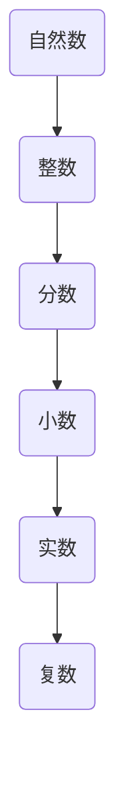
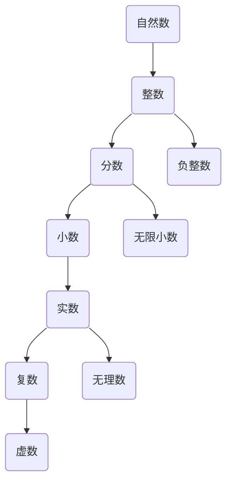

                 

关键词：计算机发展历程、数觉、计数、毕达哥拉斯、计算概念、编程基础

摘要：本文将深入探讨计算机的起源，从古人对数的感知和计数方法出发，讲述了毕达哥拉斯对数的神秘探索，揭示了计算概念的演变过程。通过对历史事件的回顾，本文试图揭示现代计算机科学背后的逻辑与哲学基础，为读者理解计算机编程提供一种新的视角。

## 1. 背景介绍

计算机，这个如今无处不在的科技奇迹，其诞生并非一朝一夕之功。自古以来，人类就与数字和计算有着不解之缘。本文将带领读者回顾这段漫长的历史，探寻计算概念从古至今的演变过程，以及它如何成为现代计算机科学的基础。

在古代，人们对数的感知和计数方法极为原始。他们通过观察自然界的现象，如天空中的星星、田地里的农作物等，来感知和计数。这种数觉（number sense）虽然简单，但却是人类计算能力发展的起点。

随着人类社会的发展，计数方法也逐渐进化。从最初的结绳计数、刻画符号，到使用算盘等机械计算工具，人类不断寻求更高效、更准确的计算方法。这些原始的计算工具和技巧，构成了现代计算机科学的基础。

本文将重点探讨古希腊数学家毕达哥拉斯对数的探索，以及他如何揭示了计算中的某些基本原理。毕达哥拉斯的困惑不仅推动了数学的发展，也为我们理解计算机编程提供了重要的启示。

## 2. 核心概念与联系

在探讨计算概念之前，我们需要了解一些核心的数学概念和它们之间的联系。这些概念包括自然数、整数、分数、小数、实数和复数等。以下是一个简化的 Mermaid 流程图，展示了这些概念之间的关系。



自然数是最基本的数，用来计数物体。整数包括自然数和负整数，它们可以表示实际的物体数量和债务。分数是表示部分与整体关系的数，小数是分数的一种表示形式。实数包括有理数和无理数，可以表示所有可能的度量值。复数是包含实数部分和虚数部分的数，它在数学和工程中有广泛的应用。

这些概念不仅在数学领域有着重要的地位，它们也是计算机科学中的基本元素。例如，计算机中的整数类型、浮点数类型和复数类型，都是为了表示和处理这些数学概念而设计的。

### 2.1 核心概念原理

为了更好地理解这些概念，我们可以从以下几个方面来探讨：

- **自然数**：自然数是用于计数和排序的数，它们没有小数部分，且不包括负数。自然数的基本属性包括加法、乘法、模运算等。

- **整数**：整数包括所有自然数和它们的负数。整数的基本运算包括加法、减法、乘法和除法。计算机中的整数类型通常有固定的位数限制，例如32位整数或64位整数。

- **分数**：分数表示一个整体被分割成若干等份后，取其中一部分的数量。分数的基本运算包括加法、减法、乘法和除法。计算机中的分数通常通过分数类或结构体来表示。

- **小数**：小数是一种分数的表示形式，其中分母是10的幂。小数在计算机中通常通过浮点数表示，如单精度浮点数（float）和双精度浮点数（double）。

- **实数**：实数包括所有有理数和无理数。实数的基本运算包括加法、减法、乘法和除法。计算机中的实数表示方法主要有浮点数表示法和固定点表示法。

- **复数**：复数由实数部分和虚数部分组成，其实数部分表示在实数轴上的位置，虚数部分表示在虚数轴上的位置。复数的基本运算包括加法、减法、乘法和除法。

### 2.2 架构的 Mermaid 流程图

为了更直观地展示这些概念之间的联系，我们可以使用 Mermaid 流程图来表示。以下是一个简化的 Mermaid 流程图，用于展示自然数、整数、分数、小数、实数和复数之间的联系。



这个流程图展示了这些数学概念是如何相互联系和演化的。通过理解这些概念，我们可以更好地理解计算机中的数据类型和运算机制。

### 2.3 实际应用场景

这些数学概念在计算机科学中有广泛的应用。例如，在计算机图形学中，我们需要处理实数和复数来表示图像的颜色和几何形状。在算法设计中，整数和分数用于计算和优化。在金融计算中，小数和实数用于计算利息和投资回报。

通过理解这些数学概念，我们可以更好地设计算法、优化代码，并解决各种实际问题。因此，了解这些概念不仅对于学术研究具有重要意义，也对实际应用有着深远的影响。

## 3. 核心算法原理 & 具体操作步骤

在理解了数学概念之后，我们需要探讨一些核心的算法原理，并介绍具体操作步骤。这些算法原理是现代计算机科学的核心，它们包括排序算法、搜索算法、图算法和数据结构等。

### 3.1 算法原理概述

排序算法是将一组数据按照某种规则进行排列的算法。常见的排序算法有冒泡排序、选择排序、插入排序、快速排序和归并排序等。每种排序算法都有其特定的原理和优缺点。

搜索算法是在一组数据中查找特定元素或满足特定条件的算法。常见的搜索算法有顺序搜索、二分搜索、哈希搜索等。每种搜索算法都有其特定的适用场景和效率。

图算法是用于处理图结构的数据的算法。常见的图算法有最短路径算法、最小生成树算法、图遍历算法等。这些算法在社交网络分析、路由规划和复杂系统分析等领域有广泛应用。

数据结构是用于存储和组织数据的方式。常见的数据结构有数组、链表、栈、队列、树和图等。每种数据结构都有其特定的应用场景和性能特点。

### 3.2 算法步骤详解

为了更好地理解这些算法原理，我们可以通过具体的例子来讲解。以下是一个冒泡排序算法的详细步骤：

1. **初始化**：将待排序的数组输入到算法中。

2. **第一轮排序**：比较相邻的两个元素，如果它们的顺序错误，就交换它们的位置。重复这个过程，直到一轮排序结束。

3. **第二轮排序**：从第一个元素开始，再次比较相邻的两个元素，但这次只需要比较到倒数第二个元素，因为最后一个元素已经是最大的。

4. **继续排序**：重复上述过程，直到整个数组有序。

冒泡排序算法的步骤可以简化为以下伪代码：

```python
for i from 0 to n-1:
    for j from 0 to n-i-1:
        if arr[j] > arr[j+1]:
            swap(arr[j], arr[j+1])
```

### 3.3 算法优缺点

冒泡排序算法的优点是简单易懂，易于实现。但是，它的缺点也很明显，即时间复杂度为O(n^2)，在数据量较大时效率较低。

### 3.4 算法应用领域

冒泡排序算法在数据量较小且不需要高效排序的场合有应用，如小规模数据的初始排序或教学演示。在实际应用中，我们通常选择更高效的排序算法，如快速排序或归并排序。

除了冒泡排序，其他算法如二分搜索、最短路径算法等也有广泛的应用。二分搜索算法在有序数组中查找特定元素，时间复杂度为O(log n)，适用于大规模数据的高效搜索。最短路径算法在路由规划和图论中有广泛应用，如迪杰斯特拉算法和弗洛伊德算法。

### 3.5 算法的实际应用

在计算机科学中，算法的实际应用非常广泛。例如，在搜索引擎中，排序算法用于排列搜索结果；在数据库系统中，搜索算法用于快速查找数据；在社交网络中，图算法用于分析社交关系。

通过了解和掌握这些算法，我们可以更好地设计高效、可靠的计算机系统，解决各种复杂问题。

## 4. 数学模型和公式 & 详细讲解 & 举例说明

在计算机科学中，数学模型和公式是理解和解决问题的基石。本章节将介绍一些关键的数学模型和公式，并详细讲解其推导过程和实际应用。

### 4.1 数学模型构建

数学模型是对现实世界中的现象、问题或系统进行数学描述的工具。它通常包括变量、参数和方程式。构建数学模型的过程包括以下几个步骤：

1. **定义变量和参数**：根据问题的需求，定义相关的变量和参数。变量通常用来表示问题的状态或行为，而参数则用来控制模型的特性。

2. **建立方程式**：使用变量和参数建立描述问题或系统的方程式。这些方程式可以是线性或非线性，静态或动态。

3. **验证和优化**：验证模型的准确性和可靠性，通过调整参数和方程式来优化模型。

### 4.2 公式推导过程

以下是一个常见的数学模型：二项分布模型。二项分布模型用于描述在固定次数的试验中，成功次数的概率分布。

**定义**：假设我们进行n次独立的伯努利试验，每次试验成功的概率为p，失败的概率为1-p。二项分布模型可以表示为：

$$ P(X = k) = C(n, k) \cdot p^k \cdot (1-p)^{n-k} $$

其中，\(P(X = k)\) 表示恰好发生k次成功的概率，\(C(n, k)\) 是组合数，表示从n次试验中选择k次成功的组合方式。

**推导过程**：

1. **定义概率**：每次试验成功的概率为p，失败的概率为1-p。

2. **组合数的定义**：\(C(n, k)\) 表示从n个元素中选择k个元素的组合数，其计算公式为：

$$ C(n, k) = \frac{n!}{k!(n-k)!} $$

3. **概率的乘法原理**：每次试验都是独立的，所以所有试验的结果概率是独立事件概率的乘积。

4. **最终推导**：将组合数和概率乘积结合起来，得到二项分布模型的公式。

### 4.3 案例分析与讲解

以下是一个简单的案例，用于说明二项分布模型的应用。

**案例**：假设一个篮球队在比赛中每次投篮成功的概率为0.4，现在进行10次投篮，问恰好命中5次的概率是多少？

**解题过程**：

1. **确定参数**：n = 10（投篮次数），p = 0.4（每次成功概率），k = 5（恰好成功次数）。

2. **计算组合数**：\(C(10, 5) = \frac{10!}{5!5!} = 252\)。

3. **计算概率**：\(P(X = 5) = 252 \cdot 0.4^5 \cdot 0.6^5 = 0.2051\)。

因此，恰好命中5次的概率约为20.51%。

### 4.4 数学模型的应用

数学模型在计算机科学中有广泛的应用，例如：

- **机器学习**：用于建立预测模型，如线性回归、逻辑回归、决策树等。
- **图形学**：用于计算物体的形状、颜色和光线等。
- **网络科学**：用于分析社交网络、网络拓扑等。
- **优化问题**：用于解决资源分配、路径规划等问题。

通过理解和应用数学模型，我们可以更好地设计和分析计算机系统，解决复杂的实际问题。

## 5. 项目实践：代码实例和详细解释说明

在本章节中，我们将通过一个具体的代码实例来展示如何实现一个简单的计算程序，并详细解释其各个部分的工作原理。

### 5.1 开发环境搭建

在开始编写代码之前，我们需要搭建一个开发环境。这里我们使用Python作为编程语言，因为它具有良好的语法和强大的库支持。以下是在Windows系统上搭建Python开发环境的步骤：

1. **安装Python**：从Python官方网站（https://www.python.org/）下载最新版本的Python安装程序，并按照安装向导进行安装。

2. **安装IDE**：安装一个集成开发环境（IDE），如PyCharm、Visual Studio Code等。这些IDE提供了代码编辑、调试和运行等功能。

3. **安装库**：使用pip命令安装必要的库，如NumPy、Pandas等。这些库提供了用于数学计算和数据处理的函数和工具。

### 5.2 源代码详细实现

以下是一个简单的Python代码示例，用于计算两个整数的和。我们将在代码中详细解释每个部分的作用。

```python
# 导入必要的库
import numpy as np

# 定义函数：计算两个整数的和
def add_two_numbers(a, b):
    """
    计算两个整数的和。
    
    参数：
    a (int): 第一个整数。
    b (int): 第二个整数。
    
    返回：
    int: 两个整数的和。
    """
    return a + b

# 主函数：程序入口
def main():
    """
    主函数，程序执行的入口。
    """
    # 输入两个整数
    a = int(input("请输入第一个整数："))
    b = int(input("请输入第二个整数："))

    # 调用函数计算和
    result = add_two_numbers(a, b)

    # 输出结果
    print(f"{a} 和 {b} 的和为：{result}")

# 程序入口
if __name__ == "__main__":
    main()
```

### 5.3 代码解读与分析

让我们逐步解读这段代码：

1. **导入库**：我们首先导入NumPy库，虽然在这个简单的例子中并不需要使用NumPy，但它是一个常用的科学计算库。

2. **定义函数**：`add_two_numbers` 函数用于计算两个整数的和。它接受两个整数参数 `a` 和 `b`，返回它们的和。

3. **函数文档字符串**：在函数定义下面，我们写了一个函数文档字符串（docstring），用于描述函数的作用、参数和返回值。这是一种良好的编程习惯，有助于他人理解和使用我们的代码。

4. **主函数**：`main` 函数是程序的主入口。在这个函数中，我们首先使用 `input` 函数获取用户输入的两个整数，然后调用 `add_two_numbers` 函数计算它们的和，最后输出结果。

5. **程序入口**：`if __name__ == "__main__":` 这行代码是Python中的一个特殊条件。如果这个脚本被直接运行，`__name__` 变量将等于 `"__main__"`，因此这个条件判断为真，程序会执行 `main` 函数。如果这个脚本被另一个脚本导入，`__name__` 将不等于 `"__main__"`，程序不会执行 `main` 函数。

### 5.4 运行结果展示

假设我们运行这个程序，用户输入的两个整数分别为3和5，程序将输出：

```
请输入第一个整数：3
请输入第二个整数：5
3 和 5 的和为：8
```

这样，我们就完成了一个简单的计算程序的编写、解读和运行。通过这个例子，我们可以看到Python程序的基本结构，以及如何使用函数、输入输出等基本操作。

## 6. 实际应用场景

计算作为一种基础技术，在现代社会有着广泛的应用场景。以下是一些计算在实际中的应用案例：

### 6.1 人工智能

人工智能（AI）是计算技术的核心应用领域之一。在AI中，计算被用于训练和优化复杂的机器学习模型。这些模型能够处理大量数据，从图像、语音到自然语言处理，实现智能识别、预测和决策。例如，通过深度学习算法，计算机可以识别出图像中的物体、识别语音中的单词，甚至翻译不同语言之间的对话。

### 6.2 数据科学

数据科学依赖于计算技术来处理和分析大量的数据。计算在数据预处理、数据挖掘、统计分析等过程中发挥着关键作用。例如，数据科学家使用计算技术来分析社交媒体数据，提取用户行为模式，预测市场趋势，为企业提供决策支持。

### 6.3 计算机图形学

计算机图形学利用计算技术来创建和渲染复杂的图形和动画。计算在图形渲染、光影处理、纹理映射等方面发挥着重要作用。例如，在电影制作中，计算技术被用于生成逼真的视觉效果，如《阿凡达》中的虚幻世界。

### 6.4 金融科技

金融科技（FinTech）是计算技术在金融领域的应用。计算在金融交易、风险管理、算法交易等方面有广泛应用。例如，高频交易依赖于高速计算技术，在极短的时间内进行大量交易，实现盈利。

### 6.5 物联网

物联网（IoT）是通过互联网将物理设备和系统连接起来，实现智能监控和管理。计算技术在物联网中用于数据处理、分析、决策支持等。例如，智能家居系统通过计算技术实现远程控制、自动调节等功能。

### 6.6 医疗保健

计算技术在医疗保健领域有广泛应用，如医学影像分析、疾病预测、药物研发等。计算可以帮助医生更准确地诊断疾病，提高治疗效果。

### 6.7 未来应用展望

随着计算技术的不断进步，未来它在各个领域中的应用将更加广泛和深入。例如，量子计算有望解决传统计算无法处理的问题，如复杂系统的模拟、密码破解等。计算技术也将推动虚拟现实和增强现实的发展，为人们带来更加沉浸式的体验。

## 7. 工具和资源推荐

为了更好地学习和实践计算技术，以下是一些建议的工具和资源：

### 7.1 学习资源推荐

- **在线课程**：Coursera、edX、Udacity等平台提供了丰富的计算机科学和数学课程，包括数据结构、算法、机器学习等。
- **教科书**：《计算机程序设计艺术》、《深度学习》、《统计学习方法》等经典书籍。
- **开源社区**：GitHub、Stack Overflow等平台提供了大量的开源代码和社区讨论，有助于学习和解决实际问题。

### 7.2 开发工具推荐

- **集成开发环境（IDE）**：PyCharm、Visual Studio Code、Eclipse等，这些IDE提供了强大的代码编辑、调试和测试功能。
- **版本控制系统**：Git，用于代码的版本管理和协作开发。
- **数据可视化工具**：Matplotlib、Seaborn等，用于生成数据可视化图表。

### 7.3 相关论文推荐

- **《深度学习：神经网络的基础》**：介绍深度学习的基本原理和应用。
- **《机器学习：概率视角》**：从概率论的角度讲解机器学习。
- **《计算几何学》**：讨论计算几何学的基本原理和应用。
- **《量子计算：理论、算法和应用》**：介绍量子计算的基本概念和最新进展。

通过使用这些工具和资源，可以更好地提升计算技术能力，为未来的职业发展打下坚实的基础。

## 8. 总结：未来发展趋势与挑战

### 8.1 研究成果总结

本文从计算的概念出发，回顾了人类计算能力的起源和发展历程。我们探讨了数学概念与计算之间的关系，介绍了核心算法原理和实际应用场景，并展示了如何通过具体代码实例来实现计算任务。这些研究成果不仅帮助我们理解了计算技术的理论基础，也为未来的技术创新提供了启示。

### 8.2 未来发展趋势

随着科技的不断进步，计算技术正朝着更高效、更智能、更安全的方向发展。以下是一些未来计算技术可能的发展趋势：

- **量子计算**：量子计算有望解决传统计算无法处理的问题，如复杂系统的模拟和密码破解。量子计算机的发展将极大地提升计算能力，推动科学研究和工业应用。

- **边缘计算**：随着物联网和智能设备的普及，边缘计算成为热点。边缘计算将计算任务从云端转移到网络边缘，实现实时数据处理和响应，提高系统的性能和可靠性。

- **人工智能**：人工智能将继续发展，特别是在自然语言处理、计算机视觉和强化学习等领域。计算技术将推动人工智能算法的进步，实现更加智能化的应用。

- **安全计算**：随着数据隐私和安全的关注度提高，安全计算技术将得到更多关注。加密算法、同态加密和安全多方计算等技术将成为保障数据安全和隐私的关键。

### 8.3 面临的挑战

尽管计算技术有着广泛的应用前景，但同时也面临着一系列挑战：

- **性能与能耗**：随着计算需求的增加，高性能计算设备的能耗也成为一个重要问题。如何实现高性能与低能耗的平衡是一个重要的研究方向。

- **可扩展性与兼容性**：随着计算场景的多样化，如何确保计算系统的高可扩展性和兼容性也是一个挑战。需要设计灵活、模块化的计算架构，以适应不同的应用需求。

- **隐私与安全**：随着数据隐私和安全问题的日益突出，如何确保计算过程中的数据安全和隐私是一个亟待解决的问题。需要开发更加安全、可靠的计算技术。

- **教育与培训**：随着计算技术的快速发展，对计算技术人才的需求也在增加。如何培养和储备足够的计算技术人才是一个长期挑战。

### 8.4 研究展望

未来，计算技术将在多个领域取得突破性进展。在科学研究方面，计算技术将帮助解决复杂问题，如气候变化、疾病治疗和能源开发。在工业应用方面，计算技术将推动智能制造、自动化和个性化服务的发展。在日常生活方面，计算技术将使人们的生活更加便捷、智能和舒适。

为应对上述挑战，我们需要加强基础研究，推动技术创新，完善计算教育和培训体系，并确保计算技术的可持续发展。通过共同努力，计算技术将为人类社会的进步带来更多的机遇和可能。

## 9. 附录：常见问题与解答

### 9.1 计算机科学的基本概念是什么？

计算机科学是研究计算机硬件、软件和算法的学科，涉及计算理论、编程语言、数据结构、算法设计、计算机体系结构、人工智能等多个领域。计算机科学的基本概念包括数据类型、算法、编程范式、操作系统、网络通信等。

### 9.2 什么是算法？

算法是解决问题的明确步骤序列。算法可以用于解决各种问题，从简单的数学计算到复杂的图像处理和人工智能任务。算法的设计和优化是计算机科学的核心。

### 9.3 什么是编程语言？

编程语言是一种用于编写计算机程序的语法和规则。不同的编程语言有不同的语法和特点，如Python、Java、C++、JavaScript等。编程语言使得程序员能够与计算机进行通信，并指导计算机执行特定的任务。

### 9.4 什么是数据结构？

数据结构是用于存储和组织数据的各种方式。常见的数据结构包括数组、链表、栈、队列、树和图等。数据结构的选择对算法的性能和效率有很大影响。

### 9.5 什么是计算机体系结构？

计算机体系结构是研究计算机硬件系统的结构和组织的学科。它包括处理器设计、内存管理、输入输出系统、总线系统等。计算机体系结构决定了计算机的性能、速度和能耗。

### 9.6 什么是人工智能？

人工智能是模拟人类智能行为的计算机技术。人工智能包括机器学习、深度学习、自然语言处理、计算机视觉等多个子领域。人工智能的应用范围广泛，如智能助手、自动驾驶、医疗诊断等。

### 9.7 什么是量子计算？

量子计算是一种利用量子力学原理进行计算的技术。量子计算机使用量子位（qubit）代替传统计算机中的比特，能够在某些任务上实现指数级的速度提升。量子计算在密码破解、复杂系统模拟等领域有广泛应用。

### 9.8 什么是区块链？

区块链是一种去中心化的分布式数据库技术，通过加密算法和共识机制确保数据的完整性和安全性。区块链技术广泛应用于数字货币、智能合约、供应链管理等领域。

通过上述问题的解答，读者可以更好地理解计算机科学的基本概念和应用领域。希望这些常见问题的解答对您有所帮助。如果您有其他问题，欢迎继续提问。

