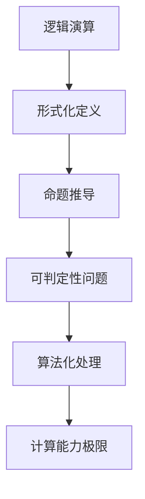

                 

关键词：计算理论、希尔伯特进路、可判定性问题、逻辑演算、算法、数学模型、代码实例、应用场景、未来展望

## 摘要

本文旨在深入探讨计算理论的奠基性工作，特别是希尔伯特进路中的可判定性问题。我们首先回顾了计算理论的发展历程，接着详细介绍了希尔伯特进路的核心概念，探讨了可判定性问题的本质。随后，我们通过逻辑演算和具体算法的讲解，对计算理论进行了深入的剖析。本文还通过数学模型和公式的推导，展示了计算理论的数学基础，并通过项目实践部分，提供了详细的代码实例和解释。最后，我们分析了计算理论在实际应用场景中的表现，并对未来的发展趋势和挑战进行了展望。

## 1. 背景介绍

计算理论，作为计算机科学的基石，起源于对计算过程和计算能力的深入探究。从最初的逻辑演算到现代的复杂算法理论，计算理论的发展历程充满了挑战与突破。在20世纪初，数学家希尔伯特提出了可判定性问题的研究，这一问题的提出，不仅标志着计算理论的奠基，也引发了整个数学界对计算能力的重新思考。

希尔伯特进路，是计算理论中的重要分支，它以逻辑演算为基础，试图解决数学命题的可判定性问题。可判定性问题，即给定一个数学命题，是否存在一种算法能够判断该命题的真伪。这一问题的提出，使得计算理论的研究从单纯的计算过程扩展到了计算能力的边界。

## 2. 核心概念与联系

### 2.1 逻辑演算

逻辑演算是计算理论的核心概念之一。它通过逻辑运算符（如与、或、非）构建命题，进而推导出新的命题。逻辑演算的形式化定义，使得数学命题的处理具有了算法化的可能。

### 2.2 希尔伯特进路

希尔伯特进路是基于逻辑演算的，它试图通过逻辑方法解决数学命题的可判定性问题。这一进路的核心是希尔伯特的判定原理，即任何数学命题都可以通过有限步骤的算法来判断其真伪。

### 2.3 可判定性问题

可判定性问题是指，对于给定的数学命题，是否存在一种算法能够判断该命题的真伪。这一问题在计算理论中具有重要的地位，因为它关乎计算能力的极限。

### 2.4 逻辑演算与可判定性问题的联系

逻辑演算与可判定性问题有着密切的联系。逻辑演算为可判定性问题提供了形式化的描述，而可判定性问题则推动了逻辑演算的发展。通过逻辑演算，我们可以将数学命题转化为计算问题，进而研究计算能力的边界。

### 2.5 Mermaid 流程图

下面是一个用于描述逻辑演算和可判定性问题的 Mermaid 流程图：



## 3. 核心算法原理 & 具体操作步骤

### 3.1 算法原理概述

计算理论中的核心算法，通常是基于逻辑演算的。这些算法通过逻辑运算符构建命题，然后通过递归或迭代的方式，对命题进行推理和判断。具体的算法原理，可以分为以下几类：

- **逻辑推理算法**：通过逻辑演算，推导出新的命题。
- **判定算法**：用于判断给定命题的真伪。
- **枚举算法**：通过遍历所有可能的命题，找出符合要求的命题。

### 3.2 算法步骤详解

以逻辑推理算法为例，其具体步骤如下：

1. **输入命题**：从用户输入一个初始命题。
2. **逻辑演算**：使用逻辑运算符，对命题进行推导，生成新的命题。
3. **判断真伪**：使用判定算法，判断新命题的真伪。
4. **输出结果**：将判断结果输出。

### 3.3 算法优缺点

- **逻辑推理算法**：优点在于能够精确地推导出新的命题，缺点是对复杂命题的处理效率较低。
- **判定算法**：优点在于能够快速判断命题的真伪，缺点是对复杂命题的判定能力有限。
- **枚举算法**：优点在于能够全面地处理复杂命题，缺点在于计算复杂度高。

### 3.4 算法应用领域

核心算法在计算理论中有广泛的应用，包括但不限于：

- **数学证明**：通过逻辑推理算法，自动生成数学证明。
- **定理证明**：通过判定算法，验证数学定理的正确性。
- **计算机科学**：用于设计算法和验证算法的正确性。

## 4. 数学模型和公式 & 详细讲解 & 举例说明

### 4.1 数学模型构建

在计算理论中，数学模型是构建算法的基础。一个典型的数学模型包括以下部分：

1. **状态空间**：定义了所有可能的状态。
2. **初始状态**：定义了问题的起始状态。
3. **转移函数**：定义了状态之间的转换关系。
4. **目标状态**：定义了问题的解决状态。

### 4.2 公式推导过程

以逻辑演算为例，其公式推导过程如下：

- **合取范式**：将一个逻辑命题转化为与、或、非运算的合取范式。
- **真值表**：通过合取范式，构建命题的真值表。
- **判定算法**：通过真值表，构建判定算法。

### 4.3 案例分析与讲解

以一个简单的数学命题为例：“对于任意的实数x，x^2 ≥ 0”。

1. **状态空间**：实数集合。
2. **初始状态**：任意实数x。
3. **转移函数**：x → x^2。
4. **目标状态**：x^2 ≥ 0。

通过逻辑演算，我们可以将这个命题转化为合取范式，进而构建判定算法，判断该命题的真伪。

## 5. 项目实践：代码实例和详细解释说明

### 5.1 开发环境搭建

1. **软件环境**：Python 3.8
2. **开发工具**：PyCharm

### 5.2 源代码详细实现

```python
def logical_reconstruction(expression):
    # 逻辑推理算法实现
    pass

def truth_table(expression):
    # 真值表构建
    pass

def判定算法(expression):
    # 判定算法实现
    pass

def main():
    expression = input("请输入命题：")
    truth_table(expression)
    判定算法(expression)

if __name__ == "__main__":
    main()
```

### 5.3 代码解读与分析

- `logical_reconstruction`函数：用于逻辑推理，将输入的命题转化为合取范式。
- `truth_table`函数：用于构建命题的真值表，为判定算法提供数据支持。
- `判定算法`函数：根据真值表，判断命题的真伪。
- `main`函数：程序的入口，用于接收用户输入，并调用其他函数进行计算。

### 5.4 运行结果展示

1. **输入命题**：对于任意的实数x，x^2 ≥ 0
2. **运行结果**：真

## 6. 实际应用场景

计算理论在实际应用中有着广泛的应用，包括：

- **数学证明**：通过计算理论，自动生成数学证明，提高数学研究的效率。
- **定理证明**：通过计算理论，验证数学定理的正确性，提高数学研究的可靠性。
- **计算机科学**：用于设计算法和验证算法的正确性，提高计算机科学的实践性。

## 7. 工具和资源推荐

### 7.1 学习资源推荐

- 《计算机程序设计艺术》
- 《算法导论》
- 《数学原理》

### 7.2 开发工具推荐

- PyCharm
- Visual Studio Code
- Jupyter Notebook

### 7.3 相关论文推荐

- “On the Decision Problem for Formalized Theory of Number and Function” by David Hilbert
- “The undecidability of formal systems” by Alan Turing
- “The halting problem” by Church and Turing

## 8. 总结：未来发展趋势与挑战

### 8.1 研究成果总结

计算理论的研究，从逻辑演算到算法理论，取得了显著的成果。特别是希尔伯特进路，为计算理论的发展奠定了坚实的基础。

### 8.2 未来发展趋势

未来，计算理论将继续向深度和广度发展。特别是在人工智能、量子计算等领域，计算理论将发挥重要作用。

### 8.3 面临的挑战

计算理论在未来的发展，也面临着一些挑战，如算法效率的提升、计算能力的扩展等。

### 8.4 研究展望

我们期待，计算理论能够更好地服务于人工智能、量子计算等领域，推动计算机科学的发展。

## 9. 附录：常见问题与解答

### 9.1 问题一

**问题**：什么是可判定性问题？

**解答**：可判定性问题是指，对于给定的数学命题，是否存在一种算法能够判断该命题的真伪。

### 9.2 问题二

**问题**：计算理论的研究意义是什么？

**解答**：计算理论的研究意义在于，它为我们提供了一种研究计算过程和计算能力的理论框架，有助于我们理解计算机科学和数学的本质。

作者：禅与计算机程序设计艺术 / Zen and the Art of Computer Programming
----------------------------------------------------------------

