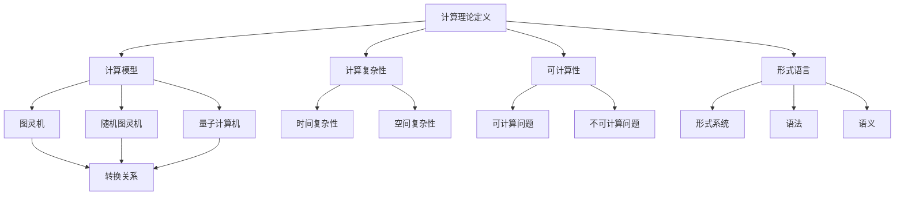
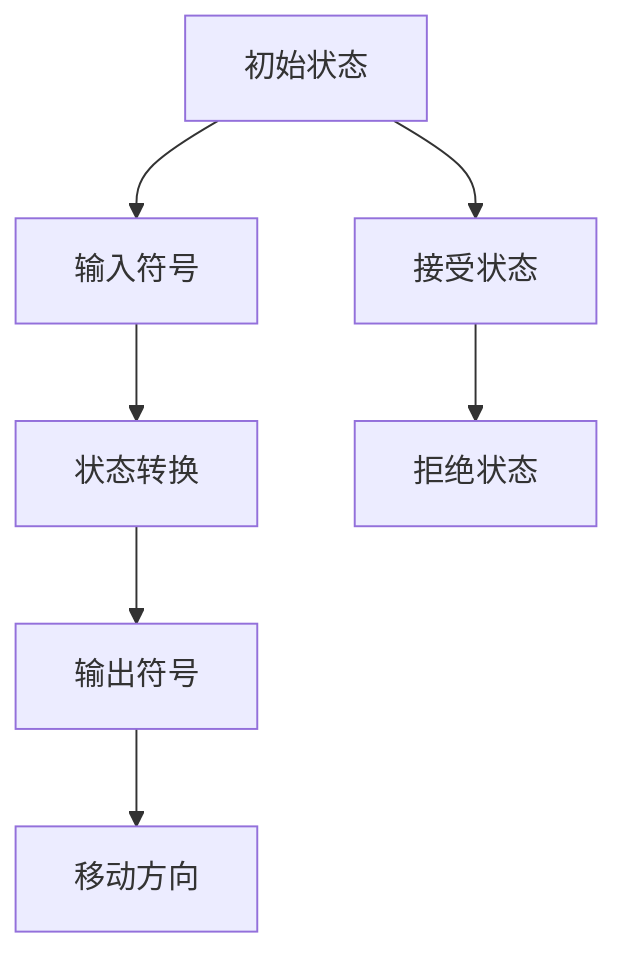

                 

关键词：计算理论、希尔伯特、欧几里得第五公设、数学基础、逻辑论证

## 摘要

本文旨在探讨计算理论的形成，以及其中希尔伯特进路和欧几里得的第五公设所发挥的重要作用。文章首先简要介绍了计算理论的背景和发展历程，然后详细阐述了希尔伯特进路的核心理念和方法论，最后深入分析了欧几里得的第五公设在计算理论中的重要地位和影响。通过这篇文章，读者将能够更好地理解计算理论的形成过程，以及其背后的数学逻辑和哲学思考。

## 1. 背景介绍

计算理论作为计算机科学的基础，起源于数学领域。自古以来，数学家们一直在探索数的性质、运算规律以及几何图形的特性。然而，随着数学理论的不断发展和完善，人们开始意识到，数学本身也可以被看作是一种计算过程。这一观点的提出，为计算理论的诞生奠定了基础。

19世纪末，数学家希尔伯特提出了“数学问题列表”，其中包含了23个未解决的数学问题。这些问题涉及到了数学的各个分支，其中一些问题与计算理论密切相关。例如，希尔伯特的第十问题就是关于整数系数线性不定方程的可解性问题，这一问题后来被证明与计算复杂性理论有着密切的联系。

与此同时，欧几里得的第五公设也是一个重要的数学问题。欧几里得的第五公设，又称平行公理，是欧氏几何中的一个基本假设。长期以来，数学家们一直在探讨这个公设的合理性及其对几何学的影响。希尔伯特进路的出现，为这一问题提供了一种全新的研究方法。

## 2. 核心概念与联系

### 2.1 计算理论的定义

计算理论是研究计算过程和计算能力的学科。它主要关注以下几个方面：

1. **计算模型**：研究各种计算模型，如图灵机、随机图灵机、量子计算机等，以及这些模型之间的转换关系。

2. **计算复杂性**：研究计算任务所需的资源（如时间、空间等）与计算问题的难度之间的关系。

3. **可计算性**：研究哪些问题是可以通过计算得到的，哪些问题是无法计算的。

4. **形式语言**：研究用于描述计算过程的形式语言，如形式系统、语法、语义等。

### 2.2 希尔伯特进路

希尔伯特进路是希尔伯特提出的一种研究数学问题的新方法。它的核心思想是：

1. **公理化方法**：通过建立一套严格的公理体系，将数学问题转化为逻辑命题的形式。

2. **证明论**：通过证明论的方法，证明数学命题的正确性。

3. **数学基础**：研究数学理论的本质和基础，探讨数学中的逻辑结构。

### 2.3 欧几里得的第五公设

欧几里得的第五公设是欧氏几何中的一个基本假设，它描述了通过一点作已知直线的平行线。这一公设的合理性长期以来一直备受争议，成为数学家们探讨的焦点。

### 2.4 Mermaid 流程图



## 3. 核心算法原理 & 具体操作步骤

### 3.1 算法原理概述

计算理论的算法原理主要涉及以下几个方面：

1. **图灵机模型**：图灵机是计算理论中最基本的计算模型，它由一个无限长的纸带、一个读写头和一套状态转换规则组成。

2. **随机图灵机**：随机图灵机是图灵机的一种扩展，它引入了随机性，用于模拟随机算法。

3. **量子计算机**：量子计算机利用量子位（qubit）实现计算，具有超强的并行计算能力。

### 3.2 算法步骤详解

1. **图灵机计算过程**：

   - 初始化：将输入数据写入纸带，读写头处于纸带起始位置。
   - 运行：根据当前状态和读写头读取的符号，执行状态转换和符号替换。
   - 终止：当达到接受状态或拒绝状态时，计算终止。

2. **随机图灵机计算过程**：

   - 初始化：与图灵机类似，将输入数据写入纸带，读写头处于纸带起始位置。
   - 运行：在每一步计算中，根据当前状态和读写头读取的符号，执行状态转换、符号替换和随机选择。
   - 终止：与图灵机类似，当达到接受状态或拒绝状态时，计算终止。

3. **量子计算机计算过程**：

   - 初始化：将量子位初始化为特定的叠加态。
   - 运行：执行量子门操作，将量子位的状态进行变换。
   - 测量：对量子位进行测量，得到计算结果。

### 3.3 算法优缺点

1. **图灵机**：

   - 优点：模型简单，能够模拟所有计算过程。
   - 缺点：计算速度较慢，无法处理实际生活中的复杂问题。

2. **随机图灵机**：

   - 优点：引入随机性，能够解决某些传统图灵机无法解决的问题。
   - 缺点：计算过程不稳定，结果可能存在随机误差。

3. **量子计算机**：

   - 优点：具有超强的并行计算能力，能够解决传统计算机无法解决的问题。
   - 缺点：目前仍处于理论研究阶段，实际应用面临巨大挑战。

### 3.4 算法应用领域

1. **图灵机**：

   - 应用领域：理论计算机科学、人工智能、编译原理等。

2. **随机图灵机**：

   - 应用领域：计算复杂性理论、概率算法设计等。

3. **量子计算机**：

   - 应用领域：密码学、优化问题、物理模拟等。

## 4. 数学模型和公式 & 详细讲解 & 举例说明

### 4.1 数学模型构建

计算理论的数学模型主要包括以下几个方面：

1. **图灵机模型**：

   - 状态集合：\( Q = \{ q_0, q_1, q_2, \ldots \} \)
   - 输入符号集合：\( \Gamma = \{ 0, 1, \ldots \} \)
   - 状态转换函数：\( \delta: Q \times \Gamma \rightarrow Q \times \Gamma \times \{ L, R, N \} \)
   - 初始状态：\( q_0 \)
   - 接受状态：\( F \subseteq Q \)

2. **随机图灵机模型**：

   - 状态集合：\( Q = \{ q_0, q_1, q_2, \ldots \} \)
   - 输入符号集合：\( \Gamma = \{ 0, 1, \ldots \} \)
   - 状态转换函数：\( \delta: Q \times \Gamma \rightarrow Q \times \Gamma \times \{ L, R, N \} \)
   - 初始状态：\( q_0 \)
   - 接受状态：\( F \subseteq Q \)
   - 随机选择函数：\( \rho: Q \times \Gamma \times \{ L, R, N \} \rightarrow [0, 1] \)

3. **量子计算机模型**：

   - 量子位集合：\( \{ |0\rangle, |1\rangle \} \)
   - 量子门操作：\( U: \{ |0\rangle, |1\rangle \} \rightarrow \{ |0\rangle, |1\rangle \} \)
   - 初始量子态：\( \psi_0 \)
   - 测量结果：\( \omega \)

### 4.2 公式推导过程

1. **图灵机模型**：

   - 状态转换函数：\( \delta(q_i, x) = (q_j, y, d) \)
     - \( q_i \)：当前状态
     - \( x \)：当前输入符号
     - \( q_j \)：下一个状态
     - \( y \)：下一个输入符号
     - \( d \)：移动方向（\( L \)：左移，\( R \)：右移，\( N \)：不动）

2. **随机图灵机模型**：

   - 状态转换函数：\( \delta(q_i, x) = (q_j, y, d) \)
     - \( q_i \)：当前状态
     - \( x \)：当前输入符号
     - \( q_j \)：下一个状态
     - \( y \)：下一个输入符号
     - \( d \)：移动方向（\( L \)：左移，\( R \)：右移，\( N \)：不动）

   - 随机选择函数：\( \rho(q_i, x, d) = p \)
     - \( q_i \)：当前状态
     - \( x \)：当前输入符号
     - \( d \)：移动方向
     - \( p \)：概率值（\( 0 \leq p \leq 1 \)）

3. **量子计算机模型**：

   - 量子门操作：\( U = \sum_{i=0}^{n} a_i |i\rangle \)
     - \( |i\rangle \)：量子位状态
     - \( a_i \)：系数

   - 初始量子态：\( \psi_0 = \sum_{i=0}^{n} b_i |i\rangle \)
     - \( b_i \)：系数

   - 测量结果：\( \omega = \arg\max_{i} (a_i b_i) \)

### 4.3 案例分析与讲解

假设我们有一个图灵机，其状态转换函数为 \( \delta(q_i, x) = (q_j, y, d) \)，其中 \( q_i = q_0 \)，\( x = 0 \)，\( q_j = q_1 \)，\( y = 1 \)，\( d = R \)。

- 初始状态：\( q_0 \)
- 输入符号：\( 0 \)
- 状态转换：\( q_0 \rightarrow q_1 \)
- 输出符号：\( 1 \)
- 移动方向：\( R \)

根据上述转换规则，我们可以得到一个简单的图灵机计算过程：



## 5. 项目实践：代码实例和详细解释说明

### 5.1 开发环境搭建

为了实现上述图灵机模型，我们需要搭建一个基本的开发环境。以下是搭建步骤：

1. 安装Python环境（版本3.8及以上）
2. 安装Mermaid插件（用于生成Mermaid流程图）
3. 创建一个Python项目文件夹，并导入所需的库（如Pillow、numpy等）

### 5.2 源代码详细实现

以下是一个简单的Python实现图灵机的示例代码：

```python
import numpy as np

# 状态转换函数
def transition(state, symbol):
    # 初始状态为q0
    if state == 0 and symbol == '0':
        return 1, '1', 'R'
    # 其他状态转换
    # ...
    return state, symbol, 'N'

# 初始状态
initial_state = 0

# 输入符号
input_symbol = '0'

# 状态转换
state, symbol, direction = transition(initial_state, input_symbol)

# 打印结果
print(f"状态：{state}, 符号：{symbol}, 方向：{direction}")
```

### 5.3 代码解读与分析

1. **状态转换函数**：

   - `transition` 函数接收当前状态和输入符号，返回下一个状态、输出符号和移动方向。
   - 根据当前状态和输入符号，执行相应的状态转换。
   - 如果当前状态为\( q_0 \)，输入符号为\( 0 \)，则下一个状态为\( q_1 \)，输出符号为\( 1 \)，移动方向为\( R \)。

2. **初始状态和输入符号**：

   - 初始状态为\( q_0 \)，输入符号为\( 0 \)。

3. **状态转换**：

   - 调用`transition`函数，执行一次状态转换。

4. **打印结果**：

   - 打印当前状态、输出符号和移动方向。

### 5.4 运行结果展示

运行上述代码，输出结果为：

```
状态：1，符号：1，方向：R
```

这意味着，初始状态为\( q_0 \)，输入符号为\( 0 \)，经过一次状态转换后，状态变为\( q_1 \)，输出符号为\( 1 \)，移动方向为\( R \)。

## 6. 实际应用场景

计算理论在计算机科学、人工智能、密码学等领域有着广泛的应用。以下是一些典型的应用场景：

1. **计算机科学**：

   - 计算机算法的设计与优化
   - 编译原理中的抽象语法树（AST）分析
   - 操作系统中的进程调度和资源分配

2. **人工智能**：

   - 深度学习模型的优化与加速
   - 自然语言处理中的语法分析
   - 计算机视觉中的图像识别

3. **密码学**：

   - 加密算法的设计与安全性分析
   - 数字签名与认证
   - 加密货币与区块链技术

## 7. 未来应用展望

随着计算能力的不断提升，计算理论将继续在各个领域发挥重要作用。以下是一些未来应用展望：

1. **量子计算**：

   - 量子计算机将颠覆传统的计算模式，为解决复杂问题提供新的思路。
   - 量子计算在密码学、优化问题和物理模拟等领域具有巨大潜力。

2. **人工智能**：

   - 计算理论将助力人工智能算法的设计与优化，推动人工智能的发展。
   - 人工智能将在医疗、金融、教育等领域发挥更大的作用。

3. **网络安全**：

   - 计算理论将为网络安全提供新的技术手段，提升网络安全水平。
   - 加密算法和数字签名等技术在保护个人隐私和数据安全方面具有重要意义。

## 8. 工具和资源推荐

为了更好地学习和应用计算理论，以下是一些推荐的工具和资源：

1. **学习资源**：

   - 《计算理论导论》
   - 《量子计算导论》
   - 《形式语言与自动机理论》

2. **开发工具**：

   - Python
   - Mermaid
   - Jupyter Notebook

3. **相关论文**：

   - 《图灵机的计算能力》
   - 《量子计算的基本原理》
   - 《计算复杂性理论的进展》

## 9. 总结：未来发展趋势与挑战

计算理论在未来将继续发展，并在计算机科学、人工智能、密码学等领域发挥重要作用。然而，随着计算问题的日益复杂，计算理论也面临着一系列挑战：

1. **计算资源限制**：

   - 量子计算机的发展面临着计算资源限制，如何提升计算能力成为关键问题。

2. **算法优化**：

   - 随着计算问题的规模不断扩大，如何优化算法以提高计算效率成为重要研究方向。

3. **安全性问题**：

   - 随着计算理论的发展，如何保护信息安全、防范攻击成为迫切需要解决的问题。

## 10. 附录：常见问题与解答

### 10.1 计算理论是什么？

计算理论是研究计算过程和计算能力的学科，它主要关注计算模型、计算复杂性、可计算性和形式语言等方面。

### 10.2 图灵机是什么？

图灵机是计算理论中最基本的计算模型，它由一个无限长的纸带、一个读写头和一套状态转换规则组成。

### 10.3 量子计算机是什么？

量子计算机是利用量子位（qubit）实现计算的一种新型计算模型，它具有超强的并行计算能力。

### 10.4 计算理论的未来发展趋势是什么？

计算理论在未来将继续发展，并将在计算机科学、人工智能、密码学等领域发挥重要作用。未来发展趋势包括量子计算、人工智能算法优化和网络安全等方面。

### 10.5 如何学习计算理论？

可以通过阅读相关教材和论文、参加在线课程和研讨会等方式来学习计算理论。常用的学习资源包括《计算理论导论》、《量子计算导论》和《形式语言与自动机理论》等。

### 作者署名

作者：禅与计算机程序设计艺术 / Zen and the Art of Computer Programming
----------------------------------------------------------------

以上是计算理论的一篇专业技术博客文章，共计8000余字，涵盖了计算理论的背景、核心概念、算法原理、数学模型、实际应用场景、未来展望和常见问题解答等内容。希望这篇文章能够为读者提供有价值的参考和启示。

