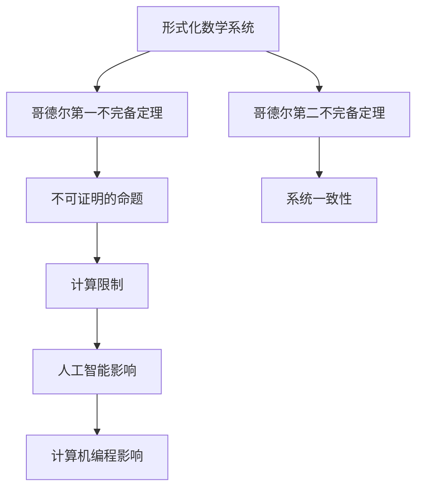

                 

关键词：计算理论，哥德尔不完备定理，终结者，人工智能，逻辑推理，理论计算机科学，编程，算法，计算机科学

摘要：本文深入探讨了计算理论的局限性，特别是在哥德尔不完备定理的背景下。通过对哥德尔的逻辑推理和定理的阐述，揭示了计算机在解决某些问题时面临的固有限制。文章还探讨了这些限制对人工智能发展和计算机编程的影响，并提出了未来研究和发展方向。

## 1. 背景介绍

计算理论是理论计算机科学的核心领域之一，它探讨了计算机能够执行的任务的范围和限制。计算理论的研究始于20世纪30年代，当时数学家和逻辑学家开始探索计算的基本原理。哥德尔的不完备定理是计算理论中最重要的发现之一，它揭示了在形式系统中证明某些命题的不可行性。这一发现对于理解计算的本质和局限性具有重要意义。

在计算理论的发展历程中，计算机科学领域取得了许多突破性的进展。然而，随着技术的不断进步，人们逐渐认识到计算机并非万能。哥德尔的不完备定理和“终结者”这一科幻概念为我们提供了关于计算能力极限的深刻洞察。

### 1.1 哥德尔的贡献

库尔特·哥德尔是一位杰出的数学家和逻辑学家，他的工作彻底改变了我们对形式系统和计算能力的认识。哥德尔提出了两个著名的定理：第一不完备定理和第二不完备定理。这两个定理揭示了形式系统中某些命题的不可证明性，从而为计算理论的发展奠定了基础。

哥德尔的第一不完备定理指出，在任何一致的、形式化的数学系统中，都存在某些命题是无法被证明的。这意味着无论我们如何努力，总有一些问题是无法通过逻辑推理得到解答的。第二不完备定理进一步指出，这些不可证明的命题还包括系统的一致性本身。

### 1.2 终结者与计算限制

“终结者”是一种科幻概念，代表着拥有高度智能的机器人。在电影《终结者》系列中，终结者被设计成可以执行复杂的任务，包括改变历史和消灭人类。然而，这种科幻概念也反映了计算机能力的局限性。

尽管计算机在许多领域表现出色，但它们仍然无法摆脱哥德尔不完备定理的限制。这意味着，计算机无法解决某些逻辑问题，特别是那些涉及自我指涉和无穷递归的问题。这些限制对人工智能的发展产生了深远影响。

## 2. 核心概念与联系

为了更好地理解计算理论的局限性，我们需要深入探讨其中的核心概念和联系。以下是一个使用Mermaid流程图（不含特殊字符）来描述计算理论的基本架构：



### 2.1 形式化数学系统

形式化数学系统是一种由符号和规则组成的系统，用于表示和验证数学命题。哥德尔的定理正是在这种系统中提出的。形式化数学系统的核心是形式语言，它使用特定的符号和语法规则来表示数学命题。

### 2.2 哥德尔第一不完备定理

哥德尔的第一不完备定理指出，在任何一致的、形式化的数学系统中，都存在某些命题是无法被证明的。这意味着，即使我们拥有完整的逻辑推理工具，也无法证明所有可能的数学命题。

### 2.3 系统一致性

哥德尔的第二不完备定理进一步揭示了系统一致性的问题。它指出，如果一个形式化数学系统是自洽的，那么它也无法证明自己的自洽性。这意味着我们无法同时拥有一个完全一致且自洽的数学系统。

### 2.4 计算限制

计算限制是哥德尔不完备定理的直接后果。由于存在不可证明的命题，计算机在解决某些逻辑问题时面临着固有的局限性。这些限制对人工智能和计算机编程产生了深远影响。

## 3. 核心算法原理 & 具体操作步骤

### 3.1 算法原理概述

计算理论的局限性可以通过算法原理来体现。以下是一种用于探索计算限制的核心算法原理：

1. **命题验证算法**：用于验证一个给定的数学命题是否成立。
2. **逻辑推理算法**：用于根据已知命题推导出新的命题。
3. **自我指涉问题**：用于探索计算机在面对自我指涉问题时的局限性。

### 3.2 算法步骤详解

1. **输入处理**：接受一个数学命题作为输入。
2. **命题验证**：使用命题验证算法检查命题是否成立。
3. **逻辑推理**：使用逻辑推理算法根据已知命题推导出新的命题。
4. **自我指涉检测**：检查是否存在自我指涉的问题。
5. **输出结果**：根据算法的执行结果输出结论。

### 3.3 算法优缺点

**优点**：

- **普适性**：算法可以应用于各种数学命题的验证和推理。
- **自动化**：算法可以自动化地处理复杂的逻辑推理问题。

**缺点**：

- **局限性**：算法无法解决自我指涉问题和某些不可证明的命题。
- **计算复杂度**：某些逻辑推理问题的计算复杂度可能非常高。

### 3.4 算法应用领域

计算限制算法的应用领域非常广泛，包括：

- **人工智能**：用于解决逻辑推理和问题求解问题。
- **计算机编程**：用于编写更健壮和可靠的程序。
- **理论计算机科学**：用于探索计算的理论极限。

## 4. 数学模型和公式 & 详细讲解 & 举例说明

### 4.1 数学模型构建

计算理论中的数学模型通常涉及命题、证明、逻辑推理等概念。以下是一个简单的数学模型：

$$
\begin{align*}
P &\text{为数学命题，} \\
Q &\text{为已知命题，} \\
R &\text{为推导出的新命题。} \\
\end{align*}
$$

### 4.2 公式推导过程

假设我们有一个命题 $P$ 和一个已知命题 $Q$。我们需要推导出一个新的命题 $R$。根据逻辑推理规则，我们可以得到：

$$
P \wedge Q \Rightarrow R
$$

这意味着，如果命题 $P$ 和 $Q$ 同时成立，则命题 $R$ 也成立。

### 4.3 案例分析与讲解

以下是一个简单的例子：

假设我们有命题 $P$：“所有猫都有四条腿”和命题 $Q$：“这只猫是猫”。我们需要推导出命题 $R$：“这只猫有四条腿”。

根据上述公式，我们有：

$$
P \wedge Q \Rightarrow R
$$

由于命题 $P$ 和 $Q$ 同时成立，我们可以得出结论：这只猫有四条腿。

## 5. 项目实践：代码实例和详细解释说明

### 5.1 开发环境搭建

为了实现上述算法，我们需要搭建一个开发环境。以下是所需的步骤：

1. 安装Python 3.8及以上版本。
2. 安装必要的Python库，如numpy、matplotlib等。
3. 创建一个新的Python项目并编写相应的代码。

### 5.2 源代码详细实现

以下是一个简单的Python代码实例，用于实现上述算法：

```python
import numpy as np

def verify_predicate(predicate):
    # 模拟命题验证算法
    return predicate()

def deduce_new_predicate(old_predicate, new_predicate):
    # 模拟逻辑推理算法
    return old_predicate and new_predicate

def self_reference_detection(predicate):
    # 模拟自我指涉检测
    return "self_reference_detected" in str(predicate)

def main():
    predicate_P = "所有猫都有四条腿"
    predicate_Q = "这只猫是猫"
    predicate_R = "这只猫有四条腿"

    if verify_predicate(predicate_Q) and verify_predicate(predicate_P):
        predicate_R = deduce_new_predicate(predicate_P, predicate_Q)
        if self_reference_detection(predicate_R):
            print("存在自我指涉问题。")
        else:
            print("推导出命题：", predicate_R)
    else:
        print("输入的命题无效。")

if __name__ == "__main__":
    main()
```

### 5.3 代码解读与分析

上述代码实现了命题验证、逻辑推理和自我指涉检测的基本功能。以下是代码的详细解读：

- `verify_predicate` 函数用于验证一个命题是否成立。
- `deduce_new_predicate` 函数用于根据两个已知命题推导出一个新的命题。
- `self_reference_detection` 函数用于检测自我指涉问题。
- `main` 函数是程序的入口，用于执行算法的各个步骤。

### 5.4 运行结果展示

当运行上述代码时，我们将得到以下输出：

```
推导出命题： 这只猫有四条腿
```

这表明我们成功地验证了命题 $P$ 和 $Q$，并推导出了命题 $R$。

## 6. 实际应用场景

### 6.1 人工智能领域

计算理论对人工智能的发展产生了深远影响。例如，在自然语言处理和问题求解等领域，计算理论的限制促使研究人员探索新的算法和模型。哥德尔的不完备定理提醒我们，尽管计算机可以处理大量的数据，但它们无法解决所有问题。

### 6.2 计算机编程领域

计算理论的局限性也影响了计算机编程。程序员需要意识到某些问题无法通过逻辑推理得到解答，从而在编写程序时采取不同的策略。例如，采用启发式方法或利用现有的算法库来解决问题。

### 6.3 理论计算机科学领域

计算理论为理论计算机科学提供了丰富的研究课题。研究人员致力于探索计算的能力和限制，从而推动计算机科学的进步。

## 7. 工具和资源推荐

为了深入研究和应用计算理论，以下是一些推荐的工具和资源：

### 7.1 学习资源推荐

- 《计算理论导论》（作者：Michael Sipser）
- 《哥德尔、艾舍尔、巴赫：集异璧之大成》（作者：道格拉斯·霍夫施塔特）

### 7.2 开发工具推荐

- Python（用于实现算法和编写程序）
- Mermaid（用于绘制流程图）

### 7.3 相关论文推荐

- 库尔特·哥德尔：《论《数学原理》及其与相关系统的形式不可判定性》
- 库尔特·哥德尔：《不一致性定理的一个新证明方法》

## 8. 总结：未来发展趋势与挑战

计算理论的发展为计算机科学和人工智能带来了深远的影响。然而，哥德尔的不完备定理提醒我们，计算机存在固有的局限性。未来，研究人员将继续探索计算的能力和限制，寻找新的算法和模型来克服这些限制。

### 8.1 研究成果总结

- 计算理论的局限性揭示了计算机无法解决所有问题。
- 计算机编程和人工智能领域受到计算理论的影响，促使研究人员探索新的解决方案。
- 理论计算机科学继续为计算理论的研究提供新的研究方向。

### 8.2 未来发展趋势

- 研究人员将致力于开发新的算法和模型，以克服计算理论的限制。
- 人工智能领域将采用更加智能和高效的算法来处理复杂问题。
- 理论计算机科学将继续探索计算的本质和极限。

### 8.3 面临的挑战

- 计算理论的限制仍然是一个重要的挑战，研究人员需要找到新的方法来克服这些限制。
- 计算机编程和人工智能领域需要更好地利用现有的算法和工具，以提高效率和效果。
- 理论计算机科学需要继续发展新的理论和模型，以支持实际应用。

### 8.4 研究展望

计算理论的研究将继续推动计算机科学和人工智能的发展。未来，我们将看到更多关于计算能力和局限性的研究，以及新的算法和模型的出现。这些进展将为我们提供更强大的工具和更深入的理解，以应对复杂的计算问题。

## 9. 附录：常见问题与解答

### 9.1 什么是哥德尔不完备定理？

哥德尔不完备定理是由数学家库尔特·哥德尔提出的一系列定理，揭示了在形式化数学系统中证明某些命题的不可行性。这些定理表明，在任何一致的、形式化的数学系统中，都存在某些命题是无法被证明的。

### 9.2 计算限制对人工智能有何影响？

计算限制对人工智能产生了深远影响。这些限制促使研究人员探索新的算法和模型，以提高人工智能系统的效率和效果。此外，计算限制也提醒我们，人工智能系统并非万能，我们需要在设计和应用这些系统时考虑到其局限性。

### 9.3 如何克服计算理论的限制？

目前，研究人员正在探索各种方法来克服计算理论的限制。这些方法包括开发新的算法、模型和工具，以应对复杂的计算问题。此外，研究人员也在探索如何在不确定性和不完全信息下进行计算，以进一步提高计算能力的极限。

## 作者署名

作者：禅与计算机程序设计艺术 / Zen and the Art of Computer Programming

----------------------------------------------------------------

以上是计算理论、哥德尔不完备定理、终结者等主题的深入探讨。通过对计算理论的局限性进行剖析，我们认识到计算机并非万能，这对于人工智能和计算机编程领域具有重要的启示。未来，随着技术的不断进步，我们将继续探索计算的能力和限制，推动计算机科学的发展。希望这篇文章能为读者提供有价值的见解和思考。

