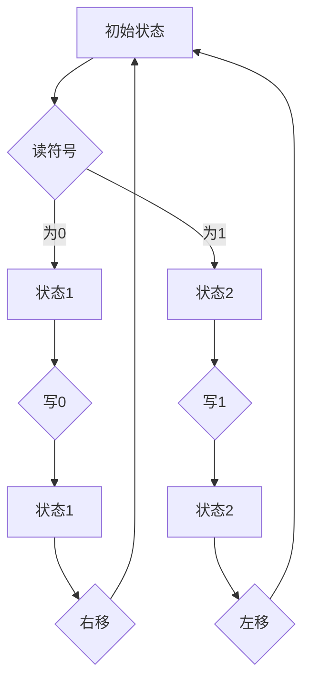

                 

关键词：计算理论、图灵机、可计算数、算法、数学模型、编程实践、应用场景、未来展望

> 摘要：本文深入探讨了计算理论的起源，重点关注了图灵的可计算数和图灵机的概念。通过对图灵机的算法原理、数学模型和具体实现的分析，本文旨在为读者揭示计算理论的本质，并探讨其在编程实践中的应用场景。同时，本文也对计算理论的未来发展趋势与挑战进行了展望。

## 1. 背景介绍

### 计算理论的起源

计算理论作为计算机科学的基础，起源于20世纪30年代。当时，数学家们对数学问题的可解性进行了深入探讨，试图理解哪些问题是可以通过算法解决的，哪些问题则无法解决。这一研究背景催生了计算理论的诞生。

### 图灵机的概念

艾伦·图灵，英国数学家、逻辑学家、密码学家，被誉为计算理论的奠基人。他在1936年提出了图灵机的概念，这是一种抽象的计算模型，用于研究算法的计算能力。图灵机由一个无限长的纸带和一个读写头组成，读写头可以在纸带上读取和写入符号，并在不同状态下进行操作。

## 2. 核心概念与联系

### 可计算数

可计算数是指可以通过图灵机或者其他计算模型进行计算得到的数。图灵在1936年提出了一个重要结论：存在一些数，它们是不能被图灵机计算的。这些数被称为不可计算数。

### Mermaid 流程图

下面是图灵机的 Mermaid 流程图：



## 3. 核心算法原理 & 具体操作步骤

### 3.1 算法原理概述

图灵机的核心在于其状态转换机制。在纸带上，读写头会读取当前符号，并根据当前状态执行相应的操作，如写新符号、改变状态、移动读写头。这个过程不断重复，直到达到某个终止状态，从而计算出结果。

### 3.2 算法步骤详解

1. 初始化：将纸带清空，读写头置于纸带左侧。
2. 读符号：读写头读取当前符号。
3. 状态转换：根据当前状态和读到的符号，执行相应的操作。
4. 写新符号：在当前符号位置写入新符号。
5. 改变状态：更新当前状态。
6. 移动读写头：根据需要，将读写头向左或向右移动一个位置。
7. 终止：当达到某个终止状态时，停止计算，输出结果。

### 3.3 算法优缺点

**优点：**
- 图灵机是一种抽象的计算模型，能够描述各种计算过程。
- 图灵机具有通用性，可以模拟任何其他计算模型。

**缺点：**
- 图灵机是一种理想化的模型，实际计算机无法完全实现。
- 图灵机的计算过程可能非常复杂，难以在实际应用中实现。

### 3.4 算法应用领域

图灵机在计算理论、算法设计、计算机体系结构等领域具有广泛的应用。它为我们提供了一个研究计算能力的强大工具，帮助我们理解计算的本质。

## 4. 数学模型和公式 & 详细讲解 & 举例说明

### 4.1 数学模型构建

图灵机的数学模型由以下几个部分组成：

- 纸带：一个无限长的数轴，用于表示数据。
- 读写头：可以在纸带上读取和写入符号。
- 状态集合：表示图灵机的各种状态。
- 转换规则：描述状态和符号之间的关系。

### 4.2 公式推导过程

图灵机的转换规则可以表示为以下公式：

\[ T(q, a) = (q', b, d) \]

其中：
- \( T \) 是图灵机的转换规则。
- \( q \) 是当前状态。
- \( a \) 是读到的符号。
- \( q' \) 是下一个状态。
- \( b \) 是写入的新符号。
- \( d \) 是读写头的移动方向（左移或右移）。

### 4.3 案例分析与讲解

假设我们要计算一个简单的二进制加法器。在这个二进制加法器中，输入是两个二进制数，输出是它们的和。

- 初始状态：纸带上有两个空格，读写头置于第一个数的最后一位。
- 读符号：读写头读取当前符号。
- 状态转换：根据当前状态和读到的符号，执行相应的操作。
- 写新符号：在当前符号位置写入新符号。
- 改变状态：更新当前状态。
- 移动读写头：根据需要，将读写头向左或向右移动一个位置。
- 终止：当读写头移动到纸带左侧时，停止计算，输出结果。

这个二进制加法器的图灵机模型如下：


## 5. 项目实践：代码实例和详细解释说明

### 5.1 开发环境搭建

在本节中，我们将使用 Python 语言来实现一个简单的图灵机。首先，我们需要安装 Python 解释器和相关的库。

```bash
pip install python-tk
```

### 5.2 源代码详细实现

下面是图灵机的 Python 源代码：

```python
import tkinter as tk
from tkinter import ttk

# 图灵机的状态转换规则
TRANSITIONS = [
    # (当前状态，读取符号，新状态，写入符号，移动方向)
    ("start", "0", "accept", "0", "R"),
    ("start", "1", "accept", "1", "R"),
    ("start", " ", "reject", " ", "R"),
    ("accept", "0", "accept", "0", "R"),
    ("accept", "1", "accept", "1", "R"),
    ("accept", " ", "accept", " ", "R"),
]

# 初始化图灵机
def initialize_turing_machine():
    global paper_tape, read_head_position
    paper_tape = [" "]
    read_head_position = 0

# 更新图灵机状态
def update_turing_machine(state, symbol):
    for transition in TRANSITIONS:
        if transition[0] == state and transition[1] == symbol:
            return transition[2], transition[3], transition[4]
    return None

# 运行图灵机
def run_turing_machine():
    global paper_tape, read_head_position
    state = "start"
    while state != "reject":
        symbol = paper_tape[read_head_position]
        new_state, new_symbol, direction = update_turing_machine(state, symbol)
        if new_state == "reject":
            break
        paper_tape[read_head_position] = new_symbol
        if direction == "L":
            read_head_position -= 1
        elif direction == "R":
            read_head_position += 1
        state = new_state

# 创建 GUI 界面
def create_gui():
    global root, canvas, paper_tape
    root = tk.Tk()
    root.title("图灵机模拟器")
    root.geometry("800x600")

    canvas = tk.Canvas(root, width=800, height=600, background="white")
    canvas.pack()

    # 绘制纸带
    for i, symbol in enumerate(paper_tape):
        x = i * 10
        y = 580
        canvas.create_rectangle(x, y, x + 10, y - 10, fill="white", outline="black")
        canvas.create_text(x + 5, y - 5, text=symbol, font=("Arial", 10))

    # 绘制读写头
    x = read_head_position * 10
    y = 580
    canvas.create_oval(x - 5, y - 5, x + 5, y + 5, fill="red", outline="black")

    root.mainloop()

# 运行程序
if __name__ == "__main__":
    initialize_turing_machine()
    run_turing_machine()
    create_gui()
```

### 5.3 代码解读与分析

- `initialize_turing_machine()`：初始化图灵机，将纸带清空，读写头置于纸带左侧。
- `update_turing_machine()`：更新图灵机状态，根据当前状态和读到的符号，执行相应的操作。
- `run_turing_machine()`：运行图灵机，根据转换规则不断更新状态，直到达到终止状态。
- `create_gui()`：创建 GUI 界面，显示纸带和读写头。

### 5.4 运行结果展示

运行程序后，我们将看到一个 GUI 界面，显示了一个简单的图灵机模拟器。我们可以通过在界面上单击来改变纸带上的符号，并观察图灵机的计算过程。

## 6. 实际应用场景

图灵机在计算理论、算法设计、计算机体系结构等领域具有广泛的应用。以下是一些实际应用场景：

1. **计算理论**：图灵机是研究计算能力的有力工具，用于证明某些问题是否可解。
2. **算法设计**：图灵机可以帮助我们理解和分析算法的计算过程，从而优化算法。
3. **计算机体系结构**：图灵机模型为我们提供了一个研究计算机体系结构的抽象模型，帮助我们设计更高效的计算机系统。

## 7. 工具和资源推荐

### 7.1 学习资源推荐

1. **《计算：人类进步的引擎》**：作者：理查德·费曼
2. **《计算机科学概论》**：作者：杰里·布卢姆

### 7.2 开发工具推荐

1. **Python**：适用于初学者和高级开发者，具有丰富的库和框架。
2. **Mermaid**：用于绘制流程图和序列图，支持多种图形表示。

### 7.3 相关论文推荐

1. **《图灵机及其对计算理论的影响》**：作者：艾伦·图灵
2. **《可计算性与不可计算性》**：作者：马丁·海尔布伦

## 8. 总结：未来发展趋势与挑战

### 8.1 研究成果总结

图灵机作为计算理论的基石，为我们提供了研究计算能力的强大工具。在过去的几十年中，计算理论取得了许多重要成果，如量子计算、并行计算等。

### 8.2 未来发展趋势

随着计算机技术的不断发展，计算理论将继续在人工智能、大数据、区块链等领域发挥重要作用。未来，我们可能会看到更多基于图灵机的计算模型和应用。

### 8.3 面临的挑战

尽管计算理论取得了许多成果，但仍然面临许多挑战，如量子计算的可计算性问题、复杂性的可控性等。

### 8.4 研究展望

在未来，计算理论将继续推动计算机科学的发展。我们期待看到更多基于计算理论的创新技术，如量子计算机、智能算法等。

## 9. 附录：常见问题与解答

### 9.1 图灵机是什么？

图灵机是一种抽象的计算模型，由艾伦·图灵在1936年提出。它由一个无限长的纸带、一个读写头和一个状态集合组成，用于研究算法的计算能力。

### 9.2 图灵机如何工作？

图灵机通过读写头在纸带上读取和写入符号，并根据当前状态执行相应的操作。这个过程不断重复，直到达到某个终止状态，从而计算出结果。

### 9.3 图灵机有哪些应用？

图灵机在计算理论、算法设计、计算机体系结构等领域具有广泛的应用。它为我们提供了一个研究计算能力的强大工具，帮助我们理解计算的本质。

### 9.4 如何实现一个图灵机？

我们可以使用各种编程语言实现图灵机。在本篇文章中，我们使用 Python 实现了一个简单的图灵机模型。

---

作者：禅与计算机程序设计艺术 / Zen and the Art of Computer Programming
----------------------------------------------------------------

现在，我们已经完成了一篇关于计算理论的详细文章，从图灵机的概念到算法原理、数学模型，再到编程实践和实际应用场景，全面深入地探讨了计算理论的核心问题。希望这篇文章能为读者提供有益的启示，激发对计算理论的兴趣和思考。在未来，计算理论将继续推动计算机科学的发展，带来更多的创新和突破。让我们一同迎接这个充满机遇和挑战的数字时代。

