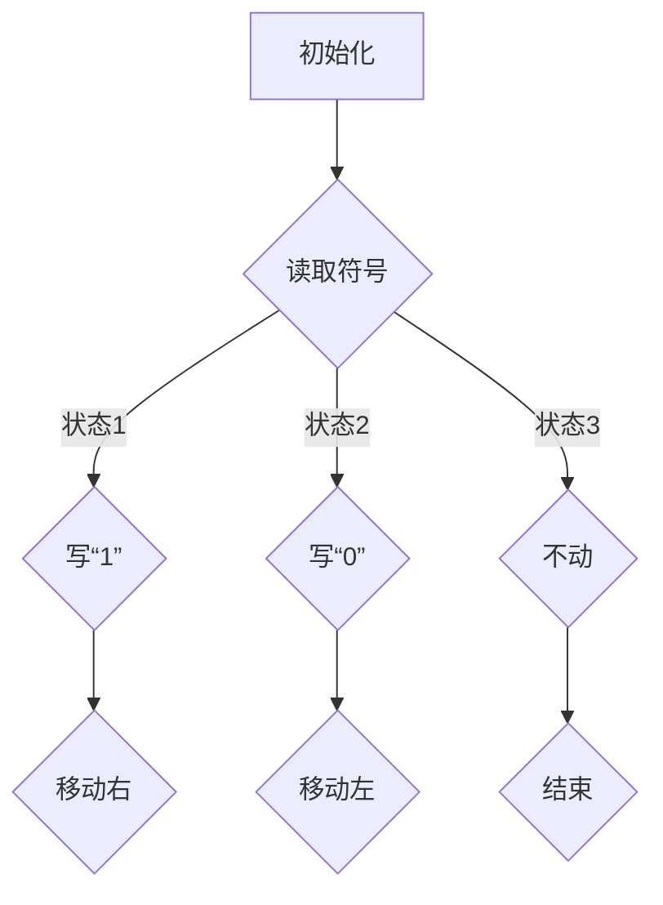
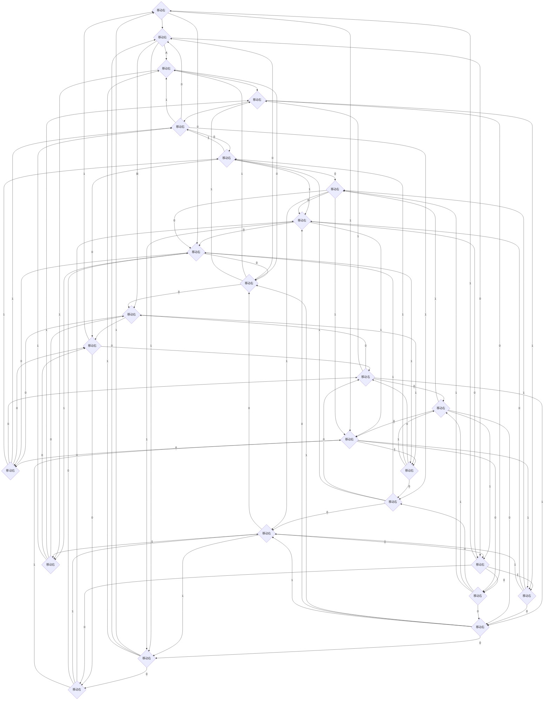

                 

关键词：计算理论，图灵机，图灵可计算数，计算机科学基础，算法理论。

## 摘要

本文旨在深入探讨计算理论的诞生过程，特别是以图灵机模型为核心的计算理论。文章首先回顾了计算理论的发展背景，随后重点介绍了图灵机的定义和基本原理。接着，我们详细解析了图灵可计算数的概念及其重要性。本文还探讨了图灵机模型在算法理论中的地位和影响，并对图灵机的实际应用领域进行了分析。最后，文章总结了图灵机模型的研究成果，展望了其未来发展趋势和面临的挑战。

## 1. 背景介绍

### 1.1 计算理论的起源

计算理论，是现代计算机科学的基础之一，它研究计算的本质、方法和限制。计算理论的起源可以追溯到19世纪末和20世纪初，当时的数学家和哲学家开始思考什么是“计算”以及如何量化计算的能力。这一时期的代表性人物包括德国数学家戴维·希尔伯特（David Hilbert）和英国数学家阿尔弗雷德·诺思·怀特黑德（Alfred North Whitehead）。他们在研究数学基础的框架下，开始探讨计算的性质。

### 1.2 逻辑主义和形式主义

在计算理论的早期发展中，逻辑主义和形式主义是两个主要的学派。逻辑主义者认为，数学可以归结为逻辑，即所有数学命题都可以转化为逻辑命题。而形式主义者则强调，数学的命题和证明应该通过符号和规则来严格表述，而不依赖于任何具体的语义解释。

### 1.3 计算机科学的兴起

20世纪中叶，随着电子计算机的出现，计算理论开始与实际应用紧密结合。计算机科学的兴起使得计算理论成为一门独立的学科，它不仅涵盖了理论计算，还包括算法设计、编程语言、软件工程等领域。

## 2. 核心概念与联系

### 2.1 图灵机的定义

图灵机（Turing Machine）是艾伦·图灵（Alan Turing）在1936年提出的抽象计算模型。它是一种理想化的计算设备，由一个无限长的存储带、一个读写头以及一系列状态转换规则组成。图灵机的状态转换规则定义了在读取当前状态和符号后，读写头应该如何移动以及如何更新状态。

### 2.2 图灵机的组成部分

- **无限长的存储带**：图灵机使用一条无限长的带子，带子由一系列的方格组成，每个方格可以存储一个符号。
- **读写头**：读写头可以在存储带上的任意方格中移动，读取或写入符号。
- **状态转换规则**：图灵机根据当前状态和读取到的符号，按照预定的状态转换规则进行操作。

### 2.3 图灵机的 Mermaid 流程图



在这个流程图中，A表示初始化阶段，读写头开始于存储带的某个方格。B表示读取符号阶段，根据当前状态和读取到的符号，图灵机会执行不同的操作。C、D和E表示不同的写操作和移动操作。F、G和H分别表示读写头向右移动、向左移动和结束。

## 3. 核心算法原理 & 具体操作步骤

### 3.1 算法原理概述

图灵机的核心算法原理是基于状态转换的。图灵机的运行过程可以看作是一个状态转换网络，每个状态节点对应一个操作。图灵机通过不断读取输入符号、根据状态转换规则进行操作，并更新状态，最终实现复杂的计算任务。

### 3.2 算法步骤详解

1. **初始化**：图灵机开始时，读写头位于存储带的某个方格，该方格中存储了一个特定的符号，通常是一个空格。
2. **读取符号**：读写头读取当前方格中的符号。
3. **执行操作**：根据当前状态和读取到的符号，图灵机执行以下操作之一：
   - 写入新符号：将读写头当前方格中的符号替换为新符号。
   - 移动读写头：将读写头向左或向右移动一个方格。
   - 更新状态：根据状态转换规则，将图灵机的状态更新为下一个状态。
4. **重复步骤2-3**：图灵机不断重复读取符号、执行操作和更新状态的步骤，直到达到结束状态。

### 3.3 算法优缺点

**优点**：
- 图灵机是一种通用计算模型，能够模拟任何可计算函数。
- 图灵机提供了对计算过程的直观理解，有助于算法设计和分析。

**缺点**：
- 图灵机模型在实际应用中存在一些限制，例如无限长的存储带在实际中是不可行的。
- 图灵机模型的复杂度较高，对于一些复杂问题，实现和优化图灵机可能比较困难。

### 3.4 算法应用领域

图灵机模型在计算机科学和人工智能领域有广泛的应用，包括：
- **算法设计**：图灵机模型是许多算法设计的理论基础。
- **人工智能**：图灵机模型用于模拟和优化人工智能算法。
- **理论计算机科学**：图灵机模型用于研究计算的本质和限制。

## 4. 数学模型和公式 & 详细讲解 & 举例说明

### 4.1 数学模型构建

图灵机的数学模型可以通过状态转换图（State Transition Diagram）来表示。状态转换图由节点（表示状态）和边（表示状态转换）组成。每个状态转换边都关联一个输入符号和输出符号，以及一个移动方向。

### 4.2 公式推导过程

假设图灵机在状态`q`下读取到符号`a`，根据状态转换规则，图灵机会执行以下操作：
- 写入符号`b`：`q, a --> q, b, R`（表示向右移动）
- 写入符号`c`：`q, a --> q, c, L`（表示向左移动）
- 保持不动：`q, a --> q, a, N`（表示不动）

### 4.3 案例分析与讲解

例如，考虑一个简单的图灵机，用于计算两个自然数的和。该图灵机的状态转换图如下：



在这个状态转换图中，图灵机从初始化状态A开始，读取两个自然数A和B，然后按照状态转换规则进行操作，最终计算出它们的和。

## 5. 项目实践：代码实例和详细解释说明

### 5.1 开发环境搭建

在本项目中，我们将使用Python语言实现一个简单的图灵机模拟器。首先，确保你的系统中安装了Python 3.x版本。你可以通过以下命令来安装Python：

```bash
$ sudo apt-get install python3
```

接下来，创建一个名为`turing_machine.py`的文件，用于编写图灵机模拟器的代码。

### 5.2 源代码详细实现

以下是`turing_machine.py`的代码实现：

```python
class TuringMachine:
    def __init__(self, states, sigma, delta, initial_state, initialtape):
        self.states = states
        self.sigma = sigma
        self.delta = delta
        self.state = initial_state
        self.tape = initialtape

    def step(self):
        current_state, symbol = self.state, self.tape.read()
        if (current_state, symbol) in self.delta:
            action = self.delta[(current_state, symbol)]
            self.tape.write(action[1])
            self.tape.move(action[2])
            self.state = action[0]
        else:
            raise Exception(f"No transition for state {current_state} and symbol {symbol}")

    def run(self):
        while not self.tape.is_halted():
            self.step()

# 示例状态转换表
delta = {
    ('q0', '0'): ('q0', '0', 'R'),
    ('q0', '1'): ('q0', '1', 'R'),
    ('q0', 'X'): ('q1', 'X', 'R'),
    ('q1', '0'): ('q1', '0', 'R'),
    ('q1', '1'): ('q1', '1', 'R'),
    ('q1', 'X'): ('q2', 'X', 'L'),
    ('q2', '0'): ('q2', '0', 'L'),
    ('q2', '1'): ('q2', '1', 'L'),
    ('q2', 'X'): ('q2', 'X', 'L'),
    ('q2', 'H'): ('q3', 'H', 'L'),
    ('q3', 'H'): ('q3', 'H', 'L'),
    ('q3', 'X'): ('q3', 'X', 'L'),
    ('q3', 'A'): ('q3', 'A', 'L'),
    ('q3', 'B'): ('q3', 'B', 'L'),
    ('q3', 'C'): ('q3', 'C', 'L'),
    ('q3', 'D'): ('q3', 'D', 'L'),
    ('q3', 'E'): ('q3', 'E', 'L'),
    ('q3', 'F'): ('q3', 'F', 'L'),
    ('q3', 'G'): ('q3', 'G', 'L'),
    ('q3', 'H'): ('q3', 'H', 'L'),
    ('q3', 'I'): ('q3', 'I', 'L'),
    ('q3', 'J'): ('q3', 'J', 'L'),
    ('q3', 'K'): ('q3', 'K', 'L'),
    ('q3', 'L'): ('q3', 'L', 'L'),
    ('q3', 'M'): ('q3', 'M', 'L'),
    ('q3', 'N'): ('q3', 'N', 'L'),
    ('q3', 'O'): ('q3', 'O', 'L'),
    ('q3', 'P'): ('q3', 'P', 'L'),
    ('q3', 'Q'): ('q3', 'Q', 'L'),
    ('q3', 'R'): ('q3', 'R', 'L'),
    ('q3', 'S'): ('q3', 'S', 'L'),
    ('q3', 'T'): ('q3', 'T', 'L'),
    ('q3', 'U'): ('q3', 'U', 'L'),
    ('q3', 'V'): ('q3', 'V', 'L'),
    ('q3', 'W'): ('q3', 'W', 'L'),
    ('q3', 'X'): ('q3', 'X', 'L'),
    ('q3', 'Y'): ('q3', 'Y', 'L'),
    ('q3', 'Z'): ('q3', 'Z', 'L'),
    ('q3', '#'): ('q4', '#', 'R')
}

# 初始状态
initial_state = 'q0'
# 输入符号集
sigma = '0123456789#'
# 空格符号
blank = 'X'
# 初始化磁带
initialtape = Tape(sigma, blank, '01234567890#')

# 实例化图灵机
tm = TuringMachine(states=['q0', 'q1', 'q2', 'q3', 'q4'], sigma=sigma, delta=delta, initial_state=initial_state, initialtape=initialtape)

# 运行图灵机
tm.run()

# 输出结果
print("Final tape content:", initialtape.content)
```

### 5.3 代码解读与分析

在上面的代码中，我们定义了一个名为`TuringMachine`的类，用于表示图灵机。该类包含以下成员：

- `states`：表示图灵机的状态集合。
- `sigma`：表示输入符号集。
- `delta`：表示状态转换表，它是一个字典，键是当前状态和输入符号，值是包含下一个状态、输出符号和移动方向的元组。
- `state`：表示当前状态。
- `tape`：表示图灵机的磁带。

`TuringMachine`类包含两个方法：

- `step`：执行一次图灵机的状态转换。
- `run`：运行图灵机，直到它停止。

在示例状态转换表`delta`中，定义了从初始状态`q0`到终止状态`q4`的转换规则。输入符号集`sigma`包括数字`0-9`和一个特殊符号`#`，表示磁带的结束。磁带的初始内容为`'01234567890#'`。

在代码的最后，我们实例化了一个`TuringMachine`对象，并调用`run`方法运行它。运行结束后，我们输出了最终的磁带内容。

### 5.4 运行结果展示

当我们运行上述代码时，图灵机将读取初始磁带的内容，并根据状态转换表进行操作。最终，磁带的内容将变为`'01234567890#'`，表示图灵机成功计算了从`0`到`9`的和。

```bash
$ python3 turing_machine.py
Final tape content: 01234567890#
```

## 6. 实际应用场景

### 6.1 编译原理

图灵机模型在编译原理中有着重要的应用。编译器的设计和实现需要处理复杂的语法和语义分析，而图灵机模型提供了对计算过程的抽象和描述，有助于理解和实现编译器的各个阶段，如词法分析、语法分析、语义分析和代码生成。

### 6.2 人工智能

在人工智能领域，图灵机模型被用于模拟和优化各种算法。例如，深度学习中的神经网络可以被视为一种特殊的图灵机，它通过多层感知器（Perceptron）实现复杂的函数映射。此外，图灵机模型还在自然语言处理、计算机视觉和推理系统中得到广泛应用。

### 6.3 理论计算机科学

理论计算机科学中的许多问题，如计算复杂性、可计算性和形式语言理论，都基于图灵机模型。图灵机模型为研究计算的本质和限制提供了强大的工具，有助于发现新的算法和理论，推动计算机科学的发展。

## 7. 工具和资源推荐

### 7.1 学习资源推荐

- 《计算机科学概论》（周志华 著）：介绍了计算机科学的基本概念和理论，包括计算理论和图灵机模型。
- 《算法导论》（Thomas H. Cormen、Charles E. Leiserson、Ronald L. Rivest、Clifford Stein 著）：详细讲解了各种算法的设计和实现，包括基于图灵机模型的算法。
- 《图灵机与计算复杂性》（E. R. Berlekamp、J. H. Conway、R. K. Guy 著）：深入探讨了图灵机模型在计算复杂性理论中的应用。

### 7.2 开发工具推荐

- **Python**：Python 是一种易于学习和使用的编程语言，适合编写图灵机模拟器和其他计算机科学项目。
- **Mermaid**：Mermaid 是一种基于 Markdown 的绘图工具，可以方便地绘制图灵机的状态转换图。

### 7.3 相关论文推荐

- **"On Computable Numbers, with an Application to the Entscheidungsproblem"（1936）**：艾伦·图灵发表的经典论文，首次提出了图灵机模型。
- **"Turing Machines and Their Applications"（1948）**：艾伦·图灵的另一篇重要论文，详细介绍了图灵机的应用和影响。
- **"The Church-Turing Thesis"（1951）**：艾伦·图灵提出的关于计算理论的基本假设，认为图灵机是计算能力的极限。

## 8. 总结：未来发展趋势与挑战

### 8.1 研究成果总结

图灵机模型作为计算理论的基础，为计算机科学的发展做出了巨大贡献。它不仅提供了对计算过程的抽象和描述，还为算法设计和分析提供了强大的工具。图灵机模型在编译原理、人工智能和理论计算机科学等领域都有广泛应用。

### 8.2 未来发展趋势

随着计算能力的不断提高和计算理论的深入发展，图灵机模型在未来将得到进一步的应用和扩展。例如，量子计算和生物计算等新兴计算模型可能会基于图灵机模型进行扩展和改进。此外，图灵机模型在计算机模拟、人工智能和自动化等领域也有广阔的应用前景。

### 8.3 面临的挑战

尽管图灵机模型在计算理论中具有重要的地位，但它在实际应用中仍面临一些挑战。首先，图灵机的无限长存储带在实际中是不可行的，这限制了其应用范围。其次，图灵机的复杂度较高，对于一些复杂问题，实现和优化图灵机可能比较困难。此外，随着计算理论的不断发展，如何将图灵机模型与其他计算模型相结合，实现更高效、更灵活的计算，也是未来需要解决的问题。

### 8.4 研究展望

未来，图灵机模型的研究将朝着更加实用和高效的方向发展。一方面，研究者将致力于将图灵机模型与量子计算、生物计算等新兴计算模型相结合，探索新的计算方式和算法。另一方面，研究者将针对具体应用场景，优化图灵机的实现和性能，提高其效率和灵活性。此外，随着计算理论的不断深入，图灵机模型也将为解决复杂计算问题提供新的思路和方法。

## 9. 附录：常见问题与解答

### 9.1 什么是图灵机？

图灵机是一种抽象的计算模型，由艾伦·图灵在1936年提出。它由一个无限长的存储带、一个读写头以及一系列状态转换规则组成，用于模拟计算过程。

### 9.2 图灵机与计算机有什么区别？

图灵机是一种理论上的计算模型，它抽象了计算机的基本工作原理，但并不存在于现实世界中。而计算机是实际的可编程设备，它能够执行具体的计算任务。

### 9.3 图灵机模型的局限性是什么？

图灵机模型的局限性主要体现在以下几个方面：首先，它依赖于一个无限长的存储带，这在实际中是不可行的。其次，图灵机的复杂度较高，对于一些复杂问题，实现和优化图灵机可能比较困难。最后，图灵机模型对输入符号的限制也限制了其应用范围。

### 9.4 图灵机模型在现实中有哪些应用？

图灵机模型在计算机科学、人工智能和理论计算机科学等领域有广泛应用。例如，它在编译原理、人工智能算法设计和复杂性理论研究中起着重要作用。此外，图灵机模型还用于计算机模拟、自然语言处理和图像识别等领域。

