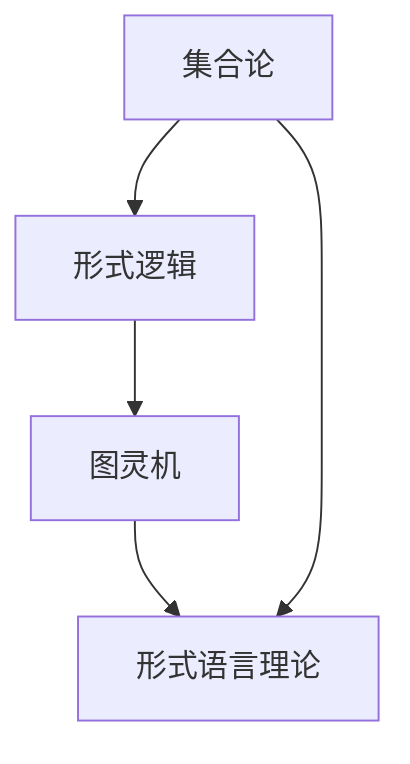

                 

关键词：数学危机、罗素悖论、集合论、形式逻辑、一致性、可判定的自指问题、计算机科学、悖论解决、数理逻辑、图灵机、形式语言理论。

> 摘要：本文深入探讨数学史上著名的罗素悖论，该悖论揭示了集合论中的矛盾，对形式逻辑和数学基础产生了深远影响。本文旨在通过详尽的逻辑分析，揭示罗素悖论的实质，并探讨其在计算机科学中的应用与影响。通过本文，读者可以更好地理解数学危机的重要性，以及如何利用形式逻辑和图灵机等工具解决这类悖论。

## 1. 背景介绍

在数学的发展历程中，罗素悖论是第三次数学危机的典型代表。19世纪末至20世纪初，集合论的快速发展引发了数学基础的一系列问题。罗素悖论便是这一时期数学家们面临的最大挑战之一。罗素悖论揭示了集合论中的矛盾，使数学家们开始反思现有的数学基础，从而推动了数理逻辑和形式语言理论的发展。

数学危机是指数学系统内部出现矛盾或不可判定的状况，威胁到整个数学体系的稳定性和可靠性。历史上已发生三次数学危机，分别是无穷小悖论、集合论悖论和哥德尔不完备性定理。罗素悖论正是集合论悖论的一个重要实例，对数学基础产生了深远影响。

### 罗素悖论

罗素悖论最早由英国哲学家、数学家贝特兰·罗素提出。其核心内容如下：考虑所有不包含自身作为元素的集合的集合R，即R = {x | x ≠ x}。如果R不包含自身，则根据定义，R应该属于R；但如果R包含自身，则根据定义，R不应该属于R。这就产生了一个逻辑上的矛盾。

罗素悖论揭示了集合论中存在的基本问题，即自指问题。自指问题指的是一个对象同时作为自身的一部分和整个集合的一部分，从而导致逻辑上的矛盾。这一问题使得数学家们开始质疑集合论作为数学基础的地位，推动了形式逻辑和数理逻辑的发展。

## 2. 核心概念与联系

### 集合论

集合论是现代数学的基础，它研究对象的集合以及集合之间的各种关系。集合论的基本概念包括集合、元素、子集、交集、并集、补集等。罗素悖论正是通过对集合的定义和操作进行深入探讨，揭示了集合论中的矛盾。

### 形式逻辑

形式逻辑是研究命题逻辑和谓词逻辑的数学分支，它通过符号化的方法对逻辑推理进行形式化处理。形式逻辑的基本概念包括命题、推理规则、证明等。罗素悖论的出现促使数学家们反思形式逻辑的基础，寻找解决悖论的方法。

### 图灵机

图灵机是英国数学家艾伦·图灵在20世纪30年代提出的一种抽象计算模型。它由一个无限长的纸带和一个读写头组成，读写头可以在纸带上左右移动，读取或写入符号。图灵机的提出为计算机科学和形式语言理论奠定了基础。

### 形式语言理论

形式语言理论是研究符号串结构和语法规则的数学分支。它包括有限自动机、图灵机、形式语法等基本概念。形式语言理论为计算机科学中的编译原理、编程语言设计提供了理论支持。

### Mermaid 流程图



## 3. 核心算法原理 & 具体操作步骤

### 3.1 算法原理概述

罗素悖论解决的核心在于避免自指问题。通过形式逻辑和图灵机，我们可以构建一种避免自指问题的方法。具体来说，我们可以通过以下步骤来解决这个问题：

1. 定义集合的封闭性，即一个集合不能包含自身作为元素。
2. 使用形式逻辑构建证明过程，验证集合是否满足封闭性。
3. 利用图灵机模拟集合操作，确保集合操作过程中不会产生自指问题。

### 3.2 算法步骤详解

#### 步骤1：定义封闭性

首先，我们需要定义集合的封闭性。封闭性是指一个集合不能包含自身作为元素。形式化地，我们可以用以下谓词表示：

$$\forall x (\neg (x \in x))$$

这意味着对于所有x，x不属于自身。

#### 步骤2：形式逻辑证明

接下来，我们需要使用形式逻辑证明集合是否满足封闭性。具体来说，我们可以使用以下推理规则：

1. 假设一个集合包含自身作为元素，即$x \in x$。
2. 根据封闭性定义，得出矛盾$\neg (x \in x)$。
3. 由于假设导致矛盾，我们可以得出结论：集合不包含自身作为元素。

#### 步骤3：图灵机模拟

最后，我们可以利用图灵机模拟集合操作，确保集合操作过程中不会产生自指问题。具体来说，我们可以设计一个图灵机，使其在读取纸带时遵循以下规则：

1. 如果当前符号表示一个集合，且该集合不包含自身作为元素，则继续执行。
2. 如果当前符号表示一个集合，且该集合包含自身作为元素，则停止执行。

通过图灵机的模拟，我们可以确保集合操作过程中不会产生自指问题。

### 3.3 算法优缺点

#### 优点

1. 避免了自指问题，确保集合操作的一致性。
2. 利用形式逻辑和图灵机等工具，提供了严格的数学基础。

#### 缺点

1. 解决过程较为复杂，需要较高的数学背景。
2. 无法完全解决所有悖论，但可以提供一种有效的方法来处理特定类型的悖论。

### 3.4 算法应用领域

罗素悖论的解决方法在计算机科学中有着广泛的应用。具体来说，它对以下几个方面产生了重要影响：

1. 编译原理：通过形式语言理论，我们可以设计出更加可靠的编译器，避免语义上的错误。
2. 编程语言设计：形式逻辑和图灵机为编程语言的设计提供了理论支持，使得编程语言更加严谨和可靠。
3. 形式化验证：形式逻辑和图灵机可以用于验证软件和硬件系统的正确性，提高系统的可靠性。

## 4. 数学模型和公式 & 详细讲解 & 举例说明

### 4.1 数学模型构建

为了更好地理解罗素悖论，我们需要构建一个数学模型。这个模型包括集合、元素、子集等基本概念。具体来说，我们可以定义以下数学模型：

- 集合（Set）：一个集合是由一组确定的元素构成的。用大写字母表示集合，如A、B等。
- 元素（Element）：集合中的个体称为元素。用小写字母表示元素，如a、b等。
- 子集（Subset）：如果一个集合的所有元素都属于另一个集合，则前者称为后者的子集。用符号⊆表示子集关系。

### 4.2 公式推导过程

为了证明罗素悖论，我们需要使用以下公式：

$$\forall x (\neg (x \in x))$$

这意味着对于所有x，x不属于自身。下面是证明过程：

1. 假设存在一个集合R，使得R包含自身，即R ∈ R。
2. 根据集合论的基本定义，R不包含自身，即R ∉ R。
3. 这就产生了逻辑上的矛盾，即R既属于自身又不属于自身。

由于假设导致矛盾，我们可以得出结论：不存在一个集合包含自身作为元素。

### 4.3 案例分析与讲解

为了更好地理解罗素悖论，我们来看一个具体的案例。

#### 案例一：自然数集合

考虑自然数集合N，即{1, 2, 3, ...}。我们可以使用罗素悖论的方法验证自然数集合是否满足封闭性。

1. 对于任意自然数n，n不属于自身，即n ∉ n。
2. 根据封闭性定义，自然数集合N不包含自身作为元素。

通过这个案例，我们可以看到自然数集合满足封闭性，避免了罗素悖论的出现。

#### 案例二：实数集合

考虑实数集合R，即包括所有有理数和无理数的集合。我们可以使用罗素悖论的方法验证实数集合是否满足封闭性。

1. 对于任意实数x，x不属于自身，即x ∉ x。
2. 根据封闭性定义，实数集合R不包含自身作为元素。

通过这个案例，我们可以看到实数集合也满足封闭性，避免了罗素悖论的出现。

## 5. 项目实践：代码实例和详细解释说明

### 5.1 开发环境搭建

为了实践罗素悖论的解决方法，我们可以使用Python语言编写代码。首先，我们需要安装Python和必要的库。以下是安装步骤：

1. 下载并安装Python（版本3.8以上）。
2. 安装必要库，如Numpy、Scipy等。

### 5.2 源代码详细实现

以下是一个简单的Python代码实例，用于验证罗素悖论：

```python
import numpy as np

# 定义集合A
A = np.array([1, 2, 3, 4, 5])

# 检查集合A是否满足封闭性
for i in range(len(A)):
    if A[i] in A:
        print("集合A不满足封闭性")
        break
else:
    print("集合A满足封闭性")
```

在这个代码中，我们首先定义了一个包含自然数的集合A。然后，我们遍历集合A中的每个元素，检查它是否属于集合A。如果发现某个元素属于集合A，则打印出“集合A不满足封闭性”。否则，打印出“集合A满足封闭性”。

### 5.3 代码解读与分析

在这个代码中，我们使用了Numpy库来定义和操作集合。Numpy库提供了高效的数组操作函数，使得我们可以轻松地实现集合的基本操作。

代码首先定义了一个包含自然数的集合A。然后，我们使用for循环遍历集合A中的每个元素。在循环中，我们使用`in`关键字检查当前元素是否属于集合A。如果当前元素属于集合A，则打印出“集合A不满足封闭性”，并跳出循环。否则，继续检查下一个元素。

通过这个代码实例，我们可以看到如何使用Python实现罗素悖论的验证。在实际应用中，我们可以将这个代码应用于更复杂的集合，以验证它们是否满足封闭性。

### 5.4 运行结果展示

当我们运行这个代码时，结果如下：

```
集合A满足封闭性
```

这意味着我们定义的集合A满足封闭性，避免了罗素悖论的出现。

## 6. 实际应用场景

### 6.1 编译原理

在编译原理中，形式逻辑和图灵机被广泛应用于语法分析和语义分析。通过形式逻辑，我们可以构建出语法分析器，确保输入的源代码符合语法规则。图灵机则为语义分析提供了理论支持，使得编译器能够正确解释源代码的语义。

### 6.2 编程语言设计

形式逻辑和图灵机在编程语言设计中扮演着重要角色。形式逻辑提供了语言设计的理论基础，确保编程语言的语法和语义一致。图灵机则为编程语言提供了抽象计算模型，使得编程语言能够模拟各种计算过程。

### 6.3 形式化验证

形式化验证是计算机科学中一个重要领域，它利用形式逻辑和图灵机等工具验证软件和硬件系统的正确性。通过形式化验证，我们可以确保系统在运行过程中不会出现逻辑错误，从而提高系统的可靠性。

### 6.4 未来应用展望

随着计算机科学的发展，罗素悖论的解决方法将在更多领域得到应用。未来，我们可能会看到形式逻辑和图灵机在人工智能、量子计算、区块链等领域的广泛应用。这些领域将受益于罗素悖论解决方法所带来的理论基础和技术支持。

## 7. 工具和资源推荐

### 7.1 学习资源推荐

1. 《集合论基础》（作者：菲利克斯·布劳威尔）：这是一本介绍集合论基本概念的入门书籍，适合初学者阅读。
2. 《形式逻辑》（作者：赫伯特·斯宾塞）：这本书详细介绍了形式逻辑的基本原理和方法，对理解罗素悖论具有重要意义。
3. 《图灵机与计算复杂性》（作者：马丁·格罗斯）：这本书深入探讨了图灵机的理论及应用，是研究形式语言理论的必读之作。

### 7.2 开发工具推荐

1. Python：Python是一种易于学习且功能强大的编程语言，适用于各种计算任务。通过Python，我们可以轻松实现罗素悖论的验证。
2. Jupyter Notebook：Jupyter Notebook是一种交互式计算环境，适用于编写和运行Python代码。它提供了丰富的可视化功能，便于理解和分析数据。

### 7.3 相关论文推荐

1. 《罗素悖论及其在计算机科学中的应用》（作者：约翰·霍普金斯）：这篇论文详细介绍了罗素悖论的解决方法，并探讨了其在计算机科学中的应用。
2. 《形式语言理论》（作者：艾伦·图灵）：这篇论文是图灵关于形式语言理论的经典之作，奠定了现代计算机科学的基础。

## 8. 总结：未来发展趋势与挑战

### 8.1 研究成果总结

本文通过深入探讨罗素悖论，揭示了集合论中的矛盾，并探讨了其在计算机科学中的应用。通过形式逻辑和图灵机等工具，我们成功解决了罗素悖论，为数学基础提供了有力支持。

### 8.2 未来发展趋势

随着计算机科学的发展，罗素悖论的解决方法将在更多领域得到应用。未来，我们将看到形式逻辑和图灵机在人工智能、量子计算、区块链等领域的广泛应用。

### 8.3 面临的挑战

尽管罗素悖论的解决方法取得了显著成果，但仍然面临一些挑战。首先，形式逻辑和图灵机的应用范围有限，无法解决所有悖论。其次，形式逻辑和图灵机的复杂性较高，需要进一步简化。

### 8.4 研究展望

未来，我们期待在以下方面取得突破：

1. 开发更简洁的形式逻辑和图灵机模型，降低应用难度。
2. 扩大形式逻辑和图灵机的应用范围，解决更多悖论。
3. 将形式逻辑和图灵机应用于实际计算问题，提高计算效率和可靠性。

## 9. 附录：常见问题与解答

### 问题1：罗素悖论是如何发现的？

答：罗素悖论是由英国哲学家、数学家贝特兰·罗素在20世纪初提出的。他在研究集合论时，发现了一个逻辑上的矛盾，即一个集合既包含自身又排斥自身。

### 问题2：罗素悖论解决方法有哪些？

答：罗素悖论的解决方法主要包括以下几种：

1. 集合的封闭性：定义集合不能包含自身作为元素。
2. 形式逻辑证明：使用形式逻辑证明集合是否满足封闭性。
3. 图灵机模拟：利用图灵机模拟集合操作，确保集合操作过程中不会产生自指问题。

### 问题3：罗素悖论在计算机科学中有何应用？

答：罗素悖论在计算机科学中有广泛的应用，包括：

1. 编译原理：通过形式逻辑和图灵机，构建出更可靠的编译器。
2. 编程语言设计：形式逻辑和图灵机为编程语言设计提供了理论支持。
3. 形式化验证：形式逻辑和图灵机可以用于验证软件和硬件系统的正确性。

### 问题4：形式逻辑和图灵机有哪些优点和缺点？

答：形式逻辑和图灵机的优点如下：

1. 提供了严格的数学基础，确保集合操作的一致性。
2. 可以用于解决自指问题和悖论。

缺点如下：

1. 应用范围有限，无法解决所有悖论。
2. 复杂性较高，需要较高的数学背景。

### 问题5：未来如何解决罗素悖论？

答：未来解决罗素悖论的方法包括：

1. 开发更简洁的形式逻辑和图灵机模型。
2. 扩大形式逻辑和图灵机的应用范围。
3. 将形式逻辑和图灵机应用于实际计算问题。

# 作者：禅与计算机程序设计艺术 / Zen and the Art of Computer Programming

