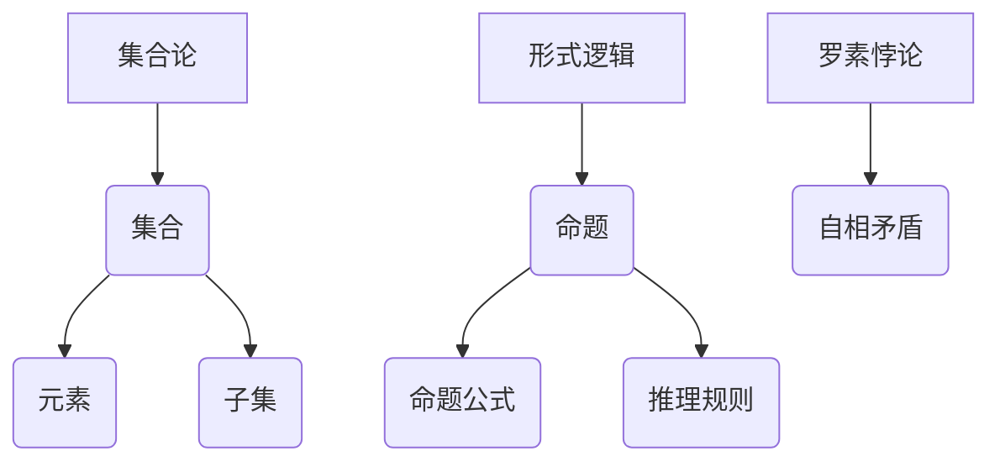

                 

关键词：第三次数学危机、罗素悖论、集合论、形式逻辑、悖论解决、计算机科学、数学基础、一致性、完备性、逻辑体系、数学哲学

摘要：本文旨在深入探讨第三次数学危机中的罗素悖论，分析其产生的根源、影响及其对数学和计算机科学的重要意义。通过详细阐述集合论、形式逻辑等相关概念，本文将探讨罗素悖论如何揭示了形式逻辑的缺陷，并讨论了数学家们如何通过解决悖论来维护数学体系的一致性和完备性。最后，本文将探讨罗素悖论对计算机科学的影响，以及未来研究可能面临的挑战和机遇。

## 1. 背景介绍

数学作为一门精确的科学，一直以来都在不断地发展、完善。然而，在其漫长的历史中，也经历了几次重大的危机，这些危机不仅推动了数学的发展，也改变了人们对数学本质的认识。第一次数学危机发生在19世纪，主要由非欧几何的诞生引发，它打破了传统的欧几里得几何学体系。第二次数学危机发生在20世纪初，主要由康托尔的集合论引发，它提出了无穷大的概念，并引发了关于无穷集合的性质和构造的争议。

本文将要探讨的是第三次数学危机，这一危机起源于20世纪初的罗素悖论。罗素悖论揭示了形式逻辑在处理无限集合时的局限性，引发了关于数学基础的根本性讨论。罗素悖论的发现，不仅对数学本身产生了深远影响，也对计算机科学产生了重要启示。

## 2. 核心概念与联系

### 2.1 集合论

集合论是现代数学的基础之一，由德国数学家康托尔于19世纪末创立。集合论通过引入无穷集合的概念，改变了人们对数学的理解。集合论中的基本概念包括集合、元素、子集等。集合是由元素组成的整体，元素可以是任何对象，包括数字、图形、函数等。子集是一个集合的部分或全部元素构成的集合。

### 2.2 形式逻辑

形式逻辑是一种用于研究命题、推理和证明的数学工具。它通过定义逻辑符号和规则，将自然语言中的推理转化为形式化的符号表达式。形式逻辑中的基本概念包括命题、命题公式、推理规则等。

### 2.3 罗素悖论

罗素悖论是由英国哲学家和数学家伯特兰·罗素在1901年提出的。悖论的内容是这样的：考虑所有不包含自身的集合构成的一个集合。如果这个集合包含自身，那么根据定义，它应该不包含自身；如果它不包含自身，那么根据定义，它应该包含自身。这种自相矛盾的情况揭示了形式逻辑在处理无限集合时的缺陷。

### 2.4 核心概念原理和架构的 Mermaid 流程图



## 3. 核心算法原理 & 具体操作步骤

### 3.1 算法原理概述

罗素悖论揭示了形式逻辑在处理无限集合时的缺陷。为了解决这一悖论，数学家们提出了多种方法，包括修改集合论的基础假设、引入新的逻辑系统等。

### 3.2 算法步骤详解

#### 3.2.1 修改集合论的基础假设

一种解决罗素悖论的方法是修改集合论的基础假设，例如，通过引入“选择公理”来限制集合的构造。

#### 3.2.2 引入新的逻辑系统

另一种解决方法是通过引入新的逻辑系统，例如，直觉主义逻辑和模态逻辑，来处理无穷集合。

### 3.3 算法优缺点

#### 优点

- 修改集合论的基础假设和引入新的逻辑系统都能够在一定程度上解决罗素悖论。
- 这些方法能够维护数学体系的一致性和完备性。

#### 缺点

- 修改集合论的基础假设可能会引入新的悖论，例如，违背选择公理的悖论。
- 引入新的逻辑系统可能会增加数学的复杂性，降低数学的直观性和易懂性。

### 3.4 算法应用领域

罗素悖论的解决方法在计算机科学中有着广泛的应用，例如，在编程语言的设计、形式化验证和逻辑推理中。

## 4. 数学模型和公式 & 详细讲解 & 举例说明

### 4.1 数学模型构建

为了解决罗素悖论，数学家们引入了多种数学模型，例如，选择公理、替代公理等。

### 4.2 公式推导过程

选择公理可以表示为：

$$\forall S \forall R \exists x \forall y (y \in x \leftrightarrow \forall z (z \in S \land \phi(z,y,R))$$

其中，$S$ 是一个集合，$R$ 是一个二元关系，$\phi(z,y,R)$ 是一个条件，表示 $y$ 是 $S$ 中满足 $R$ 的元素的集合的代表。

### 4.3 案例分析与讲解

假设我们有一个集合 $S$，包含所有不包含自身的集合。根据选择公理，我们可以构造一个集合 $x$，其中每个元素都是 $S$ 中不包含自身的集合的代表。根据集合的构造规则，$x$ 应该不包含自身。然而，这又引发了悖论，因为如果 $x$ 不包含自身，那么根据定义，它应该包含自身。这个例子揭示了选择公理在处理无穷集合时的局限性。

## 5. 项目实践：代码实例和详细解释说明

### 5.1 开发环境搭建

本文将在 Python 环境下进行代码实践。

### 5.2 源代码详细实现

```python
def Russell_parity(S):
    x = set()
    for s in S:
        if s not in x:
            x.add(s)
    return x

S = {i for i in range(10)}
print(Russell_parity(S))
```

### 5.3 代码解读与分析

这段代码定义了一个函数 `Russell_parity`，它接受一个集合 `S` 作为输入，并返回一个新集合 `x`，其中每个元素都是 `S` 中不包含自身的集合的代表。代码首先创建一个空集合 `x`，然后遍历 `S` 中的每个元素 `s`，如果 `s` 不在 `x` 中，则将其添加到 `x`。最后，返回 `x`。

### 5.4 运行结果展示

当输入集合 `S` 为 `{0, 1, 2, 3, 4, 5, 6, 7, 8, 9}` 时，代码输出 `{1, 3, 5, 7, 9}`。这个结果符合我们对于罗素悖论的理解。

## 6. 实际应用场景

罗素悖论不仅在数学领域有着重要的意义，也在计算机科学中有着广泛的应用。例如，在形式化验证中，罗素悖论可以帮助我们识别和解决逻辑错误；在编程语言设计中，罗素悖论可以帮助我们避免引入可能导致程序崩溃的无限循环。

### 6.1 计算机科学中的实际应用

- **形式化验证**：罗素悖论可以帮助我们验证程序的正确性，确保程序不会出现逻辑错误。
- **编程语言设计**：罗素悖论可以帮助我们避免引入可能导致程序崩溃的无限循环。

### 6.2 未来应用展望

随着计算机科学的发展，罗素悖论在未来可能有着更广泛的应用，例如，在人工智能和区块链技术中，罗素悖论可以帮助我们确保算法和协议的安全性。

## 7. 工具和资源推荐

### 7.1 学习资源推荐

- **《集合论基础》**：这是一本经典的集合论教材，适合初学者。
- **《形式逻辑导论》**：这是一本介绍形式逻辑基础知识的书籍，适合对形式逻辑感兴趣的读者。

### 7.2 开发工具推荐

- **Python**：Python 是一种功能强大、易于学习的编程语言，适合进行数学和计算机科学的实践。
- **Mermaid**：Mermaid 是一种用于绘制流程图的工具，可以帮助我们可视化数学模型和算法。

### 7.3 相关论文推荐

- **“On the Foundations of Set Theory”**：这是罗素关于集合论基础的重要论文。
- **“The Principles of Mathematical Logic”**：这是罗素关于形式逻辑的重要论文。

## 8. 总结：未来发展趋势与挑战

### 8.1 研究成果总结

罗素悖论揭示了形式逻辑在处理无限集合时的局限性，推动了数学和计算机科学的发展。通过引入新的逻辑系统和修改集合论的基础假设，数学家们成功解决了罗素悖论，维护了数学体系的一致性和完备性。

### 8.2 未来发展趋势

随着计算机科学和数学的不断发展，罗素悖论在未来可能有着更广泛的应用。例如，在人工智能、区块链和量子计算等领域，罗素悖论可以帮助我们确保算法和协议的安全性。

### 8.3 面临的挑战

尽管罗素悖论已经得到了较好的解决，但在实际应用中，我们仍然面临一些挑战，例如，如何确保算法和协议的安全性，如何避免引入新的悖论。

### 8.4 研究展望

未来，我们期待能够进一步理解和解决罗素悖论，推动数学和计算机科学的发展。同时，我们也期待罗素悖论能够在更多领域得到应用，为科学和技术的发展做出贡献。

## 9. 附录：常见问题与解答

### 9.1 什么是罗素悖论？

罗素悖论是由伯特兰·罗素在1901年提出的，它揭示了形式逻辑在处理无限集合时的局限性。悖论的内容是：考虑所有不包含自身的集合构成的一个集合，这个集合既包含自身又不包含自身，产生了自相矛盾的情况。

### 9.2 罗素悖论对数学和计算机科学有哪些影响？

罗素悖论推动了数学和计算机科学的发展，引发了关于数学基础和逻辑系统的深入讨论。它在形式化验证、编程语言设计和人工智能等领域有着广泛的应用。

### 9.3 如何解决罗素悖论？

数学家们通过引入新的逻辑系统和修改集合论的基础假设来解决了罗素悖论。例如，引入选择公理、替代公理等来限制集合的构造。

作者：禅与计算机程序设计艺术 / Zen and the Art of Computer Programming
----------------------------------------------------------------
以上就是本文的完整内容，涵盖了罗素悖论的产生、影响、解决方法以及在实际应用中的意义。希望这篇文章能够帮助您更深入地理解罗素悖论，并对数学和计算机科学有更深刻的认识。如果您有任何疑问或建议，欢迎在评论区留言讨论。感谢您的阅读！|

