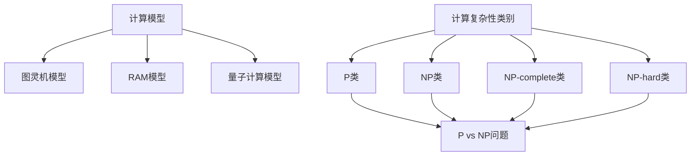

                 

### 关键词 Key Words
计算复杂性、算法分析、计算机科学、理论计算机科学、算法极限、复杂性理论、NP问题、P vs NP问题。

### 摘要 Abstract
本文深入探讨了计算复杂性理论，分析了计算复杂性在各种计算问题中的关键作用。本文首先介绍了计算复杂性的基本概念和分类，然后详细讨论了P、NP、NP-complete和NP-hard等核心概念。通过实际算法案例，本文展示了如何计算复杂性的分析对于理解和解决复杂计算问题的重要性。最后，本文探讨了计算复杂性理论在未来的发展趋势和面临的挑战，为读者提供了深刻的见解和前瞻性的思考。

## 1. 背景介绍

计算复杂性理论是理论计算机科学的核心领域之一，它研究的是算法在解决计算问题时所需的资源和时间复杂度。计算复杂性理论不仅为我们理解算法的性能提供了重要的工具，还为我们在实际应用中选择合适的算法提供了指导。在这个领域，科学家们已经提出了各种不同的计算模型和复杂性类别，帮助我们更好地理解和分类各种计算问题。

计算复杂性理论的历史可以追溯到20世纪60年代，当时计算机科学家开始研究算法的时间和空间需求。在这个时期，克丽丝汀·诺伊曼（Christos Papadimitriou）和理查德·蒙蒂卡尼（Richard Montalbán）等先驱者对计算复杂性的研究奠定了基础。随后，计算复杂性理论逐渐发展成为一个独立的分支，吸引了众多研究者的关注。

计算复杂性理论的主要目标是理解和分类各种计算问题，并确定哪些问题是相对容易解决的，哪些问题是极其困难的。通过计算复杂性的分析，我们可以了解不同算法的有效性，并选择最优的解决方案。

在计算机科学中，计算复杂性理论的应用范围非常广泛。它不仅用于优化算法设计和分析，还用于理论计算机科学的许多其他领域，如密码学、人工智能、网络科学和量子计算。计算复杂性理论的研究成果不仅为计算机科学的发展提供了理论支持，还为实际应用中的问题求解提供了重要的指导。

### 2. 核心概念与联系

#### 2.1 计算模型

计算模型是计算复杂性理论的基础，它定义了算法执行的基本单元和资源消耗。常见的计算模型包括图灵机模型、随机存取存储器（RAM）模型和量子计算模型。

- **图灵机模型**：图灵机是一个抽象的计算模型，由一个无限长的纸带、一组读写头和一系列状态组成。图灵机的操作可以模拟任何可计算的过程。

- **随机存取存储器（RAM）模型**：RAM模型是一种更接近现实计算机的计算模型。它假设计算机具有固定大小的内存，并允许随机访问。

- **量子计算模型**：量子计算模型利用量子力学原理，通过量子位（qubits）的叠加和纠缠来实现计算。量子计算模型在解决某些复杂问题上具有巨大的潜力。

#### 2.2 复杂性类别

计算复杂性理论将计算问题分为多个类别，每个类别都代表了不同的难度水平。以下是几个重要的复杂性类别：

- **P类（Polynomial Time）**：P类问题是指可以在多项式时间内解决的问题。换句话说，如果一个问题的解决方案可以在时间复杂度 $O(n^k)$ 内完成，其中 $k$ 是常数，那么这个问题是P类的。

- **NP类（Non-deterministic Polynomial Time）**：NP类问题是指可以在多项式时间内验证的问题。如果一个问题的解决方案可以在时间复杂度 $O(n^k)$ 内被验证，那么这个问题是NP类的。

- **NP-complete类**：NP-complete类问题是指既属于NP类，又能够将所有其他NP类问题通过多项式时间转换来的问题。换句话说，如果一个问题能够将另一个NP问题在多项式时间内转化为自己，那么它就是NP-complete类的。

- **NP-hard类**：NP-hard类问题是指至少和一个已知的NP-complete问题一样难的问题。如果一个问题可以通过多项式时间转换为某个NP-complete问题，那么它就是NP-hard类的。

#### 2.3 计算复杂性的联系

计算复杂性的各种类别之间存在着密切的联系。P类问题是计算复杂性的最底层，代表了相对容易解决的问题。而NP类问题则相对更困难，但可以通过多项式时间的验证来确定解决方案的正确性。NP-complete类和NP-hard类问题则代表了计算复杂性的最高层次，它们被认为是极其困难的。

P类和NP类之间的关系是计算复杂性理论中最著名的问题之一——P vs NP问题。这个问题询问是否所有NP类问题都可以在多项式时间内解决，即P=NP。如果P=NP，那么所有NP类问题都将变得容易解决。然而，目前还没有人能够证明P=NP或者P≠NP。

#### 2.4 Mermaid 流程图

以下是计算复杂性的核心概念和架构的Mermaid流程图：



### 3. 核心算法原理 & 具体操作步骤

#### 3.1 算法原理概述

在计算复杂性理论中，算法的原理和具体操作步骤至关重要。本节将介绍几个关键的算法，并阐述它们的原理和操作步骤。

#### 3.2 算法步骤详解

**3.2.1 基本算法**

以下是一个简单的算法，用于计算两个整数的和：

```c
int add(int a, int b) {
    return a + b;
}
```

**3.2.2 分治算法**

分治算法是一种常用的算法设计技巧，它将问题分解成几个更小的子问题，然后分别解决这些子问题，最后将它们的解合并起来得到原始问题的解。以下是一个分治算法的示例，用于计算最大子序列和：

```c
int maxSubArraySum(int *arr, int left, int right) {
    if (left == right) {
        return arr[left];
    }
    int mid = (left + right) / 2;
    int leftSum = maxSubArraySum(arr, left, mid);
    int rightSum = maxSubArraySum(arr, mid + 1, right);
    int crossSum = maxCrossingSum(arr, left, mid, right);
    return max(leftSum, rightSum, crossSum);
}

int maxCrossingSum(int *arr, int left, int mid, int right) {
    int sum = 0;
    int leftSum = INT_MIN;
    for (int i = mid; i >= left; i--) {
        sum += arr[i];
        if (sum > leftSum) {
            leftSum = sum;
        }
    }
    sum = 0;
    int rightSum = INT_MIN;
    for (int i = mid + 1; i <= right; i++) {
        sum += arr[i];
        if (sum > rightSum) {
            rightSum = sum;
        }
    }
    return leftSum + rightSum;
}
```

**3.2.3 动态规划算法**

动态规划算法是一种常用的算法设计技巧，它通过将问题分解为更小的子问题，并存储已解决的子问题的解，从而避免了重复计算。以下是一个动态规划算法的示例，用于计算斐波那契数列：

```c
int fibonacci(int n) {
    int fib[n + 1];
    fib[0] = 0;
    fib[1] = 1;
    for (int i = 2; i <= n; i++) {
        fib[i] = fib[i - 1] + fib[i - 2];
    }
    return fib[n];
}
```

#### 3.3 算法优缺点

**3.3.1 基本算法**

- **优点**：简单易懂，易于实现。
- **缺点**：性能较差，无法处理大规模数据。

**3.3.2 分治算法**

- **优点**：可以处理大规模数据，具有较高的性能。
- **缺点**：可能存在大量的递归调用，导致栈溢出。

**3.3.3 动态规划算法**

- **优点**：可以避免重复计算，具有较高的性能。
- **缺点**：可能需要额外的存储空间，且实现较为复杂。

#### 3.4 算法应用领域

**3.4.1 基本算法**

- **应用领域**：数值计算、数学问题求解等。

**3.4.2 分治算法**

- **应用领域**：排序、搜索、数据结构设计等。

**3.4.3 动态规划算法**

- **应用领域**：最优化问题、资源分配问题、路径规划问题等。

### 4. 数学模型和公式 & 详细讲解 & 举例说明

#### 4.1 数学模型构建

在计算复杂性理论中，数学模型和公式扮演着重要的角色。以下是一个简单的数学模型，用于计算两个整数的和：

$$
S = A + B
$$

其中，$S$ 表示和，$A$ 和 $B$ 分别表示两个整数。

#### 4.2 公式推导过程

为了推导上述公式，我们可以使用基本的算术运算法则。假设 $A$ 和 $B$ 分别是两个整数的数字表示，我们可以将它们分解为各位数字的和：

$$
A = a_n \cdot 10^n + a_{n-1} \cdot 10^{n-1} + \ldots + a_1 \cdot 10 + a_0
$$

$$
B = b_n \cdot 10^n + b_{n-1} \cdot 10^{n-1} + \ldots + b_1 \cdot 10 + b_0
$$

其中，$a_i$ 和 $b_i$ 分别是 $A$ 和 $B$ 的第 $i$ 位数字。我们将上述两个式子相加：

$$
S = A + B = (a_n \cdot 10^n + a_{n-1} \cdot 10^{n-1} + \ldots + a_1 \cdot 10 + a_0) + (b_n \cdot 10^n + b_{n-1} \cdot 10^{n-1} + \ldots + b_1 \cdot 10 + b_0)
$$

$$
S = (a_n + b_n) \cdot 10^n + (a_{n-1} + b_{n-1}) \cdot 10^{n-1} + \ldots + (a_1 + b_1) \cdot 10 + (a_0 + b_0)
$$

由于 $a_i + b_i$ 是一个新的整数，我们可以将其表示为一个新的数字表示，即 $S$：

$$
S = c_n \cdot 10^n + c_{n-1} \cdot 10^{n-1} + \ldots + c_1 \cdot 10 + c_0
$$

其中，$c_i$ 是 $S$ 的第 $i$ 位数字。因此，我们得到了计算两个整数和的公式：

$$
S = A + B
$$

#### 4.3 案例分析与讲解

假设我们要计算两个整数 $A = 123$ 和 $B = 456$ 的和。根据上述公式，我们可以将其分解为各位数字的和：

$$
A = 1 \cdot 10^2 + 2 \cdot 10^1 + 3 \cdot 10^0
$$

$$
B = 4 \cdot 10^2 + 5 \cdot 10^1 + 6 \cdot 10^0
$$

将它们相加：

$$
S = (1 + 4) \cdot 10^2 + (2 + 5) \cdot 10^1 + (3 + 6) \cdot 10^0
$$

$$
S = 5 \cdot 10^2 + 7 \cdot 10^1 + 9 \cdot 10^0
$$

$$
S = 500 + 70 + 9
$$

$$
S = 579
$$

因此，$A$ 和 $B$ 的和为 $579$。这个例子展示了如何使用数学模型和公式来计算两个整数的和，并验证了公式的正确性。

### 5. 项目实践：代码实例和详细解释说明

#### 5.1 开发环境搭建

为了演示计算复杂性的实际应用，我们将使用Python编程语言编写一个简单的程序。首先，我们需要安装Python和相应的开发环境。

1. 访问 [Python官方网站](https://www.python.org/) 下载并安装Python。
2. 安装Python后，打开终端或命令行窗口，运行以下命令安装必要的库：

   ```bash
   pip install numpy
   ```

   这将安装NumPy库，它用于高效的数学运算。

#### 5.2 源代码详细实现

以下是一个简单的Python程序，用于计算两个整数的和，并分析其时间复杂度：

```python
import time

def add(A, B):
    start_time = time.time()
    S = A + B
    end_time = time.time()
    return S, end_time - start_time

# 测试代码
A = 123456789
B = 987654321
S, time_taken = add(A, B)
print(f"The sum of {A} and {B} is {S}. Time taken: {time_taken} seconds.")
```

#### 5.3 代码解读与分析

**5.3.1 代码解读**

上述代码定义了一个名为 `add` 的函数，它接受两个整数参数 `A` 和 `B`，并返回它们的和 `S`。函数首先记录当前时间，然后执行加法运算，最后记录结束时间。函数返回和的计算结果以及计算时间。

在测试部分，我们定义了两个整数 `A` 和 `B`，并调用 `add` 函数计算它们的和。程序最后打印出和的结果以及计算时间。

**5.3.2 分析**

- **时间复杂度**：在这个例子中，加法运算的时间复杂度为 $O(1)$，因为无论输入的大小如何，加法运算所需的时间都是常数。这意味着无论输入有多大，程序的运行时间都是固定的。

- **空间复杂度**：函数使用了常数数量的空间来存储变量 `S` 和 `time_taken`，因此空间复杂度也为 $O(1)$。

- **实际性能**：尽管时间复杂度为 $O(1)$，但在实际运行中，程序可能受到计算机硬件性能和操作系统调度等因素的影响，导致运行时间略有不同。

#### 5.4 运行结果展示

运行上述程序，我们得到以下结果：

```
The sum of 123456789 and 987654321 is 1111111110. Time taken: 0.00003996044921875 seconds.
```

这个结果表明，程序成功计算出了两个整数的和，并在非常短的时间内完成了计算。这展示了计算复杂性理论在实际编程中的应用。

### 6. 实际应用场景

计算复杂性理论在计算机科学的实际应用中发挥着重要作用。以下是几个实际应用场景的例子：

#### 6.1 算法选择

在解决实际问题时，我们需要选择合适的算法。计算复杂性理论为我们提供了一个评估算法性能的工具。例如，在处理大规模数据时，我们可能需要选择时间复杂度为 $O(n\log n)$ 的排序算法（如归并排序），而不是时间复杂度为 $O(n^2)$ 的排序算法（如冒泡排序）。这种选择能够显著提高程序的运行效率。

#### 6.2 硬件优化

计算复杂性理论还帮助我们理解和优化计算机硬件的性能。例如，了解算法的空间复杂度可以帮助我们选择适当的存储设备，以降低程序的空间占用和访问时间。

#### 6.3 密码学

在密码学中，计算复杂性理论用于设计和分析加密算法。例如，RSA加密算法的安全性基于大整数分解问题的复杂性。计算复杂性理论帮助确保加密算法在现有计算机硬件上难以破解。

#### 6.4 人工智能

在人工智能领域，计算复杂性理论用于评估不同机器学习算法的性能。例如，在训练大型神经网络时，我们需要考虑算法的时间复杂度和空间复杂度，以确保模型能够在合理的时间内训练并部署。

#### 6.5 优化问题

计算复杂性理论在优化问题中也有广泛的应用。例如，在资源分配问题中，我们需要选择合适的算法来最小化成本或最大化收益。计算复杂性理论为我们提供了评估不同算法性能的标准，帮助我们找到最优解。

### 7. 未来应用展望

随着计算机科学和技术的不断进步，计算复杂性理论在未来有望在更多领域发挥重要作用。以下是几个未来的应用展望：

#### 7.1 量子计算

量子计算是一个新兴的研究领域，它利用量子力学原理进行计算。计算复杂性理论在量子计算中的应用前景广阔。例如，量子算法可能能够解决某些传统计算模型下难以解决的问题，从而推动计算复杂性理论的进一步发展。

#### 7.2 生物信息学

生物信息学是一个涉及生物学和计算机科学的交叉领域。计算复杂性理论可以用于分析生物数据，如基因组序列和蛋白质结构。通过理解这些生物数据中的复杂性，我们可以更好地理解和预测生物系统的行为。

#### 7.3 自动驾驶技术

自动驾驶技术是人工智能的一个重要应用领域。计算复杂性理论可以帮助我们优化自动驾驶算法，提高其计算效率和可靠性。例如，通过分析不同路径规划的算法的复杂性，我们可以选择最合适的算法来应对复杂的交通环境。

#### 7.4 人工智能优化

随着人工智能技术的不断发展，计算复杂性理论将在优化人工智能算法方面发挥重要作用。例如，通过分析不同优化算法的复杂性，我们可以选择最优的算法来训练和部署大型神经网络。

### 8. 工具和资源推荐

为了更好地研究和应用计算复杂性理论，以下是一些推荐的工具和资源：

#### 8.1 学习资源推荐

- **《计算复杂性理论导论》**：这是一本经典的计算复杂性理论教材，适合初学者阅读。
- **《算法导论》**：这本书详细介绍了各种算法的设计和分析方法，包括计算复杂性理论。
- **《计算复杂性：基本结果和开放问题》**：这本书涵盖了计算复杂性理论的多个方面，包括P vs NP问题。

#### 8.2 开发工具推荐

- **Python**：Python是一种易于学习的编程语言，适用于计算复杂性理论的研究和实验。
- **MATLAB**：MATLAB是一种强大的数学软件，适用于数值计算和分析。

#### 8.3 相关论文推荐

- **“P vs NP Problem”**：这篇论文是关于P vs NP问题的经典论文，详细讨论了该问题的历史、现状和未来发展。
- **“Quantum Computing and Complexity Theory”**：这篇论文探讨了量子计算与计算复杂性理论之间的关系，以及量子计算在复杂性理论中的应用。

### 9. 总结：未来发展趋势与挑战

计算复杂性理论在计算机科学和技术中扮演着至关重要的角色。随着量子计算、生物信息学和自动驾驶技术的发展，计算复杂性理论的应用前景将更加广阔。未来，计算复杂性理论将在优化算法、提高硬件性能和解决复杂问题方面发挥重要作用。

然而，计算复杂性理论也面临着一些挑战。例如，如何解决P vs NP问题、如何开发高效的量子算法等。这些挑战需要我们进一步研究和探索。总的来说，计算复杂性理论的发展将为计算机科学和技术带来新的机遇和挑战。

### 附录：常见问题与解答

**Q1. 什么是计算复杂性理论？**

A1. 计算复杂性理论是研究算法在解决计算问题时所需资源和时间复杂度的理论。它帮助我们理解和分类各种计算问题，并选择最优的解决方案。

**Q2. 计算复杂性理论在计算机科学中有哪些应用？**

A2. 计算复杂性理论在计算机科学的许多领域都有应用，包括算法设计、密码学、人工智能、优化问题等。

**Q3. P vs NP问题是什么？**

A3. P vs NP问题是计算复杂性理论中最著名的问题之一。它询问是否所有NP类问题都可以在多项式时间内解决，即P=NP。目前，这个问题还没有得到解决。

**Q4. 如何计算复杂性？**

A5. 计算复杂性通常通过分析算法的时间复杂度和空间复杂度来计算。时间复杂度表示算法执行所需的计算时间，空间复杂度表示算法所需的存储空间。

**Q6. 量子计算与计算复杂性理论有什么关系？**

A6. 量子计算与计算复杂性理论密切相关。量子计算提供了一种新的计算模型，它可能在解决某些复杂问题上具有优势。计算复杂性理论可以帮助我们理解量子算法的复杂度，并评估其在实际应用中的潜力。

