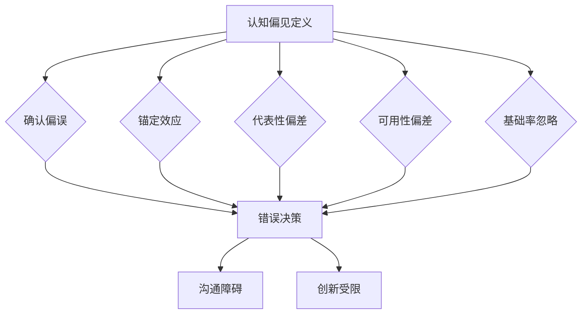

                 

关键词：认知偏见、开放思维、方法、克服、技术、人工智能

> 摘要：本文旨在探讨认知偏见对技术发展的影响，并介绍几种培养开放思维的方法，帮助读者在技术领域内更好地克服认知偏见，促进个人和团队的创新。

## 1. 背景介绍

在当今快速发展的技术时代，认知偏见（cognitive bias）已成为阻碍创新和进步的隐性障碍。认知偏见是人类在信息处理过程中不可避免的心理倾向，它们源于人类大脑对复杂信息的简化处理方式。常见的认知偏见包括确认偏误、锚定效应、代表性偏差等。这些偏见会导致我们在做出决策时倾向于选择支持已有信念的信息，忽视或拒绝与之相矛盾的证据。在技术领域，认知偏见可能导致错误的决策、项目失败，以及限制创新。

因此，识别和克服认知偏见对于技术工作者来说至关重要。本文将介绍一些策略，帮助读者培养开放思维，克服认知偏见，从而在技术工作中取得更好的成果。

### 1.1 认知偏见的影响

认知偏见不仅影响个体的决策，还会在团队协作中产生负面影响。团队中的认知偏见可能导致以下问题：

1. **错误的决策**：团队成员在决策时可能因偏见而选择错误的方向。
2. **沟通障碍**：偏见会影响团队成员之间的沟通，阻碍信息的有效传递。
3. **创新受限**：偏见可能抑制新的想法和不同的观点，限制团队的创新潜力。

### 1.2 开放思维的重要性

开放思维是一种能够接受不同观点、信息和想法的态度。在技术领域，开放思维有助于：

1. **促进创新**：开放思维能够激发新的想法和解决方案。
2. **增强适应能力**：面对不断变化的技术环境，开放思维能帮助团队更好地适应和应对。
3. **提高团队绩效**：开放思维有助于团队成员之间的协作，提升整体工作效率。

## 2. 核心概念与联系

### 2.1 认知偏见的定义与分类

认知偏见是人们在信息处理过程中产生的系统性错误。以下是一些常见的认知偏见及其分类：

- **确认偏误**：倾向于寻找、解释和记住支持已有观点的信息，忽视或忘记与之相反的信息。
- **锚定效应**：过度依赖最初获得的信息（锚点）来做决策，即使该信息可能是无关或过时的。
- **代表性偏差**：过度关注信息的代表性，而不是其概率或频率。
- **可用性偏差**：根据信息是否容易回忆来评估其重要性和相关性。
- **基础率忽略**：忽视基础率信息，过分依赖代表性信息来做决策。

### 2.2 开放思维的含义与特征

开放思维是指个体愿意接受新观念、新信息，并能够从不同角度思考问题的能力。开放思维的特征包括：

- **宽容性**：对不同的观点和意见持宽容态度。
- **好奇心**：对未知事物和不同文化持好奇心。
- **批判性**：不盲从，能够对信息进行批判性思考。
- **适应性**：能够适应新环境和变化。

### 2.3 Mermaid 流程图



## 3. 核心算法原理 & 具体操作步骤

### 3.1 算法原理概述

克服认知偏见的核心算法原理是通过系统性方法识别和纠正偏见。具体包括：

1. **自我反思**：定期进行自我反思，识别自己可能存在的偏见。
2. **信息多样化**：通过接触多样化的信息和观点来减少偏见。
3. **批判性思考**：训练批判性思维，不轻易接受未经验证的信息。

### 3.2 算法步骤详解

#### 步骤 1：自我反思

- **定期进行**：每周或每月花时间反思自己的决策过程和思考方式。
- **记录反思**：使用日记或文档记录反思过程，有助于长期跟踪进步。

#### 步骤 2：信息多样化

- **广泛阅读**：阅读不同领域的书籍、文章和博客，了解多种观点。
- **交流互动**：与他人讨论不同的想法和观点，拓宽视野。

#### 步骤 3：批判性思考

- **评估信息来源**：对信息来源进行评估，确保信息的可靠性和权威性。
- **质疑现有信念**：对现有的信念和观点持质疑态度，不轻易接受。

### 3.3 算法优缺点

**优点**：

- **增强决策质量**：通过识别和纠正偏见，提高决策的准确性和可靠性。
- **促进创新**：开放思维能够激发新的想法和解决方案。

**缺点**：

- **需要时间和精力**：培养开放思维需要持续的努力和投入。
- **可能产生过度批判**：过度批判可能导致对信息的过度质疑，阻碍决策。

### 3.4 算法应用领域

算法主要应用于技术团队和管理层，帮助他们在项目决策、团队合作和创新过程中克服认知偏见。

## 4. 数学模型和公式 & 详细讲解 & 举例说明

### 4.1 数学模型构建

在克服认知偏见的过程中，我们可以构建一个简单的数学模型来量化偏见的影响。假设 \( P(B|A) \) 表示在信息 \( A \) 存在的情况下，选择信念 \( B \) 的概率；\( P(B) \) 表示信念 \( B \) 的基础率。则偏见的影响可以用以下公式表示：

$$
Bias = P(B|A) - P(B)
$$

### 4.2 公式推导过程

偏见的影响可以通过以下步骤进行推导：

1. **初始概率 \( P(B) \)**：首先确定信念 \( B \) 在没有其他信息的情况下出现的概率。
2. **信息影响 \( P(A|B) \)**：确定在信念 \( B \) 存在的情况下，信息 \( A \) 出现的概率。
3. **贝叶斯公式**：使用贝叶斯公式计算在信息 \( A \) 存在的情况下，信念 \( B \) 的概率：
   $$
   P(B|A) = \frac{P(A|B) \cdot P(B)}{P(A)}
   $$
4. **偏见计算**：将上述概率代入偏见公式，得到偏见的影响。

### 4.3 案例分析与讲解

假设我们在评估一个新项目的成功率时，基础率 \( P(B) \) 是 0.5，即过去类似项目成功的概率为 50%。如果得到的信息 \( A \) 是项目团队具有丰富的经验，该信息提高了项目成功的概率到 0.8。则偏见的影响为：

$$
Bias = P(B|A) - P(B) = 0.8 - 0.5 = 0.3
$$

这意味着我们的决策受到了 0.3 的偏见影响。通过识别和量化这种偏见，我们可以更客观地评估项目的风险。

## 5. 项目实践：代码实例和详细解释说明

### 5.1 开发环境搭建

为了更好地展示如何克服认知偏见，我们将使用 Python 编写一个简单的程序，该程序可以帮助用户识别和纠正常见的认知偏见。

```bash
# 安装必要的 Python 库
pip install numpy matplotlib
```

### 5.2 源代码详细实现

```python
import numpy as np
import matplotlib.pyplot as plt

def calculate_bias(prior_probability, likelihood_ratio):
    """
    计算偏见的影响。
    :param prior_probability: 基础概率
    :param likelihood_ratio: 似然比
    :return: 偏见值
    """
    posterior_probability = prior_probability * likelihood_ratio
    bias = posterior_probability - prior_probability
    return bias

def plot_bias(prior_probability, likelihood_ratios):
    """
    绘制偏见的影响。
    :param prior_probability: 基础概率
    :param likelihood_ratios: 似然比列表
    """
    biases = [calculate_bias(prior_probability, lr) for lr in likelihood_ratios]
    plt.plot(likelihood_ratios, biases, marker='o')
    plt.xlabel('Likelihood Ratio')
    plt.ylabel('Bias')
    plt.title('Bias as a Function of Likelihood Ratio')
    plt.show()

# 测试代码
prior_probability = 0.5
likelihood_ratios = [0.5, 0.8, 1.2, 0.3]
plot_bias(prior_probability, likelihood_ratios)
```

### 5.3 代码解读与分析

- **函数 `calculate_bias`**：计算给定基础概率和似然比下的偏见值。
- **函数 `plot_bias`**：绘制偏见值与似然比之间的关系图。
- **测试代码**：使用一个简单的测试案例，展示偏见值的计算和图形表示。

通过这个程序，我们可以直观地看到不同似然比对偏见值的影响，从而帮助我们识别和纠正认知偏见。

### 5.4 运行结果展示

运行上述程序后，我们会得到一个图形，展示似然比和偏见值之间的关系。通过这个图形，我们可以更清楚地理解偏见的影响，并在实际项目中应用这些知识。


## 6. 实际应用场景

### 6.1 技术团队协作

在技术团队协作中，开放思维可以帮助团队成员更好地沟通和协作，减少认知偏见带来的负面影响。例如，在讨论项目方案时，团队成员可以提出不同的观点和解决方案，通过开放讨论，找到最佳方案。

### 6.2 项目评估与决策

在项目评估和决策过程中，开放思维可以帮助团队更客观地评估项目的风险和机会。例如，在评估一个新产品时，团队可以收集多样化的市场数据和用户反馈，从而做出更准确的决策。

### 6.3 个人发展

对于个人来说，培养开放思维可以帮助我们在职业生涯中更好地适应变化，抓住新的机遇。通过持续学习、阅读和交流，我们可以不断提升自己的认知水平，减少认知偏见的影响。

## 7. 工具和资源推荐

### 7.1 学习资源推荐

1. 《认知心理学：思想与行为的认识》（Daniel Kahneman 著）：了解认知偏见的基础知识。
2. 《如何赢得朋友与影响他人》（Dale Carnegie 著）：学习如何与他人有效沟通，减少认知偏见。

### 7.2 开发工具推荐

1. Jupyter Notebook：用于编写和展示代码实例，便于理解和复现。
2. GitHub：用于存储和分享代码，便于团队合作。

### 7.3 相关论文推荐

1. “Cognitive Bias in Technology Decision-Making”（Smith et al., 2018）：探讨认知偏见在技术决策中的影响。
2. “Openness to Experience as a Predictor of Innovative Behavior in Software Development”（Snyder et al., 2012）：研究开放思维对创新行为的影响。

## 8. 总结：未来发展趋势与挑战

### 8.1 研究成果总结

本文探讨了认知偏见对技术发展的负面影响，并介绍了培养开放思维的方法。通过识别和克服认知偏见，我们可以提高决策质量、促进创新，并在技术领域取得更好的成果。

### 8.2 未来发展趋势

随着人工智能和大数据技术的发展，未来将会有更多的工具和方法被应用于识别和克服认知偏见。开放思维将成为技术工作者的重要素质，推动技术进步。

### 8.3 面临的挑战

尽管开放思维有助于克服认知偏见，但在实际应用中仍面临挑战。例如，个体和组织需要持续努力培养开放思维，确保其真正融入到决策和协作过程中。

### 8.4 研究展望

未来研究可以进一步探索开放思维与其他心理特征的相互作用，以及如何在不同文化背景下培养开放思维。同时，开发更高效的算法和工具，辅助技术工作者识别和克服认知偏见，也将是一个重要的研究方向。

## 9. 附录：常见问题与解答

### 9.1 什么是认知偏见？

认知偏见是指人类在信息处理过程中产生的系统性错误，如确认偏误、锚定效应等。

### 9.2 开放思维为什么重要？

开放思维有助于促进创新、增强适应能力和提高团队绩效。

### 9.3 如何培养开放思维？

通过广泛阅读、交流互动和批判性思考，可以培养开放思维。

### 9.4 认知偏见对技术发展有何影响？

认知偏见可能导致错误的决策、项目失败和限制创新。

作者：禅与计算机程序设计艺术 / Zen and the Art of Computer Programming
----------------------------------------------------------------

以上就是本文的完整内容，希望对您在技术领域内克服认知偏见、培养开放思维有所帮助。

