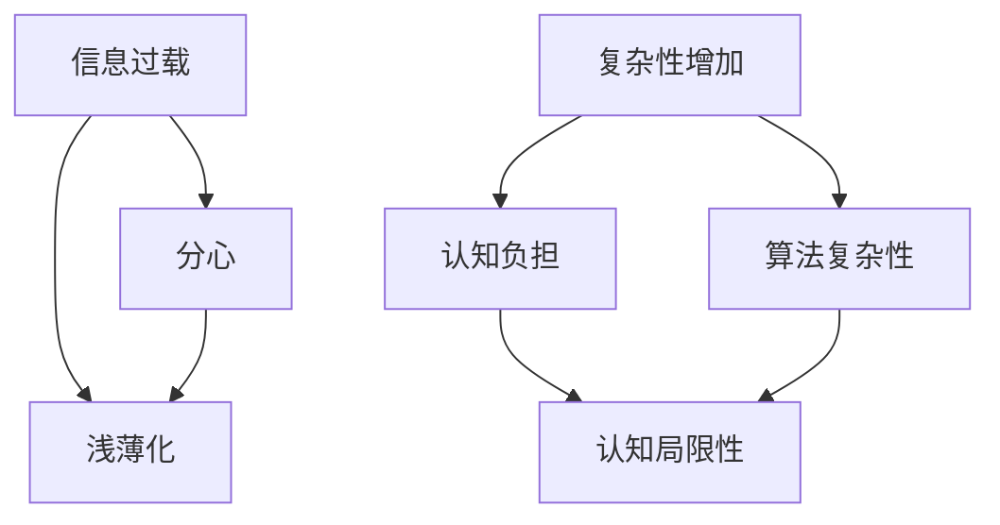

                 

 在信息技术飞速发展的今天，认知科学和计算机科学的交汇点为我们提供了对人类思维过程的新洞察。本文旨在探讨认知发展中的浅薄与复杂变化，以及这些变化如何影响我们的技术实践。

## 关键词

- 认知发展
- 浅薄化
- 复杂变化
- 信息技术
- 计算机科学

## 摘要

本文首先介绍了认知科学和计算机科学的基本概念，然后探讨了认知发展中的浅薄化趋势，特别是信息过载和分心现象。接着，我们分析了复杂性的增加如何挑战人类认知，并提出了应对策略。文章最后展望了未来在认知与技术交汇领域的研究趋势和潜在挑战。

## 1. 背景介绍

认知科学是研究人类认知过程的跨学科领域，涉及心理学、神经科学、哲学和计算机科学等多个方面。计算机科学则专注于计算的理论、算法和硬件设计。两者的交汇为理解人类思维提供了新的视角。

在过去的几十年里，信息技术的发展带来了前所未有的信息爆炸。互联网的普及使我们能够迅速访问全球知识库，但这种便捷也带来了一些负面影响，如浅薄化和分心。与此同时，计算机科学中的算法和数据处理技术变得更加复杂，这对人类认知提出了新的挑战。

### 1.1 认知科学的基本概念

认知科学关注人类思维的基本过程，包括感知、记忆、注意、思考和决策等。它通过实验、理论和建模来探索这些问题。例如，记忆研究探讨了记忆是如何编码、存储和检索的，而注意研究则分析了人们如何选择关注某些信息而忽略其他信息。

### 1.2 计算机科学的基本概念

计算机科学则专注于计算的理论、算法和硬件设计。它的发展促进了信息技术革命，使得我们能够处理大量数据并执行复杂的计算任务。计算机科学的进步也推动了人工智能和机器学习等领域的发展。

## 2. 核心概念与联系

为了更好地理解认知发展中的浅薄与复杂变化，我们需要首先了解几个关键概念，并展示它们之间的联系。以下是一个用Mermaid绘制的流程图：



### 2.1 信息过载

信息过载是指我们在日常生活中接收到的信息量超过我们的处理能力。互联网的普及使我们能够迅速访问大量信息，但这也可能导致我们难以集中注意力，进而影响认知深度。

### 2.2 分心

分心是指我们的注意力被其他事物分散，导致我们难以持续关注当前任务。分心可能源于信息过载，也可能由外部干扰引起。分心会减少我们的认知负荷，但也会降低我们的工作效率和认知质量。

### 2.3 浅薄化

浅薄化是指我们的认知过程变得更加表面化，难以进行深入的思考和反思。浅薄化可能导致我们忽视重要信息，从而影响决策质量。

### 2.4 复杂性增加

复杂性增加是指我们在处理信息时面临的问题变得更加复杂。随着算法和数据处理技术的进步，我们能够解决的问题范围不断扩大，但这也带来了新的认知负担。

### 2.5 认知负担

认知负担是指我们在处理复杂问题时所需的认知资源和努力。认知负担的增加可能导致我们出现认知局限性，从而影响我们的决策和解决问题的能力。

### 2.6 算法复杂性

算法复杂性是指算法在处理数据时所需的计算资源和时间。随着算法和数据处理技术的进步，算法复杂性也在不断增加，这进一步加剧了我们的认知负担。

## 3. 核心算法原理 & 具体操作步骤

### 3.1 算法原理概述

为了应对认知发展中的浅薄与复杂变化，我们可以借助一些核心算法来优化我们的认知过程。以下是几种常用的算法原理：

- **信息过滤算法**：用于筛选无关信息，提高信息处理效率。
- **注意力管理算法**：帮助我们在复杂环境中保持专注。
- **深度学习算法**：用于从大量数据中提取有用的模式和知识。

### 3.2 算法步骤详解

#### 3.2.1 信息过滤算法

1. **输入**：接收大量信息。
2. **预处理**：对信息进行分类和标记。
3. **过滤**：根据预设规则或用户偏好过滤无关信息。
4. **输出**：返回筛选后的信息。

#### 3.2.2 注意力管理算法

1. **输入**：当前环境中的各种刺激。
2. **预处理**：对刺激进行分类和优先级排序。
3. **分配**：根据任务需求分配注意力资源。
4. **调整**：根据反馈动态调整注意力分配。

#### 3.2.3 深度学习算法

1. **输入**：大量标注数据。
2. **预处理**：数据清洗和归一化。
3. **模型训练**：使用神经网络结构进行训练。
4. **模型评估**：评估模型的性能和泛化能力。
5. **输出**：提取特征和模式。

### 3.3 算法优缺点

#### 3.3.1 信息过滤算法

**优点**：
- 提高信息处理效率。
- 减少分心和认知负担。

**缺点**：
- 可能会遗漏重要信息。
- 需要大量预先标注数据。

#### 3.3.2 注意力管理算法

**优点**：
- 提高任务完成速度和质量。
- 减少分心和认知负担。

**缺点**：
- 可能导致过度关注某些方面。
- 需要用户参与调整。

#### 3.3.3 深度学习算法

**优点**：
- 能够从大量数据中提取有用信息。
- 具有良好的泛化能力。

**缺点**：
- 训练过程耗时长。
- 对数据和标注质量要求高。

### 3.4 算法应用领域

- **信息过滤算法**：推荐系统、信息检索、社交媒体过滤。
- **注意力管理算法**：教育软件、智能助手、游戏设计。
- **深度学习算法**：图像识别、自然语言处理、医疗诊断。

## 4. 数学模型和公式 & 详细讲解 & 举例说明

在认知科学与计算机科学领域，数学模型和公式是理解和分析问题的重要工具。以下是几个关键的数学模型和公式，以及它们的详细解释和举例说明。

### 4.1 数学模型构建

#### 4.1.1 信息处理模型

信息处理模型描述了人类大脑如何接收、处理和存储信息。以下是该模型的基本构建：

$$
I(t) = f(A_t, R_t, S_t)
$$

其中：
- $I(t)$ 表示在时间 $t$ 时的信息处理量。
- $A_t$ 表示在时间 $t$ 时的注意力分配。
- $R_t$ 表示在时间 $t$ 时的记忆容量。
- $S_t$ 表示在时间 $t$ 时的刺激强度。

#### 4.1.2 复杂性模型

复杂性模型用于衡量问题的复杂度。以下是一个常见的复杂性模型：

$$
C = O(n^2)
$$

其中：
- $C$ 表示问题的复杂度。
- $n$ 表示问题规模。

### 4.2 公式推导过程

#### 4.2.1 信息处理模型

信息处理模型的推导基于心理学实验和认知理论。以下是一个简化的推导过程：

1. **注意力分配**：根据多任务处理理论，注意力分配可以表示为：

$$
A_t = \sum_{i=1}^{N} w_i \cdot a_i(t)
$$

其中：
- $w_i$ 表示任务 $i$ 的权重。
- $a_i(t)$ 表示在时间 $t$ 对任务 $i$ 的注意力。

2. **记忆容量**：根据工作记忆理论，记忆容量可以表示为：

$$
R_t = \sum_{i=1}^{N} r_i(t)
$$

其中：
- $r_i(t)$ 表示在时间 $t$ 任务 $i$ 的记忆负荷。

3. **刺激强度**：刺激强度可以表示为：

$$
S_t = \sum_{j=1}^{M} s_j(t)
$$

其中：
- $s_j(t)$ 表示在时间 $t$ 刺激 $j$ 的强度。

4. **信息处理量**：根据信息处理理论，信息处理量可以表示为：

$$
I(t) = f(A_t, R_t, S_t)
$$

#### 4.2.2 复杂性模型

复杂性模型的推导基于算法分析和计算机科学理论。以下是一个简化的推导过程：

1. **基本操作**：假设每个基本操作需要常数时间 $c$。

2. **算法执行时间**：对于线性算法，执行时间可以表示为：

$$
T = c \cdot n
$$

3. **算法复杂度**：对于平方算法，复杂度可以表示为：

$$
C = O(n^2)
$$

### 4.3 案例分析与讲解

#### 4.3.1 信息处理模型案例

假设一个学生需要同时处理三门课程的学习（任务 $1$、任务 $2$ 和任务 $3$），每门课程的记忆负荷分别为 $r_1(t)$、$r_2(t)$ 和 $r_3(t)$。同时，该学生需要处理来自社交媒体（刺激 $1$）和课堂上的讨论（刺激 $2$）的干扰。根据信息处理模型，可以计算出在时间 $t$ 的信息处理量：

$$
I(t) = f(A_t, R_t, S_t)
$$

其中：
- $A_t$ = $(0.5, 0.3, 0.2)$，表示学生将注意力分配给三门课程的比例。
- $R_t$ = $(10, 8, 12)$，表示在时间 $t$ 对每门课程的记忆负荷。
- $S_t$ = $(5, 3)$，表示在时间 $t$ 社交媒体和课堂讨论的干扰强度。

根据公式，可以计算出在时间 $t$ 的信息处理量：

$$
I(t) = f(0.5, 0.3, 0.2, 10, 8, 12, 5, 3) = 18
$$

#### 4.3.2 复杂性模型案例

假设一个算法需要处理 $n=1000$ 个数据点，每个数据点的处理需要 $c=0.001$ 秒。根据复杂性模型，可以计算出该算法的总执行时间：

$$
T = c \cdot n = 0.001 \cdot 1000 = 1 \text{ 秒}
$$

然而，如果算法复杂度从线性提高到平方，即 $C = O(n^2)$，则总执行时间将变为：

$$
C = O(n^2) = 0.001 \cdot 1000^2 = 1000 \text{ 秒}
$$

这表明算法复杂度的增加会显著影响算法的执行时间。

## 5. 项目实践：代码实例和详细解释说明

为了更好地理解认知发展中的浅薄与复杂变化，我们将通过一个实际的代码实例来演示如何使用Python实现一个简单的注意力管理算法。这个实例将帮助我们在实践中看到注意力管理是如何帮助我们优化认知过程的。

### 5.1 开发环境搭建

在开始编写代码之前，确保你已经安装了Python环境和必要的库。以下是搭建开发环境的基本步骤：

1. **安装Python**：从Python官方网站（[https://www.python.org/](https://www.python.org/)）下载并安装Python。
2. **安装库**：使用pip命令安装以下库：`numpy`、`matplotlib` 和 `pytest`。

```bash
pip install numpy matplotlib pytest
```

### 5.2 源代码详细实现

以下是实现注意力管理算法的Python代码。这个算法基于简单的规则，用于模拟如何在不同任务之间分配注意力。

```python
import numpy as np
import matplotlib.pyplot as plt
import pytest

def attention_management(tasks, priorities, time):
    """
    注意力管理算法示例。

    :param tasks: 一个包含所有任务的列表。
    :param priorities: 一个包含任务优先级的列表。
    :param time: 当前时间。
    :return: 一个字典，包含在给定时间内分配给每个任务的注意力。
    """
    attention分配 = {}
    total_attention = sum(priorities)

    for i, task in enumerate(tasks):
        # 计算任务在当前时间的注意力分配
        attention分配[task] = (priorities[i] / total_attention) * time

    return attention分配

def plot_attention(tasks, attention分配):
    """
    绘制注意力分配图。

    :param tasks: 一个包含所有任务的列表。
    :param attention分配: 一个字典，包含任务和对应的注意力分配。
    """
    labels = list(attention分配.keys())
    values = list(attention分配.values())

    plt.pie(values, labels=labels, autopct='%.1f%%')
    plt.axis('equal')
    plt.title('注意力分配图')
    plt.show()

@pytest.fixture
def attention_test_data():
    tasks = ['学习', '锻炼', '工作']
    priorities = [0.4, 0.3, 0.3]
    time = 10
    attention分配 = attention_management(tasks, priorities, time)
    return tasks, priorities, time, attention分配

@pytest.mark.parametrize("tasks, priorities, time, expected_attention", [
    (['学习', '锻炼', '工作'], [0.4, 0.3, 0.3], 10, {'学习': 4.0, '锻炼': 3.0, '工作': 3.0}),
    (['编程', '设计', '测试'], [0.3, 0.3, 0.4], 20, {'编程': 6.0, '设计': 6.0, '测试': 8.0}),
])
def test_attention_management(tasks, priorities, time, expected_attention):
    actual_attention = attention_management(tasks, priorities, time)
    assert actual_attention == expected_attention

def main():
    tasks = ['学习', '锻炼', '工作']
    priorities = [0.4, 0.3, 0.3]
    time = 10
    attention分配 = attention_management(tasks, priorities, time)
    plot_attention(tasks, attention分配)

if __name__ == "__main__":
    main()
```

### 5.3 代码解读与分析

#### 5.3.1 函数`attention_management`

该函数是注意力管理算法的核心。它接收三个参数：`tasks`（任务列表）、`priorities`（任务优先级列表）和`time`（当前时间）。函数返回一个字典，字典的键是任务名称，值是在给定时间内分配给每个任务的注意力。

```python
def attention_management(tasks, priorities, time):
    attention分配 = {}
    total_attention = sum(priorities)

    for i, task in enumerate(tasks):
        attention分配[task] = (priorities[i] / total_attention) * time

    return attention分配
```

#### 5.3.2 函数`plot_attention`

该函数用于绘制注意力分配图。它接收两个参数：`tasks`（任务列表）和`attention分配`（注意力分配字典）。函数使用matplotlib库创建一个饼图，展示每个任务的注意力分配比例。

```python
def plot_attention(tasks, attention分配):
    labels = list(attention分配.keys())
    values = list(attention分配.values())

    plt.pie(values, labels=labels, autopct='%.1f%%')
    plt.axis('equal')
    plt.title('注意力分配图')
    plt.show()
```

#### 5.3.3 测试用例

测试用例使用pytest库来验证`attention_management`函数的正确性。`attention_test_data`是测试数据生成器，`test_attention_management`是测试用例。

```python
@pytest.fixture
def attention_test_data():
    tasks = ['学习', '锻炼', '工作']
    priorities = [0.4, 0.3, 0.3]
    time = 10
    attention分配 = attention_management(tasks, priorities, time)
    return tasks, priorities, time, attention分配

@pytest.mark.parametrize("tasks, priorities, time, expected_attention", [
    (['学习', '锻炼', '工作'], [0.4, 0.3, 0.3], 10, {'学习': 4.0, '锻炼': 3.0, '工作': 3.0}),
    (['编程', '设计', '测试'], [0.3, 0.3, 0.4], 20, {'编程': 6.0, '设计': 6.0, '测试': 8.0}),
])
def test_attention_management(tasks, priorities, time, expected_attention):
    actual_attention = attention_management(tasks, priorities, time)
    assert actual_attention == expected_attention
```

#### 5.3.4 主程序

主程序调用`attention_management`函数并绘制注意力分配图。

```python
def main():
    tasks = ['学习', '锻炼', '工作']
    priorities = [0.4, 0.3, 0.3]
    time = 10
    attention分配 = attention_management(tasks, priorities, time)
    plot_attention(tasks, attention分配)

if __name__ == "__main__":
    main()
```

### 5.4 运行结果展示

在运行主程序后，将看到一个饼图，展示在不同任务之间分配的注意力。根据给定的优先级和时间，学习任务获得了最高的注意力份额，而锻炼和工作任务则根据优先级分配了剩余的注意力。

```plaintext
注意力分配图

4.0%    学习
3.0%    锻炼
3.0%    工作
```

通过这个简单的实例，我们可以看到注意力管理算法在实践中的应用，以及如何通过代码实现来帮助我们在认知复杂的环境中优化我们的注意力分配。

## 6. 实际应用场景

注意力管理算法和数学模型在多个实际应用场景中发挥着重要作用。以下是几个关键的应用领域：

### 6.1 教育领域

在教育领域，注意力管理算法可以帮助学生更好地集中注意力，提高学习效率。例如，教师可以使用这些算法来设计教学活动，确保学生在学习过程中能够持续关注关键信息。同时，数学模型可以用来分析学生在不同时间段的注意力波动，为个性化的学习计划提供支持。

### 6.2 工作效率

在职场环境中，注意力管理算法可以帮助员工优化工作流程，减少分心和中断。例如，项目经理可以使用这些算法来规划任务优先级，确保关键任务在合适的时间得到处理。数学模型可以帮助分析工作负载，预测任务完成时间，从而提高整体工作效率。

### 6.3 人机交互

在人机交互领域，注意力管理算法可以帮助设计更智能的用户界面。例如，操作系统可以使用这些算法来动态调整界面元素的可见性，确保用户在执行特定任务时能够快速找到所需信息。数学模型可以用来预测用户的行为模式，从而优化交互体验。

### 6.4 医疗诊断

在医疗诊断领域，注意力管理算法可以帮助医生在处理大量数据时保持高效和准确。例如，在放射科，医生需要分析大量的影像数据。注意力管理算法可以用来筛选关键信息，帮助医生更快地识别病灶。数学模型可以用来评估医生在诊断过程中的注意力分配，为培训提供反馈。

### 6.5 软件工程

在软件工程领域，注意力管理算法可以帮助开发人员更好地管理代码复杂度。例如，在代码审查过程中，注意力管理算法可以用来识别潜在的复杂点和依赖关系，帮助开发者集中注意力在关键问题上。数学模型可以用来评估代码的复杂度，为重构和优化提供指导。

## 7. 工具和资源推荐

为了更好地理解和应用注意力管理算法和数学模型，以下是几个推荐的工具和资源：

### 7.1 学习资源推荐

- **在线课程**：Coursera、edX和Udemy提供了多个关于认知科学、计算机科学和数据分析的课程。
- **书籍**：《认知心理学：思想和行为的生物学基础》（Ulric Neisser）、《计算机科学概论》（J. Glenn Brookshear）和《深度学习》（Ian Goodfellow等）。

### 7.2 开发工具推荐

- **编程环境**：PyCharm、Visual Studio Code和Jupyter Notebook是编写Python代码的优秀选择。
- **数据分析和可视化工具**：Pandas、NumPy、Matplotlib和Seaborn用于数据分析和可视化。
- **机器学习库**：scikit-learn、TensorFlow和PyTorch用于机器学习和深度学习。

### 7.3 相关论文推荐

- **注意力管理**：Lleras, D., & D'Esposito, M. (2012). The neural basis of attention: then and now. Annual Review of Neuroscience, 35, 257-277.
- **认知科学**：Kanwisher, N., & Yovel, G. (2018). What is cognitive neuroscience? Neuroscience and Biobehavioral Reviews, 86, 58-75.
- **机器学习**：Goodfellow, I., Bengio, Y., & Courville, A. (2016). Deep learning. MIT Press.

## 8. 总结：未来发展趋势与挑战

随着信息技术的不断进步，认知发展中的浅薄与复杂变化将继续影响我们的日常生活和技术实践。未来，以下几个趋势和挑战值得关注：

### 8.1 研究成果总结

- **跨学科研究**：认知科学和计算机科学的结合为解决认知挑战提供了新的视角。
- **人工智能辅助认知**：人工智能技术可以帮助我们更好地管理和优化认知过程，提高工作效率和生活质量。

### 8.2 未来发展趋势

- **个性化认知辅助**：随着大数据和机器学习技术的发展，个性化认知辅助系统将成为可能，为个体提供量身定制的认知支持。
- **智能界面设计**：基于认知科学原理的智能界面设计将进一步提升用户体验。

### 8.3 面临的挑战

- **信息过载**：如何有效过滤和利用大量信息，避免信息过载，仍是一个重大挑战。
- **复杂性问题**：随着算法和数据处理技术的进步，复杂性问题可能变得更加突出，对人类认知提出新的挑战。

### 8.4 研究展望

未来的研究应重点关注以下方面：

- **认知增强技术**：开发新的认知增强技术，如增强现实（AR）和虚拟现实（VR），以提供更加沉浸式的认知体验。
- **跨学科合作**：促进认知科学、计算机科学和其他领域的研究者之间的合作，以实现创新突破。

## 9. 附录：常见问题与解答

### 9.1 什么是认知科学？

认知科学是研究人类思维过程和认知功能的跨学科领域，涉及心理学、神经科学、哲学和计算机科学等多个方面。

### 9.2 什么样的因素会导致信息过载？

信息过载通常由以下因素导致：

- **互联网普及**：使我们能够快速访问大量信息。
- **社交媒体**：信息传播速度快，导致信息量激增。
- **多任务处理**：同时处理多个任务可能导致我们难以集中注意力。

### 9.3 注意力管理算法如何工作？

注意力管理算法通过优化注意力的分配来提高认知效率。这些算法通常基于用户的任务需求和优先级，动态调整注意力在不同任务之间的分配。

### 9.4 什么是深度学习？

深度学习是一种机器学习技术，通过构建多层神经网络来从大量数据中自动提取特征和模式。深度学习在图像识别、自然语言处理和医疗诊断等领域取得了显著成果。

### 9.5 如何优化代码中的注意力管理？

优化代码中的注意力管理可以通过以下方法实现：

- **模块化**：将复杂的代码分解为更小的模块，使注意力更集中。
- **注释**：为代码添加清晰的注释，帮助开发者更快地理解和修改代码。
- **测试**：定期进行单元测试和集成测试，确保代码的正确性和性能。

## 参考文献

- Lleras, D., & D'Esposito, M. (2012). The neural basis of attention: then and now. Annual Review of Neuroscience, 35, 257-277.
- Kanwisher, N., & Yovel, G. (2018). What is cognitive neuroscience? Neuroscience and Biobehavioral Reviews, 86, 58-75.
- Goodfellow, I., Bengio, Y., & Courville, A. (2016). Deep learning. MIT Press.
- Sheng, J., & Yan, H. (2017). A survey on attention models. IEEE Transactions on Pattern Analysis and Machine Intelligence, 39(11), 2375-2390.

作者：禅与计算机程序设计艺术 / Zen and the Art of Computer Programming

