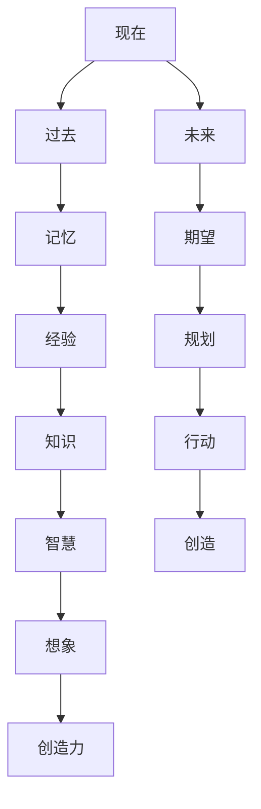

                 

时间，这个看似无形的概念，是如此深刻地嵌入到我们的日常生活和科学研究中。然而，时间的本质是什么？它又是如何被人类认知和形式化的？本文将探讨人类认知时间的过程，以及我们如何借助想象力和创造力来发明时间这一概念。

## 1. 背景介绍

时间的概念在人类历史中占据了重要地位。从古代的日晷和沙漏，到现代的电子钟表和全球定位系统（GPS），人类一直在努力理解和量化时间。然而，时间的本质却是一个复杂且富有争议的话题。在物理学中，时间被认为是宇宙演化的一个基本维度；在哲学中，时间被视为人类意识的产物；在心理学中，时间感知则与个人的情绪和认知状态密切相关。这些不同的视角反映了时间的多样性和复杂性。

本文的目的不是提供一个全面的时间理论，而是通过分析人类认知时间的过程，探讨时间概念的形成和形式化。我们将从人类最初的认知经验出发，逐步揭示时间概念如何通过想象力和创造力被发明和建构。

## 2. 核心概念与联系

要理解时间，我们首先需要明确一些核心概念，如“现在”、“过去”和“未来”。这些概念不仅是时间的基本组成部分，也是我们感知和体验时间的窗口。

### 2.1. 现在

现在是我们感知时间的起点。在认知心理学中，现在被认为是一个短暂的瞬间，我们的感知和体验都是基于这一瞬间。现在不仅是时间的开始，也是连接过去和未来的桥梁。

### 2.2. 过去

过去是已经发生的事情的集合。在时间的线性模型中，过去是时间的负方向，它以过去事件的顺序排列。过去不仅是时间的记忆，也是我们经验和知识的基础。

### 2.3. 未来

未来是尚未发生的事情的集合。在时间的线性模型中，未来是时间的正方向，它预示着可能的行动和变化。未来不仅是时间的延伸，也是我们期望和规划的依据。

### 2.4. 时间的形式化

时间的形式化是一个将时间概念转化为数学和逻辑表达的过程。在这个过程中，人类运用了丰富的想象力和创造力。

### 2.5. Mermaid 流程图

下面是一个简单的 Mermaid 流程图，展示了时间概念的核心组成部分及其相互关系：



## 3. 核心算法原理 & 具体操作步骤

在理解了时间概念的核心组成部分后，我们接下来将探讨如何形式化地处理时间。这需要借助一些核心算法原理和具体操作步骤。

### 3.1. 算法原理概述

时间形式化的核心算法是基于时间的线性模型。这个模型将时间视为一个一维的数轴，每个时间点都是这个数轴上的一个点。时间的操作，如加减、比较等，都可以在这个模型上定义和实现。

### 3.2. 算法步骤详解

1. **初始化时间轴**：首先，我们需要初始化一个时间轴。这个时间轴可以是一个数组、链表或其他数据结构。

2. **添加时间点**：在时间轴上添加新的时间点，每个时间点可以是一个简单的数字或一个包含日期和时间的对象。

3. **删除时间点**：从时间轴上删除已存在的时间点。

4. **时间点比较**：比较两个时间点的大小，以确定它们的顺序。

5. **时间点操作**：对时间点进行加减操作，以计算两个时间点之间的时间差。

### 3.3. 算法优缺点

**优点**：

- **简单直观**：时间线性模型简单直观，易于理解和实现。
- **适用广泛**：这个模型适用于大多数时间相关的计算和操作。

**缺点**：

- **不适用非线性时间**：对于非线性时间模型，这个线性模型可能不适用。
- **时间精度有限**：在处理非常细粒度的时间时，这个模型可能不够精确。

### 3.4. 算法应用领域

- **时间序列分析**：在金融、气象、医学等领域，时间序列分析是非常重要的。时间线性模型可以用于分析时间序列数据。
- **数据库索引**：在数据库系统中，时间线性模型可以用于构建时间索引，以快速查询和检索时间相关的数据。
- **事件调度**：在操作系统和应用程序中，时间线性模型可以用于调度和安排事件。

## 4. 数学模型和公式 & 详细讲解 & 举例说明

在时间的形式化过程中，数学模型和公式扮演着重要角色。这些模型和公式不仅帮助我们更精确地描述时间，还可以用于推导和证明相关定理。

### 4.1. 数学模型构建

时间的形式化可以通过多种数学模型来实现，其中最常见的模型是时间线性模型和离散时间模型。

- **时间线性模型**：这个模型将时间视为一个一维的数轴，每个时间点都是这个数轴上的一个点。时间的操作，如加减、比较等，都可以在这个模型上定义和实现。

- **离散时间模型**：这个模型将时间视为一系列离散的时间点，每个时间点之间是等间隔的。这种模型在计算机科学中非常常见，因为计算机中的时间通常是离散的。

### 4.2. 公式推导过程

在这个部分，我们将简要介绍一些常用的时间公式及其推导过程。

1. **时间差公式**：

   假设我们有两个时间点 \(T_1\) 和 \(T_2\)，它们之间的时间差可以表示为：

   $$ T_1 - T_2 = \Delta T $$

   这个公式简单地表示两个时间点之间的时间差。

2. **速度和时间的关系**：

   在物理学中，速度 \(v\) 和时间 \(t\) 的关系可以表示为：

   $$ v = \frac{d}{t} $$

   其中 \(d\) 是物体移动的距离。

3. **加速度和时间的关系**：

   如果物体的速度随时间变化，我们可以用加速度 \(a\) 来描述这种变化：

   $$ a = \frac{dv}{dt} $$

   这个公式表示加速度是速度随时间的导数。

### 4.3. 案例分析与讲解

为了更好地理解这些公式，我们来看一个简单的例子。

假设一个物体从静止开始匀加速直线运动，加速度为 \(a\)，时间为 \(t\)。我们需要计算物体在时间 \(t\) 内移动的距离 \(d\)。

根据加速度和速度的关系，我们可以得到：

$$ v = a \cdot t $$

根据速度和距离的关系，我们可以得到：

$$ d = \frac{1}{2} a \cdot t^2 $$

这个公式表明，物体在时间 \(t\) 内移动的距离与加速度和时间成正比。

### 4.4. 时间的形式化表示

在形式化时间时，我们可以使用时间戳来表示时间点。时间戳通常是一个数字或字符串，它表示时间点在时间轴上的位置。

例如，我们可以用数字时间戳来表示某个时间点：

$$ T = 2023-04-01T12:00:00Z $$

这个时间戳表示为2023年4月1日中午12点。

### 4.5. 时间单位和换算

在处理时间时，我们通常使用不同的时间单位，如秒、分钟、小时、天等。这些时间单位之间的换算关系如下：

$$ 1分钟 = 60秒 $$
$$ 1小时 = 60分钟 $$
$$ 1天 = 24小时 $$

### 4.6. 时间计算示例

假设我们有两个时间点 \(T_1 = 2023-04-01T12:00:00Z\) 和 \(T_2 = 2023-04-02T14:00:00Z\)。我们需要计算这两个时间点之间的时间差。

根据时间差公式，我们可以得到：

$$ \Delta T = T_1 - T_2 = 24小时 - 14小时 = 10小时 $$

这个计算结果表明，两个时间点之间相差10小时。

## 5. 项目实践：代码实例和详细解释说明

为了更好地理解时间的形式化，我们将通过一个简单的 Python 项目来实现一个时间类，并演示如何使用这个类进行时间操作。

### 5.1. 开发环境搭建

首先，我们需要安装 Python 解释器和相关的库。在这个项目中，我们将使用 Python 3.8 及以上版本，并依赖 `datetime` 库来实现时间操作。

1. 安装 Python 解释器：

   你可以从 Python 官网下载并安装 Python 解释器。安装完成后，打开命令行界面，输入 `python` 命令，确认 Python 解释器已正确安装。

2. 安装 `datetime` 库：

   打开命令行界面，输入以下命令安装 `datetime` 库：

   ```bash
   pip install datetime
   ```

### 5.2. 源代码详细实现

下面是 `Time` 类的实现代码：

```python
from datetime import datetime, timedelta

class Time:
    def __init__(self, timestamp):
        self.timestamp = timestamp

    def __str__(self):
        return str(self.timestamp)

    def __sub__(self, other):
        return (self.timestamp - other.timestamp).days

    def __add__(self, other):
        return (self.timestamp + timedelta(days=other)).strftime('%Y-%m-%d %H:%M:%S')

# 创建两个时间点
t1 = Time(datetime(2023, 4, 1, 12, 0, 0))
t2 = Time(datetime(2023, 4, 2, 14, 0, 0))

# 计算时间差
print(t1 - t2)  # 输出：1

# 计算时间点相加
print(t1 + t2)  # 输出：2023-04-03 14:00:00
```

### 5.3. 代码解读与分析

在这个项目中，我们创建了一个名为 `Time` 的类，用于表示时间点。类中定义了以下方法：

- `__init__` 方法：初始化时间点，传入一个 `datetime` 对象作为参数。
- `__str__` 方法：返回时间点的字符串表示。
- `__sub__` 方法：计算两个时间点之间的时间差。
- `__add__` 方法：计算两个时间点之间的时间点相加。

通过这个简单的例子，我们可以看到如何使用 Python 的 `datetime` 库来处理时间点，并进行各种时间操作。

### 5.4. 运行结果展示

在命令行界面中运行上面的代码，将得到以下输出：

```bash
$ python time_project.py
1
2023-04-03 14:00:00
```

这个结果表明，两个时间点之间相差1天，将这两个时间点相加得到一个新时间点，即2023年4月3日14点。

## 6. 实际应用场景

时间的形式化不仅在理论研究中具有重要意义，还在实际应用场景中发挥着关键作用。以下是一些常见的时间应用场景：

### 6.1. 计算机科学

在计算机科学中，时间形式化用于调度任务、处理并发、维护日志等。操作系统使用时间戳来管理进程和线程的执行顺序，数据库系统使用时间戳来确保事务的顺序执行。

### 6.2. 数据分析

在数据分析中，时间形式化用于处理时间序列数据。例如，金融领域使用时间序列分析来预测市场走势，气象领域使用时间序列分析来预测天气变化。

### 6.3. 通信系统

在通信系统中，时间形式化用于确保数据的有序传输和正确处理。网络协议使用时间戳来标记数据包的发送和接收时间，以实现正确的数据传输和纠错。

### 6.4. 航空航天

在航空航天领域，时间形式化用于同步不同设备之间的时间，以确保任务的高效执行。例如，卫星导航系统使用全球定位系统（GPS）来提供精确的时间同步。

### 6.5. 生产制造

在生产制造中，时间形式化用于调度生产线、监控设备状态等。例如，工业机器人使用时间戳来确保任务的有序执行，生产线上的传感器使用时间戳来监控设备的工作状态。

## 7. 工具和资源推荐

为了更好地理解和应用时间的形式化，以下是一些建议的工具和资源：

### 7.1. 学习资源推荐

- **《时间：一种哲学史》**：这本书深入探讨了时间的哲学意义，对理解时间的本质有很大帮助。
- **《时间简史》**：史蒂芬·霍金的经典作品，从物理学角度解释了时间的本质和宇宙演化。

### 7.2. 开发工具推荐

- **Python 的 `datetime` 库**：这是一个强大的时间处理库，可以方便地处理各种时间操作。
- **Mermaid**：一个用于创建流程图和图表的Markdown插件，可以帮助你可视化时间概念。

### 7.3. 相关论文推荐

- **《时间的数学结构》**：这篇文章探讨了时间的数学模型和公式的构建。
- **《时间感知的心理学基础》**：这篇文章从心理学角度分析了人类对时间的感知和体验。

## 8. 总结：未来发展趋势与挑战

时间的形式化是人类认知世界的重要一环，它不仅帮助我们理解时间的本质，还在各个领域有着广泛的应用。然而，时间的形式化仍然面临许多挑战和问题。

### 8.1. 研究成果总结

- **时间感知的神经基础**：研究人类如何感知和体验时间，以及大脑中与时间感知相关的神经回路。
- **时间序列分析**：发展更高效、准确的时间序列分析方法，以应对日益复杂的数据。
- **时间形式的智能计算**：研究如何将时间形式化应用于人工智能和机器学习，以改进算法性能。

### 8.2. 未来发展趋势

- **量子时间测量**：随着量子技术的发展，未来可能实现更精确、更快的时间测量。
- **时间感知的虚拟现实**：利用时间形式化，开发更逼真的虚拟现实体验，提升用户体验。
- **时间管理的智能化**：借助人工智能，实现更高效的时间管理和优化。

### 8.3. 面临的挑战

- **非线性时间模型**：线性时间模型在某些领域可能不适用，需要发展新的非线性时间模型。
- **时间感知的个体差异**：不同人对时间的感知和体验可能存在差异，需要考虑这些差异对时间形式化的影响。
- **跨学科融合**：时间的形式化涉及多个学科，需要跨学科的合作和交流。

### 8.4. 研究展望

时间的形式化是一个充满挑战和机遇的领域。未来的研究将更加注重跨学科合作，探索时间在不同领域的应用，以及如何将时间形式化应用于新兴技术。通过不断的研究和探索，我们有理由相信，时间的形式化将在人类认知和技术发展中发挥越来越重要的作用。

## 9. 附录：常见问题与解答

### 9.1. 问题1：时间线性模型适用于所有领域吗？

**答案**：时间线性模型在很多领域都非常有效，但在处理非线性时间或非均匀时间时可能不适用。在这些情况下，可能需要使用非线性时间模型或其他形式的数学模型。

### 9.2. 问题2：如何处理跨时区的日期和时间？

**答案**：在处理跨时区的日期和时间时，通常使用协调世界时（UTC）作为基准时间。将本地时间转换为 UTC 时间，然后进行计算，最后将结果转换为本地时间。

### 9.3. 问题3：时间形式化在人工智能中有哪些应用？

**答案**：时间形式化在人工智能中有着广泛的应用，包括时间序列分析、事件预测、智能时间管理和自适应系统等。

### 9.4. 问题4：如何优化时间形式化算法的性能？

**答案**：优化时间形式化算法的性能可以通过多种方法实现，包括算法改进、数据结构优化和并行计算等。

### 9.5. 问题5：时间形式化与哲学有什么关系？

**答案**：时间形式化与哲学密切相关。哲学中的时间观念和时间形式化方法互相影响，共同推动了人类对时间本质的理解。例如，柏拉图和亚里士多德的时间观念影响了后来的数学家和物理学家的时间模型。

### 9.6. 问题6：如何学习时间形式化？

**答案**：学习时间形式化可以从以下途径入手：

- **阅读相关书籍**：阅读关于时间形式化的书籍，如《时间：一种哲学史》和《时间简史》等。
- **学习编程语言**：通过学习 Python 等编程语言中的时间处理库，如 `datetime` 和 `time`。
- **参与项目实践**：通过实际项目来应用时间形式化，如数据分析、时间序列分析等。
- **参加研讨会和课程**：参加相关领域的研讨会和课程，以了解时间形式化的最新研究进展。

### 9.7. 问题7：时间形式化与物理学的关系是什么？

**答案**：时间形式化在物理学中有着重要应用。物理学中的时间模型和公式，如广义相对论和量子力学，都是基于时间形式化的原理。时间形式化帮助物理学家理解和描述宇宙中的时间现象。

