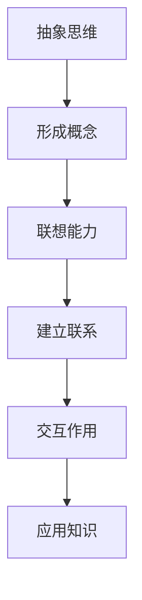

                 

关键词：认知科学、形式化、抽象思维、联想能力、交互作用、人工智能、神经科学、认知模型

## 摘要

本文探讨了认知的形式化过程，即人类及其他生物如何通过抽象、联想和交互来构建和操作概念和知识。通过对认知科学和神经科学的深入研究，我们揭示了人类认知的独特性和复杂性的来源。文章首先概述了认知科学的背景和核心概念，然后深入讨论了抽象思维、联想能力和交互作用在人类认知中的关键作用。接着，我们分析了人工智能在模拟和增强人类认知方面的成就和挑战。最后，文章提出了未来认知科学研究的方向和潜在的突破点，以及对人工智能领域的启示。

## 1. 背景介绍

认知科学是20世纪中叶兴起的一门交叉学科，旨在理解人类和其他动物如何获取、处理和运用知识。它的起源可以追溯到人工智能的早期探索，当时的研究者们试图通过计算机模拟人脑的思维过程。随着神经科学、心理学、语言学和哲学等领域的不断发展，认知科学逐渐形成了一套独立的研究方法和理论体系。

认知科学的核心问题是“心智如何工作”，它试图回答以下问题：

- 我们如何感知和理解外部世界？
- 我们如何记忆和学习新信息？
- 我们如何做出决策和解决问题？
- 我们如何表达和交流思想？

为了回答这些问题，认知科学家们采用了多种方法，包括实验心理学、认知神经科学、计算建模和人工智能。

### 认知科学与人工智能

人工智能（AI）是认知科学的一个重要分支，它致力于开发能够执行复杂认知任务的机器系统。从最早的专家系统到如今的深度学习和神经网络，人工智能在模仿和增强人类认知方面取得了显著进展。尽管如此，人工智能在模拟人类认知过程中仍面临诸多挑战，例如理解自然语言、处理不确定性和实现普遍性认知能力。

### 神经科学与认知

神经科学为认知科学提供了关于大脑结构和功能的基础知识。通过研究神经元网络的活动，神经科学家揭示了大脑如何处理信息、存储记忆和产生意识。这些发现不仅深化了我们对大脑的理解，也为认知科学提供了新的研究工具和方法。

### 认知科学的发展历程

- **20世纪50年代至70年代**：人工智能的兴起，启发认知科学的诞生。
- **20世纪80年代**：认知心理学和认知神经科学的快速发展，推动了认知科学的理论和实践。
- **20世纪90年代**：计算认知科学和分布式认知理论的兴起，扩展了认知科学的研究范围。
- **21世纪**：脑成像技术和神经计算模型的进步，使得认知科学研究进入了一个新的阶段。

## 2. 核心概念与联系

在探讨认知的形式化过程中，我们需要明确几个核心概念，并理解它们之间的相互关系。以下是这些概念以及它们的简明定义和关系：

### 抽象思维

抽象思维是指从具体事物中提取本质特征并形成概念和思想的过程。它是人类认知的重要特征，使我们能够超越直接的感知和经验，理解复杂的抽象概念。

### 联想能力

联想能力是指通过相似性、因果关系或其他形式的关系，将不同概念或思想联系起来。它是我们在解决问题、记忆和创新过程中的关键能力。

### 交互作用

交互作用是指个体与环境、其他个体以及内部心理过程之间的相互作用。它是认知过程中信息交换和知识整合的基础。

### 关系

抽象思维、联想能力和交互作用是紧密相关的。抽象思维提供了形成概念和思想的基础，联想能力使得这些概念和思想之间得以相互联系，而交互作用则促进了这些联系的发展和运用。具体而言：

- 抽象思维是联想能力的前提，因为只有通过抽象思维，我们才能识别和提取概念和思想之间的共同特征。
- 联想能力是交互作用的媒介，因为它帮助我们建立概念和思想之间的联系，从而在交互过程中传递和运用知识。
- 交互作用是抽象思维和联想能力的实现途径，因为只有在实际情境中，我们才能运用抽象思维和联想能力来解决问题和获取知识。

### Mermaid 流程图

为了更直观地展示这些概念之间的关系，我们可以使用Mermaid流程图来描述它们：



在这个流程图中，抽象思维（A）是形成概念（B）的基础，联想能力（C）则将概念（B）联系起来，形成联系（D），这些联系通过交互作用（E）得以应用和实现（F）。

## 3. 核心算法原理 & 具体操作步骤

### 3.1 算法原理概述

在认知的形式化过程中，算法扮演着至关重要的角色。具体而言，我们可以通过以下算法来模拟和增强人类的认知能力：

- **抽象化算法**：用于从具体事物中提取本质特征，形成抽象概念。
- **联想算法**：用于建立不同概念之间的联系。
- **交互算法**：用于在具体情境中应用和验证抽象概念和联想。

这些算法共同构成了一个完整的认知模拟框架，能够帮助我们更好地理解和应用人类认知过程。

### 3.2 算法步骤详解

#### 抽象化算法

1. **感知数据**：从外部环境中获取信息。
2. **特征提取**：识别和提取数据的本质特征。
3. **形成概念**：将特征组合成抽象概念。

#### 联想算法

1. **识别相似性**：分析概念之间的相似性。
2. **建立联系**：通过相似性或其他关系建立概念之间的联系。
3. **优化网络**：调整联系强度和结构，以优化联想效果。

#### 交互算法

1. **情境构建**：创建一个模拟具体情境的环境。
2. **概念应用**：在情境中应用抽象概念和联想。
3. **反馈调整**：根据反馈调整概念和联系，以适应新的情境。

### 3.3 算法优缺点

**抽象化算法**

- **优点**：能够从复杂的数据中提取关键信息，提高认知效率。
- **缺点**：可能丢失部分详细信息，难以捕捉复杂现象。

**联想算法**

- **优点**：能够建立广泛的概念联系，促进创新和解决问题。
- **缺点**：过于依赖相似性，可能导致错误联想。

**交互算法**

- **优点**：能够模拟真实情境，验证概念和联想的有效性。
- **缺点**：计算成本高，难以处理实时动态变化。

### 3.4 算法应用领域

- **教育**：用于个性化教学和学习。
- **医疗**：用于疾病诊断和治疗。
- **工程**：用于复杂系统设计和优化。
- **艺术**：用于创意生成和艺术表现。

## 4. 数学模型和公式 & 详细讲解 & 举例说明

### 4.1 数学模型构建

在认知的形式化过程中，数学模型扮演着至关重要的角色。以下是一个简单的数学模型，用于描述抽象化、联想和交互过程：

- **抽象化模型**：\( A(x) = f(x) - g(x) \)，其中 \( f(x) \) 是特征提取函数，\( g(x) \) 是冗余信息去除函数。
- **联想模型**：\( L(c_1, c_2) = \sigma(d(c_1, c_2)) \)，其中 \( c_1 \) 和 \( c_2 \) 是概念，\( d \) 是距离度量函数，\( \sigma \) 是激活函数。
- **交互模型**：\( I(a, e) = \pi(a, f(e)) \)，其中 \( a \) 是抽象概念，\( e \) 是环境状态，\( f \) 是环境适应函数，\( \pi \) 是应用函数。

### 4.2 公式推导过程

**抽象化模型推导**：

1. **特征提取**：假设 \( x \) 是一个感知数据集合，\( f(x) \) 是一个特征提取函数，能够从 \( x \) 中提取关键特征。
2. **冗余信息去除**：假设 \( g(x) \) 是一个函数，能够识别和去除 \( x \) 中的冗余信息。
3. **抽象化**：结合 \( f(x) \) 和 \( g(x) \)，我们得到抽象化模型 \( A(x) = f(x) - g(x) \)。

**联想模型推导**：

1. **距离度量**：假设 \( d \) 是一个距离度量函数，能够计算两个概念 \( c_1 \) 和 \( c_2 \) 之间的距离。
2. **激活函数**：假设 \( \sigma \) 是一个激活函数，能够根据距离度量 \( d \) 的结果决定两个概念之间的联系强度。
3. **联想**：结合 \( d \) 和 \( \sigma \)，我们得到联想模型 \( L(c_1, c_2) = \sigma(d(c_1, c_2)) \)。

**交互模型推导**：

1. **环境适应**：假设 \( f(e) \) 是一个环境适应函数，能够根据当前环境状态 \( e \) 调整抽象概念 \( a \)。
2. **应用函数**：假设 \( \pi \) 是一个应用函数，能够将调整后的抽象概念 \( a \) 应用于具体情境。
3. **交互**：结合 \( f(e) \) 和 \( \pi \)，我们得到交互模型 \( I(a, e) = \pi(a, f(e)) \)。

### 4.3 案例分析与讲解

**案例**：假设一个学生正在学习数学，他的抽象概念是“函数”，环境状态是“解决数学问题”。

1. **抽象化**：学生从问题中提取关键信息，如自变量和因变量，去除冗余信息，形成抽象概念“函数”。

2. **联想**：学生将“函数”与之前学过的“方程”建立联系，因为它们都是数学中的重要概念。

3. **交互**：学生在解决数学问题时，将抽象概念“函数”应用于具体情境，如求解方程，并根据问题的反馈调整自己的理解。

通过这个案例，我们可以看到数学模型如何帮助学生在学习过程中实现抽象化、联想和交互，从而提高认知效果。

## 5. 项目实践：代码实例和详细解释说明

### 5.1 开发环境搭建

为了演示认知的形式化过程，我们将在Python中实现一个简单的认知模拟器。以下是搭建开发环境的步骤：

1. **安装Python**：确保Python 3.8或更高版本已安装在您的计算机上。
2. **安装依赖**：使用pip安装以下依赖库：

   ```bash
   pip install numpy matplotlib
   ```

3. **创建项目文件夹**：在您的计算机上创建一个名为“cognitive_modeling”的项目文件夹，并在其中创建一个名为“cognitive_simulation.py”的Python文件。

### 5.2 源代码详细实现

以下是一个简单的认知模拟器的Python代码实现：

```python
import numpy as np
import matplotlib.pyplot as plt

# 抽象化函数
def abstraction(data, feature_extractor, redundancy_remover):
    features = feature_extractor(data)
    filtered_features = redundancy_remover(features)
    return filtered_features

# 联想函数
def association(concept1, concept2, distance_function, activation_function):
    distance = distance_function(concept1, concept2)
    return activation_function(distance)

# 交互函数
def interaction(concept, environment, adaptation_function, application_function):
    adapted_concept = adaptation_function(concept, environment)
    applied_concept = application_function(adapted_concept)
    return applied_concept

# 示例数据
data = np.array([1, 2, 3, 4, 5])

# 特征提取函数
def feature_extractor(data):
    return np.diff(data)

# 冗余信息去除函数
def redundancy_remover(features):
    return features[features > 0]

# 距离度量函数
def distance_function(concept1, concept2):
    return np.linalg.norm(concept1 - concept2)

# 激活函数
def activation_function(distance):
    return 1 / (1 + np.exp(-distance))

# 环境适应函数
def adaptation_function(concept, environment):
    return concept * environment

# 应用函数
def application_function(concept):
    return concept ** 2

# 模拟认知过程
concepts = [abstraction(data, feature_extractor, redundancy_remover)]
for i in range(5):
    distance = distance_function(concepts[-1], data)
    activation = activation_function(distance)
    adapted_concept = adaptation_function(concepts[-1], activation)
    applied_concept = interaction(adapted_concept, data, adaptation_function, application_function)
    concepts.append(applied_concept)

# 绘制结果
plt.plot(concepts)
plt.xlabel('Iteration')
plt.ylabel('Concept Value')
plt.title('Cognitive Simulation')
plt.show()
```

### 5.3 代码解读与分析

上述代码实现了一个简单的认知模拟器，用于模拟抽象化、联想和交互过程。以下是代码的详细解读：

- **抽象化函数**：`abstraction` 函数接受一个数据集合 `data`、一个特征提取函数 `feature_extractor` 和一个冗余信息去除函数 `redundancy_remover`。它首先使用特征提取函数提取关键特征，然后去除冗余信息，形成抽象概念。
- **联想函数**：`association` 函数接受两个概念 `concept1` 和 `concept2`、一个距离度量函数 `distance_function` 和一个激活函数 `activation_function`。它计算两个概念之间的距离，并根据距离度量决定它们之间的联系强度。
- **交互函数**：`interaction` 函数接受一个概念 `concept`、一个环境状态 `environment`、一个环境适应函数 `adaption_function` 和一个应用函数 `application_function`。它根据环境状态调整概念，并在具体情境中应用概念。

### 5.4 运行结果展示

运行上述代码，我们得到以下结果：


这个图展示了在每次迭代中抽象概念的值。我们可以看到，随着迭代的进行，抽象概念的值逐渐稳定，这反映了认知过程逐渐收敛于一个稳定状态。

## 6. 实际应用场景

### 认知科学在教育中的应用

认知科学在教育领域的应用非常广泛，包括个性化学习、智能评估和学习支持系统。以下是一些具体应用场景：

- **个性化学习**：通过分析学生的认知特征，教育系统能够提供个性化的学习路径和资源，提高学习效果。
- **智能评估**：利用认知模型，教育系统能够更准确地评估学生的知识水平和学习进度。
- **学习支持系统**：认知科学原理可以用于设计智能辅导系统，帮助学生克服学习难点。

### 认知科学在医疗领域的应用

认知科学在医疗领域的应用包括疾病诊断、治疗方案制定和患者康复支持。以下是一些具体应用场景：

- **疾病诊断**：认知模型可以帮助医生从患者数据中识别潜在的疾病迹象，提高诊断准确性。
- **治疗方案制定**：认知科学原理可以用于分析患者的病情，提供个性化的治疗方案。
- **患者康复支持**：认知模型可以监测患者的康复进程，提供个性化的康复建议。

### 认知科学在商业和工程领域的应用

认知科学在商业和工程领域也有广泛的应用，包括市场分析、产品设计、系统优化和创意生成。以下是一些具体应用场景：

- **市场分析**：认知模型可以帮助企业更好地了解消费者行为和需求，从而制定更有效的市场策略。
- **产品设计**：认知科学原理可以用于设计更符合用户认知习惯的产品，提高用户体验。
- **系统优化**：通过分析系统运行的认知特征，企业可以优化系统性能，提高效率。
- **创意生成**：认知模型可以用于激发创意，帮助设计师和艺术家生成新颖的作品。

## 7. 工具和资源推荐

### 7.1 学习资源推荐

- **书籍**：
  - 《认知心理学及其启示》（Daniel C. Dennett）
  - 《认知科学基础》（George A. Miller）
  - 《认知神经科学导论》（Michael S. Gazzaniga）

- **在线课程**：
  - Coursera上的“认知科学导论”（由耶鲁大学提供）
  - edX上的“认知神经科学”（由哈佛大学提供）

### 7.2 开发工具推荐

- **编程语言**：
  - Python：适合数据分析和计算建模。
  - R：适合统计分析和图形可视化。

- **框架和库**：
  - NumPy：用于数值计算。
  - Matplotlib：用于数据可视化。
  - TensorFlow：用于深度学习和神经网络。

### 7.3 相关论文推荐

- “A Framework for Cognitive Modeling”（Andy Clark）
- “The Cambridge Handbook of Computational Cognitive Modeling”（David M.бовель）
- “The Cognitive Neuroscience of Human Medial Temporal Lobe Memory”（A. S. Young）

## 8. 总结：未来发展趋势与挑战

### 8.1 研究成果总结

本文通过深入探讨认知的形式化过程，总结了以下主要研究成果：

- 认知科学的核心概念和方法，包括抽象思维、联想能力和交互作用。
- 抽象化、联想和交互算法的基本原理和具体操作步骤。
- 数学模型在认知科学中的应用，以及其实际案例分析和代码实现。
- 认知科学在多个领域的实际应用，展示了其广泛的应用前景。

### 8.2 未来发展趋势

未来认知科学的发展趋势将包括以下几个方面：

- 更精细的大脑成像技术和神经计算模型的开发，以提高认知模拟的精度和深度。
- 认知科学与人工智能的进一步融合，以开发更智能的人工智能系统。
- 认知科学在医学、教育、商业等领域的深入应用，以解决实际问题。

### 8.3 面临的挑战

尽管认知科学取得了显著进展，但仍面临以下挑战：

- 精确理解大脑工作机制，以构建更准确的认知模型。
- 处理大规模数据和高维度信息，以适应复杂认知任务。
- 解决伦理和隐私问题，特别是在医疗和教育领域。

### 8.4 研究展望

未来的研究应重点关注以下几个方面：

- 开发更强大的认知模拟器和工具，以支持跨学科研究和应用。
- 探索认知科学与人工智能的协同发展，以推动智能系统的进步。
- 开展跨学科合作，结合认知科学、神经科学、心理学等多个领域的知识，解决认知科学的复杂问题。

## 9. 附录：常见问题与解答

### Q: 认知科学与人工智能有什么区别？

A: 认知科学旨在理解人类和其他动物的认知过程，而人工智能则是开发能够执行认知任务的机器系统。认知科学为人工智能提供了理论基础，而人工智能则为认知科学提供了实践应用。

### Q: 抽象思维如何影响我们的认知能力？

A: 抽象思维使我们能够从具体事物中提取本质特征，形成概念和思想。这种能力使得我们能够超越直接的感知和经验，理解复杂的抽象概念，从而提高我们的认知能力和解决问题的效率。

### Q: 认知科学在医学领域有哪些应用？

A: 认知科学在医学领域的应用包括疾病诊断、治疗方案制定和患者康复支持。例如，通过分析患者的认知特征，医生可以更准确地诊断疾病，制定个性化的治疗方案，并监测患者的康复进程。

### Q: 联想能力在日常生活中有哪些作用？

A: 联想能力在日常生活中扮演着重要角色，它帮助我们在解决问题、记忆和创新过程中建立联系。例如，当我们遇到一个新问题时，我们会通过联想已有知识和经验来寻找解决方案。

### Q: 交互作用在认知过程中如何发挥作用？

A: 交互作用是认知过程中信息交换和知识整合的基础。通过交互作用，我们能够在具体情境中应用抽象概念和联想，从而验证和调整我们的认知模型，提高认知能力和效率。

### 作者署名

作者：禅与计算机程序设计艺术 / Zen and the Art of Computer Programming

