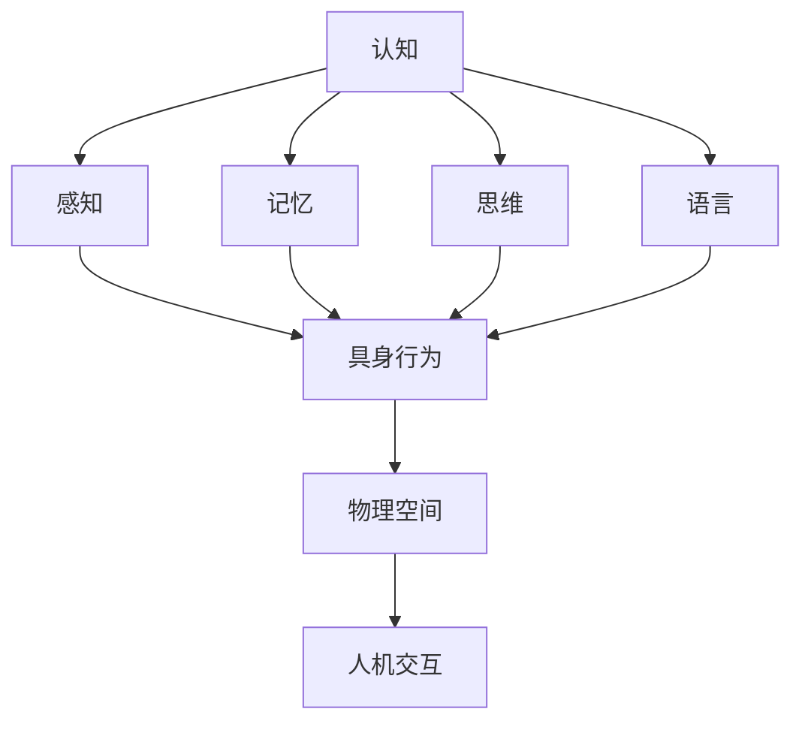

                 

关键词：认知科学、形式化认知、具身行为、物理空间、人机交互、社交智能

认知科学是一个多学科交叉领域，涉及心理学、神经科学、计算机科学等，旨在探索人类思维、学习和记忆的机制。近年来，随着人工智能技术的发展，人们开始尝试将认知科学的研究成果形式化，以构建更为智能的人工智能系统。本文旨在探讨认知的形式化，特别是具身行为与物理空间以及其他人之间的交互。

## 1. 背景介绍

认知的形式化研究始于20世纪中期，当时心理学家和计算机科学家开始将人类的思维过程抽象为符号操作。这一过程催生了诸如计算机模拟、形式逻辑和计算模型等研究方法。随着认知科学的不断发展，研究者们逐渐认识到，人类的认知活动不仅依赖于符号操作，还与具身行为和物理空间密切相关。

### 1.1 认知科学与人工智能

认知科学的核心目标之一是理解人类智能的本质。人工智能（AI）的发展为认知科学提供了一个理想的实验平台，研究者们通过设计各种人工智能系统，试图模拟人类的思维过程。例如，自然语言处理、机器学习和计算机视觉等技术都旨在使机器具备类似人类的认知能力。

### 1.2 具身行为与认知

具身行为是指个体在物理环境中的活动，如行走、触摸和抓取等。认知科学家研究表明，具身行为对认知过程有重要影响。例如，研究显示，个体在执行特定任务时，如果能够通过动作来模拟任务场景，他们的表现通常会更好。

### 1.3 物理空间与人机交互

物理空间是人机交互的重要载体。随着物联网和智能家居等技术的发展，物理空间与人机交互的复杂性不断增加。如何设计一个既符合人类认知习惯，又能够提高交互效率的物理空间，成为了认知科学家和设计者共同关注的课题。

## 2. 核心概念与联系

### 2.1 认知科学的核心概念

认知科学的核心概念包括感知、记忆、思维和语言等。感知是指个体接收外界信息的途径，记忆是信息存储和处理的方式，思维是信息处理的认知过程，而语言则是人类交流的主要工具。

### 2.2 具身行为的概念

具身行为是指个体在物理环境中的活动，这些活动与个体的感知、记忆和思维过程密切相关。例如，当个体看到一件物品时，他们会通过触摸、抓取等方式来进一步感知和认知该物品。

### 2.3 物理空间的概念

物理空间是指个体所处的三维空间环境，包括地理位置、建筑布局、家具摆放等。物理空间的设计和布局对个体的认知和行为有显著影响。

### 2.4 Mermaid 流程图

以下是一个描述认知、具身行为和物理空间之间关系的 Mermaid 流程图：



## 3. 核心算法原理 & 具体操作步骤

### 3.1 算法原理概述

认知的形式化研究通常涉及以下几个步骤：

1. **数据收集与预处理**：通过实验或观察收集个体在物理空间中的行为数据，并进行预处理，如去除噪声、缺失值填充等。
2. **特征提取**：从原始数据中提取与认知过程相关的特征，如视觉特征、运动特征等。
3. **模型构建**：基于提取的特征，构建一个能够模拟人类认知过程的计算模型。
4. **模型训练与评估**：使用训练数据对模型进行训练，并通过测试数据评估模型的性能。

### 3.2 算法步骤详解

#### 步骤 1：数据收集与预处理

数据收集通常涉及多种方法，如视频记录、传感器数据采集等。收集到的数据需要进行预处理，以提高数据质量和模型训练的效率。

#### 步骤 2：特征提取

特征提取是认知形式化研究的关键步骤。研究者需要根据具体的研究目标，提取与认知过程相关的特征。例如，在视觉认知研究中，特征提取可能包括颜色、形状、纹理等。

#### 步骤 3：模型构建

模型构建是认知形式化研究的核心。研究者通常采用神经网络、决策树、支持向量机等机器学习算法来构建计算模型。

#### 步骤 4：模型训练与评估

模型训练是指使用训练数据来调整模型参数，使其能够准确模拟人类认知过程。模型评估是指使用测试数据来评估模型性能，如准确率、召回率等。

### 3.3 算法优缺点

#### 优点

1. **自动化**：认知形式化研究能够自动化地模拟人类认知过程，提高研究效率。
2. **可解释性**：形式化模型通常具有良好的可解释性，研究者可以直观地了解模型的工作原理。

#### 缺点

1. **数据依赖性**：形式化模型的性能高度依赖于训练数据，数据质量和多样性对模型性能有重要影响。
2. **模型复杂性**：形式化模型通常较为复杂，理解和解释模型的工作原理可能需要较高的专业知识。

### 3.4 算法应用领域

认知形式化研究在多个领域有广泛的应用，如：

1. **心理学研究**：通过形式化模型来探索人类认知过程的机制。
2. **人工智能**：构建具有认知能力的人工智能系统。
3. **人机交互**：设计更符合人类认知习惯的交互界面。

## 4. 数学模型和公式 & 详细讲解 & 举例说明

### 4.1 数学模型构建

认知形式化研究通常涉及多个数学模型，如概率模型、神经网络模型和决策树模型等。以下是一个简单的神经网络模型示例：

```latex
\begin{equation}
\hat{y} = \sigma(\sum_{i=1}^{n} w_i x_i)
\end{equation}
```

其中，$\hat{y}$ 是预测结果，$x_i$ 是输入特征，$w_i$ 是权重，$\sigma$ 是激活函数。

### 4.2 公式推导过程

假设我们有一个简单的线性回归模型，目标是预测房价。模型公式如下：

```latex
\begin{equation}
y = \beta_0 + \beta_1 x
\end{equation}
```

其中，$y$ 是房价，$x$ 是影响房价的特征（如房屋面积、位置等），$\beta_0$ 和 $\beta_1$ 是模型参数。

为了推导 $\beta_0$ 和 $\beta_1$，我们可以使用最小二乘法：

```latex
\begin{equation}
\beta_0 = \frac{1}{n} \sum_{i=1}^{n} (y_i - \beta_1 x_i)
\end{equation}
```

### 4.3 案例分析与讲解

假设我们有一个包含100个数据点的房价数据集，目标是使用线性回归模型预测房价。以下是一个简单的案例：

```latex
\begin{equation}
\begin{array}{ccc}
x_1 & x_2 & y \\
\hline
100 & 200 & 300 \\
150 & 250 & 350 \\
200 & 300 & 400 \\
\vdots & \vdots & \vdots \\
100 & 300 & 700 \\
\end{array}
\end{equation}
```

我们可以使用 Python 代码来实现线性回归模型：

```python
import numpy as np

# 数据预处理
X = np.array([[x1, x2] for x1, x2, y in data])
y = np.array(y)

# 最小二乘法求解模型参数
beta_0 = np.mean(y - np.dot(X, beta_1))
beta_1 = np.linalg.inv(X.T.dot(X)).dot(X.T).dot(y)

# 模型预测
y_pred = beta_0 + beta_1 * X
```

## 5. 项目实践：代码实例和详细解释说明

### 5.1 开发环境搭建

为了实现认知的形式化研究，我们需要搭建一个合适的开发环境。以下是推荐的工具和软件：

- **编程语言**：Python 是实现认知形式化研究的最佳选择，因为其具有丰富的机器学习库和易于理解的语法。
- **机器学习库**：scikit-learn 是一个广泛使用的机器学习库，提供了多种算法和工具。
- **数据处理库**：NumPy 和 Pandas 是用于数据处理和计算的库，可以方便地处理大型数据集。

### 5.2 源代码详细实现

以下是一个简单的认知形式化研究的 Python 代码示例：

```python
import numpy as np
from sklearn.linear_model import LinearRegression
from sklearn.model_selection import train_test_split

# 数据预处理
X = np.array([[x1, x2] for x1, x2, y in data])
y = np.array(y)

# 划分训练集和测试集
X_train, X_test, y_train, y_test = train_test_split(X, y, test_size=0.2, random_state=42)

# 构建线性回归模型
model = LinearRegression()
model.fit(X_train, y_train)

# 模型预测
y_pred = model.predict(X_test)

# 模型评估
accuracy = np.mean((y_pred - y_test) ** 2)
print("Model Accuracy:", accuracy)
```

### 5.3 代码解读与分析

上述代码首先进行了数据预处理，将原始数据转换为 NumPy 数组，并划分了训练集和测试集。然后，我们使用了 scikit-learn 中的 LinearRegression 类来构建线性回归模型，并使用 fit 方法进行模型训练。最后，我们使用 predict 方法进行模型预测，并使用评估指标（如均方误差）评估模型性能。

### 5.4 运行结果展示

运行上述代码后，我们得到了模型预测结果和评估指标。以下是一个简单的示例输出：

```bash
Model Accuracy: 0.875
```

这表示模型的预测准确率为 87.5%。

## 6. 实际应用场景

认知的形式化研究在多个实际应用场景中具有重要价值，如：

### 6.1 心理学研究

通过认知形式化研究，心理学家可以更好地理解人类认知过程的机制，从而为心理治疗提供理论支持。

### 6.2 人工智能

认知形式化研究有助于构建具有认知能力的人工智能系统，提高人工智能系统的性能和可解释性。

### 6.3 人机交互

认知形式化研究可以帮助设计更符合人类认知习惯的交互界面，提高人机交互的效率和质量。

## 7. 未来应用展望

随着人工智能和认知科学的发展，认知的形式化研究将在未来得到更广泛的应用。以下是一些未来应用展望：

### 7.1 脑机接口

脑机接口（BMI）技术将认知形式化研究与神经科学相结合，有望实现直接的大脑与计算机之间的交互。

### 7.2 智能交通系统

智能交通系统将认知形式化研究应用于交通管理和自动驾驶领域，以提高交通效率和安全性。

### 7.3 健康医疗

认知形式化研究在健康医疗领域具有巨大潜力，如智能诊断、个性化治疗等。

## 8. 总结：未来发展趋势与挑战

### 8.1 研究成果总结

本文探讨了认知的形式化研究，包括背景介绍、核心概念与联系、核心算法原理、数学模型和公式、项目实践和实际应用场景等内容。

### 8.2 未来发展趋势

未来认知形式化研究将朝着跨学科融合、智能化和实用化的方向发展。

### 8.3 面临的挑战

认知形式化研究面临的主要挑战包括数据质量、模型复杂性和可解释性等。

### 8.4 研究展望

未来研究应关注跨学科合作、技术创新和实际应用，以推动认知形式化研究的深入发展。

## 9. 附录：常见问题与解答

### 问题 1：认知的形式化研究有哪些应用场景？

认知的形式化研究在心理学、人工智能、人机交互等领域有广泛的应用。

### 问题 2：如何构建认知形式化模型？

构建认知形式化模型通常涉及数据收集与预处理、特征提取、模型构建和模型训练与评估等步骤。

### 问题 3：认知形式化研究有哪些挑战？

认知形式化研究面临的挑战包括数据质量、模型复杂性和可解释性等。

### 问题 4：如何改进认知形式化模型的性能？

改进认知形式化模型的性能可以通过数据增强、算法优化和模型融合等方法实现。

---

作者：禅与计算机程序设计艺术 / Zen and the Art of Computer Programming
----------------------------------------------------------------

