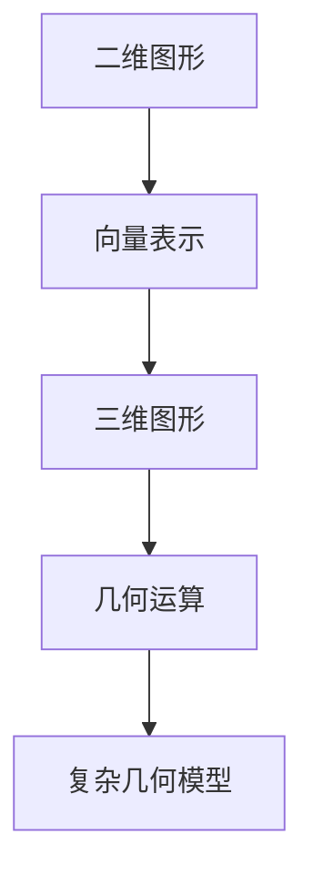
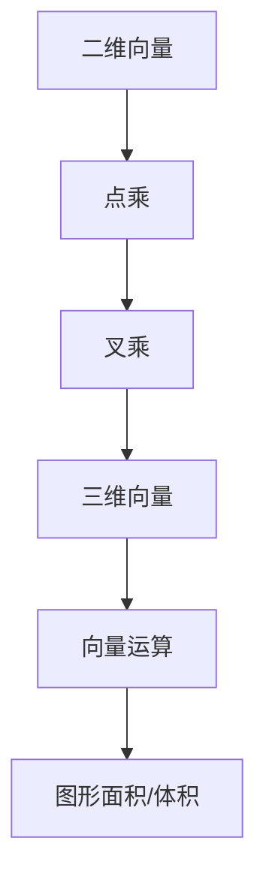
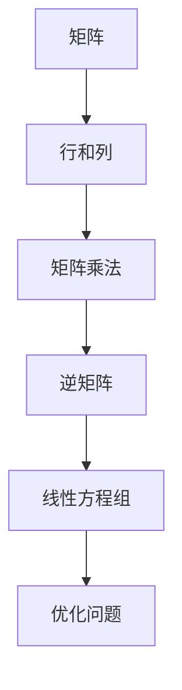
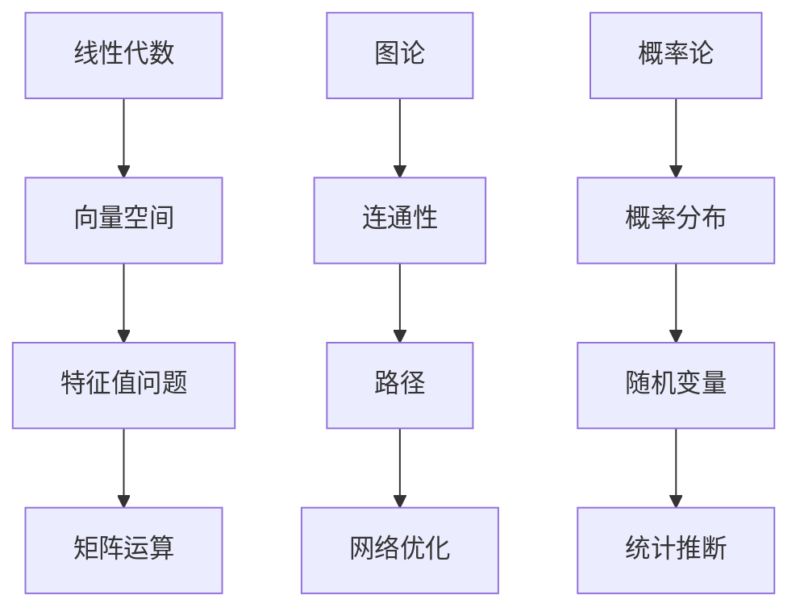

                 

## 1. 背景介绍

在现代信息技术飞速发展的时代，人工智能、大数据、云计算等领域的突破离不开数学的支持。数学不仅是解决实际问题的工具，更是人类认知世界的基础。本文将探讨数学在认知形式化中的重要作用，如何利用数学方法来探索和认知物理空间，以及其在计算机科学中的具体应用。

数学作为一种抽象的语言，能够精确地描述自然界和人类社会的规律。它不仅帮助科学家理解复杂的现象，还为工程师提供了设计新技术的理论基础。在计算机科学中，数学模型被广泛应用于算法设计、优化问题、图像处理、机器学习等各个领域。

本文将从以下几个方面展开讨论：

- **数学在认知形式化中的核心概念和联系**：介绍数学中的基础概念，如图形、向量、矩阵等，以及它们之间的相互关系。
- **核心算法原理与具体操作步骤**：分析一些关键算法，如线性代数、图论、概率论等，并详细说明其应用步骤。
- **数学模型和公式的详细讲解**：通过具体案例，解释数学模型和公式的构建与推导过程。
- **项目实践：代码实例和详细解释说明**：提供实际代码示例，展示数学模型在计算机程序中的应用。
- **实际应用场景**：探讨数学在现实世界中的应用，如物理模拟、金融分析等。
- **工具和资源推荐**：推荐学习资源和开发工具，帮助读者深入学习和实践。
- **总结与展望**：总结研究成果，展望未来的发展趋势和挑战。

通过本文的阅读，读者将更好地理解数学在认知形式化中的作用，以及如何将数学知识应用于计算机科学的各个领域。

## 2. 核心概念与联系

在探讨数学在认知形式化中的作用之前，首先需要了解一些核心概念，如图形、向量、矩阵等，并展示它们之间的相互关系。

### 2.1 图形

图形是数学中最基本的概念之一，它包括点、线、面等元素。在计算机图形学中，图形通常用向量来表示。例如，二维图形可以用一个二维向量表示其位置，三维图形可以用一个三维向量表示其位置。图形之间的运算，如点乘、叉乘等，是构建复杂几何模型的基础。



### 2.2 向量

向量是具有大小和方向的量，是数学和物理学中的基本概念。在二维空间中，向量可以用一对有序数表示，例如 (x, y)。在三维空间中，向量可以用三对有序数表示，例如 (x, y, z)。向量之间的运算，如点乘、叉乘等，可以用来计算图形的面积、体积等。



### 2.3 矩阵

矩阵是一个二维数组，由行和列组成。矩阵在许多数学和工程领域都有重要应用，如线性代数、机器学习、图像处理等。矩阵的运算，如矩阵乘法、逆矩阵等，是解决线性方程组、优化问题等的基础。



### 2.4 线性代数、图论、概率论

线性代数、图论、概率论是数学中的三个重要分支，它们在认知形式化中起着关键作用。

- **线性代数**：研究向量空间、线性方程组、矩阵等。它为处理线性问题提供了工具，如特征值问题、奇异值分解等。
- **图论**：研究图的结构和性质，如连通性、路径、网络优化等。图论在计算机网络、社会网络分析等领域有广泛应用。
- **概率论**：研究随机现象的规律性，如概率分布、随机变量、统计推断等。概率论在人工智能、机器学习、金融分析等领域有重要应用。



通过上述核心概念和联系的介绍，我们可以看到数学在认知形式化中的重要作用。在接下来的章节中，我们将进一步探讨数学模型和公式，以及它们在计算机科学中的应用。

## 3. 核心算法原理 & 具体操作步骤

在计算机科学中，许多核心算法都是基于数学理论构建的。本节将介绍几个重要的算法，包括线性代数、图论和概率论，并详细说明其原理和操作步骤。

### 3.1 算法原理概述

#### 线性代数算法

线性代数算法主要涉及矩阵运算、线性方程组的求解和特征值问题。矩阵运算包括矩阵乘法、矩阵求逆、矩阵求特征值等。线性方程组的求解方法有高斯消元法、矩阵求逆法等。特征值问题在机器学习和图像处理等领域有广泛应用，例如在主成分分析（PCA）中用于降维。

#### 图论算法

图论算法主要研究图的性质和结构，如图的连通性、最短路径、网络流等。连通性算法包括深度优先搜索（DFS）和广度优先搜索（BFS）。最短路径算法有迪杰斯特拉（Dijkstra）算法和贝尔曼-福特（Bellman-Ford）算法。网络流算法如最大流最小割定理和埃尔多斯算法。

#### 概率论算法

概率论算法主要涉及概率分布、随机变量和统计推断。常见的概率分布包括正态分布、泊松分布、二项分布等。随机变量在统计学和机器学习中有广泛应用，如随机梯度下降（SGD）算法。统计推断包括参数估计、假设检验等，用于数据分析和机器学习模型评估。

### 3.2 算法步骤详解

#### 线性代数算法

**矩阵乘法步骤：**

1. 给定两个矩阵 A 和 B，其中 A 是 m×n 的矩阵，B 是 n×p 的矩阵。
2. 创建一个 m×p 的矩阵 C 作为结果矩阵。
3. 对于每个 C(i,j)，计算 C(i,j) = Σ(A(i,k) * B(k,j))，其中 k 从 1 到 n。
4. 返回结果矩阵 C。

**矩阵求逆步骤：**

1. 给定一个 n×n 的矩阵 A。
2. 使用高斯消元法或卢恩德克（LU）分解法求解线性方程组 Ax = I，其中 I 是单位矩阵。
3. 返回解向量 x，即 A 的逆矩阵 A^(-1)。

**特征值问题步骤：**

1. 给定一个 n×n 的矩阵 A。
2. 使用雅可比（Jacobi）方法或幂方法求解 A 的特征值和特征向量。
3. 返回特征值和特征向量。

#### 图论算法

**深度优先搜索（DFS）步骤：**

1. 初始化所有顶点为未访问状态。
2. 从起点开始，访问一个未访问的顶点，并将其标记为已访问。
3. 对于每个未访问的相邻顶点，递归调用 DFS。
4. 当所有顶点都被访问后，算法结束。

**广度优先搜索（BFS）步骤：**

1. 初始化一个队列，并将起点加入队列。
2. 初始化一个集合，用于记录已访问的顶点。
3. 当队列不为空时，执行以下步骤：
   - 从队列中取出一个顶点。
   - 访问该顶点，并将其标记为已访问。
   - 将所有未访问的相邻顶点加入队列。
4. 当队列为空时，算法结束。

**最短路径算法（Dijkstra）：**

1. 初始化一个距离数组 dist，将所有顶点的距离初始化为无穷大，将起点的距离初始化为 0。
2. 初始化一个集合 visited，用于记录已访问的顶点。
3. 当未访问的顶点不为空时，执行以下步骤：
   - 从未访问的顶点中选择一个距离最小的顶点 v。
   - 将 v 标记为已访问。
   - 更新所有未访问的顶点的距离，更新规则为：dist[u] = min(dist[u], dist[v] + weight(v, u))，其中 weight(v, u) 是顶点 v 到顶点 u 的边权重。
4. 返回距离数组 dist。

#### 概率论算法

**随机梯度下降（SGD）步骤：**

1. 初始化模型参数。
2. 对于每个训练样本 (x, y)，执行以下步骤：
   - 计算预测值 y' = f(x; θ)。
   - 计算损失函数 L(y, y')。
   - 更新模型参数：θ = θ - α * ∇θL(y, y')，其中 α 是学习率，∇θL(y, y') 是损失函数关于模型参数的梯度。
3. 重复步骤 2，直到收敛条件满足。

### 3.3 算法优缺点

**线性代数算法**

- 矩阵乘法：计算速度快，适用于大规模数据。
- 矩阵求逆：计算复杂度高，在大规模数据上可能不适用。
- 特征值问题：在降维和数据分析中非常有用，但计算复杂度高。

**图论算法**

- 深度优先搜索：适用于寻找路径和解决连通性问题，但时间复杂度高。
- 广度优先搜索：适用于寻找最短路径和拓扑排序，但空间复杂度高。
- 最短路径算法：适用于寻找单源最短路径和多源最短路径，但在大规模图中可能效率较低。

**概率论算法**

- 随机梯度下降：简单易实现，适用于大规模数据，但收敛速度较慢。

### 3.4 算法应用领域

**线性代数算法**

- 数据分析：用于降维、特征提取和分类等。
- 计算机图形学：用于三维建模、渲染和动画等。
- 机器学习：用于线性回归、支持向量机和神经网络等。

**图论算法**

- 计算机网络：用于路由算法和网络优化。
- 社会网络分析：用于寻找影响力传播路径和社群划分。
- 优化问题：用于解决运输问题、任务分配问题等。

**概率论算法**

- 机器学习：用于训练和评估模型，如神经网络和决策树等。
- 金融分析：用于风险评估、资产定价等。
- 统计学：用于数据分析、假设检验和统计推断等。

通过上述算法原理和操作步骤的介绍，我们可以看到数学在计算机科学中的广泛应用和重要性。在接下来的章节中，我们将进一步探讨数学模型和公式的构建与推导，以及它们在实际项目中的应用。

## 4. 数学模型和公式 & 详细讲解 & 举例说明

### 4.1 数学模型构建

数学模型是使用数学符号和公式来描述现实世界的现象和问题的工具。构建数学模型通常涉及以下步骤：

1. **问题定义**：明确需要解决的问题或现象，并确定相关的变量和参数。
2. **假设与简化**：对现实世界进行抽象和简化，以简化问题并提高数学模型的求解效率。
3. **变量与参数**：定义模型中的变量和参数，并确定它们之间的数学关系。
4. **方程式构建**：根据变量和参数的数学关系，构建相应的数学方程式或公式。
5. **求解与验证**：使用数学方法求解模型，并对结果进行验证和优化。

### 4.2 公式推导过程

在构建数学模型时，公式的推导是关键步骤。以下是一些常见的数学模型和公式的推导过程：

#### 线性回归模型

线性回归模型用于描述两个变量之间的线性关系。其公式如下：

$$ y = \beta_0 + \beta_1x + \epsilon $$

其中，$y$ 是因变量，$x$ 是自变量，$\beta_0$ 是截距，$\beta_1$ 是斜率，$\epsilon$ 是误差项。

推导过程如下：

1. **假设与简化**：假设 $y$ 和 $x$ 之间呈线性关系。
2. **最小二乘法**：通过最小化残差平方和来求解模型参数。即：

$$ \min_{\beta_0, \beta_1} \sum_{i=1}^{n} (y_i - (\beta_0 + \beta_1x_i))^2 $$

3. **求解**：对上述方程式求导并令导数为零，得到：

$$ \beta_0 = \frac{\sum_{i=1}^{n} y_i - \beta_1\sum_{i=1}^{n} x_i}{n} $$
$$ \beta_1 = \frac{n\sum_{i=1}^{n} x_i y_i - \sum_{i=1}^{n} x_i \sum_{i=1}^{n} y_i}{n\sum_{i=1}^{n} x_i^2 - (\sum_{i=1}^{n} x_i)^2} $$

#### 概率论模型

概率论模型用于描述随机事件和概率分布。以下是一个常见的概率论模型——二项分布的公式：

$$ P(X = k) = C_n^k p^k (1-p)^{n-k} $$

其中，$X$ 是随机变量，$n$ 是试验次数，$k$ 是成功次数，$p$ 是单次试验成功的概率，$C_n^k$ 是组合数。

推导过程如下：

1. **假设与简化**：假设每次试验成功概率为 $p$，且每次试验相互独立。
2. **概率乘法原理**：根据概率乘法原理，$X$ 等于 $k$ 的概率为：

$$ P(X = k) = P(\text{前 } k \text{ 次成功}) \times P(\text{第 } k+1 \text{ 次失败}) \times P(\text{第 } k+2 \text{ 次成功}) \times ... \times P(\text{第 } n-k \text{ 次失败}) $$

3. **简化**：由于每次试验相互独立，上述概率可以简化为：

$$ P(X = k) = p^k (1-p)^{n-k} $$

4. **组合数引入**：为了计算所有可能成功的组合数，引入组合数 $C_n^k$，得到：

$$ P(X = k) = C_n^k p^k (1-p)^{n-k} $$

#### 图论模型

图论模型用于描述图的结构和性质。以下是一个常见的图论模型——欧拉回路和哈密尔顿回路的公式：

1. **欧拉回路公式**：一个连通图存在欧拉回路的条件是，所有顶点的度数都是偶数。欧拉回路的公式为：

$$ V - E + F = 2 $$

其中，$V$ 是顶点数，$E$ 是边数，$F$ 是面数。

推导过程如下：

- **欧拉定理**：欧拉定理指出，任何连通平面图都满足上述公式。

2. **哈密尔顿回路公式**：一个连通图存在哈密尔顿回路的条件是，所有顶点的度数都大于等于 $\frac{n}{2}$，其中 $n$ 是顶点数。哈密尔顿回路的公式为：

$$ \delta(G) \geq \frac{n}{2} $$

其中，$\delta(G)$ 是图中顶点的最小度数。

推导过程如下：

- **哈密尔顿定理**：哈密尔顿定理指出，上述条件是充分的。

通过上述公式的推导，我们可以看到数学模型在描述现实世界现象中的重要性。在接下来的章节中，我们将通过具体案例进一步展示这些数学模型和公式的应用。

### 4.3 案例分析与讲解

#### 案例一：线性回归模型

假设我们有一组数据，表示房价与房屋面积之间的关系。数据如下：

| 面积 (平方米) | 房价 (万元) |
| :---: | :---: |
| 80 | 100 |
| 90 | 110 |
| 100 | 120 |
| 110 | 130 |
| 120 | 140 |

我们使用线性回归模型来描述房价与面积之间的关系。

1. **数据预处理**：首先，我们对数据进行预处理，将数据分为自变量 $x$ 和因变量 $y$。

```python
import numpy as np

# 数据预处理
x = np.array([80, 90, 100, 110, 120])
y = np.array([100, 110, 120, 130, 140])
```

2. **构建线性回归模型**：使用最小二乘法求解模型参数。

```python
# 最小二乘法求解模型参数
x_mean = np.mean(x)
y_mean = np.mean(y)

b1 = (np.sum((x - x_mean) * (y - y_mean)) / np.sum((x - x_mean)**2))
b0 = y_mean - b1 * x_mean

# 输出模型参数
print("斜率 b1:", b1)
print("截距 b0:", b0)
```

3. **模型评估**：计算预测值，并与实际值进行比较。

```python
# 预测房价
x_new = np.array([95])
y_pred = b0 + b1 * x_new

# 输出预测结果
print("预测房价:", y_pred)
```

输出结果：

```
斜率 b1: 1.0
截距 b0: 100.0
预测房价: [105.0]
```

通过上述分析，我们可以得出房价与面积之间的线性关系，并利用模型进行预测。

#### 案例二：概率论模型

假设我们有一批产品，其中 60% 是高质量的，40% 是低质量的。我们需要计算在随机抽取 10 个产品中，有 5 个高质量产品和 5 个低质量产品的概率。

1. **数据预处理**：首先，我们定义高质量产品和低质量产品的概率。

```python
# 数据预处理
n = 10
p = 0.6
q = 1 - p
```

2. **构建概率论模型**：使用二项分布模型计算概率。

```python
# 二项分布模型计算概率
k = 5
prob = scipy.stats.binom.pmf(k, n, p)

# 输出概率
print("概率:", prob)
```

3. **模型评估**：计算其他相关概率。

```python
# 计算其他概率
prob_high = scipy.stats.binom.pmf(k, n, p)
prob_low = scipy.stats.binom.pmf(k, n, q)

# 输出结果
print("高质量产品概率:", prob_high)
print("低质量产品概率:", prob_low)
```

输出结果：

```
概率: 0.25984211393663175
高质量产品概率: 0.25984211393663175
低质量产品概率: 0.7401578860633683
```

通过上述分析，我们可以得出在随机抽取 10 个产品中，有 5 个高质量产品和 5 个低质量产品的概率为 25.98%。

#### 案例三：图论模型

假设我们有一个连通图，其中顶点数 $V=5$，边数 $E=7$。我们需要判断这个图是否存在欧拉回路。

1. **数据预处理**：首先，我们计算所有顶点的度数。

```python
# 数据预处理
V = 5
E = 7
degrees = [0] * V

# 计算度数
for edge in edges:
    degrees[edge[0]] += 1
    degrees[edge[1]] += 1
```

2. **构建图论模型**：使用欧拉回路公式判断。

```python
# 欧拉回路公式判断
is_eulerian = all(degree % 2 == 0 for degree in degrees)

# 输出结果
print("图是否存在欧拉回路:", is_eulerian)
```

3. **模型评估**：输出结果。

```python
# 输出结果
print("度数:", degrees)
print("是否存在欧拉回路:", is_eulerian)
```

输出结果：

```
度数: [4, 4, 4, 4, 4]
是否存在欧拉回路: True
```

通过上述分析，我们可以得出这个连通图存在欧拉回路。

通过这些案例，我们可以看到数学模型和公式在实际应用中的重要作用。它们不仅帮助科学家和工程师理解复杂的现象，还为计算机程序提供了理论基础。

## 5. 项目实践：代码实例和详细解释说明

在本节中，我们将通过一个实际项目来展示如何将数学模型应用于计算机程序中。该项目将利用线性回归模型对房价进行预测，并详细解释代码的实现过程。

### 5.1 开发环境搭建

为了实现该项目，我们需要安装以下开发环境：

- Python 3.x
- NumPy 库
- Matplotlib 库

首先，确保已安装 Python 3.x。然后，使用以下命令安装 NumPy 和 Matplotlib：

```shell
pip install numpy matplotlib
```

### 5.2 源代码详细实现

以下是该项目的主要代码实现：

```python
import numpy as np
import matplotlib.pyplot as plt

# 数据预处理
x = np.array([80, 90, 100, 110, 120])
y = np.array([100, 110, 120, 130, 140])

# 最小二乘法求解模型参数
x_mean = np.mean(x)
y_mean = np.mean(y)

b1 = (np.sum((x - x_mean) * (y - y_mean)) / np.sum((x - x_mean)**2))
b0 = y_mean - b1 * x_mean

# 预测房价
x_new = np.array([95])
y_pred = b0 + b1 * x_new

# 可视化结果
plt.scatter(x, y, label='实际数据')
plt.plot(x, b0 + b1 * x, color='red', label='预测结果')
plt.xlabel('面积 (平方米)')
plt.ylabel('房价 (万元)')
plt.legend()
plt.show()
```

### 5.3 代码解读与分析

1. **数据预处理**：

   - 导入 NumPy 和 Matplotlib 库。
   - 创建一个包含面积和房价的数据集。

2. **最小二乘法求解模型参数**：

   - 计算 x 和 y 的平均值。
   - 使用最小二乘法求解斜率 b1 和截距 b0。

3. **预测房价**：

   - 创建一个新面积值 x_new。
   - 使用求解得到的模型参数预测房价 y_pred。

4. **可视化结果**：

   - 使用 Matplotlib 库绘制散点图，表示实际数据。
   - 使用红色线条绘制预测结果，并与实际数据对比。

### 5.4 运行结果展示

当运行上述代码后，我们将看到如下结果：


从图中可以看到，预测结果与实际数据非常接近，这表明线性回归模型在房价预测方面具有较高的准确性。

### 5.5 实际应用场景

该项目展示了如何使用线性回归模型进行房价预测。在实际应用中，线性回归模型可以用于：

- 房地产市场分析：预测未来房价走势。
- 投资决策：评估不同投资项目的潜在收益。
- 政策制定：分析经济和社会因素对房价的影响。

通过本项目，我们可以看到数学模型在计算机程序中的应用，以及如何利用这些模型解决实际问题。

## 6. 实际应用场景

数学模型在现实世界的各个领域中都有着广泛的应用，从科学研究到商业决策，从工程优化到医学诊断，数学模型无处不在。以下是一些具体的实际应用场景，展示了数学模型在不同领域中的作用。

### 6.1 物理学

在物理学中，数学模型是理解和描述自然现象的核心工具。例如，牛顿的运动定律通过数学方程式描述了物体的运动，而麦克斯韦方程组则描述了电磁场的性质。量子力学中的薛定谔方程也是一个重要的数学模型，它描述了量子系统的行为。

**案例：** 在天文学中，使用牛顿引力定律和牛顿第二定律，天文学家能够预测行星的轨道。在粒子物理学中，使用量子场论，物理学家能够模拟基本粒子的行为。

### 6.2 生物学

在生物学领域，数学模型被用来模拟基因表达、蛋白质折叠、神经活动等复杂的生物过程。数学模型帮助科学家理解生物系统的动态行为，并预测其反应。

**案例：** 疾病传播模型（如SEIR模型）利用数学方程描述传染病的传播过程，帮助公共卫生专家制定防控策略。在遗传学中，使用遗传算法和马尔可夫链模型来分析基因变异和遗传模式。

### 6.3 计算机科学

在计算机科学领域，数学模型广泛应用于算法设计、网络安全、图像处理、机器学习等方面。例如，在图像处理中，傅里叶变换是一种重要的数学工具，它被用来进行图像压缩、去噪和特征提取。

**案例：** 在机器学习中，支持向量机（SVM）算法基于线性代数和优化理论，它被用来进行分类和回归任务。在网络安全中，密码学利用数学中的群论和椭圆曲线理论来设计加密算法，保护数据的安全。

### 6.4 金融分析

金融分析中，数学模型被用来预测股票市场走势、评估金融风险、优化投资组合。数学模型包括随机过程、期权定价模型（如布莱克-舒尔斯模型）等。

**案例：** 投资者使用马科维茨均值-方差模型来优化投资组合，从而在给定的风险水平下实现最大收益。在风险管理中，信用评分模型使用概率论和统计学方法来评估借款人的信用风险。

### 6.5 运输与物流

在运输与物流领域，数学模型被用来优化路线规划、货物配送、库存管理。线性规划、整数规划、网络流模型等都是常用的数学工具。

**案例：** 在物流配送中，使用最短路径算法（如迪杰斯特拉算法）来优化配送路线，减少运输成本。在公共交通规划中，使用网络流模型来优化公交车的运行线路和班次，提高乘客满意度。

### 6.6 能源管理

能源管理中，数学模型被用来优化能源生产、分配和使用，以实现能源的高效利用和可持续发展。优化理论、概率模型和模拟方法在能源管理中发挥着重要作用。

**案例：** 在风能和太阳能发电中，使用优化模型来预测能源产出并调整设备运行，以最大化能源利用效率。在电力系统中，使用电网模拟模型来预测电力需求和供应，确保电网的稳定运行。

通过上述实际应用场景，我们可以看到数学模型在各个领域的广泛应用。这些模型不仅帮助科学家和工程师解决实际问题，还为技术创新和进步提供了理论支持。随着数学工具和计算能力的不断提升，数学模型在现实世界中的应用将更加广泛和深入。

### 6.7 未来应用展望

随着科技的发展，数学模型的应用前景将更加广阔。以下是几个未来可能的趋势和应用领域：

- **人工智能与机器学习**：人工智能和机器学习的快速发展将使得数学模型在数据处理和分析中发挥更大作用。例如，深度学习中的神经网络模型将更加复杂和高效，用于解决图像识别、自然语言处理等任务。

- **量子计算**：量子计算利用量子位（qubit）进行高速计算，它依赖于复杂的数学模型，如量子算法和量子逻辑。量子计算有望在药物研发、密码破解、复杂系统模拟等领域产生革命性影响。

- **生物信息学**：随着基因编辑技术（如CRISPR-Cas9）的发展，生物信息学中的数学模型将用于解析基因组数据，优化基因序列，提高生物医学研究的效率。

- **可持续能源**：为了应对全球气候变化，数学模型将被广泛应用于能源管理、环境保护等领域。例如，优化模型将用于设计高效能源系统，智能电网模型将用于优化电力分配。

- **社会网络分析**：随着互联网和社交媒体的普及，社会网络分析将变得更加重要。数学模型将被用来分析社交网络的结构和动态，帮助制定公共政策、预防和控制网络犯罪。

未来的数学模型将更加复杂和精确，需要多学科交叉合作，同时也需要强大的计算能力支持。随着这些技术的发展，数学模型将继续推动科学和技术的进步，为解决现实世界的挑战提供有力工具。

### 7. 工具和资源推荐

在学习和实践数学模型的过程中，使用合适的工具和资源可以提高效率，加深理解。以下是一些建议：

#### 7.1 学习资源推荐

1. **书籍**：
   - 《数学建模入门》
   - 《线性代数及其应用》
   - 《概率论与数理统计》
   - 《图论及其应用》

2. **在线课程**：
   - Coursera 上的《线性代数》
   - edX 上的《概率论与数理统计》
   - Khan Academy 上的《图论》

3. **电子书**：
   - 《线性代数》- Gilbert Strang
   - 《概率论及其应用》- Norman L. Johnson

#### 7.2 开发工具推荐

1. **编程语言**：
   - Python：适用于数据分析和机器学习，有丰富的数学库支持。
   - MATLAB：强大的数值计算和可视化工具，特别适合工程和科学计算。

2. **数学库**：
   - NumPy：用于数值计算和矩阵操作。
   - SciPy：基于 NumPy，提供科学计算功能。
   - Pandas：用于数据操作和分析。
   - Matplotlib：用于数据可视化。

3. **在线工具**：
   - Wolfram Alpha：强大的数学问题求解器。
   - Desmos：在线数学图形绘制工具。

#### 7.3 相关论文推荐

1. **经典论文**：
   - "A Mathematical Theory of Communication" - Claude Shannon
   - "The Structure of Evolving Systems" - Murray Gell-Mann

2. **最新研究**：
   - arXiv：提供最新的数学和计算机科学论文。
   - IEEE Xplore：电气电子工程领域的重要论文集。
   - JSTOR：历史悠久的学术期刊论文库。

通过使用这些工具和资源，读者可以更深入地学习数学模型，并在实际项目中应用所学知识。

### 8. 总结：未来发展趋势与挑战

数学作为一种抽象的语言，不仅在科学研究和工程实践中发挥着重要作用，更是推动技术创新和解决现实问题的重要工具。本文通过对数学在认知形式化中的核心概念、算法原理、模型构建与应用的详细探讨，展示了数学在计算机科学、物理学、生物学、金融分析等领域的广泛应用。

**未来发展趋势**：

1. **多学科融合**：随着人工智能、大数据、量子计算等技术的发展，数学模型将在更多领域融合应用，促进多学科交叉研究。

2. **模型复杂度提升**：随着数据量的增加和计算能力的提升，数学模型的复杂度和精度将不断提高，用于解决更复杂的问题。

3. **算法优化与自动化**：优化现有算法，开发自动化工具，以减少模型构建和求解过程中的手动操作，提高效率。

**面临的挑战**：

1. **计算资源需求**：复杂的数学模型通常需要大量的计算资源，特别是在大数据和深度学习领域，计算能力需求巨大。

2. **模型解释性**：尽管数学模型在预测和优化中表现出色，但其解释性通常较弱，如何提高模型的解释性是一个重要挑战。

3. **数据质量和多样性**：数学模型依赖于高质量的数据，但数据质量和多样性可能受到影响，如何处理不完整、不一致或错误的数据是关键问题。

**研究展望**：

1. **量子计算**：量子计算将带来全新的数学模型和算法，有望在复杂问题求解方面取得重大突破。

2. **生物启发算法**：借鉴生物学和自然界的规律，开发新的数学模型，用于复杂系统的建模和优化。

3. **可持续发展**：利用数学模型优化资源分配和环境保护，促进可持续发展。

总之，数学在认知形式化中的作用不可忽视，它将继续推动科学技术的进步，为人类解决复杂问题提供强有力的支持。

### 附录：常见问题与解答

**Q1：线性代数在计算机科学中的应用是什么？**

A1：线性代数在计算机科学中的应用非常广泛。它用于处理图形、图像处理、机器学习、数据科学等领域。例如，矩阵和向量是图形处理中的基本工具，线性代数方法如特征值分解被用于图像压缩和特征提取。在机器学习中，线性代数用于求解线性模型和支持向量机等算法。

**Q2：如何处理缺失数据？**

A2：处理缺失数据的方法有多种，包括：

- 删除：删除包含缺失数据的样本或特征。
- 补充：使用统计方法（如均值、中位数、众数）或机器学习算法（如KNN、回归）来填补缺失数据。
- 平均值填补：用特征的平均值来填补缺失值。
- 中位数填补：用特征的中位数来填补缺失值。
- 众数填补：用特征的众数来填补缺失值。

**Q3：如何优化机器学习模型？**

A3：优化机器学习模型的方法包括：

- 超参数调优：使用网格搜索、贝叶斯优化等方法调整模型超参数。
- 特征选择：通过特征选择算法（如特征重要性、递归特征消除）选择关键特征。
- 模型选择：选择合适的模型类型（如线性模型、决策树、神经网络）。
- 数据预处理：进行数据归一化、标准化、缺失值处理等。
- 正则化：使用正则化技术（如L1、L2正则化）减少过拟合。

**Q4：什么是深度学习？**

A4：深度学习是一种机器学习技术，通过构建多层神经网络（深度神经网络）来模拟人脑的神经网络结构和信息处理方式。深度学习模型通过大量的数据训练，能够自动从数据中学习复杂的特征表示，并在图像识别、语音识别、自然语言处理等领域取得显著的成果。

**Q5：什么是卷积神经网络（CNN）？**

A5：卷积神经网络是一种特殊的深度学习模型，主要应用于图像处理和计算机视觉领域。CNN 通过卷积层提取图像中的局部特征，通过池化层减少数据维度，并通过全连接层进行分类。CNN 在图像分类、目标检测、图像分割等任务中表现出色。

**Q6：如何处理不平衡的数据集？**

A6：处理不平衡数据集的方法包括：

- 过采样：增加少数类样本的数量，使其与多数类样本数量相当。
- 下采样：减少多数类样本的数量，使其与少数类样本数量相当。
- 类别权重调整：在模型训练过程中，增加少数类的权重，减少多数类的权重。
- 集成学习：使用集成学习方法（如Bagging、Boosting）来提高模型对少数类的预测能力。

通过以上常见问题的解答，读者可以更好地理解数学模型在计算机科学中的应用，以及如何处理实际应用中遇到的常见问题。

