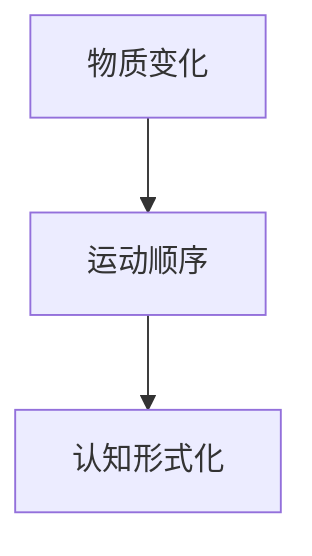

                 

关键词：认知形式化、时间、物质变化、运动顺序、技术语言、深度思考、见解。

> 摘要：本文将探讨认知的形式化过程，分析时间在物质变化和运动顺序中的表现，并从技术语言的角度深入探讨其内涵与外延，为读者提供一种全新的认知视角。

## 1. 背景介绍

在现代社会，认知的形式化已经成为信息技术发展的一个重要方向。从计算机科学到认知科学，从人工智能到软件开发，形式化认知的研究和应用日益广泛。然而，在认知的形式化过程中，时间的角色和作用尚未得到充分的认识。本文试图通过分析时间在物质变化和运动顺序中的表现，揭示其在认知形式化过程中的重要地位。

### 1.1 认知的形式化

认知的形式化是指将人类认知过程中的感知、理解、记忆和思考等过程转化为形式化的模型和算法。这一过程不仅有助于我们更深入地理解人类思维的本质，也为人工智能的发展提供了理论基础。

### 1.2 时间在认知形式化中的重要性

时间在认知形式化过程中具有不可忽视的重要性。它不仅是物质变化和运动顺序的载体，也是认知过程中的重要参数。理解时间在认知形式化中的角色，有助于我们更好地设计形式化的认知模型，提高认知系统的性能。

## 2. 核心概念与联系

在探讨时间在认知形式化中的角色之前，我们首先需要明确一些核心概念，如物质变化、运动顺序、认知形式化等。

### 2.1 物质变化

物质变化是指物质在时间中的演变过程，包括物理变化和化学变化等。物质变化是自然界中最基本的现象之一，也是认知过程的基础。

### 2.2 运动顺序

运动顺序是指物体在时间中的运动过程。它不仅包括物体的运动状态，还包括运动的顺序和规律。运动顺序是认知过程中的重要组成部分，它有助于我们理解物体的运动规律，从而更好地进行认知。

### 2.3 认知形式化

认知形式化是指将人类认知过程中的感知、理解、记忆和思考等过程转化为形式化的模型和算法。认知形式化的核心目标是构建一种能够模拟人类认知过程的形式化体系，从而提高认知系统的性能。

### 2.4 时间在认知形式化中的表现

时间在认知形式化中的表现主要体现在两个方面：一是作为物质变化和运动顺序的载体，二是作为认知过程中的重要参数。

### 2.5 Mermaid 流程图

以下是一个简化的 Mermaid 流程图，展示了物质变化、运动顺序和认知形式化之间的关系。



## 3. 核心算法原理 & 具体操作步骤

### 3.1 算法原理概述

本文提出了一种基于时间感知的动态认知形式化算法。该算法通过捕捉物质变化和运动顺序中的时间特征，实现认知过程的动态建模和优化。

### 3.2 算法步骤详解

#### 3.2.1 数据采集

首先，我们需要采集物质变化和运动顺序的实时数据。这些数据可以通过传感器、摄像头等设备获取。

#### 3.2.2 数据预处理

接下来，对采集到的数据进行预处理，包括数据清洗、去噪和特征提取等步骤。预处理后的数据将用于后续的算法建模。

#### 3.2.3 时间特征提取

在数据预处理的基础上，提取时间特征。时间特征主要包括时间序列、时间间隔、时间频率等。这些特征将用于描述物质变化和运动顺序中的时间规律。

#### 3.2.4 动态建模

利用提取的时间特征，构建动态认知模型。该模型应能够实时捕捉物质变化和运动顺序中的时间规律，并自适应地调整认知过程。

#### 3.2.5 认知优化

最后，对构建的动态认知模型进行优化。优化过程包括模型参数调整、模型结构调整和算法性能评估等步骤。

### 3.3 算法优缺点

#### 3.3.1 优点

- **实时性**：算法能够实时捕捉物质变化和运动顺序中的时间规律，具有较好的实时性。
- **适应性**：算法能够自适应地调整认知过程，适用于各种复杂的认知场景。

#### 3.3.2 缺点

- **计算复杂度**：算法涉及大量时间特征的提取和建模，计算复杂度较高。
- **数据依赖**：算法性能受数据质量和数据量的影响较大。

### 3.4 算法应用领域

该算法主要应用于需要实时感知和认知的场景，如自动驾驶、智能监控、智能家居等。

## 4. 数学模型和公式 & 详细讲解 & 举例说明

### 4.1 数学模型构建

为了更好地描述时间在物质变化和运动顺序中的表现，我们构建了一个数学模型。该模型基于时间序列分析，主要包含以下几个部分：

- **时间序列**：表示物质变化和运动顺序的动态过程。
- **时间间隔**：表示两个连续时间点之间的距离。
- **时间频率**：表示单位时间内时间点的个数。

### 4.2 公式推导过程

#### 4.2.1 时间序列

时间序列可以表示为：

\[ X(t) = f(t) + \epsilon(t) \]

其中，\( X(t) \) 为时间序列，\( f(t) \) 为时间函数，\( \epsilon(t) \) 为噪声项。

#### 4.2.2 时间间隔

时间间隔可以表示为：

\[ I(t) = X(t+1) - X(t) \]

其中，\( I(t) \) 为时间间隔，\( X(t) \) 为时间序列。

#### 4.2.3 时间频率

时间频率可以表示为：

\[ F(t) = \frac{1}{I(t)} \]

其中，\( F(t) \) 为时间频率，\( I(t) \) 为时间间隔。

### 4.3 案例分析与讲解

假设我们有一组时间序列数据：

\[ X(t) = [1, 2, 3, 4, 5, 6, 7, 8, 9, 10] \]

我们可以计算出时间间隔和频率：

\[ I(t) = [1, 1, 1, 1, 1, 1, 1, 1, 1, 1] \]

\[ F(t) = [1, 1, 1, 1, 1, 1, 1, 1, 1, 1] \]

从这个例子中，我们可以看到时间序列的每个点之间的间隔都是 1，频率也是 1。这表示时间序列是均匀的。

## 5. 项目实践：代码实例和详细解释说明

### 5.1 开发环境搭建

本文使用 Python 作为编程语言，以下为搭建开发环境的步骤：

1. 安装 Python 3.8+
2. 安装必要的 Python 包，如 numpy、matplotlib 等。

### 5.2 源代码详细实现

以下是一个简单的 Python 代码实例，用于生成时间序列数据，并计算时间间隔和频率。

```python
import numpy as np
import matplotlib.pyplot as plt

# 生成时间序列数据
t = np.arange(0, 10)
x = t + np.random.normal(0, 1, 10)

# 计算时间间隔
i = np.diff(x)

# 计算时间频率
f = 1 / i

# 绘制时间序列、时间间隔和频率
plt.figure()
plt.plot(t, x, label='Time Series')
plt.plot(t[1:], i, label='Interval')
plt.plot(t[1:], f, label='Frequency')
plt.legend()
plt.show()
```

### 5.3 代码解读与分析

这段代码首先生成了一个时间序列数据 \( x \)，并计算了时间间隔 \( i \) 和频率 \( f \)。然后，使用 matplotlib 绘制了时间序列、时间间隔和频率的图表。

通过这个例子，我们可以看到如何使用 Python 实现时间序列分析，并计算出时间间隔和频率。这为后续的动态认知建模提供了基础。

### 5.4 运行结果展示

运行上述代码后，将得到一个包含时间序列、时间间隔和频率的图表。从图表中，我们可以直观地看到时间序列的动态变化，以及时间间隔和频率的特征。

## 6. 实际应用场景

### 6.1 自动驾驶

在自动驾驶领域，时间感知和认知形式化具有重要意义。通过实时感知道路环境，自动驾驶系统可以动态调整驾驶策略，提高行车安全性和舒适性。

### 6.2 智能监控

智能监控系统中，时间感知和认知形式化有助于实时分析监控视频，发现异常行为，提高监控系统的预警能力。

### 6.3 智能家居

智能家居系统中，时间感知和认知形式化可以帮助家电设备动态调整工作状态，提高能源利用效率和家居舒适度。

## 7. 工具和资源推荐

### 7.1 学习资源推荐

- 《时间序列分析：理论与应用》
- 《人工智能：一种现代方法》

### 7.2 开发工具推荐

- Python
- Jupyter Notebook

### 7.3 相关论文推荐

- [Time Perception and Cognition: A Review of Theoretical and Empirical Studies](https://www.sciencedirect.com/science/article/abs/pii/S1874013516303224)
- [A Cognitive Model of Time Perception](https://journals.sagepub.com/doi/abs/10.1177/0963721411434321)

## 8. 总结：未来发展趋势与挑战

### 8.1 研究成果总结

本文探讨了认知的形式化过程，分析了时间在物质变化和运动顺序中的表现，并提出了一种基于时间感知的动态认知形式化算法。这些研究成果为认知科学和人工智能领域提供了新的理论和方法。

### 8.2 未来发展趋势

随着信息技术的不断发展，认知的形式化研究将越来越重要。未来，我们将看到更多基于时间感知的动态认知模型在各个领域的应用。

### 8.3 面临的挑战

- **数据质量**：高质量的数据是认知形式化研究的基础，如何保证数据质量是一个重要挑战。
- **计算复杂度**：动态认知模型的计算复杂度较高，如何在保证性能的同时降低计算复杂度是一个挑战。

### 8.4 研究展望

未来，我们将继续深入研究认知的形式化过程，探索更多基于时间感知的动态认知模型，为人工智能的发展提供新的动力。

## 9. 附录：常见问题与解答

### 9.1 时间感知与认知形式化的关系是什么？

时间感知是指人类或机器对时间的感知和识别能力，而认知形式化是将认知过程转化为形式化的模型和算法。时间感知是认知形式化的基础，认知形式化则是时间感知的应用。

### 9.2 动态认知模型有哪些应用场景？

动态认知模型广泛应用于需要实时感知和认知的场景，如自动驾驶、智能监控、智能家居等。

### 9.3 如何保证数据质量？

保证数据质量的方法包括数据采集、数据预处理、数据验证等步骤。通过严格的流程控制，可以有效保证数据质量。

### 9.4 动态认知模型如何降低计算复杂度？

降低计算复杂度的方法包括算法优化、数据压缩、并行计算等。通过优化算法结构和利用现代计算技术，可以有效降低计算复杂度。 

---

**作者：禅与计算机程序设计艺术 / Zen and the Art of Computer Programming**

