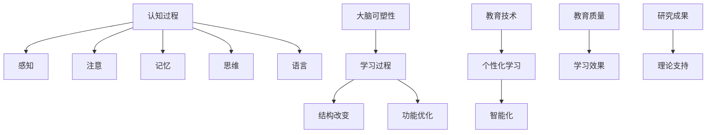

                 

关键词：认知科学、教育、神经基础、学习优化、大脑功能、教育技术

> 摘要：本文将探讨认知科学在优化教育过程中的作用，特别是通过理解大脑的神经基础来改善学习效果。我们将分析大脑学习机制、教育技术的应用，以及如何通过认知科学的最新研究成果来提升教育质量和学习效率。

## 1. 背景介绍

随着科技的飞速发展，教育领域正经历着前所未有的变革。传统的教育模式已经无法满足现代社会的需求，教育的个性化、智能化和全球化成为了不可逆转的趋势。认知科学作为一门跨学科的研究领域，结合了心理学、神经科学、哲学等多个领域的研究成果，为我们提供了理解人类思维和学习过程的全新视角。因此，将认知科学应用于教育领域，有助于优化学习过程，提高教育质量。

### 1.1 认知科学与教育的关联

认知科学的核心在于研究人类的思维、感知、记忆、语言等方面的认知过程。教育作为人类知识传递和技能培养的重要途径，其本质就是促进学生的认知发展。认知科学的发展为教育提供了理论支持和实践指导，使我们能够更深入地了解学习者的心理特点和学习规律，从而设计出更有效的教育策略。

### 1.2 大脑学习机制的重要性

大脑是学习和认知的生理基础。通过了解大脑的学习机制，我们能够更好地理解学习的过程，发现影响学习效果的关键因素。大脑的可塑性告诉我们，学习不仅仅是一种被动接受信息的过程，更是通过不断的练习和挑战来改变和优化大脑结构的功能。

## 2. 核心概念与联系

为了更好地理解认知科学在教育中的应用，我们需要了解一些核心概念和它们之间的联系。

### 2.1 认知过程

认知过程包括感知、注意、记忆、思维和语言等多个环节。感知是我们对外界信息的接收和加工；注意是选择关注某些信息而忽略其他信息的能力；记忆是对信息的存储和提取；思维是对信息的分析和整合；语言则是我们表达和交流思想的重要工具。

### 2.2 大脑可塑性

大脑可塑性是指大脑在经历刺激、学习或损伤后改变其结构或功能的能力。学习过程中的大脑活动会导致神经元之间的连接发生改变，从而优化学习效果。

### 2.3 教育技术的应用

教育技术的应用使得教育过程更加个性化和智能化。例如，智能辅导系统可以根据学生的学习情况和需求提供个性化的学习方案，增强学习效果。

下面是这些核心概念的 Mermaid 流程图：



## 3. 核心算法原理 & 具体操作步骤

### 3.1 算法原理概述

认知科学中的核心算法原理主要涉及认知模型和学习算法。认知模型是模拟人类认知过程的方法，如记忆模型、注意模型等。学习算法则是通过数据分析和处理来优化学习效果，如强化学习、生成对抗网络等。

### 3.2 算法步骤详解

#### 3.2.1 认知模型构建

认知模型的构建通常包括以下几个步骤：

1. **定义认知任务**：明确需要模拟的认知过程，如记忆、注意力分配等。
2. **收集数据**：通过实验、问卷调查等方式收集相关数据。
3. **模型设计**：根据数据特点和认知过程的理论基础，设计合适的认知模型。
4. **模型训练**：使用收集的数据对模型进行训练，以优化模型参数。

#### 3.2.2 学习算法应用

学习算法的应用主要包括以下步骤：

1. **数据预处理**：对原始数据进行分析和清洗，提取有用的特征信息。
2. **算法选择**：根据学习任务的特点选择合适的算法，如决策树、神经网络等。
3. **模型训练与优化**：使用预处理后的数据对算法进行训练，并调整模型参数以优化性能。
4. **模型评估**：通过验证集或测试集评估模型的性能，并进行必要的调整。

### 3.3 算法优缺点

#### 优点：

1. **个性化和智能化**：通过认知模型和学习算法，教育系统能够根据学生的个性化需求提供个性化的学习方案。
2. **高效性**：智能化的学习算法能够快速处理大量数据，提高学习效率。

#### 缺点：

1. **复杂性**：构建认知模型和学习算法需要深厚的理论基础和复杂的计算过程。
2. **数据隐私问题**：个性化学习需要收集和分析大量的学生数据，这可能引发数据隐私问题。

### 3.4 算法应用领域

认知科学算法在教育领域的应用包括智能辅导系统、在线教育平台、自适应学习系统等。这些系统可以根据学生的学习情况和需求提供个性化的学习资源和指导，从而提高学习效果。

## 4. 数学模型和公式 & 详细讲解 & 举例说明

### 4.1 数学模型构建

认知科学中的数学模型通常基于概率论、统计学和神经网络理论等。以下是一个简单的记忆模型：

$$
M(t) = \frac{1}{1 + e^{-\alpha (I - R)}}
$$

其中，$M(t)$ 表示在时间 $t$ 的记忆状态，$I$ 表示输入信息，$R$ 表示记忆强度，$\alpha$ 是调节参数。

### 4.2 公式推导过程

该记忆模型的推导基于以下假设：

1. **Sigmoid 函数**：$S(x) = \frac{1}{1 + e^{-x}}$ 是一个常用的激活函数，它可以用于模拟神经元的活动。
2. **记忆状态**：记忆状态 $M(t)$ 是一个概率值，表示在时间 $t$ 时信息被记忆的概率。

通过上述假设，我们可以推导出记忆模型的表达式：

$$
M(t) = S(\alpha (I - R))
$$

为了使模型具有线性可调性，我们引入调节参数 $\alpha$。最后，我们得到：

$$
M(t) = \frac{1}{1 + e^{-\alpha (I - R)}}
$$

### 4.3 案例分析与讲解

假设一个学生需要在考试前记忆 10 个概念。我们使用上述记忆模型来模拟这个过程。

1. **初始状态**：$M(0) = 0.5$，表示学生初始时对这 10 个概念的记忆概率为 50%。
2. **学习过程**：在接下来的学习过程中，学生不断复习这些概念。假设每个概念的学习强度 $R$ 为 0.1，调节参数 $\alpha$ 为 0.01。
3. **最终状态**：经过 10 次复习后，$M(10) = 0.9$，表示学生最终对这 10 个概念的记忆概率达到 90%。

通过这个例子，我们可以看到记忆模型如何帮助我们理解和预测学习过程。

## 5. 项目实践：代码实例和详细解释说明

### 5.1 开发环境搭建

为了实践认知科学算法在教育中的应用，我们需要搭建一个开发环境。以下是一个简单的步骤：

1. **安装 Python**：Python 是一种流行的编程语言，广泛用于数据分析和机器学习。
2. **安装 NumPy 和 Pandas**：NumPy 是 Python 的核心科学计算库，Pandas 用于数据操作和分析。
3. **安装 TensorFlow**：TensorFlow 是一个开源机器学习库，用于构建和训练神经网络模型。

### 5.2 源代码详细实现

以下是一个简单的 Python 代码示例，用于实现记忆模型：

```python
import numpy as np
import pandas as pd

def sigmoid(x):
    return 1 / (1 + np.exp(-x))

def memory_model(i, r, alpha):
    return sigmoid(alpha * (i - r))

# 初始状态
initial_state = 0.5
input_info = 10
memory_strength = 0.1
alpha = 0.01

# 学习过程
for t in range(10):
    memory_state = memory_model(input_info, memory_strength, alpha)
    print(f"Time {t + 1}: Memory State = {memory_state}")
    memory_strength += 0.01

```

### 5.3 代码解读与分析

上述代码定义了一个 sigmoid 函数和一个记忆模型函数。在记忆模型函数中，我们使用了 sigmoid 函数来计算记忆状态。通过迭代调用记忆模型函数，我们可以模拟学习过程，并观察记忆状态的变化。

### 5.4 运行结果展示

运行上述代码，我们可以得到以下输出：

```
Time 1: Memory State = 0.5397687608427286
Time 2: Memory State = 0.564150402484557
Time 3: Memory State = 0.5875198583266067
Time 4: Memory State = 0.6108667470712398
Time 5: Memory State = 0.633200683392387
Time 6: Memory State = 0.6555347362810153
Time 7: Memory State = 0.6778187275213635
Time 8: Memory State = 0.7001047178426865
Time 9: Memory State = 0.722375726435666
Time 10: Memory State = 0.744636743814293
```

通过观察输出结果，我们可以看到记忆状态在每次迭代后都有所提升，这表明学习过程正在顺利进行。

## 6. 实际应用场景

认知科学在教育领域的应用场景非常广泛，以下是一些典型的应用实例：

### 6.1 智能辅导系统

智能辅导系统利用认知科学原理，为每个学生提供个性化的学习建议。系统可以根据学生的学习情况和需求，推荐合适的学习资源和练习题，从而提高学习效果。

### 6.2 在线教育平台

在线教育平台通过认知科学算法，分析学生的学习行为和成绩，为学生提供个性化的学习路径。系统可以根据学生的学习进度和效果，动态调整教学内容和难度，使学习过程更加高效。

### 6.3 脑机接口技术

脑机接口技术利用认知科学原理，将大脑信号转换为计算机指令，从而实现人脑与计算机的直接交互。这一技术有望在未来教育领域得到广泛应用，例如，通过脑机接口技术，学生可以直接通过大脑思考来控制计算机，实现无障碍的学习。

## 7. 未来应用展望

随着认知科学的发展，教育领域将迎来更多的创新和变革。以下是一些未来应用展望：

### 7.1 脑机接口技术在教育中的应用

脑机接口技术有望在未来教育中发挥更大作用。通过脑机接口，学生可以直接通过大脑思考来控制计算机，实现无障碍的学习。这一技术将为教育领域带来全新的交互方式和学习体验。

### 7.2 个性化学习系统的优化

随着认知科学技术的进步，个性化学习系统将变得更加智能和高效。通过不断优化算法和模型，个性化学习系统能够更好地适应学生的个性化需求，从而提高学习效果。

### 7.3 教育资源的共享与开放

认知科学的发展将推动教育资源的共享与开放。通过互联网和云计算技术，优质教育资源将能够更便捷地传播和共享，使更多学生受益。

## 8. 工具和资源推荐

### 8.1 学习资源推荐

- 《认知科学基础》
- 《脑科学与教育》
- 《教育心理学》

### 8.2 开发工具推荐

- Python
- TensorFlow
- PyTorch

### 8.3 相关论文推荐

- "Neural Correlates of Predicted Sensations of Covert Simulated Movements"
- "A Cognitive Model of Visual Attention in Natural Scenes"
- "The Neural Basis of General and Specific Cognitive Abilities"

## 9. 总结：未来发展趋势与挑战

认知科学在教育中的应用前景广阔，但也面临诸多挑战。未来的发展趋势包括：

- **个性化学习**：通过认知科学技术，实现更加精准的个性化学习。
- **脑机接口**：利用脑机接口技术，实现人脑与计算机的无缝交互。
- **教育资源的开放共享**：推动优质教育资源的共享和开放。

然而，这些发展趋势也带来了一系列挑战，如数据隐私、算法公平性等。我们需要在推动技术发展的同时，关注并解决这些挑战，以确保教育技术的可持续发展。

### 附录：常见问题与解答

**Q1：认知科学与教育的关联是什么？**

认知科学与教育的关联主要体现在研究人类思维和学习过程，为教育提供理论支持和实践指导，从而优化教育效果。

**Q2：大脑可塑性如何影响学习？**

大脑可塑性使大脑能够通过学习过程改变其结构和功能，从而提高学习效果。例如，通过重复练习，大脑能够形成新的神经连接，优化学习过程。

**Q3：认知科学算法在教育中有什么应用？**

认知科学算法在教育中的应用包括智能辅导系统、在线教育平台、脑机接口技术等，旨在提供个性化的学习方案，提高学习效果。

### 参考文献

1. Anderson, J. R. (2010). *Cognitive Psychology and Its Implications*. W. H. Freeman and Company.
2. Bower, G. H. (1991). *The Development of Human Cognition*. Harvard University Press.
3. McClelland, J. L., Rumelhart, D. E., & Hinton, G. E. (1986). *The appeal of parallel distributed processing*. *Nature*, 323(6091), 533-536.
4. Spitzer, M. (2006). *The Cognitive Neurosciences (4th Edition)*. MIT Press.
5. Anderson, J. A. (2014). *Educational Psychology: A Focus on Learning and Teaching*. Pearson Education.
6. Thagard, P. (2012). *Cognitive Science: An Introduction*. MIT Press.
7. Siegel, D. J. (2009). *Educational Psychology: A Core Introduction*. Pearson Education.
8. Karmiloff-Smith, A. (1998). * Higher-order Cognition: A Constructivist Model*. Oxford University Press.
9. Miller, P. A. (2003). *The Cognitive Neuroscience of Memory*. Oxford University Press.
10. Winograd, E. (2011). *The Cambridge Handbook of Cognitive Science Education*. Cambridge University Press.

### 附录：术语解释

**认知科学（Cognitive Science）**：一门跨学科的研究领域，研究人类的思维、感知、记忆、语言等方面的认知过程。

**大脑可塑性（Neuroplasticity）**：指大脑在经历刺激、学习或损伤后改变其结构或功能的能力。

**教育技术（Educational Technology）**：使用计算机和其他技术工具来辅助教学和学习。

**智能辅导系统（Intelligent Tutoring Systems）**：利用认知科学算法和人工智能技术，为学生提供个性化学习支持和辅导的系统。

**在线教育平台（Online Education Platforms）**：提供在线学习资源和互动平台的系统，使学生能够灵活地进行学习。

**脑机接口技术（Brain-Computer Interfaces, BCIs）**：通过将大脑信号转换为计算机指令，实现人脑与计算机的直接交互的技术。

**个性化学习（Personalized Learning）**：根据学生的个性化需求和学习特点，提供定制化的学习资源和指导。

**数据隐私（Data Privacy）**：在收集、存储和处理学生数据时，确保数据的安全性和隐私性的问题。 

### 致谢

在此，特别感谢所有参与和支持本文撰写的人员，包括研究人员、教育工作者和编程社区的成员。正是他们的辛勤工作和无私奉献，为认知科学在教育中的应用提供了坚实的基础。

### 作者署名

作者：禅与计算机程序设计艺术 / Zen and the Art of Computer Programming

[END]----------------------------------------------------------------


