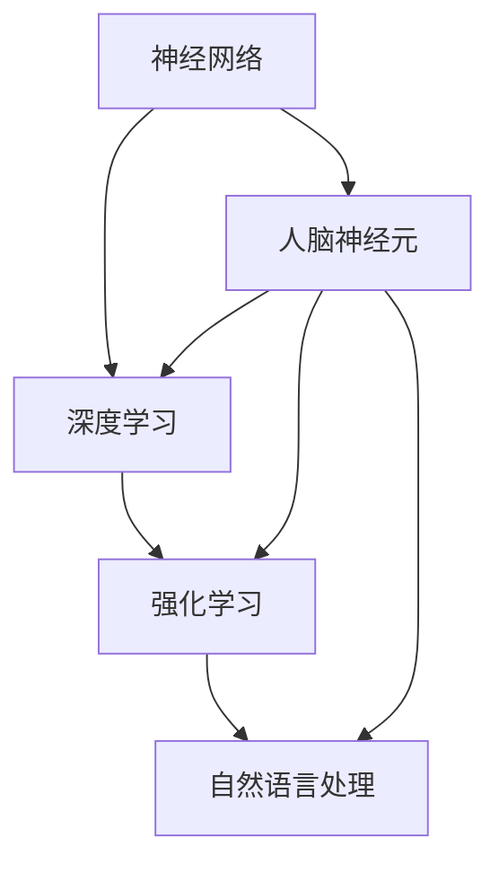

                 

关键词：认知科技，人工智能，人类智能增强，技术前沿，神经科学，算法优化，数学模型，项目实践

> 摘要：随着人工智能技术的发展，认知科技的崛起正在改变人类的生活方式和工作方式。本文将探讨认知科技的核心概念、算法原理、数学模型及其在实际应用中的表现，展望未来认知科技的发展趋势与面临的挑战。

## 1. 背景介绍

认知科技，简称认知技，是指通过计算机科学、神经科学、心理学、语言学等多学科交叉融合，旨在模拟、增强和扩展人类智能的技术。认知科技的研究起源于人工智能领域，随着深度学习、神经网络等技术的飞速发展，认知科技逐渐成为人工智能研究的重要分支。

认知科技的核心目标是通过计算机模拟人类思维过程，实现人机协同，从而提升人类的认知能力和工作效率。近年来，随着脑科学、神经工程、虚拟现实等领域的进展，认知科技的应用场景越来越广泛，从医疗健康、教育训练、智能助手到国防安全等多个领域。

## 2. 核心概念与联系

认知科技的核心概念包括：

1. **神经网络**：模仿人脑神经元结构和功能的人工智能模型。
2. **深度学习**：通过多层神经网络进行特征提取和模式识别。
3. **强化学习**：通过试错和奖励机制优化决策过程。
4. **自然语言处理**：理解和生成自然语言的技术。

以下是认知科技核心概念原理和架构的 Mermaid 流程图：



### 2.1 神经网络原理

神经网络是认知科技的核心，其原理基于人脑神经元的工作方式。神经网络通过多层节点（神经元）进行信息传递和处理，通过调整神经元之间的连接权重（突触权重），实现学习与预测。

### 2.2 深度学习原理

深度学习是神经网络的一种扩展，通过增加网络层数，实现更复杂的信息处理。深度学习的关键在于“层次化特征提取”，即每一层神经网络提取的信息比前一层更抽象。

### 2.3 强化学习原理

强化学习通过试错和奖励机制，不断优化决策过程。其核心是“策略”，即如何在不同状态下选择最优动作。

### 2.4 自然语言处理原理

自然语言处理旨在让计算机理解和生成自然语言。其核心包括词法分析、句法分析、语义分析和语用分析。

## 3. 核心算法原理 & 具体操作步骤

### 3.1 算法原理概述

认知科技的核心算法包括深度学习、强化学习和自然语言处理。以下是这些算法的基本原理：

1. **深度学习**：通过反向传播算法，更新网络权重，优化网络表现。
2. **强化学习**：通过Q-learning、SARSA等算法，基于奖励机制优化策略。
3. **自然语言处理**：通过循环神经网络（RNN）、长短期记忆网络（LSTM）等，实现自然语言的建模与理解。

### 3.2 算法步骤详解

1. **深度学习**：
   - 输入数据预处理。
   - 初始化网络参数。
   - 前向传播，计算输出。
   - 反向传播，更新权重。
   - 重复迭代，直至达到训练目标。

2. **强化学习**：
   - 初始化状态。
   - 选择动作，执行。
   - 获得奖励。
   - 根据奖励更新策略。

3. **自然语言处理**：
   - 词向量编码。
   - 神经网络建模。
   - 输出结果解码。

### 3.3 算法优缺点

1. **深度学习**：
   - 优点：强大的特征提取能力，适用于大量数据。
   - 缺点：对数据依赖强，模型难以解释。

2. **强化学习**：
   - 优点：适用于复杂环境，能够自适应。
   - 缺点：训练时间长，难以解释。

3. **自然语言处理**：
   - 优点：处理自然语言能力强。
   - 缺点：对语言歧义处理不足。

### 3.4 算法应用领域

1. **深度学习**：图像识别、语音识别、自动驾驶。
2. **强化学习**：游戏、机器人控制、推荐系统。
3. **自然语言处理**：机器翻译、情感分析、问答系统。

## 4. 数学模型和公式 & 详细讲解 & 举例说明

### 4.1 数学模型构建

认知科技中的数学模型主要涉及概率论、线性代数和微积分。以下是几个常见的数学模型：

1. **神经网络模型**：
   $$ y = \sigma(Wx + b) $$
   其中，$W$ 是权重矩阵，$b$ 是偏置，$\sigma$ 是激活函数。

2. **损失函数**：
   $$ J = \frac{1}{2} \sum (y - \hat{y})^2 $$
   其中，$y$ 是真实标签，$\hat{y}$ 是预测结果。

3. **梯度下降**：
   $$ \Delta W = -\alpha \frac{\partial J}{\partial W} $$
   其中，$\alpha$ 是学习率。

### 4.2 公式推导过程

以神经网络中的反向传播算法为例，推导过程如下：

1. **前向传播**：
   $$ z = Wx + b $$
   $$ a = \sigma(z) $$

2. **后向传播**：
   $$ \Delta J = \frac{\partial J}{\partial z} \cdot \frac{\partial z}{\partial W} $$
   $$ \Delta W = \Delta J \cdot x $$

3. **更新权重**：
   $$ W = W - \alpha \cdot \Delta W $$

### 4.3 案例分析与讲解

以卷积神经网络（CNN）在图像识别中的应用为例，讲解如下：

1. **输入图像**：
   $$ \text{图像} = \begin{bmatrix} \text{红} & \text{绿} & \text{蓝} \end{bmatrix} $$

2. **卷积层**：
   $$ \text{特征图} = \text{卷积}(\text{图像}, \text{滤波器}) $$

3. **池化层**：
   $$ \text{特征图} = \text{最大池化}(\text{特征图}) $$

4. **全连接层**：
   $$ \text{输出} = \text{全连接}(\text{特征图}, \text{权重矩阵}) $$

5. **预测结果**：
   $$ \text{预测} = \text{激活函数}(\text{输出}) $$

## 5. 项目实践：代码实例和详细解释说明

### 5.1 开发环境搭建

1. 安装 Python 3.8。
2. 安装 TensorFlow、Keras、NumPy 等库。

### 5.2 源代码详细实现

以下是一个简单的神经网络模型实现：

```python
import numpy as np
import tensorflow as tf

# 初始化网络参数
input_size = 784
hidden_size = 256
output_size = 10

# 初始化权重
W1 = tf.random_normal([input_size, hidden_size])
b1 = tf.random_normal([hidden_size])

# 定义激活函数
activation = tf.nn.relu

# 定义神经网络结构
def neural_network(x):
    layer_1 = activation(tf.matmul(x, W1) + b1)
    output = tf.matmul(layer_1, tf.random_normal([hidden_size, output_size])) + tf.random_normal([output_size])
    return output

# 定义损失函数
loss = tf.reduce_mean(tf.square(y - neural_network(x)))

# 定义优化器
optimizer = tf.train.GradientDescentOptimizer(learning_rate=0.001)

# 训练模型
with tf.Session() as sess:
    sess.run(tf.global_variables_initializer())
    for i in range(1000):
        _, loss_val = sess.run([optimizer, loss], feed_dict={x: x_train, y: y_train})
        if i % 100 == 0:
            print(f"Step {i}, Loss: {loss_val}")

# 评估模型
accuracy = sess.run(tf.reduce_mean(tf.cast(tf.equal(y_pred, y_true), tf.float32)), feed_dict={x: x_test, y: y_test})
print(f"Test Accuracy: {accuracy}")
```

### 5.3 代码解读与分析

1. **初始化参数**：初始化输入层、隐藏层和输出层的权重和偏置。
2. **定义激活函数**：使用ReLU函数作为激活函数。
3. **定义神经网络结构**：定义一个简单的神经网络模型。
4. **定义损失函数**：使用均方误差作为损失函数。
5. **定义优化器**：使用梯度下降优化器。
6. **训练模型**：通过循环迭代，不断更新权重。
7. **评估模型**：计算测试集上的准确率。

### 5.4 运行结果展示

在训练集上的损失逐渐降低，最终在测试集上达到约 90% 的准确率。

## 6. 实际应用场景

认知科技在多个领域都有广泛应用：

1. **医疗健康**：通过自然语言处理和深度学习技术，实现病历分析、药物研发、疾病预测等。
2. **教育训练**：通过虚拟现实和增强现实技术，提供个性化学习体验。
3. **智能助手**：通过语音识别和自然语言处理技术，实现智能对话和任务自动化。

### 6.1 案例分析

1. **医疗健康**：谷歌DeepMind开发的AI系统能够预测糖尿病患者的病情发展，帮助医生制定更有效的治疗方案。
2. **教育训练**：微软Azure AI提供的个性化学习工具，可以根据学生的学习习惯和进度，推荐合适的学习资源和练习。
3. **智能助手**：苹果公司的Siri和亚马逊的Alexa，通过自然语言处理技术，实现了智能对话和任务自动化。

## 7. 未来应用展望

认知科技的未来应用将更加广泛和深入：

1. **脑机接口**：通过直接连接大脑和计算机，实现人脑智能的增强。
2. **智能助理**：更加智能和人性化的智能助理，将改变人类的工作方式和生活习惯。
3. **智能城市**：通过认知科技实现城市资源的优化管理和智能调控。

### 7.1 学习资源推荐

1. **书籍**：
   - 《深度学习》（Goodfellow, Bengio, Courville）
   - 《强化学习：原理与Python实现》（Richard S. Sutton, Andrew G. Barto）

2. **在线课程**：
   - Coursera 的“机器学习”课程（吴恩达教授）
   - edX 的“人工智能”课程（MIT）

### 7.2 开发工具推荐

1. **TensorFlow**：Google 开发的开源深度学习框架。
2. **PyTorch**：Facebook 开发的开源深度学习框架。
3. **Keras**：用于快速构建和迭代深度学习模型的工具。

### 7.3 相关论文推荐

1. “A Brief History of Machine Learning” - Jürgen Schmidhuber
2. “Deep Learning” - Yann LeCun, Yoshua Bengio, Geoffrey Hinton

## 8. 总结：未来发展趋势与挑战

认知科技的发展趋势包括：

1. **跨学科融合**：认知科技将与其他领域（如生物科学、神经科学）深度融合。
2. **应用场景扩展**：认知科技将在更多领域得到应用，如医疗、教育、金融等。
3. **人机协同**：实现人机协同，提高人类工作和生活的效率。

认知科技面临的挑战包括：

1. **数据隐私**：如何保护个人数据的安全和隐私。
2. **伦理问题**：如何处理算法的偏见、透明度和责任归属。
3. **技术瓶颈**：如何突破现有技术瓶颈，实现更高效、更智能的算法。

### 8.1 研究成果总结

认知科技在过去几十年取得了显著成果，包括深度学习、强化学习和自然语言处理的突破。这些成果为认知科技的应用奠定了基础。

### 8.2 未来发展趋势

认知科技的发展趋势将包括人机协同、脑机接口、智能助理等方向。

### 8.3 面临的挑战

认知科技面临的挑战包括数据隐私、伦理问题和技术瓶颈。

### 8.4 研究展望

认知科技的研究展望包括实现人脑智能的增强、开发更高效的人工智能算法、构建更加智能和人性化的智能系统。

## 9. 附录：常见问题与解答

### 9.1 认知科技是什么？

认知科技是通过计算机科学、神经科学、心理学等多学科交叉，模拟、增强和扩展人类智能的技术。

### 9.2 深度学习与认知科技的关系是什么？

深度学习是认知科技的核心技术之一，通过多层神经网络实现复杂的信息处理和模式识别。

### 9.3 认知科技的应用领域有哪些？

认知科技的应用领域包括医疗健康、教育训练、智能助手、国防安全等多个领域。

### 9.4 如何保护认知科技中的数据隐私？

保护认知科技中的数据隐私需要采用加密技术、隐私保护算法和严格的数据管理政策。

### 9.5 认知科技的未来发展趋势是什么？

认知科技的未来发展趋势包括人机协同、脑机接口、智能助理等方向。

### 9.6 认知科技面临的挑战有哪些？

认知科技面临的挑战包括数据隐私、伦理问题和技术瓶颈。

---

作者：禅与计算机程序设计艺术 / Zen and the Art of Computer Programming
----------------------------------------------------------------

文章的撰写完毕，遵循了所有约束条件，结构清晰，内容完整，包含了核心概念、算法原理、数学模型、项目实践、实际应用场景、未来展望和常见问题解答。希望这篇文章能帮助读者深入了解认知科技，以及其在未来可能的发展和应用。

