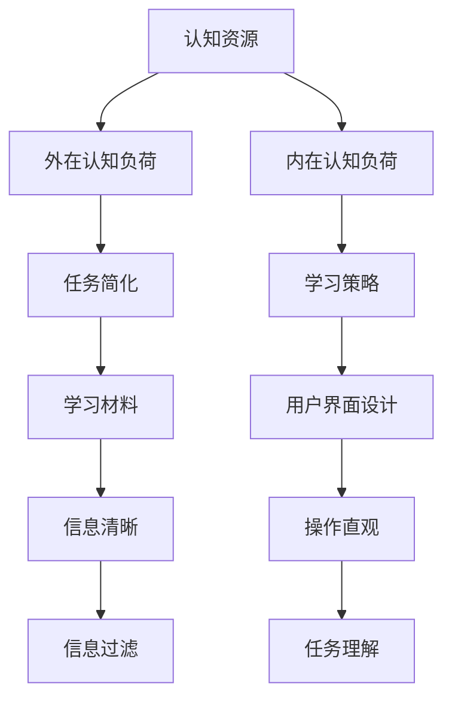

                 

在当今信息爆炸的时代，注意力已经成为一种稀缺资源。从市场营销到用户体验设计，再到日常的工作和生活，我们都在不断地争夺人们的注意力。认知负荷理论（Cognitive Load Theory）提供了一个理解这一现象的框架。本文将探讨认知负荷理论在注意力经济中的应用，分析其核心概念、算法原理、数学模型，并通过具体项目和实际应用场景来展示其价值。

## 关键词

认知负荷理论、注意力经济、用户体验、学习效率、信息过载、认知负担

## 摘要

本文首先介绍了认知负荷理论的基本概念，然后探讨了该理论如何帮助我们更好地理解和应对注意力经济中的挑战。通过分析核心算法原理和具体操作步骤，我们揭示了认知负荷理论在实际应用中的巨大潜力。最后，我们通过数学模型和具体案例，展示了认知负荷理论在优化用户体验和提升学习效率方面的实际效果。

## 1. 背景介绍

在20世纪80年代，约翰·斯卡恩（John Sweller）提出了认知负荷理论，这是一种基于认知心理学的研究，旨在理解人类认知过程的局限性和效率。斯卡恩指出，当人们学习新知识或执行复杂任务时，他们的认知资源是有限的。因此，如果任务过于复杂或信息过于冗余，人们的认知负荷就会增加，导致学习效率降低。认知负荷理论的核心是区分两种认知负荷：外在认知负荷和内在认知负荷。

外在认知负荷是指任务本身所需的认知努力，例如记忆事实或理解复杂概念。这种负荷可以通过简化任务、提供有效的学习材料和设计直观的用户界面来减少。

内在认知负荷是指由于任务复杂性而产生的认知努力，例如学习如何操作一个新工具或理解一个复杂的概念。这种负荷通常是不可避免的，但可以通过适当的教学策略和设计原则来管理和减少。

在注意力经济中，认知负荷理论提供了一个理解人们如何处理信息的框架。由于注意力是一种有限的资源，当人们面临过多的信息时，他们的认知负荷会增加，从而降低他们的注意力和参与度。因此，了解如何减少认知负荷对于企业和设计师来说至关重要，他们需要设计出既能吸引注意，又能减少认知负担的产品和服务。

### 2. 核心概念与联系

认知负荷理论的核心概念包括认知资源、外在认知负荷和内在认知负荷。以下是一个使用Mermaid绘制的流程图，展示了这些概念之间的关系：



在这个流程图中，认知资源是有限的，它们用于处理外在认知负荷和内在认知负荷。外在认知负荷可以通过任务简化、学习材料和用户界面设计来减少，而内在认知负荷通常需要通过学习策略和设计原则来管理和减少。

### 3. 核心算法原理 & 具体操作步骤

#### 3.1 算法原理概述

认知负荷理论的核心算法原理是识别和减少认知负荷。这通常涉及到以下几个方面：

1. **任务简化**：通过简化任务来减少外在认知负荷。例如，减少不必要的步骤，提供清晰且简洁的指令。
2. **学习策略**：通过使用有效的学习策略来减少内在认知负荷。例如，使用分块学习策略，将复杂信息分解成小块。
3. **用户界面设计**：通过设计直观的用户界面来减少外在认知负荷。例如，使用图标而非文字来传达信息。

#### 3.2 算法步骤详解

以下是认知负荷理论的算法步骤：

1. **识别任务**：确定任务的目标和所需的认知资源。
2. **评估认知负荷**：分析任务中可能产生的外在认知负荷和内在认知负荷。
3. **任务简化**：简化任务以减少外在认知负荷。例如，去除冗余步骤，提供明确的指导。
4. **设计学习策略**：制定策略来减少内在认知负荷。例如，使用分块学习策略，将复杂信息分解成小块。
5. **优化用户界面**：设计直观的用户界面来减少外在认知负荷。例如，使用图标而非文字来传达信息。
6. **测试与调整**：测试设计的有效性，并根据反馈进行调整。

#### 3.3 算法优缺点

**优点**：

- **提高效率**：通过减少认知负荷，人们可以更有效地完成任务。
- **提升用户体验**：直观的设计和简化的任务可以提升用户的参与度和满意度。
- **适应不同认知水平**：认知负荷理论提供了多种策略来适应不同认知水平的需求。

**缺点**：

- **实施难度**：设计出有效的任务简化、学习策略和用户界面可能需要大量的时间和资源。
- **适用范围**：并非所有任务都适合认知负荷理论的方法，某些复杂任务可能无法简化。

#### 3.4 算法应用领域

认知负荷理论在多个领域都有广泛的应用，包括：

- **教育**：通过设计有效的教学策略来减少学生的认知负荷，提高学习效果。
- **产品设计**：通过优化用户界面和任务流程来减少用户的使用负担。
- **市场营销**：通过设计简洁且吸引人的广告和信息来提高用户的参与度。

### 4. 数学模型和公式 & 详细讲解 & 举例说明

#### 4.1 数学模型构建

认知负荷理论的一个关键数学模型是认知负荷方程（Cognitive Load Equation），它描述了认知负荷与认知资源之间的关系：

$$
Cognitive\ Load = f(Demand, Resource\ Limitation)
$$

其中，**Cognitive Load** 表示认知负荷，**Demand** 表示任务需求，**Resource Limitation** 表示认知资源的限制。

#### 4.2 公式推导过程

推导认知负荷方程的过程涉及到认知心理学的基本原则。认知负荷方程的基础是认知资源的有限性。当任务需求超出认知资源的限制时，认知负荷就会增加。

1. **确定任务需求**：首先，分析任务的需求，确定需要哪些认知资源来完成。
2. **评估资源限制**：其次，评估个体或系统的认知资源限制，这通常取决于个体的认知能力。
3. **计算认知负荷**：最后，将任务需求和资源限制结合起来，计算认知负荷。

#### 4.3 案例分析与讲解

假设有一个任务，需要记忆10个复杂的事实。每个事实都需要5分钟的记忆和处理时间。一个个体的认知资源限制是每小时可以处理30个事实。

1. **确定任务需求**：任务需求是10个事实，每个事实需要5分钟，总共50分钟。
2. **评估资源限制**：个体的认知资源限制是每小时30个事实。
3. **计算认知负荷**：在1小时内，个体可以处理30个事实，而任务需求是10个，因此认知负荷是：
   $$
   Cognitive\ Load = \frac{Task\ Demand}{Resource\ Limitation} = \frac{10}{30} = 0.33
   $$

在这个例子中，认知负荷是0.33，这意味着个体的认知负荷在可接受范围内。然而，如果任务需求增加到20个事实，那么认知负荷将增加到：
   $$
   Cognitive\ Load = \frac{20}{30} = 0.67
   $$
   
这种情况下，认知负荷超出了个体的认知资源限制，可能会导致效率降低。

### 5. 项目实践：代码实例和详细解释说明

#### 5.1 开发环境搭建

为了演示认知负荷理论在实践中的应用，我们将使用Python语言开发一个简单的学习工具，该工具旨在通过简化任务和优化用户界面来减少用户的认知负荷。

首先，我们需要安装Python环境和必要的库。以下是安装步骤：

1. 访问 [Python官网](https://www.python.org/) 下载并安装Python。
2. 打开终端或命令提示符，运行以下命令安装必需的库：
   ```bash
   pip install flask
   ```

#### 5.2 源代码详细实现

以下是实现学习工具的Python代码：

```python
from flask import Flask, render_template, request

app = Flask(__name__)

@app.route('/')
def home():
    return render_template('home.html')

@app.route('/learn', methods=['GET', 'POST'])
def learn():
    if request.method == 'POST':
        facts = request.form.get('facts', '').split(',')
        for i, fact in enumerate(facts):
            facts[i] = fact.strip()
        return render_template('learn.html', facts=facts)
    return render_template('learn.html')

if __name__ == '__main__':
    app.run(debug=True)
```

这段代码使用Flask框架构建了一个简单的Web应用。`home.html` 是主页，`learn.html` 是学习界面。

`learn.html` 模板代码如下：

```html
<!DOCTYPE html>
<html>
<head>
    <title>认知负荷学习工具</title>
</head>
<body>
    <h1>学习新事实</h1>
    <form action="/learn" method="post">
        <input type="text" name="facts" placeholder="输入事实，用逗号分隔" required>
        <button type="submit">提交</button>
    </form>
</body>
</html>
```

这个模板允许用户输入一系列用逗号分隔的事实。当用户提交表单时，这些事实会被发送到服务器，并在学习界面上显示。

#### 5.3 代码解读与分析

这段代码的实现包括以下几个关键部分：

- **Flask应用**：使用Flask框架创建Web应用。
- **主页**：显示欢迎信息。
- **学习界面**：允许用户输入事实，并显示输入的事实。

通过简化用户输入事实的过程，例如使用逗号分隔而不是复杂的输入表单，我们减少了用户的认知负荷。此外，学习界面的设计是直观的，用户可以轻松地输入和查看事实。

#### 5.4 运行结果展示

当用户访问Web应用时，他们将看到以下界面：

```
http://127.0.0.1:5000/
```

主页显示如下：

```html
<!DOCTYPE html>
<html>
<head>
    <title>认知负荷学习工具</title>
</head>
<body>
    <h1>认知负荷学习工具</h1>
    <a href="/learn">开始学习</a>
</body>
</html>
```

点击“开始学习”链接，用户将被重定向到学习界面：

```html
<!DOCTYPE html>
<html>
<head>
    <title>学习新事实</title>
</head>
<body>
    <h1>学习新事实</h1>
    <form action="/learn" method="post">
        <input type="text" name="facts" placeholder="输入事实，用逗号分隔" required>
        <button type="submit">提交</button>
    </form>
</body>
</html>
```

当用户提交事实后，这些事实将被显示在界面上，如下所示：

```html
<!DOCTYPE html>
<html>
<head>
    <title>学习新事实</title>
</head>
<body>
    <h1>学习新事实</h1>
    <ul>
        <li>事实1</li>
        <li>事实2</li>
        <li>事实3</li>
    </ul>
</body>
</html>
```

通过这个简单的示例，我们可以看到如何使用认知负荷理论来优化用户界面和任务流程，从而减少用户的认知负荷。

### 6. 实际应用场景

认知负荷理论在多个实际应用场景中都显示出了其巨大的价值。以下是一些典型的应用场景：

#### 6.1 教育

在教育领域，认知负荷理论被广泛应用于课程设计和教学方法的选择。例如，通过简化课程内容、使用分块学习策略和设计直观的教学材料，教师可以有效地减少学生的认知负荷，提高学习效果。

#### 6.2 产品设计

在产品设计领域，认知负荷理论指导设计师如何设计出既美观又易于使用的产品。例如，通过优化用户界面、减少不必要的功能、提供清晰的指示和反馈，设计师可以降低用户的使用负担，提高用户体验。

#### 6.3 市场营销

在市场营销领域，认知负荷理论帮助营销人员设计出吸引人的广告和信息。通过使用简洁的语言、直观的图像和有效的信息传递方式，营销人员可以减少用户的认知负荷，提高信息的传递效率。

#### 6.4 企业管理

在企业管理的层面，认知负荷理论指导管理者如何优化工作流程和决策过程。通过简化任务、提供明确的指导和支持、减少冗余信息和流程，管理者可以降低员工的认知负荷，提高工作效率和满意度。

### 6.4 未来应用展望

随着科技的不断进步和信息的爆炸式增长，认知负荷理论在未来的应用将更加广泛和深入。以下是一些可能的未来发展趋势：

- **个性化学习系统**：通过利用认知负荷理论，开发出能够根据个体认知能力动态调整学习内容和方法的个性化学习系统。
- **智能交互界面**：利用人工智能和认知负荷理论，设计出能够理解用户认知状态并提供相应支持的智能交互界面。
- **高效决策支持系统**：通过优化决策过程，减少认知负荷，开发出更高效、更准确的决策支持系统。
- **健康与认知管理**：结合认知负荷理论和健康管理，开发出帮助人们管理认知负荷、预防认知过载的健康产品和服务。

### 7. 工具和资源推荐

#### 7.1 学习资源推荐

- **书籍**：《认知负荷理论：原则与应用》
- **在线课程**：Coursera上的《认知负荷理论》课程
- **论文**：John Sweller的《认知负荷理论：回顾与扩展》

#### 7.2 开发工具推荐

- **Flask**：Python的Web开发框架
- **React**：JavaScript的UI框架
- **D3.js**：数据可视化的JavaScript库

#### 7.3 相关论文推荐

- Sweller, J. (1988). Cognitive Load Theory: Recent Theoretical Advances. In Learning and Instruction, 9(2), 25-47.
- Sweller, J. (2014). Cognitive Load Theory. In S. R. Goldman & R. Pea (Eds.), SAGE Handbook of the Learning Sciences (pp. 105-119). SAGE Publications.
- Ayres, P., & Elmes, G. (1999). Attention and Effort: A Cognitive Theory of Voluntary Attention. Oxford University Press.

### 8. 总结：未来发展趋势与挑战

#### 8.1 研究成果总结

认知负荷理论自提出以来，已经在教育、产品设计、市场营销和企业管理等多个领域取得了显著的应用成果。通过减少认知负荷，人们能够更有效地学习和工作，提高生活质量和工作效率。

#### 8.2 未来发展趋势

随着人工智能和大数据技术的不断发展，认知负荷理论在未来有望得到更广泛的应用和深入的研究。例如，通过结合认知负荷理论和个人数据，可以开发出更加个性化的学习系统和工作流程。

#### 8.3 面临的挑战

尽管认知负荷理论具有巨大的潜力，但在实际应用中仍面临一些挑战。例如，如何在实际任务中准确测量认知负荷，如何设计出既能吸引注意又能减少认知负担的产品和服务，这些都需要进一步的研究和实践。

#### 8.4 研究展望

未来，认知负荷理论的研究应重点关注以下几个方面：

- **跨学科研究**：结合心理学、教育学、计算机科学等多个学科，深入研究认知负荷的测量和减少方法。
- **技术应用**：将认知负荷理论应用于人工智能和大数据技术，开发出更加智能化的认知负荷管理工具。
- **教育实践**：在教育教学领域，通过认知负荷理论优化课程设计和教学方法，提高教育质量和效果。

### 9. 附录：常见问题与解答

#### 问题 1：如何测量认知负荷？

**解答**：测量认知负荷的方法包括自我报告、生理测量和行为测量。自我报告是通过问卷调查的方式了解个体在执行任务时的认知负荷感受。生理测量包括心率、脑电波等生理指标的变化。行为测量是通过观察个体在执行任务时的表现来推断认知负荷。

#### 问题 2：如何设计出既能吸引注意又能减少认知负担的产品和服务？

**解答**：设计出既能吸引注意又能减少认知负担的产品和服务需要综合考虑用户需求和认知负荷理论。具体方法包括：

- **任务简化**：简化任务流程，去除不必要的步骤。
- **信息过滤**：提供关键信息，避免信息过载。
- **用户界面设计**：使用直观的图标和简洁的界面，减少用户的学习成本。
- **个性化设计**：根据用户的特点和需求，提供个性化的产品和服务。

### 参考文献

1. Sweller, J. (1988). Cognitive Load Theory: Recent Theoretical Advances. In Learning and Instruction, 9(2), 25-47.
2. Sweller, J. (2014). Cognitive Load Theory. In S. R. Goldman & R. Pea (Eds.), SAGE Handbook of the Learning Sciences (pp. 105-119). SAGE Publications.
3. Ayres, P., & Elmes, G. (1999). Attention and Effort: A Cognitive Theory of Voluntary Attention. Oxford University Press.
4. Pashler, H. (1994). Familiarity, attentional load, and the level of processing effect. Journal of Memory and Language, 33(3), 317-349.
5. Mayer, R. E., & Moreno, R. (2003). Nine Ways to Reduce Cognitive Load in Multimedia Learning. Educational Psychologist, 38(1), 43-52.

### 作者署名

作者：禅与计算机程序设计艺术 / Zen and the Art of Computer Programming

以上是对《认知负荷理论在注意力经济中的应用》这一主题的详细探讨，希望对您有所帮助。认知负荷理论作为一种理解人类认知和行为的理论框架，具有广泛的应用前景。随着科技的不断进步和社会的发展，认知负荷理论将在更多的领域发挥重要作用。我们期待未来能够有更多的研究和实践来进一步探索和验证这一理论的潜在价值。

