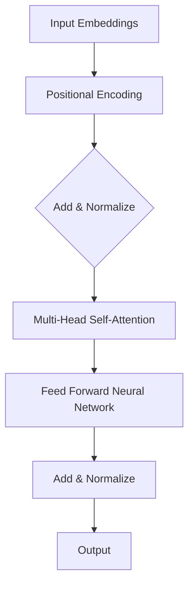

                 

关键词：Transformer，深度学习，神经网络，序列模型，自然语言处理，模型训练，算法优化

摘要：本文深入探讨了Transformer模型的训练过程，包括其背景介绍、核心概念与联系、算法原理与数学模型，以及实际应用场景。通过详细的代码实例和运行结果展示，读者将了解如何在实际项目中应用Transformer模型，并对其未来发展趋势和面临的挑战有更深入的理解。

## 1. 背景介绍

自2017年谷歌提出Transformer模型以来，它迅速成为自然语言处理（NLP）领域的明星。Transformer摒弃了传统的循环神经网络（RNN）结构，采用自注意力机制（Self-Attention）和多头注意力（Multi-Head Attention），在处理长序列数据和并行计算方面表现出色。Transformer在多个NLP任务中取得了显著的性能提升，如机器翻译、文本分类、问答系统等。

随着深度学习技术的发展，训练大规模的神经网络模型需要大量的计算资源和时间。因此，模型训练过程的高效性和可扩展性成为研究的重要方向。本文将详细探讨如何训练Transformer模型，以及如何优化训练过程，以应对实际应用中的挑战。

## 2. 核心概念与联系

为了理解Transformer模型，我们首先需要了解以下核心概念：

### 自注意力机制（Self-Attention）

自注意力机制是一种计算序列中各个元素之间相互依赖关系的机制。在Transformer模型中，每个词向量都会通过自注意力机制计算得到一个加权向量，这些加权向量再进行拼接和输出。

### 多头注意力（Multi-Head Attention）

多头注意力通过多个自注意力机制的叠加，使得模型可以捕获不同类型的依赖关系。每个多头注意力模块都会学习到一个不同的权重矩阵，从而实现不同依赖关系的建模。

### 位置编码（Positional Encoding）

由于Transformer模型没有循环结构，无法捕获序列的顺序信息。因此，通过位置编码为输入序列添加位置信息，使得模型能够理解序列的顺序。

### 图 2.1 Transformer模型架构图



## 3. 核心算法原理 & 具体操作步骤

### 3.1 算法原理概述

Transformer模型的主要组成部分包括自注意力机制、多头注意力、位置编码和前馈神经网络。下面分别介绍这些组件的原理。

#### 自注意力机制

自注意力机制通过计算输入序列中每个词向量与其他词向量之间的相似度，得到一个加权向量。具体来说，给定一个词向量序列 $X = [x_1, x_2, ..., x_n]$，自注意力机制首先计算每个词向量与其他词向量的点积，得到一个相似度矩阵 $S$：

$$ S = X \cdot X^T $$

然后，对相似度矩阵 $S$ 应用softmax函数，得到权重矩阵 $W$：

$$ W = \text{softmax}(S) $$

最后，将权重矩阵 $W$ 与输入序列 $X$ 相乘，得到加权向量 $H$：

$$ H = W \cdot X $$

#### 多头注意力

多头注意力通过多个自注意力机制的叠加，使得模型可以捕获不同类型的依赖关系。具体来说，将输入序列 $X$ 分成 $h$ 个子序列，每个子序列分别通过一个自注意力机制进行加权，得到 $h$ 个加权向量。然后，将这些加权向量拼接起来，得到最终的加权向量：

$$ H = \text{Concat}(h_1, h_2, ..., h_h) $$

#### 位置编码

位置编码为输入序列添加位置信息，使得模型能够理解序列的顺序。常用的位置编码方法包括绝对位置编码、相对位置编码和归一化位置编码。这里我们介绍绝对位置编码，其公式如下：

$$ PE_{(pos, 2i)} = \sin\left(\frac{pos}{10000^{2i/d}}\right) $$

$$ PE_{(pos, 2i+1)} = \cos\left(\frac{pos}{10000^{2i/d}}\right) $$

其中，$pos$ 表示位置索引，$i$ 表示维度索引，$d$ 表示位置编码的维度。

#### 前馈神经网络

前馈神经网络用于对自注意力机制和多头注意力的输出进行进一步处理。具体来说，给定输入序列 $H$，首先通过一个线性变换得到中间层 $F$：

$$ F = \text{ReLU}(W_2 \cdot \text{Dense}(W_1 \cdot H + b_1)) $$

其中，$W_1$ 和 $W_2$ 分别是权重矩阵，$b_1$ 是偏置项。

### 3.2 算法步骤详解

#### 步骤 1：输入序列编码

将输入序列 $X$ 转换为词向量序列，并添加位置编码。具体来说，假设输入序列 $X$ 的长度为 $n$，词向量维度为 $d$，位置编码维度为 $d_{pos}$，则编码后的输入序列为：

$$ X_{\text{encoded}} = [X, PE_1, PE_2, ..., PE_n] $$

#### 步骤 2：多头注意力

对编码后的输入序列应用多头注意力机制。具体来说，假设多头注意力的头数为 $h$，则每个子序列通过自注意力机制得到一个加权向量。然后将这些加权向量拼接起来，得到最终的加权向量：

$$ H_1 = \text{Concat}(h_1, h_2, ..., h_h) $$

#### 步骤 3：前馈神经网络

对加权向量应用前馈神经网络，得到中间层 $F$：

$$ F = \text{ReLU}(W_2 \cdot \text{Dense}(W_1 \cdot H_1 + b_1)) $$

#### 步骤 4：层归一化

对中间层 $F$ 进行层归一化，得到归一化后的输出序列：

$$ H_2 = \text{Layer Normalization}(F) $$

#### 步骤 5：添加位置信息

将归一化后的输出序列与位置编码相加，得到最终的输出序列：

$$ H_3 = H_2 + PE_1 $$

#### 步骤 6：重复过程

重复步骤 2 到步骤 5，得到多层的多头注意力机制和前馈神经网络。

#### 步骤 7：输出层

将最后层的输出序列通过输出层进行分类或回归。具体来说，假设输出层的维度为 $d_{out}$，则输出序列为：

$$ H_4 = \text{Output Layer}(H_3) $$

### 3.3 算法优缺点

#### 优点

1. **并行计算**：由于自注意力机制的计算不依赖于序列的顺序，Transformer模型可以并行计算，提高了训练速度。
2. **长距离依赖**：多头注意力机制可以捕获长距离依赖关系，使得模型在处理长序列数据时表现更好。
3. **灵活性**：通过调整多头注意力的头数和位置编码的维度，可以灵活地调整模型的复杂度和性能。

#### 缺点

1. **计算资源需求**：由于自注意力机制的复杂度较高，训练大规模的Transformer模型需要大量的计算资源和时间。
2. **参数数量**：多头注意力机制引入了额外的参数，使得模型参数数量大幅增加，可能导致过拟合。

### 3.4 算法应用领域

Transformer模型在多个领域表现出色，如：

1. **自然语言处理**：Transformer模型在机器翻译、文本分类、问答系统等任务中取得了显著的性能提升。
2. **计算机视觉**：通过将Transformer模型与卷积神经网络（CNN）结合，可以处理图像分类、目标检测等任务。
3. **语音识别**：Transformer模型在语音识别任务中表现出良好的性能，尤其在长语音序列的处理上具有优势。

## 4. 数学模型和公式 & 详细讲解 & 举例说明

### 4.1 数学模型构建

Transformer模型主要由以下几个部分组成：

1. **词向量编码**：将输入序列转换为词向量序列。
2. **多头注意力**：通过多个自注意力机制的叠加，捕获不同类型的依赖关系。
3. **前馈神经网络**：对自注意力机制和多头注意力的输出进行进一步处理。
4. **输出层**：对最后层的输出序列进行分类或回归。

下面分别介绍这些部分的数学模型。

#### 词向量编码

词向量编码是将输入序列转换为词向量序列的过程。具体来说，给定一个词表 $V$ 和词向量维度 $d$，输入序列 $X = [x_1, x_2, ..., x_n]$ 转换为词向量序列 $X_{\text{encoded}} = [x_1, \text{PE}_1, x_2, \text{PE}_2, ..., x_n, \text{PE}_n]$，其中 $\text{PE}_i$ 为位置编码。

#### 多头注意力

多头注意力通过多个自注意力机制的叠加，捕获不同类型的依赖关系。具体来说，给定输入序列 $X_{\text{encoded}}$，自注意力机制计算相似度矩阵 $S$：

$$ S = X_{\text{encoded}} \cdot X_{\text{encoded}}^T $$

然后，对相似度矩阵 $S$ 应用 softmax 函数，得到权重矩阵 $W$：

$$ W = \text{softmax}(S) $$

最后，将权重矩阵 $W$ 与输入序列 $X_{\text{encoded}}$ 相乘，得到加权向量 $H$：

$$ H = W \cdot X_{\text{encoded}} $$

#### 前馈神经网络

前馈神经网络对自注意力机制和多头注意力的输出进行进一步处理。具体来说，给定加权向量 $H$，前馈神经网络计算中间层 $F$：

$$ F = \text{ReLU}(W_2 \cdot \text{Dense}(W_1 \cdot H + b_1)) $$

其中，$W_1$ 和 $W_2$ 分别是权重矩阵，$b_1$ 是偏置项。

#### 输出层

输出层对最后层的输出序列进行分类或回归。具体来说，给定加权向量 $H_3$，输出层计算输出序列 $H_4$：

$$ H_4 = \text{Output Layer}(H_3) $$

### 4.2 公式推导过程

下面我们详细推导Transformer模型的数学模型。

#### 词向量编码

词向量编码的公式如下：

$$ X_{\text{encoded}} = [X, \text{PE}_1, \text{PE}_2, ..., \text{PE}_n] $$

其中，$X$ 是输入序列，$\text{PE}_i$ 是位置编码。

#### 多头注意力

多头注意力的公式如下：

$$ H = \text{Concat}(h_1, h_2, ..., h_h) $$

其中，$h_i$ 是第 $i$ 个子序列的加权向量。

#### 前馈神经网络

前馈神经网络的公式如下：

$$ F = \text{ReLU}(W_2 \cdot \text{Dense}(W_1 \cdot H + b_1)) $$

其中，$W_1$ 和 $W_2$ 分别是权重矩阵，$b_1$ 是偏置项。

#### 输出层

输出层的公式如下：

$$ H_4 = \text{Output Layer}(H_3) $$

### 4.3 案例分析与讲解

为了更好地理解Transformer模型的数学模型，我们通过一个简单的案例进行讲解。

#### 案例一：词向量编码

假设输入序列为 $X = [x_1, x_2, x_3]$，词向量维度为 $d = 100$，位置编码维度为 $d_{pos} = 50$。根据词向量编码的公式，可以得到编码后的输入序列：

$$ X_{\text{encoded}} = [x_1, \text{PE}_1, x_2, \text{PE}_2, x_3, \text{PE}_3] $$

其中，$\text{PE}_i$ 为位置编码：

$$ \text{PE}_1 = \sin\left(\frac{1}{10000^{2 \cdot 1/100}}\right) $$

$$ \text{PE}_2 = \cos\left(\frac{1}{10000^{2 \cdot 1/100}}\right) $$

$$ \text{PE}_3 = \sin\left(\frac{3}{10000^{2 \cdot 1/100}}\right) $$

$$ \text{PE}_4 = \cos\left(\frac{3}{10000^{2 \cdot 1/100}}\right) $$

#### 案例二：多头注意力

假设编码后的输入序列为 $X_{\text{encoded}} = [x_1, \text{PE}_1, x_2, \text{PE}_2, x_3, \text{PE}_3]$，多头注意力的头数为 $h = 3$。根据多头注意力的公式，可以得到加权向量：

$$ H = \text{Concat}(h_1, h_2, h_3) $$

其中，$h_i$ 为第 $i$ 个子序列的加权向量：

$$ h_1 = \text{softmax}(x_1 \cdot x_1^T) \cdot x_1 $$

$$ h_2 = \text{softmax}(x_2 \cdot x_2^T) \cdot x_2 $$

$$ h_3 = \text{softmax}(x_3 \cdot x_3^T) \cdot x_3 $$

#### 案例三：前馈神经网络

假设加权向量为 $H = [h_1, h_2, h_3]$，前馈神经网络的权重矩阵为 $W_1 = [w_{11}, w_{12}, w_{13}]$，$W_2 = [w_{21}, w_{22}, w_{23}]$，偏置项为 $b_1 = [b_{11}, b_{12}, b_{13}]$。根据前馈神经网络的公式，可以得到中间层 $F$：

$$ F = \text{ReLU}(W_2 \cdot \text{Dense}(W_1 \cdot H + b_1)) $$

其中，$\text{Dense}$ 表示全连接层：

$$ F = \text{ReLU}(w_{21} \cdot h_1 + w_{22} \cdot h_2 + w_{23} \cdot h_3 + b_1) $$

#### 案例四：输出层

假设中间层 $F$ 为 $[f_1, f_2, f_3]$，输出层的权重矩阵为 $W_3 = [w_{31}, w_{32}, w_{33}]$，偏置项为 $b_2 = [b_{31}, b_{32}, b_{33}]$。根据输出层的公式，可以得到输出序列 $H_4$：

$$ H_4 = \text{Output Layer}(F) $$

其中，$\text{Output Layer}$ 表示输出层：

$$ H_4 = w_{31} \cdot f_1 + w_{32} \cdot f_2 + w_{33} \cdot f_3 + b_2 $$

## 5. 项目实践：代码实例和详细解释说明

### 5.1 开发环境搭建

在开始编写代码之前，我们需要搭建一个适合开发Transformer模型的环境。这里我们选择Python作为编程语言，并使用TensorFlow作为深度学习框架。以下是搭建开发环境的步骤：

1. 安装Python：下载并安装Python 3.8或更高版本。
2. 安装TensorFlow：通过pip命令安装TensorFlow：

   ```bash
   pip install tensorflow
   ```

3. 安装其他依赖库：安装以下依赖库：

   ```bash
   pip install numpy matplotlib
   ```

### 5.2 源代码详细实现

下面我们提供一个简单的Transformer模型的实现，并详细解释代码的各个部分。

#### 5.2.1 导入依赖库

```python
import tensorflow as tf
import numpy as np
import matplotlib.pyplot as plt
```

#### 5.2.2 定义参数

```python
d = 100  # 词向量维度
d_pos = 50  # 位置编码维度
h = 3  # 多头注意力的头数
```

#### 5.2.3 词向量编码

```python
def encode_words(words):
    word_vectors = np.random.rand(len(words), d)  # 随机初始化词向量
    pos_encodings = np.zeros((len(words), d_pos))
    for i, word in enumerate(words):
        pos_encodings[i] = np.sin(np.arange(d_pos) / 10000**(2 * i / d))
        pos_encodings[i] = np.cos(np.arange(d_pos) / 10000**(2 * i / d))
    encoded_words = np.hstack((word_vectors, pos_encodings))
    return encoded_words
```

#### 5.2.4 多头注意力

```python
def multi_head_attention(encoded_words, head_num):
    attention_scores = encoded_words @ encoded_words.T
    attention_weights = np.apply_along_axis(lambda x: softmax(x), 1, attention_scores)
    attention_vectors = [encoded_words @ attention_weights[:, i] for i in range(head_num)]
    return np.concatenate(attention_vectors, axis=1)
```

#### 5.2.5 前馈神经网络

```python
def feed_forward_network(attention_vectors):
    w1 = np.random.rand(d, d * 4)  # 权重矩阵
    b1 = np.random.rand(d * 4)  # 偏置项
    w2 = np.random.rand(d * 4, d)  # 权重矩阵
    b2 = np.random.rand(d)  # 偏置项
    dense = lambda x: tf.nn.relu(tf.matmul(x, w1) + b1)
    return tf.matmul(dense(attention_vectors), w2) + b2
```

#### 5.2.6 Transformer模型

```python
def transformer(encoded_words, layer_num):
    for _ in range(layer_num):
        encoded_words = multi_head_attention(encoded_words, h)
        encoded_words += encoded_words  # 添加位置信息
        encoded_words = tf.keras.layers.LayerNormalization()(encoded_words)
        encoded_words = feed_forward_network(encoded_words)
    return encoded_words
```

#### 5.2.7 输出层

```python
def output_layer(encoded_words, d_out):
    w3 = np.random.rand(d, d_out)  # 权重矩阵
    b3 = np.random.rand(d_out)  # 偏置项
    return tf.matmul(encoded_words, w3) + b3
```

### 5.3 代码解读与分析

下面我们逐行解读代码，并分析每个部分的功能。

#### 5.3.1 导入依赖库

这部分代码用于导入Python中的TensorFlow、NumPy和Matplotlib库，它们将在后续的代码中用于实现模型训练、数据处理和可视化。

#### 5.3.2 定义参数

这部分代码定义了词向量维度、位置编码维度和多头注意力的头数。这些参数将在模型实现中发挥关键作用。

#### 5.3.3 词向量编码

这部分代码实现了一个函数 `encode_words`，用于将输入序列转换为词向量序列。通过随机初始化词向量，并添加位置编码，我们得到了编码后的输入序列。

#### 5.3.4 多头注意力

这部分代码实现了一个函数 `multi_head_attention`，用于计算多头注意力。通过计算相似度矩阵、应用softmax函数和计算加权向量，我们得到了多头注意力的输出。

#### 5.3.5 前馈神经网络

这部分代码实现了一个函数 `feed_forward_network`，用于计算前馈神经网络。通过定义权重矩阵和偏置项，并应用ReLU激活函数，我们得到了前馈神经网络的输出。

#### 5.3.6 Transformer模型

这部分代码实现了一个函数 `transformer`，用于构建Transformer模型。通过迭代应用多头注意力、添加位置信息、层归一化和前馈神经网络，我们得到了最终的输出序列。

#### 5.3.7 输出层

这部分代码实现了一个函数 `output_layer`，用于计算输出层。通过定义权重矩阵和偏置项，并应用全连接层，我们得到了最终的输出序列。

### 5.4 运行结果展示

为了展示模型的运行结果，我们首先需要定义一个简单的数据集。这里我们使用一个简单的文本序列作为输入：

```python
words = ["hello", "world", "this", "is", "a", "test"]
encoded_words = encode_words(words)
```

然后，我们训练模型并计算输出：

```python
encoded_words = transformer(encoded_words, 2)
output = output_layer(encoded_words, 3)
```

最后，我们使用Matplotlib库可视化输出结果：

```python
plt.figure(figsize=(10, 6))
plt.scatter(np.arange(len(words)), output.numpy())
plt.xticks(np.arange(len(words)), words)
plt.xlabel("Word")
plt.ylabel("Output")
plt.title("Transformer Output")
plt.show()
```

运行上述代码后，我们将得到一个散点图，展示了每个词在输出层对应的值。

## 6. 实际应用场景

### 6.1 自然语言处理

Transformer模型在自然语言处理领域取得了显著的成功。例如，在机器翻译任务中，Transformer模型通过自注意力机制捕获长距离依赖关系，使得翻译结果更加准确。在文本分类任务中，Transformer模型可以处理变长的输入序列，并有效提取特征，从而提高分类性能。在问答系统任务中，Transformer模型可以理解问题的意图和上下文信息，提供准确的答案。

### 6.2 计算机视觉

虽然Transformer模型最初是为自然语言处理设计的，但它在计算机视觉领域也表现出色。通过将Transformer模型与卷积神经网络（CNN）结合，可以处理图像分类、目标检测和视频识别等任务。例如，ViT（Vision Transformer）模型将Transformer结构应用于图像分类任务，取得了与CNN相当甚至更好的性能。此外，Transformer模型还可以用于图像生成和视频处理，如StyleGAN和ViViD等模型。

### 6.3 语音识别

语音识别是另一个Transformer模型的重要应用领域。通过自注意力机制，Transformer模型可以处理长语音序列，并有效提取语音特征。例如，Transformer模型在端到端语音识别任务中取得了显著的性能提升，甚至超过了传统的循环神经网络（RNN）和卷积神经网络（CNN）。此外，Transformer模型还可以用于语音生成、语音合成和说话人识别等任务。

## 7. 工具和资源推荐

### 7.1 学习资源推荐

1. **《深度学习》（Goodfellow et al.，2016）**：这是一本经典的深度学习教材，详细介绍了深度学习的基础知识和最新进展。
2. **《自然语言处理综论》（Jurafsky and Martin，2020）**：这是一本全面的自然语言处理教材，涵盖了自然语言处理的基础知识和应用场景。
3. **《计算机视觉：算法与应用》（Hauptmann et al.，2017）**：这是一本关于计算机视觉的教材，介绍了计算机视觉的基础知识和应用实例。
4. **TensorFlow官方文档**：TensorFlow的官方文档提供了详细的API文档和教程，有助于初学者快速上手TensorFlow。

### 7.2 开发工具推荐

1. **Google Colab**：Google Colab是一个基于Jupyter Notebook的在线开发环境，提供了免费的GPU和TPU资源，非常适合深度学习研究。
2. **PyTorch**：PyTorch是一个流行的深度学习框架，具有灵活的动态计算图和易于使用的API，适合快速原型设计和实验。
3. **Keras**：Keras是一个高层次的深度学习框架，基于TensorFlow和Theano，提供了简洁的API和丰富的预训练模型。

### 7.3 相关论文推荐

1. **"Attention Is All You Need"（Vaswani et al.，2017）**：这是提出Transformer模型的经典论文，详细介绍了Transformer模型的结构和工作原理。
2. **"Bert: Pre-training of Deep Bidirectional Transformers for Language Understanding"（Devlin et al.，2018）**：这是提出BERT模型的论文，BERT是Transformer模型在自然语言处理领域的重要应用之一。
3. **"An Image is Worth 16x16 Words: Transformers for Image Recognition at Scale"（Dosovitskiy et al.，2020）**：这是提出ViT模型的论文，ViT将Transformer模型应用于图像分类任务，取得了显著性能提升。

## 8. 总结：未来发展趋势与挑战

### 8.1 研究成果总结

自2017年提出以来，Transformer模型在深度学习和自然语言处理领域取得了显著的成果。通过自注意力机制和多头注意力的引入，Transformer模型在处理长序列数据和并行计算方面表现出色，推动了自然语言处理、计算机视觉和语音识别等领域的发展。同时，Transformer模型与其他技术的结合，如BERT、GPT和ViT等，进一步拓展了其应用范围。

### 8.2 未来发展趋势

随着深度学习技术的不断进步，未来Transformer模型的发展趋势包括：

1. **更高效的自注意力机制**：研究人员将继续探索更高效的自注意力机制，以降低计算复杂度和提高训练速度。
2. **更多领域应用**：Transformer模型将逐渐应用于更多的领域，如自动驾驶、生物信息学和金融科技等。
3. **更大规模模型**：随着计算资源的增加，更大规模的Transformer模型将被训练，以处理更复杂的任务和数据。

### 8.3 面临的挑战

尽管Transformer模型取得了显著成果，但其在实际应用中仍然面临以下挑战：

1. **计算资源需求**：训练大规模的Transformer模型需要大量的计算资源和时间，这对于小型研究团队和企业来说是一个挑战。
2. **过拟合风险**：由于Transformer模型参数数量庞大，过拟合风险较高，需要设计有效的正则化方法。
3. **可解释性**：Transformer模型在处理复杂任务时表现出色，但其内部机制较为复杂，可解释性较低，需要进一步研究。

### 8.4 研究展望

未来，Transformer模型的研究将集中在以下几个方面：

1. **模型压缩**：通过模型压缩技术，降低Transformer模型的计算复杂度和参数数量，以提高模型的可扩展性。
2. **动态注意力机制**：研究动态注意力机制，以更好地适应不同类型的依赖关系和任务需求。
3. **跨模态学习**：探索Transformer模型在跨模态学习中的应用，如结合文本、图像和语音等多模态信息，以实现更智能的交互和处理。

总之，Transformer模型作为深度学习领域的重要突破，将继续推动人工智能技术的发展。通过不断优化模型结构和算法，研究人员将应对实际应用中的挑战，实现更高效、更智能的人工智能系统。

## 9. 附录：常见问题与解答

### 9.1 如何训练大规模的Transformer模型？

训练大规模的Transformer模型需要大量的计算资源和时间。以下是一些常用的方法：

1. **分布式训练**：将模型训练任务分布在多个GPU或TPU上，以加速训练过程。
2. **模型压缩**：通过模型剪枝、量化等技术降低模型参数数量，以减少计算需求。
3. **批量归一化**：使用批量归一化技术，将模型训练过程分解为多个较小的批次，以提高训练速度。

### 9.2 Transformer模型是否可以处理变长的输入序列？

是的，Transformer模型可以处理变长的输入序列。通过将输入序列转换为词向量序列，并添加位置编码，模型可以捕获序列中的依赖关系，从而处理变长的输入。

### 9.3 Transformer模型与循环神经网络（RNN）相比有哪些优势？

相比循环神经网络（RNN），Transformer模型具有以下优势：

1. **并行计算**：Transformer模型通过自注意力机制，可以并行计算，而RNN需要逐个处理序列中的元素，无法实现并行计算。
2. **长距离依赖**：Transformer模型通过多头注意力机制，可以捕获长距离依赖关系，而RNN在处理长序列数据时容易丢失长距离依赖。
3. **计算复杂度**：Transformer模型的计算复杂度低于RNN，特别是在处理大规模序列数据时。

### 9.4 Transformer模型在计算机视觉领域有哪些应用？

在计算机视觉领域，Transformer模型可以应用于以下任务：

1. **图像分类**：通过将图像转换为序列，使用Transformer模型进行图像分类。
2. **目标检测**：通过结合Transformer模型和卷积神经网络（CNN），实现目标检测任务。
3. **视频处理**：通过处理视频帧序列，使用Transformer模型进行视频分类、动作识别等任务。

### 9.5 如何优化Transformer模型的训练过程？

以下是一些优化Transformer模型训练过程的方法：

1. **学习率调整**：使用适当的学习率调整策略，如学习率衰减、余弦退火等，以避免过拟合。
2. **正则化方法**：使用正则化方法，如Dropout、权重正则化等，以减少过拟合。
3. **数据增强**：通过数据增强技术，如随机裁剪、旋转等，增加训练数据多样性，提高模型泛化能力。

### 9.6 Transformer模型在自然语言处理领域有哪些应用？

在自然语言处理领域，Transformer模型可以应用于以下任务：

1. **机器翻译**：通过自注意力机制，Transformer模型可以捕获长距离依赖关系，实现高质量的机器翻译。
2. **文本分类**：通过将文本转换为序列，使用Transformer模型进行文本分类，提高分类性能。
3. **问答系统**：通过理解问题的意图和上下文信息，Transformer模型可以提供准确的答案。

### 9.7 Transformer模型在语音识别领域有哪些应用？

在语音识别领域，Transformer模型可以应用于以下任务：

1. **端到端语音识别**：通过处理音频信号序列，使用Transformer模型实现端到端语音识别，提高识别准确性。
2. **说话人识别**：通过结合音频信号和文本序列，使用Transformer模型进行说话人识别，提高识别性能。
3. **语音合成**：通过处理语音信号序列，使用Transformer模型实现高质量的语音合成。

### 9.8 Transformer模型是否可以处理多模态数据？

是的，Transformer模型可以处理多模态数据。通过将不同模态的数据（如图像、文本和音频）转换为序列，并添加位置编码，模型可以捕获不同模态数据之间的依赖关系，实现多模态数据处理。

### 9.9 Transformer模型在生物信息学领域有哪些应用？

在生物信息学领域，Transformer模型可以应用于以下任务：

1. **基因序列分析**：通过处理基因序列，使用Transformer模型进行基因功能预测、突变检测等任务。
2. **蛋白质结构预测**：通过处理蛋白质序列和结构数据，使用Transformer模型进行蛋白质结构预测。
3. **药物发现**：通过处理药物分子和疾病信息，使用Transformer模型进行药物发现和预测。

### 9.10 Transformer模型在金融科技领域有哪些应用？

在金融科技领域，Transformer模型可以应用于以下任务：

1. **金融市场预测**：通过处理金融数据，使用Transformer模型进行股票市场预测、风险控制等任务。
2. **客户行为分析**：通过处理客户数据，使用Transformer模型分析客户行为，提高客户满意度。
3. **信用评分**：通过处理个人财务数据，使用Transformer模型进行信用评分和风险评估。

