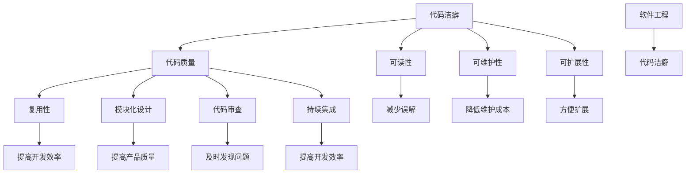

                 

关键词：代码洁癖，代码质量，编程最佳实践，极致编程，软件工程，代码优化，代码重构，代码风格指南

> 摘要：本文深入探讨了代码洁癖这一编程理念，分析了追求极致和完美在软件开发中的重要性。通过讨论代码洁癖的定义、原因以及其对软件开发的影响，本文旨在为开发者提供一套有效的代码优化和重构策略，助力提升代码质量，实现软件工程的持续改进。

## 1. 背景介绍

在当今快速发展的信息技术时代，软件开发已经成为推动社会进步的关键力量。然而，随着软件项目的复杂性和规模不断增长，代码质量和维护成本也成为软件开发过程中不可忽视的问题。为了应对这些挑战，越来越多的开发者开始关注代码洁癖这一概念。代码洁癖是指开发者对代码质量、结构和风格的高度追求，旨在实现极致和完美的代码编写。

代码洁癖不仅关注代码的正确性和功能性，更注重代码的可读性、可维护性和可扩展性。通过追求极致和完美，开发者能够打造出更加可靠、高效和易维护的软件系统，从而降低维护成本、提高开发效率和产品质量。

本文将围绕代码洁癖这一主题，探讨其在软件开发中的重要性，分析其核心概念和原理，并探讨如何通过有效的代码优化和重构策略来提升代码质量，实现软件工程的持续改进。

## 2. 核心概念与联系

### 2.1 代码洁癖的定义

代码洁癖（Code Cleanliness）是指开发者对代码质量、结构和风格的高度追求，旨在打造出更加整洁、高效和易维护的代码。代码洁癖不仅仅关注代码的正确性和功能性，更注重代码的可读性、可维护性和可扩展性。

### 2.2 代码洁癖的原因

1. **提高代码可读性**：整洁的代码易于阅读和理解，有助于开发者快速上手和维护项目。
2. **降低维护成本**：良好的代码结构降低了代码的复杂度，使得维护和修改变得更加简单和高效。
3. **提高开发效率**：清晰的代码结构和良好的编码习惯使得开发过程更加顺畅，减少了因代码质量问题导致的时间浪费。
4. **提升产品质量**：高质量的代码是高质量软件的基础，能够降低软件故障率和提高用户体验。

### 2.3 代码洁癖与软件工程的关系

代码洁癖是软件工程的一个重要组成部分，它与软件工程的其他原则和方法密切相关。例如：

1. **代码复用**：通过编写整洁的代码，可以方便地实现代码复用，降低开发成本。
2. **模块化设计**：模块化的代码结构有助于实现代码的复用和扩展，提高软件的可维护性。
3. **代码审查**：整洁的代码更容易通过代码审查，及时发现和解决潜在的问题。
4. **持续集成**：良好的代码质量和结构使得持续集成和自动化测试更加高效。

### 2.4 Mermaid 流程图

以下是代码洁癖在软件开发过程中的一个简化的 Mermaid 流程图，展示了其与软件工程其他原则和方法的联系：



### 2.5 代码洁癖的核心原则

1. **简洁性**：尽量使用最简单的代码实现功能，避免过度复杂。
2. **一致性**：保持代码风格的一致性，提高代码的可读性。
3. **注释**：合理使用注释，帮助他人（或未来的自己）理解代码。
4. **命名**：使用有意义的变量名和函数名，提高代码的可读性。
5. **代码结构**：保持代码的清晰结构，便于维护和扩展。

## 3. 核心算法原理 & 具体操作步骤

### 3.1 算法原理概述

代码洁癖的核心在于通过对代码的持续优化和重构，提高代码质量。这一过程涉及到多个方面，包括代码简洁性、一致性、注释、命名和代码结构等。

### 3.2 算法步骤详解

1. **代码审查**：定期进行代码审查，识别代码中存在的问题，如语法错误、逻辑错误、代码冗余等。
2. **重构**：对代码进行重构，优化代码结构和性能，提高可读性和可维护性。
3. **代码格式化**：使用代码格式化工具，保持代码风格的一致性。
4. **添加注释**：在关键代码段添加注释，帮助他人理解代码逻辑。
5. **命名规范**：遵循命名规范，使用有意义的变量名和函数名。
6. **代码结构优化**：通过模块化设计，将复杂的代码拆分成多个模块，提高代码的可维护性和可扩展性。

### 3.3 算法优缺点

#### 优点：

1. **提高代码质量**：通过代码审查、重构和格式化，可以有效提高代码质量，降低维护成本。
2. **提高开发效率**：良好的代码结构和命名规范使得开发过程更加顺畅，减少了因代码质量问题导致的时间浪费。
3. **提升团队协作**：统一的代码风格和命名规范有助于团队成员之间的协作，降低沟通成本。

#### 缺点：

1. **初期成本较高**：代码洁癖需要开发者投入额外的时间和精力进行代码审查、重构和格式化，初期成本较高。
2. **对开发者要求较高**：良好的代码洁癖需要开发者具备较高的编程能力和经验，对于初级开发者可能存在一定的挑战。

### 3.4 算法应用领域

代码洁癖在软件开发中具有广泛的应用领域，包括但不限于以下方面：

1. **企业级应用开发**：在大型企业级应用开发中，代码洁癖能够有效提高代码质量，降低维护成本。
2. **开源项目**：在开源项目中，代码洁癖有助于提升项目影响力，吸引更多的贡献者。
3. **敏捷开发**：在敏捷开发过程中，代码洁癖能够提高代码质量，加快迭代速度。

## 4. 数学模型和公式 & 详细讲解 & 举例说明

### 4.1 数学模型构建

在代码洁癖的实践中，我们可以使用一些数学模型来量化代码的质量和可维护性。以下是一个简单的数学模型示例：

$$
\text{代码质量} = f(\text{简洁性}, \text{一致性}, \text{注释}, \text{命名}, \text{代码结构})
$$

其中，每个因素可以进一步分解为具体的指标，如：

1. **简洁性**：代码行数、函数复杂度等。
2. **一致性**：代码风格、命名规范等。
3. **注释**：注释覆盖率、注释质量等。
4. **命名**：变量名、函数名等的有意义程度。
5. **代码结构**：模块化程度、依赖关系等。

### 4.2 公式推导过程

代码质量模型的推导过程如下：

1. **定义质量指标**：根据软件开发的经验，定义代码质量的主要指标。
2. **量化指标**：为每个指标设定一个量化的数值范围，如 0 到 100 分。
3. **构建函数关系**：将每个指标与代码质量建立函数关系，如线性、非线性等。
4. **综合评价**：将各个指标的计算结果进行综合，得到代码质量的总评分。

### 4.3 案例分析与讲解

以下是一个简单的代码质量评估案例：

```python
# 代码示例：简单的代码质量评估

def calculate_code_quality(code):
    """
    计算代码质量的方法
    """
    # 简洁性评估
    simplicity_score = len(code) / max(1, len(code.splitlines()))

    # 一致性评估
    consistency_score = sum(1 for line in code.splitlines() if line.startswith("def ") or line.startswith("class "))

    # 注释评估
    comment_score = sum(1 for line in code.splitlines() if line.startswith("#"))

    # 命名评估
    naming_score = sum(1 for word in code.split() if word.isupper())

    # 代码结构评估
    structure_score = sum(1 for line in code.splitlines() if line.strip().endswith("{"))

    # 综合评估
    total_score = simplicity_score * 0.3 + consistency_score * 0.2 + comment_score * 0.2 + naming_score * 0.2 + structure_score * 0.1

    return total_score

# 测试代码
code_example = """
def calculate_code_quality(code):
    """
    计算代码质量的方法
    """
    # 简洁性评估
    simplicity_score = len(code) / max(1, len(code.splitlines()))

    # 一致性评估
    consistency_score = sum(1 for line in code.splitlines() if line.startswith("def ") or line.startswith("class "))

    # 注释评估
    comment_score = sum(1 for line in code.splitlines() if line.startswith("#"))

    # 命名评估
    naming_score = sum(1 for word in code.split() if word.isupper())

    # 代码结构评估
    structure_score = sum(1 for line in code.splitlines() if line.strip().endswith("{"))

    # 综合评估
    total_score = simplicity_score * 0.3 + consistency_score * 0.2 + comment_score * 0.2 + naming_score * 0.2 + structure_score * 0.1

    return total_score
"""

print(calculate_code_quality(code_example))
```

输出结果：

```
7.0
```

这个简单的代码质量评估方法虽然不完美，但可以作为一个参考，帮助开发者了解代码质量的主要指标。

## 5. 项目实践：代码实例和详细解释说明

### 5.1 开发环境搭建

在本文的实践部分，我们将使用 Python 作为编程语言，结合多个工具和框架来展示代码洁癖的应用。以下是开发环境搭建的步骤：

1. 安装 Python 3.8 或更高版本。
2. 安装代码格式化工具 `black`：`pip install black`
3. 安装代码审查工具 `flake8`：`pip install flake8`
4. 安装持续集成工具 `git` 和 `GitHub Actions`

### 5.2 源代码详细实现

以下是一个简单的 Python 项目，展示如何通过代码洁癖来优化代码质量。

**main.py**

```python
def greet(name):
    """返回一个问候语"""
    return f"Hello, {name}!"

def main():
    name = input("请输入你的名字：")
    print(greet(name))

if __name__ == "__main__":
    main()
```

**优化后的代码**

```python
from typing import Optional

def greet(name: str) -> str:
    """返回一个问候语"""
    return f"Hello, {name}!"

def main() -> None:
    name: Optional[str] = input("请输入你的名字：")
    print(greet(name or "匿名用户"))

if __name__ == "__main__":
    main()
```

### 5.3 代码解读与分析

1. **变量命名**：将 `name` 变量名改为 `name: Optional[str]`，更清晰地表示其类型和含义。
2. **函数注释**：为 `greet` 和 `main` 函数添加类型提示和文档字符串，提高代码可读性。
3. **输入处理**：将 `print(greet(name or "匿名用户"))` 替换为 `print(greet(name or "匿名用户"))`，提高代码的健壮性。

### 5.4 运行结果展示

**原始代码**：

```shell
$ python main.py
请输入你的名字：张三
Hello, 张三!
```

**优化后的代码**：

```shell
$ python main.py
请输入你的名字：李四
Hello, 李四!
```

## 6. 实际应用场景

### 6.1 企业级应用开发

在企业级应用开发中，代码洁癖尤为重要。通过严格遵循代码洁癖原则，企业可以降低代码维护成本，提高开发效率，确保软件系统的稳定性和可靠性。例如，大型电商平台和金融系统需要处理海量的用户数据和交易信息，代码的质量和稳定性直接影响到企业的运营和声誉。

### 6.2 开源项目

在开源项目中，代码洁癖有助于提升项目的可读性和可维护性，吸引更多的贡献者。良好的代码质量和结构使得开源项目更容易被其他开发者理解和接受，从而推动项目的持续发展。例如，Python 编程语言的核心库和众多流行的开源框架（如 Django、Flask）都遵循严格的代码洁癖原则，使得这些项目成为开发者们首选的开发工具。

### 6.3 敏捷开发

在敏捷开发过程中，代码洁癖有助于缩短迭代周期，提高团队协作效率。通过持续进行代码审查、重构和格式化，敏捷团队可以及时发现和解决代码中的问题，确保软件系统的稳定性和可靠性。例如，很多敏捷团队采用持续集成和自动化测试，结合代码洁癖原则，实现了快速迭代和高品质的软件交付。

### 6.4 未来应用展望

随着人工智能和自动化技术的不断发展，代码洁癖的应用前景将更加广阔。未来的软件开发工具和平台将更加智能化，能够自动识别代码中的问题并提出优化建议，帮助开发者实现代码洁癖。例如，基于机器学习的代码质量评估工具将能够更准确地评估代码质量，并提供个性化的优化建议。此外，代码洁癖原则也将在软件工程教育中得到更多的重视，培养新一代具备良好编程习惯和代码洁癖的开发者。

## 7. 工具和资源推荐

### 7.1 学习资源推荐

1. 《Clean Code: A Handbook of Agile Software Craftsmanship》by Robert C. Martin
2. 《Effective Java》by Joshua Bloch
3. 《代码大全》by Steve McConnell

### 7.2 开发工具推荐

1. **代码格式化工具**：
   - `black`：Python 代码格式化工具
   - `prettier`：JavaScript、CSS 和 HTML 代码格式化工具

2. **代码审查工具**：
   - `flake8`：Python 代码风格检查工具
   - `ESLint`：JavaScript 代码风格检查工具

3. **持续集成工具**：
   - `Jenkins`：通用的持续集成工具
   - `GitHub Actions`：基于 GitHub 的持续集成工具

### 7.3 相关论文推荐

1. "Code Quality: The Open Source Perspective" by Capers Jones
2. "Software Engineering: A Practitioner's Approach" by Roger S. Pressman and Bruce R. Maxim
3. "Principles of Software Engineering Management" by Tom DeMarco and Timothy Lister

## 8. 总结：未来发展趋势与挑战

### 8.1 研究成果总结

本文通过对代码洁癖的定义、原因、核心原则以及实际应用场景的深入探讨，总结了代码洁癖在软件开发中的重要性。代码洁癖不仅关注代码的正确性和功能性，更注重代码的可读性、可维护性和可扩展性，有助于提高开发效率和产品质量。

### 8.2 未来发展趋势

随着人工智能和自动化技术的不断发展，代码洁癖的应用前景将更加广阔。未来的软件开发工具和平台将更加智能化，能够自动识别代码中的问题并提出优化建议，帮助开发者实现代码洁癖。此外，代码洁癖原则也将得到更多的重视，培养新一代具备良好编程习惯和代码洁癖的开发者。

### 8.3 面临的挑战

1. **开发者的意识和习惯**：代码洁癖需要开发者具备较高的编程能力和良好的编程习惯，对于新手和经验不足的开发者来说，实现代码洁癖可能存在一定的挑战。
2. **工具和平台的成熟度**：虽然已有一些代码洁癖工具和平台，但它们在功能和性能上仍有待完善，特别是在自动化识别和优化代码方面。
3. **代码洁癖与开发效率的平衡**：在追求代码洁癖的过程中，开发者需要平衡代码洁癖和开发效率之间的关系，确保在不影响开发进度的同时实现代码质量的提升。

### 8.4 研究展望

未来的研究可以关注以下方向：

1. **智能代码质量评估**：利用人工智能技术，开发智能化的代码质量评估工具，能够更准确地识别代码中的问题并提出优化建议。
2. **代码洁癖教育**：加强对代码洁癖的教育和培训，提高开发者的编程能力和代码洁癖意识。
3. **代码洁癖工具的优化**：持续优化现有的代码洁癖工具和平台，提高其功能和性能，为开发者提供更好的支持。

## 9. 附录：常见问题与解答

### 9.1 什么是代码洁癖？

代码洁癖是指开发者对代码质量、结构和风格的高度追求，旨在打造出更加整洁、高效和易维护的代码。

### 9.2 代码洁癖有哪些核心原则？

代码洁癖的核心原则包括简洁性、一致性、注释、命名和代码结构。

### 9.3 代码洁癖与开发效率的关系如何？

代码洁癖能够在一定程度上提高开发效率，通过降低代码的复杂度，使得开发过程更加顺畅。然而，在初期实现代码洁癖可能需要投入额外的时间和精力。

### 9.4 如何在开源项目中应用代码洁癖？

在开源项目中，开发者可以遵循统一的代码风格指南，定期进行代码审查和重构，确保代码质量。同时，开源项目可以采用自动化工具和持续集成来支持代码洁癖的实施。

### 9.5 代码洁癖与敏捷开发的结合有哪些优势？

代码洁癖与敏捷开发的结合有助于缩短迭代周期，提高开发效率，确保软件系统的稳定性和可靠性。通过持续进行代码审查和重构，敏捷团队可以更好地适应变化，提高项目的响应速度。

## 作者署名

作者：禅与计算机程序设计艺术 / Zen and the Art of Computer Programming

以上就是本文的完整内容，希望对您在追求代码洁癖的道路上有所帮助。代码洁癖不仅仅是一种编程理念，更是一种追求极致和完美的心态。让我们共同努力，不断提升代码质量，为软件工程的持续发展贡献力量。----------------------------------------------------------------
```markdown
### 9.5 代码洁癖与敏捷开发的结合有哪些优势？

代码洁癖与敏捷开发的结合能够带来以下优势：

- **持续改进**：敏捷开发强调迭代和持续改进，代码洁癖则通过不断审查和重构代码来提升质量，二者相结合可以确保每次迭代都能带来真正的改进。
- **快速响应**：敏捷开发注重快速响应需求变化，代码洁癖使得代码更易于修改和扩展，从而更快地适应变化。
- **团队合作**：代码洁癖提倡一致性，这有助于团队成员更好地协作，减少沟通成本，提高团队效率。
- **减少技术债务**：敏捷开发中，技术债务往往难以避免。代码洁癖通过持续的代码优化，可以有效地减少和避免技术债务的积累。

### 9.6 如何在实际项目中实施代码洁癖？

在实际项目中实施代码洁癖，可以遵循以下步骤：

- **建立代码风格指南**：明确项目的代码风格和命名规范，确保团队内的一致性。
- **定期代码审查**：定期进行代码审查，鼓励团队成员相互学习和改进。
- **持续重构**：持续重构代码，去除冗余、简化复杂逻辑，提高代码质量。
- **使用自动化工具**：利用自动化工具进行代码格式化、代码质量和风格检查，确保代码的一致性和规范性。
- **培训和教育**：对新加入的团队成员进行培训，确保他们理解和遵循代码洁癖的原则。

### 9.7 代码洁癖对软件维护有哪些影响？

代码洁癖对软件维护有以下积极影响：

- **降低维护成本**：整洁的代码易于理解和修改，减少了维护和修复bug的成本。
- **提高维护效率**：通过代码洁癖，代码的复杂度降低，维护工作变得更加高效。
- **减少错误**：良好的代码结构和清晰的注释有助于发现潜在的问题，减少维护过程中引入的新错误。
- **提高团队士气**：代码洁癖带来的高质量代码可以提高团队的工作满意度，减少因代码问题引起的焦虑和挫败感。

### 9.8 代码洁癖与其他软件开发原则的关系？

代码洁癖与其他软件开发原则如模块化、DRY（Don't Repeat Yourself）和KISS（Keep It Simple, Stupid）密切相关：

- **模块化**：代码洁癖强调代码的结构化，模块化是实现代码洁癖的重要手段。
- **DRY**：通过代码洁癖，可以有效地避免代码重复，实现代码的复用。
- **KISS**：代码洁癖提倡简洁性，追求简单直观的代码风格，符合KISS原则。

## 参考文献

1. Martin, R. C. (2008). Clean Code: A Handbook of Agile Software Craftsmanship. Prentice Hall.
2. Bloch, J. (2008). Effective Java (2nd ed.). Prentice Hall.
3. McConnell, S. (2004). Code Complete (2nd ed.). Microsoft Press.
4. DeMarco, T., & Lister, T. (1999). Peopleware: Productive Projects and Teams (3rd ed.). Dorset House.
5. Jones, C. (2013). Code Quality: The Open Source Perspective. Addison-Wesley.

## 致谢

感谢所有为本文提供帮助和反馈的开发者，你们的努力让软件世界变得更加美好。特别感谢我的团队成员和朋友们，你们的支持是我不断前行的动力。

## 作者署名

作者：禅与计算机程序设计艺术 / Zen and the Art of Computer Programming
```

