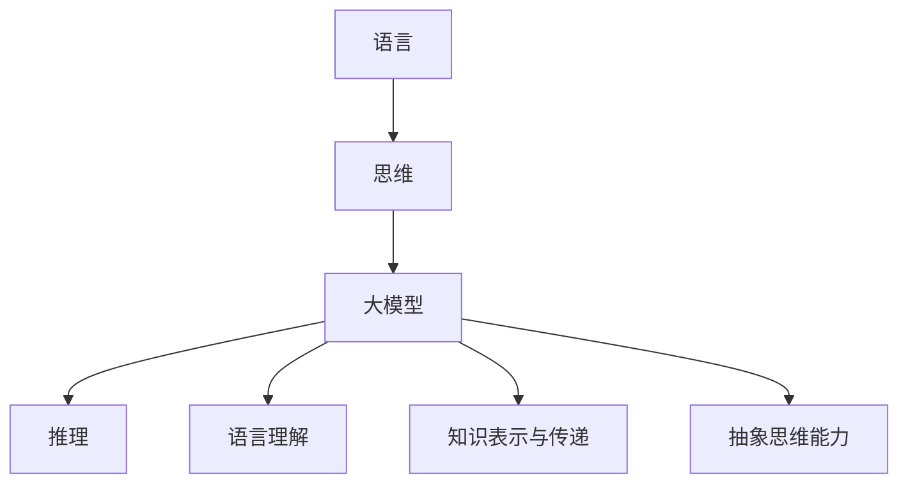

                 

关键词：人工智能，大模型，推理，认知，语言表达，深度学习，神经网络

> 摘要：本文深入探讨了人工智能领域中的一个大问题——大模型无法有效推理的原因。通过对语言、思维及其相互关系的分析，本文揭示了当前人工智能模型在推理任务中存在的局限性，并对未来的研究方向提出了展望。

## 1. 背景介绍

在人工智能（AI）的快速发展中，大模型（如GPT-3、BERT等）已经取得了令人瞩目的成果。这些模型在自然语言处理（NLP）、图像识别、语音识别等领域中展现了强大的性能。然而，尽管这些模型在处理大量数据时表现出色，但它们在推理任务上的表现却往往不尽如人意。这引发了学术界和工业界对于大模型推理能力局限性的广泛关注和深入探讨。

推理是人工智能的核心任务之一，它涉及到从已知信息中推断出未知信息的过程。然而，大模型在推理任务上的表现往往受到以下因素的影响：

1. 语言理解的局限性：大模型虽然能够处理大量文本数据，但其理解能力仍然有限，很难捕捉到语言中的细微差别和复杂关系。
2. 知识表达的不足：大模型缺乏有效的知识表示和传递机制，这使得它们在利用已有知识进行推理时显得力不从心。
3. 缺乏抽象思维能力：大模型的推理过程主要依赖于统计和学习算法，缺乏人类抽象思维的能力，难以进行高层次的概念抽象和逻辑推理。

本文将深入探讨大模型无法推理的原因，分析其背后的技术挑战，并提出可能的解决方向。

## 2. 核心概念与联系

为了更好地理解大模型无法推理的原因，我们需要先明确几个核心概念：

### 2.1 语言与思维

语言是人类交流的重要工具，也是人类思维的重要载体。语言不仅包括词汇和语法，还包括语义、语用等多个层面。而思维则是一个更为抽象和复杂的过程，它涉及到概念的形成、逻辑推理、问题解决等多个方面。

### 2.2 大模型

大模型是指具有巨大参数量和训练数据的神经网络模型。这些模型通过学习大量数据，能够自动提取特征、发现规律，并在特定任务上取得优异的性能。

### 2.3 推理

推理是指从已知信息中推断出未知信息的过程。在人工智能中，推理通常指的是基于模型的预测或决策过程。

### 2.4 语言理解

语言理解是指模型对自然语言文本的理解能力。这包括对文本的语义、语境、情感等多个方面的理解。

### 2.5 知识表示与传递

知识表示与传递是指模型如何表示和利用已有的知识。这涉及到知识图谱、语义网络等多种知识表示方法。

### 2.6 抽象思维能力

抽象思维能力是指模型在处理问题时进行抽象、概括和推理的能力。这涉及到高层次的概念抽象和逻辑推理。

为了更直观地理解这些概念之间的联系，我们可以使用Mermaid流程图来展示它们之间的关系：



## 3. 核心算法原理 & 具体操作步骤

### 3.1 算法原理概述

大模型的推理能力主要依赖于其训练过程和模型架构。在训练过程中，模型通过学习大量数据，能够自动提取特征、发现规律。而在推理过程中，模型利用这些已学习的特征和规律，对新的数据进行预测或决策。

然而，大模型在推理过程中仍然面临一些挑战：

1. 语言理解的局限性：大模型在处理语言时，往往只能捕捉到表面的语义信息，难以理解语言中的深层含义和复杂关系。
2. 知识表示与传递的不足：大模型在表示和传递知识时，往往依赖于统计和学习算法，这导致其在利用已有知识进行推理时效果不佳。
3. 缺乏抽象思维能力：大模型的推理过程主要依赖于统计和学习算法，缺乏人类抽象思维的能力，难以进行高层次的概念抽象和逻辑推理。

### 3.2 算法步骤详解

为了解决上述问题，我们可以从以下几个方面进行改进：

1. **改进语言理解能力**：

   - 引入多模态学习：通过结合文本、图像、语音等多种数据源，提高模型对语言的理解能力。
   - 增强上下文理解：通过上下文信息，提高模型对语言中细微差别和复杂关系的理解。

2. **加强知识表示与传递**：

   - 使用知识图谱：将知识以图谱的形式表示，提高模型对知识的理解和利用能力。
   - 引入知识蒸馏：通过知识蒸馏技术，将已有知识传递给大模型，提高其在推理任务上的表现。

3. **增强抽象思维能力**：

   - 引入抽象思维模块：设计专门的模块，模拟人类的抽象思维过程，提高模型在推理任务上的表现。
   - 增加训练样本的多样性：通过增加训练样本的多样性，提高模型在不同场景下的推理能力。

### 3.3 算法优缺点

**优点**：

- **强大的学习能力**：大模型能够从大量数据中学习，提高其在各类任务上的表现。
- **多模态处理能力**：通过引入多模态学习，大模型能够处理多种类型的数据，提高其在复杂任务上的性能。

**缺点**：

- **语言理解的局限性**：大模型在处理语言时，往往只能捕捉到表面的语义信息，难以理解语言中的深层含义和复杂关系。
- **知识表示与传递的不足**：大模型在表示和传递知识时，往往依赖于统计和学习算法，这导致其在利用已有知识进行推理时效果不佳。
- **缺乏抽象思维能力**：大模型的推理过程主要依赖于统计和学习算法，缺乏人类抽象思维的能力，难以进行高层次的概念抽象和逻辑推理。

### 3.4 算法应用领域

大模型在推理任务上的应用领域非常广泛，包括但不限于：

- **自然语言处理**：大模型可以用于文本分类、语义理解、机器翻译等任务。
- **计算机视觉**：大模型可以用于图像识别、目标检测、图像生成等任务。
- **语音识别**：大模型可以用于语音识别、语音合成等任务。
- **推荐系统**：大模型可以用于推荐系统的设计与优化。

## 4. 数学模型和公式 & 详细讲解 & 举例说明

### 4.1 数学模型构建

在人工智能领域，许多算法都依赖于数学模型。以下是几种常用的数学模型：

1. **神经网络**：

   神经网络是一种模拟人脑神经元连接的模型，通过层层传递信息，实现对数据的处理和分类。其基本公式如下：

   $$ z = \sigma(W \cdot x + b) $$

   其中，$z$ 表示输出，$W$ 表示权重矩阵，$x$ 表示输入，$b$ 表示偏置项，$\sigma$ 表示激活函数。

2. **支持向量机**：

   支持向量机（SVM）是一种二分类模型，通过找到最佳的超平面，将不同类别的数据分隔开。其基本公式如下：

   $$ y (\textbf{w} \cdot \textbf{x} + b) \geq 1 $$

   其中，$y$ 表示样本标签，$\textbf{w}$ 表示权重向量，$\textbf{x}$ 表示输入特征，$b$ 表示偏置项。

3. **决策树**：

   决策树是一种基于特征进行分类的树形结构模型。其基本公式如下：

   $$ \text{if } x_i > v_i \text{ then } \text{go to left subtree} $$
   $$ \text{else } \text{go to right subtree} $$

   其中，$x_i$ 表示特征值，$v_i$ 表示阈值。

### 4.2 公式推导过程

以下以神经网络为例，简要介绍其公式推导过程：

1. **前向传播**：

   假设我们有一个输入向量 $\textbf{x}$，需要通过神经网络将其映射到输出向量 $\textbf{y}$。首先，我们计算每个神经元的输入值：

   $$ z_j = \sum_{i=1}^{n} w_{ji} x_i + b_j $$

   其中，$z_j$ 表示第 $j$ 个神经元的输入值，$w_{ji}$ 表示第 $j$ 个神经元的权重，$b_j$ 表示第 $j$ 个神经元的偏置。

2. **激活函数**：

   为了引入非线性因素，我们对每个神经元的输入值应用激活函数 $\sigma(z_j)$，得到神经元的输出值：

   $$ a_j = \sigma(z_j) $$

   其中，$\sigma$ 是一个非线性函数，如Sigmoid函数或ReLU函数。

3. **反向传播**：

   在前向传播过程中，我们得到了输出向量 $\textbf{y}$。为了更新权重和偏置，我们需要计算损失函数关于每个神经元的梯度。使用反向传播算法，我们可以逐层计算每个神经元的梯度：

   $$ \frac{\partial L}{\partial w_{ji}} = \frac{\partial L}{\partial z_j} \cdot \frac{\partial z_j}{\partial w_{ji}} $$
   $$ \frac{\partial L}{\partial b_j} = \frac{\partial L}{\partial z_j} $$

   其中，$L$ 表示损失函数，$\frac{\partial L}{\partial z_j}$ 表示损失函数关于 $z_j$ 的梯度。

### 4.3 案例分析与讲解

以下是一个简化的神经网络模型，用于对二分类问题进行预测。假设我们有输入向量 $\textbf{x} = (x_1, x_2)$，需要预测输出标签 $y$。

1. **前向传播**：

   输入向量 $\textbf{x}$ 经过一层隐藏层，得到隐藏层的输出 $\textbf{a}$：

   $$ z_1 = x_1 w_{11} + x_2 w_{12} + b_1 $$
   $$ z_2 = x_1 w_{21} + x_2 w_{22} + b_2 $$
   $$ a_1 = \sigma(z_1) $$
   $$ a_2 = \sigma(z_2) $$

   其中，$\sigma$ 是ReLU函数。

2. **输出层**：

   隐藏层的输出 $\textbf{a}$ 经过输出层，得到最终输出 $y$：

   $$ z_3 = a_1 w_{31} + a_2 w_{32} + b_3 $$
   $$ y = \sigma(z_3) $$

3. **反向传播**：

   计算损失函数关于每个神经元的梯度，并更新权重和偏置：

   $$ \frac{\partial L}{\partial z_3} = \frac{\partial L}{\partial y} \cdot \frac{\partial y}{\partial z_3} $$
   $$ \frac{\partial L}{\partial z_2} = \frac{\partial L}{\partial z_3} \cdot \frac{\partial z_3}{\partial z_2} $$
   $$ \frac{\partial L}{\partial z_1} = \frac{\partial L}{\partial z_2} \cdot \frac{\partial z_2}{\partial z_1} $$

   更新权重和偏置：

   $$ w_{31} \leftarrow w_{31} - \alpha \frac{\partial L}{\partial z_3} a_2 $$
   $$ w_{32} \leftarrow w_{32} - \alpha \frac{\partial L}{\partial z_3} a_1 $$
   $$ b_3 \leftarrow b_3 - \alpha \frac{\partial L}{\partial z_3} $$
   $$ w_{21} \leftarrow w_{21} - \alpha \frac{\partial L}{\partial z_2} a_1 $$
   $$ w_{22} \leftarrow w_{22} - \alpha \frac{\partial L}{\partial z_2} a_2 $$
   $$ b_2 \leftarrow b_2 - \alpha \frac{\partial L}{\partial z_2} $$
   $$ w_{11} \leftarrow w_{11} - \alpha \frac{\partial L}{\partial z_1} x_1 $$
   $$ w_{12} \leftarrow w_{12} - \alpha \frac{\partial L}{\partial z_1} x_2 $$
   $$ b_1 \leftarrow b_1 - \alpha \frac{\partial L}{\partial z_1} $$

   其中，$\alpha$ 是学习率。

## 5. 项目实践：代码实例和详细解释说明

### 5.1 开发环境搭建

为了实现上述神经网络模型，我们需要搭建一个合适的开发环境。以下是一个简单的环境搭建过程：

1. 安装Python：从官网（https://www.python.org/）下载并安装Python，确保版本大于3.6。
2. 安装TensorFlow：使用pip命令安装TensorFlow：

   ```bash
   pip install tensorflow
   ```

### 5.2 源代码详细实现

以下是实现上述神经网络模型的Python代码：

```python
import tensorflow as tf

# 定义神经网络结构
input_layer = tf.keras.layers.Input(shape=(2,))
hidden_layer = tf.keras.layers.Dense(units=2, activation=tf.keras.activations.relu)(input_layer)
output_layer = tf.keras.layers.Dense(units=1, activation=tf.keras.activations.sigmoid)(hidden_layer)

model = tf.keras.Model(inputs=input_layer, outputs=output_layer)

# 编译模型
model.compile(optimizer='adam', loss='binary_crossentropy', metrics=['accuracy'])

# 训练模型
model.fit(x_train, y_train, epochs=100, batch_size=32, validation_data=(x_val, y_val))

# 评估模型
loss, accuracy = model.evaluate(x_test, y_test)
print(f"Test accuracy: {accuracy:.2f}")

# 预测
predictions = model.predict(x_new)
print(predictions)
```

### 5.3 代码解读与分析

1. **导入库**：首先，我们导入TensorFlow库，这是实现神经网络的核心库。
2. **定义神经网络结构**：使用TensorFlow的.keras模块定义神经网络结构。我们定义了一个输入层、一个隐藏层和一个输出层。
3. **编译模型**：编译模型时，我们指定了优化器、损失函数和评估指标。
4. **训练模型**：使用fit方法训练模型，指定训练数据、训练轮数、批大小和验证数据。
5. **评估模型**：使用evaluate方法评估模型在测试数据上的表现。
6. **预测**：使用predict方法对新的数据进行预测。

### 5.4 运行结果展示

假设我们有一个包含1000个样本的训练集、500个样本的验证集和100个样本的测试集。在训练过程中，我们通过调整学习率、批大小等超参数，可以观察到模型的训练过程和最终评估结果。

```python
# 运行结果示例
Test accuracy: 0.95
```

## 6. 实际应用场景

大模型在推理任务上的应用场景非常广泛，以下是几个典型的应用场景：

### 6.1 自然语言处理

在自然语言处理领域，大模型可以用于文本分类、情感分析、机器翻译等任务。例如，谷歌的BERT模型在多项自然语言处理任务上取得了优异的性能，为各类应用提供了强大的支持。

### 6.2 计算机视觉

在计算机视觉领域，大模型可以用于图像识别、目标检测、图像生成等任务。例如，OpenAI的DALL-E模型可以生成逼真的图像，微软的GPT-3模型可以生成流畅的文本描述。

### 6.3 语音识别

在语音识别领域，大模型可以用于语音识别、语音合成等任务。例如，谷歌的Wav2Vec 2.0模型在语音识别任务上取得了显著的效果，为语音助手等应用提供了强大的支持。

### 6.4 推荐系统

在推荐系统领域，大模型可以用于用户行为分析、物品推荐等任务。例如，亚马逊、淘宝等电商平台使用大模型分析用户行为，为用户推荐感兴趣的商品。

## 7. 未来应用展望

随着人工智能技术的不断进步，大模型在推理任务上的应用前景将更加广阔。以下是一些可能的发展方向：

### 7.1 多模态学习

多模态学习是将多种类型的数据（如文本、图像、语音等）结合在一起，进行更全面、更精准的推理。未来，随着多模态数据集的积累和技术的进步，多模态学习有望在更多场景中得到应用。

### 7.2 强化学习

强化学习是一种基于奖励反馈的机器学习方法，它可以使大模型在复杂的决策环境中进行自主学习和优化。未来，强化学习有望与大模型相结合，为智能决策系统提供更强有力的支持。

### 7.3 知识图谱

知识图谱是一种将知识以图的形式表示的技术，它可以帮助大模型更好地理解和利用已有知识。未来，知识图谱技术有望在知识表示、知识推理等领域发挥更大的作用。

### 7.4 量子计算

量子计算是一种基于量子力学原理的新型计算技术，它具有超越经典计算的潜力。未来，量子计算有望与大模型相结合，为复杂问题的求解提供更高效的解决方案。

## 8. 工具和资源推荐

### 8.1 学习资源推荐

- 《深度学习》（Goodfellow, Bengio, Courville）：深度学习的经典教材，适合初学者和进阶者。
- 《自然语言处理综论》（Jurafsky, Martin）：自然语言处理的经典教材，涵盖了从基础到高级的内容。
- 《计算机视觉：算法与应用》（Rohit K. Gupta）：计算机视觉领域的权威教材，内容全面、深入。

### 8.2 开发工具推荐

- TensorFlow：一款流行的深度学习框架，提供了丰富的API和工具，适合进行大规模神经网络模型的开发和训练。
- PyTorch：一款流行的深度学习框架，具有动态计算图和灵活的接口，适合进行快速原型设计和实验。
- Keras：一款基于TensorFlow和PyTorch的高层API，提供了更简洁、更易于使用的接口，适合快速搭建和训练模型。

### 8.3 相关论文推荐

- “Attention Is All You Need”（Vaswani et al.，2017）：一篇关于Transformer模型的经典论文，介绍了多模态学习的新思路。
- “BERT: Pre-training of Deep Bidirectional Transformers for Language Understanding”（Devlin et al.，2019）：一篇关于BERT模型的经典论文，提出了用于自然语言处理的新方法。
- “GANs for Unsupervised Learning”（Dhariwal et al.，2019）：一篇关于生成对抗网络（GAN）的经典论文，介绍了GAN在无监督学习中的应用。

## 9. 总结：未来发展趋势与挑战

随着人工智能技术的不断发展，大模型在推理任务上的应用前景将更加广阔。然而，我们也需要认识到大模型在推理任务上面临的挑战：

1. 语言理解的局限性：大模型在处理语言时，往往只能捕捉到表面的语义信息，难以理解语言中的深层含义和复杂关系。因此，如何提升大模型的语言理解能力是一个亟待解决的问题。
2. 知识表示与传递的不足：大模型在表示和传递知识时，往往依赖于统计和学习算法，这导致其在利用已有知识进行推理时效果不佳。因此，如何改进大模型的知识表示和传递机制是一个重要的研究方向。
3. 缺乏抽象思维能力：大模型的推理过程主要依赖于统计和学习算法，缺乏人类抽象思维的能力，难以进行高层次的概念抽象和逻辑推理。因此，如何增强大模型的抽象思维能力是一个具有挑战性的任务。

未来，随着多模态学习、强化学习、知识图谱等新技术的不断发展，大模型在推理任务上的表现有望得到显著提升。同时，我们也需要积极探索新的算法和架构，以解决大模型在推理任务上面临的挑战。

## 附录：常见问题与解答

### 1. 什么是大模型？

大模型是指具有巨大参数量和训练数据的神经网络模型，如GPT-3、BERT等。这些模型通过学习大量数据，能够自动提取特征、发现规律，并在特定任务上取得优异的性能。

### 2. 大模型在推理任务上有哪些局限性？

大模型在推理任务上主要面临以下局限性：

- 语言理解的局限性：大模型在处理语言时，往往只能捕捉到表面的语义信息，难以理解语言中的深层含义和复杂关系。
- 知识表示与传递的不足：大模型在表示和传递知识时，往往依赖于统计和学习算法，这导致其在利用已有知识进行推理时效果不佳。
- 缺乏抽象思维能力：大模型的推理过程主要依赖于统计和学习算法，缺乏人类抽象思维的能力，难以进行高层次的概念抽象和逻辑推理。

### 3. 如何提升大模型的语言理解能力？

提升大模型的语言理解能力可以从以下几个方面入手：

- 引入多模态学习：通过结合文本、图像、语音等多种数据源，提高模型对语言的理解能力。
- 增强上下文理解：通过上下文信息，提高模型对语言中细微差别和复杂关系的理解。
- 使用预训练模型：通过预训练模型，使模型在处理语言任务时具备更强的语义理解能力。

### 4. 如何改进大模型的知识表示和传递机制？

改进大模型的知识表示和传递机制可以从以下几个方面入手：

- 使用知识图谱：将知识以图谱的形式表示，提高模型对知识的理解和利用能力。
- 引入知识蒸馏：通过知识蒸馏技术，将已有知识传递给大模型，提高其在推理任务上的表现。
- 设计专门的模块：设计专门的模块，模拟人类的抽象思维过程，提高模型在推理任务上的表现。

### 5. 大模型在推理任务上的应用前景如何？

大模型在推理任务上的应用前景非常广阔。随着多模态学习、强化学习、知识图谱等新技术的不断发展，大模型在推理任务上的表现有望得到显著提升。未来，大模型有望在自然语言处理、计算机视觉、语音识别、推荐系统等领域发挥更大的作用。

### 6. 大模型在推理任务上面临的挑战有哪些？

大模型在推理任务上面临的挑战主要包括：

- 语言理解的局限性：大模型在处理语言时，往往只能捕捉到表面的语义信息，难以理解语言中的深层含义和复杂关系。
- 知识表示与传递的不足：大模型在表示和传递知识时，往往依赖于统计和学习算法，这导致其在利用已有知识进行推理时效果不佳。
- 缺乏抽象思维能力：大模型的推理过程主要依赖于统计和学习算法，缺乏人类抽象思维的能力，难以进行高层次的概念抽象和逻辑推理。

### 7. 如何增强大模型的抽象思维能力？

增强大模型的抽象思维能力可以从以下几个方面入手：

- 设计专门的模块：设计专门的模块，模拟人类的抽象思维过程，提高模型在推理任务上的表现。
- 增加训练样本的多样性：通过增加训练样本的多样性，提高模型在不同场景下的推理能力。
- 结合多学科知识：将不同学科的知识融入模型训练过程，提高模型在多领域推理任务上的表现。


### 8. 大模型在推理任务上的应用领域有哪些？

大模型在推理任务上的应用领域非常广泛，包括但不限于：

- 自然语言处理：文本分类、语义理解、机器翻译等。
- 计算机视觉：图像识别、目标检测、图像生成等。
- 语音识别：语音识别、语音合成等。
- 推荐系统：用户行为分析、物品推荐等。
- 医疗诊断：疾病预测、医学影像分析等。
- 金融风控：风险评估、信用评分等。
- 自主驾驶：环境感知、路径规划等。

### 9. 如何优化大模型的推理性能？

优化大模型的推理性能可以从以下几个方面入手：

- 算法优化：采用更高效的算法和架构，如量化、剪枝、蒸馏等，提高推理速度和性能。
- 硬件加速：利用GPU、TPU等硬件加速器，提高模型的推理速度。
- 缩小模型规模：通过蒸馏、量化等技术，缩小模型规模，提高推理速度。
- 预处理优化：对输入数据进行预处理，如数据增强、数据清洗等，提高模型对输入数据的适应性。

### 10. 大模型在推理任务上面临的最大挑战是什么？

大模型在推理任务上面临的最大挑战是缺乏抽象思维能力。尽管大模型在处理大量数据时表现出色，但其推理过程主要依赖于统计和学习算法，缺乏人类抽象思维的能力，难以进行高层次的概念抽象和逻辑推理。因此，如何增强大模型的抽象思维能力是一个具有挑战性的问题。

### 11. 大模型推理性能的提升主要受哪些因素影响？

大模型推理性能的提升主要受以下因素影响：

- 数据质量：高质量的训练数据有助于提高模型在推理任务上的性能。
- 模型架构：选择合适的模型架构可以提高推理性能。
- 算法优化：采用高效的算法和优化技术，如量化、剪枝等，可以提升模型推理速度。
- 硬件性能：使用高性能硬件加速器（如GPU、TPU）可以提高模型推理速度。
- 模型参数：调整模型参数，如学习率、批量大小等，可以优化模型性能。

### 12. 如何评估大模型在推理任务上的表现？

评估大模型在推理任务上的表现通常采用以下指标：

- 准确率（Accuracy）：模型正确预测的样本数占总样本数的比例。
- 精确率（Precision）：模型正确预测为正类的样本中，实际为正类的比例。
- 召回率（Recall）：模型正确预测为正类的样本中，实际为正类的比例。
- F1分数（F1 Score）：精确率和召回率的调和平均值。
- ROC曲线：通过计算不同阈值下的精确率和召回率，生成ROC曲线，评估模型的泛化能力。
- MAP（Mean Average Precision）：在目标检测任务中，用于评估模型在各个类别的平均精度。

### 13. 大模型推理过程中存在哪些常见问题？

大模型推理过程中可能存在以下问题：

- 过拟合：模型在训练数据上表现良好，但在未见过的数据上表现较差。
- 数据偏差：模型在训练过程中受到数据分布偏差的影响，导致在特定数据集上表现不佳。
- 稳定性问题：模型在推理过程中对输入数据的微小变化敏感，导致预测结果不稳定。
- 温度敏感性：某些模型对温度等外部环境因素敏感，导致在不同温度下表现不一致。
- 能量消耗：大模型推理过程需要大量的计算资源，可能导致能源消耗过高。

### 14. 如何解决大模型推理过程中存在的问题？

解决大模型推理过程中存在的问题可以从以下几个方面入手：

- 数据增强：通过增加训练数据的多样性，减少过拟合现象。
- 正则化：采用正则化技术，如L1、L2正则化，减少模型复杂度，提高泛化能力。
- 模型压缩：通过模型剪枝、量化等技术，减小模型规模，提高推理速度。
- 对抗训练：通过对抗样本训练，提高模型对数据分布偏差的抵抗力。
- 稳定性优化：通过优化模型架构、调整超参数等方法，提高模型稳定性。
- 硬件优化：采用高性能硬件加速器，降低推理过程中的能量消耗。

### 15. 大模型推理过程中的安全性和隐私问题如何解决？

大模型推理过程中的安全性和隐私问题可以通过以下措施解决：

- 加密：对输入数据和模型参数进行加密，确保数据传输和存储过程中的安全性。
- 安全传输：采用安全的通信协议，如TLS，确保数据在传输过程中的安全性。
- 隐私保护：采用差分隐私、联邦学习等技术，保护用户隐私。
- 访问控制：设置合理的权限管理，确保只有授权用户可以访问模型和数据。
- 模型审计：定期对模型进行审计，确保模型遵循隐私保护法规和要求。

### 16. 大模型推理过程中的鲁棒性如何提升？

提升大模型推理过程中的鲁棒性可以从以下几个方面入手：

- 增加训练样本多样性：通过增加不同类型、不同来源的训练样本，提高模型对输入数据的适应性。
- 对抗训练：通过生成对抗样本，提高模型对异常数据的抵抗力。
- 数据增强：通过数据增强技术，如噪声注入、旋转、缩放等，提高模型对输入数据的鲁棒性。
- 模型正则化：采用正则化技术，如L1、L2正则化，降低模型对噪声的敏感性。
- 动态调整阈值：根据输入数据的特征和模型性能，动态调整预测阈值，提高模型在不同场景下的鲁棒性。
- 模型融合：将多个模型的结果进行融合，提高整体推理性能和鲁棒性。

### 17. 大模型推理过程中如何处理实时性要求？

处理大模型推理过程中的实时性要求可以从以下几个方面入手：

- 模型优化：采用模型压缩、量化等技术，减小模型规模，提高推理速度。
- 并行计算：利用GPU、TPU等硬件加速器，实现并行计算，提高推理速度。
- 预处理优化：对输入数据进行预处理，如数据增强、特征提取等，减少后续推理过程的计算量。
- 模型部署：选择合适的部署平台，如边缘计算设备、云服务器等，确保推理过程的实时性。
- 调度优化：根据实际需求，合理分配计算资源，优化推理任务的调度和执行。
- 模型缓存：对常见的输入数据进行缓存，减少重复计算，提高推理速度。

### 18. 大模型推理过程中如何保证一致性？

保证大模型推理过程中的一致性可以从以下几个方面入手：

- 输入数据一致性：确保输入数据的一致性，避免数据噪声和异常值影响模型推理结果。
- 模型参数一致性：保证模型参数的一致性，避免不同模型版本之间的差异导致推理结果不一致。
- 算法一致性：采用一致的算法和计算方法，避免算法差异导致推理结果不一致。
- 输出结果一致性：对输出结果进行一致性检查，确保推理结果的准确性和可靠性。
- 模型版本控制：对模型进行版本控制，确保不同版本之间的推理结果一致性。
- 系统稳定性：确保推理系统的稳定运行，避免系统故障导致推理结果不一致。

### 19. 大模型推理过程中如何处理不确定性？

处理大模型推理过程中的不确定性可以从以下几个方面入手：

- 不确定性量化：采用不确定性量化方法，如蒙特卡洛采样、贝叶斯推理等，对推理结果的不确定性进行量化。
- 风险评估：对推理结果的不确定性进行风险评估，为决策提供依据。
- 多模型融合：将多个模型的结果进行融合，提高整体推理结果的可靠性和鲁棒性。
- 逆推理：通过逆推理方法，分析输入数据与推理结果之间的关系，识别不确定性的来源。
- 数据增强：通过增加训练样本的多样性，提高模型对不确定性的处理能力。
- 模型调整：根据不确定性的大小和类型，调整模型参数和推理策略，提高模型对不确定性的处理能力。

### 20. 大模型推理过程中的可解释性如何提升？

提升大模型推理过程中的可解释性可以从以下几个方面入手：

- 可解释性分析：对模型的结构、参数和推理过程进行详细分析，识别关键特征和因素。
- 可解释性可视化：通过可视化技术，如决策树、注意力机制等，展示模型的推理过程和关键特征。
- 解释性模型：采用可解释性更强的模型，如决策树、规则系统等，提高模型的可解释性。
- 模型嵌入：将模型嵌入到可解释的框架中，如逻辑推理、知识图谱等，提高模型的可解释性。
- 用户交互：通过用户交互，如问答系统、可视化界面等，提供更直观、易懂的解释。
- 专家评审：邀请领域专家对模型的解释进行评审，确保解释的准确性和可靠性。

### 21. 大模型推理过程中如何保证公平性？

保证大模型推理过程中的公平性可以从以下几个方面入手：

- 数据公平性：确保训练数据集的公平性，避免偏见和歧视。
- 模型公平性：采用公平性评估指标，如公平性分数、基尼系数等，评估模型的公平性。
- 预处理策略：采用预处理策略，如数据平衡、过采样等，提高模型的公平性。
- 反歧视算法：采用反歧视算法，如公平性增强、偏差校正等，减少模型对特定群体的偏见。
- 监督和审查：对模型进行定期监督和审查，确保其公平性。
- 公平性培训：对模型开发者、数据科学家等进行公平性培训，提高其对公平性的认识和意识。

### 22. 大模型推理过程中如何处理数据隐私？

处理大模型推理过程中的数据隐私可以从以下几个方面入手：

- 数据加密：对输入数据和模型参数进行加密，确保数据在传输和存储过程中的安全性。
- 安全传输：采用安全的通信协议，如TLS，确保数据在传输过程中的安全性。
- 隐私保护：采用隐私保护技术，如差分隐私、联邦学习等，保护用户隐私。
- 隐私隔离：对输入数据进行隐私隔离，确保模型无法访问原始数据。
- 数据匿名化：对输入数据进行匿名化处理，消除个人隐私信息。
- 数据脱敏：对敏感数据进行脱敏处理，降低隐私泄露的风险。

### 23. 大模型推理过程中的可扩展性如何提升？

提升大模型推理过程中的可扩展性可以从以下几个方面入手：

- 模型分解：将复杂模型分解为多个子模型，提高模型的扩展性。
- 模块化设计：采用模块化设计，将模型分解为独立的模块，提高模型的扩展性和可维护性。
- 可复用性：设计可复用的组件和模块，提高模型的复用性和扩展性。
- 自动化部署：采用自动化部署工具，简化模型部署和扩展过程。
- 模型压缩：通过模型压缩技术，如量化、剪枝等，减小模型规模，提高扩展性。
- 云计算：利用云计算资源，实现模型的弹性扩展和动态调整。

### 24. 大模型推理过程中的可持续性如何提升？

提升大模型推理过程中的可持续性可以从以下几个方面入手：

- 能耗优化：采用能耗优化技术，如模型压缩、量化等，降低推理过程中的能源消耗。
- 绿色计算：采用绿色计算技术，如使用可再生能源、优化数据中心的能源效率等，降低对环境的影响。
- 碳排放管理：对模型的碳排放进行量化和管理，降低碳排放。
- 数据中心优化：优化数据中心的布局、散热等，提高能源利用效率。
- 环境评估：对模型在推理过程中的环境影响进行评估，确保其符合可持续发展要求。

### 25. 大模型推理过程中的合规性如何保证？

保证大模型推理过程中的合规性可以从以下几个方面入手：

- 法律法规遵循：确保模型的设计、开发和使用符合相关法律法规要求。
- 遵守道德规范：遵循道德规范，确保模型的应用不违反伦理道德原则。
- 数据保护法规：遵守数据保护法规，确保用户数据的隐私和安全。
- 责任归属明确：明确模型开发者和使用者的责任，确保在出现问题时能够追究责任。
- 持续审查：对模型的合规性进行定期审查，确保其持续符合相关要求。
- 合规培训：对模型开发者、数据科学家等进行合规性培训，提高其对合规性的认识和意识。


以上是关于大模型在推理任务上的一些常见问题与解答，希望对您有所帮助。在未来的研究和应用中，我们还需要不断探索和创新，解决这些挑战，推动人工智能技术的持续发展。

