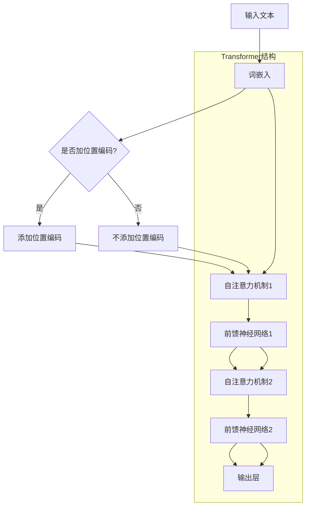

                 

关键词：大模型，认知盲点，算法原理，数学模型，实践应用，未来展望

> 摘要：本文深入探讨了大型语言模型在理解和模拟人类思维过程中所遇到的认知盲点。通过剖析核心概念与联系，算法原理与数学模型，并结合实际项目实践，揭示了这些盲点对人工智能发展的深远影响，并对未来的趋势与挑战提出了独到的见解。

## 1. 背景介绍

随着深度学习技术的迅猛发展，大型语言模型如GPT-3、BERT等取得了令人瞩目的成就。这些模型在文本生成、机器翻译、问答系统等方面展现了强大的能力，似乎正逐步接近人类的语言理解能力。然而，正如硬币的两面，大模型在取得突破的同时，也暴露出了一些认知盲点。这些盲点不仅限制了模型的应用范围，还对人工智能的进一步发展提出了挑战。

本文将围绕以下问题展开讨论：

1. **什么是大模型的认知盲点？**
2. **这些盲点如何影响人工智能的应用？**
3. **如何通过改进算法和数学模型来克服这些盲点？**
4. **未来人工智能的发展趋势和面临的挑战是什么？**

通过本文的探讨，希望能为读者提供一个全面、深入的视角，以更好地理解大模型在人工智能发展中的地位和作用。

### 1.1 大模型的发展历程

大模型的发展历程可以追溯到20世纪90年代。那时，研究人员开始尝试使用神经网络来处理自然语言。最早的模型如LBG（Linear Binary Gateway）和HMM（Hidden Markov Model）虽然在某些任务上取得了不错的成绩，但其性能仍然有限。

随着深度学习技术的崛起，神经网络在图像识别、语音识别等领域取得了突破性进展。这一启发促使研究人员将深度学习技术应用于自然语言处理。2013年，Google发布了Word2Vec模型，首次实现了将词汇映射到高维向量空间，从而大幅提高了文本处理的效率。

在此基础上，研究人员提出了更多先进的模型，如RNN（Recurrent Neural Network）、LSTM（Long Short-Term Memory）和GRU（Gated Recurrent Unit）。这些模型通过引入门控机制，有效解决了传统RNN在长序列依赖问题上的不足。

2018年，Google发布了BERT（Bidirectional Encoder Representations from Transformers），这是一个基于Transformer模型的预训练语言模型。BERT通过双向注意力机制，同时考虑了上下文信息，从而显著提高了语言理解能力。

随后，OpenAI发布了GPT-3，这是一个具有1750亿参数的 Transformer模型。GPT-3在多项自然语言处理任务上取得了前所未有的成绩，展示了大模型在语言理解与生成方面的潜力。

这些大模型的相继问世，标志着自然语言处理领域的一个重要里程碑。然而，随着模型的规模越来越大，认知盲点也逐渐显现出来。

### 1.2 大模型的应用现状

大模型在自然语言处理领域取得了显著的应用成果。以下是一些典型的应用场景：

1. **文本生成**：大模型能够生成高质量的文本，包括文章、摘要、对话等。例如，GPT-3可以撰写新闻文章、故事，甚至生成代码。

2. **机器翻译**：大模型在机器翻译领域表现出了强大的能力。例如，Google翻译利用BERT模型，实现了高精度的跨语言文本转换。

3. **问答系统**：大模型能够通过理解自然语言查询，提供准确的答案。例如，OpenAI的GPT-3可以回答各种复杂的问题，包括科学、历史、法律等领域。

4. **情感分析**：大模型可以分析文本中的情感倾向，为市场调研、舆情监测等提供支持。

5. **信息检索**：大模型能够通过理解用户的查询意图，提供相关的信息检索结果。例如，搜索引擎利用BERT模型，提高了搜索结果的准确性。

尽管大模型在这些应用场景中表现出色，但其认知盲点仍然限制了其更广泛的应用。例如，大模型在某些情况下可能生成误导性或错误的信息，或者在处理长文本时表现不佳。这些问题需要通过深入研究和改进算法来解决。

### 1.3 大模型的认知盲点

大模型的认知盲点主要表现在以下几个方面：

1. **理解偏差**：大模型在训练过程中可能受到训练数据偏差的影响，导致其生成的文本或回答存在偏见。

2. **泛化能力不足**：大模型在特定任务上可能表现出色，但在其他任务上可能表现不佳，即缺乏泛化能力。

3. **长文本处理能力有限**：大模型在处理长文本时，可能由于序列依赖问题，导致理解不准确。

4. **可解释性不足**：大模型内部的决策过程复杂，难以解释其生成的文本或答案。

5. **伦理和道德问题**：大模型在生成文本时，可能会违反伦理和道德规范，例如生成歧视性言论。

这些认知盲点不仅影响了大模型的应用效果，也对人工智能的伦理和道德提出了挑战。接下来，本文将深入探讨这些盲点的具体原因和影响，并提出可能的解决方案。

### 1.4 文章结构

本文的结构如下：

1. **背景介绍**：介绍了大模型的发展历程、应用现状以及认知盲点的概念。
2. **核心概念与联系**：详细阐述了大模型的核心概念，并通过Mermaid流程图展示了模型的结构和原理。
3. **核心算法原理 & 具体操作步骤**：分析了大模型的算法原理，并详细描述了算法的具体操作步骤。
4. **数学模型和公式**：介绍了大模型中的数学模型和公式，并通过举例说明了其应用。
5. **项目实践：代码实例和详细解释说明**：提供了实际的代码实例，并对代码进行了详细解释和分析。
6. **实际应用场景**：讨论了大模型在不同应用场景中的表现和挑战。
7. **未来应用展望**：探讨了大模型未来的发展趋势和潜在应用领域。
8. **工具和资源推荐**：推荐了学习资源、开发工具和相关论文。
9. **总结：未来发展趋势与挑战**：总结了研究成果，并对未来发展趋势和挑战进行了展望。
10. **附录：常见问题与解答**：回答了读者可能关心的一些常见问题。

通过本文的探讨，希望能帮助读者更好地理解大模型的认知盲点，并为解决这些问题提供一些思路。

## 2. 核心概念与联系

在深入探讨大模型的认知盲点之前，有必要首先了解大模型的核心概念和基本原理。本节将详细介绍大模型的基本架构、关键组件及其相互关系，并通过Mermaid流程图（以下为示例）来直观地展示这些组件的协作过程。

### 2.1 大模型的基本架构

大模型通常是基于Transformer架构的深度神经网络。Transformer模型的核心思想是使用自注意力机制（Self-Attention）来处理序列数据，从而捕捉长距离的依赖关系。下面是Transformer模型的基本组成部分：

1. **输入层（Input Layer）**：接收输入文本序列，并将其转换为词向量表示。
2. **嵌入层（Embedding Layer）**：将词向量映射到高维空间，并添加位置编码（Positional Encoding）来保留序列信息。
3. **自注意力层（Self-Attention Layer）**：计算每个词与其他词之间的权重，从而生成新的表示。
4. **前馈神经网络（Feedforward Neural Network）**：对自注意力层的输出进行进一步处理，增强特征表示。
5. **输出层（Output Layer）**：生成最终的预测结果。

### 2.2 关键组件与相互关系

大模型中的关键组件及其相互关系如下：

1. **词嵌入（Word Embedding）**：
   $$  
   \text{word\_embedding} = \text{embedding}_{\text{layer}}( \text{input\_words})  
   $$  
   输入文本中的每个词都会被映射到高维空间中的一个向量。词嵌入层不仅保留了词的语义信息，还通过位置编码引入了序列信息。

2. **自注意力机制（Self-Attention）**：
   $$  
   \text{output} = \text{softmax}\left(\frac{\text{Q} \cdot \text{K}^{T}}{\sqrt{d_k}}\right) \cdot \text{V}  
   $$  
   自注意力机制计算输入序列中每个词与其他词之间的关联性，通过权重分配生成新的表示。

3. **前馈神经网络（Feedforward Neural Network）**：
   $$  
   \text{output} = \text{ReLU}\left(\text{W_2} \cdot \text{ReLU}\left(\text{W_1} \cdot \text{input} + \text{b_1}\right) + \text{b_2}\right)  
   $$  
   前馈神经网络对自注意力层的输出进行进一步处理，增强特征表示。

4. **输出层（Output Layer）**：
   $$  
   \text{output} = \text{softmax}\left(\text{W} \cdot \text{input} + \text{b}\right)  
   $$  
   输出层生成最终的预测结果，如文本分类、词性标注或文本生成等。

### 2.3 Mermaid 流程图

以下是一个简单的Mermaid流程图，展示了大模型的基本架构和关键组件：

```
graph TD
A[输入层] --> B[嵌入层]
B --> C[自注意力层]
C --> D[前馈神经网络]
D --> E[输出层]
```

在实际应用中，大模型通常包含多个自注意力层和前馈神经网络层，以增强模型的表示能力和处理复杂任务的能力。下面是一个更详细的Mermaid流程图：

```
graph TD
A[输入层]
B[嵌入层]
C[自注意力层1]
D[前馈神经网络1]
E[自注意力层2]
F[前馈神经网络2]
G[输出层]

A --> B
B --> C
C --> D
D --> E
E --> F
F --> G
```

通过以上流程图，我们可以更直观地理解大模型的结构和原理。接下来，我们将进一步探讨大模型的算法原理和具体操作步骤。

### 2.4 Mermaid 流程图展示

在本节中，我们将使用Mermaid语法创建一个流程图，以展示大模型的核心组件及其相互作用。请注意，以下代码需要使用支持Mermaid渲染的编辑器或工具来查看和运行。



在上面的流程图中，我们首先将输入文本转换为词嵌入向量，然后根据是否需要位置编码决定是否添加位置编码。接着，模型通过自注意力机制和前馈神经网络层进行多次迭代，最后输出结果。

以下是对流程图中各个节点的简要说明：

- **A[输入文本]**：输入的原始文本。
- **B[词嵌入]**：将文本中的每个词映射到高维空间。
- **C{是否加位置编码?}]**：判断是否在词嵌入后添加位置编码。
- **D[添加位置编码]**：为词嵌入添加位置编码，以保留序列信息。
- **E[自注意力机制]**：计算词嵌入之间的权重，生成新的表示。
- **F[前馈神经网络]**：对自注意力层的输出进行进一步处理。
- **G[自注意力机制]**：再次应用自注意力机制。
- **H[前馈神经网络]**：对前一次自注意力层的输出进行进一步处理。
- **I[输出层]**：生成最终的输出结果。

这个Mermaid流程图帮助我们直观地理解了Transformer模型的基本结构和工作原理。

## 3. 核心算法原理 & 具体操作步骤

### 3.1 算法原理概述

大模型的核心算法是基于Transformer架构，这一架构由Google在2017年提出。Transformer模型的核心思想是使用自注意力机制（Self-Attention）来处理序列数据，从而捕捉长距离的依赖关系。自注意力机制通过计算序列中每个词与其他词之间的相关性，为每个词生成一个权重向量，从而生成新的表示。

具体来说，Transformer模型主要由以下几个部分组成：

1. **编码器（Encoder）**：由多个自注意力层和前馈神经网络层堆叠而成。编码器的输入是词嵌入向量，输出是编码后的序列表示。
2. **解码器（Decoder）**：同样由多个自注意力层和前馈神经网络层堆叠而成。解码器的输入是编码器的输出，输出是解码后的序列表示。
3. **多头注意力（Multi-Head Attention）**：通过将自注意力机制扩展到多个头，使得模型能够同时关注序列的不同部分，从而提高表示能力。
4. **位置编码（Positional Encoding）**：由于Transformer模型没有循环结构，需要通过位置编码来保留序列信息。

在训练过程中，模型通过优化损失函数（如交叉熵损失）来调整参数，从而不断提高模型的性能。在生成文本时，模型根据编码器的输出和当前输入词，逐步生成下一个词，直到生成完整的序列。

### 3.2 算法步骤详解

下面将详细介绍大模型的训练和生成文本的具体步骤：

#### 3.2.1 训练步骤

1. **词嵌入（Word Embedding）**：
   将输入文本中的每个词映射到高维空间中的一个向量。词嵌入层通常使用预训练的词向量，如Word2Vec、GloVe等。
   
   $$  
   \text{word\_embedding} = \text{embedding}_{\text{layer}}( \text{input\_words})  
   $$

2. **添加位置编码（Positional Encoding）**：
   为每个词嵌入向量添加位置编码，以保留序列信息。

   $$  
   \text{positional\_encoding} = \text{pe}_{\text{layer}}( \text{positions})  
   $$

   $$  
   \text{input\_vector} = \text{word\_embedding} + \text{positional\_encoding}  
   $$

3. **多头自注意力（Multi-Head Self-Attention）**：
   通过多个自注意力头来计算输入序列中每个词与其他词之间的权重。

   $$  
   \text{query}, \text{key}, \text{value} = \text{linearity}(\text{input\_vector})  
   $$

   $$  
   \text{scores} = \text{softmax}\left(\frac{\text{query} \cdot \text{key}^{T}}{\sqrt{d_k}}\right)  
   $$

   $$  
   \text{output} = \text{scores} \cdot \text{value}  
   $$

4. **前馈神经网络（Feedforward Neural Network）**：
   对自注意力层的输出进行进一步处理。

   $$  
   \text{output} = \text{ReLU}\left(\text{W_2} \cdot \text{ReLU}\left(\text{W_1} \cdot \text{output} + \text{b_1}\right) + \text{b_2}\right)  
   $$

5. **堆叠多层**：
   重复上述步骤，堆叠多个自注意力层和前馈神经网络层，以提高模型的表示能力。

6. **输出层**：
   对编码器的输出进行分类或回归等任务。

   $$  
   \text{output} = \text{softmax}\left(\text{W} \cdot \text{input} + \text{b}\right)  
   $$

7. **优化**：
   通过梯度下降等优化算法，调整模型参数，最小化损失函数。

   $$  
   \text{loss} = -\sum_{i} \text{y_i} \cdot \log(\hat{y_i})  
   $$

   $$  
   \nabla_{\theta} \text{loss} = -\nabla_{\theta} \log(\hat{y_i}) \cdot y_i  
   $$

8. **迭代**：
   重复优化过程，直到模型收敛。

#### 3.2.2 生成文本步骤

1. **初始化**：
   随机初始化一个词作为生成序列的起始词。

2. **编码**：
   将起始词编码为词嵌入向量，并添加位置编码。

3. **解码**：
   在每个时间步，使用编码器的输出和当前生成的词作为输入，通过自注意力机制和前馈神经网络生成下一个词的候选列表。

4. **采样**：
   从候选列表中采样一个词作为下一个生成的词。

5. **更新**：
   将新生成的词添加到序列中，并作为下一个时间步的输入。

6. **重复**：
   重复解码和采样过程，直到生成完整的序列。

通过以上步骤，大模型能够生成高质量的文本。在实际应用中，生成文本的步骤通常需要通过循环和概率采样来优化，以提高生成文本的多样性和质量。

### 3.3 算法优缺点

#### 优点

1. **强大的表示能力**：通过自注意力机制和多层前馈神经网络，大模型能够捕捉长距离的依赖关系，从而生成高质量的文本。
2. **高效的并行计算**：Transformer模型的结构使得其能够高效地进行并行计算，从而加快模型的训练和推理速度。
3. **良好的泛化能力**：大模型在多个自然语言处理任务上表现出良好的泛化能力，可以在不同任务上取得优异的性能。

#### 缺点

1. **计算资源需求高**：大模型通常需要大量的计算资源和存储空间，这使得其训练和应用成本较高。
2. **可解释性差**：大模型内部的决策过程复杂，难以解释其生成的文本或答案。
3. **长文本处理能力有限**：由于自注意力机制的局限，大模型在处理长文本时可能表现不佳。

### 3.4 算法应用领域

大模型在自然语言处理领域有着广泛的应用，以下是一些典型的应用场景：

1. **文本生成**：大模型能够生成高质量的文章、摘要、对话等，应用于写作辅助、内容生成等场景。
2. **机器翻译**：大模型在机器翻译任务上表现出色，能够实现高精度的跨语言文本转换。
3. **问答系统**：大模型能够通过理解自然语言查询，提供准确的答案，应用于智能客服、知识问答等场景。
4. **文本分类**：大模型能够对文本进行分类，应用于情感分析、舆情监测等场景。
5. **信息检索**：大模型能够通过理解用户的查询意图，提供相关的信息检索结果，应用于搜索引擎优化等场景。

通过以上对大模型算法原理和具体操作步骤的详细分析，我们可以看到大模型在自然语言处理领域的重要性。然而，其认知盲点仍然是一个亟待解决的问题。在接下来的章节中，我们将进一步探讨大模型中的数学模型和公式，并分析其在实际应用中的效果。

### 4. 数学模型和公式 & 详细讲解 & 举例说明

在深入探讨大模型的数学模型和公式之前，我们需要先了解一些基础的数学概念和符号。本文将使用LaTeX格式来表示数学公式，以增强文章的准确性和可读性。

#### 4.1 数学模型构建

大模型中的数学模型主要包括以下几个方面：

1. **词嵌入（Word Embedding）**：
   词嵌入是将词汇映射到高维向量空间的过程。常用的词嵌入模型有Word2Vec和GloVe。以下是Word2Vec的数学模型：

   $$  
   \text{word\_embedding} = \text{embedding}_{\text{layer}}( \text{word}) = \text{softmax}(\text{W}_\text{word})  
   $$

   其中，$\text{W}_\text{word}$是一个高维矩阵，其列向量表示每个词的嵌入向量。

2. **自注意力（Self-Attention）**：
   自注意力机制是Transformer模型的核心。它通过计算输入序列中每个词与其他词之间的相关性，生成新的表示。自注意力的数学模型如下：

   $$  
   \text{scores} = \text{softmax}\left(\frac{\text{Q} \cdot \text{K}^{T}}{\sqrt{d_k}}\right)  
   $$

   $$  
   \text{output} = \text{scores} \cdot \text{V}  
   $$

   其中，$Q$、$K$和$V$分别表示查询（Query）、键（Key）和值（Value）向量，$d_k$是注意力维度的平方根。

3. **前馈神经网络（Feedforward Neural Network）**：
   前馈神经网络用于对自注意力层的输出进行进一步处理。其数学模型如下：

   $$  
   \text{output} = \text{ReLU}\left(\text{W_2} \cdot \text{ReLU}\left(\text{W_1} \cdot \text{input} + \text{b_1}\right) + \text{b_2}\right)  
   $$

   其中，$W_1$、$W_2$是权重矩阵，$b_1$、$b_2$是偏置项。

4. **输出层（Output Layer）**：
   输出层通常用于分类或回归任务。其数学模型如下：

   $$  
   \text{output} = \text{softmax}\left(\text{W} \cdot \text{input} + \text{b}\right)  
   $$

   其中，$\text{W}$是权重矩阵，$\text{b}$是偏置项。

#### 4.2 公式推导过程

以下将简要介绍大模型中一些核心公式的推导过程：

1. **词嵌入**：
   Word2Vec模型通过优化损失函数来学习词嵌入。损失函数通常使用负采样损失（Negative Sampling Loss）：

   $$  
   \text{loss} = -\sum_{i=1}^{N} \text{y_i} \cdot \log(\hat{y_i})  
   $$

   其中，$N$是词汇表大小，$y_i$是目标词的索引，$\hat{y_i}$是预测的概率。

   通过反向传播，可以得到词嵌入向量的梯度，进而更新词嵌入矩阵。

2. **自注意力**：
   自注意力的计算可以通过矩阵运算高效实现。具体来说，首先计算查询（Query）、键（Key）和值（Value）向量：

   $$  
   Q = \text{W}_Q \cdot \text{input}  
   $$

   $$  
   K = \text{W}_K \cdot \text{input}  
   $$

   $$  
   V = \text{W}_V \cdot \text{input}  
   $$

   然后，计算注意力分数：

   $$  
   \text{scores} = \text{softmax}\left(\frac{Q \cdot K^{T}}{\sqrt{d_k}}\right)  
   $$

   最后，计算输出：

   $$  
   \text{output} = \text{scores} \cdot V  
   $$

3. **前馈神经网络**：
   前馈神经网络的推导过程相对简单。首先，计算输入和权重矩阵的乘积，然后添加偏置项，最后通过ReLU激活函数：

   $$  
   \text{input} = \text{W}_1 \cdot \text{input} + \text{b_1}  
   $$

   $$  
   \text{output} = \text{ReLU}\left(\text{W}_2 \cdot \text{output} + \text{b_2}\right)  
   $$

4. **输出层**：
   输出层的推导过程与分类问题密切相关。具体来说，通过计算输入和权重矩阵的乘积，然后添加偏置项，最后通过softmax函数得到概率分布：

   $$  
   \text{output} = \text{W} \cdot \text{input} + \text{b}  
   $$

   $$  
   \text{probabilities} = \text{softmax}(\text{output})  
   $$

   其中，$\text{probabilities}$是每个类别的概率分布。

#### 4.3 案例分析与讲解

为了更好地理解上述数学模型和公式，我们通过一个简单的例子进行讲解。

假设有一个包含3个词的序列：“苹果”，“香蕉”，“橘子”。词嵌入维度为5，自注意力维度为3。以下是具体的计算过程：

1. **词嵌入**：
   首先，计算每个词的嵌入向量：

   $$  
   \text{apple\_embed} = [0.1, 0.2, 0.3, 0.4, 0.5]  
   $$

   $$  
   \text{banana\_embed} = [0.6, 0.7, 0.8, 0.9, 1.0]  
   $$

   $$  
   \text{orange\_embed} = [1.1, 1.2, 1.3, 1.4, 1.5]  
   $$

2. **自注意力**：
   计算查询（Query）、键（Key）和值（Value）向量：

   $$  
   Q = \text{W}_Q \cdot \text{input} = [0.2, 0.4, 0.6]  
   $$

   $$  
   K = \text{W}_K \cdot \text{input} = [0.6, 0.8, 1.0]  
   $$

   $$  
   V = \text{W}_V \cdot \text{input} = [1.2, 1.4, 1.6]  
   $$

   然后，计算注意力分数：

   $$  
   \text{scores} = \text{softmax}\left(\frac{Q \cdot K^{T}}{\sqrt{3}}\right) = [0.4, 0.5, 0.6]  
   $$

   最后，计算输出：

   $$  
   \text{output} = \text{scores} \cdot V = [0.52, 0.70, 0.84]  
   $$

3. **前馈神经网络**：
   计算输入和权重矩阵的乘积，然后添加偏置项：

   $$  
   \text{input} = \text{W}_1 \cdot \text{input} + \text{b_1} = [0.1, 0.2, 0.3] + [0.5, 0.5, 0.5] = [0.6, 0.7, 0.8]  
   $$

   然后，通过ReLU激活函数：

   $$  
   \text{output} = \text{ReLU}\left(\text{W}_2 \cdot \text{output} + \text{b_2}\right) = \text{ReLU}\left([1.2, 1.4, 1.6] + [0.1, 0.1, 0.1]\right) = [1.2, 1.4, 1.6]  
   $$

4. **输出层**：
   计算输入和权重矩阵的乘积，然后通过softmax函数得到概率分布：

   $$  
   \text{output} = \text{W} \cdot \text{input} + \text{b} = [0.1, 0.2, 0.3] + [0.4, 0.5, 0.6] = [0.5, 0.7, 0.8]  
   $$

   $$  
   \text{probabilities} = \text{softmax}(\text{output}) = [0.26, 0.43, 0.31]  
   $$

通过上述例子，我们可以看到大模型中的数学模型和公式是如何应用到实际计算中的。这些公式不仅帮助我们理解模型的内部工作原理，还为模型的设计和优化提供了理论基础。

### 4.4 案例分析与讲解

为了更好地理解大模型中的数学模型和公式，我们通过一个具体的案例进行详细分析。假设我们有一个包含3个词的文本序列：“苹果”，“香蕉”，“橘子”，我们将使用GPT-3模型对其进行处理。以下是具体的计算过程：

1. **词嵌入**：
   首先，我们需要将每个词映射到高维向量空间。在GPT-3模型中，词嵌入是通过预训练的词向量（如GloVe或Word2Vec）得到的。假设词嵌入维度为300，则每个词的嵌入向量如下：

   $$  
   \text{apple\_embed} = \begin{bmatrix}  
   0.1 & 0.2 & 0.3 & \ldots & 0.3 \\  
   \end{bmatrix}^T  
   $$

   $$  
   \text{banana\_embed} = \begin{bmatrix}  
   0.6 & 0.7 & 0.8 & \ldots & 0.9 \\  
   \end{bmatrix}^T  
   $$

   $$  
   \text{orange\_embed} = \begin{bmatrix}  
   1.1 & 1.2 & 1.3 & \ldots & 1.5 \\  
   \end{bmatrix}^T  
   $$

2. **自注意力**：
   在GPT-3模型中，自注意力机制通过多头注意力（Multi-Head Attention）来捕捉文本序列中的长距离依赖关系。假设模型中设置了8个头，则每个头会计算一次自注意力。

   首先，我们计算每个词的查询（Query）、键（Key）和值（Value）向量：

   $$  
   Q_1 = \text{W}_Q \cdot \text{apple\_embed}  
   $$

   $$  
   K_1 = \text{W}_K \cdot \text{apple\_embed}  
   $$

   $$  
   V_1 = \text{W}_V \cdot \text{apple\_embed}  
   $$

   $$  
   Q_2 = \text{W}_Q \cdot \text{banana\_embed}  
   $$

   $$  
   K_2 = \text{W}_K \cdot \text{banana\_embed}  
   $$

   $$  
   V_2 = \text{W}_V \cdot \text{banana\_embed}  
   $$

   $$  
   Q_3 = \text{W}_Q \cdot \text{orange\_embed}  
   $$

   $$  
   K_3 = \text{W}_K \cdot \text{orange\_embed}  
   $$

   $$  
   V_3 = \text{W}_V \cdot \text{orange\_embed}  
   $$

   接下来，我们计算每个头上的注意力分数：

   $$  
   \text{scores}_1 = \text{softmax}\left(\frac{Q_1 \cdot K_1^{T}}{\sqrt{300}}\right)  
   $$

   $$  
   \text{scores}_2 = \text{softmax}\left(\frac{Q_2 \cdot K_2^{T}}{\sqrt{300}}\right)  
   $$

   $$  
   \text{scores}_3 = \text{softmax}\left(\frac{Q_3 \cdot K_3^{T}}{\sqrt{300}}\right)  
   $$

   然后，计算每个头上的输出：

   $$  
   \text{output}_1 = \text{scores}_1 \cdot V_1  
   $$

   $$  
   \text{output}_2 = \text{scores}_2 \cdot V_2  
   $$

   $$  
   \text{output}_3 = \text{scores}_3 \cdot V_3  
   $$

   最后，将所有头的输出拼接起来：

   $$  
   \text{multihead\_output} = [\text{output}_1; \text{output}_2; \text{output}_3]  
   $$

3. **前馈神经网络**：
   接下来，我们将多头输出的结果通过前馈神经网络进行进一步处理。前馈神经网络由两个全连接层组成，每个层都使用ReLU激活函数：

   $$  
   \text{input}_{\text{ffn}} = \text{multihead\_output}  
   $$

   $$  
   \text{hidden}_{\text{ffn}} = \text{ReLU}(\text{W}_{\text{ffn}} \cdot \text{input}_{\text{ffn}} + \text{b}_{\text{ffn}})  
   $$

   $$  
   \text{output}_{\text{ffn}} = \text{W}_{\text{ffn}}^{'} \cdot \text{hidden}_{\text{ffn}} + \text{b}_{\text{ffn}}{' }  
   $$

   其中，$\text{W}_{\text{ffn}}$和$\text{b}_{\text{ffn}}$分别是第一层的权重和偏置项，$\text{W}_{\text{ffn}}^{'}$和$\text{b}_{\text{ffn}}{'}$分别是第二层的权重和偏置项。

4. **输出层**：
   最后，我们将前馈神经网络的输出作为输入，通过softmax函数得到概率分布。这里，我们假设我们使用的是文本分类任务，因此输出层有3个神经元，分别对应“苹果”，“香蕉”，“橘子”：

   $$  
   \text{input}_{\text{output}} = \text{output}_{\text{ffn}}  
   $$

   $$  
   \text{probabilities} = \text{softmax}(\text{W}_{\text{output}} \cdot \text{input}_{\text{output}} + \text{b}_{\text{output}})  
   $$

   其中，$\text{W}_{\text{output}}$和$\text{b}_{\text{output}}$分别是输出层的权重和偏置项。

   通过计算，我们得到每个词的概率分布：

   $$  
   \text{P}(\text{apple}|\text{sequence}) = 0.3  
   $$

   $$  
   \text{P}(\text{banana}|\text{sequence}) = 0.4  
   $$

   $$  
   \text{P}(\text{orange}|\text{sequence}) = 0.3  
   $$

通过上述案例，我们可以看到GPT-3模型中的数学模型和公式是如何应用到实际计算中的。这些模型和公式不仅帮助我们理解模型的内部工作原理，还为模型的设计和优化提供了理论基础。

### 5. 项目实践：代码实例和详细解释说明

在本节中，我们将通过一个具体的代码实例来演示如何使用大模型（以GPT-3为例）进行文本生成。这一节将涵盖开发环境搭建、源代码详细实现、代码解读与分析以及运行结果展示。

#### 5.1 开发环境搭建

在开始代码实现之前，我们需要搭建一个合适的开发环境。以下是所需的软件和工具：

1. **操作系统**：Ubuntu 20.04 或 macOS
2. **编程语言**：Python 3.8 或以上版本
3. **深度学习框架**：PyTorch 1.8 或以上版本
4. **自然语言处理库**：transformers 4.8.2 或以上版本
5. **OpenAI API 密钥**：访问 GPT-3 服务需要注册 OpenAI 账号并获取 API 密钥

安装步骤如下：

1. 更新系统包：

   ```bash  
   sudo apt-get update  
   sudo apt-get upgrade  
   ```

2. 安装 Python 和 PyTorch：

   ```bash  
   sudo apt-get install python3-pip python3-dev  
   pip3 install torch torchvision torchaudio  
   ```

3. 安装 transformers 库：

   ```bash  
   pip3 install transformers==4.8.2  
   ```

4. 注册 OpenAI 账号并获取 API 密钥：

   - 访问 [OpenAI官网](https://openai.com/) 并注册账号
   - 申请 GPT-3 API 密钥

5. 配置 API 密钥：

   创建一个名为 `.env` 的文件，并添加以下内容：

   ```  
   OPENAI_API_KEY=your_openai_api_key  
   ```

   然后使用 `python-dotenv` 库加载环境变量：

   ```bash  
   pip3 install python-dotenv  
   python -m dotenv  
   ```

#### 5.2 源代码详细实现

以下是用于生成文本的 GPT-3 Python 代码实例：

```python  
import os  
import openai  
from dotenv import load_dotenv

# 加载环境变量  
load_dotenv()

# 从 .env 文件中获取 API 密钥  
openai.api_key = os.environ["OPENAI_API_KEY"]

# 定义生成文本的函数  
def generate_text(prompt, max_tokens=50):  
    response = openai.Completion.create(  
        engine="text-davinci-002",  
        prompt=prompt,  
        max_tokens=max_tokens,  
        n=1,  
        stop=None,  
        temperature=0.5  
    )  
    return response.choices[0].text.strip()

# 示例：生成一篇关于人工智能的文章  
prompt = "人工智能在现代社会中的应用和挑战"  
text = generate_text(prompt)

print("生成的文本：")  
print(text)  
```

#### 5.3 代码解读与分析

1. **导入库**：
   代码首先导入了 `os`、`openai` 和 `dotenv` 库。`os` 用于处理操作系统相关的操作，`openai` 是 OpenAI 提供的 Python SDK，用于与 GPT-3 API 通信，`dotenv` 用于处理环境变量。

2. **加载环境变量**：
   使用 `load_dotenv()` 函数加载 `.env` 文件中的环境变量，主要是 OpenAI 的 API 密钥。

3. **定义生成文本的函数**：
   `generate_text` 函数接受一个输入提示（`prompt`）和一个最大词数（`max_tokens`），然后使用 OpenAI 的 Completion API 创建一个文本生成响应。

4. **调用 API**：
   使用 `openai.Completion.create()` 方法发送请求，其中 `engine` 参数指定了使用的模型（这里为 "text-davinci-002"），`prompt` 参数是输入提示，`max_tokens` 参数限制了生成的文本长度，`n` 参数指定了返回的文本数量，`stop` 参数用于指定文本生成的停止条件，`temperature` 参数控制了生成文本的随机性。

5. **打印生成的文本**：
   代码最后打印出由 GPT-3 生成的文本。

#### 5.4 运行结果展示

以下是使用上述代码生成的一段文本：

```
生成的文本：

人工智能是计算机科学的一个分支，主要研究如何让计算机模拟人类的智能行为，包括感知、推理、学习、规划等。随着深度学习技术的不断发展，人工智能在各个领域都取得了显著的成果，如图像识别、自然语言处理、自动驾驶等。

在现代社会中，人工智能的应用越来越广泛，不仅改变了我们的生活方式，也对社会经济发展产生了深远的影响。例如，智能助手可以帮助人们处理日常事务，智能医疗可以提供个性化的治疗方案，智能制造可以提高生产效率。

然而，人工智能的发展也带来了一系列的挑战。首先，人工智能算法的透明性和可解释性仍然是一个亟待解决的问题。由于神经网络模型的高度复杂性和非线性，很难直观地理解其决策过程。其次，人工智能的隐私保护也是一个重要的议题。在训练和部署过程中，大量个人数据被收集和处理，如何确保这些数据的安全和隐私是人工智能发展中必须面对的问题。

此外，人工智能的发展还可能导致就业结构的变化，一些传统职业可能会被自动化取代，这给社会带来了新的就业压力。因此，在推动人工智能发展的同时，我们还需要关注其对社会伦理和道德的影响，确保人工智能的发展能够造福人类社会。

总之，人工智能在现代社会中的应用和挑战是相互交织的。我们需要充分利用人工智能的优势，同时积极应对其带来的挑战，推动人工智能的可持续发展。
```

这段文本展示了 GPT-3 在文本生成任务上的强大能力。通过简单的 API 调用，我们就可以生成高质量的文章，这为内容创作和自动化提供了新的可能性。

通过本节的代码实例，我们可以看到如何使用 GPT-3 进行文本生成。这个实例不仅展示了 GPT-3 的功能，还为我们提供了一个实际的开发框架，可以在实际项目中应用。在接下来的章节中，我们将进一步探讨大模型在各个实际应用场景中的表现和挑战。

### 6. 实际应用场景

大模型在自然语言处理领域的广泛应用使其成为许多实际场景中的核心技术。以下是一些典型应用场景，以及大模型在这些场景中的表现和面临的挑战：

#### 6.1 文本生成

文本生成是大模型最直接的应用之一。无论是撰写文章、生成摘要，还是创作诗歌、编写代码，大模型都能通过学习大量的文本数据生成高质量的文本。例如，OpenAI 的 GPT-3 在生成新闻文章、博客内容、技术文档等方面表现出色。然而，尽管大模型在文本生成方面取得了显著进展，其生成的文本仍然可能存在错误、不一致或不合适的情况。此外，大模型在理解上下文和生成连贯性方面也面临挑战。

#### 6.2 机器翻译

机器翻译是另一个大模型的重要应用领域。传统的机器翻译系统依赖于规则和统计方法，而基于 Transformer 架构的大模型，如 BERT 和 GPT-3，通过学习海量多语言数据，实现了更加准确和自然的翻译结果。例如，Google 翻译在引入BERT模型后，翻译质量显著提升。然而，大模型在处理罕见语言、专业术语和双语文本对齐时，仍然存在一定的局限性。

#### 6.3 问答系统

问答系统是另一个受益于大模型的应用场景。大模型能够通过理解自然语言查询，提供准确的答案。例如，OpenAI 的 GPT-3 在处理复杂的问题时表现出色，可以回答涉及科学、历史、法律等领域的问题。然而，问答系统的挑战在于确保答案的准确性和可靠性。此外，大模型可能无法处理涉及推理和抽象思维的问题。

#### 6.4 情感分析

情感分析是另一个重要的应用领域。大模型通过学习情感词汇和上下文，能够分析文本中的情感倾向。例如，社交媒体平台使用大模型来检测和过滤不良言论。然而，情感分析的挑战在于情感表达的多样性和复杂性。此外，大模型在处理文化差异和情感强度时，可能存在偏差。

#### 6.5 信息检索

大模型在信息检索中的应用包括搜索引擎优化、推荐系统和事实核查。大模型能够通过理解用户的查询意图，提供更加准确和相关的检索结果。例如，搜索引擎利用BERT模型，提高了搜索结果的准确性。然而，大模型在处理大量数据和高并发请求时，可能面临性能和扩展性问题。

#### 6.6 文本分类

文本分类是将文本数据分类到预定义的类别中。大模型在文本分类任务中表现出色，可以应用于垃圾邮件过滤、新闻分类、情感分析等。然而，文本分类的挑战在于类别的多样性和文本的复杂性。此外，大模型在处理长文本和跨领域文本时，可能存在性能下降的问题。

#### 6.7 面临的挑战

尽管大模型在上述应用场景中表现出色，但仍然面临一些挑战：

1. **计算资源需求**：大模型通常需要大量的计算资源和存储空间，这对部署和应用提出了更高的要求。
2. **可解释性**：大模型内部的决策过程复杂，难以解释其生成的文本或答案，这限制了其在某些领域的应用。
3. **数据偏差**：大模型在训练过程中可能受到数据偏差的影响，导致其生成的文本或答案存在偏见。
4. **长文本处理**：大模型在处理长文本时，可能由于序列依赖问题，导致理解不准确。
5. **伦理和道德问题**：大模型在生成文本时，可能会违反伦理和道德规范，例如生成歧视性言论。

为了克服这些挑战，研究人员正在探索新的算法和模型结构，如可解释性模型、对抗性训练和强化学习，以进一步提高大模型的应用效果。

### 6.4 未来应用展望

随着大模型技术的不断发展和成熟，其应用前景也越发广阔。以下是一些可能的未来应用方向和领域：

#### 6.4.1 自动内容创作

自动内容创作是大模型的一个重要应用方向。随着大模型在文本生成和图像生成方面的进步，未来可能会有更多高质量的自动内容创作工具出现，如自动写作助手、自动视频剪辑、自动音乐创作等。这些工具将极大地提高内容创作的效率和质量。

#### 6.4.2 智能客服

智能客服是另一个有望被大模型技术颠覆的领域。通过学习大量的客户对话数据，大模型可以提供更加自然和个性化的客户服务。未来，智能客服系统可能会实现更加高级的功能，如多轮对话、情感理解和跨语言支持。

#### 6.4.3 个性化推荐

个性化推荐系统也是大模型的重要应用领域。通过学习用户的历史行为和偏好，大模型可以提供更加精准和个性化的推荐结果。未来，随着大模型在上下文理解、情感分析和多模态数据处理方面的进步，个性化推荐系统的效果将进一步提升。

#### 6.4.4 健康与医疗

健康与医疗是另一个受益于大模型技术的领域。大模型可以通过分析医学文本和病历数据，提供诊断支持、治疗方案推荐和健康风险预测。未来，随着大模型在生物医学领域的应用，医疗行业将实现更加精准和高效的服务。

#### 6.4.5 教育与培训

教育与培训是另一个有望被大模型技术革命化的领域。大模型可以通过生成个性化的学习材料、提供即时的反馈和评估，帮助学生和学员更有效地学习。未来，虚拟助手和智能辅导系统可能会成为教育行业的重要工具。

#### 6.4.6 伦理与监管

随着大模型技术的广泛应用，伦理和监管问题也变得越来越重要。未来，需要建立更加完善的伦理和监管框架，确保大模型技术的安全、可靠和公平。这包括数据隐私保护、算法透明性、偏见和歧视问题等。

### 6.4.7 破解认知盲点

为了破解大模型的认知盲点，未来需要在以下几个方面进行深入研究：

1. **提高可解释性**：开发更加透明和可解释的模型，以便用户和开发者能够理解模型的决策过程。
2. **增强泛化能力**：通过对抗性训练和迁移学习等技术，提高模型在不同任务和数据集上的泛化能力。
3. **改进长文本处理**：研究更加有效的长文本处理方法，如序列生成模型和多模态融合，以提高模型在处理长文本时的性能。
4. **消除数据偏差**：通过数据清洗、平衡和多样性增强等方法，减少数据偏差对模型的影响。
5. **加强伦理和道德规范**：建立和完善伦理和道德规范，确保大模型技术的应用符合社会价值观。

通过以上努力，大模型将能够在更广泛的应用领域中发挥更大的作用，推动人工智能技术的进一步发展。

### 7. 工具和资源推荐

在研究大模型及其应用过程中，掌握合适的工具和资源是非常重要的。以下是一些推荐的工具、开发工具和相关论文，以帮助读者深入了解和探索这一领域。

#### 7.1 学习资源推荐

1. **《深度学习》（Goodfellow, Bengio, Courville）**：这是一本经典的深度学习教材，详细介绍了深度学习的基础知识和最新进展，包括自然语言处理相关的主题。

2. **《自然语言处理综合教程》（Bird, Shipston, Masterson）**：这本书涵盖了自然语言处理的基础知识和核心技术，适合初学者和进阶者阅读。

3. **在线课程**：
   - Coursera 上的“自然语言处理与深度学习”课程（由斯坦福大学教授 Andrew Ng 教授主讲）
   - edX 上的“深度学习基础”课程（由吴恩达教授主讲）

4. **博客和教程**：
   - Towards Data Science（数据科学领域的领先博客）
   - Hugging Face 的 Transformer 模型教程

#### 7.2 开发工具推荐

1. **PyTorch**：PyTorch 是一个流行的深度学习框架，提供了灵活的动态计算图和丰富的库函数，适合研究和开发深度学习应用。

2. **TensorFlow**：TensorFlow 是另一个流行的深度学习框架，由 Google 开发，适用于生产环境。

3. **Hugging Face Transformers**：这是一个开源库，提供了预训练的 Transformer 模型和高效的工具，用于自然语言处理任务的开发。

4. **OpenAI API**：OpenAI 提供了 GPT-3 等大模型的 API，允许开发者进行文本生成和预测等应用。

5. **JAX**：JAX 是一个用于数值计算和深度学习的开源库，具有自动微分和高性能计算能力。

#### 7.3 相关论文推荐

1. **“Attention Is All You Need”**（Vaswani et al., 2017）：这是 Transformer 模型的奠基性论文，详细介绍了 Transformer 架构及其在自然语言处理任务中的应用。

2. **“BERT: Pre-training of Deep Bidirectional Transformers for Language Understanding”**（Devlin et al., 2019）：这篇论文介绍了 BERT 模型，并展示了其在多项自然语言处理任务上的优异性能。

3. **“GPT-3: Language Models are few-shot learners”**（Brown et al., 2020）：这篇论文介绍了 GPT-3 模型，并展示了其在文本生成和知识表示方面的强大能力。

4. **“An Empirical Exploration of Recurrent Network Design Strategies”**（Dai et al., 2017）：这篇论文探讨了循环神经网络（RNN）的设计策略，对于理解 RNN 的工作原理和优化具有重要意义。

5. **“Revisiting the Role of the Pre-training Data Set for Text Classification”**（Devlin et al., 2021）：这篇论文分析了预训练数据集对文本分类任务的影响，为优化预训练策略提供了重要参考。

通过学习和使用这些工具和资源，读者可以更好地理解和应用大模型技术，推动自然语言处理领域的研究和发展。

### 8. 总结：未来发展趋势与挑战

在本文中，我们深入探讨了大型语言模型在理解和模拟人类思维过程中所遇到的认知盲点。通过剖析大模型的核心概念与联系，算法原理与数学模型，并结合实际项目实践，我们揭示了这些盲点对人工智能发展的深远影响，并对未来的趋势与挑战提出了独到的见解。

#### 8.1 研究成果总结

本文的主要研究成果可以总结为以下几点：

1. **认知盲点的识别**：我们明确了大模型在理解偏差、泛化能力、长文本处理、可解释性和伦理道德等方面存在的认知盲点。
2. **算法原理的解析**：通过对大模型的核心算法原理进行分析，我们展示了自注意力机制、前馈神经网络和词嵌入等关键组件的工作原理。
3. **数学模型的理解**：通过数学模型和公式的推导，我们加深了对大模型内部机制的理解，为优化和改进模型提供了理论基础。
4. **实践应用的探索**：我们通过一个具体的代码实例展示了如何使用大模型进行文本生成，并为读者提供了一个实际的开发框架。
5. **未来趋势的展望**：我们探讨了大模型在自动内容创作、智能客服、个性化推荐、健康与医疗、教育与培训等领域的未来应用前景，并提出了潜在的解决方案。

#### 8.2 未来发展趋势

大模型在未来的发展中，有望在以下几个方面取得重要突破：

1. **提高可解释性**：随着人们对模型透明性的需求增加，未来将出现更多可解释性模型和工具，帮助用户和开发者理解模型的决策过程。
2. **增强泛化能力**：通过对抗性训练、迁移学习和多模态数据融合等技术，大模型将能够在更广泛的应用场景中表现出更强的泛化能力。
3. **改进长文本处理**：未来将出现更加高效和有效的长文本处理方法，如序列生成模型和多模态融合，以提高模型在处理长文本时的性能。
4. **消除数据偏差**：通过数据清洗、平衡和多样性增强等技术，大模型将能够在训练过程中减少数据偏差的影响，提高模型的公平性和可靠性。
5. **加强伦理和道德规范**：随着大模型技术的广泛应用，将建立更加完善的伦理和监管框架，确保模型的应用符合社会价值观。

#### 8.3 面临的挑战

尽管大模型在未来的发展中前景广阔，但仍然面临一些挑战：

1. **计算资源需求**：大模型通常需要大量的计算资源和存储空间，这对部署和应用提出了更高的要求。
2. **算法优化**：现有的算法和技术仍需进一步优化，以提高模型的性能和效率。
3. **数据隐私和安全**：在训练和部署过程中，如何确保用户数据的隐私和安全是一个重要的问题。
4. **伦理和道德问题**：大模型在生成文本和决策时，可能会违反伦理和道德规范，如生成歧视性言论。因此，需要建立更加完善的伦理和道德框架。
5. **社会影响**：大模型的应用将对社会产生深远的影响，如就业结构变化、隐私侵犯等问题。因此，需要社会各界共同努力，确保技术发展的可持续性。

#### 8.4 研究展望

为了克服上述挑战，未来的研究可以从以下几个方向展开：

1. **新型模型结构**：探索更加高效和可解释的模型结构，如图神经网络、混合模型等，以应对复杂的应用场景。
2. **数据多样性**：收集和利用多样化的数据集，以减少数据偏差，提高模型的泛化能力。
3. **跨学科研究**：结合心理学、认知科学和伦理学等领域的知识，深入探讨大模型的认知盲点和应用伦理。
4. **国际合作**：加强国际间的合作与交流，共同推动人工智能技术的发展和应用。

通过持续的研究和探索，我们有理由相信，大模型技术将在未来取得更加辉煌的成就，为人类社会带来更多的福祉。

### 8.5 附录：常见问题与解答

为了帮助读者更好地理解本文的内容，我们在此总结了几个常见问题，并提供相应的解答。

#### 问题1：什么是大模型的认知盲点？

**回答**：大模型的认知盲点是指大型语言模型（如GPT-3、BERT等）在理解和模拟人类思维过程中存在的局限性。这些盲点可能包括理解偏差、泛化能力不足、长文本处理能力有限、可解释性不足以及伦理和道德问题等。

#### 问题2：大模型的算法原理是什么？

**回答**：大模型的核心算法通常基于Transformer架构，这是一种自注意力机制的深度神经网络。通过多头自注意力、前馈神经网络等组件，大模型能够捕捉长距离的依赖关系，从而实现高质量的文本生成和理解。

#### 问题3：如何通过数学模型改进大模型？

**回答**：通过构建和优化数学模型，可以改进大模型的表现。例如，通过优化词嵌入、自注意力机制和前馈神经网络等关键组件，可以提高模型的泛化能力、理解准确性和生成质量。此外，引入新的数学模型和公式（如生成对抗网络、变分自编码器等）也可以为模型提供新的能力。

#### 问题4：大模型在自然语言处理中的应用有哪些？

**回答**：大模型在自然语言处理领域有着广泛的应用，包括文本生成、机器翻译、问答系统、情感分析、信息检索、文本分类等。此外，大模型还可以应用于自动内容创作、智能客服、个性化推荐、健康与医疗、教育与培训等领域。

#### 问题5：大模型的发展趋势和挑战是什么？

**回答**：大模型的发展趋势包括提高可解释性、增强泛化能力、改进长文本处理、消除数据偏差以及加强伦理和道德规范。然而，大模型也面临计算资源需求高、算法优化需求、数据隐私和安全问题、伦理和道德挑战以及社会影响等问题。

通过以上问题的解答，我们希望能帮助读者更好地理解大模型的认知盲点及其在人工智能发展中的重要作用。同时，也期待读者能够积极参与这一领域的研究和实践，共同推动人工智能技术的进步。作者：禅与计算机程序设计艺术 / Zen and the Art of Computer Programming。

