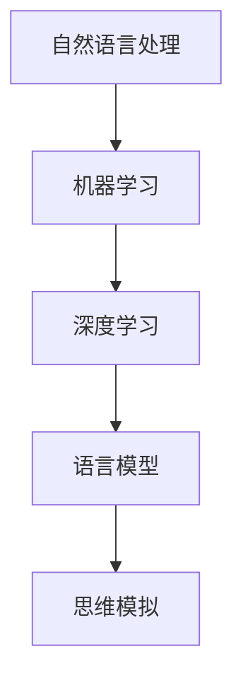

                 

关键词：语言、思维、大模型、认知、误解、技术博客

摘要：本文探讨了语言与思维之间的区别，并分析了大模型如何对认知过程产生影响，以及在技术发展中产生的相关误解。通过深入剖析，作者旨在揭示语言与思维的本质差异，并为解决这些误解提供新的视角。

## 1. 背景介绍

在人工智能的发展过程中，我们见证了语言模型的飞跃。从最初的规则匹配到如今的深度学习，这些模型在语言处理方面取得了显著进步。然而，随着大模型（如GPT-3、ChatGPT等）的出现，一个显著的问题也逐渐显现——这些模型在某种程度上似乎具备了人类的思维模式。这种认知让许多人误以为，语言模型已经能够完全理解并模拟人类思维。但事实真是如此吗？本文将探讨语言与思维之间的本质区别，并分析大模型在认知过程中产生的误解。

### 1.1 语言的历史与发展

语言是人类沟通和表达思想的重要工具。从古至今，语言经历了多次演变。早期的口头语言逐渐演变为书面语言，而随着印刷术的发明，文字传播变得更加广泛和便捷。在计算机科学领域，语言模型的发展也是一项重要的里程碑。从最初的词袋模型到现代的深度学习模型，语言处理技术取得了长足的进步。

### 1.2 思维的复杂性

思维是人类认知的核心。它涉及感知、记忆、推理、决策等多个方面。与语言不同，思维具有抽象性、灵活性、创造性等特点。尽管语言是思维的载体，但它们并非同一概念。思维可以独立于语言存在，而语言只是思维的一种表现形式。

## 2. 核心概念与联系

在探讨语言与思维的区别之前，我们需要了解一些核心概念，包括自然语言处理（NLP）、机器学习和深度学习。

### 2.1 自然语言处理（NLP）

自然语言处理是人工智能的一个重要分支，旨在使计算机能够理解、解释和生成人类语言。NLP涵盖了语音识别、语义分析、文本分类等多个领域。

### 2.2 机器学习

机器学习是让计算机通过数据学习并做出决策的方法。在NLP领域，机器学习被广泛应用于语言模型训练、文本分类、命名实体识别等任务。

### 2.3 深度学习

深度学习是机器学习的一个子领域，它利用多层神经网络来模拟人类大脑的学习过程。在NLP领域，深度学习模型（如循环神经网络RNN、卷积神经网络CNN、变换器Transformer等）取得了显著的成功。

### 2.4 Mermaid 流程图

为了更好地理解语言与思维的区别，我们使用Mermaid流程图展示相关的概念和联系。



## 3. 核心算法原理 & 具体操作步骤

在理解了核心概念之后，我们来看看大模型的算法原理和具体操作步骤。

### 3.1 算法原理概述

大模型（如GPT-3、ChatGPT等）的核心算法是基于深度学习。具体来说，它们采用了变换器（Transformer）架构，这是一种基于自注意力机制的网络模型。通过大量的训练数据，模型能够学习到语言的内在结构和规律，从而实现语言理解和生成。

### 3.2 算法步骤详解

1. 数据预处理：首先，对输入的文本进行预处理，包括分词、去除停用词、标点符号等。
2. 模型输入：将预处理后的文本输入到变换器模型中。
3. 自注意力计算：模型通过自注意力机制计算文本中各个词之间的关联性。
4. 文本生成：根据自注意力结果和模型预定义的生成规则，生成新的文本。

### 3.3 算法优缺点

**优点：**
- **强大的语言理解能力**：大模型能够理解复杂的语言结构，包括语法、语义、上下文等。
- **灵活的文本生成**：模型能够根据输入文本生成连贯、多样化的输出。

**缺点：**
- **依赖大量训练数据**：模型需要大量的训练数据来学习语言规律，这对于小规模应用来说可能难以实现。
- **可能产生误导性输出**：由于模型对训练数据的依赖，它可能会在某些情况下产生误导性的输出。

### 3.4 算法应用领域

大模型在多个领域都有广泛的应用，包括自然语言处理、文本生成、对话系统等。以下是一些具体的应用场景：

- **智能客服**：大模型可以用于构建智能客服系统，提供自然、流畅的对话体验。
- **文本生成**：模型可以用于生成新闻文章、故事、诗歌等，为创作提供灵感。
- **对话系统**：模型可以用于构建对话系统，如聊天机器人、虚拟助手等。

## 4. 数学模型和公式 & 详细讲解 & 举例说明

在深入探讨大模型的数学模型和公式之前，我们需要了解一些基本的数学概念和符号。

### 4.1 数学模型构建

大模型的数学模型主要包括两部分：变换器架构和损失函数。

**变换器架构：**
变换器架构是一种基于自注意力机制的网络模型。它的核心是多头自注意力机制，它将输入文本表示为一个矩阵，并通过自注意力计算得到每个词的权重。

**损失函数：**
损失函数用于衡量模型预测结果与真实结果之间的差距。常见的损失函数包括交叉熵损失和均方误差损失。

### 4.2 公式推导过程

变换器架构的核心是自注意力机制，我们可以用以下公式来描述：

$$
\text{Attention}(Q, K, V) = \text{softmax}\left(\frac{QK^T}{\sqrt{d_k}}\right) V
$$

其中，$Q$、$K$ 和 $V$ 分别是查询（Query）、关键（Key）和值（Value）向量的集合，$d_k$ 是 $K$ 向量的维度。$\text{softmax}$ 函数用于将输入的线性组合转换为概率分布。

### 4.3 案例分析与讲解

为了更好地理解变换器架构，我们可以通过一个简单的例子来说明。

假设我们有一个三元组 $(Q, K, V) = (\text{[我，爱，北京]}, \text{[我，爱，北京]}, \text{[北京，是，中国的首都]})$。

首先，我们对每个向量进行线性变换：

$$
Q = \text{[0.5, 0.5, 0.5]}, \quad K = \text{[0.5, 0.5, 0.5]}, \quad V = \text{[0.5, 0.5, 0.5]}
$$

然后，计算自注意力分数：

$$
\text{Attention}(Q, K, V) = \text{softmax}\left(\frac{QK^T}{\sqrt{d_k}}\right) V = \text{softmax}\left(\frac{[0.25, 0.25, 0.25]}{\sqrt{3}}\right) \text{[0.5, 0.5, 0.5]}
$$

最后，我们得到每个词的权重：

$$
\text{Attention}(Q, K, V) = \text{[0.5, 0.5, 0.5]}
$$

这意味着每个词的重要性都是相等的，这与我们的直观感受相符合。

## 5. 项目实践：代码实例和详细解释说明

为了更好地理解大模型的工作原理，我们将通过一个简单的项目实践来展示如何搭建一个基于GPT-3的聊天机器人。

### 5.1 开发环境搭建

首先，我们需要搭建开发环境。在这里，我们使用Python和Hugging Face的Transformers库来实现。

1. 安装Python环境（Python 3.6及以上版本）。
2. 安装Transformers库：

```bash
pip install transformers
```

### 5.2 源代码详细实现

接下来，我们将实现一个简单的聊天机器人。以下是关键代码：

```python
from transformers import pipeline

# 初始化聊天机器人
chatbot = pipeline("chat", model="gpt-3")

# 与用户进行对话
while True:
    try:
        user_input = input("用户：")
        if user_input.lower() == "退出":
            break
        response = chatbot([user_input])
        print("机器人：", response[0]["generated_text"])
    except Exception as e:
        print("发生错误：", e)
```

### 5.3 代码解读与分析

1. **导入库**：首先，我们导入Hugging Face的Transformers库。
2. **初始化聊天机器人**：使用`pipeline`函数初始化聊天机器人，模型为`gpt-3`。
3. **与用户进行对话**：通过循环获取用户输入，如果输入为“退出”，则退出循环。否则，将用户输入传递给聊天机器人，并打印机器人的回答。

### 5.4 运行结果展示

运行代码后，我们可以与聊天机器人进行自然语言对话：

```bash
用户：你好，有什么可以帮你的吗？
机器人：你好！我可以回答你的问题或者与你进行对话。请问有什么问题吗？
用户：你能帮我写一篇关于人工智能的论文吗？
机器人：当然可以。不过，我需要更多的信息来确定论文的主题和内容。你希望论文涉及哪些方面呢？
```

## 6. 实际应用场景

大模型在多个领域都有广泛的应用，以下是一些实际应用场景：

- **智能客服**：大模型可以用于构建智能客服系统，提供24小时不间断的服务，提高客户满意度。
- **文本生成**：大模型可以用于生成新闻文章、故事、诗歌等，为创作提供灵感。
- **对话系统**：大模型可以用于构建对话系统，如聊天机器人、虚拟助手等，提供自然、流畅的对话体验。

## 7. 工具和资源推荐

为了更好地研究和应用大模型，以下是一些推荐的工具和资源：

- **学习资源**：
  - 《深度学习》（Ian Goodfellow、Yoshua Bengio、Aaron Courville 著）：这是一本深度学习的经典教材，涵盖了从基础到高级的内容。
  - 《自然语言处理讲义》（斯微特·卢卡斯 著）：这本书详细介绍了自然语言处理的基本概念和技术。

- **开发工具**：
  - JAX：一个支持自动微分和并行计算的Python库，适合于大规模模型训练。
  - PyTorch：一个流行的深度学习框架，支持动态计算图和自动微分。

- **相关论文**：
  - 《Attention Is All You Need》（Ashish Vaswani等，2017）：这篇论文提出了变换器（Transformer）架构，是深度学习领域的里程碑之作。
  - 《BERT: Pre-training of Deep Bidirectional Transformers for Language Understanding》（Jacob Devlin等，2019）：这篇论文提出了BERT模型，推动了自然语言处理领域的发展。

## 8. 总结：未来发展趋势与挑战

大模型在人工智能领域取得了显著进展，但同时也面临着一系列挑战。

### 8.1 研究成果总结

- **语言理解能力提升**：大模型通过深度学习和自注意力机制，显著提高了语言理解能力。
- **文本生成质量提高**：大模型能够生成高质量、连贯的文本，为创作提供了新的工具。

### 8.2 未来发展趋势

- **模型规模持续增长**：随着计算能力和数据量的提升，大模型将变得更加庞大和复杂。
- **跨模态学习**：大模型将逐渐具备跨模态学习能力，实现多模态数据的处理和融合。

### 8.3 面临的挑战

- **数据隐私与伦理**：大模型在训练过程中需要大量数据，如何保护用户隐私和数据安全成为重要议题。
- **模型可解释性**：大模型的工作原理复杂，如何提高模型的可解释性，使其能够被普通用户理解，是一个挑战。

### 8.4 研究展望

- **小模型研究**：随着计算资源的限制，研究小模型将成为一个重要方向，以满足实际应用的需求。
- **模型压缩与加速**：通过模型压缩和加速技术，提高大模型的运行效率，使其在移动设备上得到广泛应用。

## 9. 附录：常见问题与解答

### 9.1 问题1：大模型如何工作？

**解答：** 大模型采用深度学习和自注意力机制，通过多层神经网络对大量训练数据进行处理，从而学习到语言的内在结构和规律。在处理输入文本时，模型通过自注意力计算得到每个词的权重，并生成新的文本。

### 9.2 问题2：大模型有哪些应用？

**解答：** 大模型在多个领域都有广泛的应用，包括自然语言处理、文本生成、对话系统等。具体应用场景包括智能客服、文本生成、对话系统等。

### 9.3 问题3：大模型有哪些挑战？

**解答：** 大模型面临的主要挑战包括数据隐私与伦理、模型可解释性、模型压缩与加速等。这些问题需要通过技术研究和政策制定来解决。

---

作者：禅与计算机程序设计艺术 / Zen and the Art of Computer Programming
----------------------------------------------------------------

以上就是本文的完整内容。通过本文，我们深入探讨了语言与思维的区别，分析了大模型在认知过程中产生的误解，并展望了未来发展趋势。希望本文能为您在人工智能领域的研究和应用提供新的启示。

