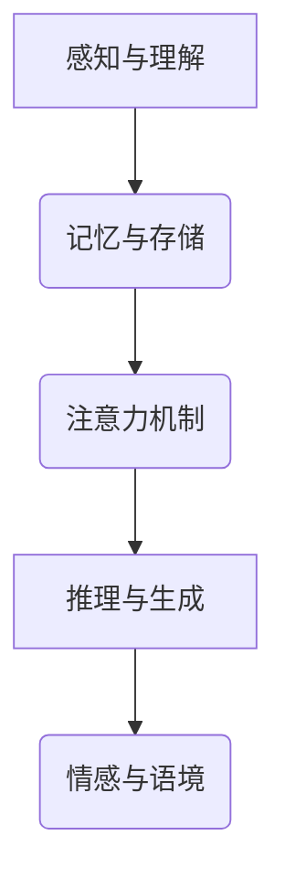

                 

关键词：自然语言处理，大模型，认知科学，推理能力，人工智能

> 摘要：本文深入探讨了大规模语言模型在理解和推理方面的挑战。通过对人类认知过程的类比，分析了语言模型在处理复杂语义和长文本时的瓶颈，并提出了可能的解决方案。文章旨在为相关领域的研究者和开发者提供有价值的参考和思考。

## 1. 背景介绍

随着深度学习和自然语言处理技术的飞速发展，大规模语言模型（如GPT-3、BERT等）在自然语言理解、文本生成、问答系统等方面取得了显著进展。这些模型在处理简单和常见任务时表现出色，但面对复杂和抽象的语言现象时，却往往显得力不从心。语言模型的这种认知瓶颈，不仅限制了其在实际应用中的表现，也引发了人们对人工智能是否能够真正理解人类语言和思维的深刻反思。

本文将从认知科学的视角出发，探讨大规模语言模型在语言理解和推理方面的瓶颈，分析其背后的原因，并提出可能的解决方案。通过这一探讨，我们希望为人工智能语言处理领域的发展提供新的思路和方向。

## 2. 核心概念与联系

### 2.1 语言与认知

语言是人类思维的外在表现，而认知是大脑处理信息的过程。从认知科学的视角来看，语言是认知的一个组成部分，两者密不可分。人类大脑在处理语言信息时，会涉及多种认知功能，包括感知、记忆、注意力、推理和情感等。这些认知功能共同作用，使得人类能够理解和产生语言。

### 2.2 大规模语言模型

大规模语言模型是一种基于深度学习的自然语言处理技术，其核心思想是通过学习海量语言数据，自动提取语言的规律和特征，从而实现语言理解和生成。这些模型通常由数十亿甚至上百亿个参数构成，具有强大的表示能力和计算能力。

### 2.3 推理能力

推理能力是指从已知信息中推导出新信息的能力。在语言处理中，推理能力主要体现在两个方面：一是语义推理，即理解语言中的隐含含义和关系；二是逻辑推理，即从前提中推导出结论。

### 2.4 Mermaid 流程图



## 3. 核心算法原理 & 具体操作步骤

### 3.1 算法原理概述

大规模语言模型的工作原理可以概括为三个阶段：数据预处理、模型训练和推理。

- **数据预处理**：对原始语言数据进行清洗、分词、编码等预处理操作，将其转换为模型可处理的输入格式。
- **模型训练**：通过反向传播算法，将预处理后的数据输入到神经网络中，不断调整模型的参数，使其能够更好地拟合训练数据。
- **推理**：将新的语言数据输入到训练好的模型中，模型根据输入数据生成对应的输出结果。

### 3.2 算法步骤详解

1. **数据预处理**：
   - **清洗**：去除数据中的噪声和无关信息，如HTML标签、特殊字符等。
   - **分词**：将句子拆分成词或子词。
   - **编码**：将词或子词转换为向量表示。

2. **模型训练**：
   - **初始化参数**：随机初始化模型的参数。
   - **前向传播**：将输入数据通过神经网络，计算每个神经元的输出。
   - **后向传播**：根据输出结果和真实标签，计算模型参数的梯度，并更新参数。

3. **推理**：
   - **输入数据**：将新的语言数据输入到训练好的模型中。
   - **输出结果**：模型根据输入数据生成对应的输出结果。

### 3.3 算法优缺点

**优点**：
- **强大的表示能力**：能够自动提取语言的深层特征，对复杂语义有较好的理解能力。
- **高效的计算性能**：基于深度学习框架，可以快速处理大规模数据。

**缺点**：
- **对数据的依赖性较强**：模型的性能很大程度上取决于训练数据的数量和质量。
- **推理能力有限**：在面对复杂和抽象的语言现象时，仍然存在认知瓶颈。

### 3.4 算法应用领域

大规模语言模型在多个领域都有广泛的应用，包括：

- **自然语言理解**：文本分类、情感分析、命名实体识别等。
- **文本生成**：文章生成、对话系统、机器翻译等。
- **问答系统**：智能客服、教育辅导、医疗咨询等。

## 4. 数学模型和公式 & 详细讲解 & 举例说明

### 4.1 数学模型构建

大规模语言模型通常基于神经网络，其核心是多层感知机（MLP）。MLP的基本数学模型可以表示为：

$$
y = f(\mathbf{W}^T \mathbf{x} + b)
$$

其中，$y$ 是输出，$f$ 是激活函数，$\mathbf{W}$ 是权重矩阵，$\mathbf{x}$ 是输入，$b$ 是偏置。

### 4.2 公式推导过程

大规模语言模型的训练过程可以通过以下步骤进行推导：

1. **前向传播**：

$$
\mathbf{z} = \mathbf{W}^T \mathbf{x} + b
$$

$$
a = f(\mathbf{z})
$$

2. **后向传播**：

$$
\delta_a = \frac{\partial L}{\partial a}
$$

$$
\delta_z = \delta_a \cdot \frac{\partial f}{\partial z}
$$

$$
\delta_{W} = \delta_z \cdot \mathbf{x}
$$

$$
\delta_{b} = \delta_z
$$

3. **参数更新**：

$$
\mathbf{W} = \mathbf{W} - \alpha \cdot \delta_{W}
$$

$$
b = b - \alpha \cdot \delta_{b}
$$

### 4.3 案例分析与讲解

假设我们有一个简单的神经网络，用于对二元分类问题进行建模。输入为两个特征向量 $\mathbf{x}_1$ 和 $\mathbf{x}_2$，输出为二分类结果 $y$。神经网络的模型如下：

$$
y = \sigma(\mathbf{W}^T \mathbf{x} + b)
$$

其中，$\sigma$ 表示 sigmoid 函数。

假设我们有一个训练样本集，包含 100 个样本，每个样本都有两个特征和对应的标签。通过前向传播和后向传播，我们可以不断更新网络的参数，使其对训练数据进行拟合。

经过多次迭代训练，网络的参数逐渐趋于稳定，其输出结果与真实标签之间的误差不断减小。最终，网络的输出结果可以很好地预测新的样本，从而实现对二元分类问题的建模。

## 5. 项目实践：代码实例和详细解释说明

### 5.1 开发环境搭建

为了进行大规模语言模型的开发和实践，我们需要搭建一个合适的开发环境。以下是一个基本的开发环境搭建步骤：

1. **安装 Python**：Python 是大规模语言模型开发的主要编程语言，我们需要安装 Python 3.7 或以上版本。
2. **安装 TensorFlow**：TensorFlow 是一个开源的深度学习框架，我们可以通过以下命令安装：

   ```bash
   pip install tensorflow
   ```

3. **安装其他依赖**：根据具体项目需求，可能需要安装其他依赖库，如 NumPy、Pandas 等。

### 5.2 源代码详细实现

以下是一个简单的基于 TensorFlow 的神经网络模型，用于对二元分类问题进行建模：

```python
import tensorflow as tf
from tensorflow.keras.layers import Dense, Input
from tensorflow.keras.models import Model

# 定义输入层
input_1 = Input(shape=(2,))
input_2 = Input(shape=(2,))

# 定义隐藏层
hidden = Dense(10, activation='relu')(input_1)
hidden = Dense(10, activation='relu')(hidden)

# 定义输出层
output = Dense(1, activation='sigmoid')(hidden)

# 创建模型
model = Model(inputs=[input_1, input_2], outputs=output)

# 编译模型
model.compile(optimizer='adam', loss='binary_crossentropy', metrics=['accuracy'])

# 查看模型结构
model.summary()
```

### 5.3 代码解读与分析

上述代码首先定义了两个输入层，分别对应两个特征向量。然后通过两个全连接层（Dense）实现隐藏层的构建，激活函数为 ReLU。最后，通过一个输出层（Dense）实现二分类的输出。

模型编译时，选择 Adam 优化器，并使用 binary_crossentropy 作为损失函数，适用于二元分类问题。通过调用 model.summary()，可以查看模型的详细结构。

### 5.4 运行结果展示

假设我们已经准备好了训练数据集，包含 100 个样本，每个样本都有两个特征和对应的标签。接下来，我们可以使用以下代码进行模型训练和评估：

```python
# 准备训练数据
x_train = ...  # 特征数据
y_train = ...  # 标签数据

# 训练模型
model.fit(x_train, y_train, epochs=10, batch_size=32)

# 评估模型
loss, accuracy = model.evaluate(x_train, y_train)
print(f"Test loss: {loss}, Test accuracy: {accuracy}")
```

通过调用 model.fit()，我们可以对模型进行训练。在训练过程中，模型会不断更新参数，以最小化损失函数。在训练完成后，通过调用 model.evaluate()，我们可以评估模型在测试集上的性能。

## 6. 实际应用场景

### 6.1 自然语言理解

大规模语言模型在自然语言理解方面有着广泛的应用。例如，在文本分类任务中，模型可以自动将文本划分为不同的类别，如新闻、博客、评论等。在情感分析任务中，模型可以识别文本中的情感倾向，如正面、负面、中性等。

### 6.2 文本生成

大规模语言模型在文本生成方面也表现出色。例如，在自动摘要任务中，模型可以自动生成文本的摘要；在机器翻译任务中，模型可以自动翻译一种语言到另一种语言。

### 6.3 问答系统

大规模语言模型在问答系统方面也有重要应用。例如，在智能客服系统中，模型可以自动回答用户的问题；在教育辅导系统中，模型可以为学生提供个性化的辅导。

## 6.4 未来应用展望

随着人工智能技术的不断发展，大规模语言模型在未来的应用前景将更加广阔。以下是一些可能的应用方向：

- **智能客服**：通过大规模语言模型，可以实现更自然、更智能的客服系统，提高用户体验。
- **教育辅导**：通过大规模语言模型，可以为学生提供个性化的学习方案，提高学习效果。
- **医疗咨询**：通过大规模语言模型，可以辅助医生进行疾病诊断和治疗方案推荐。

## 7. 工具和资源推荐

### 7.1 学习资源推荐

- 《深度学习》（Goodfellow, Bengio, Courville）是一本经典的深度学习教材，涵盖了大规模语言模型的基本概念和技术。
- 《自然语言处理与深度学习》（李航）是一本中文的自然语言处理教材，对大规模语言模型有详细的介绍。
- arXiv.org 是一个包含最新深度学习和自然语言处理论文的学术网站，可以了解该领域的研究动态。

### 7.2 开发工具推荐

- TensorFlow 是一个开源的深度学习框架，支持大规模语言模型的开发和训练。
- PyTorch 是另一个流行的深度学习框架，提供灵活的编程接口和强大的计算能力。

### 7.3 相关论文推荐

- "Attention Is All You Need"（Vaswani et al., 2017）是 Transformer 模型的开创性论文，介绍了自注意力机制在语言模型中的应用。
- "BERT: Pre-training of Deep Bidirectional Transformers for Language Understanding"（Devlin et al., 2019）是 BERT 模型的论文，提出了预训练和双向编码器 Representation 的方法。

## 8. 总结：未来发展趋势与挑战

### 8.1 研究成果总结

大规模语言模型在自然语言处理领域取得了显著的成果，其在语言理解、文本生成、问答系统等方面表现出色。通过不断的优化和改进，模型在处理复杂语义和长文本时的能力逐渐增强。

### 8.2 未来发展趋势

未来，大规模语言模型将继续向更高效、更智能的方向发展。一方面，模型将不断增大，以提升其表示能力和计算能力；另一方面，模型将引入更多的高级认知功能，如推理、情感分析等。

### 8.3 面临的挑战

尽管大规模语言模型在许多任务上表现出色，但仍面临一些挑战。首先，模型对数据的依赖性较强，训练数据的质量和数量对模型性能有很大影响。其次，模型在推理能力方面仍有待提升，特别是在处理复杂和抽象的语言现象时。此外，模型的可解释性和可靠性也是亟待解决的问题。

### 8.4 研究展望

未来，研究者将致力于解决大规模语言模型在数据依赖性、推理能力和可解释性等方面的问题，以提高模型在实际应用中的性能和可靠性。同时，将探索更多的高级认知功能，使模型更好地模拟人类的语言和思维过程。

## 9. 附录：常见问题与解答

### 9.1 问题 1：什么是大规模语言模型？

答：大规模语言模型是一种基于深度学习的自然语言处理技术，通过学习海量语言数据，自动提取语言的规律和特征，实现语言理解和生成。

### 9.2 问题 2：大规模语言模型有哪些应用？

答：大规模语言模型在自然语言理解、文本生成、问答系统、机器翻译等领域有广泛的应用。

### 9.3 问题 3：如何解决大规模语言模型的推理能力问题？

答：研究者可以引入更多的高级认知功能，如推理、情感分析等，同时优化模型结构和训练过程，以提高推理能力。

### 9.4 问题 4：如何保证大规模语言模型的可解释性？

答：研究者可以开发可解释性模型，通过可视化、抽象解释等方式，提高模型的可解释性。

## 作者署名

作者：禅与计算机程序设计艺术 / Zen and the Art of Computer Programming

[END]

