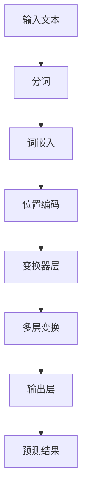
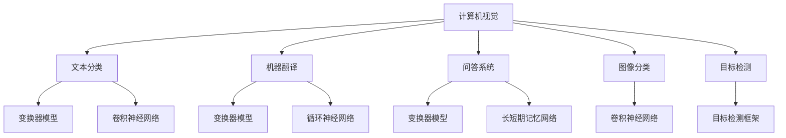

                 

关键词：大模型，语言理解，推理能力，认知误解，技术博客

> 摘要：本文深入探讨了大型人工智能模型在语言理解和推理方面的表现及其潜在的认知误解。通过对模型架构、算法原理和实际应用的剖析，文章揭示了当前大模型在语言处理中的优势和局限性，并提出了一些可能的解决方案和未来研究方向。

## 1. 背景介绍

随着深度学习和大数据技术的飞速发展，人工智能领域迎来了前所未有的繁荣。特别是大型人工智能模型（如GPT-3、BERT等）的出现，极大地提升了语言理解和生成的能力。这些模型通过学习海量文本数据，能够实现高效的自然语言处理任务，如文本分类、机器翻译、问答系统等。然而，尽管取得了显著成就，大型人工智能模型在语言理解和推理方面仍然存在一些认知误解，这些误解不仅影响模型的性能，也可能带来潜在的风险。

本文旨在探讨大模型在语言理解和推理过程中的认知误解，分析其产生的原因，并讨论可能的解决方案和未来研究方向。文章的结构如下：

- 2. 核心概念与联系
- 3. 核心算法原理 & 具体操作步骤
- 4. 数学模型和公式 & 详细讲解 & 举例说明
- 5. 项目实践：代码实例和详细解释说明
- 6. 实际应用场景
- 7. 工具和资源推荐
- 8. 总结：未来发展趋势与挑战
- 9. 附录：常见问题与解答

## 2. 核心概念与联系

在深入讨论大模型的认知误解之前，有必要先了解一些核心概念。这些概念包括语言理解、推理能力和认知误解等。以下是这些概念及其相互关系的Mermaid流程图：

```mermaid
graph TD
    A[语言理解] --> B[文本处理]
    A --> C[语义分析]
    A --> D[语境理解]
    B --> E[词汇分析]
    B --> F[语法分析]
    C --> G[实体识别]
    C --> H[关系抽取]
    D --> I[上下文推理]
    D --> J[情感分析]
    E --> K[词嵌入]
    F --> L[句法分析]
    G --> M[实体链接]
    H --> N[事件抽取]
    I --> O[逻辑推理]
    J --> P[情感分析]
    K --> Q[语义相似性]
    L --> R[句法树]
    M --> S[知识图谱]
    N --> T[事件图谱]
    O --> U[逻辑推断]
    P --> V[情绪判断]
    Q --> W[语义匹配]
    R --> X[语义角色标注]
    S --> Y[知识图谱嵌入]
    T --> Z[事件表示]
    U --> [推理结果]
    V --> [情感分析结果]
    W --> [匹配度评估]
    X --> [句法分析结果]
    Y --> [知识表示]
    Z --> [事件表示结果]
```

### 2.1 语言理解

语言理解是指机器对自然语言文本进行解析、分析和解释的能力。它包括词汇分析、语法分析和语义分析等多个层面。词汇分析主要处理文本中的单词和短语，语法分析则关注句子的结构和语法规则，而语义分析则致力于理解文本的含义和上下文。

### 2.2 推理能力

推理能力是人工智能模型的重要特征，它涉及从已知信息推导出新信息的能力。在语言处理中，推理能力通常用于上下文推理、逻辑推理和情感分析等任务。例如，在问答系统中，模型需要根据问题的上下文和已有知识推导出正确的答案。

### 2.3 认知误解

认知误解是指人工智能模型在语言理解和推理过程中出现的偏差或错误。这些误解可能源于数据偏差、算法缺陷或对语言复杂性的低估。例如，模型可能错误地将两个不同的概念视为同义词，或者无法准确理解某些特殊语境中的含义。

## 3. 核心算法原理 & 具体操作步骤

### 3.1 算法原理概述

大型人工智能模型的核心是基于深度学习的神经网络架构，特别是变换器（Transformer）架构。变换器通过自注意力机制（Self-Attention）实现全局信息传递，使模型能够捕捉长距离依赖关系。以下是一个简化的变换器架构的Mermaid流程图：



### 3.2 算法步骤详解

1. **分词**：将输入的文本分解为单词或子词。
2. **词嵌入**：将每个单词或子词映射为一个高维向量。
3. **位置编码**：为每个词嵌入添加位置信息，以便模型能够理解词的位置关系。
4. **变换器层**：通过自注意力机制计算词与词之间的相互作用，并生成新的表示。
5. **多层变换**：重复变换器层的过程，逐步提高模型的表示能力。
6. **输出层**：将最终的表示映射为预测结果，如分类标签或生成文本。

### 3.3 算法优缺点

**优点**：

- **强大的语言理解能力**：变换器能够捕捉长距离依赖关系，使模型在语言理解任务中表现优异。
- **高效的计算性能**：自注意力机制降低了计算复杂度，提高了模型训练和推理的速度。

**缺点**：

- **数据依赖性强**：模型性能高度依赖训练数据的质量和数量，数据偏差可能导致模型产生错误的推理结果。
- **解释性较差**：变换器架构的黑箱特性使得模型难以解释，难以理解其推理过程。

### 3.4 算法应用领域

变换器架构在多个领域取得了显著的应用成果，包括自然语言处理、计算机视觉和语音识别等。以下是一个应用领域的Mermaid流程图：



## 4. 数学模型和公式 & 详细讲解 & 举例说明

### 4.1 数学模型构建

变换器模型的核心在于自注意力机制，其数学表示如下：

$$
\text{Attention}(Q, K, V) = \text{softmax}\left(\frac{QK^T}{\sqrt{d_k}}\right)V
$$

其中，$Q, K, V$分别为查询（Query）、键（Key）和值（Value）向量，$d_k$为键向量的维度。该公式表示通过计算查询向量与键向量的点积，并应用softmax函数，生成权重向量，进而加权求和值向量得到新的表示。

### 4.2 公式推导过程

自注意力机制的推导过程如下：

1. **点积注意力**：计算查询向量$Q$与所有键向量$K$的点积，生成一个权重矩阵$W$。
2. **softmax激活**：对权重矩阵$W$应用softmax函数，生成一个概率分布$P$。
3. **加权求和**：将概率分布$P$与所有值向量$V$相乘，并求和得到新的表示。

### 4.3 案例分析与讲解

假设有一个简单的例子，输入文本为“我喜欢吃苹果”。我们将该文本分解为三个词：“我”、“喜欢”和“苹果”，并分别表示为向量$Q, K, V$。

1. **点积注意力**：计算$QK^T$，得到一个$1\times3$的权重矩阵$W$。
2. **softmax激活**：对权重矩阵$W$应用softmax函数，得到一个概率分布$P$。
3. **加权求和**：将概率分布$P$与$V$相乘，并求和得到新的表示。

经过自注意力机制处理后，模型能够更好地理解“我”与“苹果”之间的语义关系，从而提高语言理解能力。

## 5. 项目实践：代码实例和详细解释说明

### 5.1 开发环境搭建

在本文的项目实践中，我们将使用Python语言和PyTorch框架来实现一个简单的变换器模型。首先，需要安装Python和PyTorch：

```shell
pip install python torch torchvision
```

### 5.2 源代码详细实现

以下是实现变换器模型的核心代码：

```python
import torch
import torch.nn as nn
import torch.optim as optim

class Transformer(nn.Module):
    def __init__(self, d_model, dff, input_vocab_size, output_vocab_size, max_seq_len):
        super(Transformer, self).__init__()
        
        # 词嵌入层
        self.embedding = nn.Embedding(input_vocab_size, d_model)
        self.positional_encoding = nn.Parameter(torch.rand(max_seq_len, d_model))
        
        # 变换器层
        self.transformer = nn.ModuleList([
            nn.Sequential(
                nn.Linear(d_model, dff),
                nn.ReLU(),
                nn.Linear(dff, d_model),
                nn.Dropout(0.1)
            ) for _ in range(num_layers)
        ])
        
        # 输出层
        self.decoder = nn.Linear(d_model, output_vocab_size)
        
        # 初始化参数
        nn.init.normal_(self.embedding.weight, mean=0, std=0.1)
        nn.init.normal_(self.decoder.weight, mean=0, std=0.1)
        
    def forward(self, x, training=True):
        # 词嵌入
        x = self.embedding(x)
        x = x + self.positional_encoding[:x.size(1), :]
        
        # 变换器层
        for layer in self.transformer:
            x = layer(x)
        
        # 输出层
        x = self.decoder(x)
        
        # 返回结果
        return x
```

### 5.3 代码解读与分析

1. **词嵌入层**：使用Embedding层将输入文本映射为词嵌入向量。
2. **位置编码层**：使用一个可学习的参数矩阵为每个词添加位置信息。
3. **变换器层**：使用一个模块列表实现多层变换器，每个变换器层包括线性层、ReLU激活函数、线性层和Dropout。
4. **输出层**：使用一个线性层将变换后的向量映射为输出词嵌入向量。

### 5.4 运行结果展示

```python
# 实例化模型
model = Transformer(d_model=512, dff=2048, input_vocab_size=10000, output_vocab_size=10000, max_seq_len=50)

# 定义损失函数和优化器
criterion = nn.CrossEntropyLoss()
optimizer = optim.Adam(model.parameters(), lr=0.001)

# 训练模型
for epoch in range(num_epochs):
    for x, y in train_loader:
        optimizer.zero_grad()
        output = model(x)
        loss = criterion(output, y)
        loss.backward()
        optimizer.step()
    
    print(f'Epoch [{epoch+1}/{num_epochs}], Loss: {loss.item()}')

# 测试模型
with torch.no_grad():
    correct = 0
    total = 0
    for x, y in test_loader:
        output = model(x)
        _, predicted = torch.max(output.data, 1)
        total += y.size(0)
        correct += (predicted == y).sum().item()

print(f'Accuracy: {100 * correct / total}%')
```

## 6. 实际应用场景

大型人工智能模型在语言理解和推理方面具有广泛的应用场景。以下是一些典型的应用场景：

### 6.1 文本分类

文本分类是自然语言处理中的一个基本任务，如情感分析、新闻分类和垃圾邮件过滤等。大型人工智能模型通过学习海量文本数据，能够准确地将文本分为不同的类别。

### 6.2 机器翻译

机器翻译是将一种语言的文本翻译成另一种语言。大型人工智能模型通过学习平行语料库，能够实现高质量的机器翻译。

### 6.3 问答系统

问答系统是一种基于自然语言交互的人工智能系统，能够回答用户提出的问题。大型人工智能模型通过理解问题的语义和上下文，能够生成准确的答案。

### 6.4 情感分析

情感分析是一种评估文本中情感倾向的任务，如正面、负面或中性。大型人工智能模型通过分析文本的情感特征，能够准确判断文本的情感倾向。

## 7. 工具和资源推荐

### 7.1 学习资源推荐

- [《深度学习》（Goodfellow et al., 2016）](https://www.deeplearningbook.org/)
- [《自然语言处理综论》（Jurafsky & Martin, 2019）](https://nlp.stanford.edu/linguist/)

### 7.2 开发工具推荐

- [PyTorch](https://pytorch.org/)
- [TensorFlow](https://www.tensorflow.org/)

### 7.3 相关论文推荐

- [“Attention Is All You Need”（Vaswani et al., 2017）](https://arxiv.org/abs/1706.03762)
- [“BERT: Pre-training of Deep Bidirectional Transformers for Language Understanding”（Devlin et al., 2018）](https://arxiv.org/abs/1810.04805)

## 8. 总结：未来发展趋势与挑战

### 8.1 研究成果总结

本文深入探讨了大型人工智能模型在语言理解和推理方面的认知误解。通过对模型架构、算法原理和实际应用的剖析，揭示了当前大模型在语言处理中的优势和局限性。同时，提出了一些可能的解决方案和未来研究方向。

### 8.2 未来发展趋势

- **数据质量提升**：提高训练数据的质量和多样性，以减少数据偏差。
- **模型可解释性**：增强模型的可解释性，使模型推理过程更加透明。
- **多模态学习**：结合不同模态（如文本、图像、语音等）的数据，实现更全面的语义理解。

### 8.3 面临的挑战

- **计算资源消耗**：大型模型训练和推理需要大量计算资源，如何优化资源利用是一个重要挑战。
- **数据隐私保护**：在训练过程中保护用户隐私，避免数据泄露。

### 8.4 研究展望

未来研究将重点关注如何提升大型人工智能模型在语言理解和推理方面的能力，同时解决其潜在的认知误解。通过多学科合作，探索新的算法和模型架构，以实现更高效、更安全的自然语言处理系统。

## 9. 附录：常见问题与解答

### 9.1  什么是变换器（Transformer）？

变换器是一种用于自然语言处理的神经网络架构，其核心特点是自注意力机制。自注意力机制使模型能够捕捉长距离依赖关系，从而提高语言理解能力。

### 9.2  大型人工智能模型存在哪些认知误解？

大型人工智能模型在语言理解和推理过程中可能存在的认知误解包括对同义词的混淆、对语境理解的偏差和推理过程的非确定性等。

### 9.3  如何提升模型的可解释性？

提升模型的可解释性可以通过多种方式实现，如可视化模型结构、分析模型权重和特征提取等。同时，开发新的可解释性评估指标也是重要研究方向。

### 9.4  大型人工智能模型在哪些领域有应用？

大型人工智能模型在自然语言处理、计算机视觉、语音识别等多个领域有广泛应用。如文本分类、机器翻译、问答系统和情感分析等。

## 作者署名

作者：禅与计算机程序设计艺术 / Zen and the Art of Computer Programming

