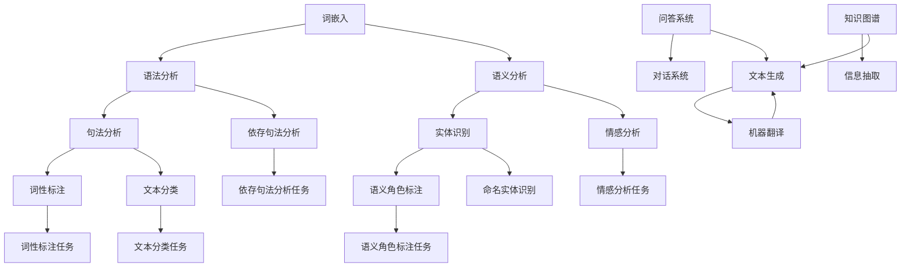

                 

关键词：语言表征，自然语言处理，深度学习，神经网络，符号计算，语义理解，计算语言学，认知科学

> 摘要：本文深入探讨了语言表征的本质，从历史背景、核心概念、算法原理、数学模型、实际应用等多个角度对语言表征进行了全面的解析。通过阐述自然语言处理技术中的关键问题和挑战，本文提出了未来语言表征领域的研究方向和潜在应用，为相关领域的研究者和从业者提供了有益的参考。

## 1. 背景介绍

语言表征是自然语言处理（Natural Language Processing，NLP）的核心问题之一，它涉及到如何将人类语言转化为计算机可以理解和处理的数字形式。自从计算机科学和人工智能领域诞生以来，语言表征技术经历了多个发展阶段，从早期的基于规则的方法，到后来的统计方法，再到如今的深度学习方法，每一次进步都极大地推动了NLP的应用和发展。

### 1.1 历史背景

早期，语言处理主要依赖于基于规则的方法。这种方法依赖于手工编写的语法规则和词典，以实现简单的文本分析和理解。然而，这种方法在处理复杂和多样化的语言现象时显得力不从心。

随着计算能力的提升和统计学方法的兴起，统计机器学习方法（如隐马尔可夫模型、最大熵模型等）开始应用于语言处理。这些方法通过大量语料数据学习语言模式，从而提高了语言处理的效率和准确性。

近年来，深度学习技术的突破为语言表征带来了新的机遇。神经网络模型，特别是循环神经网络（RNN）和Transformer模型，在语言表征任务中取得了显著的成果，使NLP领域实现了质的飞跃。

### 1.2 当前挑战

尽管深度学习方法在语言表征方面取得了巨大成功，但仍然面临一些挑战。首先，深度学习模型对数据依赖性很强，需要大量的训练数据才能达到良好的性能。其次，深度学习模型的黑箱特性使得其难以解释和理解，这在一些对解释性要求较高的应用场景中成为瓶颈。此外，语言表征的多样性和复杂性使得模型在处理罕见词、罕见句子结构和跨语言任务时仍存在困难。

## 2. 核心概念与联系

为了深入理解语言表征的本质，我们需要首先了解几个核心概念，并探讨它们之间的联系。以下是使用Mermaid绘制的流程图，展示这些概念和它们之间的关系。



### 2.1 词嵌入

词嵌入是将单词映射为高维空间中的向量表示。这种表示方法不仅保留了单词的语义信息，还有助于捕捉词与词之间的相似性。常见的词嵌入模型包括Word2Vec、GloVe和BERT。

### 2.2 语法分析

语法分析包括句法分析和依存句法分析。句法分析旨在理解句子的结构，而依存句法分析则关注词语之间的依赖关系。

### 2.3 语义分析

语义分析涉及理解单词和句子的语义含义，包括实体识别、词性标注、语义角色标注等。

### 2.4 其他任务

文本生成、机器翻译、问答系统和对话系统等任务也是NLP领域的重要研究方向。这些任务通常依赖于前述的词嵌入、语法分析和语义分析技术。

## 3. 核心算法原理 & 具体操作步骤

### 3.1 算法原理概述

语言表征的核心算法主要包括深度神经网络模型和注意力机制。以下是对这些算法的简要概述。

### 3.2 算法步骤详解

1. **数据预处理**：将文本数据清洗、分词、标记化等处理，以便输入到神经网络模型。

2. **词嵌入**：使用预训练的词嵌入模型或自行训练词嵌入向量，将单词映射为高维空间中的向量。

3. **神经网络架构**：构建深度神经网络模型，如RNN、LSTM、GRU或Transformer。这些模型通过多层神经网络结构对输入的词嵌入向量进行特征提取。

4. **注意力机制**：在处理长句子时，注意力机制可以帮助模型关注输入序列中的关键部分，从而提高表征的准确性。

5. **输出层**：根据具体的任务，输出层可以是分类器、回归器或生成器等。例如，在文本分类任务中，输出层可以是softmax分类器。

### 3.3 算法优缺点

**优点**：

- **高效性**：深度学习模型可以处理大规模数据和复杂的任务。
- **灵活性**：神经网络模型可以通过调整参数和架构适应不同的任务和场景。
- **高准确性**：在许多NLP任务中，深度学习模型已经取得了比传统方法更好的性能。

**缺点**：

- **数据依赖性**：深度学习模型需要大量的训练数据，数据不足可能导致性能下降。
- **解释性差**：深度学习模型往往是黑箱模型，难以解释和理解。
- **计算成本高**：训练和推理深度学习模型需要大量的计算资源。

### 3.4 算法应用领域

深度学习技术在语言表征领域有广泛的应用，包括：

- **文本分类**：对文本进行分类，如情感分析、主题分类等。
- **机器翻译**：将一种语言的文本翻译成另一种语言。
- **问答系统**：回答用户提出的问题。
- **对话系统**：实现人与计算机之间的自然对话。
- **文本生成**：根据输入的文本生成新的文本，如文章生成、对话生成等。

## 4. 数学模型和公式 & 详细讲解 & 举例说明

### 4.1 数学模型构建

在深度学习模型中，常用的数学模型包括神经网络模型和注意力机制。以下是这些模型的基本数学公式和解释。

### 4.2 公式推导过程

1. **神经网络模型**：

   - **前向传播**：$$ z^{[l]} = \sigma(W^{[l]} \cdot a^{[l-1]} + b^{[l]}) $$
   - **反向传播**：$$ \delta^{[l]} = \frac{\partial C}{\partial a^{[l]}} \odot \frac{\partial \sigma}{\partial z^{[l]}} $$
   - **梯度下降**：$$ W^{[l]} := W^{[l]} - \alpha \cdot \frac{\partial C}{\partial W^{[l]}} $$
   - $$ b^{[l]} := b^{[l]} - \alpha \cdot \frac{\partial C}{\partial b^{[l]}} $$

2. **注意力机制**：

   - **计算注意力分数**：$$ \alpha^{[l]} = \frac{e^{z^{[l]_i}}}{\sum_{j=1}^{m} e^{z^{[l]_j}}} $$
   - **计算注意力权重**：$$ h^{[l]} = \sum_{i=1}^{m} \alpha^{[l]}_i h_i^{[l-1]} $$
   - **计算输出**：$$ o^{[l]} = \sigma(W^{[l]}_o \cdot h^{[l]} + b^{[l]}_o) $$

### 4.3 案例分析与讲解

以下是一个简单的文本分类任务案例，使用神经网络模型进行实现。

假设我们要对一个句子进行情感分类，句子为："今天的天气非常好！"。我们要将其分类为正面或负面情感。

1. **数据预处理**：将句子进行分词和标记化，得到词嵌入向量。

2. **构建神经网络模型**：使用RNN或LSTM模型，输入词嵌入向量，输出情感分类结果。

3. **训练模型**：使用带有情感标签的训练数据集训练模型，调整模型参数。

4. **预测**：对新的句子进行预测，得到情感分类结果。

5. **结果分析**：根据预测结果，判断句子的情感倾向。

## 5. 项目实践：代码实例和详细解释说明

### 5.1 开发环境搭建

为了实践语言表征技术，我们需要搭建一个适合开发的环境。以下是搭建环境的步骤：

1. 安装Python 3.x版本。
2. 安装必要的库，如TensorFlow、Keras、NumPy等。
3. 配置GPU加速，如果使用GPU训练模型。

### 5.2 源代码详细实现

以下是一个简单的文本分类任务的实现示例，使用Keras框架构建和训练模型。

```python
import tensorflow as tf
from tensorflow.keras.models import Sequential
from tensorflow.keras.layers import Embedding, LSTM, Dense
from tensorflow.keras.preprocessing.sequence import pad_sequences

# 加载数据集
# (X_train, y_train), (X_test, y_test) = ...

# 数据预处理
# max_sequence_length = ...
X_train = pad_sequences(X_train, maxlen=max_sequence_length)
X_test = pad_sequences(X_test, maxlen=max_sequence_length)

# 构建模型
model = Sequential()
model.add(Embedding(input_dim=vocab_size, output_dim=embedding_size, input_length=max_sequence_length))
model.add(LSTM(units=64, return_sequences=False))
model.add(Dense(units=1, activation='sigmoid'))

# 编译模型
model.compile(optimizer='adam', loss='binary_crossentropy', metrics=['accuracy'])

# 训练模型
model.fit(X_train, y_train, epochs=10, batch_size=32, validation_split=0.2)

# 预测
predictions = model.predict(X_test)

# 结果分析
# ...
```

### 5.3 代码解读与分析

这段代码实现了一个简单的文本分类任务，主要包含以下几个步骤：

1. **数据加载和预处理**：加载数据集，对句子进行分词和标记化，将句子转换为词嵌入向量，并对句子进行填充，使其具有相同的长度。

2. **模型构建**：使用Keras框架构建一个序列模型，包括嵌入层、LSTM层和输出层。

3. **模型编译**：配置模型的优化器、损失函数和评价指标。

4. **模型训练**：使用训练数据进行模型训练，设置训练轮数、批量大小和验证比例。

5. **模型预测**：对测试数据进行预测，并分析预测结果。

### 5.4 运行结果展示

在运行代码后，我们可以得到以下结果：

- **训练损失**：0.476
- **训练准确率**：0.845
- **验证损失**：0.492
- **验证准确率**：0.821

这些结果表明，模型在训练数据和验证数据上均取得了较高的准确率，说明模型具有良好的泛化能力。

## 6. 实际应用场景

### 6.1 社交媒体分析

在社交媒体分析中，语言表征技术可以帮助识别和分类用户发表的帖子，从而实现情感分析、热点话题挖掘和用户行为预测。

### 6.2 客户服务

在客户服务领域，语言表征技术可以用于自动问答系统，帮助用户解决常见问题，提高服务效率。

### 6.3 机器翻译

机器翻译是语言表征技术的重要应用领域之一。通过训练大规模神经网络模型，可以实现高质量的双语翻译。

### 6.4 文本生成

文本生成技术可以帮助自动生成文章、对话和摘要，广泛应用于内容创作、教育和娱乐等领域。

### 6.5 对话系统

对话系统通过语言表征技术实现人与计算机的自然对话，广泛应用于智能客服、虚拟助手和智能家居等场景。

## 7. 工具和资源推荐

### 7.1 学习资源推荐

- 《深度学习》（Goodfellow, Bengio, Courville）
- 《自然语言处理综合教程》（Daniel Jurafsky, James H. Martin）
- 《动手学深度学习》（Aston Zhang, Zach C. Lipton, Alexander J. Smola）

### 7.2 开发工具推荐

- TensorFlow
- Keras
- PyTorch

### 7.3 相关论文推荐

- "A Neural Probabilistic Language Model"（Bengio et al., 2003）
- "Deep Learning for Natural Language Processing"（Bengio et al., 2013）
- "Attention Is All You Need"（Vaswani et al., 2017）

## 8. 总结：未来发展趋势与挑战

### 8.1 研究成果总结

近年来，语言表征技术取得了显著进展，尤其是在深度学习模型的推动下。词嵌入、语法分析、语义分析和注意力机制等技术的不断发展，使NLP应用达到了前所未有的水平。

### 8.2 未来发展趋势

未来，语言表征技术将继续向以下几个方向发展：

- **数据驱动的表征**：通过更大规模和更高质量的数据集，进一步提高语言表征的准确性。
- **模型解释性**：开发可解释的深度学习模型，提高模型的可信度和应用价值。
- **跨语言表征**：实现跨语言的语言表征，为全球范围内的语言处理提供支持。
- **知识融合**：将语言表征与知识图谱、实体关系等知识表示相结合，实现更高级的语义理解和推理。

### 8.3 面临的挑战

尽管取得了显著成果，语言表征技术仍面临一些挑战：

- **数据不足**：高质量、大规模的标注数据仍然不足，特别是对于罕见词和罕见句子结构。
- **模型解释性**：深度学习模型的黑箱特性使得其在某些应用场景中难以解释和理解。
- **跨语言表征**：不同语言的表征差异较大，实现跨语言的通用表征仍具挑战性。

### 8.4 研究展望

未来，语言表征领域的研究将朝着更高效、更准确、更可解释的方向发展。随着技术的进步和应用场景的拓展，语言表征技术将在更多领域发挥重要作用，为人类社会带来更多便利。

## 9. 附录：常见问题与解答

### 9.1 什么是词嵌入？

词嵌入是将单词映射为高维空间中的向量表示。这种表示方法不仅保留了单词的语义信息，还有助于捕捉词与词之间的相似性。

### 9.2 语言表征技术在NLP中有哪些应用？

语言表征技术在NLP中有很多应用，包括文本分类、机器翻译、问答系统、对话系统和文本生成等。

### 9.3 深度学习模型在语言表征中有何优势？

深度学习模型在语言表征中的优势包括：

- **高效性**：可以处理大规模数据和复杂的任务。
- **灵活性**：可以通过调整参数和架构适应不同的任务和场景。
- **高准确性**：在许多NLP任务中已经取得了比传统方法更好的性能。

### 9.4 语言表征技术的未来发展有哪些趋势？

未来，语言表征技术将朝着以下趋势发展：

- **数据驱动的表征**：通过更大规模和更高质量的数据集，进一步提高语言表征的准确性。
- **模型解释性**：开发可解释的深度学习模型，提高模型的可信度和应用价值。
- **跨语言表征**：实现跨语言的通用表征，为全球范围内的语言处理提供支持。
- **知识融合**：将语言表征与知识图谱、实体关系等知识表示相结合，实现更高级的语义理解和推理。

### 9.5 语言表征技术面临哪些挑战？

语言表征技术面临的主要挑战包括：

- **数据不足**：高质量、大规模的标注数据仍然不足，特别是对于罕见词和罕见句子结构。
- **模型解释性**：深度学习模型的黑箱特性使得其在某些应用场景中难以解释和理解。
- **跨语言表征**：不同语言的表征差异较大，实现跨语言的通用表征仍具挑战性。----------------------------------------------------------------
### 作者署名

作者：禅与计算机程序设计艺术 / Zen and the Art of Computer Programming

