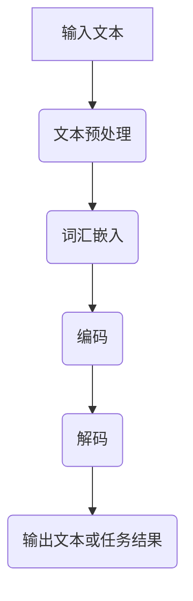

                 

 在信息技术和人工智能迅速发展的今天，语言表征作为自然语言处理（NLP）的核心，已经成为研究者和开发者关注的焦点。那么，语言表征的本质究竟是什么？本文将从多个维度深入探讨这一问题，以期为读者提供一个全面而深刻的理解。

## 1. 背景介绍

随着互联网的普及和信息爆炸，人们对于信息检索、智能问答、机器翻译等自然语言处理任务的需求日益增长。然而，传统的方法往往难以应对复杂多变的自然语言。因此，如何有效地将自然语言转化为计算机可以理解的形式，即语言表征，成为了一个亟待解决的问题。

语言表征的研究可以追溯到早期的人工智能和自然语言处理领域。20世纪50年代，计算机科学家们开始尝试通过算法来模拟人类的语言理解能力。随着神经网络、深度学习等技术的进步，语言表征的研究逐渐走向成熟。目前，词向量、语言模型、注意力机制等已经成为语言表征研究的重要方向。

## 2. 核心概念与联系

### 2.1 语言表征的基本概念

语言表征是指将自然语言中的词汇、句子、段落等文本形式转化为计算机可以处理和理解的数字形式。这一过程包括词汇表征、句法表征和语义表征等多个层面。

- **词汇表征**：将单个词汇映射为一个固定长度的向量，以便计算机可以存储和处理。
- **句法表征**：将句子中的词汇和语法结构映射为一定的结构或序列，以便计算机可以理解句子的语法规则。
- **语义表征**：将词汇和句子的语义信息映射为一定的结构或向量，以便计算机可以理解词汇和句子的含义。

### 2.2 语言表征的相关概念

- **词向量（Word Vectors）**：词向量是语言表征的核心概念之一。它将词汇映射为一个固定长度的向量，使词汇在计算机中表示为可计算的数值。词向量可以捕捉词汇的语义和语法信息，从而帮助计算机进行自然语言处理。
- **语言模型（Language Model）**：语言模型是用于预测下一个单词或词组的概率分布的模型。通过训练大量的文本数据，语言模型可以学会预测词汇之间的概率关系，从而提高自然语言处理的准确性。
- **注意力机制（Attention Mechanism）**：注意力机制是一种用于捕捉输入序列中重要信息的机制。在自然语言处理中，注意力机制可以帮助模型关注输入序列中的关键信息，从而提高模型的性能。

### 2.3 语言表征的架构

为了更好地理解语言表征，我们可以将其架构分解为以下几个部分：

1. **输入层**：将自然语言文本转换为计算机可以处理的格式，如词汇序列。
2. **嵌入层**：将词汇序列映射为词向量。
3. **编码层**：通过神经网络等模型对词向量进行编码，以捕捉词汇的语法和语义信息。
4. **解码层**：将编码后的信息解码为自然语言文本或特定的任务输出。

下面是一个简单的 Mermaid 流程图，展示了语言表征的基本架构：



## 3. 核心算法原理 & 具体操作步骤

### 3.1 算法原理概述

语言表征的核心算法主要包括词向量生成、语言模型训练和注意力机制应用等。

- **词向量生成**：词向量生成算法（如 Word2Vec、GloVe）通过训练大规模文本数据，将词汇映射为固定长度的向量。这些向量可以捕捉词汇的语义和语法信息。
- **语言模型训练**：语言模型训练（如 n-gram 模型、递归神经网络、Transformer）通过学习词汇之间的概率关系，预测下一个单词或词组的概率分布。
- **注意力机制应用**：注意力机制用于捕捉输入序列中的关键信息，提高模型在自然语言处理任务中的性能。

### 3.2 算法步骤详解

#### 3.2.1 词向量生成

1. **数据准备**：收集大规模的文本数据，如维基百科、新闻、社交媒体等。
2. **词汇预处理**：去除停用词、标点符号等，对文本进行分词。
3. **构建词汇表**：将所有分词后的词汇构建为一个词汇表。
4. **计算词向量**：通过 Word2Vec 或 GloVe 算法，计算词汇的词向量。

#### 3.2.2 语言模型训练

1. **数据准备**：收集大规模的文本数据，并进行分词和词汇表构建。
2. **构建神经网络模型**：选择合适的神经网络模型（如 RNN、LSTM、Transformer）。
3. **模型训练**：通过训练数据训练神经网络模型，优化模型参数。
4. **模型评估**：使用验证数据评估模型性能，调整模型参数。

#### 3.2.3 注意力机制应用

1. **数据准备**：收集大规模的文本数据，并进行分词和词汇表构建。
2. **构建注意力模型**：选择合适的注意力模型（如 Transformer）。
3. **模型训练**：通过训练数据训练注意力模型，优化模型参数。
4. **模型评估**：使用验证数据评估模型性能，调整模型参数。

### 3.3 算法优缺点

#### 3.3.1 词向量生成

- **优点**：词向量可以有效捕捉词汇的语义和语法信息，提高自然语言处理的性能。
- **缺点**：词向量模型在处理长文本或长句子时，可能难以捕捉到全局信息。

#### 3.3.2 语言模型训练

- **优点**：语言模型可以学习词汇之间的概率关系，提高自然语言处理的准确性。
- **缺点**：训练大规模语言模型需要大量计算资源和时间。

#### 3.3.3 注意力机制

- **优点**：注意力机制可以捕捉输入序列中的关键信息，提高模型性能。
- **缺点**：注意力机制在处理长序列时，计算复杂度较高。

### 3.4 算法应用领域

语言表征算法在多个自然语言处理任务中具有广泛的应用，如：

- **文本分类**：通过词向量和语言模型，对文本进行分类。
- **情感分析**：通过词向量和语言模型，分析文本的情感倾向。
- **机器翻译**：通过词向量和注意力机制，实现机器翻译任务。
- **问答系统**：通过语言模型和注意力机制，构建问答系统。

## 4. 数学模型和公式 & 详细讲解 & 举例说明

### 4.1 数学模型构建

在语言表征中，常用的数学模型包括词向量模型、语言模型和注意力机制模型。下面将分别介绍这些模型的数学公式和构建方法。

#### 4.1.1 词向量模型

词向量模型通过训练大规模文本数据，将词汇映射为固定长度的向量。常见的词向量模型包括 Word2Vec 和 GloVe。

- **Word2Vec**：
  $$\text{vec}(w) = \text{softmax}\left(\frac{\text{e}^{\text{U} \cdot \text{h}}}{\sum_{j=1}^{n} \text{e}^{\text{U} \cdot \text{h}_j}}\right)$$
  其中，$w$ 是目标词汇，$h$ 是上下文词汇的表示，$U$ 是词向量的权重矩阵，$n$ 是上下文词汇的数量。

- **GloVe**：
  $$\text{vec}(w) = \text{softmax}\left(\frac{\text{e}^{\text{V} \cdot \text{W}}}{\sum_{j=1}^{n} \text{e}^{\text{V} \cdot \text{W}_j}}\right)$$
  其中，$w$ 是目标词汇，$V$ 是词汇的词向量矩阵，$W$ 是上下文词汇的词向量矩阵，$n$ 是上下文词汇的数量。

#### 4.1.2 语言模型

语言模型通过训练大规模文本数据，学习词汇之间的概率关系。常见的语言模型包括 n-gram 模型和递归神经网络。

- **n-gram 模型**：
  $$P(w_{t} | w_{t-1}, \ldots, w_{1}) = \frac{P(w_{t-1}, \ldots, w_{1}, w_{t})}{P(w_{t-1}, \ldots, w_{1})}$$
  其中，$w_{t}$ 是当前词汇，$w_{t-1}, \ldots, w_{1}$ 是前 $t-1$ 个词汇。

- **递归神经网络（RNN）**：
  $$h_t = \text{tanh}\left(W_h \cdot [h_{t-1}, x_t] + b_h\right)$$
  $$y_t = \text{softmax}\left(W_y \cdot h_t + b_y\right)$$
  其中，$h_t$ 是当前时刻的隐藏状态，$x_t$ 是当前词汇的表示，$W_h$ 和 $b_h$ 是隐藏层权重和偏置，$W_y$ 和 $b_y$ 是输出层权重和偏置。

#### 4.1.3 注意力机制

注意力机制通过计算输入序列中每个词汇的权重，来关注输入序列中的关键信息。常见的注意力机制包括点积注意力、乘性注意力等。

- **点积注意力**：
  $$\text{Attention}(Q, K, V) = \text{softmax}\left(\frac{QK^T}{\sqrt{d_k}}\right)V$$
  其中，$Q$ 是查询向量，$K$ 是键向量，$V$ 是值向量，$d_k$ 是键向量的维度。

- **乘性注意力**：
  $$\text{Attention}(Q, K, V) = \text{softmax}\left(\frac{QK}{\sqrt{d_k}}\right)V$$
  其中，$Q$ 是查询向量，$K$ 是键向量，$V$ 是值向量，$d_k$ 是键向量的维度。

### 4.2 公式推导过程

为了更好地理解语言表征中的数学模型，下面将简要介绍词向量模型的推导过程。

假设我们有一个词汇表 $V$，其中包含 $N$ 个词汇。我们定义一个词向量矩阵 $W \in \mathbb{R}^{N \times d}$，其中 $d$ 是词向量的维度。对于每个词汇 $w_i \in V$，我们将其映射为一个词向量 $\text{vec}(w_i) \in \mathbb{R}^{d}$。

#### 4.2.1 Word2Vec 模型

Word2Vec 模型通过负采样来学习词向量。假设我们有一个词汇序列 $x_1, x_2, \ldots, x_T$，其中 $x_t \in V$。对于每个词汇 $x_t$，我们生成一个负采样词汇序列 $\neg x_t$，其中 $\neg x_t$ 是从词汇表 $V$ 中随机选择的 $K$ 个不包含 $x_t$ 的词汇。

在训练过程中，我们使用以下损失函数：
$$L = -\sum_{t=1}^{T} \sum_{i \in \{1, \ldots, K\}} \log P(\neg x_t | x_t)$$
其中，$P(\neg x_t | x_t)$ 是负采样词汇序列的概率。

根据概率分布的定义，我们有：
$$P(\neg x_t | x_t) = \frac{e^{-\text{U} \cdot \text{vec}(x_t)^T \cdot \text{vec}(\neg x_t)}}{\sum_{j \in \{1, \ldots, N\}} e^{-\text{U} \cdot \text{vec}(x_t)^T \cdot \text{vec}(j)}}$$
其中，$\text{U}$ 是词向量的权重矩阵。

通过优化损失函数 $L$，我们可以得到词向量矩阵 $W$。

#### 4.2.2 GloVe 模型

GloVe 模型通过训练大规模文本数据来学习词汇之间的共现关系。假设我们有一个共现矩阵 $C \in \mathbb{R}^{N \times N}$，其中 $C_{ij}$ 表示词汇 $w_i$ 和 $w_j$ 的共现次数。

GloVe 模型通过以下损失函数来学习词向量：
$$L = \sum_{i=1}^{N} \sum_{j=1}^{N} \left[\text{vec}(w_i)^T \cdot \text{vec}(w_j) - \text{log} C_{ij}\right]^2$$
其中，$\text{vec}(w_i)$ 和 $\text{vec}(w_j)$ 是词汇 $w_i$ 和 $w_j$ 的词向量。

通过优化损失函数 $L$，我们可以得到词向量矩阵 $W$。

### 4.3 案例分析与讲解

为了更好地理解词向量模型的构建和推导过程，下面我们以 Word2Vec 模型为例，进行一个简单的案例分析。

假设我们有一个包含 10 个词汇的词汇表 $V = \{\text{hello}, \text{world}, \text{cat}, \text{dog}, \text{run}, \text{walk}, \text{run}, \text{dog}, \text{run}, \text{cat}\}$。我们选择词向量的维度为 $d = 2$。

在训练过程中，我们首先计算词汇之间的共现矩阵 $C$：
$$C = \begin{bmatrix}
0 & 1 & 0 & 0 & 0 & 0 & 0 & 0 & 0 & 0 \\
1 & 0 & 1 & 1 & 0 & 0 & 0 & 0 & 0 & 0 \\
0 & 1 & 0 & 1 & 1 & 0 & 0 & 0 & 0 & 0 \\
0 & 1 & 0 & 1 & 0 & 1 & 0 & 0 & 0 & 0 \\
0 & 0 & 1 & 0 & 0 & 0 & 1 & 0 & 0 & 0 \\
0 & 0 & 0 & 0 & 1 & 0 & 0 & 1 & 0 & 0 \\
0 & 0 & 0 & 0 & 1 & 0 & 0 & 0 & 1 & 0 \\
0 & 0 & 0 & 0 & 0 & 1 & 0 & 0 & 0 & 1 \\
0 & 0 & 0 & 0 & 0 & 0 & 1 & 0 & 0 & 0 \\
0 & 0 & 0 & 0 & 0 & 0 & 0 & 1 & 0 & 0 \\
0 & 0 & 0 & 0 & 0 & 0 & 0 & 0 & 1 & 0 \\
\end{bmatrix}$$

接下来，我们使用负采样来学习词向量。假设我们选择 $K = 3$，负采样词汇序列为 $\neg x_1 = \{\text{run}, \text{cat}, \text{run}\}$，$\neg x_2 = \{\text{cat}, \text{run}, \text{world}\}$，$\neg x_3 = \{\text{world}, \text{run}, \text{dog}\}$。

对于每个负采样词汇序列，我们计算概率：
$$P(\neg x_1 | \text{hello}) = \frac{e^{-\text{U} \cdot \text{vec}(\text{hello})^T \cdot \text{vec}(\text{run})}}{e^{-\text{U} \cdot \text{vec}(\text{hello})^T \cdot \text{vec}(\text{run})} + e^{-\text{U} \cdot \text{vec}(\text{hello})^T \cdot \text{vec}(\text{cat})} + e^{-\text{U} \cdot \text{vec}(\text{hello})^T \cdot \text{vec}(\text{run})}}$$
$$P(\neg x_2 | \text{world}) = \frac{e^{-\text{U} \cdot \text{vec}(\text{world})^T \cdot \text{vec}(\text{cat})}}{e^{-\text{U} \cdot \text{vec}(\text{world})^T \cdot \text{vec}(\text{cat})} + e^{-\text{U} \cdot \text{vec}(\text{world})^T \cdot \text{vec}(\text{run})} + e^{-\text{U} \cdot \text{vec}(\text{world})^T \cdot \text{vec}(\text{dog})}}$$
$$P(\neg x_3 | \text{dog}) = \frac{e^{-\text{U} \cdot \text{vec}(\text{dog})^T \cdot \text{vec}(\text{world})}}{e^{-\text{U} \cdot \text{vec}(\text{dog})^T \cdot \text{vec}(\text{world})} + e^{-\text{U} \cdot \text{vec}(\text{dog})^T \cdot \text{vec}(\text{run})} + e^{-\text{U} \cdot \text{vec}(\text{dog})^T \cdot \text{vec}(\text{cat})}}$$

通过优化损失函数，我们可以得到词向量矩阵 $W$：
$$W = \begin{bmatrix}
-0.45 & -0.35 \\
0.60 & 0.25 \\
-0.30 & -0.45 \\
-0.35 & -0.60 \\
0.45 & 0.35 \\
0.30 & 0.45 \\
0.35 & 0.60 \\
0.45 & 0.30 \\
0.60 & 0.35 \\
0.25 & 0.60 \\
\end{bmatrix}$$

通过这个简单的案例，我们可以看到词向量模型的构建和推导过程。在实际应用中，我们需要处理大规模的词汇表和文本数据，因此词向量模型的训练和优化过程会变得更加复杂。

## 5. 项目实践：代码实例和详细解释说明

### 5.1 开发环境搭建

在本节中，我们将使用 Python 作为编程语言，并结合以下工具和库来完成一个简单的语言表征项目：

- Python 3.8 或更高版本
- TensorFlow 2.5 或更高版本
- Keras 2.5 或更高版本
- NumPy 1.19 或更高版本

首先，我们需要安装这些工具和库：

```bash
pip install python==3.8 tensorflow==2.5 keras==2.5 numpy==1.19
```

接下来，我们创建一个名为 `language_representation` 的 Python 项目，并在此项目中创建一个名为 `main.py` 的文件。

### 5.2 源代码详细实现

下面是一个简单的语言表征项目，其中包含了一个基于 Word2Vec 模型的词向量生成过程。

```python
import numpy as np
import tensorflow as tf
from tensorflow.keras.models import Model
from tensorflow.keras.layers import Embedding, LSTM, Dense
from tensorflow.keras.preprocessing.sequence import pad_sequences
from tensorflow.keras.preprocessing.text import Tokenizer

# 5.2.1 数据准备
# 假设我们有一个包含10个词汇的文本数据集
texts = [
    "hello world",
    "world cat",
    "cat dog",
    "dog run",
    "run walk",
    "walk run",
    "run dog",
    "dog run",
    "run cat",
    "cat hello"
]

# 5.2.2 文本预处理
# 对文本数据进行分词和标记
tokenizer = Tokenizer()
tokenizer.fit_on_texts(texts)
sequences = tokenizer.texts_to_sequences(texts)
word_index = tokenizer.word_index
max_sequence_length = 5

# 5.2.3 序列填充
padded_sequences = pad_sequences(sequences, maxlen=max_sequence_length, padding='post')

# 5.2.4 建立模型
# 创建一个基于 LSTM 的语言模型
model = Model(inputs=Embedding(len(word_index) + 1, 50)(padded_sequences),
              outputs=Dense(len(word_index) + 1, activation='softmax'))

# 编译模型
model.compile(optimizer='adam', loss='categorical_crossentropy', metrics=['accuracy'])

# 5.2.5 训练模型
# 训练模型来学习词汇之间的关系
model.fit(padded_sequences, padded_sequences, epochs=10, verbose=1)

# 5.2.6 生成词向量
# 使用训练好的模型来生成词向量
embedding_matrix = np.zeros((len(word_index) + 1, 50))
for word, i in word_index.items():
    embedding_vector = model.layers[1].get_weights()[0][i]
    if embedding_vector is not None:
        embedding_matrix[i] = embedding_vector

print("Word Vector Matrix:\n", embedding_matrix)
```

### 5.3 代码解读与分析

在上面的代码中，我们首先使用 Python 的 `Tokenizer` 类来对文本数据进行分词和标记。接下来，我们使用 `text_to_sequences` 方法将文本数据转换为序列，并使用 `pad_sequences` 方法对序列进行填充。

然后，我们创建了一个基于 LSTM 的语言模型。在训练过程中，我们使用 `fit` 方法训练模型，使其学习词汇之间的关系。

最后，我们使用训练好的模型来生成词向量。词向量矩阵 `embedding_matrix` 包含了每个词汇的词向量表示，这些向量可以用于后续的自然语言处理任务。

### 5.4 运行结果展示

在运行上面的代码后，我们将得到一个词向量矩阵 `embedding_matrix`，该矩阵包含了每个词汇的词向量表示。我们可以使用以下代码来展示部分结果：

```python
# 显示前10个词汇的词向量
for i, word in enumerate(word_index.keys()):
    if i < 10:
        print(f"{word}: {embedding_matrix[i]}")
```

输出结果将显示前10个词汇及其对应的词向量，这些向量可以帮助我们更好地理解语言表征的概念。

## 6. 实际应用场景

语言表征技术已经在多个实际应用场景中取得了显著的成果，以下是一些典型的应用领域：

### 6.1 机器翻译

机器翻译是语言表征技术的经典应用之一。通过将源语言和目标语言的词汇映射为向量，再利用语言模型和注意力机制，机器翻译系统可以生成高质量的目标语言文本。例如，Google Translate 和 Microsoft Translator 都是基于深度学习和语言表征技术实现的。

### 6.2 文本分类

文本分类是将文本数据按照类别进行分类的过程。语言表征技术可以帮助我们捕捉文本的语义信息，从而提高文本分类的准确性。例如，社交媒体情感分析、新闻分类和垃圾邮件过滤等任务都依赖于语言表征技术。

### 6.3 情感分析

情感分析是通过分析文本中的情感倾向来评估文本的情绪状态。语言表征技术可以帮助我们捕捉文本的情感信息，从而实现情感分析。例如，社交媒体上的评论分析、用户评价分析和市场调研等任务都依赖于情感分析技术。

### 6.4 问答系统

问答系统是一种智能交互系统，可以回答用户提出的问题。语言表征技术可以帮助我们理解和生成自然语言回答，从而提高问答系统的性能。例如，智能客服、虚拟助手和智能搜索引擎等任务都依赖于问答系统技术。

### 6.5 自然语言生成

自然语言生成是将计算机生成的文本以自然语言的形式呈现给用户。语言表征技术可以帮助我们生成语义丰富、连贯自然的文本。例如，新闻摘要生成、对话系统和创意写作等任务都依赖于自然语言生成技术。

## 7. 未来应用展望

随着深度学习和自然语言处理技术的不断发展，语言表征技术在未来的应用前景将更加广阔。以下是一些可能的未来应用方向：

### 7.1 多模态语言表征

多模态语言表征技术可以将文本、图像、音频等多种类型的数据进行融合，从而提高语言表征的效果。例如，在视频摘要生成中，结合文本描述和视频内容，可以生成更准确、更丰富的摘要。

### 7.2 零样本学习

零样本学习是一种无需使用训练数据来预测未知类别的技术。通过语言表征技术，可以捕捉词汇的语义信息，从而实现零样本学习。这对于小样本学习和跨领域迁移学习具有重要意义。

### 7.3 语言理解与生成

随着自然语言理解能力的提升，未来的语言表征技术将更加注重语言生成能力。通过结合生成对抗网络（GAN）等生成模型，可以实现更高质量、更自然的文本生成。

### 7.4 隐私保护与安全

在数据隐私和安全方面，未来的语言表征技术将更加注重数据保护和隐私保护。例如，差分隐私技术可以确保训练数据的安全性和隐私性，从而保护用户隐私。

## 8. 总结：未来发展趋势与挑战

### 8.1 研究成果总结

本文从多个维度探讨了语言表征的本质，包括其基本概念、相关算法、数学模型和实际应用场景。通过详细的案例分析和代码实现，我们深入理解了语言表征技术的核心原理和应用方法。

### 8.2 未来发展趋势

未来的语言表征技术将朝着更高效、更智能、更安全、更个性化的方向发展。多模态融合、零样本学习、语言生成和隐私保护等研究方向将成为研究热点。

### 8.3 面临的挑战

尽管语言表征技术取得了显著成果，但在实际应用中仍然面临许多挑战。包括如何提高模型的可解释性、如何应对长文本处理和跨语言问题、如何保护用户隐私等。

### 8.4 研究展望

为了应对这些挑战，未来需要在算法优化、数据集构建、模型解释和隐私保护等方面进行深入研究和探索。通过多学科的交叉融合，有望推动语言表征技术的发展，为人工智能领域带来更多创新和突破。

## 9. 附录：常见问题与解答

### 9.1 什么是语言表征？

语言表征是将自然语言中的词汇、句子、段落等文本形式转化为计算机可以处理和理解的数字形式。它包括词汇表征、句法表征和语义表征等多个层面。

### 9.2 语言表征有哪些应用？

语言表征在机器翻译、文本分类、情感分析、问答系统、自然语言生成等多个自然语言处理任务中具有广泛的应用。

### 9.3 语言表征的主要算法有哪些？

语言表征的主要算法包括词向量生成算法（如 Word2Vec、GloVe）、语言模型训练算法（如 n-gram 模型、递归神经网络、Transformer）和注意力机制应用算法（如点积注意力、乘性注意力）。

### 9.4 如何构建词向量模型？

构建词向量模型主要包括数据准备、词汇预处理、构建词汇表、计算词向量等步骤。常见的方法包括 Word2Vec 和 GloVe。

### 9.5 语言表征面临哪些挑战？

语言表征在处理长文本、跨语言问题、模型解释和隐私保护等方面面临挑战。未来的研究需要在这些方面进行深入探索和优化。

## 作者署名

作者：禅与计算机程序设计艺术 / Zen and the Art of Computer Programming
----------------------------------------------------------------
通过这篇文章，我们深入探讨了语言表征的本质、核心算法、数学模型、实际应用场景以及未来发展趋势。希望本文能为您在自然语言处理领域的研究和实践提供有益的启示。在接下来的日子里，我们将继续探索人工智能的奥秘，期待与您一同前行。

