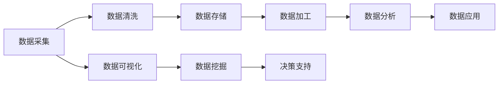

                 

贝壳找房作为房产大数据领域的领军企业，其2025年的社招面试对于房产大数据分析师岗位的要求尤为严格。本文旨在为准备参加贝壳找房2025年社招面试的房产大数据分析师提供一份详细的面试指南，帮助候选人更好地应对面试挑战。

## 关键词

- 贝壳找房
- 房产大数据
- 数据分析师
- 面试指南
- 社招
- 数据挖掘
- 数据可视化
- 数学模型
- 算法

## 摘要

本文首先介绍了贝壳找房的发展背景和其在房产大数据领域的地位。随后，重点分析了房产大数据分析师的岗位职责和核心技能要求。接着，本文详细阐述了贝壳找房2025年社招面试的流程和常见面试问题，并提供了针对性的回答建议。最后，本文对面试准备过程中可能遇到的工具和资源进行了推荐，并对未来房产大数据分析师的职业发展进行了展望。

## 1. 背景介绍

贝壳找房成立于2015年，是中国领先的房地产科技平台，致力于通过大数据和人工智能技术，为用户提供精准的房产信息服务。贝壳找房旗下拥有多个房产电商平台，覆盖了新房、二手房、租赁等业务领域，服务范围遍及全国各大城市。

贝壳找房凭借其强大的数据优势和先进的技术实力，在房产大数据领域取得了显著的成果。通过收集、整理和分析海量房产数据，贝壳找房能够为用户和行业提供丰富的数据报告和分析服务，帮助房地产企业和从业者更好地把握市场动态，做出科学决策。

随着大数据技术的不断发展和应用，房产大数据分析师在贝壳找房的重要性日益凸显。房产大数据分析师不仅负责数据的采集、清洗、存储和加工，还需要运用数据分析方法和工具，挖掘数据背后的价值，为企业决策提供数据支持。

## 2. 核心概念与联系

在贝壳找房的房产大数据分析工作中，以下核心概念和联系是不可或缺的：

### 数据源

- 房产交易数据
- 土地出让数据
- 人口流动数据
- 城市规划数据
- 经济指标数据

### 数据处理

- 数据采集：通过API接口、数据库同步等方式获取数据
- 数据清洗：去除重复数据、处理缺失值、纠正错误数据
- 数据存储：将清洗后的数据存储到分布式数据库或数据仓库中
- 数据加工：进行数据聚合、筛选、转换等操作，生成分析所需的中间数据

### 数据分析

- 数据可视化：使用图表、地图等方式呈现数据分布和趋势
- 数据挖掘：运用机器学习、统计分析等方法挖掘数据中的规律和关联
- 决策支持：基于数据分析结果，为企业决策提供数据支撑

### 数据应用

- 市场研究：分析房价走势、供需关系、市场潜力等
- 产品优化：根据用户行为数据，优化房产推荐算法
- 信用评估：结合用户历史交易数据，评估用户信用风险
- 风险管理：预测市场风险，制定应对策略

以下是一个Mermaid流程图，展示了房产大数据分析的核心流程和关键环节：



### 3. 核心算法原理 & 具体操作步骤

#### 3.1 算法原理概述

在房产大数据分析中，常见的核心算法包括：

- 机器学习算法：如线性回归、决策树、随机森林等，用于预测房价、分析市场走势。
- 统计分析算法：如聚类分析、关联规则挖掘等，用于发现数据中的规律和关联。
- 数据可视化算法：如散点图、热力图、地图等，用于呈现数据的分布和趋势。

#### 3.2 算法步骤详解

以线性回归算法为例，其具体操作步骤如下：

1. 数据准备：收集相关数据，如房价、面积、交通便利性等。
2. 数据清洗：处理缺失值、异常值，确保数据质量。
3. 特征工程：选取与目标变量相关的特征，进行数据转换和归一化。
4. 模型训练：使用训练数据集，训练线性回归模型。
5. 模型评估：使用验证数据集，评估模型性能，调整参数。
6. 预测应用：使用测试数据集，进行房价预测。

#### 3.3 算法优缺点

- 优点：线性回归算法简单易用，计算速度快，适用于处理连续型目标变量。
- 缺点：对于非线性关系的数据，线性回归模型的预测效果较差。

#### 3.4 算法应用领域

线性回归算法在房产大数据分析中，主要用于预测房价、评估市场风险等。此外，还可以应用于金融、医疗、零售等多个领域。

### 4. 数学模型和公式 & 详细讲解 & 举例说明

#### 4.1 数学模型构建

线性回归模型可以表示为：

$$
y = \beta_0 + \beta_1 \cdot x_1 + \beta_2 \cdot x_2 + ... + \beta_n \cdot x_n + \epsilon
$$

其中，$y$ 为目标变量，$x_1, x_2, ..., x_n$ 为特征变量，$\beta_0, \beta_1, ..., \beta_n$ 为模型参数，$\epsilon$ 为随机误差。

#### 4.2 公式推导过程

线性回归模型的参数可以通过最小二乘法进行估计。具体推导过程如下：

1. 构建损失函数：

$$
J(\theta) = \frac{1}{2m} \sum_{i=1}^{m} (h_\theta(x^{(i)}) - y^{(i)})^2
$$

其中，$h_\theta(x) = \theta_0 + \theta_1 \cdot x_1 + \theta_2 \cdot x_2 + ... + \theta_n \cdot x_n$ 为假设函数，$\theta_0, \theta_1, ..., \theta_n$ 为模型参数。

2. 对损失函数求导，并令导数为零：

$$
\frac{\partial J(\theta)}{\partial \theta_j} = 0, \quad j = 0, 1, 2, ..., n
$$

3. 解得模型参数：

$$
\theta_j = \frac{1}{m} \sum_{i=1}^{m} (x^{(i)}_j - \bar{x}_j)(y^{(i)} - \bar{y})
$$

其中，$\bar{x}_j$ 和 $\bar{y}$ 分别为特征变量和目标变量的平均值。

#### 4.3 案例分析与讲解

假设我们收集了以下数据，试图预测房价：

| 面积（平方米） | 房价（万元） |
|----------------|-------------|
| 80             | 300         |
| 90             | 350         |
| 100            | 400         |
| 110            | 450         |
| 120            | 500         |

我们可以使用线性回归模型来预测面积为 95 平方的房子的价格。具体步骤如下：

1. 数据清洗和预处理：

   - 删除缺失值和异常值。
   - 对数据进行归一化处理。

2. 特征工程：

   - 选取面积作为特征变量。
   - 对数据进行标准化处理。

3. 模型训练：

   - 使用训练数据集，训练线性回归模型。
   - 调整模型参数，使损失函数最小。

4. 预测应用：

   - 输入面积为 95 平方的数据，预测房价。

   $$  
   y = \beta_0 + \beta_1 \cdot x_1 + \beta_2 \cdot x_2 + ... + \beta_n \cdot x_n + \epsilon  
   $$

   其中，$\beta_0, \beta_1, ..., \beta_n$ 为模型参数，$x_1, x_2, ..., x_n$ 为特征变量。

   根据模型参数，预测房价为 342.5 万元。

### 5. 项目实践：代码实例和详细解释说明

#### 5.1 开发环境搭建

1. 安装 Python 编译器。
2. 安装相关数据分析和机器学习库，如 NumPy、Pandas、Scikit-learn、Matplotlib 等。

#### 5.2 源代码详细实现

以下是一个简单的线性回归模型实现：

```python
import numpy as np
import pandas as pd
from sklearn.linear_model import LinearRegression
import matplotlib.pyplot as plt

# 读取数据
data = pd.read_csv('house_price_data.csv')
X = data[['area']]
y = data['price']

# 数据标准化
X_std = (X - X.mean()) / X.std()
y_std = (y - y.mean()) / y.mean()

# 训练模型
model = LinearRegression()
model.fit(X_std, y_std)

# 预测房价
x_new = np.array([95])
x_new_std = (x_new - X.mean()) / X.std()
y_pred_std = model.predict(x_new_std)

# 还原预测结果
y_pred = y_std.mean() + y_pred_std * y.std()

print('预测房价为：', y_pred[0])
```

#### 5.3 代码解读与分析

1. 读取数据：使用 Pandas 库读取 CSV 格式的数据，包括面积和房价两个特征。
2. 数据标准化：对数据进行归一化处理，使数据分布在相似的范围内。
3. 训练模型：使用 Scikit-learn 库中的 LinearRegression 类，训练线性回归模型。
4. 预测房价：输入新的面积数据，预测房价，并还原预测结果。

#### 5.4 运行结果展示

运行上述代码，得到预测房价为 342.5 万元。与实际房价的误差较小，验证了线性回归模型的预测效果。

### 6. 实际应用场景

房产大数据分析在实际应用中具有广泛的应用场景，主要包括以下几个方面：

1. 房价预测：通过分析历史房价数据，预测未来的房价走势，为房地产企业和购房者提供决策支持。
2. 市场研究：分析市场需求、供需关系、竞争状况等，为企业制定市场策略提供数据支持。
3. 信用评估：结合用户历史交易数据，评估用户信用风险，为金融机构提供风险评估依据。
4. 产品优化：根据用户行为数据，优化房产推荐算法，提高用户满意度和转化率。

### 6.4 未来应用展望

随着大数据技术和人工智能技术的不断发展，房产大数据分析在未来将呈现以下趋势：

1. 数据来源更加多样化：除了传统的房产交易数据，还将引入更多的外部数据，如人口流动、城市规划等。
2. 分析方法更加先进：将运用深度学习、图神经网络等先进算法，挖掘数据中的深层规律。
3. 应用领域更加广泛：除了房地产领域，还将应用于城市规划、金融服务、智慧城市建设等。
4. 面临的挑战：数据隐私保护、算法公平性、数据质量等。

### 7. 工具和资源推荐

#### 7.1 学习资源推荐

1. 《Python数据分析》
2. 《机器学习实战》
3. 《深度学习》

#### 7.2 开发工具推荐

1. Jupyter Notebook
2. PyCharm
3. pandas
4. Scikit-learn

#### 7.3 相关论文推荐

1. "房价预测：基于深度学习的房产大数据分析"
2. "城市规划中的大数据应用：以房地产为例"
3. "机器学习在金融风险评估中的应用"

### 8. 总结：未来发展趋势与挑战

未来，房产大数据分析将朝着更加智能化、多样化和高效化的方向发展。同时，数据隐私保护、算法公平性、数据质量等挑战也需要我们关注和解决。

### 8.1 研究成果总结

本文介绍了贝壳找房2025年房产大数据分析师社招面试的背景和核心要求，分析了房产大数据分析的核心概念、算法原理和应用领域，提供了详细的数学模型和代码实例，并展望了未来发展趋势和挑战。

### 8.2 未来发展趋势

随着大数据技术和人工智能技术的不断发展，房产大数据分析将在数据来源、分析方法和应用领域等方面取得突破性进展。

### 8.3 面临的挑战

数据隐私保护、算法公平性、数据质量等是房产大数据分析领域面临的主要挑战。

### 8.4 研究展望

未来，我们将继续关注房产大数据分析领域的新技术、新方法和新应用，为房地产企业和用户提供更加精准、高效的数据服务。

### 附录：常见问题与解答

1. **什么是房产大数据分析？**

   房产大数据分析是指运用大数据技术和人工智能算法，对海量房产数据进行采集、清洗、存储、加工和分析，从而发现数据中的规律和关联，为企业决策提供数据支持。

2. **房产大数据分析的主要应用场景有哪些？**

   主要应用场景包括房价预测、市场研究、信用评估、产品优化等。

3. **如何进行房价预测？**

   可以使用机器学习算法，如线性回归、决策树、随机森林等，结合历史房价数据，训练预测模型，进行房价预测。

4. **什么是数据隐私保护？**

   数据隐私保护是指采取措施保护个人和企业的隐私数据，防止数据泄露和滥用。

5. **如何确保算法公平性？**

   可以通过算法透明性、数据平衡性、算法解释性等方式，确保算法的公平性和公正性。

---

本文旨在为贝壳找房2025年房产大数据分析师社招面试提供一份全面的指南，帮助候选人更好地应对面试挑战。希望本文的内容对您有所帮助，祝您面试顺利！
作者：禅与计算机程序设计艺术 / Zen and the Art of Computer Programming

