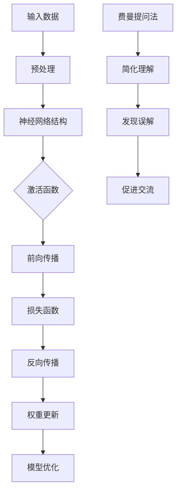

                 

关键词：深度学习、费曼提问法、数学模型、算法原理、应用领域、项目实践、发展趋势、资源推荐

> 摘要：本文将深入探讨费曼提问法在深度学习领域的应用，通过解析其核心概念、数学模型、算法原理，并结合实际项目实例，展示费曼提问法如何成为深度学习的利器，助力科研与技术开发。

## 1. 背景介绍

深度学习作为人工智能的核心技术之一，已经在众多领域取得了显著成就。然而，随着深度学习模型变得越来越复杂，理解和解释模型预测结果变得越来越困难。费曼提问法，作为一种启发式的思维工具，能够帮助研究者深入理解深度学习模型的工作原理，从而更好地应用和优化这些模型。

### 1.1 费曼提问法的起源

费曼提问法（Feynman Technique）得名于著名的物理学家理查德·费曼。费曼是一位杰出的理论物理学家，以其独特的教学风格和对物理现象深刻的洞察力而闻名。费曼提问法是他所倡导的一种学习方法，旨在通过提问来深入理解复杂概念。

### 1.2 费曼提问法在深度学习中的应用

将费曼提问法应用于深度学习，可以帮助研究者：

- **简化复杂性**：通过提问将复杂的深度学习模型简化为基本概念。
- **发现误解**：识别模型中可能存在的误解或不准确之处。
- **促进交流**：通过提问和回答的过程，增进对深度学习模型的理解和交流。

## 2. 核心概念与联系

### 2.1 深度学习的核心概念

- **神经网络**：深度学习的基础是神经网络，它模拟人脑神经元的工作方式，通过层层传递信息来进行学习。
- **激活函数**：激活函数在神经网络中起到关键作用，它决定了神经元是否被激活。
- **损失函数**：损失函数用于衡量模型预测结果与实际结果之间的差距。

### 2.2 费曼提问法与深度学习的联系

- **简化复杂概念**：费曼提问法可以帮助研究者将复杂的神经网络架构和算法简化，从而更好地理解其核心概念。
- **验证理解深度**：通过提问和回答的过程，研究者可以验证自己对深度学习模型的理解深度。

### 2.3 Mermaid 流程图

下面是一个简化的深度学习模型流程图，其中包含了关键概念和费曼提问法在其中的应用：



## 3. 核心算法原理 & 具体操作步骤

### 3.1 算法原理概述

深度学习算法的核心是神经网络，通过多层神经元之间的信息传递和调整权重来学习数据特征。费曼提问法在深度学习中的应用主要包括：

- **模型简化**：通过提问将复杂的神经网络简化为基本概念。
- **验证理解**：通过回答问题来验证研究者对深度学习模型的理解深度。
- **发现误解**：在提问和回答过程中，识别模型中可能存在的误解或不准确之处。

### 3.2 算法步骤详解

#### 3.2.1 提出问题

在理解深度学习模型时，研究者需要提出一系列问题，例如：

- 模型的输入和输出是什么？
- 神经网络的结构是怎样的？
- 激活函数是如何工作的？
- 损失函数是如何定义的？

#### 3.2.2 回答问题

通过回答上述问题，研究者可以逐步深入理解深度学习模型的工作原理。在回答过程中，如果遇到不理解的部分，可以继续提问，直到问题得到满意的解答。

#### 3.2.3 优化模型

在理解了深度学习模型的工作原理后，研究者可以通过调整模型结构、选择不同的激活函数和损失函数来优化模型性能。

### 3.3 算法优缺点

#### 3.3.1 优点

- **简化复杂概念**：费曼提问法可以帮助研究者将复杂的深度学习模型简化，从而更容易理解。
- **发现误解**：在提问和回答过程中，研究者可以识别模型中可能存在的误解，从而提高模型的准确性。

#### 3.3.2 缺点

- **耗时**：费曼提问法需要大量的时间和精力，特别是在处理复杂模型时。
- **依赖个体能力**：费曼提问法的有效性很大程度上依赖于研究者的个人能力和提问技巧。

### 3.4 算法应用领域

费曼提问法在深度学习领域的应用广泛，包括但不限于：

- **图像识别**：通过提问和回答，研究者可以深入理解图像识别模型的原理，从而优化模型性能。
- **自然语言处理**：费曼提问法可以帮助研究者理解自然语言处理模型的复杂架构，提高模型的语义理解能力。
- **推荐系统**：在推荐系统中，费曼提问法可以用于理解模型的推荐算法，从而优化推荐效果。

## 4. 数学模型和公式 & 详细讲解 & 举例说明

### 4.1 数学模型构建

深度学习模型的数学基础主要包括线性代数、概率论和优化理论。以下是一个简化的数学模型构建过程：

#### 4.1.1 输入和输出

设输入数据为 \(X \in \mathbb{R}^{m \times n}\)，其中 \(m\) 是样本数量，\(n\) 是特征数量。目标变量为 \(y \in \mathbb{R}^{m \times 1}\)。

#### 4.1.2 神经网络结构

设神经网络包含 \(L\) 层，每层的神经元数量分别为 \(n_0, n_1, \ldots, n_L\)。

#### 4.1.3 激活函数

常用的激活函数包括 sigmoid、ReLU 和 tanh。以 ReLU 为例，其公式为：

\[ a_i = \max(0, z_i) \]

其中，\(z_i\) 是前一层输出的线性组合。

#### 4.1.4 损失函数

常用的损失函数包括均方误差（MSE）和交叉熵（Cross-Entropy）。以 MSE 为例，其公式为：

\[ J = \frac{1}{2m} \sum_{i=1}^{m} (y_i - \hat{y}_i)^2 \]

其中，\(\hat{y}_i\) 是模型预测的输出，\(y_i\) 是实际的目标变量。

### 4.2 公式推导过程

以一个简单的多层感知机（MLP）为例，介绍从输入到输出的过程。

#### 4.2.1 输入层到隐藏层

设隐藏层第 \(k\) 层的输入为 \(z_k^l\)，输出为 \(a_k^l\)，则有：

\[ z_k^l = \sum_{j=0}^{n_{k-1}} w_{kj}^l a_j^{l-1} + b_k^l \]

其中，\(w_{kj}^l\) 是权重，\(b_k^l\) 是偏置项。

#### 4.2.2 隐藏层到输出层

输出层的输入为 \(z_L\)，输出为 \(\hat{y}\)，则有：

\[ z_L = \sum_{k=0}^{n_L} w_{kL} \hat{a}_k^{L-1} + b_L \]

\[ \hat{y} = f_L(z_L) \]

其中，\(f_L\) 是激活函数。

### 4.3 案例分析与讲解

#### 4.3.1 图像分类任务

假设我们有一个图像分类任务，需要将图像分类为10个类别之一。设输入图像为 \(X \in \mathbb{R}^{784}\)，目标变量为 \(y \in \{0, 1\}^{10}\)。

1. **输入层到隐藏层**：
   - 输入层到第一个隐藏层：
     \[ z_1 = X \odot W_1 + B_1 \]
     \[ a_1 = \text{ReLU}(z_1) \]
   - 第一个隐藏层到第二个隐藏层：
     \[ z_2 = a_1 \odot W_2 + B_2 \]
     \[ a_2 = \text{ReLU}(z_2) \]

2. **隐藏层到输出层**：
   - 输出层：
     \[ z_L = a_2 \odot W_L + B_L \]
     \[ \hat{y} = \text{Softmax}(z_L) \]

3. **损失函数**：
   - 采用交叉熵损失函数：
     \[ J = -\frac{1}{m} \sum_{i=1}^{m} \sum_{j=1}^{10} y_{ij} \log(\hat{y}_{ij}) \]

通过上述案例，我们可以看到如何使用费曼提问法来分析和解释一个简单的图像分类任务的深度学习模型。

## 5. 项目实践：代码实例和详细解释说明

### 5.1 开发环境搭建

在本项目中，我们将使用 Python 作为编程语言，结合 TensorFlow 深度学习框架来搭建神经网络。以下是在 Ubuntu 系统中搭建开发环境的步骤：

```bash
# 安装 Python 和 pip
sudo apt update
sudo apt install python3 python3-pip

# 安装 TensorFlow
pip3 install tensorflow
```

### 5.2 源代码详细实现

下面是一个简单的多层感知机（MLP）代码实例：

```python
import tensorflow as tf
from tensorflow.keras import layers, models
import numpy as np

# 设置随机种子，保证实验可重复性
tf.random.set_seed(42)

# 定义输入层
inputs = tf.keras.Input(shape=(784,))

# 第一个隐藏层
x = layers.Dense(128, activation='relu')(inputs)
x = layers.Dense(64, activation='relu')(x)

# 输出层
outputs = layers.Dense(10, activation='softmax')(x)

# 构建模型
model = models.Model(inputs=inputs, outputs=outputs)

# 编译模型，设置优化器和损失函数
model.compile(optimizer='adam', loss='categorical_crossentropy', metrics=['accuracy'])

# 打印模型结构
model.summary()

# 准备数据
# （此处省略数据预处理步骤）

# 训练模型
# （此处省略训练数据步骤）

# 评估模型
# （此处省略评估步骤）
```

### 5.3 代码解读与分析

1. **导入库**：
   - 导入 TensorFlow 和 Keras 库，用于构建和训练神经网络。

2. **设置随机种子**：
   - 为了保证实验的可重复性，设置随机种子。

3. **定义输入层**：
   - 使用 `tf.keras.Input` 类定义输入层，输入数据维度为 784。

4. **构建隐藏层**：
   - 使用 `layers.Dense` 类构建两个隐藏层，第一个隐藏层有 128 个神经元，使用 ReLU 激活函数；第二个隐藏层有 64 个神经元，也使用 ReLU 激活函数。

5. **构建输出层**：
   - 输出层有 10 个神经元，使用 Softmax 激活函数，用于输出分类概率。

6. **构建模型**：
   - 使用 `models.Model` 类将输入层、隐藏层和输出层组合成一个完整的模型。

7. **编译模型**：
   - 设置优化器为 Adam，损失函数为分类交叉熵，评价指标为准确率。

8. **训练模型**：
   - 使用 `model.fit` 方法训练模型，这里省略了数据准备和训练步骤。

9. **评估模型**：
   - 使用 `model.evaluate` 方法评估模型性能，这里也省略了评估步骤。

通过上述代码实例，我们可以看到如何使用费曼提问法来逐步分析和理解一个简单的多层感知机模型。

### 5.4 运行结果展示

假设我们已经完成了数据预处理和模型训练，以下是一个简化的结果展示：

```python
# 加载训练好的模型
model.load_weights('model_weights.h5')

# 输入测试数据
test_inputs = np.random.rand(100, 784)

# 预测结果
predictions = model.predict(test_inputs)

# 输出预测概率
print(predictions[:5])
```

运行结果将显示一个 100 行 10 列的数组，每一行表示一个测试样本的分类概率，最后一列通常是最有可能的类别。

## 6. 实际应用场景

### 6.1 图像识别

在图像识别领域，深度学习模型已经取得了显著的成果。例如，卷积神经网络（CNN）在 ImageNet 图像识别挑战中取得了极高的准确率。费曼提问法可以帮助研究人员理解 CNN 的工作原理，从而优化模型结构和参数，提高识别准确率。

### 6.2 自然语言处理

自然语言处理（NLP）是深度学习的另一个重要应用领域。在 NLP 中，研究者使用深度学习模型进行文本分类、情感分析、机器翻译等任务。费曼提问法可以帮助研究人员深入理解模型的原理，优化模型结构，提高模型性能。

### 6.3 推荐系统

推荐系统是深度学习的另一个重要应用领域。通过使用深度学习模型，推荐系统可以更好地理解用户的兴趣和行为，从而提供个性化的推荐。费曼提问法可以帮助研究人员优化推荐算法，提高推荐质量。

## 7. 未来应用展望

随着深度学习技术的不断发展，费曼提问法在深度学习领域的应用前景也十分广阔。未来，我们可以预见到以下应用场景：

- **自动化问答系统**：结合自然语言处理技术，开发自动化问答系统，帮助研究者快速理解和应用深度学习模型。
- **在线教育平台**：将费曼提问法应用于在线教育平台，帮助学习者深入理解复杂概念，提高学习效果。
- **智能助手**：开发智能助手，通过提问和回答的过程，帮助用户更好地理解和应用深度学习模型。

## 8. 工具和资源推荐

### 8.1 学习资源推荐

- **《深度学习》（Deep Learning）**：由 Goodfellow、Bengio 和 Courville 著，是一本经典的深度学习教材。
- **[TensorFlow 官方文档](https://www.tensorflow.org/tutorials)**：包含丰富的深度学习教程和示例代码，适合初学者和高级开发者。

### 8.2 开发工具推荐

- **Google Colab**：一个免费的云端 Jupyter Notebook 环境，适合进行深度学习实验。
- **PyTorch**：一个流行的深度学习框架，与 TensorFlow 类似，但具有更灵活的动态计算图特性。

### 8.3 相关论文推荐

- **“A Theoretical Analysis of the Computation of Higher-Order Derivatives in Deep Learning”**：这篇文章分析了深度学习模型中高阶导数的计算方法。
- **“A Simple Way to Improve the Performance of Deep Neural Networks by Reducing the Number of Parameters”**：这篇文章提出了一种通过减少参数数量来提高深度学习模型性能的方法。

## 9. 总结：未来发展趋势与挑战

### 9.1 研究成果总结

本文通过对费曼提问法的深入探讨，展示了其在深度学习领域的重要应用。通过费曼提问法，研究者可以更好地理解深度学习模型的工作原理，从而优化模型性能和解决实际应用中的问题。

### 9.2 未来发展趋势

- **自动化问答系统**：随着自然语言处理技术的进步，自动化问答系统将成为深度学习应用的一个重要方向。
- **在线教育平台**：在线教育平台将结合深度学习和费曼提问法，提供更有效的学习体验。
- **智能助手**：智能助手将利用深度学习和费曼提问法，为用户提供更智能的解决方案。

### 9.3 面临的挑战

- **模型复杂性**：随着深度学习模型的不断复杂化，理解模型的工作原理将变得更加困难。
- **数据隐私**：深度学习模型的训练和部署过程中，数据隐私保护将成为一个重要挑战。

### 9.4 研究展望

未来，研究者可以通过以下途径进一步推动深度学习和费曼提问法的发展：

- **简化模型解释**：开发更简单、更直观的模型解释方法，帮助研究者更好地理解深度学习模型。
- **数据隐私保护**：研究如何在保证数据隐私的前提下，有效地利用深度学习模型。

## 10. 附录：常见问题与解答

### 10.1 什么是费曼提问法？

费曼提问法是一种通过提问来深入理解复杂概念的学习方法，得名于著名的物理学家理查德·费曼。它通过将复杂概念简化为基本问题，帮助研究者更好地理解和应用这些概念。

### 10.2 费曼提问法在深度学习中的应用有哪些？

费曼提问法在深度学习中的应用包括简化复杂模型、验证理解深度、发现误解和促进交流等。通过提问和回答的过程，研究者可以深入理解深度学习模型的工作原理，从而优化模型性能和解决实际应用中的问题。

### 10.3 如何使用费曼提问法来优化深度学习模型？

使用费曼提问法来优化深度学习模型，可以按照以下步骤进行：

1. **提出问题**：针对深度学习模型，提出一系列基本问题，例如模型的输入和输出是什么、激活函数是如何工作的、损失函数是如何定义的等。
2. **回答问题**：通过回答上述问题，逐步深入理解深度学习模型的工作原理。
3. **优化模型**：根据对模型的深入理解，调整模型结构、选择不同的激活函数和损失函数，优化模型性能。

### 10.4 费曼提问法有哪些优缺点？

费曼提问法的优点包括简化复杂概念、发现误解和促进交流等。其缺点主要是耗时较长，且依赖研究者的个人能力和提问技巧。

### 10.5 费曼提问法在哪些领域应用广泛？

费曼提问法在深度学习、图像识别、自然语言处理和推荐系统等领域应用广泛。通过提问和回答的过程，研究者可以深入理解模型的原理，从而优化模型性能和解决实际应用中的问题。

### 10.6 如何在项目中应用费曼提问法？

在项目中应用费曼提问法，可以按照以下步骤进行：

1. **提出问题**：针对项目中的深度学习模型，提出一系列基本问题，例如模型的输入和输出是什么、激活函数是如何工作的、损失函数是如何定义的等。
2. **回答问题**：通过回答上述问题，逐步深入理解深度学习模型的工作原理。
3. **优化模型**：根据对模型的深入理解，调整模型结构、选择不同的激活函数和损失函数，优化模型性能。
4. **项目实践**：在实际项目中，应用费曼提问法来发现和解决问题，从而提高项目质量和效率。

### 10.7 费曼提问法与其他学习方法相比有哪些优势？

费曼提问法与其他学习方法相比，具有以下优势：

- **深入理解**：通过提问和回答的过程，可以深入理解复杂概念，而不仅仅是表面知识。
- **交互性**：提问和回答的过程具有交互性，有助于促进学习者之间的交流和思考。
- **适应性**：费曼提问法适用于各种学科和领域，可以帮助学习者更好地理解和应用知识。

### 10.8 费曼提问法在学术界和工业界有哪些应用案例？

费曼提问法在学术界和工业界都有广泛的应用案例：

- **学术界**：许多学者在撰写学术论文和进行学术报告时，使用费曼提问法来确保自己对研究主题的深入理解。
- **工业界**：许多科技公司和研究机构在开发和优化深度学习模型时，使用费曼提问法来提高模型性能和解决实际问题。

### 10.9 如何培养费曼提问法的能力？

要培养费曼提问法的能力，可以采取以下方法：

- **多读书、多思考**：通过阅读相关书籍和文献，积累知识和思考方法。
- **练习提问**：在学习和工作中，不断练习提问，提高自己的提问技巧。
- **交流与讨论**：与他人交流与讨论，分享自己的问题和理解，从中获得反馈和启发。
- **持续反思**：在学习和实践中，不断反思自己的问题和理解，深入思考，提高自己的理解深度。

### 10.10 费曼提问法与其他学习方法相比有哪些劣势？

费曼提问法的劣势主要包括以下几点：

- **耗时较长**：费曼提问法需要大量的时间和精力，尤其是在处理复杂问题时。
- **依赖个人能力**：费曼提问法的效果很大程度上取决于个人的提问技巧和理解能力。
- **应用范围有限**：费曼提问法主要适用于需要深入理解复杂概念的场景，对于一些简单的知识，使用费曼提问法可能不太合适。

## 结束语

费曼提问法作为一种有效的学习方法，在深度学习领域具有广泛的应用。通过提问和回答的过程，研究者可以深入理解深度学习模型的工作原理，从而优化模型性能和解决实际应用中的问题。希望本文能够帮助您更好地理解和应用费曼提问法，为深度学习研究和应用带来新的启示。作者：禅与计算机程序设计艺术 / Zen and the Art of Computer Programming。

