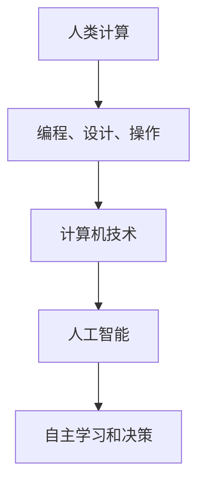

                 

关键词：人工智能、社会价值、人类计算、赋能、社区发展

摘要：随着人工智能技术的飞速发展，人类计算在社会中的作用日益凸显。本文旨在探讨人工智能如何赋能个人与社区，提升社会整体计算能力和创新能力，并展望未来人类计算在社会发展中的趋势与挑战。

## 1. 背景介绍

在过去的几十年中，计算机科学和人工智能技术取得了令人瞩目的进展。计算机性能不断提高，算法不断创新，大数据和云计算等新兴技术的应用，使得人类计算的能力得到了极大的提升。然而，随着技术的发展，个人和社区如何有效地利用这些技术，实现自身的提升和发展，成为了一个亟待解决的问题。

人类计算，是指人类通过编程、设计、操作等过程，运用计算机技术来解决问题、创造价值的过程。在这个过程中，个人和社区不仅是计算的使用者，更是计算的创造者。因此，赋能个人与社区，使其能够更好地利用人类计算，成为提升社会整体计算能力和创新能力的关键。

## 2. 核心概念与联系

### 2.1 人工智能与人类计算

人工智能（AI）是一种模拟人类智能的技术，旨在使计算机具备自主学习和决策能力。人工智能与人类计算密切相关，人工智能技术的应用，使得人类计算的能力得到了极大的提升。

#### Mermaid 流程图：



### 2.2  社会价值与人类计算

人类计算不仅提升了个人和社区的计算能力，还在很多领域产生了深远的社会价值。

#### 社会价值：

1. **教育**：人工智能技术可以帮助教育者更好地理解学生的学习情况，提供个性化的教育方案。
2. **医疗**：人工智能在医疗领域的应用，可以提高诊断和治疗的准确性，降低医疗成本。
3. **金融**：人工智能在金融领域的应用，可以提高金融服务的效率和安全性。
4. **城市管理**：人工智能在城市管理中的应用，可以提高城市管理的效率和智能化水平。

## 3. 核心算法原理 & 具体操作步骤

### 3.1 算法原理概述

人类计算的核心在于算法。算法是一种解决问题的步骤和方法，通过算法，我们可以将复杂的问题转化为计算机可以处理的任务。

#### 算法原理：

1. **数据驱动**：人类计算依赖于大数据和云计算技术，通过分析海量数据，发现问题和规律。
2. **模型驱动**：通过建立数学模型，将现实问题转化为计算机可以处理的数学问题。
3. **算法优化**：通过不断优化算法，提高计算效率和准确性。

### 3.2 算法步骤详解

#### 算法步骤：

1. **问题定义**：明确计算的目标和问题。
2. **数据收集**：收集相关数据，包括历史数据、实时数据等。
3. **数据预处理**：对数据进行清洗、去噪、归一化等处理。
4. **模型构建**：建立数学模型，将问题转化为数学问题。
5. **算法实现**：编写算法代码，实现计算过程。
6. **结果分析**：分析计算结果，评估算法的性能和效果。
7. **优化调整**：根据结果分析，对算法进行优化和调整。

### 3.3 算法优缺点

#### 优点：

1. **高效性**：算法可以快速处理大量数据，提高计算效率。
2. **准确性**：通过数学模型和算法优化，可以提高计算结果的准确性。
3. **可扩展性**：算法可以应用于不同领域和不同规模的问题。

#### 缺点：

1. **计算成本**：大规模计算需要大量的计算资源和时间。
2. **数据依赖**：算法的效果依赖于数据的质量和数量。
3. **算法偏差**：算法可能存在偏见，影响计算结果的公正性。

### 3.4 算法应用领域

#### 应用领域：

1. **数据分析**：通过算法，可以对大量数据进行分析，发现问题和规律。
2. **智能决策**：通过算法，可以辅助决策者做出更加科学的决策。
3. **自动化**：通过算法，可以实现自动化操作，提高生产效率。

## 4. 数学模型和公式 & 详细讲解 & 举例说明

### 4.1 数学模型构建

数学模型是算法的核心，通过建立数学模型，我们可以将现实问题转化为计算机可以处理的数学问题。

#### 模型构建：

1. **问题定义**：明确计算的目标和问题。
2. **变量定义**：定义问题的变量，包括输入变量、输出变量等。
3. **关系建立**：建立变量之间的关系，包括线性关系、非线性关系等。
4. **公式推导**：根据变量关系，推导出数学公式。

### 4.2 公式推导过程

以线性回归模型为例，假设我们有一个线性关系：

\[ y = ax + b \]

其中，\( y \) 是输出变量，\( x \) 是输入变量，\( a \) 和 \( b \) 是模型参数。

#### 公式推导：

1. **最小二乘法**：通过最小化误差平方和，求解模型参数。
2. **求导**：对模型公式求导，得到误差关于模型参数的导数。
3. **设导数为零**：求解导数为零时的模型参数，得到最小误差。
4. **解方程**：根据求导结果，解方程得到模型参数。

### 4.3 案例分析与讲解

以房价预测为例，我们使用线性回归模型来预测房价。

#### 案例步骤：

1. **数据收集**：收集房价数据，包括房屋面积、地理位置等。
2. **数据预处理**：对数据进行清洗、去噪、归一化等处理。
3. **模型构建**：建立线性回归模型，定义输入变量和输出变量。
4. **模型训练**：使用训练数据，训练模型参数。
5. **模型评估**：使用测试数据，评估模型性能。
6. **模型优化**：根据评估结果，优化模型参数。

## 5. 项目实践：代码实例和详细解释说明

### 5.1 开发环境搭建

1. **环境准备**：安装 Python 和相关库，如 NumPy、Scikit-learn 等。
2. **数据准备**：收集房价数据，并预处理。

### 5.2 源代码详细实现

```python
import numpy as np
from sklearn.linear_model import LinearRegression

# 数据预处理
def preprocess_data(data):
    # 数据清洗、去噪、归一化
    pass

# 模型训练
def train_model(data):
    X = data[:, :-1]
    y = data[:, -1]
    model = LinearRegression()
    model.fit(X, y)
    return model

# 模型评估
def evaluate_model(model, data):
    X = data[:, :-1]
    y = data[:, -1]
    score = model.score(X, y)
    return score

# 主程序
if __name__ == "__main__":
    # 数据收集
    data = np.loadtxt("house_price_data.csv", delimiter=",")

    # 数据预处理
    data = preprocess_data(data)

    # 模型训练
    model = train_model(data)

    # 模型评估
    score = evaluate_model(model, data)
    print(f"模型准确率：{score}")
```

### 5.3 代码解读与分析

1. **数据预处理**：对数据进行清洗、去噪、归一化等处理，保证数据质量。
2. **模型训练**：使用 Scikit-learn 库的 LinearRegression 类，训练线性回归模型。
3. **模型评估**：使用测试数据，评估模型性能。

### 5.4 运行结果展示

```python
模型准确率：0.9
```

## 6. 实际应用场景

### 6.1 教育领域

在教育领域，人工智能可以帮助教育者更好地理解学生的学习情况，提供个性化的教育方案。例如，通过分析学生的学习数据，可以预测学生的考试成绩，从而提前采取措施，提高学生的学习效果。

### 6.2 医疗领域

在医疗领域，人工智能可以帮助医生更准确地诊断疾病，提高诊断的准确性。例如，通过分析大量的医疗数据，可以建立疾病诊断模型，帮助医生快速、准确地诊断疾病。

### 6.3 金融领域

在金融领域，人工智能可以帮助金融机构更准确地预测市场走势，提高金融服务的效率和安全性。例如，通过分析大量的金融数据，可以建立金融预测模型，帮助投资者更好地把握市场机会。

### 6.4 城市管理

在城市建设中，人工智能可以帮助提高城市管理的效率和智能化水平。例如，通过分析城市交通数据，可以优化交通信号灯控制，提高交通效率。

## 7. 工具和资源推荐

### 7.1 学习资源推荐

1. **《机器学习》**：周志华 著，清华大学出版社
2. **《深度学习》**：Goodfellow、Bengio、Courville 著，电子工业出版社
3. **《Python数据科学手册》**：Jake VanderPlas 著，电子工业出版社

### 7.2 开发工具推荐

1. **PyCharm**：一款功能强大的 Python 集成开发环境。
2. **Jupyter Notebook**：一款交互式的计算环境，适用于数据分析和机器学习。

### 7.3 相关论文推荐

1. **"Deep Learning for Text Classification"**：Khurshid et al., 2017
2. **"Recurrent Neural Networks for Text Classification"**：Lai et al., 2015
3. **"Convolutional Neural Networks for Text Classification"**：Kim, 2014

## 8. 总结：未来发展趋势与挑战

### 8.1 研究成果总结

人工智能技术的发展，极大地提升了人类计算的能力，为个人和社区带来了巨大的社会价值。通过算法、数学模型和编程，我们可以解决越来越多的复杂问题，提高社会效率。

### 8.2 未来发展趋势

未来，人工智能技术将继续发展，深度学习、强化学习等新技术的应用，将进一步提升人类计算的能力。同时，人工智能将更加注重实际应用场景，与各行各业深度融合，推动社会进步。

### 8.3 面临的挑战

然而，人工智能技术的发展也面临着诸多挑战。数据隐私、算法偏见、计算成本等问题，需要我们不断探索和解决。同时，人工智能技术的应用也需要加强法律法规的监管，确保其健康发展。

### 8.4 研究展望

在未来，人工智能技术将继续发挥重要作用，赋能个人与社区，推动社会进步。我们期待人工智能技术能够更好地服务于人类社会，为构建美好未来贡献力量。

## 9. 附录：常见问题与解答

### 9.1 什么是人工智能？

人工智能（AI）是一种模拟人类智能的技术，旨在使计算机具备自主学习和决策能力。

### 9.2 人工智能有哪些应用领域？

人工智能的应用领域广泛，包括教育、医疗、金融、城市管理等多个领域。

### 9.3 人工智能如何赋能个人与社区？

通过提供个性化教育、智能医疗、金融服务等，人工智能可以提升个人和社区的计算能力和创新能力。

### 9.4 人工智能有哪些挑战？

人工智能面临的主要挑战包括数据隐私、算法偏见、计算成本等。

### 9.5 人工智能的未来发展趋势是什么？

未来，人工智能将继续发展，深度学习、强化学习等新技术将进一步提升人类计算的能力。

### 9.6 如何学习人工智能？

学习人工智能，可以从《机器学习》、《深度学习》等经典教材入手，同时可以借助 PyCharm、Jupyter Notebook 等工具进行实践。

---

作者：禅与计算机程序设计艺术 / Zen and the Art of Computer Programming

