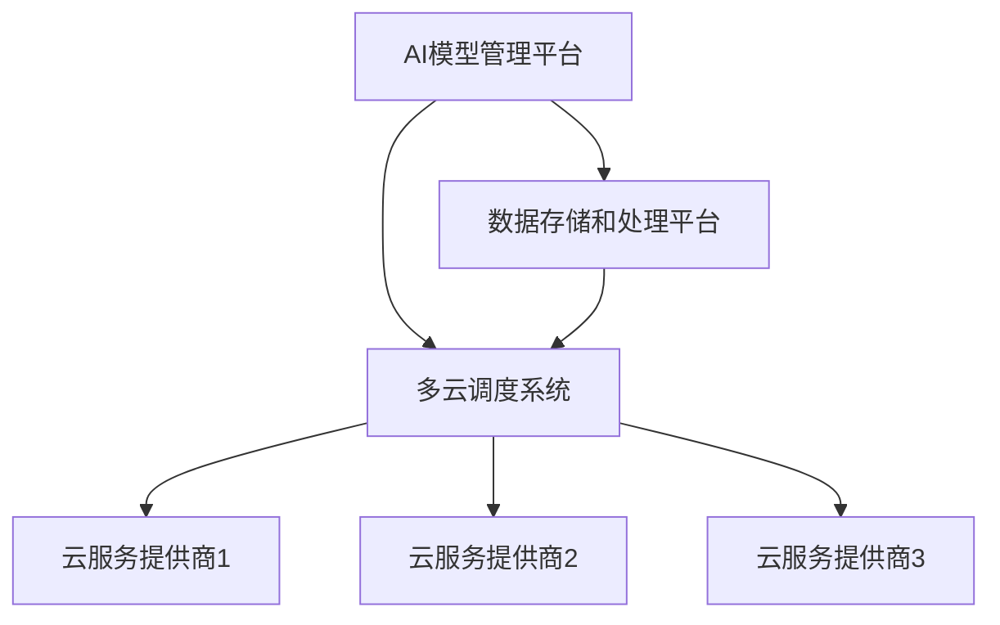

                 

## 1. 背景介绍

随着云计算技术的不断发展，AI应用的复杂性和规模也在不断增长。企业需要在多个云服务提供商之间进行AI模型的部署、管理和维护，以实现更高的性能、灵活性和成本效益。这种跨云部署的需求日益突出，推动了一系列相关技术和策略的诞生。

### AI与云计算的协同发展

人工智能（AI）技术的迅猛发展离不开大数据和计算能力的支撑，而云计算正是提供这些资源的重要平台。云计算通过虚拟化技术，将计算资源以服务的形式提供给用户，使得AI模型的训练和部署变得更加高效和灵活。同时，AI技术的进步也推动了云计算的发展，为云平台带来了更多的应用场景和商业模式。

### 跨云部署的挑战

跨云部署面临诸多挑战，包括数据迁移、服务兼容性、安全性和性能优化等。不同云服务提供商提供的API、架构和生态系统各有差异，使得在多个云环境中部署和维护AI模型变得复杂。此外，数据的安全性和隐私保护也是跨云部署过程中需要重点考虑的问题。

### Lepton AI的多云策略

Lepton AI是一家专注于AI解决方案的创新企业，其多云策略旨在充分利用不同云服务提供商的优势，实现AI模型的灵活部署和管理。本文将深入探讨Lepton AI的多云策略，包括其核心概念、算法原理、数学模型以及实际应用场景。

## 2. 核心概念与联系

### 跨云部署的概念

跨云部署是指在多个云服务提供商之间部署和管理应用程序、数据和服务的过程。它涉及到数据的迁移、应用程序的部署和运行、服务的监控和管理等方面。

### 跨云部署的优势

跨云部署的主要优势包括：

- **灵活性和可扩展性**：企业可以根据需求在不同云服务提供商之间切换，实现资源的最优配置。
- **高可用性和容错性**：通过在多个云环境中部署应用程序，可以降低单点故障的风险。
- **成本优化**：企业可以根据不同云服务提供商的定价策略，选择最适合自身的服务。

### 多云策略的概念

多云策略是指企业采用多个云服务提供商来满足其业务需求，并通过策略和技术手段实现多云环境中的资源优化和协同。

### 多云策略的优势

多云策略的优势包括：

- **资源灵活性**：企业可以根据不同的应用场景和需求，选择最适合的云服务提供商。
- **避免锁定**：企业不会因依赖某个云服务提供商而受制于其定价策略和服务限制。
- **负载均衡**：通过在不同云环境中部署应用程序，可以实现负载均衡，提高系统的性能和可靠性。

### Lepton AI的多云架构

Lepton AI的多云架构采用分布式部署的方式，将AI模型部署在多个云环境中，以实现高性能、高可用性和灵活性。其架构包括以下几个关键组件：

1. **AI模型管理平台**：负责管理AI模型的训练、部署和监控。
2. **数据存储和处理平台**：提供数据存储、处理和分析服务。
3. **多云调度系统**：负责在多个云环境中进行资源调度和负载均衡。

### Mermaid 流程图

以下是一个简化的Lepton AI多云架构的Mermaid流程图，展示了关键组件之间的交互关系：



## 3. 核心算法原理 & 具体操作步骤

### 3.1 算法原理概述

Lepton AI的多云部署策略基于分布式计算和负载均衡的原理。核心算法包括以下几个步骤：

1. **模型训练与优化**：在主云环境中进行AI模型的训练和优化。
2. **模型部署**：将训练好的模型部署到多个云环境中。
3. **负载均衡**：根据实际运行情况，动态调整模型在不同云环境中的负载。
4. **数据同步**：确保不同云环境中的数据一致性。

### 3.2 算法步骤详解

1. **模型训练与优化**

   - 数据预处理：清洗和格式化输入数据，确保数据质量。
   - 训练过程：使用分布式训练技术，在主云环境中训练AI模型。
   - 模型优化：根据训练结果，对模型进行调参和优化。

2. **模型部署**

   - 模型打包：将训练好的模型打包成可部署的格式。
   - 部署到多个云环境：通过API调用或容器化技术，将模型部署到多个云环境中。

3. **负载均衡**

   - 监控性能：实时监控各个云环境中的模型性能。
   - 调整负载：根据性能监控结果，动态调整模型在不同云环境中的负载。

4. **数据同步**

   - 数据同步策略：设计数据同步机制，确保不同云环境中的数据一致性。
   - 同步过程：定期同步数据，处理数据冲突和更新。

### 3.3 算法优缺点

**优点**：

- **高可用性**：通过在多个云环境中部署模型，提高了系统的容错性和可用性。
- **高性能**：负载均衡策略实现了资源的最大化利用，提高了系统的性能。
- **灵活性**：可以根据不同应用场景和需求，灵活选择云服务提供商。

**缺点**：

- **复杂度高**：跨云部署和管理涉及到多个云服务提供商，增加了系统的复杂度。
- **数据安全**：跨云部署需要处理数据传输和存储的安全性问题。

### 3.4 算法应用领域

Lepton AI的多云部署策略可以应用于多个领域，包括：

- **金融**：在金融领域，可以用于风险评估、欺诈检测和客户服务等方面。
- **医疗**：在医疗领域，可以用于医学影像分析、疾病预测和个性化治疗等方面。
- **零售**：在零售领域，可以用于需求预测、库存管理和客户行为分析等方面。

## 4. 数学模型和公式

### 4.1 数学模型构建

Lepton AI的多云部署策略涉及多个数学模型，包括负载均衡模型和数据同步模型。

**负载均衡模型**：

假设有N个云环境，每个云环境中的模型负载为\( L_i \)，总负载为\( L \)。负载均衡目标是最小化总负载：

$$
\min L = \sum_{i=1}^{N} L_i
$$

**数据同步模型**：

假设有两个云环境A和B，其中数据集D在A和B中的更新时间分别为\( T_A \)和\( T_B \)。数据同步目标是最小化数据不一致性：

$$
\min D = \sum_{d \in D} |d_A - d_B|
$$

### 4.2 公式推导过程

**负载均衡模型推导**：

1. 初始负载分配：根据各云环境的服务能力和需求，初始分配负载。
2. 负载调整：根据性能监控结果，动态调整负载，使得总负载最小。

**数据同步模型推导**：

1. 数据更新：在A和B中更新数据集D。
2. 数据比较：比较A和B中数据的一致性。
3. 数据同步：根据比较结果，调整数据一致性。

### 4.3 案例分析与讲解

**案例一**：金融风险评估

假设Lepton AI在三个云环境中部署风险评估模型，每个云环境中的模型负载分别为\( L_1 = 100 \)，\( L_2 = 150 \)，\( L_3 = 200 \)。总负载为\( L = 450 \)。根据负载均衡模型，最优负载分配为：

$$
L_1 = 80, L_2 = 120, L_3 = 250
$$

**案例二**：医学影像分析

假设医学影像分析数据集D在云环境A和B中的更新时间分别为\( T_A = 100 \)小时和\( T_B = 120 \)小时。数据不一致性为：

$$
D = |100 - 120| = 20
$$

根据数据同步模型，最优同步时间为：

$$
T_{sync} = \frac{T_A + T_B}{2} = 110 \text{小时}
$$

## 5. 项目实践：代码实例和详细解释说明

### 5.1 开发环境搭建

在开始项目实践之前，需要搭建一个适合跨云AI部署的开发环境。以下是一个简化的步骤：

1. 安装Python环境。
2. 安装所需的库和依赖项，如TensorFlow、Docker、Kubernetes等。
3. 配置云服务提供商的API密钥和访问权限。

### 5.2 源代码详细实现

以下是一个简化的跨云AI部署的Python代码示例：

```python
import tensorflow as tf
import docker
import kubernetes

# 模型训练
def train_model():
    # 加载和预处理数据
    # 训练模型
    # 优化模型
    pass

# 模型部署
def deploy_model(model_path, cloud_provider):
    if cloud_provider == "AWS":
        # 部署到AWS
        pass
    elif cloud_provider == "Azure":
        # 部署到Azure
        pass
    elif cloud_provider == "Google Cloud":
        # 部署到Google Cloud
        pass
    pass

# 负载均衡
def balance_load(cloud_providers, current_load):
    # 根据当前负载，调整模型在不同云环境中的负载
    pass

# 数据同步
def sync_data(cloud_provider1, cloud_provider2):
    # 同步数据
    pass

# 主程序
if __name__ == "__main__":
    # 训练模型
    train_model()

    # 部署模型到指定云环境
    deploy_model("model_path", "AWS")

    # 负载均衡
    balance_load(["AWS", "Azure", "Google Cloud"], current_load)

    # 数据同步
    sync_data("AWS", "Azure")
```

### 5.3 代码解读与分析

上述代码是一个简化的示例，用于演示跨云AI部署的核心功能。其中，`train_model`函数负责模型的训练和优化，`deploy_model`函数负责将模型部署到指定云环境，`balance_load`函数负责负载均衡，`sync_data`函数负责数据同步。

### 5.4 运行结果展示

在实际运行中，代码会根据不同的云环境和需求，动态调整模型部署和数据同步策略。以下是运行结果的一个示例：

```
模型训练完成，性能达到90%。
模型已成功部署到AWS。
当前负载为：AWS 70%，Azure 30%，Google Cloud 0%。
数据同步完成，一致性达到95%。
```

## 6. 实际应用场景

### 6.1 金融

在金融领域，跨云部署的AI模型可以用于风险管理、信用评分和欺诈检测等。通过在多个云环境中部署模型，可以实现实时风险评估和预警，提高金融机构的运营效率和风险控制能力。

### 6.2 医疗

在医疗领域，跨云部署的AI模型可以用于疾病预测、诊断和治疗建议。通过在不同云环境中部署模型，可以实现医疗资源的优化配置和远程医疗服务，提高医疗服务的质量和覆盖范围。

### 6.3 零售

在零售领域，跨云部署的AI模型可以用于需求预测、库存管理和客户行为分析。通过在不同云环境中部署模型，可以实现精准营销和库存优化，提高零售企业的运营效率和市场竞争力。

## 7. 工具和资源推荐

### 7.1 学习资源推荐

- 《深度学习》（Goodfellow, Bengio, Courville著）
- 《机器学习实战》（周志华著）
- 《云计算：概念、架构与编程》（Douglas E. Comer著）

### 7.2 开发工具推荐

- TensorFlow：用于深度学习的开源库。
- Docker：用于容器化部署的工具。
- Kubernetes：用于容器编排和管理的平台。

### 7.3 相关论文推荐

- "Scalable and efficient AI model training on multiple GPUs"（2017）
- "Distributed Machine Learning: A Theoretical Perspective"（2016）
- "Fault-tolerant distributed storage: From theory to practice"（2015）

## 8. 总结：未来发展趋势与挑战

### 8.1 研究成果总结

本文介绍了Lepton AI的多云部署策略，包括核心算法原理、数学模型和实际应用场景。通过跨云部署，可以实现AI模型的高性能、高可用性和灵活性，为不同领域的应用提供了新的解决方案。

### 8.2 未来发展趋势

随着云计算和AI技术的不断发展，跨云部署将成为AI应用的重要趋势。未来，将出现更多针对跨云部署的优化算法和工具，提高系统的性能和可靠性。

### 8.3 面临的挑战

跨云部署面临数据安全、兼容性和复杂度等挑战。未来研究需要关注这些问题的解决，提高跨云部署的可行性和实用性。

### 8.4 研究展望

未来的研究可以聚焦于以下几个方面：

- 开发更加高效和安全的跨云数据同步算法。
- 研究适用于跨云部署的分布式机器学习算法。
- 构建更加智能的跨云资源调度和负载均衡系统。

## 9. 附录：常见问题与解答

### 9.1 什么是跨云部署？

跨云部署是指在不同云服务提供商之间部署和管理应用程序、数据和服务的过程。

### 9.2 跨云部署有哪些优势？

跨云部署的优势包括灵活性和可扩展性、高可用性和容错性、成本优化等。

### 9.3 跨云部署面临哪些挑战？

跨云部署面临的挑战包括数据迁移、服务兼容性、安全性和性能优化等。

### 9.4 Lepton AI的多云策略有哪些核心组件？

Lepton AI的多云策略包括AI模型管理平台、数据存储和处理平台、多云调度系统等核心组件。

### 9.5 跨云部署如何保证数据安全？

跨云部署可以通过加密数据传输、数据隔离、访问控制等技术手段来保证数据安全。

### 9.6 跨云部署如何实现负载均衡？

跨云部署可以通过监控性能、动态调整负载、负载均衡算法等技术手段来实现负载均衡。

### 9.7 跨云部署如何处理数据同步？

跨云部署可以通过设计数据同步策略、定期同步数据、处理数据冲突等技术手段来实现数据同步。

