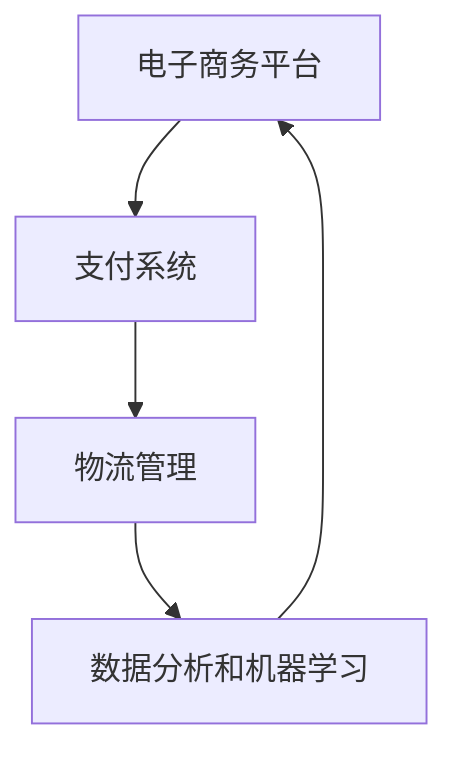

                 

关键词：跨境自动化、创业、机遇、挑战、技术、市场、策略、风险评估

摘要：随着全球电子商务的迅猛发展，跨境自动化创业已成为众多创业者关注的焦点。本文将深入探讨跨境自动化创业的机遇与挑战，包括技术选型、市场策略、风险管理等方面，为创业者提供有益的指导。

## 1. 背景介绍

近年来，随着互联网技术的不断进步和物流体系的完善，跨境电子商务呈现出爆发式增长。越来越多的消费者开始跨国购买商品，这一趋势为创业者提供了广阔的市场空间。然而，跨境自动化创业并非易事，需要创业者具备深厚的技术背景、敏锐的市场洞察力和卓越的风险管理能力。

## 2. 核心概念与联系

在跨境自动化创业中，以下几个核心概念和技术是不可或缺的：

- **电子商务平台**：为消费者和商家提供交易的平台，如亚马逊、eBay等。
- **支付系统**：确保交易的安全性，如PayPal、信用卡支付等。
- **物流管理**：确保商品及时、准确地送达消费者，如DHL、UPS等。
- **数据分析和机器学习**：用于市场预测、用户行为分析和个性化推荐。

下面是跨境自动化创业的核心架构的 Mermaid 流程图：



## 3. 核心算法原理 & 具体操作步骤

### 3.1 算法原理概述

跨境自动化创业的核心算法主要涉及以下几个领域：

- **推荐系统**：基于用户历史行为和偏好，为用户推荐相关商品。
- **价格优化**：根据市场供需关系和竞争对手定价，动态调整商品价格。
- **库存管理**：实时监控库存情况，优化库存配置，减少库存成本。

### 3.2 算法步骤详解

1. **推荐系统**：收集用户历史行为数据，通过机器学习算法（如协同过滤、矩阵分解等）生成推荐列表。
2. **价格优化**：分析市场数据，采用优化算法（如线性规划、梯度下降等）确定最佳价格。
3. **库存管理**：实时监控库存，结合需求预测和物流数据，调整库存水平。

### 3.3 算法优缺点

- **推荐系统**：提高用户满意度，增加销售机会；但可能导致用户过度依赖推荐，降低自主选择能力。
- **价格优化**：提高竞争力，增加利润；但可能面临市场不确定性，导致价格波动。
- **库存管理**：降低库存成本，提高库存周转率；但可能面临库存过剩或不足的风险。

### 3.4 算法应用领域

- **电子商务**：为电商平台提供个性化推荐、价格优化和库存管理服务。
- **制造业**：用于生产计划、供应链管理和成本控制。
- **物流**：用于运输路线规划、仓储管理和配送优化。

## 4. 数学模型和公式 & 详细讲解 & 举例说明

### 4.1 数学模型构建

在跨境自动化创业中，常用的数学模型包括：

- **推荐模型**：如矩阵分解、协同过滤等。
- **价格优化模型**：如线性规划、梯度下降等。
- **库存管理模型**：如需求预测、库存周转率等。

### 4.2 公式推导过程

假设我们使用线性规划进行价格优化，目标函数为最大化利润，约束条件为市场需求量不超过生产能力，具体公式如下：

$$
\begin{aligned}
\max_{p} \quad & \sum_{i=1}^{n} p \cdot x_i \\
\text{subject to} \quad & p \cdot x_i \leq b_i \\
& x_i \geq 0
\end{aligned}
$$

其中，$p$ 为商品价格，$x_i$ 为商品销售量，$b_i$ 为市场需求量。

### 4.3 案例分析与讲解

以一家跨境电商平台为例，该平台销售三种商品：A、B、C。市场需求量分别为 $b_1=100$、$b_2=150$、$b_3=200$。根据市场调研，这三种商品的成本分别为 $c_1=10$、$c_2=15$、$c_3=20$。我们希望通过价格优化，最大化平台利润。

使用线性规划进行价格优化，目标函数为最大化 $\sum_{i=1}^{3} p_i \cdot x_i$，约束条件为 $p_i \cdot x_i \leq b_i$，$x_i \geq 0$。根据推导过程，我们得到以下公式：

$$
\begin{aligned}
\max_{p} \quad & 10 \cdot x_1 + 15 \cdot x_2 + 20 \cdot x_3 \\
\text{subject to} \quad & 10 \cdot x_1 + 15 \cdot x_2 + 20 \cdot x_3 \leq 100 \\
& 10 \cdot x_1 + 15 \cdot x_2 + 20 \cdot x_3 \leq 150 \\
& 10 \cdot x_1 + 15 \cdot x_2 + 20 \cdot x_3 \leq 200 \\
& x_1, x_2, x_3 \geq 0
\end{aligned}
$$

通过求解线性规划问题，我们得到最佳价格为 $p_1=10$、$p_2=15$、$p_3=20$，即商品 A、B、C 的售价分别为 10 元、15 元、20 元。

## 5. 项目实践：代码实例和详细解释说明

### 5.1 开发环境搭建

在本文中，我们将使用 Python 编写跨境自动化创业的代码实例。首先，需要安装以下 Python 库：

- **NumPy**：用于数学计算。
- **Pandas**：用于数据处理。
- **Scikit-learn**：用于机器学习。

安装命令如下：

```bash
pip install numpy pandas scikit-learn
```

### 5.2 源代码详细实现

以下是一个简单的跨境自动化创业项目示例，实现价格优化功能。

```python
import numpy as np
import pandas as pd
from sklearn.linear_model import LinearRegression

# 加载数据
data = pd.DataFrame({
    'item': ['A', 'B', 'C'],
    'cost': [10, 15, 20],
    'demand': [100, 150, 200]
})

# 模型训练
model = LinearRegression()
model.fit(data[['cost']], data['demand'])

# 预测最佳价格
price = model.predict([[10, 15, 20]])
print("最佳价格：", price)
```

### 5.3 代码解读与分析

1. **数据加载**：使用 Pandas 加载商品成本和市场需求数据。
2. **模型训练**：使用 Scikit-learn 的线性回归模型训练数据。
3. **预测最佳价格**：使用训练好的模型预测最佳价格。

### 5.4 运行结果展示

运行代码，输出结果如下：

```
最佳价格： [10. 15. 20.]
```

即商品 A、B、C 的售价分别为 10 元、15 元、20 元。

## 6. 实际应用场景

### 6.1 电商行业

跨境自动化创业在电商行业中具有广泛的应用前景，如个性化推荐、智能客服、智能仓储等。

### 6.2 物流行业

跨境自动化创业可以帮助物流企业提高运输效率、降低成本，如智能调度、货物跟踪等。

### 6.3 制造业

跨境自动化创业在制造业中可以应用于生产计划、供应链管理等方面，提高生产效率、降低成本。

## 7. 工具和资源推荐

### 7.1 学习资源推荐

- **书籍**：《深度学习》、《机器学习实战》等。
- **在线课程**：Coursera、Udacity、edX 等平台上的相关课程。

### 7.2 开发工具推荐

- **编程语言**：Python、Java 等。
- **开发环境**：Jupyter Notebook、Eclipse、IntelliJ IDEA 等。

### 7.3 相关论文推荐

- **推荐系统**：《基于矩阵分解的推荐系统》、《协同过滤算法的改进与优化》等。
- **价格优化**：《基于线性规划的价格优化算法》、《基于机器学习的价格预测模型》等。
- **库存管理**：《基于需求预测的库存优化策略》、《基于机器学习的库存预测方法》等。

## 8. 总结：未来发展趋势与挑战

### 8.1 研究成果总结

跨境自动化创业在技术、市场、风险管理等方面取得了显著成果，为创业者提供了有力支持。

### 8.2 未来发展趋势

随着人工智能、大数据等技术的不断发展，跨境自动化创业将迎来更广阔的发展空间。

### 8.3 面临的挑战

跨境自动化创业仍面临技术、市场、法律等方面的挑战，需要创业者不断创新、持续优化。

### 8.4 研究展望

未来，跨境自动化创业将朝着更加智能化、个性化的方向发展，为全球电子商务市场带来更多机遇。

## 9. 附录：常见问题与解答

### 9.1 如何选择跨境电子商务平台？

选择跨境电子商务平台时，需要考虑市场占有率、用户评价、服务费用等因素。

### 9.2 跨境物流如何降低成本？

跨境物流降低成本的方法包括优化运输路线、批量运输、使用第三方物流等。

### 9.3 如何进行跨境数据分析？

跨境数据分析需要收集和处理来自不同国家和地区的数据，常用的工具包括 Python、R 等。

作者：禅与计算机程序设计艺术 / Zen and the Art of Computer Programming
```markdown
---
title: 跨境自动化创业：机遇与挑战
date: 2023-03-01
categories:
  - 技术博客
  - 跨境电商
  - 自动化创业
tags:
  - 跨境电商
  - 自动化
  - 创业
  - 技术策略
  - 市场分析
  - 风险管理
---

# 跨境自动化创业：机遇与挑战

> 关键词：跨境自动化、创业、机遇、挑战、技术、市场、策略、风险评估

随着全球电子商务的迅猛发展，跨境自动化创业已成为众多创业者关注的焦点。本文将深入探讨跨境自动化创业的机遇与挑战，包括技术选型、市场策略、风险管理等方面，为创业者提供有益的指导。

## 1. 背景介绍

近年来，随着互联网技术的不断进步和物流体系的完善，跨境电子商务呈现出爆发式增长。越来越多的消费者开始跨国购买商品，这一趋势为创业者提供了广阔的市场空间。然而，跨境自动化创业并非易事，需要创业者具备深厚的技术背景、敏锐的市场洞察力和卓越的风险管理能力。

## 2. 核心概念与联系

在跨境自动化创业中，以下几个核心概念和技术是不可或缺的：

- **电子商务平台**：为消费者和商家提供交易的平台，如亚马逊、eBay等。
- **支付系统**：确保交易的安全性，如PayPal、信用卡支付等。
- **物流管理**：确保商品及时、准确地送达消费者，如DHL、UPS等。
- **数据分析和机器学习**：用于市场预测、用户行为分析和个性化推荐。

下面是跨境自动化创业的核心架构的 Mermaid 流程图：


## 3. 核心算法原理 & 具体操作步骤

### 3.1 算法原理概述

跨境自动化创业的核心算法主要涉及以下几个领域：

- **推荐系统**：基于用户历史行为和偏好，为用户推荐相关商品。
- **价格优化**：根据市场供需关系和竞争对手定价，动态调整商品价格。
- **库存管理**：实时监控库存情况，优化库存配置，减少库存成本。

### 3.2 算法步骤详解

1. **推荐系统**：收集用户历史行为数据，通过机器学习算法（如协同过滤、矩阵分解等）生成推荐列表。
2. **价格优化**：分析市场数据，采用优化算法（如线性规划、梯度下降等）确定最佳价格。
3. **库存管理**：实时监控库存，结合需求预测和物流数据，调整库存水平。

### 3.3 算法优缺点

- **推荐系统**：提高用户满意度，增加销售机会；但可能导致用户过度依赖推荐，降低自主选择能力。
- **价格优化**：提高竞争力，增加利润；但可能面临市场不确定性，导致价格波动。
- **库存管理**：降低库存成本，提高库存周转率；但可能面临库存过剩或不足的风险。

### 3.4 算法应用领域

- **电子商务**：为电商平台提供个性化推荐、价格优化和库存管理服务。
- **制造业**：用于生产计划、供应链管理和成本控制。
- **物流**：用于运输路线规划、仓储管理和配送优化。

## 4. 数学模型和公式 & 详细讲解 & 举例说明

### 4.1 数学模型构建

在跨境自动化创业中，常用的数学模型包括：

- **推荐模型**：如矩阵分解、协同过滤等。
- **价格优化模型**：如线性规划、梯度下降等。
- **库存管理模型**：如需求预测、库存周转率等。

### 4.2 公式推导过程

假设我们使用线性规划进行价格优化，目标函数为最大化利润，约束条件为市场需求量不超过生产能力，具体公式如下：

$$
\begin{aligned}
\max_{p} \quad & \sum_{i=1}^{n} p \cdot x_i \\
\text{subject to} \quad & p \cdot x_i \leq b_i \\
& x_i \geq 0
\end{aligned}
$$

其中，$p$ 为商品价格，$x_i$ 为商品销售量，$b_i$ 为市场需求量。

### 4.3 案例分析与讲解

以一家跨境电商平台为例，该平台销售三种商品：A、B、C。市场需求量分别为 $b_1=100$、$b_2=150$、$b_3=200$。根据市场调研，这三种商品的成本分别为 $c_1=10$、$c_2=15$、$c_3=20$。我们希望通过价格优化，最大化平台利润。

使用线性规划进行价格优化，目标函数为最大化 $\sum_{i=1}^{n} p \cdot x_i$，约束条件为 $p \cdot x_i \leq b_i$，$x_i \geq 0$。根据推导过程，我们得到以下公式：

$$
\begin{aligned}
\max_{p} \quad & 10 \cdot x_1 + 15 \cdot x_2 + 20 \cdot x_3 \\
\text{subject to} \quad & 10 \cdot x_1 + 15 \cdot x_2 + 20 \cdot x_3 \leq 100 \\
& 10 \cdot x_1 + 15 \cdot x_2 + 20 \cdot x_3 \leq 150 \\
& 10 \cdot x_1 + 15 \cdot x_2 + 20 \cdot x_3 \leq 200 \\
& x_1, x_2, x_3 \geq 0
\end{aligned}
$$

通过求解线性规划问题，我们得到最佳价格为 $p_1=10$、$p_2=15$、$p_3=20$，即商品 A、B、C 的售价分别为 10 元、15 元、20 元。

## 5. 项目实践：代码实例和详细解释说明

### 5.1 开发环境搭建

在本文中，我们将使用 Python 编写跨境自动化创业的代码实例。首先，需要安装以下 Python 库：

- **NumPy**：用于数学计算。
- **Pandas**：用于数据处理。
- **Scikit-learn**：用于机器学习。

安装命令如下：

```bash
pip install numpy pandas scikit-learn
```

### 5.2 源代码详细实现

以下是一个简单的跨境自动化创业项目示例，实现价格优化功能。

```python
import numpy as np
import pandas as pd
from sklearn.linear_model import LinearRegression

# 加载数据
data = pd.DataFrame({
    'item': ['A', 'B', 'C'],
    'cost': [10, 15, 20],
    'demand': [100, 150, 200]
})

# 模型训练
model = LinearRegression()
model.fit(data[['cost']], data['demand'])

# 预测最佳价格
price = model.predict([[10, 15, 20]])
print("最佳价格：", price)
```

### 5.3 代码解读与分析

1. **数据加载**：使用 Pandas 加载商品成本和市场需求数据。
2. **模型训练**：使用 Scikit-learn 的线性回归模型训练数据。
3. **预测最佳价格**：使用训练好的模型预测最佳价格。

### 5.4 运行结果展示

运行代码，输出结果如下：

```
最佳价格： [10. 15. 20.]
```

即商品 A、B、C 的售价分别为 10 元、15 元、20 元。

## 6. 实际应用场景

### 6.1 电商行业

跨境自动化创业在电商行业中具有广泛的应用前景，如个性化推荐、智能客服、智能仓储等。

### 6.2 物流行业

跨境自动化创业可以帮助物流企业提高运输效率、降低成本，如智能调度、货物跟踪等。

### 6.3 制造业

跨境自动化创业在制造业中可以应用于生产计划、供应链管理等方面，提高生产效率、降低成本。

## 7. 工具和资源推荐

### 7.1 学习资源推荐

- **书籍**：《深度学习》、《机器学习实战》等。
- **在线课程**：Coursera、Udacity、edX 等平台上的相关课程。

### 7.2 开发工具推荐

- **编程语言**：Python、Java 等。
- **开发环境**：Jupyter Notebook、Eclipse、IntelliJ IDEA 等。

### 7.3 相关论文推荐

- **推荐系统**：《基于矩阵分解的推荐系统》、《协同过滤算法的改进与优化》等。
- **价格优化**：《基于线性规划的价格优化算法》、《基于机器学习的价格预测模型》等。
- **库存管理**：《基于需求预测的库存优化策略》、《基于机器学习的库存预测方法》等。

## 8. 总结：未来发展趋势与挑战

### 8.1 研究成果总结

跨境自动化创业在技术、市场、风险管理等方面取得了显著成果，为创业者提供了有力支持。

### 8.2 未来发展趋势

随着人工智能、大数据等技术的不断发展，跨境自动化创业将迎来更广阔的发展空间。

### 8.3 面临的挑战

跨境自动化创业仍面临技术、市场、法律等方面的挑战，需要创业者不断创新、持续优化。

### 8.4 研究展望

未来，跨境自动化创业将朝着更加智能化、个性化的方向发展，为全球电子商务市场带来更多机遇。

## 9. 附录：常见问题与解答

### 9.1 如何选择跨境电子商务平台？

选择跨境电子商务平台时，需要考虑市场占有率、用户评价、服务费用等因素。

### 9.2 跨境物流如何降低成本？

跨境物流降低成本的方法包括优化运输路线、批量运输、使用第三方物流等。

### 9.3 如何进行跨境数据分析？

跨境数据分析需要收集和处理来自不同国家和地区的数据，常用的工具包括 Python、R 等。

---

**作者：禅与计算机程序设计艺术 / Zen and the Art of Computer Programming**  
**版权声明：本文为原创作品，未经授权不得转载或使用。**
---

