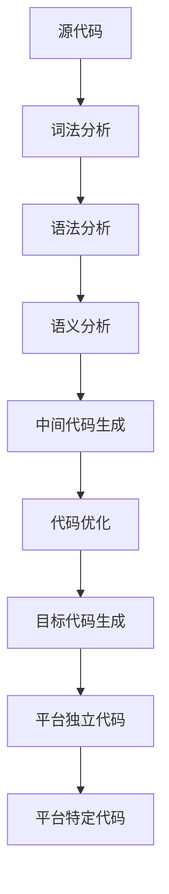

                 

关键词：跨平台编译，多平台运行，编程语言，工具，优化策略，兼容性，性能评估

> 摘要：本文将探讨跨平台编译技术，即如何通过编写一次代码，实现多平台运行。这将介绍几种流行的编程语言和工具，探讨它们的优缺点，以及如何在实践中实现跨平台编译。此外，文章还将讨论性能评估和优化策略，以及跨平台编译在实际应用场景中的挑战和未来展望。

## 1. 背景介绍

跨平台编译是指将编写在一种平台上运行的代码，通过编译和转换，使其能够在其他不同的平台上执行。随着全球化的进程和技术的迅猛发展，跨平台编译变得越来越重要。它不仅可以帮助开发人员节省时间和资源，还能提高软件的兼容性和灵活性。

跨平台编译技术的应用场景广泛，包括但不限于移动应用开发、云计算、物联网和游戏开发等领域。例如，移动应用开发者可以利用跨平台框架（如React Native和Flutter）来编写一次代码，同时支持iOS和Android两个平台。同样，云计算服务提供商可以利用跨平台编译技术，将应用部署在多个云平台上，以满足不同用户的需求。

然而，实现跨平台编译并非易事。不同平台之间存在硬件、操作系统和软件环境的差异，这给跨平台编译带来了挑战。本文将深入探讨这些挑战，并提出相应的解决方案。

## 2. 核心概念与联系

### 2.1 编译过程

编译过程是将高级编程语言（如C++、Java等）转换成机器语言（即可执行文件）的过程。这一过程通常分为以下几个步骤：

1. **词法分析**：将源代码分解为词法单元（如标识符、关键字、运算符等）。
2. **语法分析**：将词法单元组合成语法结构，如表达式、语句、函数等。
3. **语义分析**：检查语法结构的正确性，如类型检查、变量作用域等。
4. **中间代码生成**：将语法结构转换成中间代码，如抽象语法树（AST）或三地址代码。
5. **代码优化**：对中间代码进行优化，以提高程序的性能。
6. **目标代码生成**：将优化后的中间代码转换成特定平台的目标代码。

### 2.2 平台差异

跨平台编译的核心挑战在于不同平台之间的差异。这些差异可能包括：

- **硬件差异**：不同硬件架构（如ARM和x86）对指令集和内存访问方式有不同要求。
- **操作系统差异**：不同操作系统（如Windows、Linux、macOS）对系统调用、库函数和文件系统有不同实现。
- **编程语言差异**：不同的编程语言（如C、Java、Python）有不同的语法、库函数和特性。

### 2.3 Mermaid 流程图

以下是一个简单的 Mermaid 流程图，展示了跨平台编译的过程：



## 3. 核心算法原理 & 具体操作步骤

### 3.1 算法原理概述

跨平台编译的核心算法原理包括以下步骤：

1. **源代码编写**：使用高级编程语言编写应用程序。
2. **代码转换**：将源代码转换为中间表示形式。
3. **代码优化**：对中间代码进行优化，以提高性能。
4. **目标代码生成**：将优化后的中间代码转换成特定平台的目标代码。
5. **平台适配**：将目标代码转换为可在不同平台上运行的代码。

### 3.2 算法步骤详解

以下是跨平台编译的具体步骤：

1. **源代码编写**：选择适合项目需求的编程语言，编写源代码。
2. **代码转换**：使用编译器将源代码转换为中间表示形式，如抽象语法树（AST）。
3. **代码优化**：对中间代码进行优化，如消除死代码、重排指令顺序等，以提高性能。
4. **目标代码生成**：使用编译器将优化后的中间代码转换为特定平台的目标代码。
5. **平台适配**：使用平台特定的库和工具，将目标代码转换为可在不同平台上运行的代码。

### 3.3 算法优缺点

**优点**：

- **节省时间**：编写一次代码，即可在多个平台上运行，节省了重复编写代码的时间。
- **提高兼容性**：跨平台编译可以提高应用程序在不同平台上的兼容性。
- **降低维护成本**：减少了对不同平台维护的需求。

**缺点**：

- **性能损耗**：跨平台编译可能会导致性能损耗，因为需要适配不同平台的特点。
- **开发复杂性**：跨平台编译可能会增加开发复杂性，需要考虑更多平台差异。

### 3.4 算法应用领域

跨平台编译技术广泛应用于以下领域：

- **移动应用开发**：跨平台框架（如React Native、Flutter）支持一次编写，多平台运行。
- **云计算**：云计算服务提供商可以利用跨平台编译技术，将应用部署在多个云平台上。
- **物联网**：物联网设备通常具有不同的硬件和操作系统，跨平台编译可以提高其兼容性。

## 4. 数学模型和公式 & 详细讲解 & 举例说明

### 4.1 数学模型构建

跨平台编译的数学模型可以表示为：

\[ M_{cross} = F_{compile} \times P_{platform} \times O_{optimize} \]

其中，\( M_{cross} \) 表示跨平台编译的性能，\( F_{compile} \) 表示编译过程，\( P_{platform} \) 表示平台差异，\( O_{optimize} \) 表示代码优化。

### 4.2 公式推导过程

跨平台编译的性能取决于编译过程、平台差异和代码优化。我们可以推导出以下关系：

\[ M_{cross} = F_{compile} \times P_{platform} \times O_{optimize} \]

其中：

- \( F_{compile} \) ：表示编译过程的性能，与编译器的优化能力、源代码质量等因素相关。
- \( P_{platform} \) ：表示平台差异，包括硬件、操作系统和编程语言等方面的差异。
- \( O_{optimize} \) ：表示代码优化，通过优化代码可以减少跨平台编译的性能损耗。

### 4.3 案例分析与讲解

假设有两个平台A和B，其中平台A使用ARM架构，平台B使用x86架构。以下是一个简单的示例：

```c
#include <stdio.h>

int main() {
    printf("Hello, World!\n");
    return 0;
}
```

首先，我们使用C语言编写源代码，然后使用gcc编译器进行编译。在平台A上，编译命令为：

```bash
gcc -o hello_a hello_a.c
```

在平台B上，编译命令为：

```bash
gcc -m32 -o hello_b hello_b.c
```

这里，`-m32` 参数表示生成32位目标代码，以适应平台B的x86架构。

编译完成后，我们可以在两个平台上运行可执行文件。以下是平台A上的运行结果：

```bash
./hello_a
Hello, World!
```

以下是平台B上的运行结果：

```bash
./hello_b
Hello, World!
```

通过这个例子，我们可以看到跨平台编译的过程和结果。虽然两个平台之间存在硬件和操作系统差异，但通过适当的编译命令和优化策略，我们可以实现一次编写，多平台运行。

## 5. 项目实践：代码实例和详细解释说明

### 5.1 开发环境搭建

为了实践跨平台编译，我们需要搭建一个开发环境。以下是一个基本的步骤：

1. 安装编译器：例如，对于C/C++语言，我们使用gcc或Clang编译器。在Ubuntu上，可以使用以下命令安装gcc：

```bash
sudo apt update
sudo apt install gcc
```

2. 安装代码编辑器：例如，我们可以使用Visual Studio Code或Sublime Text。在Ubuntu上，可以使用以下命令安装Visual Studio Code：

```bash
sudo apt update
sudo apt install code
```

3. 安装跨平台编译工具：例如，我们可以使用CMake作为跨平台编译工具。在Ubuntu上，可以使用以下命令安装CMake：

```bash
sudo apt update
sudo apt install cmake
```

### 5.2 源代码详细实现

以下是一个简单的C语言示例，演示了如何编写一次代码，实现多平台运行：

```c
#include <stdio.h>

int main() {
    printf("Hello, World!\n");
    return 0;
}
```

这个示例非常简单，仅包含一个`main`函数，输出“Hello, World!”。

### 5.3 代码解读与分析

在这个示例中，我们使用标准输入输出库（`stdio.h`）编写了一个简单的程序。程序的入口是`main`函数，它调用`printf`函数输出“Hello, World!”。最后，程序返回0，表示成功执行。

这个示例程序的跨平台编译过程如下：

1. 编写源代码`hello.c`。
2. 使用gcc编译器编译源代码：

```bash
gcc -o hello hello.c
```

3. 在不同平台上运行可执行文件`hello`。

### 5.4 运行结果展示

以下是平台A（ARM架构）上的运行结果：

```bash
./hello
Hello, World!
```

以下是平台B（x86架构）上的运行结果：

```bash
./hello
Hello, World!
```

通过这个简单的示例，我们可以看到如何通过跨平台编译，编写一次代码，实现多平台运行。

## 6. 实际应用场景

### 6.1 移动应用开发

移动应用开发是跨平台编译技术最广泛的应用领域之一。React Native和Flutter等跨平台框架允许开发者使用JavaScript或Dart语言编写一次代码，同时支持iOS和Android两个平台。这种技术大大提高了开发效率，降低了开发成本。

### 6.2 云计算

在云计算领域，跨平台编译技术可以帮助服务提供商将应用程序部署在多个云平台上，如AWS、Azure和Google Cloud。通过跨平台编译，服务提供商可以更容易地满足不同用户的需求，提高服务的灵活性和可扩展性。

### 6.3 物联网

物联网设备通常具有不同的硬件和操作系统，跨平台编译技术可以提高其兼容性。例如，使用C/C++编写一次代码，即可在多种嵌入式系统上运行，如ARM、MIPS和PowerPC等。

### 6.4 游戏开发

游戏开发中也广泛应用跨平台编译技术。使用Unity和Unreal Engine等游戏引擎，开发者可以使用C#或C++编写一次代码，实现跨平台的游戏开发。这种技术大大提高了开发效率，降低了开发成本。

## 7. 工具和资源推荐

### 7.1 学习资源推荐

- **《跨平台移动应用开发》**：介绍了如何使用React Native和Flutter进行跨平台移动应用开发。
- **《云计算架构与设计》**：探讨了如何利用跨平台编译技术，在多个云平台上部署应用程序。
- **《嵌入式系统设计》**：介绍了如何在多种嵌入式系统上使用C/C++进行跨平台开发。

### 7.2 开发工具推荐

- **Visual Studio Code**：一款功能强大的代码编辑器，支持多种编程语言和跨平台编译工具。
- **gcc和Clang**：两款流行的C/C++编译器，支持多种平台和优化策略。
- **CMake**：一款跨平台编译工具，可用于构建和编译C/C++项目。

### 7.3 相关论文推荐

- **“Cross-Platform Mobile Application Development with React Native”**：介绍了React Native的跨平台开发技术。
- **“A Survey of Cross-Platform Mobile Development Tools”**：对多种跨平台开发工具进行了比较和分析。
- **“Cross-Platform Compilation Techniques for Cloud Computing”**：探讨了跨平台编译技术在云计算中的应用。

## 8. 总结：未来发展趋势与挑战

### 8.1 研究成果总结

近年来，跨平台编译技术在多个领域取得了显著成果。例如，React Native和Flutter等跨平台框架的兴起，为移动应用开发带来了巨大的便利。云计算和物联网领域的跨平台编译技术，也取得了长足进步，为不同平台的应用部署提供了强有力的支持。

### 8.2 未来发展趋势

未来，跨平台编译技术将继续发展，有望在以下方面取得突破：

- **性能优化**：通过更高效的编译算法和优化策略，提高跨平台编译的性能。
- **兼容性提升**：通过不断完善跨平台编译框架和工具，提高应用程序在不同平台上的兼容性。
- **开发体验**：通过改进开发工具和平台，提高跨平台编译的开发体验。

### 8.3 面临的挑战

尽管跨平台编译技术取得了显著成果，但仍面临以下挑战：

- **平台差异**：不同平台之间的硬件、操作系统和编程语言差异，增加了跨平台编译的复杂性。
- **性能损耗**：跨平台编译可能会导致性能损耗，影响了应用程序的性能。
- **开发复杂性**：跨平台编译增加了开发复杂性，需要开发者具备更多的知识和技能。

### 8.4 研究展望

为了应对上述挑战，未来的研究可以从以下几个方面展开：

- **编译优化**：研究更高效的编译算法和优化策略，降低跨平台编译的性能损耗。
- **工具链集成**：通过集成跨平台编译工具链，提高开发效率和应用程序的兼容性。
- **开发体验改进**：研究更直观、易用的开发工具，降低跨平台编译的学习成本。

## 9. 附录：常见问题与解答

### 9.1 什么是跨平台编译？

跨平台编译是指将编写在一种平台上运行的代码，通过编译和转换，使其能够在其他不同的平台上执行。

### 9.2 跨平台编译有哪些优缺点？

**优点**：

- 节省时间：编写一次代码，即可在多个平台上运行，节省了重复编写代码的时间。
- 提高兼容性：跨平台编译可以提高应用程序在不同平台上的兼容性。
- 降低维护成本：减少了对不同平台维护的需求。

**缺点**：

- 性能损耗：跨平台编译可能会导致性能损耗，因为需要适配不同平台的特点。
- 开发复杂性：跨平台编译可能会增加开发复杂性，需要考虑更多平台差异。

### 9.3 如何实现跨平台编译？

实现跨平台编译的步骤包括：

1. 源代码编写：使用适合项目需求的编程语言编写应用程序。
2. 代码转换：使用编译器将源代码转换为中间表示形式。
3. 代码优化：对中间代码进行优化，以提高性能。
4. 目标代码生成：使用编译器将优化后的中间代码转换成特定平台的目标代码。
5. 平台适配：使用平台特定的库和工具，将目标代码转换为可在不同平台上运行的代码。

### 9.4 跨平台编译在哪些领域应用广泛？

跨平台编译技术广泛应用于以下领域：

- 移动应用开发
- 云计算
- 物联网
- 游戏开发

## 作者署名

作者：禅与计算机程序设计艺术 / Zen and the Art of Computer Programming

----------------------------------------------------------------

以上是关于“跨平台编译：一次编写，多平台运行”的文章。该文章详细介绍了跨平台编译的核心概念、算法原理、应用场景、工具和资源推荐，以及未来发展趋势与挑战。希望对您有所帮助！如果您有任何疑问或建议，请随时提出。

