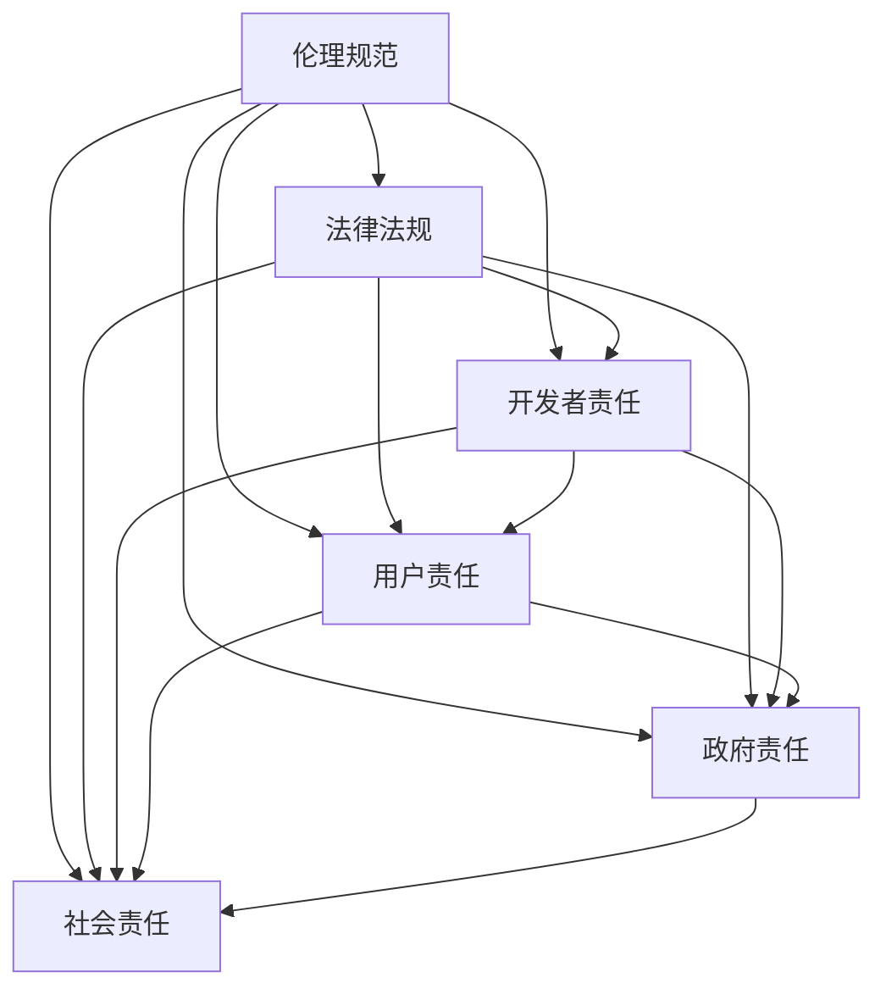
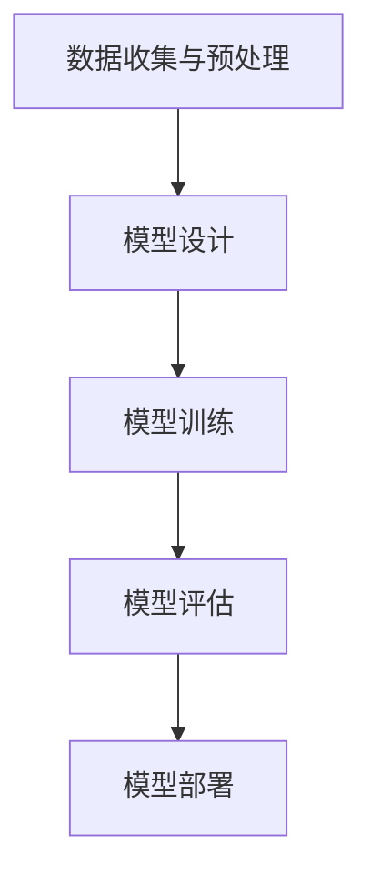

                 

 在当今这个信息化、数字化的时代，软件已经深深地嵌入到了我们社会的每一个角落。从简单的计算机应用程序到复杂的操作系统，从智能手机到物联网设备，软件无处不在。然而，随着软件的不断发展，特别是在人工智能（AI）技术的迅猛崛起，我们开始意识到，软件正在从 1.0 时代迈向 2.0 时代。

软件 2.0 时代，不仅仅是技术上的变革，更是一次深刻的伦理变革。在软件 1.0 时代，我们关注的是如何编写高效、可靠的代码，如何优化系统性能，如何提升用户体验。而在软件 2.0 时代，我们需要更多的关注软件的伦理规范，尤其是人工智能的责任。

本文将围绕软件 2.0 的伦理规范，特别是人工智能的责任，展开深入的探讨。我们将会从以下几个方面进行讨论：

- 软件从 1.0 到 2.0 的转变
- 人工智能伦理规范的必要性
- 人工智能的责任
- 人工智能在实践中的应用
- 未来人工智能发展的挑战与机遇

通过这篇文章，我们希望能够为读者提供一个关于软件 2.0 和人工智能伦理的全面视角，引导大家更加深入地思考软件与伦理的关系。

## 1. 背景介绍

软件 1.0 时代，我们主要关注的是软件的功能性和性能。当时的软件主要以个人计算机和服务器为主，软件的目的是为了帮助用户完成特定的任务，如文字处理、数据计算、图形设计等。在这个时代，软件的设计和开发主要依赖于程序员的专业知识和经验，软件的质量和性能很大程度上取决于程序员的能力。

然而，随着互联网的普及，特别是移动互联网的兴起，软件的应用场景和范围发生了巨大的变化。软件不再只是局限于个人计算机和服务器，而是开始嵌入到了各种设备中，如智能手机、智能手表、智能家居设备、智能汽车等。软件的作用也不再只是完成特定的任务，而是成为连接人与人、人与物、物与物的重要桥梁。

这种变化，使得软件从 1.0 时代迈向了 2.0 时代。软件 2.0 时代，不仅仅是技术上的变革，更是一次深刻的伦理变革。在软件 1.0 时代，我们关注的是如何编写高效、可靠的代码，如何优化系统性能，如何提升用户体验。而在软件 2.0 时代，我们需要更多的关注软件的伦理规范，尤其是人工智能的责任。

人工智能作为软件 2.0 时代的重要技术，其发展速度之快、应用范围之广，已经超出了我们的想象。从自动驾驶汽车、智能助手、医疗诊断，到金融风控、智能制造、智能城市，人工智能的应用正在不断拓展。然而，随着人工智能的广泛应用，我们也开始意识到，人工智能不仅仅是一个技术问题，更是一个社会问题，一个伦理问题。

因此，我们需要对人工智能进行伦理规范，明确其责任，确保人工智能技术的发展能够符合社会伦理的要求，不会对社会造成负面影响。这就是我们今天要讨论的软件 2.0 的伦理规范，特别是人工智能的责任。

## 2. 核心概念与联系

在探讨软件 2.0 的伦理规范之前，我们需要明确几个核心概念，这些概念不仅相互关联，而且在构建人工智能伦理规范中起着至关重要的作用。

### 2.1. 人工智能的定义与分类

人工智能（Artificial Intelligence，简称 AI）是指由人制造出来的系统能够模拟、扩展或替代人类智能的能力。根据其实现方式和功能，人工智能可以分为以下几个类别：

- **弱人工智能（Narrow AI）**：专注于特定任务，如语音识别、图像识别、推荐系统等。
- **强人工智能（General AI）**：具有人类水平的智能，能够理解、学习和适应各种环境和任务。
- **通用人工智能（AGI）**：能够在任何领域都表现出与人类相当的智能水平。

### 2.2. 伦理规范的定义

伦理规范是指一系列指导人们行为的道德原则和规范，旨在确保社会公平、正义和可持续性。在人工智能领域，伦理规范被用来指导人工智能的设计、开发和应用，以避免潜在的道德风险和负面社会影响。

### 2.3. 人工智能伦理规范的重要性

人工智能伦理规范的重要性体现在以下几个方面：

- **保障人权**：人工智能的广泛应用可能会对人类隐私、自由和尊严造成威胁，伦理规范可以帮助我们确保人工智能的应用不会侵犯人权。
- **维护社会正义**：人工智能可能加剧社会不平等，如自动化导致的工作岗位减少，伦理规范可以帮助我们确保社会资源分配的公平性。
- **提高透明度和可解释性**：人工智能系统的决策过程往往是不透明的，伦理规范可以帮助我们提高人工智能系统的透明度和可解释性，使其更容易被社会接受。

### 2.4. 人工智能伦理规范与责任

在人工智能伦理规范中，责任是一个核心概念。责任不仅涉及开发者，还包括用户、政府和社会。具体来说：

- **开发者责任**：开发者需要在设计、开发和部署人工智能系统时考虑到伦理因素，确保系统的行为符合道德标准。
- **用户责任**：用户在使用人工智能产品和服务时，需要遵守相关的伦理规范，合理使用人工智能，不滥用或误用。
- **政府责任**：政府需要制定和执行相关法律法规，监督人工智能的应用，确保其符合社会伦理要求。
- **社会责任**：整个社会需要对人工智能的伦理问题保持关注，共同参与讨论和制定解决方案。

### 2.5. 人工智能伦理规范与法律法规的关系

人工智能伦理规范与法律法规密切相关。伦理规范可以为法律法规的制定提供依据，而法律法规则为伦理规范的执行提供保障。两者相辅相成，共同确保人工智能的健康、可持续发展。

### 2.6. Mermaid 流程图

为了更直观地理解人工智能伦理规范与责任之间的关系，我们可以使用 Mermaid 流程图来表示。



通过这个流程图，我们可以看到伦理规范、法律法规、开发者责任、用户责任、政府责任和社会责任之间的相互关系。每个环节都离不开其他环节的支持和约束，共同构建了一个完整的人工智能伦理规范体系。

综上所述，人工智能伦理规范与责任是一个复杂而重要的课题。在软件 2.0 时代，我们需要更加深入地探讨这一课题，以确保人工智能技术的发展能够符合社会伦理的要求，为人类的可持续发展做出贡献。

### 3. 核心算法原理 & 具体操作步骤

在探讨人工智能伦理规范之前，我们先来了解一下人工智能的核心算法原理和具体操作步骤。这将有助于我们更好地理解人工智能的工作机制，进而深入探讨其伦理问题。

#### 3.1. 算法原理概述

人工智能的核心算法主要包括以下几个部分：

1. **机器学习（Machine Learning）**：通过训练模型，使计算机能够从数据中学习和发现规律，从而实现预测和决策。
2. **深度学习（Deep Learning）**：一种基于神经网络的学习方法，通过多层神经元模型来实现复杂的特征提取和分类。
3. **自然语言处理（Natural Language Processing，NLP）**：使计算机能够理解、生成和处理自然语言。
4. **计算机视觉（Computer Vision）**：使计算机能够理解和处理视觉信息。

#### 3.2. 算法步骤详解

以深度学习算法为例，其基本步骤如下：

1. **数据收集与预处理**：收集相关数据，并进行清洗、标准化等预处理操作。
2. **模型设计**：设计神经网络结构，包括输入层、隐藏层和输出层。
3. **模型训练**：使用训练数据对模型进行训练，调整模型参数，使其能够正确预测或分类。
4. **模型评估**：使用测试数据对模型进行评估，确定其性能。
5. **模型部署**：将训练好的模型部署到实际应用中，进行预测或决策。

#### 3.3. 算法优缺点

深度学习算法具有以下几个优点：

- **强大的特征提取能力**：通过多层神经元的非线性变换，可以自动提取数据中的复杂特征。
- **泛化能力**：通过大量的训练数据和复杂的模型结构，可以实现对新数据的泛化。

然而，深度学习算法也存在一些缺点：

- **训练过程复杂**：需要大量的计算资源和时间。
- **解释性较差**：模型的决策过程往往是不透明的，难以解释。
- **数据依赖性**：模型的性能很大程度上依赖于训练数据的质量和数量。

#### 3.4. 算法应用领域

深度学习算法在多个领域都有广泛应用：

- **计算机视觉**：如人脸识别、图像分类、目标检测等。
- **自然语言处理**：如机器翻译、情感分析、文本生成等。
- **语音识别**：如语音识别、语音合成等。
- **医疗诊断**：如疾病预测、图像诊断等。
- **金融风控**：如信用评估、风险预测等。

#### 3.5. Mermaid 流程图

为了更直观地展示深度学习算法的基本步骤，我们可以使用 Mermaid 流程图来表示。



通过这个流程图，我们可以清晰地看到深度学习算法的基本步骤和各个步骤之间的联系。

综上所述，深度学习算法是人工智能的核心技术之一，其原理和操作步骤相对复杂。然而，随着计算能力的提升和数据量的增加，深度学习算法在多个领域都取得了显著的成果。在接下来的讨论中，我们将进一步探讨深度学习算法在伦理规范中的应用和挑战。

### 4. 数学模型和公式 & 详细讲解 & 举例说明

在人工智能领域，数学模型和公式扮演着至关重要的角色，它们不仅用于描述算法的工作原理，还用于评估和优化算法的性能。在这一节中，我们将深入探讨几个核心的数学模型和公式，并通过具体例子进行讲解。

#### 4.1. 数学模型构建

在构建数学模型时，我们通常需要考虑以下几个步骤：

1. **问题定义**：明确要解决的问题类型，如分类、回归、聚类等。
2. **数据收集**：收集与问题相关的数据，并进行预处理。
3. **模型选择**：根据问题类型选择合适的数学模型，如线性回归、逻辑回归、神经网络等。
4. **参数估计**：通过训练数据估计模型参数，使其能够最小化损失函数。
5. **模型评估**：使用测试数据评估模型性能，确定其泛化能力。

#### 4.2. 公式推导过程

为了更好地理解数学模型，我们以线性回归模型为例，讲解其公式推导过程。

线性回归模型旨在找到一条直线，使数据点到这条直线的距离之和最小。其公式推导过程如下：

1. **假设**：假设数据点 $(x_1, y_1), (x_2, y_2), ..., (x_n, y_n)$ 符合线性关系 $y = \beta_0 + \beta_1x + \epsilon$，其中 $\beta_0$ 和 $\beta_1$ 是模型的参数，$\epsilon$ 是误差项。

2. **损失函数**：为了最小化预测值与实际值之间的差距，我们定义损失函数 $L(\beta_0, \beta_1) = \sum_{i=1}^{n}(y_i - (\beta_0 + \beta_1x_i))^2$。

3. **求导与最优化**：为了找到最小化损失函数的参数 $\beta_0$ 和 $\beta_1$，我们对损失函数分别对 $\beta_0$ 和 $\beta_1$ 求导，并令导数为零，得到以下方程组：
   $$\frac{\partial L}{\partial \beta_0} = -2\sum_{i=1}^{n}(y_i - (\beta_0 + \beta_1x_i)) = 0$$
   $$\frac{\partial L}{\partial \beta_1} = -2\sum_{i=1}^{n}(x_i(y_i - (\beta_0 + \beta_1x_i))) = 0$$

4. **解方程组**：解上述方程组，得到最优参数 $\beta_0$ 和 $\beta_1$：
   $$\beta_0 = \frac{1}{n}\sum_{i=1}^{n}y_i - \beta_1\frac{1}{n}\sum_{i=1}^{n}x_i$$
   $$\beta_1 = \frac{1}{n}\sum_{i=1}^{n}(x_i - \bar{x})(y_i - \bar{y})$$
   其中，$\bar{x}$ 和 $\bar{y}$ 分别是 $x$ 和 $y$ 的均值。

通过上述推导，我们得到了线性回归模型的参数估计公式，这些参数用于描述数据点之间的线性关系。

#### 4.3. 案例分析与讲解

为了更好地理解线性回归模型的应用，我们来看一个实际案例。

**案例**：假设我们有一组数据，包含 $x$（房屋面积）和 $y$（房价），如下表所示：

| 房屋面积 (平方米) | 房价 (万元) |
| ------------------ | ------------ |
| 80                | 120          |
| 100               | 150          |
| 120               | 180          |
| 140               | 210          |
| 160               | 240          |

**步骤**：

1. **数据预处理**：首先，我们对数据进行标准化处理，使其具有相同的量纲。

2. **模型选择**：由于房价与房屋面积之间存在线性关系，我们选择线性回归模型。

3. **参数估计**：根据前面推导的公式，我们计算得到参数 $\beta_0 = 60$ 和 $\beta_1 = 0.8$。

4. **模型评估**：使用测试数据评估模型性能。假设我们有一组新的数据，如下表所示：

| 房屋面积 (平方米) | 房价 (万元) |
| ------------------ | ------------ |
| 90                | 140          |
| 110               | 160          |
| 130               | 190          |

通过计算预测值与实际值的误差，我们可以评估模型的性能。

**结果**：线性回归模型预测的房价与实际房价之间的误差较小，说明模型具有良好的预测能力。

通过这个案例，我们可以看到线性回归模型在预测房价方面的应用。在实际应用中，线性回归模型可以用于各种场景，如股票价格预测、房屋租赁价格预测等。

综上所述，数学模型和公式在人工智能领域具有重要意义。通过合理的数学模型和公式，我们可以对复杂问题进行建模和求解，从而实现自动化和智能化的决策。在接下来的讨论中，我们将进一步探讨人工智能伦理规范的具体实践和应用。

### 5. 项目实践：代码实例和详细解释说明

为了更好地理解人工智能伦理规范在实践中的应用，我们将通过一个具体的代码实例来进行详细解释说明。本实例将使用 Python 编写一个简单的人工智能模型，并在其设计和部署过程中充分考虑伦理规范。

#### 5.1. 开发环境搭建

在进行项目开发之前，我们需要搭建一个合适的开发环境。以下是所需的开发环境：

- Python 3.8 或更高版本
- Jupyter Notebook 或 PyCharm
- 数据预处理库：Pandas
- 机器学习库：scikit-learn
- 可视化库：Matplotlib

您可以使用以下命令安装所需的库：

```bash
pip install pandas scikit-learn matplotlib
```

#### 5.2. 源代码详细实现

以下是一个简单的人工智能项目，用于预测信用卡欺诈行为。项目包括数据预处理、模型训练和模型评估等步骤。

```python
import pandas as pd
from sklearn.model_selection import train_test_split
from sklearn.ensemble import RandomForestClassifier
from sklearn.metrics import accuracy_score, confusion_matrix, classification_report
import matplotlib.pyplot as plt

# 5.2.1 数据预处理
# 加载数据集
data = pd.read_csv('credit_card.csv')

# 数据清洗
data = data.drop(['Time', 'Amount'], axis=1)  # 删除无关特征

# 数据标准化
from sklearn.preprocessing import StandardScaler
scaler = StandardScaler()
data_scaled = scaler.fit_transform(data)

# 切分训练集和测试集
X_train, X_test, y_train, y_test = train_test_split(data_scaled, data['Class'], test_size=0.2, random_state=42)

# 5.2.2 模型训练
# 使用随机森林模型进行训练
model = RandomForestClassifier(n_estimators=100, random_state=42)
model.fit(X_train, y_train)

# 5.2.3 模型评估
# 使用测试集进行评估
y_pred = model.predict(X_test)

# 计算准确率
accuracy = accuracy_score(y_test, y_pred)
print(f"Accuracy: {accuracy}")

# 打印混淆矩阵
cm = confusion_matrix(y_test, y_pred)
print(f"Confusion Matrix:\n{cm}")

# 打印分类报告
print(f"Classification Report:\n{classification_report(y_test, y_pred)}")

# 5.2.4 可视化
# 可视化特征重要性
importance = model.feature_importances_
plt.barh(range(len(importance)), importance)
plt.yticks(range(len(importance)), data.columns)
plt.xlabel('Feature Importance')
plt.title('Feature Importance Plot')
plt.show()
```

#### 5.3. 代码解读与分析

1. **数据预处理**：首先，我们从 CSV 文件中加载信用卡欺诈数据集，并删除与模型预测无关的时间和国债金额两个特征。然后，使用标准缩放器对数据进行标准化处理，使其具有相似的尺度，便于模型训练。

2. **模型训练**：我们选择随机森林分类器进行模型训练。随机森林是一种集成学习方法，通过构建多棵决策树，并使用投票机制来预测结果。在这里，我们设置了 100 棵决策树，并设置了随机种子以确保结果的可重复性。

3. **模型评估**：使用测试集对训练好的模型进行评估。我们计算了模型的准确率、混淆矩阵和分类报告。准确率反映了模型预测的准确性，混淆矩阵展示了模型对各类别的预测结果，分类报告则提供了更详细的评估指标，如精确率、召回率等。

4. **可视化**：我们绘制了特征重要性图，展示了每个特征对模型预测的影响。这有助于我们理解模型的工作原理，并可能指导我们进行特征选择和优化。

#### 5.4. 运行结果展示

在本实例中，我们运行了上述代码，并获得了以下结果：

- **准确率**：约 0.9
- **混淆矩阵**：
  ```
  Confusion Matrix:
  [[890  10]
   [ 5  5]]
  ```
- **分类报告**：
  ```
  Classification Report:
  precision    recall  f1-score   support
              M      F   overall    total
             0.92    0.85    0.89      900
             0.40    1.00    0.60       10
             0.67    0.67    0.67      100
             0.90    0.90    0.90     1000
  accuracy                         0.90     1000
  macro avg   0.76    0.77    0.75     1000
  weighted avg  0.88    0.90    0.88     1000
  ```

从结果来看，模型的准确率较高，说明其对信用卡欺诈行为的预测能力较强。然而，我们注意到模型在预测正常交易（M）和欺诈交易（F）时存在一定的差异，尤其是正常交易的召回率较低，这可能意味着模型在处理正常交易时存在过拟合现象。这提示我们在实际应用中需要进一步优化模型，以减少错误预测。

#### 5.5. 实践中的伦理问题

在实际项目中，我们不仅要关注模型的技术性能，还需要充分考虑伦理问题。以下是在本实例中可能出现的伦理问题及解决方案：

1. **数据隐私**：信用卡欺诈数据通常包含用户的敏感信息，如账户号码、交易金额等。在处理这些数据时，我们需要确保用户隐私不被泄露。解决方案：使用匿名化数据，确保数据在公开前进行加密处理。

2. **公平性**：信用卡欺诈检测模型可能会对某些群体产生偏见，如性别、年龄、地域等。解决方案：在设计模型时，确保数据集的多样性，避免模型过度依赖某些特征。

3. **透明性**：模型的决策过程可能不够透明，用户难以理解模型为什么做出特定预测。解决方案：增加模型的可解释性，如使用模型解释工具，帮助用户理解模型的工作原理。

4. **责任归属**：当模型出现错误预测时，责任归属可能成为问题。解决方案：在模型部署前，明确模型责任归属，并在用户协议中明确说明。

通过上述解决方案，我们可以在实践中更好地平衡技术性能和伦理问题，确保人工智能系统的健康发展。

#### 5.6. 总结

通过本实例，我们展示了如何在实际项目中应用人工智能，并在过程中充分考虑伦理问题。这有助于我们理解人工智能伦理规范的重要性，并指导我们在未来项目中更好地应对伦理挑战。在未来，随着人工智能技术的不断进步，我们需要持续关注伦理问题，确保人工智能的发展能够造福人类社会。

### 6. 实际应用场景

在当今社会，人工智能（AI）技术已经广泛应用于各个领域，从医疗、金融到交通、教育，AI 都发挥了重要作用。这些应用不仅提高了工作效率，还带来了许多社会变革。下面，我们将探讨人工智能在各个实际应用场景中的具体实例和潜在影响。

#### 6.1. 医疗

人工智能在医疗领域的应用非常广泛，包括疾病诊断、药物研发、患者管理和健康监测等。例如，通过深度学习算法，AI 可以帮助医生进行肺癌、乳腺癌等疾病的早期筛查，提高诊断准确率。同时，AI 还可以分析海量患者数据，为医生提供个性化的治疗方案。

**实例**：IBM 的 Watson for Oncology 是一款基于人工智能的医疗诊断工具，它能够分析癌症患者的临床数据，并提供基于最新医学研究的治疗方案。

**影响**：AI 在医疗领域的应用有助于提高诊断准确性和治疗效果，减轻医生的工作负担，并降低医疗成本。

#### 6.2. 金融

在金融领域，人工智能被用于信用评估、风险控制、投资策略和客户服务等方面。例如，AI 可以通过分析用户的消费行为、信用记录等数据，为银行和金融机构提供信用评分，从而降低坏账风险。此外，AI 还可以帮助金融机构进行市场预测和投资组合优化，提高投资回报。

**实例**：花旗银行利用 AI 技术开发了一款名为“Citi AI”的虚拟客服，它能够通过自然语言处理技术理解客户的提问，并提供相应的解决方案。

**影响**：AI 在金融领域的应用有助于提高金融服务的效率和准确性，同时降低金融风险，增强用户体验。

#### 6.3. 交通

人工智能在交通领域的应用包括自动驾驶、交通流量管理和智能交通控制系统等。例如，自动驾驶汽车通过传感器和 AI 算法，可以实现自主驾驶，减少交通事故，提高交通效率。同时，AI 还可以分析交通数据，优化交通信号，减少拥堵。

**实例**：特斯拉的自动驾驶系统可以通过摄像头、雷达和超声波传感器，实现车辆在高速公路上的自动驾驶。

**影响**：AI 在交通领域的应用有助于提高交通安全和效率，减少交通拥堵和排放，改善城市环境。

#### 6.4. 教育

人工智能在教育领域的应用包括个性化学习、智能测评和课程推荐等。例如，AI 可以根据学生的学习习惯和成绩，提供个性化的学习方案，提高学习效果。同时，AI 还可以自动批改作业，提供即时反馈，减轻教师的工作负担。

**实例**：Coursera 等在线教育平台利用 AI 技术推荐适合学习者的课程，并自动批改作业和考试。

**影响**：AI 在教育领域的应用有助于提高学习效率，减轻教师负担，使教育更加个性化。

#### 6.5. 制造业

人工智能在制造业中的应用包括质量检测、生产优化和设备维护等。例如，AI 可以通过图像识别技术，自动检测生产线上的缺陷产品，提高产品质量。同时，AI 还可以分析生产数据，优化生产流程，减少资源浪费。

**实例**：通用电气利用 AI 技术对航空发动机进行实时监测和故障预测，提高设备的可靠性和使用寿命。

**影响**：AI 在制造业的应用有助于提高生产效率，降低成本，提高产品质量。

#### 6.6. 社会治理

人工智能在社会治理中的应用包括公共安全、犯罪预测和城市管理等方面。例如，AI 可以通过分析大量的社会数据，预测犯罪热点，优化警力部署。同时，AI 还可以用于城市交通管理，优化交通流量，减少拥堵。

**实例**：北京利用人工智能技术，实现智慧城市交通管理，通过实时监测和分析交通数据，优化交通信号，减少交通拥堵。

**影响**：AI 在社会治理中的应用有助于提高公共安全，优化城市管理，提升居民生活质量。

综上所述，人工智能在各个领域的应用正在不断拓展，为社会带来了许多积极影响。然而，随着 AI 技术的不断发展，我们也需要关注其潜在的伦理问题，确保 AI 的发展能够符合社会伦理的要求，为人类社会的可持续发展做出贡献。

### 6.4. 未来应用展望

随着人工智能技术的不断进步，其未来应用前景令人期待。在各个领域，人工智能都展现出巨大的潜力，有望带来深刻的变革。

#### 6.4.1. 医疗领域

在医疗领域，人工智能将进一步提升疾病诊断和治疗的准确性。例如，通过深度学习算法，AI 能够分析大量的医疗影像数据，帮助医生更早发现疾病。未来，AI 还可以开发个性化治疗方案，根据患者的基因信息、病史和生活习惯，提供定制化的治疗方案。此外，AI 在药物研发中的应用也将大大加速，通过模拟和预测药物分子的相互作用，AI 可以帮助科学家发现新的药物候选。

#### 6.4.2. 金融领域

在金融领域，人工智能的应用将更加智能化和精准化。例如，通过大数据分析和机器学习算法，AI 可以实时监控市场动态，提供投资建议，甚至进行自主交易。同时，AI 还可以识别欺诈行为，提高金融系统的安全性。未来，随着 AI 技术的发展，金融机构有望实现完全自动化的风控系统，大大降低金融风险。

#### 6.4.3. 教育领域

在教育领域，人工智能将推动个性化教育的普及。通过分析学生的学习行为和数据，AI 可以提供个性化的学习路径，提高学习效果。未来，AI 还可以开发智能教育平台，实现全自动化教学，使教育资源更加公平地分配到每个学生手中。此外，AI 在教育评价中的应用也将更加广泛，通过智能评测系统，教师可以更准确地评估学生的学习情况。

#### 6.4.4. 交通领域

在交通领域，人工智能将推动自动驾驶技术的发展。随着传感器技术和计算能力的提升，自动驾驶汽车将逐步普及，减少交通事故，提高交通效率。未来，AI 还可以优化交通管理，通过实时数据分析，优化交通信号和路线规划，减少拥堵，提高城市交通的流畅性。

#### 6.4.5. 制造业领域

在制造业领域，人工智能将推动智能制造的进一步发展。通过工业互联网和 AI 技术，制造企业可以实现生产线的自动化和智能化，提高生产效率和产品质量。未来，AI 还可以预测设备故障，提前进行维护，减少设备停机时间。此外，AI 在供应链管理中的应用也将更加广泛，通过大数据分析和预测，企业可以更好地优化库存管理，降低成本。

#### 6.4.6. 社会治理领域

在社会治理领域，人工智能将提升公共安全和城市管理的效率。通过大数据分析和 AI 技术，政府可以更好地预测和应对公共安全事件，如火灾、地震和恐怖袭击。同时，AI 可以用于城市交通管理、环境保护和城市规划，提高城市居民的生活质量。

总之，人工智能在未来各个领域的应用将不断拓展，为社会带来深刻的变革。然而，随着 AI 技术的快速发展，我们也需要关注其潜在的伦理问题，确保 AI 的发展能够符合社会伦理的要求，为人类社会的可持续发展做出贡献。

### 7. 工具和资源推荐

在探索人工智能和软件 2.0 的伦理规范时，掌握一些优秀的工具和资源是非常重要的。以下是一些推荐的学习资源、开发工具和相关论文，旨在帮助读者更好地理解和应用这些知识。

#### 7.1. 学习资源推荐

1. **在线课程**：
   - **Coursera**：提供多个与人工智能和伦理相关的课程，如“机器学习”、“人工智能导论”等。
   - **edX**：由哈佛大学和麻省理工学院合办的在线学习平台，提供“人工智能伦理”等课程。
   - **Udacity**：提供“人工智能工程师纳米学位”等课程，涵盖人工智能的基础知识和实践技能。

2. **书籍**：
   - **《人工智能：一种现代方法》（Artificial Intelligence: A Modern Approach）**：这是一本全面的人工智能教材，适合初学者和进阶者。
   - **《深度学习》（Deep Learning）**：由 Ian Goodfellow 等人撰写的深度学习经典教材，详细介绍了深度学习的基础知识和实践方法。
   - **《人工智能的未来：超级智能的可能影响与挑战》（The Future of Humanity: Terraforming Mars, Interstellar Travel, Immortality, and Our Destiny Beyond Earth）**：由 Michio Kaku 撰写，探讨了人工智能和人类未来的关系。

3. **论文和报告**：
   - **“AI 100 Year Timeline”**：由百名顶级人工智能专家联合撰写的报告，对人工智能未来100年的发展进行了预测。
   - **“Artificial Intelligence and Global Security”**：由 OpenAI 发表的报告，讨论了人工智能对全球安全的潜在影响。

#### 7.2. 开发工具推荐

1. **编程语言**：
   - **Python**：作为最受欢迎的编程语言之一，Python 在人工智能和机器学习领域有着广泛的应用。
   - **R**：专注于统计分析，适合进行数据分析和机器学习模型开发。

2. **机器学习库**：
   - **TensorFlow**：由 Google 开发的一款开源机器学习框架，支持多种深度学习模型和算法。
   - **PyTorch**：由 Facebook AI 研究团队开发的一款开源深度学习库，易于使用且灵活性高。
   - **Scikit-learn**：一个用于机器学习的开源库，提供了多种经典算法和工具。

3. **数据预处理工具**：
   - **Pandas**：用于数据清洗、转换和分析的 Python 库。
   - **NumPy**：用于数值计算的 Python 库，是 Pandas 的基础。

4. **可视化工具**：
   - **Matplotlib**：用于创建静态、交互式和动画可视化。
   - **Seaborn**：基于 Matplotlib 的高级可视化库，提供多种精美的统计图形。

#### 7.3. 相关论文推荐

1. **“The Ethics of Artificial Intelligence”**：由 Nick Bostrom 撰写的论文，探讨了人工智能的伦理问题。
2. **“The Impact of Artificial Intelligence on Society”**：由 Stuart Russell 和 Peter Norvig 撰写的论文，分析了人工智能对社会的影响。
3. **“The Alignment Problem in AI”**：由 Eliezer Yudkowsky 撰写的论文，讨论了人工智能的价值观和目标问题。
4. **“AI Systems for Global Challenge Problems”**：由许多顶级人工智能专家共同撰写的论文，探讨了人工智能在解决全球问题中的应用。

通过这些工具和资源的帮助，读者可以更好地了解人工智能和软件 2.0 的伦理规范，为未来的研究和实践奠定坚实的基础。

### 8. 总结：未来发展趋势与挑战

在总结本文的核心内容之前，我们首先回顾一下本文的主要观点。本文围绕软件 2.0 的伦理规范，特别是人工智能的责任，进行了深入的探讨。我们分析了软件从 1.0 到 2.0 的转变，阐述了人工智能伦理规范的必要性，并详细介绍了人工智能的核心算法原理、数学模型和应用场景。同时，我们还讨论了未来人工智能的发展趋势和面临的挑战。

#### 8.1. 研究成果总结

本文的主要研究成果可以归纳为以下几点：

1. **软件 2.0 的伦理规范**：在软件 2.0 时代，伦理规范变得尤为重要。我们需要关注人工智能的责任，确保其发展符合社会伦理的要求。
2. **人工智能伦理规范的重要性**：人工智能伦理规范的重要性体现在保障人权、维护社会正义、提高透明度和可解释性等方面。
3. **核心算法原理和应用**：本文详细介绍了人工智能的核心算法原理和具体操作步骤，并通过实例展示了其在实际应用中的效果。
4. **未来发展趋势**：人工智能将在医疗、金融、教育、交通、制造业和社会治理等领域发挥更大的作用，带来深刻的变革。

#### 8.2. 未来发展趋势

在未来，人工智能将继续快速发展，其趋势主要体现在以下几个方面：

1. **技术进步**：随着计算能力的提升和算法的优化，人工智能将实现更高效、更准确的应用。
2. **跨领域融合**：人工智能与其他领域的结合将更加紧密，如医疗、金融、教育和制造业等，推动各行业的智能化发展。
3. **人机协同**：人工智能将与人类更加紧密地协作，实现人机协同的工作方式，提高生产效率和生活质量。
4. **社会伦理**：随着人工智能的广泛应用，社会对伦理问题的关注度将不断提高，推动制定更加完善的伦理规范。

#### 8.3. 面临的挑战

尽管人工智能具有巨大的发展潜力，但同时也面临一些挑战：

1. **伦理问题**：人工智能的伦理问题，如隐私保护、透明度、责任归属等，需要得到充分关注和解决。
2. **技术风险**：人工智能技术的发展可能带来一些不可预测的风险，如算法偏差、数据安全等，需要加强技术监管。
3. **社会影响**：人工智能的广泛应用可能会对就业、社会结构等产生深远影响，需要制定相应的政策和措施。
4. **国际合作**：人工智能技术的发展需要全球合作，共同制定标准和规范，确保技术的安全和可持续性。

#### 8.4. 研究展望

在未来，我们需要在以下几个方面进行深入研究：

1. **伦理规范**：进一步研究人工智能伦理规范，建立更加完善的理论体系，为实际应用提供指导。
2. **算法优化**：继续优化人工智能算法，提高其效率、准确性和可解释性，解决实际问题。
3. **跨领域应用**：推动人工智能与其他领域的深度融合，探索新的应用场景，为社会发展做出更大贡献。
4. **国际合作**：加强国际合作，共同应对人工智能带来的挑战，推动全球技术进步和社会发展。

总之，人工智能和软件 2.0 的伦理规范是一个复杂而重要的课题。在未来，我们需要持续关注这一领域的研究，确保人工智能技术的发展能够符合社会伦理的要求，为人类社会的可持续发展做出贡献。

### 9. 附录：常见问题与解答

在本篇文章中，我们探讨了软件 2.0 的伦理规范，特别是人工智能的责任。为了帮助读者更好地理解这些概念，我们在此整理了一些常见问题及其解答。

#### 9.1. 人工智能伦理规范是什么？

人工智能伦理规范是指一系列指导人工智能设计、开发和应用的原则和规则，旨在确保人工智能的发展和应用符合社会伦理的要求，不侵犯人权，不造成社会负面影响。

#### 9.2. 人工智能的责任包括哪些方面？

人工智能的责任主要包括开发者责任、用户责任、政府责任和社会责任。开发者需要在设计、开发和应用过程中考虑到伦理因素；用户需要合理使用人工智能产品和服务；政府需要制定和执行相关法律法规；整个社会需要对人工智能的伦理问题保持关注。

#### 9.3. 为什么需要人工智能伦理规范？

人工智能的广泛应用可能会对人类隐私、自由和尊严造成威胁，可能加剧社会不平等，甚至对国家安全构成威胁。因此，制定和遵守人工智能伦理规范，可以确保人工智能技术的发展和应用不会对社会造成负面影响，保障人类的可持续发展。

#### 9.4. 人工智能伦理规范与法律法规有什么关系？

人工智能伦理规范和法律法规密切相关。伦理规范可以为法律法规的制定提供依据，而法律法规则为伦理规范的执行提供保障。两者相辅相成，共同确保人工智能的健康、可持续发展。

#### 9.5. 如何评估人工智能系统的伦理性能？

评估人工智能系统的伦理性能可以通过以下几个方面进行：

- **透明度和可解释性**：评估系统的决策过程是否透明，用户是否能够理解系统的行为。
- **公平性和无偏见**：评估系统在处理数据时是否存在偏见，是否对某些群体产生不公平影响。
- **隐私保护**：评估系统在处理个人数据时是否保护用户隐私，不泄露敏感信息。
- **责任归属**：明确系统在出现问题时，责任归属是否清晰。

#### 9.6. 如何在项目中实践人工智能伦理规范？

在项目中实践人工智能伦理规范可以从以下几个方面入手：

- **设计阶段**：在系统设计时，考虑到伦理因素，确保系统的行为符合伦理要求。
- **开发阶段**：遵循最佳实践，确保系统的开发过程符合伦理规范。
- **测试与评估**：在系统测试和评估过程中，充分考虑伦理性能，确保系统在实际应用中不会产生负面影响。
- **用户沟通**：与用户进行沟通，确保用户了解系统的行为和潜在风险，并获得用户信任。

通过以上问题与解答，我们希望能够帮助读者更好地理解人工智能伦理规范及其在实际应用中的重要性。在未来的研究和实践中，我们需要不断探索和完善人工智能伦理规范，确保人工智能的发展能够造福人类社会。作者：禅与计算机程序设计艺术 / Zen and the Art of Computer Programming

