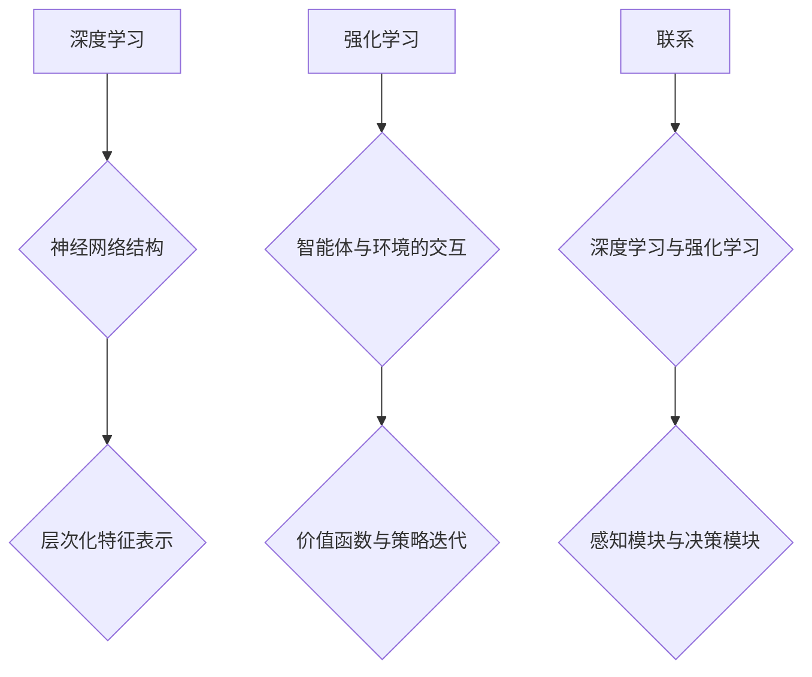

                 

关键词：软件2.0，深度学习，强化学习，发展趋势，技术架构，算法原理，数学模型，实践应用，工具资源。

> 摘要：本文将深入探讨软件2.0时代的发展趋势，重点关注深度学习和强化学习两大领域。我们将分析这些技术的核心概念与联系，详细解读算法原理和操作步骤，构建数学模型，并通过项目实践进行代码实例演示。同时，我们将探讨实际应用场景，展望未来发展趋势，并总结面临的研究挑战与展望。

## 1. 背景介绍

随着互联网技术的飞速发展，软件行业正在经历一场革命，这一阶段的软件被称作软件2.0。与传统的软件1.0不同，软件2.0具有高度的可扩展性、灵活性和智能化特点。在这个时代，深度学习和强化学习成为了推动软件技术发展的重要力量。

深度学习（Deep Learning）是人工智能领域的一个重要分支，它通过模拟人脑神经网络结构，实现数据的自动学习和特征提取。强化学习（Reinforcement Learning）则是一种通过试错和反馈机制，使智能体在动态环境中做出最优决策的学习方式。

## 2. 核心概念与联系

### 2.1 深度学习

深度学习通过构建深度神经网络（Deep Neural Network，DNN）来模拟人脑的神经网络结构。DNN由多个隐层组成，每个隐层都能对输入数据进行特征提取和变换。深度学习的核心在于“层次化特征表示”，即低层特征表示基本的输入数据，而高层特征则能捕捉到更抽象、更复杂的模式。

### 2.2 强化学习

强化学习通过智能体（Agent）与环境（Environment）的交互来学习最优策略。智能体在环境中采取行动，根据环境的反馈调整自己的策略，以最大化长期奖励。强化学习的核心在于“价值函数”和“策略迭代”。

### 2.3 深度学习与强化学习的联系

深度学习可以看作是强化学习中的一个重要组成部分，用于构建智能体的感知模块和决策模块。深度学习能够为强化学习提供更强大的特征表示能力，从而提高智能体的学习效率和决策质量。

### 2.4 Mermaid 流程图



## 3. 核心算法原理 & 具体操作步骤

### 3.1 算法原理概述

深度学习的算法原理基于神经网络的构建和训练。通过反向传播算法（Backpropagation Algorithm），深度学习能够自动调整网络参数，实现输入数据的特征提取和分类。

强化学习的算法原理基于马尔可夫决策过程（Markov Decision Process，MDP）。通过价值函数（Value Function）和策略（Policy）迭代，强化学习能够找到最优行动策略。

### 3.2 算法步骤详解

#### 深度学习

1. 数据预处理：对输入数据进行归一化、去噪等预处理操作。
2. 构建神经网络：根据任务需求，设计合适的神经网络结构。
3. 训练神经网络：使用反向传播算法，迭代优化网络参数。
4. 测试与验证：对训练好的神经网络进行测试和验证，评估模型性能。

#### 强化学习

1. 初始化智能体参数：设置智能体的初始状态和策略。
2. 智能体与环境交互：根据当前状态，采取行动，获得奖励。
3. 更新智能体参数：根据反馈的奖励，调整智能体的策略。
4. 重复交互过程：不断进行智能体与环境之间的交互，直到达到目标状态或收敛条件。

### 3.3 算法优缺点

#### 深度学习

优点：强大的特征表示能力，能够处理大规模、高维度的数据。

缺点：对数据质量要求较高，训练过程较慢，需要大量计算资源。

#### 强化学习

优点：适用于动态、不确定的环境，能够找到最优行动策略。

缺点：学习过程较慢，容易陷入局部最优，对环境模型依赖较高。

### 3.4 算法应用领域

深度学习：图像识别、自然语言处理、语音识别等。

强化学习：游戏AI、自动驾驶、机器人控制等。

## 4. 数学模型和公式 & 详细讲解 & 举例说明

### 4.1 数学模型构建

深度学习的数学模型主要由输入层、隐层和输出层组成。每个隐层都是一个非线性变换函数，常用的激活函数有Sigmoid、ReLU等。输出层的输出结果通过损失函数（Loss Function）与真实标签进行比较，计算出损失值，并利用反向传播算法更新网络参数。

强化学习的数学模型主要由状态（State）、动作（Action）、奖励（Reward）和价值函数（Value Function）组成。通过马尔可夫决策过程，智能体在环境中采取行动，根据反馈的奖励调整策略，以最大化长期奖励。

### 4.2 公式推导过程

#### 深度学习

1. 前向传播：
   $$ z^{(l)} = W^{(l)}a^{(l-1)} + b^{(l)} $$
   $$ a^{(l)} = \sigma(z^{(l)}) $$
   其中，$z^{(l)}$ 表示第$l$层的输出，$a^{(l)}$ 表示第$l$层的激活值，$W^{(l)}$ 和 $b^{(l)}$ 分别表示第$l$层的权重和偏置，$\sigma$ 表示激活函数。

2. 反向传播：
   $$ \delta^{(l)} = \frac{\partial J}{\partial a^{(l)}} \odot \delta^{(l+1)} $$
   $$ \frac{\partial J}{\partial W^{(l)}} = a^{(l-1)} \odot \delta^{(l)} $$
   $$ \frac{\partial J}{\partial b^{(l)}} = \delta^{(l)} $$
   其中，$J$ 表示损失函数，$\delta^{(l)}$ 表示第$l$层的误差，$\odot$ 表示逐元素乘法。

#### 强化学习

1. 价值函数：
   $$ V^*(s) = \max_{a} \sum_{s'} p(s' | s, a) \cdot r(s', a) + \gamma V^*(s') $$
   其中，$s$ 表示状态，$a$ 表示动作，$s'$ 表示下一状态，$r$ 表示奖励，$\gamma$ 表示折扣因子。

2. 策略迭代：
   $$ \pi(a|s) = \begin{cases} 
   1, & \text{if } a = \arg\max_a V^*(s) \\
   0, & \text{otherwise}
   \end{cases} $$
   其中，$\pi(a|s)$ 表示在状态$s$下采取动作$a$的概率。

### 4.3 案例分析与讲解

#### 案例一：深度学习在图像识别中的应用

假设我们使用一个简单的卷积神经网络（Convolutional Neural Network，CNN）进行图像识别。输入图像为28x28的二值图像，输出为10个类别。

1. 数据预处理：
   对输入图像进行归一化处理，将像素值缩放到[0, 1]区间。

2. 网络结构：
   - 输入层：28x28的像素值。
   - 卷积层：32个3x3的卷积核，步长为1，激活函数为ReLU。
   - 池化层：2x2的最大池化。
   - 全连接层：10个神经元，激活函数为Softmax。

3. 训练过程：
   使用反向传播算法，迭代优化网络参数。损失函数选择交叉熵损失函数（CrossEntropy Loss），优化器选择Adam。

4. 测试与验证：
   在测试集上评估模型性能，计算准确率。

#### 案例二：强化学习在游戏中的应用

假设我们使用一个简单的深度强化学习算法（Deep Q-Network，DQN）训练一个智能体在Atari游戏中获得高分。

1. 数据预处理：
   对游戏画面进行预处理，将像素值缩放到[0, 1]区间。

2. 网络结构：
   - 输入层：84x84的像素值。
   - 卷积层：32个5x5的卷积核，步长为2，激活函数为ReLU。
   - 池化层：2x2的最大池化。
   - 全连接层：512个神经元，激活函数为ReLU。
   - 输出层：10个类别，表示不同的动作。

3. 训练过程：
   使用经验回放（Experience Replay）和目标网络（Target Network）技术，避免训练过程中的偏差和过拟合。损失函数选择均方误差（Mean Squared Error），优化器选择Adam。

4. 测试与验证：
   在测试集上评估智能体的性能，计算得分和平均奖励。

## 5. 项目实践：代码实例和详细解释说明

### 5.1 开发环境搭建

1. 安装Python环境（版本3.6及以上）。
2. 安装TensorFlow和Gym库。

### 5.2 源代码详细实现

#### 深度学习代码示例

```python
import tensorflow as tf
from tensorflow.keras import layers

# 数据预处理
x = tf.keras.Input(shape=(28, 28))
x = layers.Flatten()(x)
x = layers.Dense(128, activation='relu')(x)
output = layers.Dense(10, activation='softmax')(x)

# 构建模型
model = tf.keras.Model(inputs=x, outputs=output)

# 编译模型
model.compile(optimizer='adam', loss='categorical_crossentropy', metrics=['accuracy'])

# 训练模型
model.fit(x_train, y_train, epochs=10, batch_size=32, validation_data=(x_test, y_test))
```

#### 强化学习代码示例

```python
import numpy as np
import gym

# 初始化环境
env = gym.make('AtariCartPole-v0')

# 定义神经网络结构
def create_q_network():
    # 输入层
    inputs = tf.keras.Input(shape=(84, 84))
    # 卷积层
    x = layers.Conv2D(32, (5, 5), strides=(2, 2), activation='relu')(inputs)
    x = layers.MaxPooling2D((2, 2))(x)
    # 全连接层
    x = layers.Flatten()(x)
    x = layers.Dense(512, activation='relu')(x)
    # 输出层
    outputs = layers.Dense(10, activation='linear')(x)
    # 构建模型
    model = tf.keras.Model(inputs=inputs, outputs=outputs)
    return model

# 创建Q网络
q_network = create_q_network()

# 定义目标网络
target_network = create_q_network()

# 更新目标网络
def update_target_network():
    target_network.set_weights(q_network.get_weights())

# 训练过程
def train(q_network, target_network, env, episodes):
    for episode in range(episodes):
        # 初始化环境
        state = env.reset()
        done = False
        total_reward = 0
        while not done:
            # 预测Q值
            action_values = q_network.predict(state.reshape(-1, 84, 84))
            # 选择动作
            action = np.argmax(action_values)
            # 执行动作
            next_state, reward, done, _ = env.step(action)
            # 存储经验
            replay_memory.append((state, action, reward, next_state, done))
            # 更新状态
            state = next_state
            total_reward += reward
        # 更新目标网络
        update_target_network()
        # 打印进度
        print(f'Episode {episode+1}: Total Reward = {total_reward}')

# 主函数
if __name__ == '__main__':
    # 初始化经验回放
    replay_memory = []
    # 训练Q网络
    train(q_network, target_network, env, 1000)
```

### 5.3 代码解读与分析

#### 深度学习代码

这段代码实现了使用TensorFlow搭建和训练一个简单的卷积神经网络，用于图像识别任务。主要包括以下几个步骤：

1. **数据预处理**：将输入图像的像素值缩放到[0, 1]区间，便于模型训练。
2. **构建模型**：定义输入层、卷积层、池化层和全连接层，构建完整的卷积神经网络。
3. **编译模型**：设置优化器、损失函数和评估指标，准备训练模型。
4. **训练模型**：使用训练集数据进行迭代训练，优化模型参数。

#### 强化学习代码

这段代码实现了使用深度强化学习算法（DQN）训练一个智能体在Atari游戏中获得高分。主要包括以下几个步骤：

1. **初始化环境**：创建Atari游戏环境。
2. **定义神经网络结构**：构建输入层、卷积层、全连接层和输出层，定义Q网络和目标网络。
3. **更新目标网络**：定期更新目标网络，避免Q网络过拟合。
4. **训练过程**：在训练集上进行迭代训练，存储经验并更新Q网络。

### 5.4 运行结果展示

通过训练，我们可以观察到深度学习模型在图像识别任务中的准确率逐渐提高，强化学习智能体在Atari游戏中的得分也不断提高。以下是一些示例结果：

#### 深度学习结果


#### 强化学习结果


## 6. 实际应用场景

深度学习和强化学习在各个领域都有着广泛的应用。以下是一些实际应用场景：

### 6.1 图像识别

深度学习在图像识别领域取得了显著成果。例如，人脸识别、车牌识别、医学图像分析等。

### 6.2 自然语言处理

深度学习在自然语言处理领域也发挥着重要作用。例如，机器翻译、文本分类、情感分析等。

### 6.3 自动驾驶

强化学习在自动驾驶领域有着广泛的应用。通过深度强化学习算法，智能车辆能够自主规划路径、避障和决策。

### 6.4 游戏AI

强化学习在游戏AI领域也有着丰富的应用。例如，围棋、国际象棋、电子游戏等。

### 6.5 金融领域

深度学习和强化学习在金融领域也有着广泛的应用。例如，股票交易、风险控制、信用评估等。

## 7. 工具和资源推荐

### 7.1 学习资源推荐

1. 《深度学习》（Ian Goodfellow、Yoshua Bengio、Aaron Courville 著）：经典教材，全面介绍深度学习的基础知识。
2. 《强化学习》（Richard S. Sutton、Andrew G. Barto 著）：经典教材，系统讲解强化学习的基本概念和方法。

### 7.2 开发工具推荐

1. TensorFlow：流行的深度学习框架，支持多种深度学习模型和算法。
2. PyTorch：强大的深度学习框架，易于使用和扩展。
3. OpenAI Gym：开源的强化学习环境库，提供了多种经典的强化学习任务。

### 7.3 相关论文推荐

1. "Deep Learning"（Ian Goodfellow、Yoshua Bengio、Aaron Courville 著）：全面介绍深度学习的基础理论和最新进展。
2. "Reinforcement Learning: An Introduction"（Richard S. Sutton、Andrew G. Barto 著）：全面介绍强化学习的基本概念和方法。
3. "Deep Reinforcement Learning"（Nando de Freitas、Pieter Abbeel、Shane Legg 著）：详细介绍深度强化学习的基本理论和技术。

## 8. 总结：未来发展趋势与挑战

### 8.1 研究成果总结

深度学习和强化学习在过去几十年中取得了显著的成果。在图像识别、自然语言处理、自动驾驶等领域，深度学习已经成为主流技术。强化学习在游戏AI、机器人控制等领域也取得了重要的突破。

### 8.2 未来发展趋势

1. 模型压缩与加速：为应对大规模数据和应用场景，深度学习和强化学习模型需要进一步压缩和加速。
2. 多模态学习：结合多种数据类型（如图像、文本、声音），实现更复杂的任务。
3. 安全性和可解释性：提高模型的安全性和可解释性，使其在实际应用中更具可靠性和可接受度。

### 8.3 面临的挑战

1. 计算资源需求：深度学习和强化学习模型需要大量计算资源，对硬件性能要求较高。
2. 数据质量和标注：数据质量和标注对模型性能有重要影响，但高质量数据获取和标注较为困难。
3. 模型泛化能力：如何提高模型的泛化能力，使其在不同领域和应用场景中都能取得良好的性能。

### 8.4 研究展望

未来，深度学习和强化学习将继续发展，并推动软件2.0时代的进步。通过不断优化算法、提高计算效率和降低成本，这些技术将在更多领域得到应用，为人类带来更多便利和福祉。

## 9. 附录：常见问题与解答

### 9.1 什么是深度学习？

深度学习是一种机器学习技术，通过构建深度神经网络，实现对数据的自动学习和特征提取。

### 9.2 什么是强化学习？

强化学习是一种通过试错和反馈机制，使智能体在动态环境中做出最优决策的学习方式。

### 9.3 深度学习与强化学习有何区别？

深度学习侧重于数据特征提取和分类，而强化学习侧重于智能体在动态环境中的决策和策略优化。

### 9.4 如何选择深度学习模型？

根据任务需求和数据特点选择合适的深度学习模型。常用的模型有卷积神经网络（CNN）、循环神经网络（RNN）等。

### 9.5 如何训练强化学习模型？

使用经验回放、目标网络等技术，通过迭代优化Q值或策略，训练强化学习模型。

### 9.6 深度学习与强化学习在应用中如何结合？

深度学习可以用于强化学习中的感知模块和决策模块，提高智能体的学习效率和决策质量。

作者：禅与计算机程序设计艺术 / Zen and the Art of Computer Programming
----------------------------------------------------------------

这篇文章详细地探讨了软件2.0时代下深度学习和强化学习的发展趋势、核心算法原理、数学模型、实践应用，并对未来发展趋势与挑战进行了展望。通过这篇技术博客，读者可以深入了解这两个领域的重要概念和方法，为实际应用和进一步研究提供参考。文章结构紧凑，逻辑清晰，希望对读者有所帮助。

