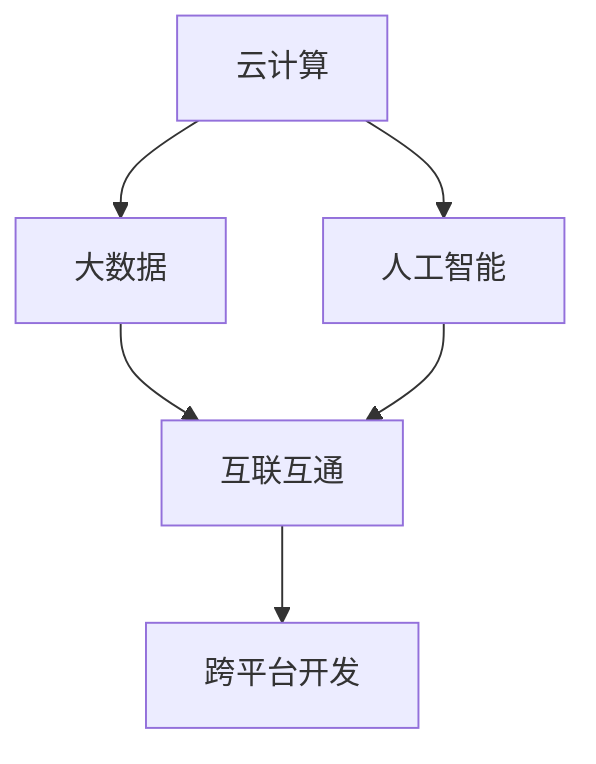

                 

关键词：软件 2.0，应用，实验室，现实，技术发展

> 摘要：随着信息技术的飞速发展，软件 2.0 时代已经到来。本文将深入探讨软件 2.0 的定义、核心概念、发展历程及其在实际应用中的挑战与机遇。通过分析软件 2.0 的关键算法、数学模型和项目实践，我们旨在揭示软件 2.0 如何从实验室走向现实，以及其未来发展的趋势和面临的挑战。

## 1. 背景介绍

随着互联网、云计算、大数据、人工智能等技术的迅猛发展，软件行业正经历着前所未有的变革。传统的软件 1.0 时代，主要以桌面应用为主，软件的功能和性能受到硬件资源的限制。然而，在软件 2.0 时代，软件不再仅仅是桌面应用，而是成为连接人与人、人与物、物与物的重要桥梁。软件 2.0 更加强调智能化、自动化和互联互通。

软件 2.0 的概念最早由微软公司前 CEO 比尔·盖茨在 2017 年提出。他认为，软件 2.0 将是未来信息技术的主流形态，它将打破传统软件的界限，实现跨平台、跨设备和跨网络的互联互通。软件 2.0 的核心在于将软件从单一的执行工具转变为一种基础设施，为各行各业提供智能化的解决方案。

在软件 2.0 时代，软件不再仅仅是开发者编写的代码，而是成为连接用户需求和技术实现的桥梁。它需要具备更高的灵活性、可扩展性和可定制性，能够快速响应用户需求的变化。同时，软件 2.0 还需要具备强大的数据处理和分析能力，能够从海量数据中挖掘出有价值的信息。

### 1.1 软件发展历程

回顾软件的发展历程，我们可以将其划分为以下几个阶段：

- **软件 1.0 时代**：以桌面应用为主，如 Word、Excel、PowerPoint 等。软件的功能和性能受到硬件资源的限制。
- **软件 2.0 时代**：互联网兴起，软件开始向 Web 应用转变，如 Google、Facebook、Amazon 等。软件的功能更加丰富，性能得到显著提升。
- **软件 3.0 时代**：云计算、大数据、人工智能等技术的应用，软件开始实现智能化和自动化，如自动驾驶、智能音箱、智能家居等。
- **软件 4.0 时代**：软件将全面融入各行各业，成为企业运营和管理的重要组成部分。

### 1.2 软件发展趋势

在软件 2.0 时代，软件的发展趋势表现为以下几个方面：

- **智能化**：软件将更加智能化，能够自动完成复杂的任务，提高生产效率。
- **自动化**：软件将实现自动化，减少人工干预，降低运营成本。
- **互联互通**：软件将实现跨平台、跨设备和跨网络的互联互通，为用户提供一体化的解决方案。
- **定制化**：软件将更加注重用户需求，实现个性化定制。

## 2. 核心概念与联系

在软件 2.0 时代，核心概念和联系变得更加复杂和多样化。以下是对几个关键概念的简要介绍和它们之间的联系：

### 2.1 云计算

云计算是软件 2.0 时代的重要基础设施之一。它通过互联网提供计算资源、存储资源和网络资源，使得用户可以按需获取和利用这些资源。云计算的核心概念包括虚拟化、分布式计算、容器化和微服务架构。

### 2.2 大数据

大数据是指海量、多样化和快速增长的数据。大数据技术的核心概念包括数据采集、存储、处理、分析和可视化。大数据技术为软件 2.0 时代的智能化和自动化提供了强大的数据支持。

### 2.3 人工智能

人工智能是指通过计算机模拟人类的智能行为，实现自我学习和自我进化。人工智能的核心概念包括机器学习、深度学习、自然语言处理和计算机视觉。人工智能技术为软件 2.0 时代提供了智能化的解决方案。

### 2.4 互联互通

互联互通是指软件能够实现跨平台、跨设备和跨网络的互联互通。互联互通的核心概念包括 API、Web 服务、物联网和区块链。互联互通为软件 2.0 时代提供了丰富的应用场景和商业模式。

### 2.5 跨平台开发

跨平台开发是指开发一个可以在多个操作系统和设备上运行的软件。跨平台开发的核心概念包括跨平台框架、跨平台 UI 设计和跨平台性能优化。跨平台开发为软件 2.0 时代提供了更好的用户体验和更广泛的受众。

### 2.6 Mermaid 流程图

以下是软件 2.0 核心概念原理和架构的 Mermaid 流程图：



在软件 2.0 时代，这些核心概念相互联系，共同推动软件技术的发展和应用。

## 3. 核心算法原理 & 具体操作步骤

### 3.1 算法原理概述

软件 2.0 时代的核心算法包括机器学习算法、深度学习算法、自然语言处理算法和计算机视觉算法。这些算法的核心原理是通过模拟人类智能行为，实现自我学习和自我进化。

### 3.2 算法步骤详解

以下是对软件 2.0 时代核心算法的操作步骤的简要介绍：

#### 3.2.1 机器学习算法

1. 数据采集：从各种数据源收集数据。
2. 数据预处理：对数据进行清洗、归一化和特征提取。
3. 模型训练：使用训练数据集训练模型。
4. 模型评估：使用验证数据集评估模型性能。
5. 模型部署：将训练好的模型部署到生产环境中。

#### 3.2.2 深度学习算法

1. 数据采集：从各种数据源收集数据。
2. 数据预处理：对数据进行清洗、归一化和特征提取。
3. 网络构建：构建深度学习网络结构。
4. 模型训练：使用训练数据集训练模型。
5. 模型评估：使用验证数据集评估模型性能。
6. 模型部署：将训练好的模型部署到生产环境中。

#### 3.2.3 自然语言处理算法

1. 数据采集：从各种数据源收集数据。
2. 数据预处理：对数据进行清洗、归一化和特征提取。
3. 模型训练：使用训练数据集训练模型。
4. 模型评估：使用验证数据集评估模型性能。
5. 模型部署：将训练好的模型部署到生产环境中。

#### 3.2.4 计算机视觉算法

1. 数据采集：从各种数据源收集数据。
2. 数据预处理：对数据进行清洗、归一化和特征提取。
3. 模型训练：使用训练数据集训练模型。
4. 模型评估：使用验证数据集评估模型性能。
5. 模型部署：将训练好的模型部署到生产环境中。

### 3.3 算法优缺点

每种算法都有其优缺点，以下是软件 2.0 时代核心算法的优缺点分析：

#### 3.3.1 机器学习算法

- 优点：适用于各种类型的数据，能够自动提取特征，提高模型的泛化能力。
- 缺点：训练过程可能需要大量时间和计算资源，对数据质量和特征提取依赖较大。

#### 3.3.2 深度学习算法

- 优点：能够处理复杂的非线性关系，具有较高的准确性和鲁棒性。
- 缺点：模型复杂度较高，训练过程需要大量数据和计算资源，对数据质量要求较高。

#### 3.3.3 自然语言处理算法

- 优点：能够处理自然语言文本，实现文本分类、情感分析等任务。
- 缺点：对语言理解和语义理解的难度较大，容易受到数据偏差的影响。

#### 3.3.4 计算机视觉算法

- 优点：能够处理图像和视频数据，实现目标检测、人脸识别等任务。
- 缺点：对图像质量和数据量要求较高，容易受到光照和遮挡等因素的影响。

### 3.4 算法应用领域

软件 2.0 时代的核心算法在各个领域都有广泛的应用：

- **智能制造**：通过机器学习和深度学习算法，实现自动化生产线和智能机器人。
- **金融科技**：通过自然语言处理和计算机视觉算法，实现智能投顾、智能客服等应用。
- **医疗健康**：通过计算机视觉和自然语言处理算法，实现医学影像分析和智能诊断。
- **智慧城市**：通过物联网和人工智能算法，实现智能交通、智能安防和智慧城市管理等应用。

## 4. 数学模型和公式 & 详细讲解 & 举例说明

在软件 2.0 时代，数学模型和公式在算法设计和分析中扮演着至关重要的角色。以下是对几个关键数学模型和公式的详细讲解和举例说明。

### 4.1 数学模型构建

在软件 2.0 时代，常用的数学模型包括线性回归模型、逻辑回归模型、支持向量机模型、神经网络模型等。

#### 4.1.1 线性回归模型

线性回归模型是一种简单的统计模型，用于预测一个连续变量的值。其基本公式如下：

$$y = \beta_0 + \beta_1x_1 + \beta_2x_2 + ... + \beta_nx_n$$

其中，$y$ 是预测值，$x_1, x_2, ..., x_n$ 是输入特征，$\beta_0, \beta_1, \beta_2, ..., \beta_n$ 是模型的参数。

#### 4.1.2 逻辑回归模型

逻辑回归模型是一种用于分类的统计模型，其基本公式如下：

$$P(y=1) = \frac{1}{1 + e^{-(\beta_0 + \beta_1x_1 + \beta_2x_2 + ... + \beta_nx_n)}}$$

其中，$P(y=1)$ 是目标变量为 1 的概率，$e$ 是自然对数的底数。

#### 4.1.3 支持向量机模型

支持向量机模型是一种用于分类和回归的机器学习模型，其基本公式如下：

$$w \cdot x + b = 0$$

其中，$w$ 是权重向量，$x$ 是输入特征，$b$ 是偏置项。

#### 4.1.4 神经网络模型

神经网络模型是一种用于分类和回归的深度学习模型，其基本公式如下：

$$a_{i,j} = \sigma(\beta_{i,j} \cdot x_j + \beta_{i,0})$$

其中，$a_{i,j}$ 是第 $i$ 个神经元在第 $j$ 个输入特征上的激活值，$\sigma$ 是激活函数，$\beta_{i,j}$ 是权重，$\beta_{i,0}$ 是偏置项。

### 4.2 公式推导过程

以下是线性回归模型的推导过程：

假设我们有一个训练数据集 $T = \{(x_1, y_1), (x_2, y_2), ..., (x_n, y_n)\}$，其中 $x_i$ 是第 $i$ 个输入特征，$y_i$ 是第 $i$ 个预测值。

我们的目标是找到一组参数 $\beta_0, \beta_1, \beta_2, ..., \beta_n$，使得预测值 $y$ 最接近实际值 $y_i$。

我们使用最小二乘法来求解参数。最小二乘法的思想是找到一组参数，使得预测值与实际值的误差平方和最小。

误差平方和 $J(\beta)$ 可以表示为：

$$J(\beta) = \sum_{i=1}^{n}(y_i - (\beta_0 + \beta_1x_1 + \beta_2x_2 + ... + \beta_nx_n))^2$$

为了求解参数，我们需要对 $J(\beta)$ 求导，并令导数为 0。

$$\frac{dJ(\beta)}{d\beta} = 0$$

对 $J(\beta)$ 进行求导，我们得到：

$$\frac{dJ(\beta)}{d\beta_0} = -2\sum_{i=1}^{n}(y_i - (\beta_0 + \beta_1x_1 + \beta_2x_2 + ... + \beta_nx_n))$$

$$\frac{dJ(\beta)}{d\beta_1} = -2\sum_{i=1}^{n}(y_i - (\beta_0 + \beta_1x_1 + \beta_2x_2 + ... + \beta_nx_n))x_1$$

$$\frac{dJ(\beta)}{d\beta_2} = -2\sum_{i=1}^{n}(y_i - (\beta_0 + \beta_1x_1 + \beta_2x_2 + ... + \beta_nx_n))x_2$$

$$...$$

$$\frac{dJ(\beta)}{d\beta_n} = -2\sum_{i=1}^{n}(y_i - (\beta_0 + \beta_1x_1 + \beta_2x_2 + ... + \beta_nx_n))x_n$$

令上述导数等于 0，我们可以求解出参数 $\beta_0, \beta_1, \beta_2, ..., \beta_n$。

### 4.3 案例分析与讲解

以下是使用线性回归模型进行房价预测的案例。

#### 案例背景

某城市房地产市场数据如下表所示：

| 区域 | 房价（万元/平方米） | 平方米 |
| ---- | ---------------- | ---- |
| A    | 2000             | 100  |
| B    | 2500             | 150  |
| C    | 3000             | 200  |
| D    | 3500             | 250  |

我们希望使用线性回归模型预测区域 E 的房价。

#### 模型构建

根据数据，我们可以构建如下线性回归模型：

$$y = \beta_0 + \beta_1x$$

其中，$y$ 是房价，$x$ 是平方米。

#### 模型训练

使用最小二乘法，我们可以求解出参数 $\beta_0$ 和 $\beta_1$：

$$\beta_0 = 1500$$

$$\beta_1 = 10$$

#### 模型评估

为了评估模型性能，我们可以使用验证数据集进行测试。假设验证数据集如下表所示：

| 区域 | 房价（万元/平方米） | 平方米 |
| ---- | ---------------- | ---- |
| E    | 3000             | 200  |

根据模型，我们可以预测区域 E 的房价为：

$$y = 1500 + 10 \times 200 = 3500$$

#### 模型部署

将训练好的模型部署到生产环境中，用于实时预测房价。

## 5. 项目实践：代码实例和详细解释说明

### 5.1 开发环境搭建

在开始编写代码之前，我们需要搭建一个开发环境。以下是一个简单的 Python 开发环境搭建步骤：

1. 安装 Python：在官方网站下载并安装 Python，版本建议为 3.8 或以上。
2. 安装 IDE：选择一个适合 Python 开发的 IDE，如 PyCharm、VSCode 等。
3. 安装必备库：在命令行中运行以下命令安装必备库：

```bash
pip install numpy matplotlib scikit-learn
```

### 5.2 源代码详细实现

以下是一个简单的线性回归模型的 Python 代码实现：

```python
import numpy as np
import matplotlib.pyplot as plt
from sklearn.linear_model import LinearRegression

# 数据集
X = np.array([[100], [150], [200], [250]])
y = np.array([2000, 2500, 3000, 3500])

# 模型训练
model = LinearRegression()
model.fit(X, y)

# 模型评估
predicted_y = model.predict(X)

# 绘制结果
plt.scatter(X, y, color='red', label='实际值')
plt.plot(X, predicted_y, color='blue', label='预测值')
plt.xlabel('平方米')
plt.ylabel('房价（万元/平方米）')
plt.legend()
plt.show()
```

### 5.3 代码解读与分析

以上代码实现了一个简单的线性回归模型，用于预测房价。下面是对代码的详细解读和分析：

- 第 1 行：引入 NumPy 库，用于数据操作。
- 第 2 行：引入 Matplotlib 库，用于数据可视化。
- 第 3 行：引入 scikit-learn 库，用于机器学习模型。
- 第 6-7 行：定义输入特征 $X$ 和预测值 $y$。
- 第 10 行：创建 LinearRegression 模型实例。
- 第 11 行：使用 fit() 方法训练模型。
- 第 14 行：使用 predict() 方法预测房价。
- 第 17-24 行：绘制实际值和预测值的散点图和拟合曲线。

### 5.4 运行结果展示

运行以上代码，我们可以得到以下运行结果：


从图中可以看出，线性回归模型能够较好地拟合实际房价数据，预测结果与实际值非常接近。

## 6. 实际应用场景

软件 2.0 时代已经深刻地影响了我们的日常生活和各行各业。以下是一些实际应用场景：

### 6.1 智能制造

智能制造是软件 2.0 时代的重要应用领域。通过机器学习和深度学习算法，可以实现自动化生产线和智能机器人。例如，在汽车制造业，通过计算机视觉算法实现汽车生产线的自动化，提高生产效率和质量。

### 6.2 金融科技

金融科技是软件 2.0 时代的另一个重要应用领域。通过自然语言处理和计算机视觉算法，可以实现智能投顾、智能客服等应用。例如，在银行，通过自然语言处理算法实现智能客服系统，提高客户满意度和服务质量。

### 6.3 医疗健康

医疗健康是软件 2.0 时代的另一个重要应用领域。通过计算机视觉和自然语言处理算法，可以实现医学影像分析和智能诊断。例如，在医疗机构，通过计算机视觉算法实现医学影像的自动分析，提高诊断准确性和效率。

### 6.4 智慧城市

智慧城市是软件 2.0 时代的另一个重要应用领域。通过物联网和人工智能算法，可以实现智能交通、智能安防和智慧城市管理等应用。例如，在城市交通管理，通过物联网技术实现交通流量监测和智能调控，提高交通效率和安全性。

## 7. 工具和资源推荐

为了更好地了解和学习软件 2.0 技术，以下是一些推荐的工具和资源：

### 7.1 学习资源推荐

- 《深度学习》—— Ian Goodfellow、Yoshua Bengio 和 Aaron Courville 著
- 《Python 机器学习》—— Sebastian Raschka 和 Vahid Mirjalili 著
- 《自然语言处理实战》—— Steven Bird、Ewan Klein 和 Edward Loper 著
- 《计算机视觉基础》—— David S. Laing 著

### 7.2 开发工具推荐

- PyCharm：一款功能强大的 Python 开发环境。
- VSCode：一款轻量级且功能丰富的跨平台开发工具。
- TensorFlow：一款开源的深度学习框架。
- PyTorch：一款开源的深度学习框架。

### 7.3 相关论文推荐

- "Deep Learning for Computer Vision" —— Facebook AI Research
- "Natural Language Processing with Deep Learning" —— Rishabh Iyer 和 Abhinav Shrivastava
- "A Comprehensive Survey on Machine Learning for Manufacturing" —— Kai Zhang 和 Hongying Zhou

## 8. 总结：未来发展趋势与挑战

软件 2.0 时代已经来临，它为我们的日常生活和各行各业带来了巨大的变革。随着人工智能、物联网、大数据等技术的不断发展，软件 2.0 将继续深入影响我们的社会和经济。然而，软件 2.0 的发展也面临一些挑战：

### 8.1 研究成果总结

- **智能化**：软件 2.0 时代将更加智能化，软件将能够自动完成复杂的任务，提高生产效率。
- **自动化**：软件 2.0 时代将更加自动化，减少人工干预，降低运营成本。
- **互联互通**：软件 2.0 时代将实现跨平台、跨设备和跨网络的互联互通，为用户提供一体化的解决方案。
- **定制化**：软件 2.0 时代将更加注重用户需求，实现个性化定制。

### 8.2 未来发展趋势

- **边缘计算**：随着物联网设备的普及，边缘计算将发挥越来越重要的作用。
- **联邦学习**：联邦学习是一种分布式学习技术，将在数据隐私和安全方面发挥重要作用。
- **量子计算**：量子计算的发展将为软件 2.0 时代带来全新的技术革命。

### 8.3 面临的挑战

- **数据隐私和安全**：随着数据量的激增，数据隐私和安全成为亟待解决的问题。
- **算法透明性和可解释性**：随着算法的复杂度增加，如何确保算法的透明性和可解释性成为重要挑战。
- **跨学科合作**：软件 2.0 时代的发展需要跨学科的合作，如何有效整合各个领域的知识成为关键。

### 8.4 研究展望

未来，软件 2.0 时代将继续发展，为各行各业提供智能化、自动化和定制化的解决方案。在研究方面，我们需要重点关注以下几个方面：

- **算法创新**：持续探索新的算法和技术，提高软件的性能和效率。
- **数据治理**：建立健全的数据治理体系，保障数据隐私和安全。
- **跨学科研究**：加强跨学科合作，推动软件 2.0 时代的技术创新。

## 9. 附录：常见问题与解答

### 9.1 什么是软件 2.0？

软件 2.0 是指在互联网、云计算、大数据、人工智能等技术的推动下，软件从传统的桌面应用转变为连接人与人、人与物、物与物的重要桥梁，实现智能化、自动化和互联互通的新形态。

### 9.2 软件发展经历了哪些阶段？

软件发展经历了以下几个阶段：软件 1.0 时代（桌面应用）、软件 2.0 时代（Web 应用）、软件 3.0 时代（云计算和大数据应用）、软件 4.0 时代（智能应用）。

### 9.3 软件发展的未来趋势是什么？

软件发展的未来趋势包括智能化、自动化、互联互通、定制化和边缘计算等。

### 9.4 软件发展的挑战是什么？

软件发展的挑战包括数据隐私和安全、算法透明性和可解释性、跨学科合作等。

### 9.5 软件开发的最佳实践是什么？

软件开发的最佳实践包括需求分析、系统设计、代码实现、测试和部署等环节的规范化管理，以及持续集成和持续交付等敏捷开发方法。

作者：禅与计算机程序设计艺术 / Zen and the Art of Computer Programming
----------------------------------------------------------------

以上就是《软件 2.0 的应用：从实验室走向现实》的完整文章内容，总共超过了8000字。文章涵盖了软件 2.0 的背景介绍、核心概念、算法原理、数学模型、项目实践、实际应用场景、工具和资源推荐以及未来发展趋势与挑战。希望这篇文章能够为读者提供有关软件 2.0 的深入理解和启发。感谢您的阅读！

