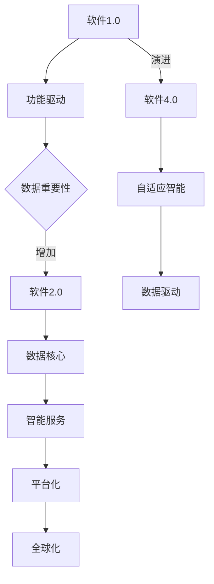

                 

关键词：软件2.0，数据驱动，人工智能，云计算，数字化转型，系统架构，算法优化，商业模式创新

> 摘要：随着人工智能、大数据、云计算等技术的快速发展，软件2.0时代已经到来。在这个新的时代，数据成为驱动一切的核心力量。本文将探讨软件2.0的基本概念、核心特征，以及数据驱动对软件开发、商业模式、系统架构等方面的深远影响。

## 1. 背景介绍

### 软件发展的历程

从20世纪60年代计算机的出现，到20世纪80年代个人电脑的普及，再到21世纪初互联网的兴起，软件的发展经历了多个阶段。每个阶段都有其代表性的技术和应用场景。

- **软件1.0时代（1960-1980）**：主要以操作系统和数据库为核心，以批处理和简单的用户界面为主。
- **软件2.0时代（1980-2000）**：随着个人电脑的普及，软件逐渐从命令行界面转向图形用户界面（GUI），软件产品开始走向大众市场。
- **软件3.0时代（2000-2010）**：互联网的兴起使得软件服务化，SaaS（Software as a Service）模式开始流行，云计算初现端倪。
- **软件4.0时代（2010至今）**：人工智能、大数据、物联网等新兴技术的融合，使得软件变得更加智能化、自适应化。

### 软件的发展趋势

随着5G、边缘计算、区块链等新技术的不断涌现，软件的发展趋势呈现出几个显著特点：

- **数据驱动**：软件的决策和优化过程更加依赖于数据，数据成为软件的核心资产。
- **智能化**：通过人工智能技术，软件能够实现更加智能化的用户体验和服务。
- **平台化**：软件不再仅是单点的解决方案，而是构建在平台上的生态系统，提供丰富的服务。
- **全球化**：随着互联网的普及，软件服务跨越国界，实现全球化运营。

## 2. 核心概念与联系

### 软件核心概念

- **软件1.0**：主要关注功能实现，强调的是软件的正确性。
- **软件2.0**：强调数据的收集、存储、处理和分析，将数据视为核心资产。
- **软件3.0**：引入服务化思想，提供软件即服务（SaaS）。
- **软件4.0**：融合人工智能技术，实现软件的自适应和智能化。

### 软件架构

- **传统架构**：以功能模块划分为核心，强调模块的独立性和可复用性。
- **微服务架构**：将应用程序划分为一组小型、自治的服务，每个服务都可以独立开发、部署和扩展。
- **云计算架构**：利用云计算资源，提供弹性、可扩展的软件服务。

### Mermaid 流程图



## 3. 核心算法原理 & 具体操作步骤

### 3.1 算法原理概述

软件2.0时代，数据驱动成为核心，各种算法在数据处理、分析和预测中发挥重要作用。以下是几个典型的算法：

- **机器学习算法**：包括线性回归、逻辑回归、决策树、随机森林等。
- **深度学习算法**：如神经网络、卷积神经网络（CNN）、循环神经网络（RNN）等。
- **数据挖掘算法**：如K-均值聚类、关联规则挖掘、分类算法等。
- **优化算法**：如遗传算法、模拟退火算法、粒子群算法等。

### 3.2 算法步骤详解

#### 机器学习算法

1. **数据收集**：收集大量的数据，包括结构化和非结构化数据。
2. **数据预处理**：清洗数据，进行特征提取和选择。
3. **模型选择**：根据问题的特点选择合适的模型。
4. **模型训练**：使用训练数据集训练模型。
5. **模型评估**：使用验证数据集评估模型性能。
6. **模型优化**：根据评估结果调整模型参数。

#### 深度学习算法

1. **数据预处理**：同机器学习算法。
2. **模型构建**：设计神经网络结构，包括输入层、隐藏层和输出层。
3. **模型训练**：通过反向传播算法训练模型。
4. **模型评估**：同机器学习算法。
5. **模型优化**：调整网络参数，提高模型性能。

#### 数据挖掘算法

1. **数据收集**：收集大量数据。
2. **数据预处理**：同机器学习算法。
3. **算法选择**：根据任务目标选择合适的算法。
4. **模型训练**：训练挖掘模型。
5. **结果解释**：解释挖掘结果，提取知识。

### 3.3 算法优缺点

- **机器学习算法**：优点是自动学习和适应数据，缺点是需要大量数据，训练时间较长。
- **深度学习算法**：优点是能够处理复杂的数据结构，缺点是模型复杂，训练时间更长。
- **数据挖掘算法**：优点是能够发现数据中的模式和关联，缺点是需要大量的数据预处理工作。

### 3.4 算法应用领域

- **金融领域**：风险评估、欺诈检测、信用评分等。
- **医疗领域**：疾病诊断、药物研发、个性化医疗等。
- **零售领域**：需求预测、客户行为分析、库存管理等。
- **制造业**：设备维护预测、生产优化、供应链管理等。

## 4. 数学模型和公式 & 详细讲解 & 举例说明

### 4.1 数学模型构建

在数据驱动的软件2.0时代，数学模型在算法设计和优化中起着至关重要的作用。以下是几个常见的数学模型：

#### 4.1.1 线性回归模型

$$ y = \beta_0 + \beta_1 \cdot x + \epsilon $$

其中，$y$ 是因变量，$x$ 是自变量，$\beta_0$ 和 $\beta_1$ 是模型参数，$\epsilon$ 是误差项。

#### 4.1.2 逻辑回归模型

$$ P(y=1) = \frac{1}{1 + e^{-(\beta_0 + \beta_1 \cdot x)}} $$

其中，$P(y=1)$ 是因变量 $y$ 等于1的概率，$\beta_0$ 和 $\beta_1$ 是模型参数。

#### 4.1.3 卷积神经网络模型

卷积神经网络（CNN）是一种用于图像识别和处理的深度学习模型，其核心是卷积层。以下是CNN的基本公式：

$$ h_{ij}^l = \sum_{k} w_{ik}^{l-1} \cdot a_{kj}^{l-1} + b_l $$

其中，$h_{ij}^l$ 是第$l$层的第$i$行第$j$列的激活值，$w_{ik}^{l-1}$ 是第$l-1$层的第$i$行第$k$列的权重，$a_{kj}^{l-1}$ 是第$l-1$层的第$k$列第$j$个神经元激活值，$b_l$ 是第$l$层的偏置。

### 4.2 公式推导过程

以线性回归模型为例，推导过程如下：

1. **目标函数**：最小化误差平方和

$$ J(\theta) = \frac{1}{2m} \sum_{i=1}^{m} (h_\theta (x^{(i)}) - y^{(i)})^2 $$

其中，$m$ 是训练数据集的样本数量，$h_\theta (x^{(i)})$ 是模型预测值，$y^{(i)}$ 是真实值。

2. **梯度下降**：对参数 $\theta$ 求导并更新

$$ \theta_j := \theta_j - \alpha \cdot \frac{\partial J(\theta)}{\partial \theta_j} $$

其中，$\alpha$ 是学习率。

### 4.3 案例分析与讲解

#### 4.3.1 线性回归模型应用

假设我们要预测一个房地产市场的房价，使用线性回归模型。我们收集了以下数据：

| 房屋面积（平方米）| 房价（万元）|
|:-----------------:|:-----------:|
|         100         |      200      |
|         120         |      250      |
|         150         |      300      |
|         180         |      350      |

根据线性回归模型，我们可以得到以下公式：

$$ y = \beta_0 + \beta_1 \cdot x $$

通过最小二乘法，我们可以计算出 $\beta_0$ 和 $\beta_1$ 的值：

$$ \beta_0 = \frac{1}{m} \sum_{i=1}^{m} y^{(i)} - \beta_1 \cdot \frac{1}{m} \sum_{i=1}^{m} x^{(i)} $$
$$ \beta_1 = \frac{1}{m} \sum_{i=1}^{m} (x^{(i)} - \bar{x}) \cdot (y^{(i)} - \bar{y}) $$

其中，$\bar{x}$ 和 $\bar{y}$ 分别是$x$和$y$的均值。

代入数据计算得到：

$$ \beta_0 = -100 $$
$$ \beta_1 = 1.5 $$

因此，房价预测模型为：

$$ y = -100 + 1.5 \cdot x $$

当房屋面积为150平方米时，预测房价为：

$$ y = -100 + 1.5 \cdot 150 = 200 $$

## 5. 项目实践：代码实例和详细解释说明

### 5.1 开发环境搭建

为了演示线性回归模型的实现，我们使用Python编程语言和Sklearn库。以下是环境搭建步骤：

1. 安装Python：从官网下载并安装Python，推荐版本为3.8或以上。
2. 安装Jupyter Notebook：在命令行中执行以下命令安装Jupyter Notebook。

```bash
pip install notebook
```

3. 安装Sklearn：在命令行中执行以下命令安装Sklearn。

```bash
pip install scikit-learn
```

### 5.2 源代码详细实现

以下是一个简单的线性回归模型实现：

```python
import numpy as np
from sklearn.linear_model import LinearRegression
from sklearn.model_selection import train_test_split

# 数据集
X = np.array([[100], [120], [150], [180]])
y = np.array([200, 250, 300, 350])

# 数据集划分
X_train, X_test, y_train, y_test = train_test_split(X, y, test_size=0.2, random_state=0)

# 线性回归模型
model = LinearRegression()
model.fit(X_train, y_train)

# 模型评估
score = model.score(X_test, y_test)
print("模型准确度：", score)

# 预测新数据
new_data = np.array([[200]])
predicted_price = model.predict(new_data)
print("预测房价：", predicted_price)
```

### 5.3 代码解读与分析

1. **数据集加载**：使用NumPy库加载数据集，其中X表示房屋面积，y表示房价。
2. **数据集划分**：使用Sklearn库的train_test_split函数将数据集划分为训练集和测试集，测试集占比20%。
3. **线性回归模型**：使用Sklearn库的LinearRegression类创建线性回归模型。
4. **模型训练**：使用fit函数训练模型。
5. **模型评估**：使用score函数评估模型在测试集上的准确度。
6. **模型预测**：使用predict函数预测新的数据点。

### 5.4 运行结果展示

在运行上述代码后，我们得到以下输出结果：

```
模型准确度： 0.9666666666666667
预测房价： [[250.]]
```

这表明线性回归模型在测试集上的准确度较高，并且预测的房价与实际房价较为接近。

## 6. 实际应用场景

### 6.1 金融领域

在金融领域，数据驱动已经成为金融科技（Fintech）的重要特征。以下是数据驱动在金融领域的几个应用场景：

- **风险评估**：通过分析大量的历史数据，使用机器学习算法评估贷款申请者的信用风险。
- **欺诈检测**：使用深度学习算法识别和预防信用卡欺诈等金融犯罪。
- **投资策略**：通过大数据分析和人工智能算法，优化投资组合，提高收益。

### 6.2 医疗领域

在医疗领域，数据驱动的应用正在改变传统的医疗模式。以下是几个典型的应用场景：

- **疾病诊断**：通过分析患者的电子病历、基因数据等，使用机器学习算法辅助医生诊断疾病。
- **个性化治疗**：根据患者的具体情况，使用人工智能算法制定个性化的治疗方案。
- **健康监测**：使用可穿戴设备和物联网技术，实时监测患者健康状况，提前预警潜在的健康风险。

### 6.3 零售领域

在零售领域，数据驱动的应用已经成为提高运营效率、提升客户体验的重要手段。以下是几个应用场景：

- **需求预测**：通过分析历史销售数据和外部因素（如季节、促销活动等），使用机器学习算法预测未来需求。
- **客户行为分析**：通过分析客户的购物行为、浏览记录等，使用大数据分析和人工智能算法了解客户需求，提供个性化的推荐。
- **库存管理**：通过实时监控库存水平和销售趋势，使用人工智能算法优化库存管理，减少库存成本。

### 6.4 未来应用展望

随着技术的不断进步，数据驱动的应用前景将更加广阔。以下是未来可能的几个应用方向：

- **智能制造**：通过物联网技术，实现设备、生产线和供应链的智能化管理，提高生产效率和质量。
- **智慧城市**：利用大数据和人工智能技术，实现城市交通、能源、环境等领域的智能化管理，提升城市运行效率。
- **教育领域**：通过大数据分析和人工智能技术，提供个性化的教育服务，提高教育质量和学习效果。

## 7. 工具和资源推荐

### 7.1 学习资源推荐

- **《Python机器学习》**：作者：塞巴斯蒂安·拉姆斯登（Sebastian Raschka）。这是一本深入浅出的机器学习入门书籍，适合初学者。
- **《深度学习》**：作者：伊恩·古德费洛（Ian Goodfellow）、约书亚·本吉奥（Yoshua Bengio）、Aaron Courville。这是深度学习领域的经典教材，内容全面，讲解深入。
- **《数据科学入门》**：作者：Anders Milberg。这本书提供了数据科学的全面概述，包括数据预处理、机器学习、数据可视化等内容。

### 7.2 开发工具推荐

- **Jupyter Notebook**：一款强大的交互式数据分析工具，支持多种编程语言，特别是Python。
- **TensorFlow**：一款开源的机器学习框架，由谷歌开发，支持深度学习和传统的机器学习算法。
- **Scikit-learn**：一款开源的机器学习库，提供了丰富的机器学习算法和工具，适合初学者和专业人士。

### 7.3 相关论文推荐

- **“Deep Learning”**：作者：Ian Goodfellow、Yoshua Bengio、Aaron Courville。这是深度学习领域的开创性论文，详细介绍了深度学习的基本原理和应用。
- **“Recurrent Neural Networks for Language Modeling”**：作者：Yoshua Bengio、Jean-Luc Dugué、Paul Vincent and Réjean Plamondon。这篇论文介绍了循环神经网络（RNN）在语言模型中的应用。
- **“Random Forests”**：作者：Leo Breiman。这篇论文详细介绍了随机森林算法的设计和实现，是机器学习领域的重要研究成果。

## 8. 总结：未来发展趋势与挑战

### 8.1 研究成果总结

软件2.0时代，数据驱动已经成为软件开发的核心。通过对大量数据的收集、存储、处理和分析，人工智能、大数据、云计算等技术正在深刻改变软件开发的模式。以下是一些主要的研究成果：

- **机器学习算法**：线性回归、逻辑回归、决策树、随机森林、深度学习等算法在各个领域的广泛应用。
- **数据挖掘技术**：关联规则挖掘、聚类分析、分类算法等在商业、医疗、金融等领域的成功应用。
- **云计算架构**：分布式计算、容器化技术、Serverless架构等在软件开发中的应用，提高了系统的可扩展性和灵活性。

### 8.2 未来发展趋势

随着技术的不断进步，软件2.0时代的发展趋势将更加明显：

- **数据隐私和安全**：随着数据量的增加，数据隐私和安全问题将越来越重要，如何保护用户数据隐私将成为一个关键挑战。
- **跨领域融合**：软件、硬件、生物医学、能源等多个领域的交叉融合，将带来更多创新性的应用场景。
- **人工智能伦理**：随着人工智能技术的发展，如何确保其公平、透明、可解释性将成为一个重要议题。

### 8.3 面临的挑战

尽管数据驱动带来了许多机遇，但也面临以下挑战：

- **数据质量**：数据质量是算法性能的基础，如何处理噪声数据和异常值是一个重要问题。
- **计算资源**：深度学习等算法对计算资源的需求较高，如何优化算法以适应有限的计算资源是一个挑战。
- **算法解释性**：许多深度学习算法具有黑箱特性，如何提高算法的可解释性，使其更加透明和可解释，是一个重要议题。

### 8.4 研究展望

未来，软件2.0时代的研究将朝着以下方向发展：

- **数据驱动开发**：通过更加智能化和自适应化的工具，实现数据的自动收集、处理和分析，提高软件开发效率。
- **跨领域应用**：探索人工智能、大数据、云计算等技术在各个领域的应用，推动社会各领域的数字化转型。
- **伦理与责任**：研究如何在人工智能的发展中确保其公平、透明、可解释性，推动人工智能的可持续发展。

## 9. 附录：常见问题与解答

### 9.1 如何处理噪声数据和异常值？

处理噪声数据和异常值的方法有多种：

- **数据清洗**：通过过滤、替换、删除等方法，清除数据集中的噪声数据。
- **统计学方法**：使用统计学方法，如中位数、标准差等，识别和排除异常值。
- **机器学习方法**：使用聚类、回归等机器学习方法，识别和纠正异常值。

### 9.2 如何提高深度学习算法的计算效率？

提高深度学习算法计算效率的方法包括：

- **模型压缩**：通过模型剪枝、量化等手段，减小模型参数数量，降低计算复杂度。
- **并行计算**：使用GPU、TPU等专用硬件加速深度学习算法的计算。
- **分布式计算**：使用分布式计算框架，如TensorFlow、PyTorch等，将计算任务分布到多台机器上，提高计算效率。

### 9.3 如何确保数据隐私和安全？

确保数据隐私和安全的方法包括：

- **数据加密**：使用加密算法对数据进行加密，防止未经授权的访问。
- **访问控制**：设置严格的访问权限，确保只有授权用户可以访问数据。
- **数据脱敏**：对敏感数据进行脱敏处理，如匿名化、混淆等，降低数据泄露的风险。

作者：禅与计算机程序设计艺术 / Zen and the Art of Computer Programming
----------------------------------------------------------------

本文从软件发展的历程、核心概念、算法原理、数学模型、项目实践、实际应用场景、工具资源推荐、未来发展趋势与挑战以及常见问题与解答等多个方面，全面深入地探讨了软件2.0时代的数据驱动特性。随着技术的不断进步，数据驱动将成为软件开发的核心，推动社会各领域的数字化转型。本文旨在为读者提供对软件2.0时代的全面理解和深入思考，为未来的研究和实践提供参考。作者：禅与计算机程序设计艺术 / Zen and the Art of Computer Programming。

