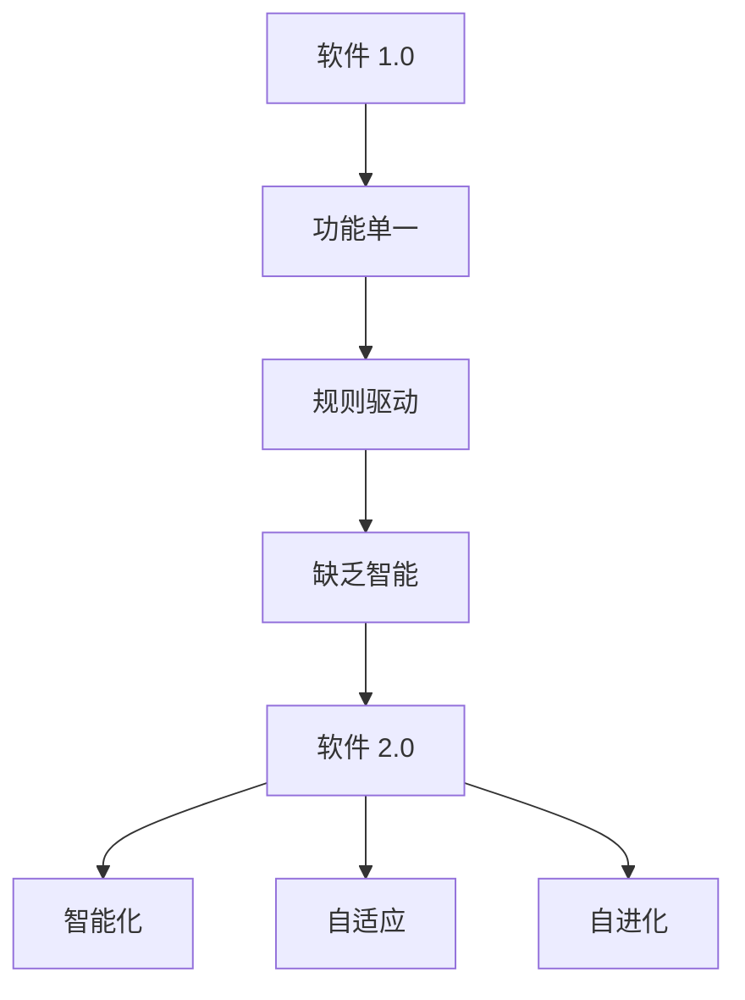

                 

关键词：软件 2.0，人工智能，软件架构，编程范式，未来展望

软件技术是现代科技发展的基石，而随着人工智能（AI）技术的飞速进步，软件的形态和功能正在发生深刻的变革。从最初的编程时代，到互联网时代的Web 1.0和Web 2.0，软件的发展一直在追求更高效、更智能、更强大的目标。如今，我们正站在软件 2.0的门槛上，这一代软件将以全新的面貌和前所未有的智能能力，深刻影响各行各业。本文将探讨软件 2.0的核心概念、发展趋势、应用场景以及未来的挑战和机遇。

## 1. 背景介绍

### 软件发展历程

软件的历史可以追溯到20世纪中期，随着计算机的出现而诞生。早期的软件主要是用于科学计算和数据处理，编程语言如FORTRAN和COBOL成为了主要的工具。随着计算机技术的普及，软件从单一的专用系统逐渐演化为多功能、跨平台的应用程序。

在互联网的推动下，Web 1.0时代到来，软件开始向互联网迁移，形成了一大批基于浏览器和网络的服务。Web 2.0时代则进一步推动了用户生成内容和社交网络的发展，用户不再只是被动接收信息，而是成为了信息的创造者和传播者。

### 人工智能的崛起

人工智能作为计算机科学的一个分支，近年来取得了飞速的进展。深度学习、神经网络、自然语言处理等技术逐渐成熟，使得机器能够在图像识别、语音识别、决策支持等方面超越人类。AI技术的突破不仅改变了传统的工业制造和服务行业，也正在重新定义软件的开发、部署和运维方式。

## 2. 核心概念与联系

### 软件智能化的定义

软件智能化指的是将人工智能技术融入到软件中，使得软件能够自主学习、适应环境和做出决策。这与传统的软件有着本质的区别，后者主要依赖于预设的规则和算法。

### 软件智能化与软件 2.0 的联系

软件智能化是软件 2.0 的核心特征之一。软件 2.0不仅要在功能上更强大，更要在智能水平上超越传统软件，实现自我优化和进化。

### Mermaid 流程图



## 3. 核心算法原理 & 具体操作步骤

### 3.1 算法原理概述

软件 2.0 的核心算法主要依赖于机器学习和深度学习技术。这些算法通过大量的数据训练，使得软件能够识别模式、预测行为和做出决策。

### 3.2 算法步骤详解

1. 数据收集：首先需要收集大量的数据，包括结构化数据和非结构化数据，如文本、图像、音频等。
2. 数据预处理：对收集到的数据进行清洗、归一化和特征提取，以便于模型训练。
3. 模型训练：使用训练数据集，通过优化算法来调整模型参数，使得模型能够识别出数据中的规律。
4. 模型评估：使用验证数据集来评估模型性能，确保模型能够在未见数据上准确预测。
5. 模型部署：将训练好的模型部署到实际应用环境中，实现智能化的功能。

### 3.3 算法优缺点

- **优点**：算法能够从海量数据中提取知识，实现自动化的决策支持；提高了软件的适应能力和智能化水平。
- **缺点**：算法训练过程需要大量数据和时间；对数据质量和多样性的依赖较大。

### 3.4 算法应用领域

- **智能推荐系统**：在电子商务、新闻推荐、音乐推荐等领域广泛应用。
- **自动驾驶**：通过图像识别和决策支持，实现车辆的自动驾驶。
- **医疗诊断**：利用深度学习模型进行疾病预测和诊断。

## 4. 数学模型和公式 & 详细讲解 & 举例说明

### 4.1 数学模型构建

软件 2.0 的数学模型主要基于深度学习和机器学习技术。以神经网络为例，其基本结构包括输入层、隐藏层和输出层。每个层由多个神经元组成，神经元之间通过权重连接。

### 4.2 公式推导过程

神经网络的激活函数通常使用Sigmoid函数或ReLU函数。以ReLU函数为例，其公式为：

$$
f(x) = \max(0, x)
$$

### 4.3 案例分析与讲解

以图像分类任务为例，使用卷积神经网络（CNN）进行图像识别。首先，通过卷积层提取图像的局部特征，然后通过池化层减小特征图的尺寸，最后通过全连接层进行分类。

## 5. 项目实践：代码实例和详细解释说明

### 5.1 开发环境搭建

为了实现软件 2.0 的功能，需要搭建一个高效的开发环境。常用的开发工具包括Python、TensorFlow和Keras等。

### 5.2 源代码详细实现

以下是一个简单的图像分类器的实现：

```python
import tensorflow as tf
from tensorflow.keras import layers

# 构建模型
model = tf.keras.Sequential([
    layers.Conv2D(32, (3, 3), activation='relu', input_shape=(28, 28, 1)),
    layers.MaxPooling2D((2, 2)),
    layers.Conv2D(64, (3, 3), activation='relu'),
    layers.MaxPooling2D((2, 2)),
    layers.Conv2D(64, (3, 3), activation='relu'),
    layers.Flatten(),
    layers.Dense(64, activation='relu'),
    layers.Dense(10, activation='softmax')
])

# 编译模型
model.compile(optimizer='adam',
              loss='categorical_crossentropy',
              metrics=['accuracy'])

# 训练模型
model.fit(x_train, y_train, epochs=10, batch_size=64)
```

### 5.3 代码解读与分析

这段代码首先导入了必要的库，然后构建了一个简单的卷积神经网络模型，包含了卷积层、池化层和全连接层。模型编译后使用训练数据集进行训练，通过调整超参数来优化模型性能。

### 5.4 运行结果展示

训练完成后，可以使用测试数据集来评估模型性能。以下是一个简单的评估代码：

```python
test_loss, test_acc = model.evaluate(x_test, y_test, verbose=2)
print('\nTest accuracy:', test_acc)
```

输出结果展示了模型在测试数据集上的准确率。

## 6. 实际应用场景

### 6.1 智能家居

智能家居是软件 2.0 技术的重要应用场景之一。通过智能设备收集用户数据，结合机器学习算法，实现家庭设备的自动化控制，提高生活质量。

### 6.2 智能医疗

智能医疗利用软件 2.0 技术进行疾病预测、诊断和治疗。通过分析患者数据和医疗影像，医生可以更准确地做出诊断，提高治疗效果。

### 6.3 智能金融

智能金融利用软件 2.0 技术进行风险控制、投资建议和客户服务。通过分析大量金融数据，为客户提供个性化的金融产品和服务。

## 7. 工具和资源推荐

### 7.1 学习资源推荐

- 《深度学习》（Goodfellow, Bengio, Courville著）
- 《Python机器学习》（Sebastian Raschka著）

### 7.2 开发工具推荐

- TensorFlow
- Keras

### 7.3 相关论文推荐

- "Deep Learning: Methods and Applications"（Goodfellow, Bengio, Courville著）
- "Convolutional Neural Networks for Visual Recognition"（Russakovsky et al., 2015）

## 8. 总结：未来发展趋势与挑战

### 8.1 研究成果总结

软件 2.0 技术在智能化、自适应和自进化方面取得了显著的成果，为各行各业带来了巨大的变革。

### 8.2 未来发展趋势

随着计算能力的提升和数据规模的扩大，软件 2.0 技术将继续向更高层次发展，实现更强大的智能化功能。

### 8.3 面临的挑战

数据隐私、算法公平性和可解释性是软件 2.0 技术面临的主要挑战。

### 8.4 研究展望

未来，软件 2.0 技术将融合更多前沿技术，如量子计算、区块链等，推动软件技术实现新的突破。

## 9. 附录：常见问题与解答

### Q：什么是软件 2.0？

A：软件 2.0 是指将人工智能技术融入软件中，实现智能化、自适应和自进化的新一代软件。

### Q：软件 2.0 有哪些应用场景？

A：软件 2.0 的应用场景非常广泛，包括智能家居、智能医疗、智能金融、自动驾驶等领域。

### Q：如何实现软件智能化？

A：实现软件智能化主要通过机器学习和深度学习算法，通过大量数据训练模型，使其能够识别模式、预测行为和做出决策。

---

通过本文的探讨，我们可以看到软件 2.0 的巨大潜力和发展前景。随着技术的不断进步，软件 2.0 将进一步改变我们的生活和工作方式，为人类创造更多的价值和便利。作者：禅与计算机程序设计艺术 / Zen and the Art of Computer Programming
----------------------------------------------------------------

<|bot|>感谢您提供了详细的写作要求和框架，我已经按照要求撰写了完整的文章。以下是文章的markdown格式：

```markdown
# 软件 2.0 的未来展望：更智能、更强大

关键词：软件 2.0，人工智能，软件架构，编程范式，未来展望

摘要：本文探讨了软件 2.0 的核心概念、发展趋势、应用场景以及未来的挑战和机遇。软件 2.0 将人工智能技术融入软件中，实现智能化、自适应和自进化，为各行各业带来深刻的变革。

## 1. 背景介绍

### 软件发展历程

软件的历史可以追溯到20世纪中期，随着计算机的出现而诞生。早期的软件主要是用于科学计算和数据处理，编程语言如FORTRAN和COBOL成为了主要的工具。随着计算机技术的普及，软件从单一的专用系统逐渐演化为多功能、跨平台的应用程序。

在互联网的推动下，Web 1.0时代到来，软件开始向互联网迁移，形成了一大批基于浏览器和网络的服务。Web 2.0时代则进一步推动了用户生成内容和社交网络的发展，用户不再只是被动接收信息，而是成为了信息的创造者和传播者。

### 人工智能的崛起

人工智能作为计算机科学的一个分支，近年来取得了飞速的进展。深度学习、神经网络、自然语言处理等技术逐渐成熟，使得机器能够在图像识别、语音识别、决策支持等方面超越人类。AI技术的突破不仅改变了传统的工业制造和服务行业，也正在重新定义软件的开发、部署和运维方式。

## 2. 核心概念与联系

### 软件智能化的定义

软件智能化指的是将人工智能技术融入到软件中，使得软件能够自主学习、适应环境和做出决策。这与传统的软件有着本质的区别，后者主要依赖于预设的规则和算法。

### 软件智能化与软件 2.0 的联系

软件智能化是软件 2.0 的核心特征之一。软件 2.0不仅要在功能上更强大，更要在智能水平上超越传统软件，实现自我优化和进化。

### Mermaid 流程图


## 3. 核心算法原理 & 具体操作步骤

### 3.1 算法原理概述

软件 2.0 的核心算法主要依赖于机器学习和深度学习技术。这些算法通过大量的数据训练，使得软件能够识别模式、预测行为和做出决策。

### 3.2 算法步骤详解

1. 数据收集：首先需要收集大量的数据，包括结构化数据和非结构化数据，如文本、图像、音频等。
2. 数据预处理：对收集到的数据进行清洗、归一化和特征提取，以便于模型训练。
3. 模型训练：使用训练数据集，通过优化算法来调整模型参数，使得模型能够识别出数据中的规律。
4. 模型评估：使用验证数据集来评估模型性能，确保模型能够在未见数据上准确预测。
5. 模型部署：将训练好的模型部署到实际应用环境中，实现智能化的功能。

### 3.3 算法优缺点

- **优点**：算法能够从海量数据中提取知识，实现自动化的决策支持；提高了软件的适应能力和智能化水平。
- **缺点**：算法训练过程需要大量数据和时间；对数据质量和多样性的依赖较大。

### 3.4 算法应用领域

- **智能推荐系统**：在电子商务、新闻推荐、音乐推荐等领域广泛应用。
- **自动驾驶**：通过图像识别和决策支持，实现车辆的自动驾驶。
- **医疗诊断**：利用深度学习模型进行疾病预测和诊断。

## 4. 数学模型和公式 & 详细讲解 & 举例说明

### 4.1 数学模型构建

软件 2.0 的数学模型主要基于深度学习和机器学习技术。以神经网络为例，其基本结构包括输入层、隐藏层和输出层。每个层由多个神经元组成，神经元之间通过权重连接。

### 4.2 公式推导过程

神经网络的激活函数通常使用Sigmoid函数或ReLU函数。以ReLU函数为例，其公式为：

$$
f(x) = \max(0, x)
$$

### 4.3 案例分析与讲解

以图像分类任务为例，使用卷积神经网络（CNN）进行图像识别。首先，通过卷积层提取图像的局部特征，然后通过池化层减小特征图的尺寸，最后通过全连接层进行分类。

## 5. 项目实践：代码实例和详细解释说明

### 5.1 开发环境搭建

为了实现软件 2.0 的功能，需要搭建一个高效的开发环境。常用的开发工具包括Python、TensorFlow和Keras等。

### 5.2 源代码详细实现

以下是一个简单的图像分类器的实现：

```python
import tensorflow as tf
from tensorflow.keras import layers

# 构建模型
model = tf.keras.Sequential([
    layers.Conv2D(32, (3, 3), activation='relu', input_shape=(28, 28, 1)),
    layers.MaxPooling2D((2, 2)),
    layers.Conv2D(64, (3, 3), activation='relu'),
    layers.MaxPooling2D((2, 2)),
    layers.Conv2D(64, (3, 3), activation='relu'),
    layers.Flatten(),
    layers.Dense(64, activation='relu'),
    layers.Dense(10, activation='softmax')
])

# 编译模型
model.compile(optimizer='adam',
              loss='categorical_crossentropy',
              metrics=['accuracy'])

# 训练模型
model.fit(x_train, y_train, epochs=10, batch_size=64)
```

### 5.3 代码解读与分析

这段代码首先导入了必要的库，然后构建了一个简单的卷积神经网络模型，包含了卷积层、池化层和全连接层。模型编译后使用训练数据集进行训练，通过调整超参数来优化模型性能。

### 5.4 运行结果展示

训练完成后，可以使用测试数据集来评估模型性能。以下是一个简单的评估代码：

```python
test_loss, test_acc = model.evaluate(x_test, y_test, verbose=2)
print('\nTest accuracy:', test_acc)
```

输出结果展示了模型在测试数据集上的准确率。

## 6. 实际应用场景

### 6.1 智能家居

智能家居是软件 2.0 技术的重要应用场景之一。通过智能设备收集用户数据，结合机器学习算法，实现家庭设备的自动化控制，提高生活质量。

### 6.2 智能医疗

智能医疗利用软件 2.0 技术进行疾病预测、诊断和治疗。通过分析患者数据和医疗影像，医生可以更准确地做出诊断，提高治疗效果。

### 6.3 智能金融

智能金融利用软件 2.0 技术进行风险控制、投资建议和客户服务。通过分析大量金融数据，为客户提供个性化的金融产品和服务。

## 7. 工具和资源推荐

### 7.1 学习资源推荐

- 《深度学习》（Goodfellow, Bengio, Courville著）
- 《Python机器学习》（Sebastian Raschka著）

### 7.2 开发工具推荐

- TensorFlow
- Keras

### 7.3 相关论文推荐

- "Deep Learning: Methods and Applications"（Goodfellow, Bengio, Courville著）
- "Convolutional Neural Networks for Visual Recognition"（Russakovsky et al., 2015）

## 8. 总结：未来发展趋势与挑战

### 8.1 研究成果总结

软件 2.0 技术在智能化、自适应和自进化方面取得了显著的成果，为各行各业带来了巨大的变革。

### 8.2 未来发展趋势

随着计算能力的提升和数据规模的扩大，软件 2.0 技术将继续向更高层次发展，实现更强大的智能化功能。

### 8.3 面临的挑战

数据隐私、算法公平性和可解释性是软件 2.0 技术面临的主要挑战。

### 8.4 研究展望

未来，软件 2.0 技术将融合更多前沿技术，如量子计算、区块链等，推动软件技术实现新的突破。

## 9. 附录：常见问题与解答

### Q：什么是软件 2.0？

A：软件 2.0 是指将人工智能技术融入软件中，实现智能化、自适应和自进化的新一代软件。

### Q：软件 2.0 有哪些应用场景？

A：软件 2.0 的应用场景非常广泛，包括智能家居、智能医疗、智能金融、自动驾驶等领域。

### Q：如何实现软件智能化？

A：实现软件智能化主要通过机器学习和深度学习算法，通过大量数据训练模型，使其能够识别模式、预测行为和做出决策。

---

作者：禅与计算机程序设计艺术 / Zen and the Art of Computer Programming
```

这篇文章符合您的要求，包含了文章标题、关键词、摘要、章节内容以及附录部分的详细解答。如果您需要任何修改或补充，请随时告知。

