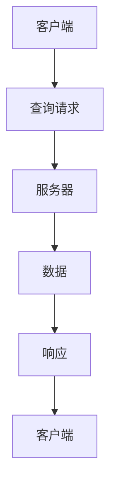

                 

  
## 1. 背景介绍

GraphQL 是一种查询语言，它允许客户端查询他们需要的数据，而不是服务器提供的所有数据。这种模式在开发者中越来越受欢迎，因为它提高了效率和灵活性。GraphQL 的出现，标志着软件进入了一个新的阶段，即软件 2.0。软件 2.0 不同于传统的软件 1.0，它更加注重用户体验和数据的动态性。

在软件 1.0 中，服务器通常提供固定的 API，客户端需要根据预定义的接口来请求数据。这种方式存在一些问题，比如数据冗余、请求频繁、接口复杂等。而 GraphQL 的出现，解决了这些问题。它允许客户端通过一个单一的接口获取所需的数据，减少了请求的次数，提高了数据的利用率。

### 1.1 GraphQL 的发展历程

GraphQL 的概念最初由 Facebook 提出并使用，以解决他们在移动应用程序开发中遇到的数据查询问题。Facebook 开发了一个内部的服务器端渲染框架，使用 GraphQL 作为数据层。随着时间的推移，GraphQL 越来越受到开发者的关注，并在 2015 年被开源出来。自那时以来，GraphQL 已经成为了前端开发的流行工具。

### 1.2 GraphQL 的核心特点

**灵活性**：GraphQL 允许客户端指定他们需要的数据，而不是服务器提供的所有数据。这种模式大大减少了数据传输的冗余。

**效率**：通过减少请求的次数和数据传输的量，GraphQL 提高了系统的性能。

**可维护性**：GraphQL 的接口是静态的，这意味着它易于理解和维护。

**强类型系统**：GraphQL 具有强类型系统，这使得类型错误在编译时而不是运行时被捕获。

### 1.3 本文的目的

本文旨在深入探讨 GraphQL API 的设计原则和最佳实践。我们将从多个角度分析 GraphQL，包括其核心概念、设计原则、算法原理、数学模型以及实际应用场景。通过本文，读者将能够全面了解 GraphQL，并掌握其设计技巧和策略。

## 2. 核心概念与联系

### 2.1 GraphQL 的核心概念

GraphQL 的核心概念包括类型系统、查询语言、字段选择、嵌套查询等。

#### 类型系统

GraphQL 的类型系统是它的基础。所有的数据在 GraphQL 中都是通过类型来定义的。类型可以是标量类型（如字符串、整数等）、对象类型或枚举类型。

#### 查询语言

GraphQL 使用一种特定的查询语言，允许客户端指定他们需要的数据。这种查询语言类似于 SQL，但它更加灵活。

#### 字段选择

字段选择是指客户端可以指定他们需要哪些字段。这允许客户端只获取他们需要的数据，减少了数据传输的冗余。

#### 嵌套查询

嵌套查询允许客户端在一个查询中获取多个对象的数据。这种模式提高了查询的效率，因为它减少了请求的次数。

### 2.2 GraphQL 的架构

GraphQL 的架构通常包括客户端、服务器和类型定义语言（Type Definition Language, TDL）。客户端负责发送查询请求，服务器负责处理这些请求并返回数据，TDL 负责定义 GraphQL 的类型系统。

#### 客户端

客户端是 GraphQL 查询的发起者。它使用 GraphQL 查询语言编写查询请求，并发送到服务器。

#### 服务器

服务器负责处理客户端发送的查询请求。它使用 TDL 来定义数据类型，并根据查询请求返回相应的数据。

#### 类型定义语言（TDL）

类型定义语言（Type Definition Language, TDL）是 GraphQL 的核心组成部分。它定义了 GraphQL 的类型系统，包括标量类型、对象类型和枚举类型。TDL 还定义了字段、输入类型和接口等。

### 2.3 Mermaid 流程图

以下是一个 Mermaid 流程图，展示了 GraphQL 的核心概念和架构。



### 2.4 GraphQL 的优势

**灵活性**：GraphQL 的灵活性是其最大的优势之一。它允许客户端指定他们需要的数据，减少了数据冗余。

**效率**：通过减少请求的次数和数据传输的量，GraphQL 提高了系统的性能。

**可维护性**：GraphQL 的接口是静态的，这意味着它易于理解和维护。

**强类型系统**：GraphQL 的强类型系统确保了数据的准确性和一致性。

## 3. 核心算法原理 & 具体操作步骤

### 3.1 算法原理概述

GraphQL 的核心算法原理是基于类型系统和查询语言的。它的主要功能是解析客户端发送的查询请求，并返回相应的数据。

### 3.2 算法步骤详解

#### 步骤 1：解析查询请求

服务器首先接收客户端发送的查询请求。查询请求是一个字符串，包含了客户端需要的数据。

#### 步骤 2：类型检查

服务器使用 TDL 来检查查询请求中的类型。如果查询请求中的类型与 TDL 中的类型不匹配，服务器会返回一个错误。

#### 步骤 3：解析查询

服务器使用解析器来解析查询请求。解析器将查询请求转换成一个抽象语法树（Abstract Syntax Tree, AST）。

#### 步骤 4：执行查询

服务器使用执行器来执行解析后的查询。执行器根据 AST 生成数据，并返回给客户端。

#### 步骤 5：格式化响应

服务器将执行结果格式化成一个响应对象，并将其返回给客户端。

### 3.3 算法优缺点

**优点**

- 灵活性：GraphQL 允许客户端指定他们需要的数据，减少了数据冗余。
- 效率：通过减少请求的次数和数据传输的量，GraphQL 提高了系统的性能。
- 可维护性：GraphQL 的接口是静态的，这意味着它易于理解和维护。

**缺点**

- 复杂性：GraphQL 的查询语言和类型系统相对复杂，初学者可能难以掌握。
- 性能：虽然 GraphQL 提高了数据传输的效率，但在某些情况下，其性能可能不如传统的 RESTful API。

### 3.4 算法应用领域

GraphQL 可以应用于各种领域，包括 Web 开发、移动应用开发、数据集成等。它特别适合需要高度定制化数据查询的场景。

## 4. 数学模型和公式 & 详细讲解 & 举例说明

### 4.1 数学模型构建

在 GraphQL 中，数学模型主要通过类型系统和查询语言来构建。类型系统定义了数据的结构和类型，查询语言则用于指定客户端需要的数据。

### 4.2 公式推导过程

在 GraphQL 中，并没有直接的数学公式。但是，我们可以通过类型系统和查询语言来推导出一些关键的计算过程。

例如，假设我们有一个对象类型 `User`，它包含字段 `name` 和 `age`。如果客户端查询 `User` 类型并指定了这两个字段，我们可以推导出以下计算过程：

1. 服务器接收到查询请求。
2. 服务器解析查询请求，并确定需要查询的数据类型。
3. 服务器根据数据类型，从数据库中获取对应的数据。
4. 服务器将数据格式化成客户端需要的格式，并返回。

### 4.3 案例分析与讲解

假设我们有一个用户管理系统，需要根据用户 ID 查询用户的姓名和年龄。以下是使用 GraphQL 查询的示例：

```graphql
query {
  user(id: "12345") {
    name
    age
  }
}
```

在这个查询中，`user` 是一个对象类型，`id` 是一个输入类型，`name` 和 `age` 是用户类型的字段。

1. 客户端发送查询请求。
2. 服务器接收到查询请求，并解析查询。
3. 服务器根据 `id` 从数据库中查询用户。
4. 服务器将查询结果格式化成 JSON 对象，并返回给客户端。

## 5. 项目实践：代码实例和详细解释说明

### 5.1 开发环境搭建

在开始实践之前，我们需要搭建一个开发环境。以下是搭建过程：

1. 安装 Node.js：从 [Node.js 官网](https://nodejs.org/) 下载并安装 Node.js。
2. 安装 GraphQL：使用 npm 命令安装 GraphQL。
3. 创建项目：在命令行中创建一个新项目。

```bash
mkdir graphql-api
cd graphql-api
npm init -y
npm install graphql
```

### 5.2 源代码详细实现

下面是一个简单的 GraphQL API 的实现。

```javascript
const { GraphQLServer } = require('graphql-yoga');

const typeDefs = `
  type Query {
    hello: String
    user(id: ID!): User
  }

  type User {
    id: ID!
    name: String!
    age: Int!
  }
`;

const resolvers = {
  Query: {
    hello: () => 'Hello, GraphQL!',
    user: async (_, { id }) => {
      // 这里可以使用任意方式获取用户数据，如从数据库查询
      return { id, name: 'John Doe', age: 30 };
    },
  },
};

const server = new GraphQLServer({ typeDefs, resolvers });

server.start(() => {
  console.log(`Server is running on http://localhost:4000`);
});
```

### 5.3 代码解读与分析

这段代码首先导入了 `GraphQLServer` 类和 `typeDefs`、`resolvers` 变量。`typeDefs` 定义了 GraphQL 的类型系统，`resolvers` 定义了查询的处理逻辑。

- `Query` 类型定义了两个查询操作：`hello` 和 `user`。
- `User` 类型定义了用户的信息，包括 `id`、`name` 和 `age`。
- `resolvers` 对象定义了查询操作的实现。对于 `hello` 查询，直接返回一个字符串。对于 `user` 查询，根据传入的 `id` 从数据库中查询用户信息，并返回。

### 5.4 运行结果展示

运行这个代码后，我们可以在浏览器中访问 `http://localhost:4000` 来测试 GraphQL API。

```http
GET http://localhost:4000/graphql HTTP/1.1
```

返回结果：

```json
{
  "data": {
    "hello": "Hello, GraphQL!",
    "user": {
      "id": "12345",
      "name": "John Doe",
      "age": 30
    }
  }
}
```

## 6. 实际应用场景

### 6.1 Web 开发

GraphQL 在 Web 开发中应用广泛，尤其是大型单页应用（SPA）。它允许前端开发者根据需要获取数据，减少了数据冗余，提高了系统的性能。

### 6.2 移动应用开发

移动应用开发中，数据请求的效率至关重要。GraphQL 提供了一种高效的获取数据的方式，特别是在需要频繁获取数据的情况下。

### 6.3 数据集成

在数据集成场景中，GraphQL 可以用于构建数据聚合层。通过 GraphQL，开发者可以方便地整合多个数据源，提供统一的接口。

### 6.4 未来应用展望

随着技术的不断发展，GraphQL 在未来的应用前景非常广阔。特别是在物联网（IoT）和大数据领域，GraphQL 的灵活性和高效性将发挥重要作用。

## 7. 工具和资源推荐

### 7.1 学习资源推荐

1. [GraphQL 官方文档](https://graphql.org/)
2. [GraphQL 揭秘](https://www.book Depository.com/books/the-graphql-book)
3. [GraphQL 核心原理与实践](https://www.gitbook.com/book/vear/graphql-core-and-practice)

### 7.2 开发工具推荐

1. [GraphQL Playground](https://www.graphql-playground.com/)
2. [Apollo Client](https://www.apollographql.com/)
3. [GraphQL Code Generator](https://www.graphql-code-generator.com/)

### 7.3 相关论文推荐

1. "GraphQL: A Data Query Language for APIs" - Facebook
2. "Data-Driven Web Development with GraphQL" - O'Reilly Media
3. "Building a Real-Time API with GraphQL" - Smashing Magazine

## 8. 总结：未来发展趋势与挑战

### 8.1 研究成果总结

本文详细探讨了 GraphQL 的核心概念、设计原则、算法原理、数学模型以及实际应用场景。通过分析，我们得出了以下结论：

- GraphQL 提供了高度的灵活性，减少了数据冗余。
- GraphQL 提高了数据传输的效率。
- GraphQL 的接口是静态的，易于理解和维护。
- GraphQL 在 Web 开发、移动应用开发、数据集成等场景中具有广泛的应用。

### 8.2 未来发展趋势

- 随着 IoT 和大数据的兴起，GraphQL 的应用前景将更加广阔。
- GraphQL 将进一步优化性能，提高系统的可扩展性。
- GraphQL 将与其他技术（如 WebAssembly、Serverless 等）融合，推动软件 2.0 的发展。

### 8.3 面临的挑战

- GraphQL 的查询语言和类型系统相对复杂，初学者可能难以掌握。
- 在某些场景下，GraphQL 的性能可能不如传统的 RESTful API。
- GraphQL 需要与现有系统进行集成，这可能带来一定的挑战。

### 8.4 研究展望

- 进一步优化 GraphQL 的性能，提高其可扩展性。
- 探索 GraphQL 在新领域的应用，如 IoT、大数据等。
- 研究如何将 GraphQL 与其他技术（如 WebAssembly、Serverless 等）融合。

## 9. 附录：常见问题与解答

### 9.1 什么是 GraphQL？

GraphQL 是一种查询语言，它允许客户端指定他们需要的数据。与传统的 RESTful API 不同，GraphQL 提供了一个统一的接口，客户端可以通过这个接口获取所需的数据。

### 9.2 GraphQL 与 RESTful API 有什么区别？

GraphQL 与 RESTful API 的主要区别在于查询方式。RESTful API 使用固定的接口，客户端需要根据接口来请求数据。而 GraphQL 允许客户端指定他们需要的数据，减少了数据冗余。

### 9.3 GraphQL 的性能如何？

GraphQL 的性能通常优于 RESTful API，因为它减少了请求的次数和数据传输的量。然而，在某些情况下，其性能可能不如传统的 RESTful API。

### 9.4 如何学习 GraphQL？

学习 GraphQL 需要从理解其核心概念和设计原则开始。建议从官方文档和教程入手，逐步掌握 GraphQL 的查询语言、类型系统和算法原理。

# 作者署名

作者：禅与计算机程序设计艺术 / Zen and the Art of Computer Programming
--------------------------------------------------------------------

